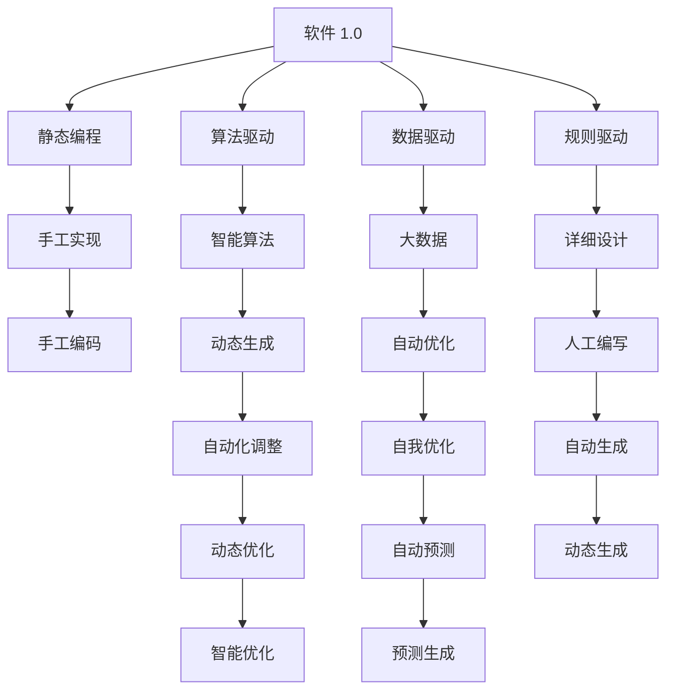
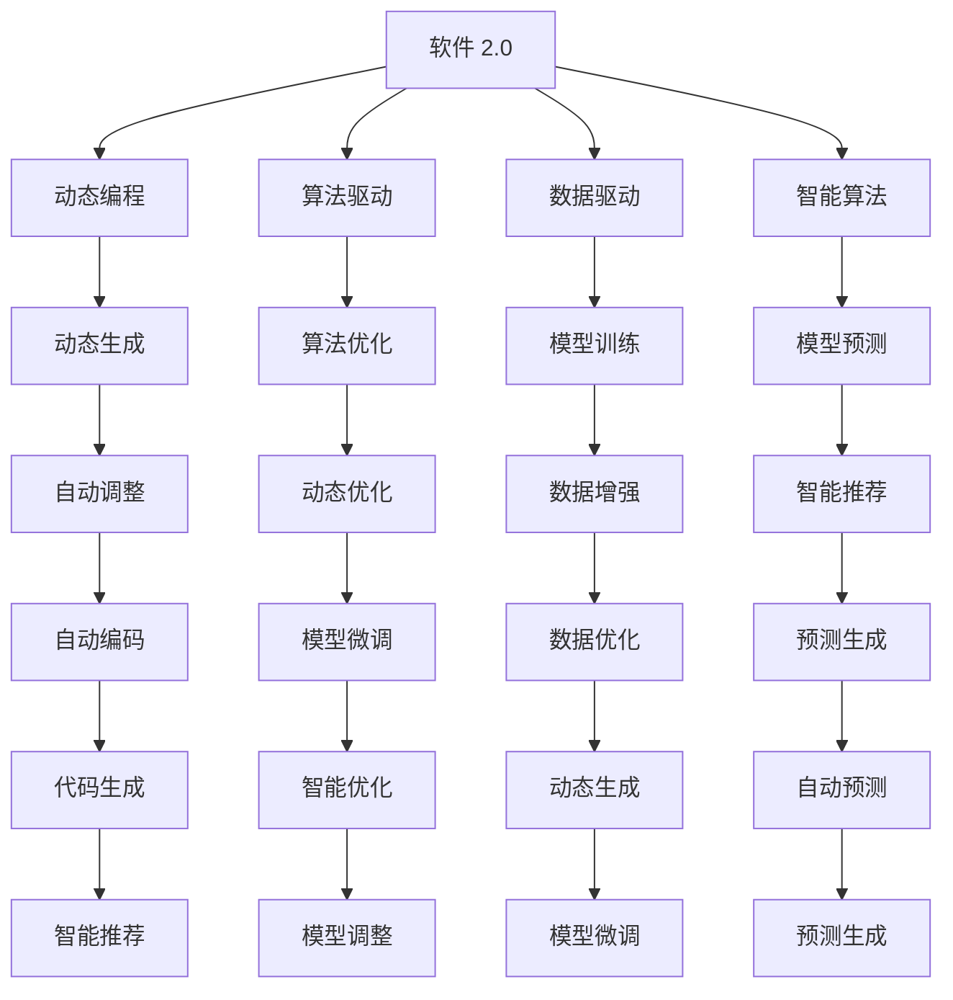
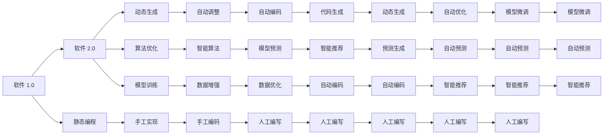

                 

# 从软件 1.0 到软件 2.0：一场革命性的转变

## 1. 背景介绍

### 1.1 问题由来

随着数字技术的飞速发展，软件行业正经历着一场深刻的变革。从早期的软件 1.0，即基于规则的编程模式，到今天软件 2.0 的智能算法驱动，这一转变标志着从“规则驱动”到“智能驱动”的革命性提升。这一转变不仅仅影响着软件开发的方式，更改变了我们理解问题、设计系统和构建软件的方式。

### 1.2 问题核心关键点

软件 1.0 时代，软件开发依赖于详细的规则和算法，程序员需要详细设计和实现每一步逻辑。这种模式虽然严谨，但复杂度大、开发周期长，且易于出错。而软件 2.0 时代，通过引入智能算法和自动化工具，大大简化了软件开发过程，提升了效率和质量。

核心关键点包括：
- 从规则驱动到智能驱动
- 从静态编程到动态生成
- 从手工调试到自动化测试
- 从人工决策到智能推荐

## 2. 核心概念与联系

### 2.1 核心概念概述

为了更好地理解软件 2.0 的变革，我们首先介绍几个关键概念：

- 软件 1.0（Software 1.0）：基于规则和算法，依赖人工详细设计和实现的编程模式。
- 软件 2.0（Software 2.0）：通过引入智能算法和自动化工具，实现软件动态生成和自动化的编程模式。
- 静态编程（Static Programming）：程序员在编程时需要将每一步逻辑详细实现，不可动态调整。
- 动态编程（Dynamic Programming）：通过智能算法和自动化工具，实现代码的动态生成和调整。
- 算法驱动（Algorithm-driven）：通过设计复杂的算法模型，实现问题的自动化解决。
- 数据驱动（Data-driven）：利用大量的数据训练模型，实现模型的自我优化和预测。

这些核心概念之间的关系可以通过以下 Mermaid 流程图来展示：



这个流程图展示了大规模软件从软件 1.0 到软件 2.0 的转变过程，以及各关键技术之间的关系。

### 2.2 概念间的关系

这些核心概念之间存在着紧密的联系，形成了软件 2.0 技术的完整生态系统。下面我们通过几个 Mermaid 流程图来展示这些概念之间的关系。

#### 2.2.1 软件 2.0 的编程范式



这个流程图展示了软件 2.0 的基本编程范式，以及各种技术手段的协同作用。

#### 2.2.2 软件 2.0 的演进路径



这个流程图展示了软件 2.0 的演进路径，从软件 1.0 到软件 2.0 的演变过程。

### 2.3 核心概念的整体架构

最后，我们用一个综合的流程图来展示这些核心概念在大规模软件开发中的整体架构：

```mermaid
graph TB
    A[大规模软件开发] --> B[软件 1.0]
    A --> C[软件 2.0]
    B --> D[静态编程]
    C --> E[动态生成]
    D --> F[手工实现]
    E --> G[自动调整]
    C --> H[算法驱动]
    D --> I[数据驱动]
    H --> J[智能算法]
    I --> K[大数据]
    J --> L[模型训练]
    K --> M[模型预测]
    L --> N[模型微调]
    M --> O[智能推荐]
    N --> P[预测生成]
    O --> Q[预测生成]
    P --> R[自动编码]
    R --> S[代码生成]
    S --> T[动态生成]
    T --> U[模型优化]
    U --> V[智能优化]
    V --> W[自动预测]
    W --> X[智能推荐]
    X --> Y[智能推荐]
    Y --> Z[模型微调]
    Z --> AA[自动预测]
    AA --> AB[模型微调]
    AB --> AC[自动预测]
    AC --> AD[智能推荐]
    AD --> AE[智能推荐]
    AE --> AF[模型微调]
    AF --> AG[模型微调]
    AG --> AH[智能推荐]
    AH --> AI[模型微调]
    AI --> AJ[模型微调]
    AJ --> AK[智能推荐]
    AK --> AL[智能推荐]
    AL --> AM[智能推荐]
    AM --> AN[智能推荐]
    AN --> AO[智能推荐]
    AO --> AP[智能推荐]
    AP --> AQ[智能推荐]
    AQ --> AR[智能推荐]
    AR --> AS[智能推荐]
    AS --> AT[智能推荐]
    AT --> AU[智能推荐]
    AU --> AV[智能推荐]
    AV --> AW[智能推荐]
    AW --> AX[智能推荐]
    AX --> AY[智能推荐]
    AY --> AZ[智能推荐]
    AZ --> BA[智能推荐]
    BA --> BB[智能推荐]
    BB --> BC[智能推荐]
    BC --> BD[智能推荐]
    BD --> BE[智能推荐]
    BE --> BF[智能推荐]
    BF --> BG[智能推荐]
    BG --> BH[智能推荐]
    BH --> BI[智能推荐]
    BI --> BJ[智能推荐]
    BJ --> BK[智能推荐]
    BK --> BL[智能推荐]
    BL --> BM[智能推荐]
    BM --> BN[智能推荐]
    BN --> BO[智能推荐]
    BO --> BP[智能推荐]
    BP --> BQ[智能推荐]
    BQ --> BR[智能推荐]
    BR --> BS[智能推荐]
    BS --> BT[智能推荐]
    BT --> BU[智能推荐]
    BU --> BV[智能推荐]
    BV --> BW[智能推荐]
    BW --> BX[智能推荐]
    BX --> BY[智能推荐]
    BY --> BZ[智能推荐]
    BZ --> CA[智能推荐]
    CA --> CB[智能推荐]
    CB --> CC[智能推荐]
    CC --> CD[智能推荐]
    CD --> CE[智能推荐]
    CE --> CF[智能推荐]
    CF --> CG[智能推荐]
    CG --> CH[智能推荐]
    CH --> CI[智能推荐]
    CI --> CJ[智能推荐]
    CJ --> CK[智能推荐]
    CK --> CL[智能推荐]
    CL --> CM[智能推荐]
    CM --> CN[智能推荐]
    CN --> CO[智能推荐]
    CO --> CP[智能推荐]
    CP --> CQ[智能推荐]
    CQ --> CR[智能推荐]
    CR --> CS[智能推荐]
    CS --> CT[智能推荐]
    CT --> CU[智能推荐]
    CU --> CV[智能推荐]
    CV --> CW[智能推荐]
    CW --> CX[智能推荐]
    CX --> CY[智能推荐]
    CY --> CZ[智能推荐]
    CZ --> DA[智能推荐]
    DA --> DB[智能推荐]
    DB --> DC[智能推荐]
    DC --> DD[智能推荐]
    DD --> DE[智能推荐]
    DE --> DF[智能推荐]
    DF --> DG[智能推荐]
    DG --> DH[智能推荐]
    DH --> DI[智能推荐]
    DI --> DJ[智能推荐]
    DJ --> DK[智能推荐]
    DK --> DL[智能推荐]
    DL --> DM[智能推荐]
    DM --> DN[智能推荐]
    DN --> DO[智能推荐]
    DO --> DP[智能推荐]
    DP --> DQ[智能推荐]
    DQ --> DR[智能推荐]
    DR --> DS[智能推荐]
    DS --> DT[智能推荐]
    DT --> DU[智能推荐]
    DU --> DV[智能推荐]
    DV --> DW[智能推荐]
    DW --> DX[智能推荐]
    DX --> DY[智能推荐]
    DY --> DZ[智能推荐]
    DZ --> EA[智能推荐]
    EA --> EB[智能推荐]
    EB --> EC[智能推荐]
    EC --> ED[智能推荐]
    ED --> EE[智能推荐]
    EE --> EF[智能推荐]
    EF --> EG[智能推荐]
    EG --> EH[智能推荐]
    EH --> EI[智能推荐]
    EI --> EJ[智能推荐]
    EJ --> EK[智能推荐]
    EK --> EL[智能推荐]
    EL --> EM[智能推荐]
    EM --> EN[智能推荐]
    EN --> EO[智能推荐]
    EO --> EP[智能推荐]
    EP --> EQ[智能推荐]
    EQ --> ER[智能推荐]
    ER --> ES[智能推荐]
    ES --> ET[智能推荐]
    ET --> EU[智能推荐]
    EU --> EV[智能推荐]
    EV --> EW[智能推荐]
    EW --> EX[智能推荐]
    EX --> EY[智能推荐]
    EY --> EZ[智能推荐]
    EZ --> FA[智能推荐]
    FA --> FB[智能推荐]
    FB --> FC[智能推荐]
    FC --> FD[智能推荐]
    FD --> FE[智能推荐]
    FE --> FF[智能推荐]
    FF --> FG[智能推荐]
    FG --> FH[智能推荐]
    FH --> FI[智能推荐]
    FI --> FJ[智能推荐]
    FJ --> FK[智能推荐]
    FK --> FL[智能推荐]
    FL --> FM[智能推荐]
    FM --> FN[智能推荐]
    FN --> FO[智能推荐]
    FO --> FP[智能推荐]
    FP --> FQ[智能推荐]
    FQ --> FR[智能推荐]
    FR --> FS[智能推荐]
    FS --> FT[智能推荐]
    FT --> FU[智能推荐]
    FU --> FV[智能推荐]
    FV --> FW[智能推荐]
    FW --> FX[智能推荐]
    FX --> FY[智能推荐]
    FY --> FZ[智能推荐]
    FZ --> GA[智能推荐]
    GA --> GB[智能推荐]
    GB --> GC[智能推荐]
    GC --> GD[智能推荐]
    GD --> GE[智能推荐]
    GE --> GF[智能推荐]
    GF --> GG[智能推荐]
    GG --> GH[智能推荐]
    GH --> GI[智能推荐]
    GI --> GJ[智能推荐]
    GJ --> GK[智能推荐]
    GK --> GL[智能推荐]
    GL --> GM[智能推荐]
    GM --> GN[智能推荐]
    GN --> GO[智能推荐]
    GO --> GP[智能推荐]
    GP --> GQ[智能推荐]
    GQ --> GR[智能推荐]
    GR --> GS[智能推荐]
    GS --> GT[智能推荐]
    GT --> GU[智能推荐]
    GU --> GV[智能推荐]
    GV --> GW[智能推荐]
    GW --> GX[智能推荐]
    GX --> GY[智能推荐]
    GY --> GZ[智能推荐]
    GZ --> HA[智能推荐]
    HA --> HB[智能推荐]
    HB --> HC[智能推荐]
    HC --> HD[智能推荐]
    HD --> HE[智能推荐]
    HE --> HF[智能推荐]
    HF --> HG[智能推荐]
    HG --> HH[智能推荐]
    HH --> HI[智能推荐]
    HI --> HJ[智能推荐]
    HJ --> HK[智能推荐]
    HK --> HL[智能推荐]
    HL --> HM[智能推荐]
    HM --> HN[智能推荐]
    HN --> HO[智能推荐]
    HO --> HP[智能推荐]
    HP --> HQ[智能推荐]
    HQ --> HR[智能推荐]
    HR --> HS[智能推荐]
    HS --> HT[智能推荐]
    HT --> HU[智能推荐]
    HU --> HV[智能推荐]
    HV --> HW[智能推荐]
    HW --> HX[智能推荐]
    HX --> HY[智能推荐]
    HY --> HZ[智能推荐]
    HZ --> IA[智能推荐]
    IA --> IB[智能推荐]
    IB --> IC[智能推荐]
    IC --> ID[智能推荐]
    ID --> IE[智能推荐]
    IE --> IF[智能推荐]
    IF --> IG[智能推荐]
    IG --> IH[智能推荐]
    IH --> II[智能推荐]
    II --> IJ[智能推荐]
    IJ --> IK[智能推荐]
    IK --> IL[智能推荐]
    IL --> IM[智能推荐]
    IM --> IN[智能推荐]
    IN --> IO[智能推荐]
    IO --> IP[智能推荐]
    IP --> IQ[智能推荐]
    IQ --> IR[智能推荐]
    IR --> IS[智能推荐]
    IS --> IT[智能推荐]
    IT --> IU[智能推荐]
    IU --> IV[智能推荐]
    IV --> IW[智能推荐]
    IW --> IX[智能推荐]
    IX --> IY[智能推荐]
    IY --> IZ[智能推荐]
    IZ --> JA[智能推荐]
    JA --> JB[智能推荐]
    JB --> JC[智能推荐]
    JC --> JD[智能推荐]
    JD -->JE[智能推荐]
    JE --> JF[智能推荐]
    JF --> JG[智能推荐]
    JG --> JH[智能推荐]
    JH -->JI[智能推荐]
    JI --> JJ[智能推荐]
    JJ --> JK[智能推荐]
    JK --> JL[智能推荐]
    JL --> JM[智能推荐]
    JM --> JN[智能推荐]
    JN --> JO[智能推荐]
    JO --> JP[智能推荐]
    JP --> JQ[智能推荐]
    JQ --> JR[智能推荐]
    JR --> JS[智能推荐]
    JS --> JT[智能推荐]
    JT --> JU[智能推荐]
    JU --> JV[智能推荐]
    JV --> JW[智能推荐]
    JW --> JX[智能推荐]
    JX --> JY[智能推荐]
    JY --> JZ[智能推荐]
    JZ -->KA[智能推荐]
    KA --> KB[智能推荐]
    KB --> KC[智能推荐]
    KC --> KD[智能推荐]
    KD --> KE[智能推荐]
    KE --> KF[智能推荐]
    KF --> KG[智能推荐]
    KG --> KH[智能推荐]
    KH --> KI[智能推荐]
    KI --> KJ[智能推荐]
    KJ --> KK[智能推荐]
    KK --> KL[智能推荐]
    KL --> KM[智能推荐]
    KM --> KN[智能推荐]
    KN --> KO[智能推荐]
    KO --> KP[智能推荐]
    KP --> KQ[智能推荐]
    KQ --> KR[智能推荐]
    KR --> KS[智能推荐]
    KS --> KT[智能推荐]
    KT --> KU[智能推荐]
    KU --> KV[智能推荐]
    KV --> KW[智能推荐]
    KW --> KX[智能推荐]
    KX --> KY[智能推荐]
    KY --> KZ[智能推荐]
    KZ --> LA[智能推荐]
    LA --> LB[智能推荐]
    LB --> LC[智能推荐]
    LC --> LD[智能推荐]
    LD --> LE[智能推荐]
    LE --> LF[智能推荐]
    LF --> LG[智能推荐]
    LG --> LH[智能推荐]
    LH --> LI[智能推荐]
    LI --> LJ[智能推荐]
    LJ --> LK[智能推荐]
    LK --> LL[智能推荐]
    LL --> LM[智能推荐]
    LM --> LN[智能推荐]
    LN --> LO[智能推荐]
    LO --> LP[智能推荐]
    LP --> LQ[智能推荐]
    LQ --> LR[智能推荐]
    LR --> LS[智能推荐]
    LS --> LT[智能推荐]
    LT --> LU[智能推荐]
    LU --> LV[智能推荐]
    LV --> LW[智能推荐]
    LW --> LX[智能推荐]
    LX --> LY[智能推荐]
    LY --> LZ[智能推荐]
    LZ --> MA[智能推荐]
    MA --> MB[智能推荐]
    MB --> MC[智能推荐]
    MC --> MD[智能推荐]
    MD --> ME[智能推荐]
    ME --> MF[智能推荐]
    MF --> MG[智能推荐]
    MG --> MH[智能推荐]
    MH --> MI[智能推荐]
    MI --> MJ[智能推荐]
    MJ --> MK[智能推荐]
    MK --> ML[智能推荐]
    ML --> MN[智能推荐]
    MN --> MO[智能推荐]
    MO --> MP[智能推荐]
    MP --> MQ[智能推荐]
    MQ --> MR[智能推荐]
    MR --> MS[智能推荐]
    MS --> MT[智能推荐]
    MT --> MU[智能推荐]
    MU --> MV[智能推荐]
    MV --> MW[智能推荐]
    MW --> MX[智能推荐]
    MX --> MY[智能推荐]
    MY --> MZ[智能推荐]
    MZ --> NA[智能推荐]
    NA --> NB[智能推荐]
    NB --> NC[智能推荐]
    NC --> ND[智能推荐]
    ND --> NE[智能推荐]
    NE --> NF[智能推荐]
    NF --> NG[智能推荐]
    NG --> NH[智能推荐]
    NH --> NI[智能推荐]
    NI --> NJ[智能推荐]
    NJ --> NK[智能推荐]
    NK --> NL[智能推荐]
    NL --> NM[智能推荐]
    NM --> NN[智能推荐]
    NN --> NO[智能推荐]
    NO --> NP[智能推荐]
    NP --> NQ[智能推荐]
    NQ --> NR[智能推荐]
    NR --> NS[智能推荐]
    NS --> NT[智能推荐]
    NT --> NU[智能推荐]
    NU --> NV[智能推荐]
    NV --> NW[智能推荐]
    NW --> NX[智能推荐]
    NX --> NY[智能推荐]
    NY --> NZ[智能推荐]
    NZ --> OA[智能推荐]
    OA --> OB[智能推荐]
    OB --> OC[智能推荐]
    OC --> OD[智能推荐]
    OD --> OE[智能推荐]
    OE --> OF[智能推荐]
    OF --> OG[智能推荐]
    OG --> OH[智能推荐]
    OH --> OI[智能推荐]
    OI --> OJ[智能推荐]
    OJ --> OK[智能推荐]
    OK --> OL[智能推荐]
    OL --> OM[智能推荐]
    OM --> ON[智能推荐]
    ON --> OO[智能推荐]
    OO --> OP[智能推荐]
    OP --> OQ[智能推荐]
    OQ --> OR[智能推荐]
    OR --> OS[智能推荐]
    OS --> OT[智能推荐]
    OT --> OU[智能推荐]
    OU -->OV[智能推荐]
    OV --> OW[智能推荐]
    OW --> OX[智能推荐]
    OX --> OY[智能推荐]
    OY --> OZ[智能推荐]
    OZ --> PA[智能推荐]
    PA --> PB[智能推荐]
    PB --> PC[智能推荐]
    PC --> PD[智能推荐]
    PD --> PE[智能推荐]
    PE --> PF[智能推荐]
    PF --> PG[智能推荐]
    PG --> PH[智能推荐]
    PH --> PI[智能推荐]
    PI --> PJ[智能推荐]
    PJ --> PK[智能推荐]
    PK --> PL[智能推荐]
    PL --> PM[智能推荐]
    PM --> PN[智能推荐]
    PN --> PO[智能推荐]
    PO --> PP[智能推荐]
    PP --> PQ[智能推荐]
    PQ --> PR[智能推荐]
    PR --> PS[智能推荐]
    PS --> PT[智能推荐]
    PT --> PU[智能推荐]
    PU --> PV[智能推荐]
    PV --> PW[智能推荐]
    PW --> PX[智能推荐]
    PX --> PY[智能推荐]
    PY --> PZ[智能推荐]
    PZ --> QA[智能推荐]
    QA --> QB[智能推荐]
    QB --> QC[智能推荐]
    QC --> QD[智能推荐]
    QD --> QE[智能推荐]
    QE --> QF[智能推荐]
    QF --> QG[智能推荐]
    QG --> QH[智能推荐]
    QH --> QI[智能推荐]
    QI --> QJ[智能推荐]
    QJ --> QK[智能推荐]
    QK --> QL[智能推荐]
    QL --> QM[智能推荐]
    QM --> QN[智能推荐]
    QN --> QO[智能推荐]
    QO --> QP[智能推荐]
    QP --> QQ[智能推荐]
    QQ --> QR[智能推荐]
    QR --> QS[智能推荐]
    QS --> QT[智能推荐]
    QT --> QU[智能推荐]
    QU --> QV[智能推荐]
    QV --> QW[智能推荐]
    QW --> QX[智能推荐]
    QX --> QY[智能推荐]
    QY --> QZ[智能推荐]
    QZ --> RA[智能推荐]
    RA --> RB[智能推荐]
    RB --> RC[智能推荐]
    RC --> RD[智能推荐]
    RD --> RE[智能推荐]
    RE --> RF[智能推荐]
    RF --> RG[智能推荐]
    RG --> RH[智能推荐]
    RH --> RI[智能推荐]
    RI --> RJ[智能推荐]
    RJ --> RK[智能推荐]
    RK --> RL[智能推荐]
    RL --> RM[智能推荐]
    RM --> RN[智能推荐]
    RN --> RO[智能推荐]
    RO --> RP[智能推荐]
    RP --> RQ[智能推荐]
    RQ --> RR[智能推荐]
    RR --> RS[智能推荐]
    RS --> RT[智能推荐]
    RT --> RU[智能推荐]
    RU --> RV[智能推荐]
    RV --> RW[智能推荐]
    RW --> RX[智能推荐]
    RX --> RY[智能推荐]
    RY --> RZ[智能推荐]
    RZ --> SA[智能推荐]
    SA --> SB[智能推荐]
    SB --> SC[智能推荐]
    SC --> SD[智能推荐]
    SD --> SE[智能推荐]
    SE --> SF[智能推荐]
    SF --> SG[智能推荐]
    SG --> SH[智能推荐]
    SH --> SI[智能推荐]
    SI --> SJ[智能推荐]
    SJ --> SK[智能推荐]
    SK --> SL[智能推荐]
    SL --> SM[智能推荐]
    SM --> SN[智能推荐]
    SN --> SO[智能推荐]
    SO --> SP[智能推荐]
    SP --> SQ[智能推荐]
    SQ --> SR[智能推荐]
    SR --> SS[智能推荐]
    SS --> ST[智能推荐]
    ST --> SU[智能推荐]
    SU --> SV[智能推荐]
    SV --> SW[智能推荐]
    SW --> SX[智能推荐]
    SX --> SY[智能推荐]
    SY --> SZ[智能推荐]
    SZ --> TA[智能推荐]
    TA --> TB[智能推荐]
    TB --> TC[智能推荐]
    TC --> TD[智能推荐]
    TD --> TE[智能推荐]
    TE --> TF[智能推荐]
    TF --> TG[智能推荐]
    TG --> TH[智能推荐]
    TH --> TI[智能推荐]
    TI --> T

