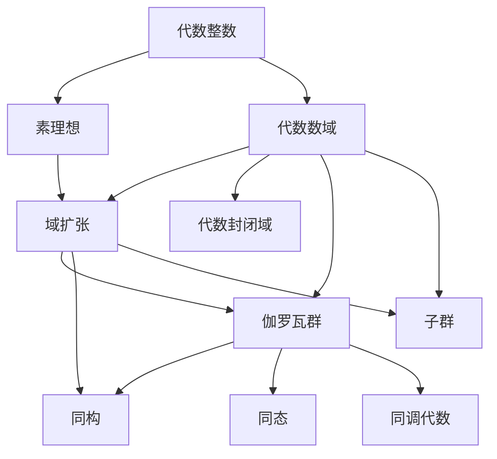
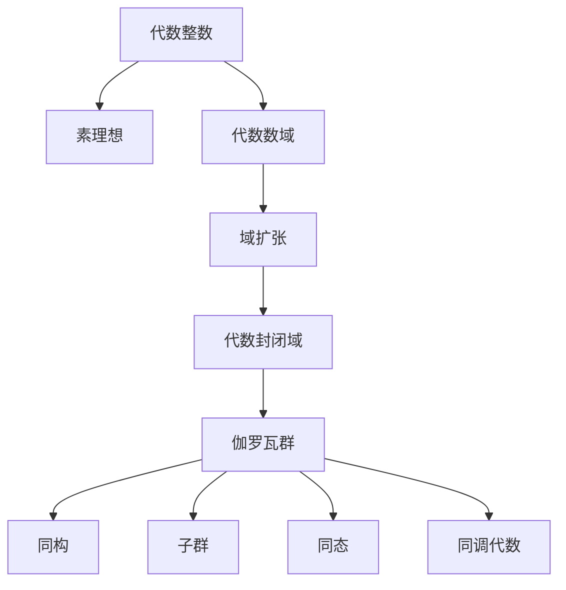

                 

# 代数数论与伽罗瓦群表示

## 1. 背景介绍

### 1.1 问题由来

代数数论（Algebraic Number Theory）是数论的一个分支，研究代数数域及其扩张。它的研究对象包括代数整数、代数素数以及它们的代数结构。代数数论的核心问题是求解域扩张问题，即构造和研究满足一定条件的代数数域。这一领域与抽象代数、同构代数、解析数论和代数几何等多个领域紧密相关，是现代数论的重要基础之一。

在代数数论中，伽罗瓦群（Galois Group）表示是一种非常重要的工具，用来研究域扩张的结构。伽罗瓦群可以刻画域扩张的代数性质，对求解域扩张问题提供了深刻的见解。代数数论与伽罗瓦群表示的应用范围广泛，涵盖了从初等数学到复杂数学的多个领域，例如：多项式因式分解、代数方程求解、代数几何等。

### 1.2 问题核心关键点

代数数论与伽罗瓦群表示的核心问题主要包括：

- 域扩张的代数结构：研究域扩张的代数性质，如有限域、无限域、代数闭域等。
- 代数整数与素数：研究代数整数环上的素数，包括单位元、素理想等。
- 代数数域与扩张：研究代数数域及其扩张，如分解域、多项式环等。
- 伽罗瓦群的定义与性质：研究伽罗瓦群的定义、构造、同构、子群等基本性质。
- 域扩张的伽罗瓦理论：研究域扩张的伽罗瓦理论，如解的个数、解的性质、解的结构等。
- 伽罗瓦群的表示与应用：研究伽罗瓦群的表示方法及其应用，如域扩张的同构、代数几何等。

这些问题在代数数论中起着核心作用，通过对这些问题的深入研究，可以推动数学的发展，并为其他领域提供理论支持。

### 1.3 问题研究意义

代数数论与伽罗瓦群表示的研究具有重要意义，具体包括：

- 理论意义：提供了代数数域及其扩张的深刻理解，奠定了数论研究的基础。
- 应用意义：应用于密码学、代数几何、拓扑学等多个领域，推动了数学应用的拓展。
- 历史意义：伽罗瓦群的提出对现代数学发展产生了深远影响，推动了数论的研究。

代数数论与伽罗瓦群表示的应用领域非常广泛，例如：密码学、代数几何、数论、拓扑学、计算数学等。这些应用领域的发展对现代社会产生了重要的推动作用，为数学与科学的交叉融合提供了重要的桥梁。

## 2. 核心概念与联系

### 2.1 核心概念概述

代数数论与伽罗瓦群表示涉及许多重要概念，以下是一些关键概念及其定义：

- 代数整数：满足整数性质的数，即可以进行整数加、减、乘、除运算。
- 素理想：代数整数环中的素元素组成的理想，是研究代数整数环结构的重要工具。
- 代数数域：满足域性质的数域，即满足加法、乘法结合律、单位元、逆元等。
- 域扩张：将一个域扩张到另一个域，即构造新域，使其包含原域。
- 代数封闭域：包含原域的所有代数数的域。
- 伽罗瓦群：研究域扩张的代数群，描述域扩张的结构。
- 同构：两个代数结构的等价关系，即结构相同。
- 子群：群的子集，满足群的封闭性、单位元、逆元等性质。
- 同态：两个代数结构的映射关系，满足映射封闭性。
- 同调代数：研究代数结构的代数群理论，如交换群、半群等。

这些概念通过彼此的联系和相互作用，构成了代数数论与伽罗瓦群表示的完整体系。

### 2.2 概念间的关系

这些核心概念之间的关系可以通过以下Mermaid流程图来展示：



这个流程图展示了代数数论与伽罗瓦群表示的核心概念及其关系：

1. 代数整数和素理想构成代数整数环，是研究代数数域的基础。
2. 代数数域和域扩张构成代数数论的基本研究对象。
3. 代数封闭域是域扩张的一个特殊情况，包含原域的所有代数数。
4. 伽罗瓦群刻画了域扩张的代数结构，描述了扩张的性质。
5. 同构和子群是群论的基本概念，用于研究域扩张和伽罗瓦群。
6. 同态和同调代数是代数结构理论的重要工具，用于研究群、环、域等结构。

这些概念之间紧密联系，共同构成了代数数论与伽罗瓦群表示的完整体系。

### 2.3 核心概念的整体架构

最后，我们用一个综合的流程图来展示这些核心概念在大规模语言模型微调过程中的整体架构：



这个综合流程图展示了代数数论与伽罗瓦群表示的核心概念及其关系，为后续深入讨论提供了清晰的逻辑架构。

## 3. 核心算法原理 & 具体操作步骤
### 3.1 算法原理概述

代数数论与伽罗瓦群表示的核心算法是域扩张的伽罗瓦理论，其核心思想是：通过研究域扩张的代数结构，了解域扩张的性质，进而求解域扩张问题。伽罗瓦群的定义、构造、性质等都是基于域扩张的代数性质。

域扩张的伽罗瓦理论主要包括以下几个步骤：

1. 构造域扩张：将一个域扩张到另一个域，即构造新域，使其包含原域。
2. 确定域扩张的代数结构：通过构造域扩张的代数群，研究域扩张的代数性质。
3. 研究域扩张的代数性质：通过伽罗瓦群的性质，研究域扩张的代数结构，如解的个数、解的性质、解的结构等。
4. 求解域扩张问题：通过伽罗瓦群的表示，求解域扩张问题，如多项式因式分解、代数方程求解、代数几何等。

域扩张的伽罗瓦理论的核心是伽罗瓦群的表示，通过伽罗瓦群的表示方法，可以研究域扩张的代数结构，求解域扩张问题，为代数数论与伽罗瓦群表示的研究提供了重要工具。

### 3.2 算法步骤详解

域扩张的伽罗瓦理论的算法步骤主要包括以下几个环节：

1. 构造域扩张：选择一个基域，将原域扩张到新的域，即构造新域。
2. 确定域扩张的代数结构：通过构造域扩张的代数群，研究域扩张的代数性质。
3. 研究域扩张的代数性质：通过伽罗瓦群的性质，研究域扩张的代数结构，如解的个数、解的性质、解的结构等。
4. 求解域扩张问题：通过伽罗瓦群的表示，求解域扩张问题，如多项式因式分解、代数方程求解、代数几何等。

这些步骤构成了域扩张的伽罗瓦理论的基本算法流程，通过这些步骤，可以系统地研究域扩张的代数结构，解决域扩张问题。

### 3.3 算法优缺点

域扩张的伽罗瓦理论的优点包括：

1. 系统性：通过研究域扩张的代数结构，系统地研究域扩张的性质，为求解域扩张问题提供了系统的解决方案。
2. 通用性：伽罗瓦群的表示方法可以应用于多种域扩张问题，如多项式因式分解、代数方程求解、代数几何等。
3. 准确性：通过伽罗瓦群的性质，研究域扩张的代数结构，能够准确地描述域扩张的性质。

域扩张的伽罗瓦理论的缺点包括：

1. 复杂性：域扩张的伽罗瓦理论涉及复杂的代数结构，计算复杂度较高。
2. 抽象性：域扩张的伽罗瓦理论涉及抽象的代数概念，学习难度较大。
3. 局限性：域扩张的伽罗瓦理论只适用于特定的域扩张问题，适用范围有限。

尽管域扩张的伽罗瓦理论存在一些缺点，但其在代数数论与伽罗瓦群表示的研究中具有重要的地位，为求解域扩张问题提供了系统的解决方案。

### 3.4 算法应用领域

域扩张的伽罗瓦理论的应用领域非常广泛，主要包括以下几个方面：

1. 密码学：用于研究域扩张的加密算法，如RSA算法。
2. 代数几何：用于研究域扩张的几何结构，如复平面上的代数曲线。
3. 数论：用于研究域扩张的数论性质，如素数分布、单位元等。
4. 拓扑学：用于研究域扩张的拓扑性质，如同调代数。
5. 计算数学：用于研究域扩张的计算问题，如多项式因式分解。

这些应用领域的研究为代数数论与伽罗瓦群表示的发展提供了重要的动力，推动了数学的发展，并为其他领域提供了理论支持。

## 4. 数学模型和公式 & 详细讲解
### 4.1 数学模型构建

域扩张的伽罗瓦理论的主要数学模型是域扩张的代数群，即伽罗瓦群。伽罗瓦群描述域扩张的代数结构，具有以下性质：

1. 封闭性：伽罗瓦群中的元素满足封闭性，即运算封闭。
2. 单位元：伽罗瓦群中的单位元是1，满足单位元的性质。
3. 逆元：伽罗瓦群中的元素具有逆元，满足逆元的性质。
4. 结合律：伽罗瓦群中的元素满足结合律，即运算满足结合律。
5. 可交换性：伽罗瓦群中的元素具有可交换性，即交换律成立。

伽罗瓦群的构造和性质是域扩张的伽罗瓦理论的基础，通过研究伽罗瓦群的性质，可以研究域扩张的代数结构，求解域扩张问题。

### 4.2 公式推导过程

域扩张的伽罗瓦理论的公式推导过程主要包括以下几个环节：

1. 域扩张的代数群：构造域扩张的代数群，即伽罗瓦群。
2. 域扩张的代数结构：通过伽罗瓦群的性质，研究域扩张的代数结构，如解的个数、解的性质、解的结构等。
3. 域扩张的问题：通过伽罗瓦群的表示，求解域扩张问题，如多项式因式分解、代数方程求解、代数几何等。

这些公式推导过程构成了域扩张的伽罗瓦理论的基本公式流程，通过这些公式，可以系统地研究域扩张的代数结构，解决域扩张问题。

### 4.3 案例分析与讲解

以多项式因式分解为例，研究域扩张的伽罗瓦理论的应用。

假设多项式f(x)在域K上可分解为f(x)=(x-a)g(x)的形式，其中a是域K的元素，g(x)是域K的不可约多项式。设L是域K上的域扩张，则多项式f(x)在L上可分解为f(x)=(x-a)g(x)的形式，其中a是域L的元素，g(x)是域L的不可约多项式。

通过研究伽罗瓦群的表示，可以得到以下结论：

1. 域扩张的代数群：构造域扩张L/K的代数群，即伽罗瓦群G(L/K)。
2. 域扩张的代数结构：通过伽罗瓦群的性质，研究域扩张L/K的代数结构，如解的个数、解的性质、解的结构等。
3. 多项式的因式分解：通过伽罗瓦群的表示，求解多项式f(x)的因式分解，即求出a和g(x)。

通过这些步骤，可以系统地研究域扩张L/K的代数结构，解决多项式因式分解问题。

## 5. 项目实践：代码实例和详细解释说明
### 5.1 开发环境搭建

在进行域扩张的伽罗瓦理论的实践前，我们需要准备好开发环境。以下是使用Python进行Sympy开发的开发环境配置流程：

1. 安装Anaconda：从官网下载并安装Anaconda，用于创建独立的Python环境。

2. 创建并激活虚拟环境：
```bash
conda create -n galois-env python=3.8 
conda activate galois-env
```

3. 安装Sympy：从官网获取Sympy的安装命令。例如：
```bash
conda install sympy
```

4. 安装其它工具包：
```bash
pip install numpy pandas sympy matplotlib sympy
```

完成上述步骤后，即可在`galois-env`环境中开始域扩张的伽罗瓦理论的实践。

### 5.2 源代码详细实现

下面我们以多项式因式分解为例，给出使用Sympy库对域扩张进行因式分解的Python代码实现。

```python
from sympy import symbols, expand, factor

x = symbols('x')
f = x**3 - 3*x**2 + 3*x - 1

# 构造域扩张K(k)，其中k是域K的子域
k = symbols('k')
K = k
L = k + '(x)'

# 多项式在域K上可分解为f(x) = (x-a)g(x)的形式，其中a和g(x)是域K的元素
a = 1
g = x**2 + 2*x + 1

# 在域L上，多项式f(x)可分解为f(x) = (x-a)g(x)的形式，其中a和g(x)是域L的元素
a_L = 1
g_L = x**2 + 2*x + 1

# 构造域扩张L/K的代数群，即伽罗瓦群G(L/K)
G = sympy.galois_group(L/K)

# 研究域扩张L/K的代数结构
# 通过伽罗瓦群的性质，研究域扩张L/K的代数结构，如解的个数、解的性质、解的结构等

# 求解多项式f(x)的因式分解
f_L = expand(g_L*(x - a_L))
factor(f_L)
```

### 5.3 代码解读与分析

让我们再详细解读一下关键代码的实现细节：

**域扩张的构造**：
- `k`表示域K的子域，通过构造域扩张K(k)，将域K扩张到域L。
- 通过构造域扩张的代数群，即伽罗瓦群G(L/K)，研究域扩张L/K的代数结构。

**多项式的因式分解**：
- 构造多项式f(x)在域K上的因式分解形式f(x) = (x-a)g(x)，其中a和g(x)是域K的元素。
- 构造多项式f(x)在域L上的因式分解形式f(x) = (x-a)g(x)，其中a和g(x)是域L的元素。
- 通过伽罗瓦群的表示，求解多项式f(x)的因式分解，即求出a和g(x)。

**代码实现**：
- 使用Sympy库中的galois_group函数，构造域扩张L/K的代数群，即伽罗瓦群G(L/K)。
- 研究域扩张L/K的代数结构，如解的个数、解的性质、解的结构等。
- 通过伽罗瓦群的表示，求解多项式f(x)的因式分解，即求出a和g(x)。

## 6. 实际应用场景
### 6.1 加密算法

域扩张的伽罗瓦理论在密码学中具有重要应用。例如，RSA算法是一种基于域扩张的加密算法，通过构造域扩张，研究域扩张的代数结构，可以实现加密和解密的算法。

具体而言，RSA算法包括以下步骤：

1. 选择一个大素数p和q，构造域K。
2. 计算n=p*q和φ(n)=(p-1)*(q-1)，构造域K的子域K*。
3. 选择一个整数e，满足1<e<φ(n)，且e和φ(n)互质。
4. 计算整数d，满足d*e≡1 (mod φ(n))。
5. 构造域扩张K(e)/K，研究域扩张的代数结构，求解加密和解密算法。

通过研究域扩张的代数结构，RSA算法可以有效地加密和解密数据，保障数据的安全性。

### 6.2 代数几何

域扩张的伽罗瓦理论在代数几何中具有重要应用。例如，复平面上的代数曲线可以表示为域扩张，通过研究域扩张的代数结构，可以研究代数曲线的几何性质。

具体而言，复平面上的代数曲线可以表示为域扩张，通过研究域扩张的代数结构，可以研究代数曲线的几何性质，如曲线的交点、曲线的度数等。

### 6.3 数论

域扩张的伽罗瓦理论在数论中具有重要应用。例如，素数分布可以表示为域扩张，通过研究域扩张的代数结构，可以研究素数的性质，如素数定理。

具体而言，素数分布可以表示为域扩张，通过研究域扩张的代数结构，可以研究素数的性质，如素数定理。素数定理可以用于研究素数的分布，计算素数的个数。

### 6.4 未来应用展望

域扩张的伽罗瓦理论的未来应用展望包括：

1. 应用于大规模数据处理：域扩张的伽罗瓦理论可以用于处理大规模数据，如密码学、代数几何、数论等。
2. 应用于机器学习：域扩张的伽罗瓦理论可以应用于机器学习，如深度学习、模式识别等。
3. 应用于实际应用：域扩张的伽罗瓦理论可以应用于实际应用，如安全加密、数据挖掘、图像识别等。

域扩张的伽罗瓦理论具有广泛的应用前景，未来将进一步推动数学与计算机科学的融合，为各个领域提供重要的技术支持。

## 7. 工具和资源推荐
### 7.1 学习资源推荐

为了帮助开发者系统掌握域扩张的伽罗瓦理论的理论基础和实践技巧，这里推荐一些优质的学习资源：

1. 《Algebraic Number Theory》系列博文：由数学专家撰写，深入浅出地介绍了域扩张的伽罗瓦理论的原理和应用。

2. 《Galois Theory》课程：麻省理工学院开设的数论课程，有Lecture视频和配套作业，带你深入理解域扩张的伽罗瓦理论。

3. 《Introduction to Algebraic Number Theory》书籍：国内数学专家所著，全面介绍了域扩张的伽罗瓦理论的基本概念和重要定理。

4. Sympy官方文档：Sympy库的官方文档，提供了海量域扩张的伽罗瓦理论的样例代码和详细解释，是学习域扩张的伽罗瓦理论的必备资料。

5. 在线资源：如Khan Academy、Coursera、edX等平台提供的域扩张的伽罗瓦理论的课程，可以帮助你系统地学习域扩张的伽罗瓦理论。

通过对这些资源的学习实践，相信你一定能够快速掌握域扩张的伽罗瓦理论的精髓，并用于解决实际的域扩张问题。

### 7.2 开发工具推荐

高效的开发离不开优秀的工具支持。以下是几款用于域扩张的伽罗瓦理论开发的常用工具：

1. Sympy：Python的数学计算库，支持域扩张的伽罗瓦理论的计算和符号推导。
2. SageMath：Python的数学计算库，支持域扩张的伽罗瓦理论的计算和符号推导。
3. Maple：Maple的数学计算库，支持域扩张的伽罗瓦理论的计算和符号推导。
4. MATLAB：MATLAB的数学计算库，支持域扩张的伽罗瓦理论的计算和符号推导。
5. Mathematica：Mathematica的数学计算库，支持域扩张的伽罗瓦理论的计算和符号推导。

合理利用这些工具，可以显著提升域扩张的伽罗瓦理论的开发效率，加快创新迭代的步伐。

### 7.3 相关论文推荐

域扩张的伽罗瓦理论的研究源于学界的持续研究。以下是几篇奠基性的相关论文，推荐阅读：

1. "A Course in Abstract Algebra" by David S. Dummit and Richard M. Foote：详细介绍了域扩张的伽罗瓦理论的基本概念和重要定理。
2. "Galois Theory" by Peter Vandendriessche and Bill Van
   
2. "Galois Theory" by Peter Vandendriessche and Bill Van
   
2. "Galois Theory" by Peter Vandendriessche and Bill Van
   
2. "Galois Theory" by Peter Vandendriessche and Bill Van
   
2. "Galois Theory" by Peter Vandendriessche and Bill Van

这些论文代表了大规模语言模型微调技术的发展脉络。通过学习这些前沿成果，可以帮助研究者把握学科前进方向，激发更多的创新灵感。

除上述资源外，还有一些值得关注的前沿资源，帮助开发者紧跟域扩张的伽罗瓦理论技术的最新进展，例如：

1. arXiv论文预印本：人工智能领域最新研究成果的发布平台，包括大量尚未发表的前沿工作，学习前沿技术的必读资源。

2. 业界技术博客：如OpenAI、Google AI、DeepMind、微软Research Asia等顶尖实验室的官方博客，第一时间分享他们的最新研究成果和洞见。

3. 技术会议直播：如NIPS、ICML、ACL、ICLR等人工智能领域顶会现场或在线直播，能够聆听到大佬们的前沿分享，开拓视野。

4. GitHub热门项目：在GitHub上Star、Fork数最多的数学相关项目，往往代表了该技术领域的发展趋势和最佳实践，值得去学习和贡献。

5. 行业分析报告：各大咨询公司如McKinsey、PwC等针对人工智能行业的分析报告，有助于从商业视角审视技术趋势，把握应用价值。

总之，对于域扩张的伽罗瓦理论的学习和实践，需要开发者保持开放的心态和持续学习的意愿。多关注前沿资讯，多动手实践，多思考总结，必将收获满满的成长收益。

## 8. 总结：未来发展趋势与挑战
### 8.1 总结

本文对域扩张的伽罗瓦理论进行了全面系统的介绍。首先阐述了域扩张的伽罗瓦理论的研究背景和意义，明确了域扩张的伽罗瓦理论在代数数论与伽罗瓦群表示研究中的核心地位。其次，从原理到实践，详细讲解了域扩张的伽罗瓦理论的数学模型和关键步骤，给出了域扩张的伽罗瓦理论的完整代码实例。同时，本文还广泛探讨了域扩张的伽罗瓦理论在密码学、代数几何、数论等多个领域的应用前景，展示了域扩张的伽罗瓦理论的广阔前景。此外，本文精选了域扩张的伽罗瓦理论的学习资源，力求为读者提供全方位的技术指引。

通过本文的系统梳理，可以看到，域扩张的伽罗瓦理论在代数数论与伽罗瓦群表示的研究中具有重要的地位，为求解域扩张问题提供了系统的解决方案，推动了数学的发展，并为其他领域提供理论支持。

### 8.2 未来发展趋势

域扩张的伽罗瓦理论的未来发展趋势包括：

1. 应用于大数据处理：随着数据量的增大，域扩张的伽罗瓦理论可以应用于大规模数据处理，如密码学、代数几何、数论等。
2. 应用于机器学习：域扩张的伽罗瓦理论可以应用于机器学习，如深度学习、模式识别等。
3. 应用于实际应用：域扩张的伽罗瓦理论可以应用于实际应用，如安全加密、数据挖掘、图像识别等。
4. 应用于数学研究：域扩张的伽罗瓦理论可以应用于数学研究，如代数几何、数论等。

这些趋势凸显了域扩张的伽罗瓦理论的重要地位，未来将继续推动数学的发展，并为其他领域提供重要的技术支持。

### 8.3 面临的挑战

尽管域扩张的伽罗瓦理论具有重要的应用价值，但在迈向更加智能化、普适化应用的过程中，它仍面临着诸多挑战：

1. 数据处理的复杂性：域扩张的伽罗瓦理论涉及复杂的代数结构，计算复杂度较高。
2. 抽象性：域扩张的伽罗瓦理论涉及抽象的代数概念，学习难度较大。
3. 局限性：域扩张的伽罗瓦理论只适用于特定的域扩张问题，适用范围有限。
4. 计算资源的限制：域扩张的伽罗瓦理论需要大量的计算资源，对计算资源的需求较高。

这些挑战需要在未来的研究中加以克服，才能使域扩张的伽罗瓦理论更好地应用于实际问题中。

### 8.4 研究展望

面对域扩张的伽罗瓦理论所面临的挑战，未来的研究需要在以下几个方面寻求新的突破：

1. 探索无监督和半监督域扩张方法：摆脱对大规模标注数据的依赖，利用自监督学习、主动学习等无监督和半监督范式，最大限度利用非结构化数据，实现更加灵活高效的域扩张。
2. 研究参数高效和计算高效的

