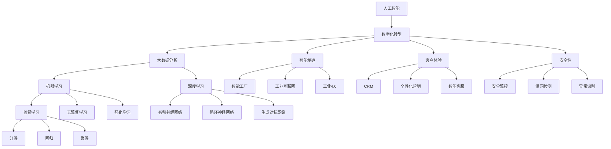
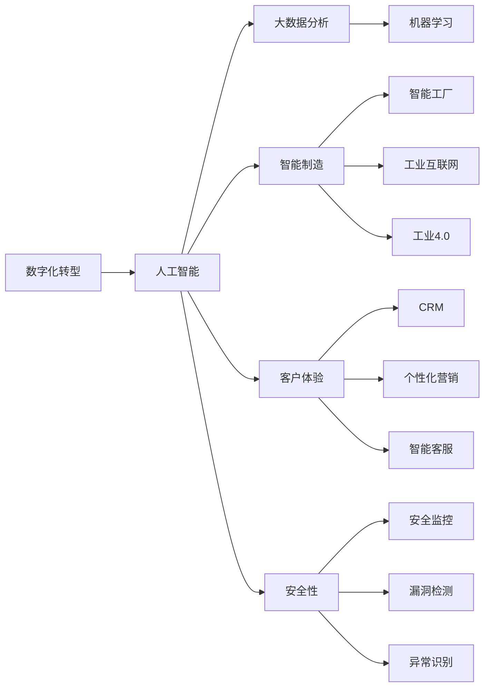
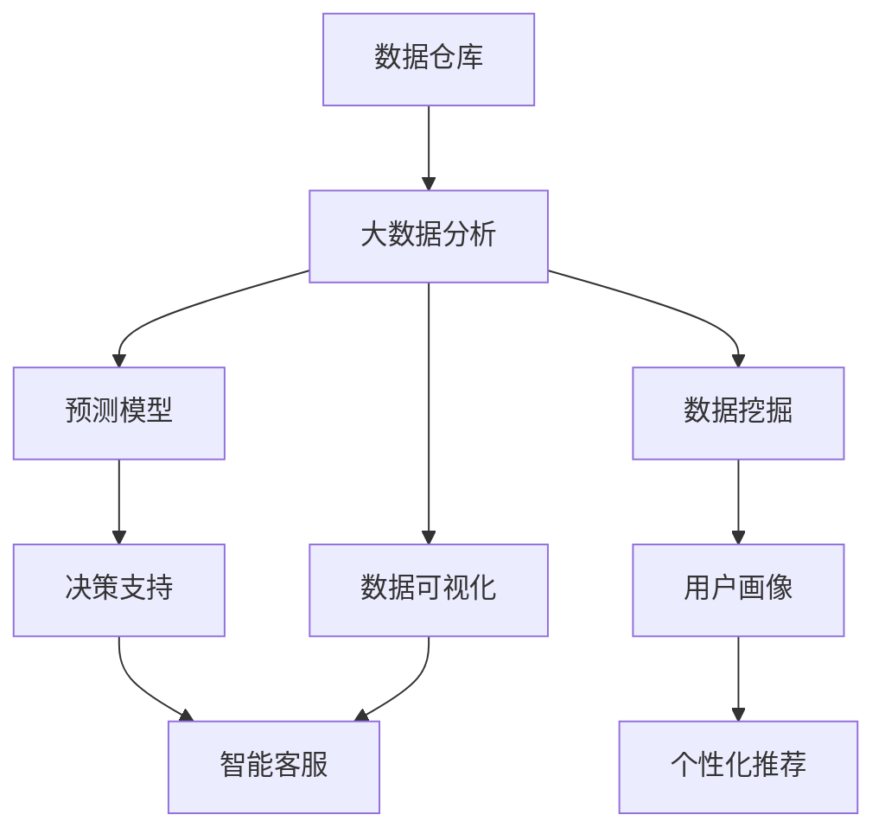
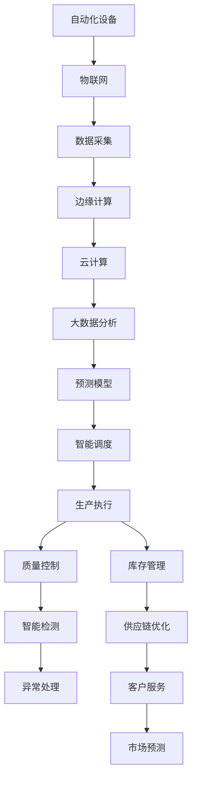
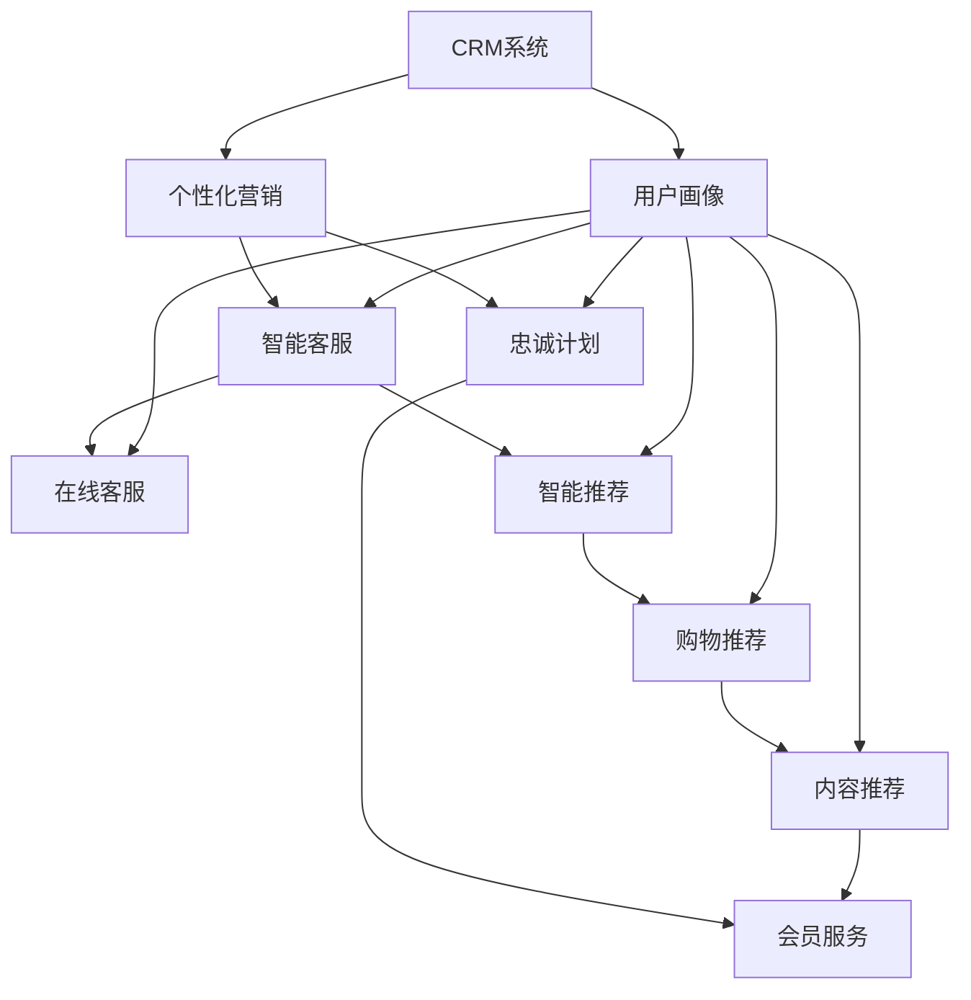

                 

# 企业转型中的人工智能应用

> 关键词：人工智能,企业转型,数字化转型,大数据分析,机器学习,自动化,智能制造,客户体验

## 1. 背景介绍

### 1.1 问题由来

随着全球经济形势的剧烈变化和数字化转型的加速推进，越来越多的企业开始将人工智能(AI)技术作为转型升级的重要工具。特别是在后疫情时代，传统制造和服务业面临需求萎缩、供应链断裂、运营成本上升等挑战，如何在困境中寻找新的增长点，成为企业的当务之急。与此同时，AI技术的成熟与普及，为各行各业提供了新的解决方案，帮助企业应对复杂多变的外部环境，实现高质量发展。

### 1.2 问题核心关键点

AI技术在企业转型中的应用，核心在于通过自动化、智能化手段，优化生产流程、提升运营效率、增强决策能力。具体来说，包括：

- **自动化**：通过机器人、自动化设备等技术，减少人工操作，降低生产成本，提升生产效率。
- **智能化**：通过数据分析、预测模型、决策支持等技术，优化资源配置，增强风险控制，提升管理水平。
- **数字化**：通过物联网(IoT)、云计算、大数据等技术，实现数据收集、处理、存储和应用的一体化，为AI提供数据基础。
- **个性化**：通过用户画像、行为分析等技术，实现精准营销、个性化服务，提升客户满意度。
- **安全性**：通过安全监控、漏洞检测等技术，保护企业数据和系统安全，防止信息泄露和网络攻击。

### 1.3 问题研究意义

AI技术在企业转型中的广泛应用，不仅有助于企业提升竞争力，还能推动产业升级，带动经济社会发展。具体意义包括：

- **降低成本**：自动化生产、智能调度、智能客服等AI应用，能大幅降低人力、物流等成本，提升经济效益。
- **提高效率**：通过机器学习、深度学习等AI技术，优化流程、减少浪费、提升决策质量，提高企业运营效率。
- **开拓市场**：AI技术帮助企业快速响应市场需求，实现产品创新和市场拓展，增强市场竞争力。
- **优化体验**：AI技术提升客户服务质量，个性化推荐、智能客服、智能投顾等应用，增强客户粘性和满意度。
- **风险管理**：通过预测分析、风险评估等AI技术，提升风险识别和应对能力，保障企业安全稳定运营。

## 2. 核心概念与联系

### 2.1 核心概念概述

为更好地理解AI技术在企业转型中的应用，本节将介绍几个密切相关的核心概念：

- **人工智能**：通过模拟人类智能行为，实现对数据的理解、学习、推理和决策，包括机器学习、深度学习、自然语言处理等技术。
- **数字化转型**：通过数字技术重塑业务流程、优化运营模式，提升企业竞争力，包括物联网、云计算、大数据、区块链等技术。
- **大数据分析**：通过收集、存储、处理、分析海量数据，提取有价值的信息，指导企业决策，包括数据仓库、数据挖掘、数据可视化等技术。
- **机器学习**：基于数据驱动，通过算法优化模型，实现对数据的预测、分类、聚类等，包括监督学习、无监督学习、强化学习等技术。
- **深度学习**：基于神经网络模型，通过多层数据抽象，实现对数据的高级特征提取和复杂模式识别，包括卷积神经网络、循环神经网络、生成对抗网络等技术。
- **智能制造**：通过自动化、智能化手段，提升制造过程的效率和质量，包括智能工厂、工业互联网、工业4.0等概念。
- **客户体验**：通过数据分析、预测模型、个性化推荐等技术，提升客户满意度和忠诚度，包括CRM、个性化营销、智能客服等应用。
- **安全性**：通过安全监控、漏洞检测、异常识别等技术，保障企业数据和系统安全，防止信息泄露和网络攻击。

这些核心概念之间的逻辑关系可以通过以下Mermaid流程图来展示：



这个流程图展示了大语言模型的核心概念及其之间的关系：

1. 人工智能是数字化转型的核心引擎，通过算法优化提升运营效率。
2. 大数据分析为人工智能提供数据基础，帮助企业洞察市场动态和客户需求。
3. 机器学习和深度学习是大数据应用的重要技术手段，通过算法模型提取数据价值。
4. 智能制造利用人工智能技术提升生产过程的智能化水平，实现智慧工厂。
5. 客户体验通过个性化服务和智能推荐，提升客户满意度和忠诚度。
6. 安全性保障企业数据和系统安全，防止信息泄露和网络攻击。

这些概念共同构成了企业转型的技术生态系统，使企业能够在数字时代保持竞争优势，实现可持续发展。

### 2.2 概念间的关系

这些核心概念之间存在着紧密的联系，形成了企业转型的完整生态系统。下面我们通过几个Mermaid流程图来展示这些概念之间的关系。

#### 2.2.1 数字化转型的框架



这个流程图展示了数字化转型的基本框架，以及人工智能、大数据、智能制造、客户体验和安全性的关系。

#### 2.2.2 数据驱动的决策模型



这个流程图展示了数据驱动决策模型的基本流程，通过数据仓库、大数据分析、预测模型和数据可视化等技术，提升决策质量。

#### 2.2.3 智能制造的生产流程



这个流程图展示了智能制造的生产流程，通过自动化、物联网、云计算、大数据和预测模型等技术，实现智能工厂的建设。

#### 2.2.4 客户体验的互动场景



这个流程图展示了客户体验的互动场景，通过CRM系统、个性化营销、智能客服等技术，提升客户满意度和忠诚度。

### 2.3 核心概念的整体架构

最后，我们用一个综合的流程图来展示这些核心概念在企业转型中的应用：

```mermaid
graph TB
    A[自动化设备] --> B[物联网]
    B --> C[数据采集]
    C --> D[边缘计算]
    D --> E[云计算]
    E --> F[大数据分析]
    F --> G[预测模型]
    G --> H[智能调度]
    H --> I[生产执行]
    I --> J[质量控制]
    J --> K[智能检测]
    K --> L[异常处理]
    I --> M[库存管理]
    M --> N[供应链优化]
    N --> O[客户服务]
    O --> P[市场预测]
    P --> Q[营销策略]
    Q --> R[个性化推荐]
    R --> S[智能客服]
    S --> T[在线客服]
    T --> U[购物推荐]
    U --> V[内容推荐]
    V --> W[忠诚计划]
    W --> X[会员服务]
    A --> Y[智能制造]
    Y --> Z[工业互联网]
    Y --> $[工业4.0]
    A --> &[客户体验]
    [客户体验] --> %[CRM系统]
    % --> &[个性化营销]
    [个性化营销] --> &={[智能客服]
    & --> &[智能推荐]
    & --> &[[购物推荐]
    & --> &[[内容推荐]
    & --> &[[忠诚计划]
    & --> &[[会员服务]
    & --> &[[用户画像]]
    & --> &[大数据分析]
    & --> &[预测模型]
    & --> &[数据可视化]
    & --> &[智能调度]
    & --> &[生产执行]
    & --> &[质量控制]
    & --> &[智能检测]
    & --> &[异常处理]
    & --> &[库存管理]
    & --> &[供应链优化]
    & --> &[客户服务]
    & --> &[市场预测]
    & --> &[营销策略]
    & --> &[智能客服]
    & --> &[在线客服]
    & --> &[智能推荐]
    & --> &[购物推荐]
    & --> &[内容推荐]
    & --> &[忠诚计划]
    & --> &[会员服务]
    & --> &[用户画像]
    & --> &[大数据分析]
    & --> &[预测模型]
    & --> &[数据可视化]
    & --> &[智能调度]
    & --> &[生产执行]
    & --> &[质量控制]
    & --> &[智能检测]
    & --> &[异常处理]
    & --> &[库存管理]
    & --> &[供应链优化]
    & --> &[客户服务]
    & --> &[市场预测]
    & --> &[营销策略]
    & --> &[个性化推荐]
    & --> &[智能客服]
    & --> &[在线客服]
    & --> &[购物推荐]
    & --> &[内容推荐]
    & --> &[忠诚计划]
    & --> &[会员服务]
    & --> &[用户画像]
    & --> &[大数据分析]
    & --> &[预测模型]
    & --> &[数据可视化]
    & --> &[智能调度]
    & --> &[生产执行]
    & --> &[质量控制]
    & --> &[智能检测]
    & --> &[异常处理]
    & --> &[库存管理]
    & --> &[供应链优化]
    & --> &[客户服务]
    & --> &[市场预测]
    & --> &[营销策略]
    & --> &[智能客服]
    & --> &[在线客服]
    & --> &[智能推荐]
    & --> &[购物推荐]
    & --> &[内容推荐]
    & --> &[忠诚计划]
    & --> &[会员服务]
    & --> &[用户画像]
    & --> &[大数据分析]
    & --> &[预测模型]
    & --> &[数据可视化]
    & --> &[智能调度]
    & --> &[生产执行]
    & --> &[质量控制]
    & --> &[智能检测]
    & --> &[异常处理]
    & --> &[库存管理]
    & --> &[供应链优化]
    & --> &[客户服务]
    & --> &[市场预测]
    & --> &[营销策略]
    & --> &[个性化推荐]
    & --> &[智能客服]
    & --> &[在线客服]
    & --> &[购物推荐]
    & --> &[内容推荐]
    & --> &[忠诚计划]
    & --> &[会员服务]
    & --> &[用户画像]
    & --> &[大数据分析]
    & --> &[预测模型]
    & --> &[数据可视化]
    & --> &[智能调度]
    & --> &[生产执行]
    & --> &[质量控制]
    & --> &[智能检测]
    & --> &[异常处理]
    & --> &[库存管理]
    & --> &[供应链优化]
    & --> &[客户服务]
    & --> &[市场预测]
    & --> &[营销策略]
    & --> &[个性化推荐]
    & --> &[智能客服]
    & --> &[在线客服]
    & --> &[购物推荐]
    & --> &[内容推荐]
    & --> &[忠诚计划]
    & --> &[会员服务]
    & --> &[用户画像]
    & --> &[大数据分析]
    & --> &[预测模型]
    & --> &[数据可视化]
    & --> &[智能调度]
    & --> &[生产执行]
    & --> &[质量控制]
    & --> &[智能检测]
    & --> &[异常处理]
    & --> &[库存管理]
    & --> &[供应链优化]
    & --> &[客户服务]
    & --> &[市场预测]
    & --> &[营销策略]
    & --> &[个性化推荐]
    & --> &[智能客服]
    & --> &[在线客服]
    & --> &[购物推荐]
    & --> &[内容推荐]
    & --> &[忠诚计划]
    & --> &[会员服务]
    & --> &[用户画像]
    & --> &[大数据分析]
    & --> &[预测模型]
    & --> &[数据可视化]
    & --> &[智能调度]
    & --> &[生产执行]
    & --> &[质量控制]
    & --> &[智能检测]
    & --> &[异常处理]
    & --> &[库存管理]
    & --> &[供应链优化]
    & --> &[客户服务]
    & --> &[市场预测]
    & --> &[营销策略]
    & --> &[个性化推荐]
    & --> &[智能客服]
    & --> &[在线客服]
    & --> &[购物推荐]
    & --> &[内容推荐]
    & --> &[忠诚计划]
    & --> &[会员服务]
    & --> &[用户画像]
    & --> &[大数据分析]
    & --> &[预测模型]
    & --> &[数据可视化]
    & --> &[智能调度]
    & --> &[生产执行]
    & --> &[质量控制]
    & --> &[智能检测]
    & --> &[异常处理]
    & --> &[库存管理]
    & --> &[供应链优化]
    & --> &[客户服务]
    & --> &[市场预测]
    & --> &[营销策略]
    & --> &[个性化推荐]
    & --> &[智能客服]
    & --> &[在线客服]
    & --> &[购物推荐]
    & --> &[内容推荐]
    & --> &[忠诚计划]
    & --> &[会员服务]
    & --> &[用户画像]
    & --> &[大数据分析]
    & --> &[预测模型]
    & --> &[数据可视化]
    & --> &[智能调度]
    & --> &[生产执行]
    & --> &[质量控制]
    & --> &[智能检测]
    & --> &[异常处理]
    & --> &[库存管理]
    & --> &[供应链优化]
    & --> &[客户服务]
    & --> &[市场预测]
    & --> &[营销策略]
    & --> &[个性化推荐]
    & --> &[智能客服]
    & --> &[在线客服]
    & --> &[购物推荐]
    & --> &[内容推荐]
    & --> &[忠诚计划]
    & --> &[会员服务]
    & --> &[用户画像]
    & --> &[大数据分析]
    & --> &[预测模型]
    & --> &[数据可视化]
    & --> &[智能调度]
    & --> &[生产执行]
    & --> &[质量控制]
    & --> &[智能检测]
    & --> &[异常处理]
    & --> &[库存管理]
    & --> &[供应链优化]
    & --> &[客户服务]
    & --> &[市场预测]
    & --> &[营销策略]
    & --> &[个性化推荐]
    & --> &[智能客服]
    & --> &[在线客服]
    & --> &[购物推荐]
    & --> &[内容推荐]
    & --> &[忠诚计划]
    & --> &[会员服务]
    & --> &[用户画像]
    & --> &[大数据分析]
    & --> &[预测模型]
    & --> &[数据可视化]
    & --> &[智能调度]
    & --> &[生产执行]
    & --> &[质量控制]
    & --> &[智能检测]
    & --> &[异常处理]
    & --> &[库存管理]
    & --> &[供应链优化]
    & --> &[客户服务]
    & --> &[市场预测]
    & --> &[营销策略]
    & --> &[个性化推荐]
    & --> &[智能客服]
    & --> &[在线客服]
    & --> &[购物推荐]
    & --> &[内容推荐]
    & --> &[忠诚计划]
    & --> &[会员服务]
    & --> &[用户画像]
    & --> &[大数据分析]
    & --> &[预测模型]
    & --> &[数据可视化]
    & --> &[智能调度]
    & --> &[生产执行]
    & --> &[质量控制]
    & --> &[智能检测]
    & --> &[异常处理]
    & --> &[库存管理]
    & --> &[供应链优化]
    & --> &[客户服务]
    & --> &[市场预测]
    & --> &[营销策略]
    & --> &[个性化推荐]
    & --> &[智能客服]
    & --> &[在线客服]
    & --> &[购物推荐]
    & --> &[内容推荐]
    & --> &[忠诚计划]
    & --> &[会员服务]
    & --> &[用户画像]
    & --> &[大数据分析]
    & --> &[预测模型]
    & --> &[数据可视化]
    & --> &[智能调度]
    & --> &[生产执行]
    & --> &[质量控制]
    & --> &[智能检测]
    & --> &[异常处理]
    & --> &[库存管理]
    & --> &[供应链优化]
    & --> &[客户服务]
    & --> &[市场预测]
    & --> &[营销策略]
    & --> &[个性化推荐]
    & --> &[智能客服]
    & --> &[在线客服]
    & --> &[购物推荐]
    & --> &[内容推荐]
    & --> &[忠诚计划]
    & --> &[会员服务]
    & --> &[用户画像]
    & --> &[大数据分析]
    & --> &[预测模型]
    & --> &[数据可视化]
    & --> &[智能调度]
    & --> &[生产执行]
    & --> &[质量控制]
    & --> &[智能检测]
    & --> &[异常处理]
    & --> &[库存管理]
    & --> &[供应链优化]
    & --> &[客户服务]
    & --> &[市场预测]
    & --> &[营销策略]
    & --> &[个性化推荐]
    & --> &[智能客服]
    & --> &[在线客服]
    & --> &[购物推荐]
    & --> &[内容推荐]
    & --> &[忠诚计划]
    & --> &[会员服务]
    & --> &[用户画像]
    & --> &[大数据分析]
    & --> &[预测模型]
    & --> &[数据可视化]
    & --> &[智能调度]
    & --> &[生产执行]
    & --> &[质量控制]
    & --> &[智能检测]
    & --> &[异常处理]
    & --> &[库存管理]
    & --> &[供应链优化]
    & --> &[客户服务]
    & --> &[市场预测]
    & --> &[营销策略]
    & --> &[个性化推荐]
    & --> &[智能客服]
    & --> &[在线客服]
    & --> &[购物推荐]
    & --> &[内容推荐]
    & --> &[忠诚计划]
    & --> &[会员服务]
    & --> &[用户画像]
    & --> &[大数据分析]
    & --> &[预测模型]
    & --> &[数据可视化]
    & --> &[智能调度]
    & --> &[生产执行]
    & --> &[质量控制]
    & --> &[智能检测]
    & --> &[异常处理]
    & --> &[库存管理]
    & --> &[供应链优化]
    & --> &[客户服务]
    & --> &[市场预测]
    & --> &[营销策略]
    & --> &[个性化推荐]
    & --> &[智能客服]
    & --> &[在线客服]
    & --> &[购物推荐]
    & --> &[内容推荐]
    & --> &[忠诚计划]
    & --> &[会员服务]
    & --> &[用户画像]
    & --> &[大数据分析]
    & --> &[预测模型]
    & --> &[数据可视化]
    & --> &[智能调度]
    & --> &[生产执行]
    & --> &[质量控制]
    & --> &[智能检测]
    & --> &[异常处理]
    & --> &[库存管理]
    & --> &[供应链优化]
    & --> &[客户服务]
    & --> &[市场预测]
    & --> &[营销策略]
    & --> &[个性化推荐]
    & --> &[智能客服]
    & --> &[在线客服]
    & --> &[购物推荐]
    & --> &[内容推荐]
    & --> &[忠诚计划]
    & --> &[会员服务]
    & --> &[用户画像]
    & --> &[大数据分析]
    & --> &[预测模型]
    & --> &[数据可视化]
    & --> &[智能调度]
    & --> &[生产执行]
    & --> &[质量控制]
    & --> &[智能检测]
    & --> &[异常处理]
    & --> &[库存管理]
    & --> &[供应链优化]
    & --> &[客户服务]
    & --> &[市场预测]
    & --> &[营销策略]
    & --> &[个性化推荐]
    & --> &[智能客服]
    & --> &[在线客服]
    & --> &[购物推荐]
    & --> &[内容推荐]
    & --> &[忠诚计划]
    & --> &[会员服务]
    & --> &[用户画像]
    & --> &[大数据分析]
    & --> &[预测模型]
    & --> &[数据可视化]
    & --> &[智能调度]
    & --> &[生产执行]
    & --> &[质量控制]
    & --> &[智能检测]
    & --> &[异常处理]
    & --> &[库存管理]
    & --> &[供应链优化]
    & --> &[客户服务]
    & --> &[市场预测]
    & --> &[营销策略]
    & --> &[个性化推荐]
    & --> &[智能客服]
    & --> &[在线客服]
    & --> &[购物推荐]
    & --> &[内容推荐]
    & --> &[忠诚计划]
    & --> &[会员服务]
    & --> &[用户画像]
    & --> &[大数据分析]
    & --> &[预测模型]
    & --> &[数据可视化]
    & --> &[智能调度]
    & --> &[生产执行]
    & --> &[质量控制]
    & --> &[智能检测]
    & --> &[异常处理]
    & --> &[库存管理]
    & --> &[供应链优化]
    & --> &[客户服务]
    & --> &[市场预测]
    & --> &[营销策略]
    & --> &[个性化推荐]
    & --> &[智能客服]
    & --> &[在线客服]
    & --> &[购物推荐]
    & --> &[内容推荐]
    & --> &[忠诚计划]
    & --> &[会员服务]
    & --> &[用户画像]
    & --> &[大数据分析]
    & --> &[预测模型]
    & --> &[数据可视化]
    & --> &[智能调度]
    & --> &[生产执行]
    & --> &[质量控制]
    & --> &[智能检测]
    & --> &[异常处理]
    & --> &[库存管理]
    & --> &[供应链优化]
    & --> &[客户服务]
    & --> &[市场预测]
    & --> &[营销策略]
    & --> &[个性化推荐]
    & --> &[智能客服]
    & --> &[在线客服]
    & --> &[购物推荐]
    & --> &[内容推荐]
    & --> &[忠诚计划]
    & --> &[会员服务]
    & --> &[用户画像]
    & --> &[大数据分析]
    & --> &[预测模型]
    & --> &[数据可视化]
    & --> &[智能调度]
    & --> &[生产执行]
    & --> &[质量控制]
    & --> &[智能检测]
    & --> &[异常处理]
    & --> &[库存管理]
    & --> &[供应链优化]
    & --> &[客户服务]
    & --> &[市场预测]
    & --> &[营销策略]
    & --> &[个性化推荐]
    & --> &[智能客服]
    & --> &[在线客服]
    & --> &[购物推荐]
    & --> &[内容推荐]
    & --> &[忠诚计划]
    & --> &[会员服务]
    & --> &[用户画像]
    & --> &[大数据分析]
    & --> &[预测模型]
    & --> &[数据可视化]
    & --> &[智能调度]
    & --> &[生产执行]
    & --> &[质量控制]
    & --> &[智能检测]
    & --> &[异常处理]
    & --> &[库存管理]
    & --> &[供应链优化]
    & --> &[客户服务]
    & --> &[市场预测]
    & --> &[营销策略]
    & --> &[个性化推荐]
    & --> &[智能客服]
    & --> &[在线客服]
    & --> &[购物推荐]
    & --> &[内容推荐]
    & --> &[忠诚计划]
    & --> &[会员服务]
    & --> &[用户画像]
    & --> &[大数据分析]
    & --> &[预测模型]
    & --> &[数据可视化]
    & --> &[智能调度]
    & --> &[生产执行]
    & --> &[质量控制]
    & --> &[智能检测]
    & --> &[异常处理]
    & --> &[库存管理]
    & --> &[供应链优化]
    & --> &[客户服务]
    & --> &[市场预测]
    & --> &[营销策略]
    & --> &[个性化推荐]
    & --> &[智能客服]
    & --> &[在线客服]
    & --> &[购物推荐]
    & --> &[内容推荐]
    & --> &[忠诚计划]
    & --> &[会员服务]
    & --> &[用户画像]
    & --> &[大数据分析]
    & --> &[预测模型]
    & --> &[数据可视化]
    & --> &[智能调度]
    & --> &[生产执行]
    & --> &[质量控制]
    & --> &[智能检测]
    & --> &[异常处理]
    & --> &[库存管理]
    & --> &[供应链优化]
    & --> &[客户服务]
    & -->

