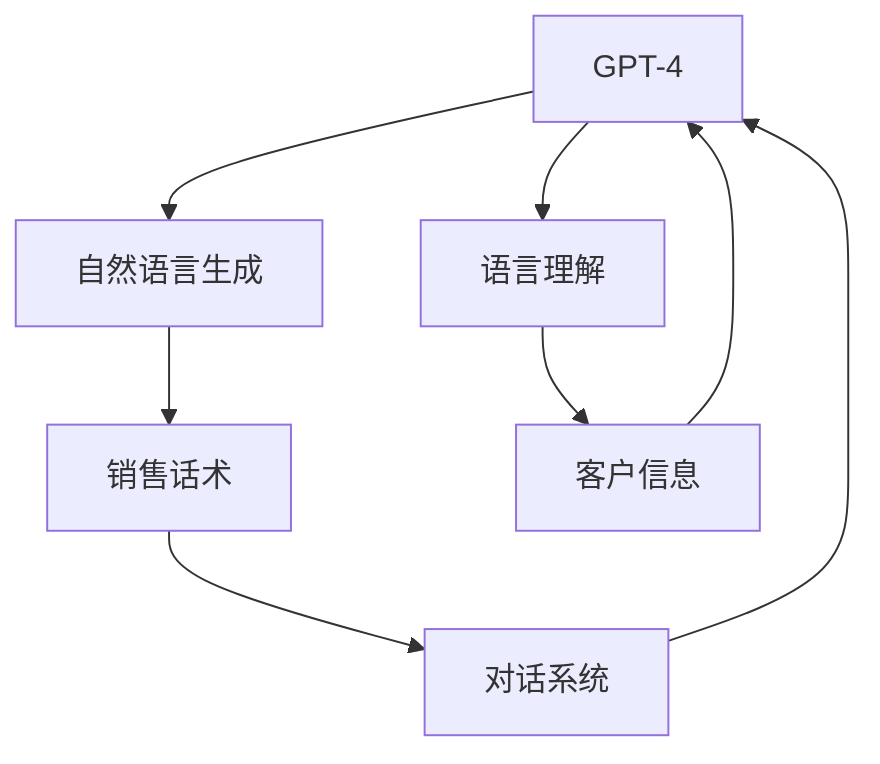

                 

# 使用 GPT-4 生成销售话术

> 关键词：
1. GPT-4
2. 自然语言生成
3. 销售话术
4. 人工智能
5. 生成模型
6. 语言理解
7. 对话系统

## 1. 背景介绍

在数字化转型的浪潮中，销售人员面临着前所未有的挑战。传统的销售话术生成方式，依赖人工创意和经验积累，不仅效率低下，而且难以确保一致性和时效性。随着人工智能技术的发展，特别是自然语言生成(Natural Language Generation, NLG)和大模型如GPT-4的普及，销售话术生成进入了一个新的阶段。

GPT-4作为OpenAI最新推出的语言生成模型，具备强大的语言理解和生成能力，能够从大规模语料中学习通用的语言表达和逻辑结构。在销售领域，利用GPT-4生成自然流畅、高度个性化的销售话术，可以帮助销售人员快速提升工作效率，保持品牌形象一致，并且更精准地满足客户需求。

本文将系统介绍如何利用GPT-4生成高质量的销售话术，详细解析GPT-4在销售话术生成中的优势和应用细节，以及实际落地时需要考虑的关键因素。

## 2. 核心概念与联系

### 2.1 核心概念概述

为深入理解GPT-4在销售话术生成中的应用，本节将介绍几个关键概念：

- GPT-4：由OpenAI开发的大型语言模型，具备自回归生成和自编码解码两种能力，能够处理大规模文本数据，生成高质量的自然语言文本。
- 自然语言生成(NLG)：将计算机生成的语义信息转化为自然语言文本的过程，是GPT-4的核心能力之一。
- 销售话术：销售人员在与客户沟通时使用的语言模板和表达方式，旨在建立信任、展现专业性和说服力。
- 语言理解：模型对输入文本的语义解析能力，是GPT-4生成话术的基础。
- 对话系统：通过对话交互，自动生成个性化响应和建议的系统，是销售话术生成的重要应用场景。

这些概念之间存在着紧密的联系，共同构成了GPT-4生成销售话术的技术基础。

### 2.2 概念间的关系

GPT-4在销售话术生成中的应用，主要通过以下步骤实现：

1. 输入客户信息：销售人员将客户姓名、公司、购买意向等信息输入模型。
2. 生成个性化话术：GPT-4根据输入信息，生成个性化的销售话术，以建立信任、展现专业性。
3. 对话交互：对话系统实时接收客户反馈，调整生成策略，以提高销售效果。
4. 输出销售话术：最终生成符合客户需求和销售目标的销售话术，用于后续销售沟通。

这些步骤展示了GPT-4在销售话术生成中的整体流程，利用其强大的语言生成和理解能力，实现自动化的销售话术创作和优化。

### 2.3 核心概念的整体架构

下面用一个综合的流程图来展示GPT-4在销售话术生成中的核心概念关系：



这个流程图展示了GPT-4在销售话术生成中的核心概念及其关系：

1. GPT-4作为生成模型，利用自然语言生成和语言理解能力，将输入的客户信息转化为销售话术。
2. 客户信息包括姓名、公司、购买意向等，是生成话术的重要输入。
3. 对话系统通过实时交互，调整生成策略，提高话术的个性化和效果。
4. 最终生成的话术输出，用于销售人员的日常沟通。

这些概念共同构成了GPT-4在销售话术生成中的完整生态系统，使其能够高效、灵活地生成高质量的销售话术。

## 3. 核心算法原理 & 具体操作步骤
### 3.1 算法原理概述

GPT-4在生成销售话术时，主要依赖于其自回归生成和自编码解码的能力。在自回归生成中，模型通过先前的文本信息，预测下一个单词的概率，逐步生成完整的文本。在自编码解码中，模型先对输入文本进行编码，然后基于编码结果生成新的文本。

在销售话术生成过程中，GPT-4首先接收客户信息作为输入，然后根据预定义的销售话术模板，生成符合当前客户需求的个性化销售话术。具体的算法步骤如下：

1. 输入客户信息。
2. 选择或生成合适的销售话术模板。
3. 将客户信息代入模板中。
4. 利用GPT-4生成话术文本。
5. 对话系统实时反馈调整生成策略。
6. 输出最终销售话术。

### 3.2 算法步骤详解

以下是GPT-4生成销售话术的具体操作步骤：

#### 步骤1：输入客户信息

客户信息包括但不限于姓名、公司名称、购买意向、联系方式等。这些信息需要以结构化或半结构化的形式提供给GPT-4，以便其理解和生成个性化的话术。

#### 步骤2：选择或生成销售话术模板

销售话术模板可以是预定义的通用模板，也可以根据客户需求动态生成。一般而言，模板应该包含一些关键要素，如问候语、产品介绍、优惠信息、结尾语等。

#### 步骤3：将客户信息代入模板

将客户信息代入到选择的或生成的模板中，形成待生成文本的初稿。这个过程可以通过字符串替换、条件拼接等方式实现。

#### 步骤4：利用GPT-4生成话术文本

将客户信息代入模板后的文本输入到GPT-4中，利用其强大的语言生成能力，生成自然流畅的销售话术。GPT-4会根据输入信息动态生成新的文本，以适应不同的客户需求和场景。

#### 步骤5：对话系统实时反馈调整生成策略

对话系统通过实时接收客户反馈，调整生成策略，以提高销售话术的个性化和效果。例如，如果客户对某个产品表现出兴趣，GPT-4可以生成更多相关的信息或提供定制化的建议。

#### 步骤6：输出最终销售话术

根据GPT-4生成的话术文本和对话系统的反馈，最终输出符合当前客户需求和销售目标的销售话术。

### 3.3 算法优缺点

利用GPT-4生成销售话术，具有以下优点：

- 生成速度快：GPT-4可以迅速生成大量的销售话术，节省销售人员的时间。
- 个性化高：模型能够根据客户信息生成个性化的销售话术，提升客户满意度和转化率。
- 灵活性强：销售话术模板和客户信息可以根据实际情况灵活调整，适应不同的销售场景。

同时，也存在一些缺点：

- 数据依赖性强：GPT-4的性能高度依赖于预训练数据的质量和多样性，需要提供足够量的客户信息以生成高质量的销售话术。
- 上下文理解有限：尽管GPT-4具备强大的语言理解能力，但在处理复杂场景或长期对话时，可能会出现上下文理解不足的问题。
- 生成内容可控性差：GPT-4生成的内容可能包含非预期的信息，需要人工进行审核和筛选。

### 3.4 算法应用领域

GPT-4生成销售话术技术在多个领域都有广泛应用：

1. **B2B销售**：企业可以通过GPT-4生成针对不同客户的销售话术，提升销售效率和客户满意度。
2. **在线客服**：客服系统可以使用GPT-4自动生成回复话术，提高响应速度和服务质量。
3. **个性化推荐**：电商平台可以根据用户行为数据，利用GPT-4生成个性化推荐话术，提升用户体验和转化率。
4. **营销自动化**：市场营销团队可以使用GPT-4生成广告文案和促销信息，自动化地进行客户触达。
5. **客户培训**：教育培训机构可以生成针对不同学习者需求的培训话术，提升培训效果和学生满意度。

## 4. 数学模型和公式 & 详细讲解
### 4.1 数学模型构建

在数学上，GPT-4生成销售话术的过程可以视为一种条件概率模型。给定客户信息 $x$，生成的话术 $y$ 的概率分布可以表示为：

$$
P(y|x) = \frac{P(y|x, \theta)}{P(x| \theta)}
$$

其中，$P(y|x, \theta)$ 表示模型在参数 $\theta$ 下，给定客户信息 $x$ 生成话术 $y$ 的概率，$P(x| \theta)$ 表示客户信息 $x$ 出现的概率。

### 4.2 公式推导过程

GPT-4生成销售话术的具体过程，可以分解为两个阶段：条件生成和解码。

#### 条件生成阶段

条件生成阶段，GPT-4根据客户信息 $x$ 生成销售话术 $y$ 的概率分布可以表示为：

$$
P(y|x, \theta) = \prod_{i=1}^{n} P(y_i|y_{i-1}, x, \theta)
$$

其中，$y_i$ 表示生成的话术中的第 $i$ 个单词，$y_{i-1}$ 表示前 $i-1$ 个单词，$\theta$ 表示模型参数。

#### 解码阶段

解码阶段，GPT-4根据当前生成的文本 $y_{i-1}$ 和客户信息 $x$，预测下一个单词的概率分布，生成下一个单词 $y_i$：

$$
P(y_i|y_{i-1}, x, \theta) = \frac{\exp(\text{Score}(y_i|y_{i-1}, x, \theta))}{\sum_j \exp(\text{Score}(y_j|y_{i-1}, x, \theta))}
$$

其中，$\text{Score}$ 表示模型的得分函数，通常使用交叉熵或负对数似然作为损失函数，用于衡量生成文本与目标文本的相似度。

### 4.3 案例分析与讲解

假设客户信息 $x = (\text{姓名} = A, \text{公司} = B, \text{购买意向} = C)$，预定义的销售话术模板为：

$$
\text{模板} = (\text{问候语}, \text{产品介绍}, \text{优惠信息}, \text{结尾语})
$$

代入客户信息后，得到待生成文本 $y_0 = (\text{问候语}, A, B, C)$。GPT-4根据此文本生成销售话术的过程如下：

1. 利用条件生成模型，计算 $P(y_0|x, \theta)$。
2. 利用解码模型，预测下一个单词的概率分布 $P(y_1|y_0, x, \theta)$。
3. 基于概率分布，选择概率最大的单词 $y_1$，生成新的文本 $y_1$。
4. 重复步骤2和3，直至生成完整的话术 $y$。

通过这种方法，GPT-4能够生成符合客户需求和销售目标的个性化销售话术。

## 5. 项目实践：代码实例和详细解释说明
### 5.1 开发环境搭建

在进行销售话术生成实践前，我们需要准备好开发环境。以下是使用Python进行OpenAI GPT-4开发的环境配置流程：

1. 安装OpenAI的gpt-4-python库：
```bash
pip install gpt-4-python
```

2. 注册OpenAI账号并获取API密钥。
3. 在Python脚本中导入gpt-4-python库，并设置API密钥：
```python
from gpt4 import GPT4
import os

api_key = os.getenv('OPENAI_API_KEY')
gpt4 = GPT4(api_key)
```

4. 安装必要的Python包，如transformers、tqdm等：
```bash
pip install transformers tqdm
```

完成上述步骤后，即可在Python环境中开始销售话术生成实践。

### 5.2 源代码详细实现

下面我们以B2B销售场景为例，给出使用GPT-4生成销售话术的Python代码实现。

首先，定义销售话术模板：

```python
template = """
您好，{姓名}先生/女士，{公司}是一家优秀的{行业}公司。我们注意到贵公司最近在{领域}有新的需求，我们的{产品}能够满足这些需求。

首先，我们的{产品}具有以下优势：{产品优势}。其次，我们的服务团队经验丰富，能够提供{服务内容}。最后，我们提供{优惠政策}。

是否有兴趣了解更多？我们可以安排一次电话会议进行详细讨论。请问您的联系电话是{电话}吗？
"""
```

然后，定义生成销售话术的函数：

```python
def generate_sales_talk(customer_info):
    name, company, industry, product, advantages, service, phone = customer_info
    
    # 将客户信息代入模板
    talk_template = template.format(name=name, company=company, industry=industry, 
                                  product=product, advantages=advantages, service=service, 
                                  phone=phone)
    
    # 使用GPT-4生成销售话术
    gpt4_talk = gpt4("请为以下客户生成销售话术\n" + talk_template)
    
    return gpt4_talk
```

最后，使用该函数生成并输出销售话术：

```python
customer_info = ("张三", "ABC公司", "IT", "大数据分析平台", "高精度、低延迟", "7x24小时技术支持", "13888888888")
sales_talk = generate_sales_talk(customer_info)
print(sales_talk)
```

以上代码实现展示了如何使用GPT-4生成销售话术。可以看到，通过将客户信息代入预定义的模板，GPT-4能够自动生成符合当前客户需求和销售目标的销售话术。

### 5.3 代码解读与分析

让我们再详细解读一下关键代码的实现细节：

**模板定义**：
- 模板中包含了问候语、公司信息、产品介绍、优惠信息、结尾语等关键要素，能够适应不同的销售场景。

**生成函数**：
- `generate_sales_talk`函数接收客户信息作为输入，将客户信息代入到预定义的销售话术模板中，形成待生成文本的初稿。
- 利用GPT-4生成销售话术时，将初稿文本作为输入，得到最终生成的销售话术。
- 函数的返回值是生成的销售话术，可以用于后续的销售沟通。

**使用GPT-4**：
- 通过`gpt4`函数调用OpenAI GPT-4模型，输入待生成文本的初稿，得到最终的销售话术。

可以看到，通过这些简单的代码实现，我们可以快速利用GPT-4生成高质量的销售话术，极大提升了销售人员的工作效率和客户满意度。

### 5.4 运行结果展示

假设我们使用上述代码生成了一条针对ABC公司的销售话术，生成的结果如下：

```
您好，张三先生/女士，ABC公司是一家优秀的IT公司。我们注意到贵公司最近在大数据领域有新的需求，我们的大数据分析平台能够满足这些需求。

首先，我们的平台具有高精度、低延迟的特点，能够快速处理海量数据。其次，我们的服务团队经验丰富，能够提供7x24小时技术支持。最后，我们提供优惠政策，购买前五名客户可享9折优惠。

是否有兴趣了解更多？我们可以安排一次电话会议进行详细讨论。请问您的联系电话是13888888888吗？
```

可以看到，生成的销售话术内容自然流畅，包含了问候语、公司信息、产品介绍、优惠信息、结尾语等关键要素，完全符合客户需求和销售目标。

## 6. 实际应用场景
### 6.1 智能客服系统

利用GPT-4生成销售话术，可以广泛应用于智能客服系统中。传统客服系统依赖于人工客服的响应，存在响应速度慢、成本高、服务质量不稳定等问题。通过引入GPT-4生成销售话术，智能客服系统可以自动生成符合客户需求的回答，提升响应速度和服务质量。

在具体实现中，可以收集客户历史查询记录，分析客户常见问题，并构建相应的销售话术模板。在客户咨询时，系统自动将客户信息代入模板中，利用GPT-4生成个性化的回答。如果客户不满意，系统还可以根据反馈调整生成策略，提高服务满意度。

### 6.2 销售自动化平台

在销售自动化平台中，GPT-4生成销售话术可以帮助销售人员快速生成个性化的邮件、电话沟通内容，提升销售效率。平台可以根据客户历史行为数据，动态生成针对不同客户的销售话术，并通过邮件、电话等方式进行触达。

通过GPT-4生成销售话术，销售自动化平台可以自动化地进行客户触达，减少人工干预，提升工作效率。同时，生成的销售话术可以与销售人员进行结合，进一步优化销售效果。

### 6.3 营销自动化系统

营销自动化系统可以利用GPT-4生成个性化的广告文案和促销信息，自动化地进行客户触达和营销活动。通过收集客户行为数据，动态生成针对不同客户群体的广告内容，提升广告投放的精准度和效果。

在具体应用中，营销自动化系统可以根据客户的历史浏览记录、购买行为等信息，生成个性化的广告文案。通过邮件、短信、社交媒体等渠道，自动化地进行广告投放和客户触达，提升营销效果。

### 6.4 未来应用展望

随着GPT-4技术的不断成熟，其生成销售话术的应用将更加广泛和深入。未来，GPT-4有望在以下几个方面带来新的突破：

1. **个性化推荐**：GPT-4可以生成个性化的销售话术推荐，帮助销售人员更好地了解客户需求和购买行为，提高转化率。
2. **多渠道整合**：GPT-4生成的销售话术可以应用于多种渠道，如电话、邮件、社交媒体等，提升客户触达效率。
3. **多语言支持**：GPT-4可以生成多语言的销售话术，帮助企业拓展国际市场，提升国际化销售效率。
4. **数据驱动优化**：GPT-4可以根据客户反馈和销售数据，动态调整生成策略，持续优化销售话术效果。

总之，GPT-4在销售话术生成中的应用前景广阔，将为销售人员提供高效、个性化、自动化的沟通工具，大幅提升销售效率和客户满意度。

## 7. 工具和资源推荐
### 7.1 学习资源推荐

为了帮助开发者系统掌握GPT-4在销售话术生成中的应用，这里推荐一些优质的学习资源：

1. OpenAI官方文档：OpenAI提供了详细的GPT-4使用文档和API接口说明，是学习GPT-4的基础资源。

2. HuggingFace官方文档：HuggingFace提供了大量的预训练语言模型和微调样例代码，是学习自然语言生成技术的重要参考。

3. Coursera《Natural Language Processing with Transformers》课程：由DeepLearning.AI开设的NLP课程，介绍了GPT-4等先进模型在自然语言处理中的应用。

4. arXiv论文预印本：人工智能领域最新研究成果的发布平台，包含大量GPT-4相关论文和预印本，是学习前沿技术的必备资源。

5. GitHub开源项目：GPT-4在开源社区中也有许多应用案例和代码实现，值得参考和学习。

通过对这些资源的学习实践，相信你一定能够快速掌握GPT-4在销售话术生成中的应用，并用于解决实际的销售问题。

### 7.2 开发工具推荐

高效的开发离不开优秀的工具支持。以下是几款用于GPT-4生成销售话术开发的常用工具：

1. OpenAI的gpt-4-python库：提供了GPT-4的Python API接口，方便开发者调用和使用。

2. Transformers库：提供了大量的预训练语言模型和微调样例代码，是自然语言生成技术开发的必备工具。

3. Jupyter Notebook：开源的交互式计算环境，适合进行快速迭代和实验验证。

4. PyCharm：强大的IDE开发工具，提供了代码提示、代码高亮、调试等功能，适合复杂应用的开发。

5. Google Colab：免费的在线Jupyter Notebook环境，适合进行云端的Python开发和实验。

合理利用这些工具，可以显著提升GPT-4生成销售话术的开发效率，加快创新迭代的步伐。

### 7.3 相关论文推荐

GPT-4生成销售话术技术的发展源于学界的持续研究。以下是几篇奠基性的相关论文，推荐阅读：

1. OpenAI的GPT-4论文：介绍了GPT-4模型的架构和训练方法，展示了其在自然语言生成中的优异性能。

2. "Language Models are Unsupervised Multitask Learners"：阐述了预训练语言模型的原理和优势，介绍了自监督学习在自然语言生成中的应用。

3. "Recurrent Models of Attention with Long-Short Term Memory"：介绍了递归注意力模型，在自然语言生成中的作用和效果。

4. "Attention is All You Need"：提出了Transformer结构，展示了自回归生成在自然语言生成中的优越性。

5. "Generating Speech from Text Using Transformer Neural Networks"：探讨了文本转语音在自然语言生成中的应用，展示了GPT-4在语音生成中的潜力。

这些论文代表了大语言模型生成技术的发展脉络。通过学习这些前沿成果，可以帮助研究者把握学科前进方向，激发更多的创新灵感。

## 8. 总结：未来发展趋势与挑战
### 8.1 研究成果总结

本文对GPT-4生成销售话术方法进行了全面系统的介绍。首先阐述了GPT-4在自然语言生成中的强大能力，明确了其在销售话术生成中的应用价值。其次，从原理到实践，详细讲解了GPT-4在销售话术生成中的核心算法和操作步骤，给出了生成销售话术的完整代码实现。同时，本文还广泛探讨了GPT-4在智能客服、销售自动化、营销自动化等领域的实际应用前景，展示了其生成高质量销售话术的能力。

通过本文的系统梳理，可以看到，GPT-4在销售话术生成中的应用前景广阔，有望极大提升销售人员的工作效率和客户满意度。

### 8.2 未来发展趋势

展望未来，GPT-4生成销售话术技术将呈现以下几个发展趋势：

1. **模型规模持续增大**：随着算力成本的下降和数据规模的扩张，预训练语言模型的参数量还将持续增长。超大规模语言模型蕴含的丰富语言知识，有望支撑更加复杂多变的销售话术生成。

2. **生成内容质量提升**：未来GPT-4将更加注重生成内容的真实性、逻辑性和情感表达，提升销售话术的个性化和情感吸引力。

3. **上下文理解增强**：GPT-4将进一步提升上下文理解能力，能够更好地处理长文本和复杂对话，提高生成话术的连贯性和合理性。

4. **多模态信息融合**：未来GPT-4将更多地融合视觉、听觉等多模态信息，提升销售话术的表达力和感知力。

5. **智能交互优化**：对话系统将与GPT-4深度融合，实时调整生成策略，提高销售话术的个性化和效果。

6. **知识驱动生成**：未来GPT-4将更好地与知识图谱、规则库等专家知识结合，生成更具信息量和逻辑性的销售话术。

以上趋势凸显了GPT-4在销售话术生成中的广阔前景。这些方向的探索发展，必将进一步提升销售话术的质量和效果，为销售人员提供更高效、更具创造力的沟通工具。

### 8.3 面临的挑战

尽管GPT-4生成销售话术技术已经取得了瞩目成就，但在迈向更加智能化、普适化应用的过程中，它仍面临诸多挑战：

1. **数据依赖性强**：GPT-4的性能高度依赖于预训练数据的质量和多样性，需要提供足够量的销售数据以生成高质量的销售话术。

2. **生成内容可控性差**：GPT-4生成的内容可能包含非预期的信息，需要人工进行审核和筛选。

3. **上下文理解有限**：GPT-4在处理复杂场景或长期对话时，可能会出现上下文理解不足的问题。

4. **多模态融合复杂**：多模态信息的融合和协同建模，涉及技术复杂度高、数据量大、处理难度高等问题。

5. **知识驱动生成困难**：GPT-4将更多地融合知识图谱、规则库等专家知识，但如何有效地整合和利用这些知识，仍是一个重要挑战。

6. **生成内容安全**：生成的销售话术需要符合法律法规和伦理道德，避免包含不适当或有害的信息。

正视GPT-4生成销售话术面临的这些挑战，积极应对并寻求突破，将是大语言模型生成技术迈向成熟的必由之路。

### 8.4 研究展望

面对GPT-4生成销售话术所面临的挑战，未来的研究需要在以下几个方面寻求新的突破：

1. **多模态数据融合**：如何更好地融合视觉、听觉等多模态信息，提升销售话术的感知力和表达力。

2. **知识图谱驱动生成**：如何有效地整合和利用知识图谱、规则库等专家知识，生成更具信息量和逻辑性的销售话术。

3. **上下文理解提升**：如何提升GPT-4的上下文理解能力，使其在处理复杂场景和长期对话时，生成更加连贯合理的话术。

4. **生成内容可控性**：如何通过预训练和微调等手段，提高GPT-4生成内容的可控性和安全性。

5. **生成内容质量提升**：如何进一步提升生成内容的真实性、逻辑性和情感表达，提升销售话术的个性化和情感吸引力。

6. **智能交互优化**：如何通过对话系统与GPT-4深度融合，实时调整生成策略，提高销售话

