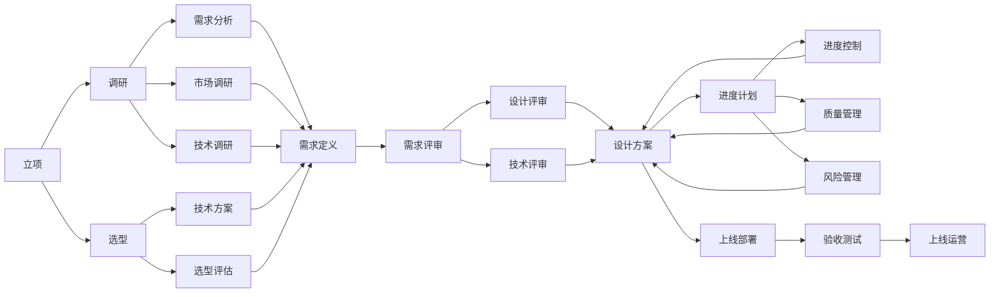
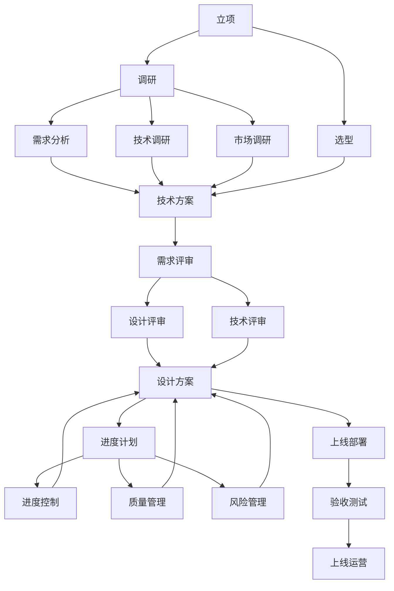
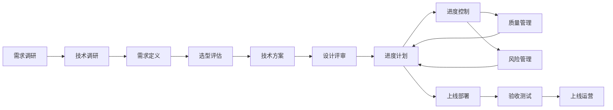
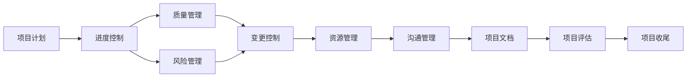
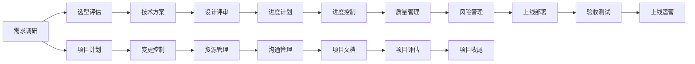

                 

# 信息系统的立项、调研、选型、评审、技术接口、上线和项目管理方案

## 1. 背景介绍

### 1.1 问题由来

近年来，随着信息化和数字化进程的加速，各行各业对信息系统的需求日益增加。信息系统不仅是一个技术问题，更是一个涉及管理、组织架构、业务流程等诸多方面的复杂工程项目。

然而，由于信息系统的复杂性、不确定性和风险性，在立项、选型、建设、上线等各个阶段，面临诸多挑战。

如何系统化、规范化地进行立项、调研、选型、评审、技术接口、上线和项目管理，已成为信息化工作者的重要课题。

### 1.2 问题核心关键点

为更好地理解信息系统开发和项目管理流程，本节将介绍几个密切相关的核心概念：

- **立项**：确定项目目标、需求、预算、时间等关键要素，是项目管理的起点。
- **调研**：对业务需求、市场趋势、技术可行性等进行全面分析，为项目决策提供依据。
- **选型**：在众多技术方案中选择最优的软硬件和开发工具，保障项目顺利实施。
- **评审**：由项目组、专家团队和领导层对项目需求、设计、进度、预算等进行审核，确保项目顺利推进。
- **技术接口**：定义系统内部和外部的数据接口、通信协议等，保障系统间互操作性。
- **上线**：将开发完成的信息系统部署到生产环境，投入使用，是项目实施的关键步骤。
- **项目管理**：涉及项目计划、进度控制、质量管理、风险应对等多个环节，是项目成功的保障。

这些核心概念之间的逻辑关系可以通过以下Mermaid流程图来展示：

这个流程图展示了大信息系统开发和项目管理流程的各个环节：

1. 从立项开始，确定项目目标和范围。
2. 进行需求分析和调研，了解业务和市场情况。
3. 对技术方案进行评估，选择合适的软硬件和开发工具。
4. 设计阶段，明确需求和技术细节，进行评审。
5. 制定进度计划，控制项目进度，进行质量管理和风险应对。
6. 部署上线，进行验收测试，确保系统稳定运行。
7. 上线运营，持续优化和维护。

这些概念共同构成了信息系统开发和项目管理的基本框架，使得项目团队能够有序推进各个环节，保障项目成功实施。

## 2. 核心概念与联系

### 2.1 核心概念概述

为更好地理解信息系统开发和项目管理流程，本节将介绍几个密切相关的核心概念：

- **立项**：是项目管理的起点，涉及确定项目目标、范围、时间、预算等关键要素。
- **调研**：对业务需求、市场趋势、技术可行性等进行全面分析，为项目决策提供依据。
- **选型**：在众多技术方案中选择最优的软硬件和开发工具，保障项目顺利实施。
- **评审**：由项目组、专家团队和领导层对项目需求、设计、进度、预算等进行审核，确保项目顺利推进。
- **技术接口**：定义系统内部和外部的数据接口、通信协议等，保障系统间互操作性。
- **上线**：将开发完成的信息系统部署到生产环境，投入使用，是项目实施的关键步骤。
- **项目管理**：涉及项目计划、进度控制、质量管理、风险应对等多个环节，是项目成功的保障。

这些核心概念之间的逻辑关系可以通过以下Mermaid流程图来展示：

这个流程图展示了大信息系统开发和项目管理流程的各个环节：

1. 从立项开始，确定项目目标和范围。
2. 进行需求分析和调研，了解业务和市场情况。
3. 对技术方案进行评估，选择合适的软硬件和开发工具。
4. 设计阶段，明确需求和技术细节，进行评审。
5. 制定进度计划，控制项目进度，进行质量管理和风险应对。
6. 部署上线，进行验收测试，确保系统稳定运行。
7. 上线运营，持续优化和维护。

这些概念共同构成了信息系统开发和项目管理的基本框架，使得项目团队能够有序推进各个环节，保障项目成功实施。

### 2.2 概念间的关系

这些核心概念之间存在着紧密的联系，形成了信息系统开发和项目管理流程的完整生态系统。下面我们通过几个Mermaid流程图来展示这些概念之间的关系。

#### 2.2.1 信息系统开发流程

这个流程图展示了信息系统开发流程的关键步骤：

1. 需求调研，确定项目目标和需求。
2. 技术调研，了解市场和可用技术。
3. 需求定义，明确具体需求和技术细节。
4. 选型评估，选择最适合的技术方案。
5. 设计评审，审核设计方案和需求。
6. 制定进度计划，控制项目进度。
7. 进度控制，确保项目按计划推进。
8. 质量管理，保障系统质量。
9. 风险管理，应对项目风险。
10. 上线部署，将系统部署到生产环境。
11. 验收测试，确保系统稳定运行。
12. 上线运营，持续优化和维护。

#### 2.2.2 信息系统项目管理流程

这个流程图展示了信息系统的项目管理流程：

1. 项目计划，制定详细计划和时间表。
2. 进度控制，确保项目按计划推进。
3. 质量管理，保障系统质量。
4. 风险管理，应对项目风险。
5. 变更控制，管理项目变更。
6. 资源管理，分配和管理项目资源。
7. 沟通管理，确保项目沟通顺畅。
8. 项目文档，记录项目所有重要信息。
9. 项目评估，评估项目进展和效果。
10. 项目收尾，完成项目总结和评估。

#### 2.2.3 信息系统开发和项目管理的关系

这个综合流程图展示了信息系统开发和项目管理的完整流程：

1. 从需求调研开始，确定项目目标和需求。
2. 对技术方案进行评估，选择合适的软硬件和开发工具。
3. 设计阶段，明确需求和技术细节，进行评审。
4. 制定进度计划，控制项目进度。
5. 进度控制，确保项目按计划推进。
6. 质量管理，保障系统质量。
7. 风险管理，应对项目风险。
8. 上线部署，将系统部署到生产环境。
9. 验收测试，确保系统稳定运行。
10. 上线运营，持续优化和维护。
11. 项目计划，制定详细计划和时间表。
12. 变更控制，管理项目变更。
13. 资源管理，分配和管理项目资源。
14. 沟通管理，确保项目沟通顺畅。
15. 项目文档，记录项目所有重要信息。
16. 项目评估，评估项目进展和效果。
17. 项目收尾，完成项目总结和评估。

通过这些流程图，我们可以更清晰地理解信息系统开发和项目管理流程的各个环节及其相互关系，为后续深入讨论具体的开发和项目管理方法奠定基础。

## 3. 核心算法原理 & 具体操作步骤

### 3.1 算法原理概述

信息系统开发和项目管理流程的实现，涉及多个环节和复杂的工作内容。为更好地理解各个环节的工作原理，本节将详细介绍核心算法的原理和操作步骤。

#### 3.1.1 需求调研

需求调研是项目管理的起点，通过与业务部门和用户交流，获取业务需求和用户期望，为项目目标和范围的确定提供依据。需求调研的基本流程如下：

1. **业务了解**：与业务部门和用户进行访谈，了解业务背景和目标。
2. **需求收集**：通过问卷调查、用户访谈等方式，收集用户需求和期望。
3. **需求整理**：将收集到的需求进行整理和归纳，形成需求文档。
4. **需求评审**：组织业务部门、用户和项目组对需求文档进行评审，确认需求准确性。

#### 3.1.2 技术调研

技术调研是项目调研的重要环节，通过了解当前市场上的技术和产品，为技术方案的选择提供依据。技术调研的基本流程如下：

1. **市场调研**：了解市场上同类产品的功能和特点。
2. **技术调研**：了解当前主流的技术框架和工具。
3. **技术评估**：对各技术方案进行评估，选择最适合的技术方案。
4. **技术选型**：根据评估结果，确定最终的技术选型方案。

#### 3.1.3 需求定义

需求定义是项目开发的关键环节，将业务需求和技术方案进行细化和明确，为后续设计提供依据。需求定义的基本流程如下：

1. **需求分解**：将整体需求进行分解，细化为具体的任务和功能点。
2. **功能设计**：对每个功能点进行详细设计，明确功能和实现细节。
3. **需求文档**：将功能设计结果形成详细的技术文档。
4. **需求评审**：组织业务部门、用户和项目组对需求文档进行评审，确认需求准确性。

#### 3.1.4 选型评估

选型评估是技术方案选择的关键环节，通过对比各技术方案的优缺点，选择最适合的方案。选型评估的基本流程如下：

1. **方案比较**：对比各技术方案的功能、性能、易用性等指标。
2. **方案评估**：根据对比结果，对各方案进行评估，选择最优方案。
3. **选型文档**：将选型结果形成详细的技术文档。
4. **选型评审**：组织技术团队和业务部门对选型文档进行评审，确认选型准确性。

#### 3.1.5 设计评审

设计评审是项目开发的重要环节，通过审核设计方案，确保设计方案符合业务需求和技术要求。设计评审的基本流程如下：

1. **设计文档**：编写详细的设计文档，包括系统架构、模块划分、接口设计等。
2. **设计评审**：组织技术团队和业务部门对设计文档进行评审，确认设计合理性。
3. **设计调整**：根据评审结果，对设计文档进行调整和优化。
4. **设计确认**：最终确认设计文档，形成设计方案。

#### 3.1.6 进度计划

进度计划是项目实施的关键环节，通过制定详细的时间表和任务分配，确保项目按时完成。进度计划的基本流程如下：

1. **任务分解**：将项目任务进行分解，形成详细的任务清单。
2. **时间估算**：对每个任务进行时间估算，确定任务完成时间。
3. **时间安排**：根据时间估算，制定详细的时间表。
4. **任务分配**：将任务分配给项目组成员，明确责任分工。

#### 3.1.7 进度控制

进度控制是项目实施的重要环节，通过监控和控制项目进度，确保项目按计划推进。进度控制的基本流程如下：

1. **进度监控**：实时监控项目进度，了解任务完成情况。
2. **进度调整**：根据进度监控结果，对进度进行调整和优化。
3. **进度汇报**：定期向领导和业务部门汇报项目进度。

#### 3.1.8 质量管理

质量管理是项目实施的关键环节，通过制定和执行质量标准，确保系统质量符合预期。质量管理的基本流程如下：

1. **质量标准**：制定详细的质量标准和规范。
2. **质量检查**：对项目每个阶段进行质量检查，发现和解决问题。
3. **质量控制**：对项目每个阶段进行质量控制，确保符合质量标准。
4. **质量评估**：对项目整体质量进行评估，确认系统质量。

#### 3.1.9 风险管理

风险管理是项目实施的重要环节，通过识别和应对项目风险，保障项目顺利推进。风险管理的基本流程如下：

1. **风险识别**：识别项目可能面临的各种风险。
2. **风险评估**：对各风险进行评估，确定风险等级和影响。
3. **风险应对**：制定应对各风险的策略和措施。
4. **风险监控**：实时监控项目风险，及时应对风险。

#### 3.1.10 上线部署

上线部署是项目实施的关键环节，通过将系统部署到生产环境，确保系统稳定运行。上线部署的基本流程如下：

1. **部署计划**：制定详细的部署计划，明确部署步骤和时间。
2. **部署执行**：按照部署计划，执行系统部署。
3. **系统测试**：对部署后的系统进行测试，确保系统稳定运行。
4. **上线运营**：将系统上线运行，提供服务。

#### 3.1.11 验收测试

验收测试是项目实施的重要环节，通过测试系统功能、性能和安全性，确保系统满足业务需求。验收测试的基本流程如下：

1. **测试计划**：制定详细的测试计划，明确测试内容和步骤。
2. **测试执行**：按照测试计划，执行系统测试。
3. **测试报告**：根据测试结果，撰写详细的测试报告。
4. **测试评审**：组织业务部门和项目组对测试报告进行评审，确认系统质量。

#### 3.1.12 上线运营

上线运营是项目实施的关键环节，通过持续优化和维护，确保系统稳定运行和功能完善。上线运营的基本流程如下：

1. **运营计划**：制定详细的运营计划，明确运营内容和步骤。
2. **系统维护**：对系统进行日常维护和故障处理。
3. **性能优化**：对系统进行性能优化，提升系统性能。
4. **功能扩展**：根据业务需求，对系统进行功能扩展和升级。

### 3.2 算法步骤详解

#### 3.2.1 需求调研

**步骤1：业务了解**
- 通过访谈和调研，了解业务部门和用户的业务背景和目标。

**步骤2：需求收集**
- 设计问卷调查表，进行用户需求调查。
- 与业务部门和用户进行访谈，收集用户需求和期望。

**步骤3：需求整理**
- 将收集到的需求进行整理和归纳，形成需求文档。
- 对需求文档进行分类和梳理，明确需求关系和优先级。

**步骤4：需求评审**
- 组织业务部门、用户和项目组对需求文档进行评审，确认需求准确性。
- 根据评审结果，对需求文档进行调整和优化。

#### 3.2.2 技术调研

**步骤1：市场调研**
- 收集市场上同类产品的功能、性能和用户体验。
- 分析同类产品的优缺点，了解市场趋势和需求。

**步骤2：技术调研**
- 了解当前主流的技术框架和工具。
- 分析各技术框架和工具的优缺点，了解技术发展方向。

**步骤3：技术评估**
- 对比各技术方案的功能、性能、易用性等指标。
- 根据对比结果，对各方案进行评估，选择最优方案。

**步骤4：选型文档**
- 将选型结果形成详细的技术文档。
- 对选型文档进行评审，确认选型准确性。

#### 3.2.3 需求定义

**步骤1：需求分解**
- 将整体需求进行分解，细化为具体的任务和功能点。
- 对每个功能点进行详细设计，明确功能和实现细节。

**步骤2：功能设计**
- 对每个功能点进行详细设计，明确功能和实现细节。
- 设计详细的技术文档，包括系统架构、模块划分、接口设计等。

**步骤3：需求文档**
- 将功能设计结果形成详细的技术文档。
- 对需求文档进行评审，确认需求准确性。

#### 3.2.4 选型评估

**步骤1：方案比较**
- 对比各技术方案的功能、性能、易用性等指标。
- 根据对比结果，对各方案进行评估，选择最优方案。

**步骤2：方案评估**
- 根据对比结果，对各方案进行评估，选择最优方案。
- 制定详细的选型文档，包括选型方案、评估标准和结果。

**步骤3：选型文档**
- 将选型结果形成详细的技术文档。
- 对选型文档进行评审，确认选型准确性。

#### 3.2.5 设计评审

**步骤1：设计文档**
- 编写详细的设计文档，包括系统架构、模块划分、接口设计等。
- 对设计文档进行评审，确认设计合理性。

**步骤2：设计调整**
- 根据评审结果，对设计文档进行调整和优化。
- 最终确认设计文档，形成设计方案。

#### 3.2.6 进度计划

**步骤1：任务分解**
- 将项目任务进行分解，形成详细的任务清单。
- 对每个任务进行时间估算，确定任务完成时间。

**步骤2：时间安排**
- 根据时间估算，制定详细的时间表。
- 将任务分配给项目组成员，明确责任分工。

#### 3.2.7 进度控制

**步骤1：进度监控**
- 实时监控项目进度，了解任务完成情况。
- 根据进度监控结果，对进度进行调整和优化。

**步骤2：进度汇报**
- 定期向领导和业务部门汇报项目进度。
- 根据汇报结果，及时调整进度计划。

#### 3.2.8 质量管理

**步骤1：质量标准**
- 制定详细的质量标准和规范。
- 对项目每个阶段进行质量检查，发现和解决问题。

**步骤2：质量控制**
- 对项目每个阶段进行质量控制，确保符合质量标准。
- 根据质量控制结果，及时调整和优化。

#### 3.2.9 风险管理

**步骤1：风险识别**
- 识别项目可能面临的各种风险。
- 对各风险进行评估，确定风险等级和影响。

**步骤2：风险评估**
- 根据风险评估结果，制定应对各风险的策略和措施。
- 实时监控项目风险，及时应对风险。

#### 3.2.10 上线部署

**步骤1：部署计划**
- 制定详细的部署计划，明确部署步骤和时间。
- 对部署步骤进行详细安排，确保部署顺利进行。

**步骤2：部署执行**
- 按照部署计划，执行系统部署。
- 对每个步骤进行详细记录和监控。

**步骤3：系统测试**
- 对部署后的系统进行测试，确保系统稳定运行。
- 根据测试结果，及时调整和优化。

#### 3.2.11 验收测试

**步骤1：测试计划**
- 制定详细的测试计划，明确测试内容和步骤。
- 对测试内容进行详细安排，确保测试全面覆盖。

**步骤2：测试执行**
- 按照测试计划，执行系统测试。
- 对每个测试步骤进行详细记录和监控。

**步骤3：测试报告**
- 根据测试结果，撰写详细的测试报告。
- 对测试报告进行评审，确认系统质量。

#### 3.2.12 上线运营

**步骤1：运营计划**
- 制定详细的运营计划，明确运营内容和步骤。
- 对运营内容进行详细安排，确保运营顺利进行。

**步骤2：系统维护**
- 对系统进行日常维护和故障处理。
- 对系统进行定期检查和优化。

**步骤3：性能优化**
- 对系统进行性能优化，提升系统性能。
- 根据性能优化结果，及时调整和优化。

**步骤4：功能扩展**
- 根据业务需求，对系统进行功能扩展和升级。
- 对功能扩展进行详细安排和测试，确保功能完善。

### 3.3 算法优缺点

信息系统开发和项目管理流程涉及多个环节和复杂的工作内容，其优缺点如下：

**优点：**
- **规范化管理**：通过规范化的项目管理流程，确保项目按计划推进，保障项目质量。
- **资源优化**：通过合理的任务分配和资源管理，提高项目执行效率，降低资源浪费。
- **风险控制**：通过识别和应对项目风险，保障项目顺利推进，避免项目失败。
- **质量保证**：通过严格的进度控制和质量管理，确保系统质量符合预期，提升用户满意度。

**缺点：**
- **流程复杂**：涉及多个环节和复杂的工作内容，管理难度较大。
- **资源依赖**：对人力、物力、财力等资源依赖较大，资源配置不当可能影响项目进度。
- **沟通难度**：涉及多方沟通协调，沟通不畅可能导致误解和冲突。
- **变化响应**：项目实施过程中可能遇到各种变化，变更管理难度较大。

## 4. 数学模型和公式 & 详细讲解 & 举例说明

### 4.1 数学模型构建

本节将使用数学语言对信息系统开发和项目管理流程进行更加严格的刻画。

记信息系统开发和项目管理流程为 $P$，其中包含多个阶段 $S_1, S_2, \cdots, S_n$，每个阶段包含多个任务 $T_{i,j}$，任务 $T_{i,j}$ 的执行时间为 $t_{i,j}$，任务 $T_{i,j}$ 的优先级为 $p_{i,j}$，任务 $T_{i,j}$ 的资源需求为 $r_{i,j}$。则信息系统开发和项目管理流程的数学模型为：

$$
P = \left\{ (S_1, T_{1,1}, T_{1,2}, \cdots, T_{1,m_1}), (S_2, T_{2,1}, T_{2,2}, \cdots, T_{2,m_2}), \cdots, (S_n, T_{n,1}, T_{n,2}, \cdots, T_{n,m_n}) \right\}
$$

其中 $S_i$ 为第 $i$ 个阶段，$T_{i,j}$ 为第 $i$ 个阶段的第 $j$ 个任务，$m_i$ 为第 $i$ 个阶段的任务数，$n$ 为阶段数。

### 4.2 公式推导过程

信息系统开发和项目管理流程的数学模型可以通过以下公式进行推导：

**任务执行时间公式**：

$$
t_{i,j} = a_{i,j} \times p_{i,j}
$$

其中 $a_{i,j}$ 为任务 $T_{i,j}$ 的执行系数，$p_{i,j}$ 为任务 $T_{i,j}$ 的优先级。

**资源需求公式**：

$$
r_{i,j} = b_{i,j} \times p_{i,j}
$$

其中 $b_{i,j}$ 为任务 $T_{i,j}$ 的资源系数，$p_{i,j}$ 为任务 $T_{i,j}$

