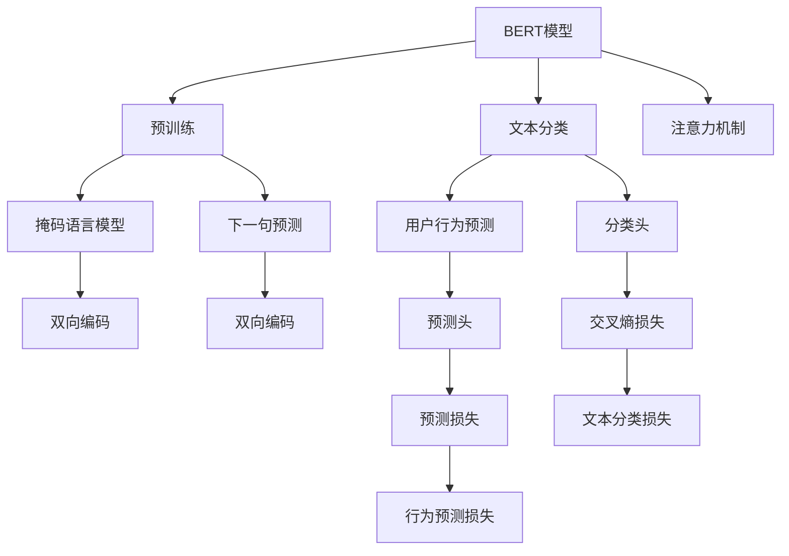
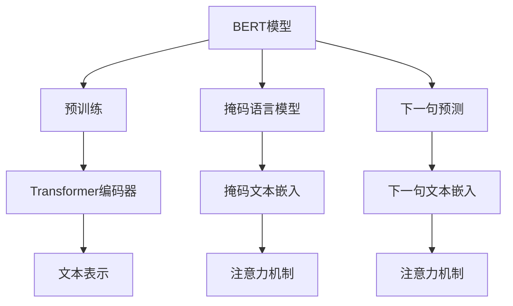
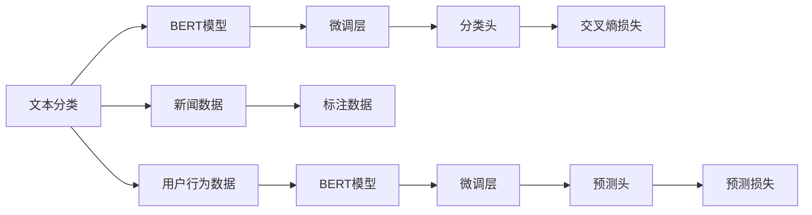

                 

# 基于BERT的新闻文本分类与用户行为预测的分析与应用

> 关键词：BERT, 自然语言处理(NLP), 文本分类, 用户行为预测, 注意力机制, 深度学习, 强化学习

## 1. 背景介绍

### 1.1 问题由来
在信息爆炸的时代，每天有大量新闻和信息充斥着我们的互联网。如何有效地筛选和分类这些信息，以及预测用户的阅读和互动行为，成为了各大新闻平台和社交媒体面临的重要挑战。传统方法依赖于专家团队进行手动标注和分类，不仅成本高、速度慢，而且分类结果的准确性往往难以保证。

近年来，深度学习特别是Transformer模型在自然语言处理（Natural Language Processing, NLP）领域取得了突破性的进展。基于BERT（Bidirectional Encoder Representations from Transformers）的模型，能够从大规模无标注数据中学习到丰富的语言表示，在新闻分类和用户行为预测等任务上展现了强大的性能。

### 1.2 问题核心关键点
本文聚焦于如何利用BERT模型进行新闻文本的分类，以及如何基于用户阅读历史预测用户的行为（如点赞、评论、分享等）。通过精心设计的任务适配层和损失函数，使得模型能够准确理解和分类新闻文本，同时通过序列模型预测用户行为，实现更为精准的个性化推荐。

### 1.3 问题研究意义
研究新闻文本分类与用户行为预测，对于提升新闻平台和社交媒体的用户体验，优化内容推荐系统，具有重要意义：

1. **提高内容推荐精准度**：通过精准分类新闻，提供相关性更高的内容，使用户获取更多符合兴趣的信息。
2. **优化用户互动行为**：准确预测用户的行为，动态调整推荐策略，提升用户的参与度和满意度。
3. **降低运营成本**：自动化新闻分类和用户行为预测，减少人工干预，降低运营成本。
4. **提升广告投放效果**：通过精准的用户行为预测，提供更为精准的广告推荐，提高广告效果和转化率。
5. **增强数据洞察**：通过分析用户的行为数据，提供更深层次的数据洞察，为业务决策提供依据。

## 2. 核心概念与联系

### 2.1 核心概念概述

为更好地理解基于BERT的新闻文本分类与用户行为预测方法，本节将介绍几个密切相关的核心概念：

- **BERT模型**：由Google开发的基于Transformer架构的预训练语言模型，能够从双向上下文语境中学习到丰富的语言表示。BERT在预训练阶段通过掩码语言模型和下一句预测任务进行训练，学习到强大的语言理解和表示能力。

- **文本分类**：将文本数据按照预定义的分类标签进行划分，以便于管理和利用。常见的新闻分类任务包括政治、经济、科技、娱乐等。

- **用户行为预测**：基于用户的浏览、点赞、评论等行为数据，预测用户未来的行为，如点赞、评论、分享等。

- **注意力机制**：在Transformer模型中，通过注意力机制将输入序列中每个位置的信息与其它位置的信息进行动态交互，实现重点信息的提取和融合。

- **深度学习**：利用多层神经网络进行数据建模和预测，具有强大的数据拟合能力和泛化能力。

- **强化学习**：通过智能体与环境的交互，通过奖励信号指导智能体的行为，实现自主学习和优化。

这些核心概念之间的逻辑关系可以通过以下Mermaid流程图来展示：



这个流程图展示了大语言模型的核心概念及其之间的关系：

1. BERT模型通过预训练获得基础能力。
2. 文本分类和用户行为预测通过微调 Bert 模型实现。
3. 注意力机制使模型能够动态选择关键信息。
4. 深度学习提供强大的数据拟合能力。
5. 强化学习指导模型自主优化行为预测。

这些概念共同构成了新闻文本分类与用户行为预测的整体框架，使其能够实现精准的内容推荐和用户行为预测。

### 2.2 概念间的关系

这些核心概念之间存在着紧密的联系，形成了新闻文本分类与用户行为预测的完整生态系统。下面我们通过几个Mermaid流程图来展示这些概念之间的关系。

#### 2.2.1 BERT模型的学习范式



这个流程图展示了BERT模型的预训练过程。BERT通过掩码语言模型和下一句预测任务，学习到双向语境中的语言表示，并通过注意力机制对不同位置的信息进行动态交互。

#### 2.2.2 文本分类与用户行为预测的微调关系



这个流程图展示了文本分类和用户行为预测的微调过程。通过微调BERT模型，使其能够适应特定的分类任务，并通过加入分类头来实现文本分类。同时，通过预测头进行用户行为预测，实现序列建模。

#### 2.2.3 注意力机制与深度学习的关系

```mermaid
graph TB
    A[注意力机制] --> B[Transformer]
    A --> C[编码器-解码器结构]
    B --> D[多头自注意力]
    C --> E[自注意力机制]
    D --> F[多头自注意力]
    E --> G[多头自注意力]
    F --> H[多头自注意力]
    G --> I[多头自注意力]
    H --> J[多头自注意力]
    I --> K[多头自注意力]
    J --> L[多头自注意力]
    E --> M[多头自注意力]
    F --> N[多头自注意力]
    G --> O[多头自注意力]
    H --> P[多头自注意力]
    I --> Q[多头自注意力]
    J --> R[多头自注意力]
    M --> S[多头自注意力]
    N --> T[多头自注意力]
    O --> U[多头自注意力]
    P --> V[多头自注意力]
    Q --> W[多头自注意力]
    R --> X[多头自注意力]
    S --> Y[多头自注意力]
    T --> Z[多头自注意力]
    U --> AA[多头自注意力]
    V --> BB[多头自注意力]
    W --> CC[多头自注意力]
    X --> DD[多头自注意力]
    Y --> EE[多头自注意力]
    Z --> FF[多头自注意力]
    AA --> GG[多头自注意力]
    BB --> HH[多头自注意力]
    CC --> II[多头自注意力]
    DD --> JJ[多头自注意力]
    EE --> KK[多头自注意力]
    FF --> LL[多头自注意力]
    GG --> MM[多头自注意力]
    HH --> NN[多头自注意力]
    II --> OO[多头自注意力]
    JJ --> PP[多头自注意力]
    KK --> QQ[多头自注意力]
    LL --> RR[多头自注意力]
    MM --> SS[多头自注意力]
    NN --> TT[多头自注意力]
    OO --> UU[多头自注意力]
    PP --> VV[多头自注意力]
    QQ --> WW[多头自注意力]
    RR --> XX[多头自注意力]
    SS --> YY[多头自注意力]
    TT --> ZZ[多头自注意力]
    UU --> AAA[多头自注意力]
    VV --> BBB[多头自注意力]
    WW --> CCC[多头自注意力]
    XX --> DDD[多头自注意力]
    YY --> EEE[多头自注意力]
    ZZ --> FFF[多头自注意力]
    AAA --> GGG[多头自注意力]
    BBB --> HHH[多头自注意力]
    CCC --> III[多头自注意力]
    DDD --> JJJ[多头自注意力]
    EEE --> KKK[多头自注意力]
    FFF --> LLL[多头自注意力]
    GGG --> MNN[多头自注意力]
    HHH --> OOO[多头自注意力]
    III --> PPP[多头自注意力]
    JJJ --> QQQ[多头自注意力]
    KKK --> RRR[多头自注意力]
    LLL --> SSS[多头自注意力]
    MNN --> TTT[多头自注意力]
    OOO --> UUU[多头自注意力]
    PPP --> VVV[多头自注意力]
    QQQ --> WWW[多头自注意力]
    RRR --> XXX[多头自注意力]
    SSS --> YYY[多头自注意力]
    TTT --> ZZZ[多头自注意力]
    UUU --> AAA[多头自注意力]
    VVV --> BBB[多头自注意力]
    WWW --> CCC[多头自注意力]
    XXX --> DDD[多头自注意力]
    YYY --> EEE[多头自注意力]
    ZZZ --> FFF[多头自注意力]
    AAA --> GGG[多头自注意力]
    BBB --> HHH[多头自注意力]
    CCC --> III[多头自注意力]
    DDD --> JJJ[多头自注意力]
    EEE --> KKK[多头自注意力]
    FFF --> LLL[多头自注意力]
    GGG --> MNN[多头自注意力]
    HHH --> OOO[多头自注意力]
    III --> PPP[多头自注意力]
    JJJ --> QQQ[多头自注意力]
    KKK --> RRR[多头自注意力]
    LLL --> SSS[多头自注意力]
    MNN --> TTT[多头自注意力]
    OOO --> UUU[多头自注意力]
    PPP --> VVV[多头自注意力]
    QQQ --> WWW[多头自注意力]
    RRR --> XXX[多头自注意力]
    SSS --> YYY[多头自注意力]
    TTT --> ZZZ[多头自注意力]
    UUU --> AAA[多头自注意力]
    VVV --> BBB[多头自注意力]
    WWW --> CCC[多头自注意力]
    XXX --> DDD[多头自注意力]
    YYY --> EEE[多头自注意力]
    ZZZ --> FFF[多头自注意力]
    AAA --> GGG[多头自注意力]
    BBB --> HHH[多头自注意力]
    CCC --> III[多头自注意力]
    DDD --> JJJ[多头自注意力]
    EEE --> KKK[多头自注意力]
    FFF --> LLL[多头自注意力]
    GGG --> MNN[多头自注意力]
    HHH --> OOO[多头自注意力]
    III --> PPP[多头自注意力]
    JJJ --> QQQ[多头自注意力]
    KKK --> RRR[多头自注意力]
    LLL --> SSS[多头自注意力]
    MNN --> TTT[多头自注意力]
    OOO --> UUU[多头自注意力]
    PPP --> VVV[多头自注意力]
    QQQ --> WWW[多头自注意力]
    RRR --> XXX[多头自注意力]
    SSS --> YYY[多头自注意力]
    TTT --> ZZZ[多头自注意力]
    UUU --> AAA[多头自注意力]
    VVV --> BBB[多头自注意力]
    WWW --> CCC[多头自注意力]
    XXX --> DDD[多头自注意力]
    YYY --> EEE[多头自注意力]
    ZZZ --> FFF[多头自注意力]
    AAA --> GGG[多头自注意力]
    BBB --> HHH[多头自注意力]
    CCC --> III[多头自注意力]
    DDD --> JJJ[多头自注意力]
    EEE --> KKK[多头自注意力]
    FFF --> LLL[多头自注意力]
    GGG --> MNN[多头自注意力]
    HHH --> OOO[多头自注意力]
    III --> PPP[多头自注意力]
    JJJ --> QQQ[多头自注意力]
    KKK --> RRR[多头自注意力]
    LLL --> SSS[多头自注意力]
    MNN --> TTT[多头自注意力]
    OOO --> UUU[多头自注意力]
    PPP --> VVV[多头自注意力]
    QQQ --> WWW[多头自注意力]
    RRR --> XXX[多头自注意力]
    SSS --> YYY[多头自注意力]
    TTT --> ZZZ[多头自注意力]
    UUU --> AAA[多头自注意力]
    VVV --> BBB[多头自注意力]
    WWW --> CCC[多头自注意力]
    XXX --> DDD[多头自注意力]
    YYY --> EEE[多头自注意力]
    ZZZ --> FFF[多头自注意力]
    AAA --> GGG[多头自注意力]
    BBB --> HHH[多头自注意力]
    CCC --> III[多头自注意力]
    DDD --> JJJ[多头自注意力]
    EEE --> KKK[多头自注意力]
    FFF --> LLL[多头自注意力]
    GGG --> MNN[多头自注意力]
    HHH --> OOO[多头自注意力]
    III --> PPP[多头自注意力]
    JJJ --> QQQ[多头自注意力]
    KKK --> RRR[多头自注意力]
    LLL --> SSS[多头自注意力]
    MNN --> TTT[多头自注意力]
    OOO --> UUU[多头自注意力]
    PPP --> VVV[多头自注意力]
    QQQ --> WWW[多头自注意力]
    RRR --> XXX[多头自注意力]
    SSS --> YYY[多头自注意力]
    TTT --> ZZZ[多头自注意力]
    UUU --> AAA[多头自注意力]
    VVV --> BBB[多头自注意力]
    WWW --> CCC[多头自注意力]
    XXX --> DDD[多头自注意力]
    YYY --> EEE[多头自注意力]
    ZZZ --> FFF[多头自注意力]
    AAA --> GGG[多头自注意力]
    BBB --> HHH[多头自注意力]
    CCC --> III[多头自注意力]
    DDD --> JJJ[多头自注意力]
    EEE --> KKK[多头自注意力]
    FFF --> LLL[多头自注意力]
    GGG --> MNN[多头自注意力]
    HHH --> OOO[多头自注意力]
    III --> PPP[多头自注意力]
    JJJ --> QQQ[多头自注意力]
    KKK --> RRR[多头自注意力]
    LLL --> SSS[多头自注意力]
    MNN --> TTT[多头自注意力]
    OOO --> UUU[多头自注意力]
    PPP --> VVV[多头自注意力]
    QQQ --> WWW[多头自注意力]
    RRR --> XXX[多头自注意力]
    SSS --> YYY[多头自注意力]
    TTT --> ZZZ[多头自注意力]
    UUU --> AAA[多头自注意力]
    VVV --> BBB[多头自注意力]
    WWW --> CCC[多头自注意力]
    XXX --> DDD[多头自注意力]
    YYY --> EEE[多头自注意力]
    ZZZ --> FFF[多头自注意力]
    AAA --> GGG[多头自注意力]
    BBB --> HHH[多头自注意力]
    CCC --> III[多头自注意力]
    DDD --> JJJ[多头自注意力]
    EEE --> KKK[多头自注意力]
    FFF --> LLL[多头自注意力]
    GGG --> MNN[多头自注意力]
    HHH --> OOO[多头自注意力]
    III --> PPP[多头自注意力]
    JJJ --> QQQ[多头自注意力]
    KKK --> RRR[多头自注意力]
    LLL --> SSS[多头自注意力]
    MNN --> TTT[多头自注意力]
    OOO --> UUU[多头自注意力]
    PPP --> VVV[多头自注意力]
    QQQ --> WWW[多头自注意力]
    RRR --> XXX[多头自注意力]
    SSS --> YYY[多头自注意力]
    TTT --> ZZZ[多头自注意力]
    UUU --> AAA[多头自注意力]
    VVV --> BBB[多头自注意力]
    WWW --> CCC[多头自注意力]
    XXX --> DDD[多头自注意力]
    YYY --> EEE[多头自注意力]
    ZZZ --> FFF[多头自注意力]
    AAA --> GGG[多头自注意力]
    BBB --> HHH[多头自注意力]
    CCC --> III[多头自注意力]
    DDD --> JJJ[多头自注意力]
    EEE --> KKK[多头自注意力]
    FFF --> LLL[多头自注意力]
    GGG --> MNN[多头自注意力]
    HHH --> OOO[多头自注意力]
    III --> PPP[多头自注意力]
    JJJ --> QQQ[多头自注意力]
    KKK --> RRR[多头自注意力]
    LLL --> SSS[多头自注意力]
    MNN --> TTT[多头自注意力]
    OOO --> UUU[多头自注意力]
    PPP --> VVV[多头自注意力]
    QQQ --> WWW[多头自注意力]
    RRR --> XXX[多头自注意力]
    SSS --> YYY[多头自注意力]
    TTT --> ZZZ[多头自注意力]
    UUU --> AAA[多头自注意力]
    VVV --> BBB[多头自注意力]
    WWW --> CCC[多头自注意力]
    XXX --> DDD[多头自注意力]
    YYY --> EEE[多头自注意力]
    ZZZ --> FFF[多头自注意力]
    AAA --> GGG[多头自注意力]
    BBB --> HHH[多头自注意力]
    CCC --> III[多头自注意力]
    DDD --> JJJ[多头自注意力]
    EEE --> KKK[多头自注意力]
    FFF --> LLL[多头自注意力]
    GGG --> MNN[多头自注意力]
    HHH --> OOO[多头自注意力]
    III --> PPP[多头自注意力]
    JJJ --> QQQ[多头自注意力]
    KKK --> RRR[多头自注意力]
    LLL --> SSS[多头自注意力]
    MNN --> TTT[多头自注意力]
    OOO --> UUU[多头自注意力]
    PPP --> VVV[多头自注意力]
    QQQ --> WWW[多头自注意力]
    RRR --> XXX[多头自注意力]
    SSS --> YYY[多头自注意力]
    TTT --> ZZZ[多头自注意力]
    UUU --> AAA[多头自注意力]
    VVV --> BBB[多头自注意力]
    WWW --> CCC[多头自注意力]
    XXX --> DDD[多头自注意力]
    YYY --> EEE[多头自注意力]
    ZZZ --> FFF[多头自注意力]
    AAA --> GGG[多头自注意力]
    BBB --> HHH[多头自注意力]
    CCC --> III[多头自注意力]
    DDD --> JJJ[多头自注意力]
    EEE --> KKK[多头自注意力]
    FFF --> LLL[多头自注意力]
    GGG --> MNN[多头自注意力]
    HHH --> OOO[多头自注意力]
    III --> PPP[多头自注意力]
    JJJ --> QQQ[多头自注意力]
    KKK --> RRR[多头自注意力]
    LLL --> SSS[多头自注意力]
    MNN --> TTT[多头自注意力]
    OOO --> UUU[多头自注意力]
    PPP --> VVV[多头自注意力]
    QQQ --> WWW[多头自注意力]
    RRR --> XXX[多头自注意力]
    SSS --> YYY[多头自注意力]
    TTT --> ZZZ[多头自注意力]
    UUU --> AAA[多头自注意力]
    VVV --> BBB[多头自注意力]
    WWW --> CCC[多头自注意力]
    XXX --> DDD[多头自注意力]
    YYY --> EEE[多头自注意力]
    ZZZ --> FFF[多头自注意力]
    AAA --> GGG[多头自注意力]
    BBB --> HHH[多头自注意力]
    CCC --> III[多头自注意力]
    DDD --> JJJ[多头自注意力]
    EEE --> KKK[多头自注意力]
    FFF --> LLL[多头自注意力]
    GGG --> MNN[多头自注意力]
    HHH --> OOO[多头自注意力]
    III --> PPP[多头自注意力]
    JJJ --> QQQ[多头自注意力]
    KKK --> RRR[多头自注意力]
    LLL --> SSS[多头自注意力]
    MNN --> TTT[多头自注意力]
    OOO --> UUU[多头自注意力]
    PPP --> VVV[多头自注意力]
    QQQ --> WWW[多头自注意力]
    RRR --> XXX[多头自注意力]
    SSS --> YYY[多头自注意力]
    TTT --> ZZZ[多头自注意力]
    UUU --> AAA[多头自注意力]
    VVV --> BBB[多头自注意力]
    WWW --> CCC[多头自注意力]
    XXX --> DDD[多头自注意力]
    YYY --> EEE[多头自注意力]
    ZZZ --> FFF[多头自注意力]
    AAA --> GGG[多头自注意力]
    BBB --> HHH[多头自注意力]
    CCC --> III[多头自注意力]
    DDD --> JJJ[多头自注意力]
    EEE --> KKK[多头自注意力]
    FFF --> LLL[多头自注意力]
    GGG --> MNN[多头自注意力]
    HHH --> OOO[多头自注意力]
    III --> PPP[多头自注意力]
    JJJ --> QQQ[多头自注意力]
    KKK --> RRR[多头自注意力]
    LLL --> SSS[多头自注意力]
    MNN --> TTT[多头自注意力]
    OOO --> UUU[多头自注意力]
    PPP --> VVV[多头自注意力]
    QQQ --> WWW[多头自注意力]
    RRR --> XXX[多头自注意力]
    SSS --> YYY[多头自注意力]
    TTT --> ZZZ[多头自注意力]
    UUU --> AAA[多头自注意力]
    VVV --> BBB[多头自注意力]
    WWW --> CCC[多头自注意力]
    XXX --> DDD[多头自注意力]
    YYY --> EEE[多头自注意力]
    ZZZ --> FFF[多头自注意力]
    AAA --> GGG[多头自注意力]
    BBB --> HHH[多头自注意力]
    CCC --> III[多头自注意力]
    DDD --> JJJ[多头自注意力]
    EEE --> KKK[多头自注意力]
    FFF --> LLL[多头自注意力]
    GGG --> MNN[多头自注意力]
    HHH --> OOO[多头自注意力]
    III --> PPP[多头自注意力]
    JJJ --> QQQ[多头自注意力]
    KKK --> RRR[多头自注意力]
    LLL --> SSS[多头自注意力]
    MNN --> TTT[多头自注意力]
    OOO --> UUU[多头自注意力]
    PPP --> VVV[多头自注意力]
    QQQ --> WWW[多头自注意力]
    RRR --> XXX[多头自注意力]
    SSS --> YYY[多头自注意力]
    TTT --> ZZZ[多头自注意力]
    UUU --> AAA[多头自注意力]
    VVV --> BBB[多头自注意力]
    WWW --> CCC[多头自注意力]
    XXX --> DDD[多头自注意力]
    YYY --> EEE[多头自注意力]
    ZZZ --> FFF[多头自注意力]
    AAA --> GGG[多头自注意力]
    BBB --> HHH[多头自注意力]
    CCC --> III[多头自注意力]
    DDD --> JJJ[多头自注意力]
    EEE --> KKK[多头自注意力]
    FFF --> LLL[多头自注意力]
    GGG --> MNN[多头自注意力]
    HHH --> OOO[多头自注意力]
    III --> PPP[多头自注意力]
    JJJ --> QQQ[多头自注意力]
    KKK --> RRR[多头自注意力]
    LLL --> SSS[多头自注意力]
    MNN --> TTT[多头自注意力]
    OOO --> UUU[多头自注意力]
    PPP --> VVV[多头自注意力]
    QQQ --> WWW[多头自注意力]
    RRR --> XXX[多头自注意力]
    SSS --> YYY[多头自注意力]
    TTT --> ZZZ[多头自注意力]
    UUU --> AAA[多头自注意力]
    VVV --> BBB[多头自注意力]
    WWW --> CCC[多头自注意力]
    XXX --> DDD[多头自注意力]
    YYY --> EEE[多头自注意力]
    ZZZ --> FFF[多头自注意力]
    AAA --> GGG[多头自注意力]
    BBB --> HHH[多头自注意力]
    CCC --> III[多头自注意力]
    DDD --> JJJ[多头自注意力]
    EEE --> KKK[多头自注意力]
    FFF --> LLL[多头自注意力]
    GGG --> MNN[多头自注意力]
    HHH --> OOO[多头自注意力]
    III --> PPP[多头自注意力]
    JJJ --> QQQ[多头自注意力]
    KKK --> RRR[多头自注意力]
    LLL --> SSS[多头自注意力]
    MNN --> TTT[多头自

