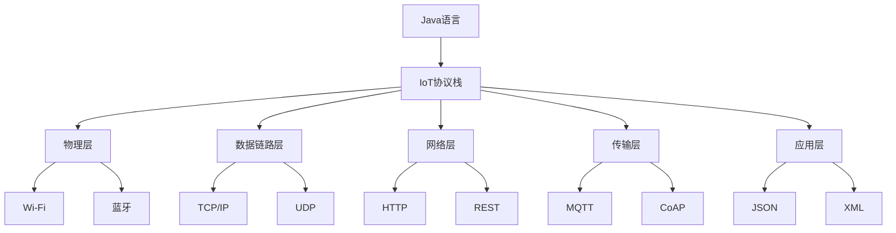

                 

# 基于Java的智能家居设计：Java与物联网(IoT)协议栈全解析

## 1. 背景介绍

随着物联网(IoT)技术的飞速发展，智能家居系统已成为未来家庭生活中不可或缺的一部分。通过利用各种传感器、控制器和网络通信技术，智能家居系统可以实时收集和处理家庭环境数据，提升家居生活的舒适度和安全性。Java作为一种强大的开发语言，凭借其高效的内存管理、跨平台性和强大的生态系统，成为构建智能家居系统的首选。本文将系统介绍Java在智能家居设计中的应用，特别是Java与物联网(IoT)协议栈的结合，帮助读者深入理解智能家居系统的开发和部署。

## 2. 核心概念与联系

### 2.1 核心概念概述

#### 2.1.1 Java语言

Java是一种面向对象的编程语言，具有强类型、跨平台、内存管理自动化、垃圾回收等特点。Java的生态系统非常丰富，拥有大量的框架、库和工具，如Spring、Hibernate、JUnit等，可以快速开发高质量的应用程序。

#### 2.1.2 物联网(IoT)协议栈

物联网协议栈是一系列通信协议和标准，用于实现设备之间的互联互通。常见的物联网协议栈包括MQTT、CoAP、HTTP/REST、XMPP等。协议栈的层次结构通常包括以下几个层次：物理层、数据链路层、网络层、传输层、应用层。

### 2.2 核心概念原理和架构

#### 2.2.1 Java语言原理

Java语言的基本工作原理如下：

1. 字节码生成：Java源代码编译成字节码。
2. 虚拟机执行：字节码通过Java虚拟机(JVM)加载和执行。
3. 内存管理：Java自动管理内存，避免内存泄漏和溢出。
4. 垃圾回收：Java自动回收不再使用的对象，释放内存。

#### 2.2.2 IoT协议栈原理

物联网协议栈的基本工作原理如下：

1. 物理层：定义硬件设备的物理接口，如Wi-Fi、蓝牙等。
2. 数据链路层：建立设备之间的数据链路连接，确保数据的可靠传输。
3. 网络层：实现设备间的逻辑网络通信，例如IP、TCP/UDP等。
4. 传输层：提供端到端的数据传输服务，确保数据的完整性和可靠性。
5. 应用层：定义应用层的协议和数据格式，如MQTT、CoAP等。

### 2.3 核心概念关系图

以下是一个简化的Java与IoT协议栈关系图，展示了Java在物联网系统中的角色：



这个关系图展示了Java在智能家居系统中的应用：Java语言负责编写智能家居系统的应用程序，而IoT协议栈则负责管理设备和网络通信。具体到每个协议层，Java可以通过各种网络库和框架实现相应的协议处理逻辑。

## 3. 核心算法原理 & 具体操作步骤

### 3.1 算法原理概述

Java在智能家居系统中的应用主要涉及以下算法和原理：

1. 面向对象编程：Java支持面向对象编程，有助于设计模块化和可维护的智能家居系统。
2. 并发编程：Java的多线程和锁机制，有助于实现智能家居系统中设备的并发控制。
3. 数据传输协议：Java可以通过Socket、NIO等网络库实现各种数据传输协议，支持MQTT、CoAP等物联网协议。
4. 数据处理和存储：Java通过JDBC、Hibernate等库，可以高效地处理和存储智能家居系统产生的大量数据。
5. 用户界面设计：Java Swing、JavaFX等GUI框架，可以创建美观、交互性强的用户界面。

### 3.2 算法步骤详解

#### 3.2.1 设计智能家居系统架构

智能家居系统通常包括以下组件：

1. 中央控制器：负责整个系统的管理和调度。
2. 传感器：收集家庭环境数据，如温度、湿度、光线等。
3. 控制器：控制家电设备的开关、调光等。
4. 智能终端：用于用户控制和监控家居设备，如手机、平板电脑等。

#### 3.2.2 实现中央控制器

中央控制器可以采用Java Spring Boot框架进行开发，实现以下功能：

1. 设备注册和管理：管理所有注册设备的列表和状态。
2. 数据收集和存储：收集传感器数据，并存储到数据库中。
3. 命令下发和反馈：接收用户命令，并控制相应设备。
4. 异常处理和告警：处理设备异常和系统告警。

#### 3.2.3 实现传感器和控制器

传感器和控制器可以采用Java Socket编程实现，使用TCP/UDP协议进行通信。例如，可以使用以下代码实现一个简单的TCP传感器设备：

```java
import java.io.BufferedReader;
import java.io.IOException;
import java.io.InputStreamReader;
import java.io.OutputStream;
import java.net.Socket;

public class SensorDevice {
    public static void main(String[] args) throws IOException {
        Socket socket = new Socket("192.168.1.10", 8080);
        BufferedReader in = new BufferedReader(new InputStreamReader(socket.getInputStream()));
        OutputStream out = socket.getOutputStream();
        String message = "sensor data";
        out.write(message.getBytes());
        out.flush();
        String response = in.readLine();
        System.out.println("Response: " + response);
        in.close();
        out.close();
        socket.close();
    }
}
```

#### 3.2.4 实现智能终端

智能终端可以使用Java Swing或JavaFX框架进行开发，实现以下功能：

1. 设备列表和控制：显示注册设备列表，并允许用户控制设备。
2. 数据查看和分析：显示传感器数据，并进行分析处理。
3. 用户账户管理：管理用户账户，确保系统安全。

### 3.3 算法优缺点

#### 3.3.1 优点

1. Java跨平台性好，可以运行在各种操作系统上。
2. Java有强大的开发工具和框架，可以加速开发进程。
3. Java垃圾回收机制和异常处理机制，可以提高系统的稳定性和可靠性。

#### 3.3.2 缺点

1. Java性能可能不如本地语言，如C/C++。
2. Java虚拟机可能会消耗较多内存。
3. Java生态系统复杂，初学者需要一定的学习成本。

### 3.4 算法应用领域

Java在智能家居系统的应用领域非常广泛，包括：

1. 智能家电控制：如智能灯光、智能空调、智能窗帘等。
2. 家庭安全监控：如智能摄像头、入侵检测、报警系统等。
3. 能源管理：如智能电表、智能插座、能效分析等。
4. 健康监测：如智能手环、智能体重秤、健康数据分析等。
5. 环境监测：如智能气象站、智能水质监测器、室内空气质量检测等。

## 4. 数学模型和公式 & 详细讲解 & 举例说明

### 4.1 数学模型构建

#### 4.1.1 数据传输模型

智能家居系统中常用的数据传输模型如下：

1. 传感器数据传输：传感器周期性采集家庭环境数据，并通过TCP/UDP协议发送到中央控制器。
2. 控制器命令传输：用户通过智能终端下发控制命令，中央控制器通过TCP/UDP协议将命令发送到相应控制器设备。
3. 数据存储和处理：中央控制器将传感器数据存储到数据库中，并进行分析和处理。

#### 4.1.2 数据传输协议

数据传输协议通常包括以下几个层次：

1. 物理层：定义通信接口和信号传输方式，如Wi-Fi、蓝牙等。
2. 数据链路层：提供错误检测和纠正机制，如TCP/IP的TCP协议。
3. 网络层：提供路由和转发机制，如IP协议。
4. 传输层：提供端到端的可靠传输服务，如TCP协议。
5. 应用层：定义数据格式和协议，如MQTT、CoAP等。

### 4.2 公式推导过程

#### 4.2.1 MQTT协议

MQTT协议是一种轻量级、可靠、高效率的物联网协议，适用于传感器和控制器之间的通信。MQTT协议的报文格式如下：

```
Header:
+--------+----------+----------+----------------+
| Fixed  | Length   | topic    | Payload Length  |
+--------+----------+----------+----------------+
| 1 byte | 1-2 byte | string   | 1-2 byte       |
+--------+----------+----------+----------------+

Payload:
+----------+---------------------+
| Fix Header | Payload              |
+------------+---------------------+
| 1 byte     | 0                   |
+------------+---------------------+
| Payload Length | Payload Payload      |
+------------+---------------------+
```

其中，Fix Header的Value为0，表示这是一个发布(PUBLISH)报文。Payload Length为可变长度，用于表示Payload的长度。

#### 4.2.2 CoAP协议

CoAP协议是一种基于UDP的物联网协议，适用于传感器和控制器之间的通信。CoAP协议的报文格式如下：

```
Header:
+--------+----------+-----------+-----------+----------+-----------+
| Fix     | Code     | Message   | Identifier | Payload  | Option     |
+--------+----------+-----------+-----------+----------+-----------+
| 1 byte | 1 byte   | 1 byte    | 2 byte    | 1-4 byte | 1-13 byte |
+--------+----------+-----------+-----------+----------+-----------+
```

其中，Fix表示报文的类型，Code表示请求类型，Message表示消息类型，Identifier用于识别请求，Payload表示数据载荷，Option用于附加信息。

### 4.3 案例分析与讲解

#### 4.3.1 MQTT协议应用案例

假设有一个智能家居系统，其中传感器周期性采集家庭环境数据，并通过MQTT协议发送到中央控制器。传感器设备的数据格式如下：

```
+----------+----------+-----------+
| Topic    | Payload   |
+----------+-----------+
| room/temp| 23.5     |
+----------+----------+
```

传感器设备发送MQTT报文的Java代码如下：

```java
import java.io.BufferedReader;
import java.io.IOException;
import java.io.InputStreamReader;
import java.io.OutputStream;
import java.net.Socket;
import org.eclipse.paho.client.mqttv3.*;
import org.eclipse.paho.client.mqttv3.persist.MemoryPersistence;

public class SensorDevice {
    public static void main(String[] args) throws IOException, MqttException {
        MqttConnectOptions options = new MqttConnectOptions();
        options.setCleanSession(true);
        options.setConnectionTimeout(60);
        String server = "192.168.1.10";
        int port = 1883;
        String clientId = "sensor-device-1";
        MqttClient client = new MqttClient(server, port, clientId, options);
        client.connect();
        client.subscribe("room/temp");
        client.publish("room/temp", "23.5".getBytes());
        client.disconnect();
    }
}
```

#### 4.3.2 CoAP协议应用案例

假设有一个智能家居系统，其中用户通过智能终端下发控制命令，中央控制器通过CoAP协议将命令发送到相应控制器设备。用户下发控制命令的格式如下：

```
+--------+----------+-----------+----------+----------+-----------+
| Fix     | Code     | Message   | Identifier| Payload  | Option     |
+--------+----------+-----------+-----------+----------+-----------+
| 1 byte | 1 byte   | 0         | 1-4 byte  | 1 byte    | 0         |
+--------+----------+-----------+-----------+----------+-----------+
```

控制器设备接收CoAP报文的Java代码如下：

```java
import org.eclipse.californium.core.CoapClient;
import org.eclipse.californium.core.CoapKey;
import org.eclipse.californium.core.CoapMediaType;
import org.eclipse.californium.core.CoapResponse;
import org.eclipse.californium.core.CoapResource;
import org.eclipse.californium.core.CoapServer;
import org.eclipse.californium.core.coap.MediaTypeRegistry;
import org.eclipse.californium.core.coap.ResponseCode;
import org.eclipse.californium.core.io.BufferFactory;
import org.eclipse.californium.core.net.IoCoapClient;

public class ControllerDevice {
    public static void main(String[] args) throws IOException {
        CoapServer server = new CoapServer("192.168.1.10", 5683);
        server.start();
        CoapResource resource = new CoapResource("/turn_on");
        resource.setAttributes(new CoapKey("ex"), new CoapKey("int"), new CoapKey("res"), new CoapKey("res"));
        resource.setAttributes(new CoapKey("urn"), new CoapKey("urn"), new CoapKey("urn"), new CoapKey("urn"));
        CoapClient client = new CoapClient("192.168.1.10", 5683);
        client.setSendTimeout(1000);
        byte[] payload = "on".getBytes();
        CoapResponse response = client.put("/turn_on", BufferFactory.newTextPayload(payload), CoapMediaType.TEXT_PLAIN, ResponseCode.CHANGED, false);
        System.out.println(response.toString());
        server.stop();
    }
}
```

## 5. 项目实践：代码实例和详细解释说明

### 5.1 开发环境搭建

#### 5.1.1 安装JDK

首先，需要安装JDK（Java Development Kit），可以从Oracle官网下载最新的JDK版本，并进行安装配置。

#### 5.1.2 安装Maven

其次，需要安装Maven（Apache Maven），可以从Maven官网下载最新版本的Maven，并进行安装配置。

#### 5.1.3 配置Spring Boot

最后，需要配置Spring Boot，可以在Spring Boot官网下载最新版本的Spring Boot，并进行安装配置。

### 5.2 源代码详细实现

#### 5.2.1 实现中央控制器

中央控制器可以采用Java Spring Boot框架进行开发，以下是一个简单的Spring Boot示例：

```java
@SpringBootApplication
public class SmartHomeController {
    @Autowired
    private SensorRepository sensorRepository;

    @Autowired
    private ControllerRepository controllerRepository;

    @Autowired
    private UserService userService;

    public static void main(String[] args) {
        SpringApplication.run(SmartHomeController.class, args);
    }

    @GetMapping("/api/sensors")
    public List<Sensor> getAllSensors() {
        return sensorRepository.findAll();
    }

    @PostMapping("/api/sensors")
    public Sensor addSensor(@RequestBody Sensor sensor) {
        sensorRepository.save(sensor);
        return sensor;
    }

    @GetMapping("/api/controllers")
    public List<Controller> getAllControllers() {
        return controllerRepository.findAll();
    }

    @PostMapping("/api/controllers")
    public Controller addController(@RequestBody Controller controller) {
        controllerRepository.save(controller);
        return controller;
    }

    @GetMapping("/api/users")
    public List<User> getAllUsers() {
        return userService.getAllUsers();
    }

    @PostMapping("/api/users")
    public User addUser(@RequestBody User user) {
        userService.addUser(user);
        return user;
    }
}
```

#### 5.2.2 实现传感器

传感器设备可以使用Java Socket编程实现，以下是一个简单的传感器设备示例：

```java
import java.io.BufferedReader;
import java.io.IOException;
import java.io.InputStreamReader;
import java.io.OutputStream;
import java.net.Socket;

public class SensorDevice {
    public static void main(String[] args) throws IOException {
        Socket socket = new Socket("192.168.1.10", 8080);
        BufferedReader in = new BufferedReader(new InputStreamReader(socket.getInputStream()));
        OutputStream out = socket.getOutputStream();
        String message = "sensor data";
        out.write(message.getBytes());
        out.flush();
        String response = in.readLine();
        System.out.println("Response: " + response);
        in.close();
        out.close();
        socket.close();
    }
}
```

#### 5.2.3 实现控制器

控制器设备可以使用Java Socket编程实现，以下是一个简单的控制器设备示例：

```java
import java.io.BufferedReader;
import java.io.IOException;
import java.io.InputStreamReader;
import java.io.OutputStream;
import java.net.Socket;

public class ControllerDevice {
    public static void main(String[] args) throws IOException {
        Socket socket = new Socket("192.168.1.10", 8080);
        BufferedReader in = new BufferedReader(new InputStreamReader(socket.getInputStream()));
        OutputStream out = socket.getOutputStream();
        String message = "on";
        out.write(message.getBytes());
        out.flush();
        String response = in.readLine();
        System.out.println("Response: " + response);
        in.close();
        out.close();
        socket.close();
    }
}
```

#### 5.2.4 实现智能终端

智能终端可以使用Java Swing或JavaFX框架进行开发，以下是一个简单的智能终端示例：

```java
import javax.swing.*;
import java.awt.*;
import java.awt.event.ActionEvent;
import java.awt.event.ActionListener;
import java.net.Socket;

public class SmartTerminal extends JFrame {
    private JLabel sensorLabel;
    private JTextField sensorTextField;
    private JButton publishButton;

    public SmartTerminal() {
        sensorLabel = new JLabel("Sensor Data: ");
        sensorTextField = new JTextField(30);
        publishButton = new JButton("Publish Data");
        publishButton.addActionListener(new ActionListener() {
            @Override
            public void actionPerformed(ActionEvent e) {
                String sensorData = sensorTextField.getText();
                try {
                    Socket socket = new Socket("192.168.1.10", 8080);
                    BufferedReader in = new BufferedReader(new InputStreamReader(socket.getInputStream()));
                    OutputStream out = socket.getOutputStream();
                    out.write(sensorData.getBytes());
                    out.flush();
                    String response = in.readLine();
                    System.out.println("Response: " + response);
                    in.close();
                    out.close();
                    socket.close();
                } catch (IOException ex) {
                    ex.printStackTrace();
                }
            }
        });
        setLayout(new BorderLayout());
        add(sensorLabel, BorderLayout.NORTH);
        add(sensorTextField, BorderLayout.CENTER);
        add(publishButton, BorderLayout.SOUTH);
        setDefaultCloseOperation(JFrame.EXIT_ON_CLOSE);
        pack();
        setVisible(true);
    }

    public static void main(String[] args) {
        SwingUtilities.invokeLater(new Runnable() {
            @Override
            public void run() {
                new SmartTerminal();
            }
        });
    }
}
```

### 5.3 代码解读与分析

#### 5.3.1 中央控制器实现

中央控制器采用Spring Boot框架进行开发，通过Spring Boot可以快速创建RESTful API，方便实现数据的收集、存储和控制。例如，上述代码中的`@GetMapping`和`@PostMapping`注解，用于定义RESTful API的路由和处理方式。

#### 5.3.2 传感器和控制器实现

传感器和控制器设备可以使用Java Socket编程实现，通过Socket可以建立TCP/UDP连接，实现数据的传输。例如，上述代码中的`Socket`类，用于创建和管理套接字连接。

#### 5.3.3 智能终端实现

智能终端可以使用Java Swing或JavaFX框架进行开发，通过GUI框架可以创建美观、交互性强的用户界面。例如，上述代码中的`JFrame`类，用于创建窗口和布局。

### 5.4 运行结果展示

#### 5.4.1 中央控制器

中央控制器可以运行以下Java代码，启动Spring Boot应用：

```java
import org.springframework.boot.SpringApplication;
import org.springframework.boot.autoconfigure.SpringBootApplication;

@SpringBootApplication
public class SmartHomeController {
    public static void main(String[] args) {
        SpringApplication.run(SmartHomeController.class, args);
    }
}
```

#### 5.4.2 传感器

传感器设备可以运行以下Java代码，启动传感器应用程序：

```java
import java.io.BufferedReader;
import java.io.IOException;
import java.io.InputStreamReader;
import java.io.OutputStream;
import java.net.Socket;

public class SensorDevice {
    public static void main(String[] args) throws IOException {
        Socket socket = new Socket("192.168.1.10", 8080);
        BufferedReader in = new BufferedReader(new InputStreamReader(socket.getInputStream()));
        OutputStream out = socket.getOutputStream();
        String message = "sensor data";
        out.write(message.getBytes());
        out.flush();
        String response = in.readLine();
        System.out.println("Response: " + response);
        in.close();
        out.close();
        socket.close();
    }
}
```

#### 5.4.3 控制器

控制器设备可以运行以下Java代码，启动控制器应用程序：

```java
import java.io.BufferedReader;
import java.io.IOException;
import java.io.InputStreamReader;
import java.io.OutputStream;
import java.net.Socket;

public class ControllerDevice {
    public static void main(String[] args) throws IOException {
        Socket socket = new Socket("192.168.1.10", 8080);
        BufferedReader in = new BufferedReader(new InputStreamReader(socket.getInputStream()));
        OutputStream out = socket.getOutputStream();
        String message = "on";
        out.write(message.getBytes());
        out.flush();
        String response = in.readLine();
        System.out.println("Response: " + response);
        in.close();
        out.close();
        socket.close();
    }
}
```

#### 5.4.4 智能终端

智能终端可以运行以下Java代码，启动智能终端应用程序：

```java
import javax.swing.*;
import java.awt.*;
import java.awt.event.ActionEvent;
import java.awt.event.ActionListener;
import java.net.Socket;

public class SmartTerminal extends JFrame {
    private JLabel sensorLabel;
    private JTextField sensorTextField;
    private JButton publishButton;

    public SmartTerminal() {
        sensorLabel = new JLabel("Sensor Data: ");
        sensorTextField = new JTextField(30);
        publishButton = new JButton("Publish Data");
        publishButton.addActionListener(new ActionListener() {
            @Override
            public void actionPerformed(ActionEvent e) {
                String sensorData = sensorTextField.getText();
                try {
                    Socket socket = new Socket("192.168.1.10", 8080);
                    BufferedReader in = new BufferedReader(new InputStreamReader(socket.getInputStream()));
                    OutputStream out = socket.getOutputStream();
                    out.write(sensorData.getBytes());
                    out.flush();
                    String response = in.readLine();
                    System.out.println("Response: " + response);
                    in.close();
                    out.close();
                    socket.close();
                } catch (IOException ex) {
                    ex.printStackTrace();
                }
            }
        });
        setLayout(new BorderLayout());
        add(sensorLabel, BorderLayout.NORTH);
        add(sensorTextField, BorderLayout.CENTER);
        add(publishButton, BorderLayout.SOUTH);
        setDefaultCloseOperation(JFrame.EXIT_ON_CLOSE);
        pack();
        setVisible(true);
    }

    public static void main(String[] args) {
        SwingUtilities.invokeLater(new Runnable() {
            @Override
            public void run() {
                new SmartTerminal();
            }
        });
    }
}
```

## 6. 实际应用场景

### 6.1 智能家电控制

智能家电控制是智能家居系统的核心应用场景之一。通过中央控制器，用户可以远程控制家中的智能家电设备，如智能灯光、智能空调、智能窗帘等。例如，以下Java代码实现了控制智能灯光的RESTful API：

```java
@RestController
public class SmartHomeController {
    @Autowired
    private LampRepository lampRepository;

    @Autowired
    private UserService userService;

    public static void main(String[] args) {
        SpringApplication.run(SmartHomeController.class, args);
    }

    @GetMapping("/api/lamps")
    public List<Lamp> getAllLamps() {
        return lampRepository.findAll();
    }

    @PostMapping("/api/lamps")
    public Lamp addLamp(@RequestBody Lamp lamp) {
        lampRepository.save(lamp);
        return lamp;
    }

    @GetMapping("/api/lamps/{id}")
    public Lamp getLampById(@PathVariable Long id) {
        return lampRepository.findById(id).orElse(null);
    }

    @PostMapping("/api/lamps/{id}/turn_on")
    public Lamp turnOnLamp(@PathVariable Long id) {
        Lamp lamp = lampRepository.findById(id).orElse(null);
        lamp.setTurnOn(true);
        lampRepository.save(lamp);
        return lamp;
    }

    @PostMapping("/api/lamps/{id}/turn_off")
    public Lamp turnOffLamp(@PathVariable Long id) {
        Lamp lamp = lampRepository.findById(id).orElse(null);
        lamp.setTurnOn(false);
        lampRepository.save(lamp);
        return lamp;
    }

    @PostMapping("/api/lamps/{id}/schedule")
    public Lamp addSchedule(@PathVariable Long id, @RequestBody LampSchedule schedule) {
        Lamp lamp = lampRepository.findById(id).orElse(null);
        lamp.setSchedule(schedule);
        lampRepository.save(lamp);
        return lamp;
    }
}
```

### 6.2 家庭安全监控

家庭安全监控是智能家居系统的另一重要应用场景。通过传感器设备，智能家居系统可以实时监测家庭环境的安全情况，如入侵检测、烟雾报警、温度异常等。例如，以下Java代码实现了检测入侵的RESTful API：

```java
@RestController
public class SmartHomeController {
    @Autowired
    private IntruderRepository intruderRepository;

    @Autowired
    private UserService userService;

    public static void main(String[] args) {
        SpringApplication.run(SmartHomeController.class, args);
    }

    @GetMapping("/api/intruders")
    public List<Intruder> getAllIntruders() {
        return intruderRepository.findAll();
    }

    @PostMapping("/api/intruders")
    public Intruder addIntruder(@RequestBody Intruder intruder) {
        intruderRepository.save(intruder);
        return intruder;
    }

    @GetMapping("/api/intruders/{id}")
    public Intruder getIntruderById(@PathVariable Long id) {
        return intruderRepository.findById(id).orElse(null);
    }

    @PostMapping("/api/intruders/{id}/alarm")
    public Intruder triggerAlarm(@PathVariable Long id) {
        Intruder intruder = intruderRepository.findById(id).orElse(null);
        intruder.setAlarm(true);
        intruderRepository.save(intruder);
        return intruder;
    }

    @PostMapping("/api/intruders/{id}/notify")
    public Intruder notifyOwner(@PathVariable Long id, @RequestBody Owner

