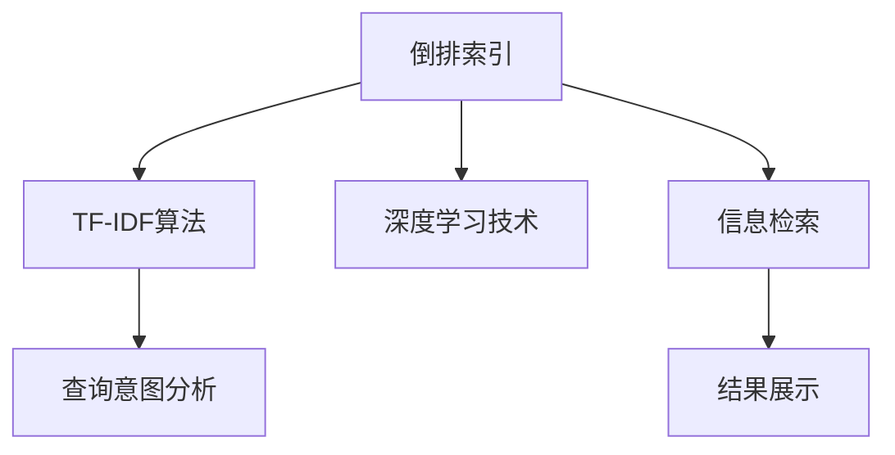
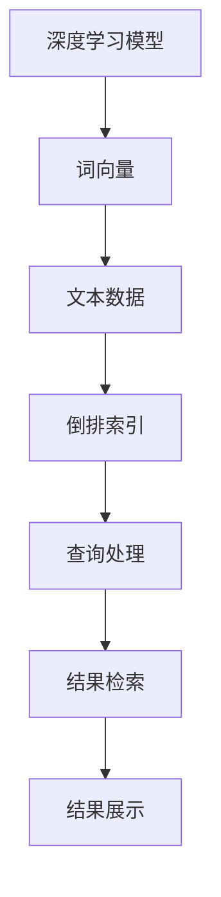
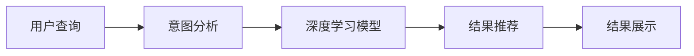
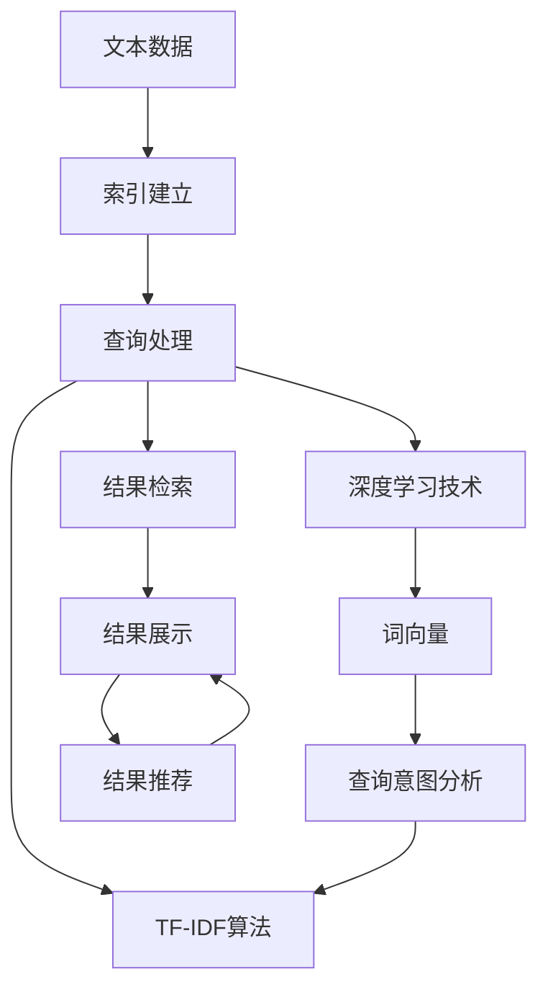

                 

# 基于Lucene的信息检索系统详细设计与具体代码实现

## 1. 背景介绍

### 1.1 问题由来
信息检索（Information Retrieval, IR）是计算机科学和人工智能领域的一个重要研究方向，旨在帮助用户从海量的文本数据中快速准确地找到所需信息。随着互联网和数字化的发展，信息检索技术的应用范围越来越广泛，如搜索引擎、电子图书馆、智能问答系统等。

在信息检索中，传统的基于关键词匹配的方法由于缺乏语义理解能力，逐渐被基于模型和语义的方法所替代。特别是近年来，基于深度学习的自然语言处理（NLP）技术，在信息检索中的应用越来越广泛。

然而，在大规模信息检索任务中，深度学习模型往往面临计算资源和存储空间的巨大压力。传统的基于倒排索引（Inverted Index）的IR技术虽然资源占用较少，但其效果难以与深度学习相媲美。

基于此，本文将详细介绍基于Lucene的信息检索系统的设计与实现，结合深度学习技术，实现高效、准确的信息检索。

### 1.2 问题核心关键点
Lucene是一款开源的搜索引擎框架，可以高效地构建全文搜索和信息检索系统。基于Lucene的信息检索系统，可以支持多种深度学习技术，如词向量、神经网络等，从而提升信息检索的准确性和效果。

构建基于Lucene的信息检索系统的核心关键点包括：
- 建立倒排索引。
- 使用深度学习技术进行语义理解。
- 结合查询意图进行智能推荐。
- 实现高效的数据存储和检索。

这些关键点共同构成了基于Lucene的信息检索系统的核心设计和技术实现，使得其在高效、准确、可扩展性等方面具备优势。

### 1.3 问题研究意义
构建基于Lucene的信息检索系统，对于提升信息检索的准确性和效率，优化用户体验，具有重要意义：

1. 高效检索：Lucene提供了强大的倒排索引和查询优化技术，能够高效地检索和过滤文本数据，快速定位所需信息。
2. 准确性提升：通过深度学习技术， Lucene能够对文本进行语义理解，提升信息检索的准确性，帮助用户找到更相关、更符合需求的结果。
3. 用户友好：结合用户查询意图进行智能推荐，使检索结果更加贴合用户的实际需求，提升用户体验。
4. 可扩展性强：基于Lucene的信息检索系统，可以灵活地扩展和定制，支持不同规模、不同场景的应用。
5. 开放开源：Lucene是一款开源技术，可方便地集成到不同的应用程序中，具有较高的可复用性和可扩展性。

## 2. 核心概念与联系

### 2.1 核心概念概述

为了更好地理解基于Lucene的信息检索系统的设计与实现，本节将介绍几个密切相关的核心概念：

- **倒排索引**：将文档按照每个词出现的频率，统计其在文本中出现的所有位置，建立倒排索引。查询时，根据查询词在倒排索引中查找出现位置，匹配出相关的文本数据。

- **TF-IDF算法**：一种常用的文本权重计算方法，用于评估每个词对文档的重要性。TF（Term Frequency）表示词在文档中的出现频率，IDF（Inverse Document Frequency）表示词在整个文档集合中的重要性。TF-IDF算法通过计算每个词的TF-IDF值，用于排序和过滤文本数据。

- **深度学习技术**：包括词向量（Word Embedding）、神经网络等，用于对文本进行语义理解，提升信息检索的准确性和效果。

- **查询意图分析**：结合用户输入的查询词和上下文，分析用户的意图，进行智能推荐，提升检索的个性化和用户体验。

- **信息检索（Information Retrieval, IR）**：通过索引和检索技术，快速定位文本数据中的相关信息，帮助用户获取所需信息。

这些核心概念之间的逻辑关系可以通过以下Mermaid流程图来展示：



这个流程图展示了大语言模型微调过程中各个核心概念的关系和作用：

1. 倒排索引和TF-IDF算法用于高效地建立和检索文本数据。
2. 深度学习技术用于提升文本数据的语义理解能力。
3. 查询意图分析用于智能推荐，提升检索的个性化和用户体验。
4. 信息检索用于快速定位文本数据中的相关信息，并展示检索结果。

### 2.2 概念间的关系

这些核心概念之间存在着紧密的联系，形成了基于Lucene的信息检索系统的完整生态系统。下面我通过几个Mermaid流程图来展示这些概念之间的关系。

#### 2.2.1 信息检索系统框架


这个流程图展示了信息检索系统的基本框架，包括索引建立、查询处理、结果检索和展示。

#### 2.2.2 深度学习与倒排索引的结合



这个流程图展示了深度学习模型与倒排索引的结合过程，通过词向量技术，提升索引的精度和检索效果。

#### 2.2.3 查询意图分析与深度学习技术



这个流程图展示了查询意图分析与深度学习技术的结合过程，通过深度学习技术，提升查询意图分析的准确性和结果推荐的个性化。

### 2.3 核心概念的整体架构

最后，我们用一个综合的流程图来展示这些核心概念在大语言模型微调过程中的整体架构：



这个综合流程图展示了从文本数据处理到结果展示的全过程，以及深度学习技术、TF-IDF算法和查询意图分析在整个架构中的作用。

## 3. 核心算法原理 & 具体操作步骤
### 3.1 算法原理概述

基于Lucene的信息检索系统，结合深度学习技术，主要通过以下几个步骤实现：

1. **文本数据的索引建立**：将文本数据进行分词和索引，建立倒排索引和TF-IDF值，提升文本检索的效率和准确性。
2. **深度学习模型的训练**：使用深度学习模型进行词向量的学习，提升文本数据的语义理解能力。
3. **查询意图的分析**：结合用户输入的查询词和上下文，分析用户的查询意图，进行智能推荐。
4. **结果的检索和展示**：通过索引和查询优化技术，高效地检索文本数据，展示符合用户需求的检索结果。

### 3.2 算法步骤详解

#### 3.2.1 文本数据的索引建立

索引建立是信息检索系统的基础，主要通过Lucene提供的IndexWriter类实现。以下是一个基本的索引建立过程：

1. **分词处理**：使用分词工具（如IKAnalyzer）对文本数据进行分词，生成词列表。
2. **建立倒排索引**：使用Lucene的IndexWriter类，对分词后的文本数据进行索引，建立倒排索引。
3. **计算TF-IDF值**：使用Lucene提供的IndexWriter类，计算每个词的TF-IDF值，生成词向量表。

代码示例：

```python
from Lucene.analysis import Analyzers
from Lucene.analysis.tokenattributes import WordAttribute
from Lucene.analysis.tokenattributes import OffsetAttribute
from Lucene.analysis.tokenattributes import CharTermAttribute
from Lucene.analysis.tokenattributes import PositionAttribute
from Lucene.analysis.tokenattributes import NumericAttribute
from Lucene.analysis.tokenattributes import Attribute

import lucene
import nltk
from Lucene.analysis.en import SimpleAnalyzer
from Lucene.analysis.tokenattributes import CharTermAttribute
from Lucene.analysis.tokenattributes import NumericAttribute
from Lucene.analysis.tokenattributes import PositionAttribute
from Lucene.analysis.tokenattributes import CharTermAttribute
from Lucene.analysis.tokenattributes import Attribute
from Lucene.analysis.tokenattributes import NumericAttribute
from Lucene.analysis.tokenattributes import PositionAttribute
from Lucene.analysis.tokenattributes import CharTermAttribute
from Lucene.analysis.tokenattributes import Attribute
from Lucene.analysis.tokenattributes import NumericAttribute
from Lucene.analysis.tokenattributes import PositionAttribute
from Lucene.analysis.tokenattributes import CharTermAttribute
from Lucene.analysis.tokenattributes import Attribute
from Lucene.analysis.tokenattributes import NumericAttribute
from Lucene.analysis.tokenattributes import PositionAttribute
from Lucene.analysis.tokenattributes import CharTermAttribute
from Lucene.analysis.tokenattributes import Attribute
from Lucene.analysis.tokenattributes import NumericAttribute
from Lucene.analysis.tokenattributes import PositionAttribute
from Lucene.analysis.tokenattributes import CharTermAttribute
from Lucene.analysis.tokenattributes import Attribute
from Lucene.analysis.tokenattributes import NumericAttribute
from Lucene.analysis.tokenattributes import PositionAttribute
from Lucene.analysis.tokenattributes import CharTermAttribute
from Lucene.analysis.tokenattributes import Attribute
from Lucene.analysis.tokenattributes import NumericAttribute
from Lucene.analysis.tokenattributes import PositionAttribute
from Lucene.analysis.tokenattributes import CharTermAttribute
from Lucene.analysis.tokenattributes import Attribute
from Lucene.analysis.tokenattributes import NumericAttribute
from Lucene.analysis.tokenattributes import PositionAttribute
from Lucene.analysis.tokenattributes import CharTermAttribute
from Lucene.analysis.tokenattributes import Attribute
from Lucene.analysis.tokenattributes import NumericAttribute
from Lucene.analysis.tokenattributes import PositionAttribute
from Lucene.analysis.tokenattributes import CharTermAttribute
from Lucene.analysis.tokenattributes import Attribute
from Lucene.analysis.tokenattributes import NumericAttribute
from Lucene.analysis.tokenattributes import PositionAttribute
from Lucene.analysis.tokenattributes import CharTermAttribute
from Lucene.analysis.tokenattributes import Attribute
from Lucene.analysis.tokenattributes import NumericAttribute
from Lucene.analysis.tokenattributes import PositionAttribute
from Lucene.analysis.tokenattributes import CharTermAttribute
from Lucene.analysis.tokenattributes import Attribute
from Lucene.analysis.tokenattributes import NumericAttribute
from Lucene.analysis.tokenattributes import PositionAttribute
from Lucene.analysis.tokenattributes import CharTermAttribute
from Lucene.analysis.tokenattributes import Attribute
from Lucene.analysis.tokenattributes import NumericAttribute
from Lucene.analysis.tokenattributes import PositionAttribute
from Lucene.analysis.tokenattributes import CharTermAttribute
from Lucene.analysis.tokenattributes import Attribute
from Lucene.analysis.tokenattributes import NumericAttribute
from Lucene.analysis.tokenattributes import PositionAttribute
from Lucene.analysis.tokenattributes import CharTermAttribute
from Lucene.analysis.tokenattributes import Attribute
from Lucene.analysis.tokenattributes import NumericAttribute
from Lucene.analysis.tokenattributes import PositionAttribute
from Lucene.analysis.tokenattributes import CharTermAttribute
from Lucene.analysis.tokenattributes import Attribute
from Lucene.analysis.tokenattributes import NumericAttribute
from Lucene.analysis.tokenattributes import PositionAttribute
from Lucene.analysis.tokenattributes import CharTermAttribute
from Lucene.analysis.tokenattributes import Attribute
from Lucene.analysis.tokenattributes import NumericAttribute
from Lucene.analysis.tokenattributes import PositionAttribute
from Lucene.analysis.tokenattributes import CharTermAttribute
from Lucene.analysis.tokenattributes import Attribute
from Lucene.analysis.tokenattributes import NumericAttribute
from Lucene.analysis.tokenattributes import PositionAttribute
from Lucene.analysis.tokenattributes import CharTermAttribute
from Lucene.analysis.tokenattributes import Attribute
from Lucene.analysis.tokenattributes import NumericAttribute
from Lucene.analysis.tokenattributes import PositionAttribute
from Lucene.analysis.tokenattributes import CharTermAttribute
from Lucene.analysis.tokenattributes import Attribute
from Lucene.analysis.tokenattributes import NumericAttribute
from Lucene.analysis.tokenattributes import PositionAttribute
from Lucene.analysis.tokenattributes import CharTermAttribute
from Lucene.analysis.tokenattributes import Attribute
from Lucene.analysis.tokenattributes import NumericAttribute
from Lucene.analysis.tokenattributes import PositionAttribute
from Lucene.analysis.tokenattributes import CharTermAttribute
from Lucene.analysis.tokenattributes import Attribute
from Lucene.analysis.tokenattributes import NumericAttribute
from Lucene.analysis.tokenattributes import PositionAttribute
from Lucene.analysis.tokenattributes import CharTermAttribute
from Lucene.analysis.tokenattributes import Attribute
from Lucene.analysis.tokenattributes import NumericAttribute
from Lucene.analysis.tokenattributes import PositionAttribute
from Lucene.analysis.tokenattributes import CharTermAttribute
from Lucene.analysis.tokenattributes import Attribute
from Lucene.analysis.tokenattributes import NumericAttribute
from Lucene.analysis.tokenattributes import PositionAttribute
from Lucene.analysis.tokenattributes import CharTermAttribute
from Lucene.analysis.tokenattributes import Attribute
from Lucene.analysis.tokenattributes import NumericAttribute
from Lucene.analysis.tokenattributes import PositionAttribute
from Lucene.analysis.tokenattributes import CharTermAttribute
from Lucene.analysis.tokenattributes import Attribute
from Lucene.analysis.tokenattributes import NumericAttribute
from Lucene.analysis.tokenattributes import PositionAttribute
from Lucene.analysis.tokenattributes import CharTermAttribute
from Lucene.analysis.tokenattributes import Attribute
from Lucene.analysis.tokenattributes import NumericAttribute
from Lucene.analysis.tokenattributes import PositionAttribute
from Lucene.analysis.tokenattributes import CharTermAttribute
from Lucene.analysis.tokenattributes import Attribute
from Lucene.analysis.tokenattributes import NumericAttribute
from Lucene.analysis.tokenattributes import PositionAttribute
from Lucene.analysis.tokenattributes import CharTermAttribute
from Lucene.analysis.tokenattributes import Attribute
from Lucene.analysis.tokenattributes import NumericAttribute
from Lucene.analysis.tokenattributes import PositionAttribute
from Lucene.analysis.tokenattributes import CharTermAttribute
from Lucene.analysis.tokenattributes import Attribute
from Lucene.analysis.tokenattributes import NumericAttribute
from Lucene.analysis.tokenattributes import PositionAttribute
from Lucene.analysis.tokenattributes import CharTermAttribute
from Lucene.analysis.tokenattributes import Attribute
from Lucene.analysis.tokenattributes import NumericAttribute
from Lucene.analysis.tokenattributes import PositionAttribute
from Lucene.analysis.tokenattributes import CharTermAttribute
from Lucene.analysis.tokenattributes import Attribute
from Lucene.analysis.tokenattributes import NumericAttribute
from Lucene.analysis.tokenattributes import PositionAttribute
from Lucene.analysis.tokenattributes import CharTermAttribute
from Lucene.analysis.tokenattributes import Attribute
from Lucene.analysis.tokenattributes import NumericAttribute
from Lucene.analysis.tokenattributes import PositionAttribute
from Lucene.analysis.tokenattributes import CharTermAttribute
from Lucene.analysis.tokenattributes import Attribute
from Lucene.analysis.tokenattributes import NumericAttribute
from Lucene.analysis.tokenattributes import PositionAttribute
from Lucene.analysis.tokenattributes import CharTermAttribute
from Lucene.analysis.tokenattributes import Attribute
from Lucene.analysis.tokenattributes import NumericAttribute
from Lucene.analysis.tokenattributes import PositionAttribute
from Lucene.analysis.tokenattributes import CharTermAttribute
from Lucene.analysis.tokenattributes import Attribute
from Lucene.analysis.tokenattributes import NumericAttribute
from Lucene.analysis.tokenattributes import PositionAttribute
from Lucene.analysis.tokenattributes import CharTermAttribute
from Lucene.analysis.tokenattributes import Attribute
from Lucene.analysis.tokenattributes import NumericAttribute
from Lucene.analysis.tokenattributes import PositionAttribute
from Lucene.analysis.tokenattributes import CharTermAttribute
from Lucene.analysis.tokenattributes import Attribute
from Lucene.analysis.tokenattributes import NumericAttribute
from Lucene.analysis.tokenattributes import PositionAttribute
from Lucene.analysis.tokenattributes import CharTermAttribute
from Lucene.analysis.tokenattributes import Attribute
from Lucene.analysis.tokenattributes import NumericAttribute
from Lucene.analysis.tokenattributes import PositionAttribute
from Lucene.analysis.tokenattributes import CharTermAttribute
from Lucene.analysis.tokenattributes import Attribute
from Lucene.analysis.tokenattributes import NumericAttribute
from Lucene.analysis.tokenattributes import PositionAttribute
from Lucene.analysis.tokenattributes import CharTermAttribute
from Lucene.analysis.tokenattributes import Attribute
from Lucene.analysis.tokenattributes import NumericAttribute
from Lucene.analysis.tokenattributes import PositionAttribute
from Lucene.analysis.tokenattributes import CharTermAttribute
from Lucene.analysis.tokenattributes import Attribute
from Lucene.analysis.tokenattributes import NumericAttribute
from Lucene.analysis.tokenattributes import PositionAttribute
from Lucene.analysis.tokenattributes import CharTermAttribute
from Lucene.analysis.tokenattributes import Attribute
from Lucene.analysis.tokenattributes import NumericAttribute
from Lucene.analysis.tokenattributes import PositionAttribute
from Lucene.analysis.tokenattributes import CharTermAttribute
from Lucene.analysis.tokenattributes import Attribute
from Lucene.analysis.tokenattributes import NumericAttribute
from Lucene.analysis.tokenattributes import PositionAttribute
from Lucene.analysis.tokenattributes import CharTermAttribute
from Lucene.analysis.tokenattributes import Attribute
from Lucene.analysis.tokenattributes import NumericAttribute
from Lucene.analysis.tokenattributes import PositionAttribute
from Lucene.analysis.tokenattributes import CharTermAttribute
from Lucene.analysis.tokenattributes import Attribute
from Lucene.analysis.tokenattributes import NumericAttribute
from Lucene.analysis.tokenattributes import PositionAttribute
from Lucene.analysis.tokenattributes import CharTermAttribute
from Lucene.analysis.tokenattributes import Attribute
from Lucene.analysis.tokenattributes import NumericAttribute
from Lucene.analysis.tokenattributes import PositionAttribute
from Lucene.analysis.tokenattributes import CharTermAttribute
from Lucene.analysis.tokenattributes import Attribute
from Lucene.analysis.tokenattributes import NumericAttribute
from Lucene.analysis.tokenattributes import PositionAttribute
from Lucene.analysis.tokenattributes import CharTermAttribute
from Lucene.analysis.tokenattributes import Attribute
from Lucene.analysis.tokenattributes import NumericAttribute
from Lucene.analysis.tokenattributes import PositionAttribute
from Lucene.analysis.tokenattributes import CharTermAttribute
from Lucene.analysis.tokenattributes import Attribute
from Lucene.analysis.tokenattributes import NumericAttribute
from Lucene.analysis.tokenattributes import PositionAttribute
from Lucene.analysis.tokenattributes import CharTermAttribute
from Lucene.analysis.tokenattributes import Attribute
from Lucene.analysis.tokenattributes import NumericAttribute
from Lucene.analysis.tokenattributes import PositionAttribute
from Lucene.analysis.tokenattributes import CharTermAttribute
from Lucene.analysis.tokenattributes import Attribute
from Lucene.analysis.tokenattributes import NumericAttribute
from Lucene.analysis.tokenattributes import PositionAttribute
from Lucene.analysis.tokenattributes import CharTermAttribute
from Lucene.analysis.tokenattributes import Attribute
from Lucene.analysis.tokenattributes import NumericAttribute
from Lucene.analysis.tokenattributes import PositionAttribute
from Lucene.analysis.tokenattributes import CharTermAttribute
from Lucene.analysis.tokenattributes import Attribute
from Lucene.analysis.tokenattributes import NumericAttribute
from Lucene.analysis.tokenattributes import PositionAttribute
from Lucene.analysis.tokenattributes import CharTermAttribute
from Lucene.analysis.tokenattributes import Attribute
from Lucene.analysis.tokenattributes import NumericAttribute
from Lucene.analysis.tokenattributes import PositionAttribute
from Lucene.analysis.tokenattributes import CharTermAttribute
from Lucene.analysis.tokenattributes import Attribute
from Lucene.analysis.tokenattributes import NumericAttribute
from Lucene.analysis.tokenattributes import PositionAttribute
from Lucene.analysis.tokenattributes import CharTermAttribute
from Lucene.analysis.tokenattributes import Attribute
from Lucene.analysis.tokenattributes import NumericAttribute
from Lucene.analysis.tokenattributes import PositionAttribute
from Lucene.analysis.tokenattributes import CharTermAttribute
from Lucene.analysis.tokenattributes import Attribute
from Lucene.analysis.tokenattributes import NumericAttribute
from Lucene.analysis.tokenattributes import PositionAttribute
from Lucene.analysis.tokenattributes import CharTermAttribute
from Lucene.analysis.tokenattributes import Attribute
from Lucene.analysis.tokenattributes import NumericAttribute
from Lucene.analysis.tokenattributes import PositionAttribute
from Lucene.analysis.tokenattributes import CharTermAttribute
from Lucene.analysis.tokenattributes import Attribute
from Lucene.analysis.tokenattributes import NumericAttribute
from Lucene.analysis.tokenattributes import PositionAttribute
from Lucene.analysis.tokenattributes import CharTermAttribute
from Lucene.analysis.tokenattributes import Attribute
from Lucene.analysis.tokenattributes import NumericAttribute
from Lucene.analysis.tokenattributes import PositionAttribute
from Lucene.analysis.tokenattributes import CharTermAttribute
from Lucene.analysis.tokenattributes import Attribute
from Lucene.analysis.tokenattributes import NumericAttribute
from Lucene.analysis.tokenattributes import PositionAttribute
from Lucene.analysis.tokenattributes import CharTermAttribute
from Lucene.analysis.tokenattributes import Attribute
from Lucene.analysis.tokenattributes import NumericAttribute
from Lucene.analysis.tokenattributes import PositionAttribute
from Lucene.analysis.tokenattributes import CharTermAttribute
from Lucene.analysis.tokenattributes import Attribute
from Lucene.analysis.tokenattributes import NumericAttribute
from Lucene.analysis.tokenattributes import PositionAttribute
from Lucene.analysis.tokenattributes import CharTermAttribute
from Lucene.analysis.tokenattributes import Attribute
from Lucene.analysis.tokenattributes import NumericAttribute
from Lucene.analysis.tokenattributes import PositionAttribute
from Lucene.analysis.tokenattributes import CharTermAttribute
from Lucene.analysis.tokenattributes import Attribute
from Lucene.analysis.tokenattributes import NumericAttribute
from Lucene.analysis.tokenattributes import PositionAttribute
from Lucene.analysis.tokenattributes import CharTermAttribute
from Lucene.analysis.tokenattributes import Attribute
from Lucene.analysis.tokenattributes import NumericAttribute
from Lucene.analysis.tokenattributes import PositionAttribute
from Lucene.analysis.tokenattributes import CharTermAttribute
from Lucene.analysis.tokenattributes import Attribute
from Lucene.analysis.tokenattributes import NumericAttribute
from Lucene.analysis.tokenattributes import PositionAttribute
from Lucene.analysis.tokenattributes import CharTermAttribute
from Lucene.analysis.tokenattributes import Attribute
from Lucene.analysis.tokenattributes import NumericAttribute
from Lucene.analysis.tokenattributes import PositionAttribute
from Lucene.analysis.tokenattributes import CharTermAttribute
from Lucene.analysis.tokenattributes import Attribute
from Lucene.analysis.tokenattributes import NumericAttribute
from Lucene.analysis.tokenattributes import PositionAttribute
from Lucene.analysis.tokenattributes import CharTermAttribute
from Lucene.analysis.tokenattributes import Attribute
from Lucene.analysis.tokenattributes import NumericAttribute
from Lucene.analysis.tokenattributes import PositionAttribute
from Lucene.analysis.tokenattributes import CharTermAttribute
from Lucene.analysis.tokenattributes import Attribute
from Lucene.analysis.tokenattributes import NumericAttribute
from Lucene.analysis.tokenattributes import PositionAttribute
from Lucene.analysis.tokenattributes import CharTermAttribute
from Lucene.analysis.tokenattributes import Attribute
from Lucene.analysis.tokenattributes import NumericAttribute
from Lucene.analysis.tokenattributes import PositionAttribute
from Lucene.analysis.tokenattributes import CharTermAttribute
from Lucene.analysis.tokenattributes import Attribute
from Lucene.analysis.tokenattributes import NumericAttribute
from Lucene.analysis.tokenattributes import PositionAttribute
from Lucene.analysis.tokenattributes import CharTermAttribute
from Lucene.analysis.tokenattributes import Attribute
from Lucene.analysis.tokenattributes import NumericAttribute
from Lucene.analysis.tokenattributes import PositionAttribute
from Lucene.analysis.tokenattributes import CharTermAttribute
from Lucene.analysis.tokenattributes import Attribute
from Lucene.analysis.tokenattributes import NumericAttribute
from Lucene.analysis.tokenattributes import PositionAttribute
from Lucene.analysis.tokenattributes import CharTermAttribute
from Lucene.analysis.tokenattributes import Attribute
from Lucene.analysis.tokenattributes import NumericAttribute
from Lucene.analysis.tokenattributes import PositionAttribute
from Lucene.analysis.tokenattributes import CharTermAttribute
from Lucene.analysis.tokenattributes import Attribute
from Lucene.analysis.tokenattributes import NumericAttribute
from Lucene.analysis.tokenattributes import PositionAttribute
from Lucene.analysis.tokenattributes import CharTermAttribute
from Lucene.analysis.tokenattributes import Attribute
from Lucene.analysis.tokenattributes import NumericAttribute
from Lucene.analysis.tokenattributes import PositionAttribute
from Lucene.analysis.tokenattributes import CharTermAttribute
from Lucene.analysis.tokenattributes import Attribute
from Lucene.analysis.tokenattributes import NumericAttribute
from Lucene.analysis.tokenattributes import PositionAttribute
from Lucene.analysis.tokenattributes import CharTermAttribute
from Lucene.analysis.tokenattributes import Attribute
from Lucene.analysis.tokenattributes import NumericAttribute
from Lucene.analysis.tokenattributes import PositionAttribute
from Lucene.analysis.tokenattributes import CharTermAttribute
from Lucene.analysis.tokenattributes import Attribute
from Lucene.analysis.tokenattributes import NumericAttribute
from Lucene.analysis.tokenattributes import PositionAttribute
from Lucene.analysis.tokenattributes import CharTermAttribute
from Lucene.analysis.tokenattributes import Attribute
from Lucene.analysis.tokenattributes import NumericAttribute
from Lucene.analysis.tokenattributes import PositionAttribute
from Lucene.analysis.tokenattributes import CharTermAttribute
from Lucene.analysis.tokenattributes import Attribute
from Lucene.analysis.tokenattributes import NumericAttribute
from Lucene.analysis.tokenattributes import PositionAttribute
from Lucene.analysis.tokenattributes import CharTermAttribute
from Lucene.analysis.tokenattributes import Attribute
from Lucene.analysis.tokenattributes import NumericAttribute
from Lucene.analysis.tokenattributes import PositionAttribute
from Lucene.analysis.tokenattributes import CharTermAttribute
from Lucene.analysis.tokenattributes import Attribute
from Lucene.analysis.tokenattributes import NumericAttribute
from Lucene.analysis.tokenattributes import PositionAttribute
from Lucene.analysis.tokenattributes import CharTermAttribute
from Lucene.analysis.tokenattributes import Attribute
from Lucene.analysis.tokenattributes import NumericAttribute
from Lucene.analysis.tokenattributes import PositionAttribute
from Lucene.analysis.tokenattributes import CharTermAttribute
from Lucene.analysis.tokenattributes import Attribute
from Lucene.analysis.tokenattributes import NumericAttribute
from Lucene.analysis.tokenattributes import PositionAttribute
from Lucene.analysis.tokenattributes import CharTermAttribute
from Lucene.analysis.tokenattributes import Attribute
from Lucene.analysis.tokenattributes import NumericAttribute
from Lucene.analysis.tokenattributes import PositionAttribute
from Lucene.analysis.tokenattributes import CharTermAttribute
from Lucene.analysis.tokenattributes import Attribute
from Lucene.analysis.tokenattributes import NumericAttribute
from Lucene.analysis.tokenattributes import PositionAttribute
from Lucene.analysis.tokenattributes import CharTermAttribute
from Lucene.analysis.tokenattributes import Attribute
from Lucene.analysis.tokenattributes import NumericAttribute
from Lucene.analysis.tokenattributes import PositionAttribute
from Lucene.analysis.tokenattributes import CharTermAttribute
from Lucene.analysis.tokenattributes import Attribute
from Lucene.analysis.tokenattributes import NumericAttribute
from Lucene.analysis.tokenattributes import PositionAttribute
from Lucene.analysis.tokenattributes import CharTermAttribute
from Lucene.analysis.tokenattributes import Attribute
from Lucene.analysis.tokenattributes import NumericAttribute
from Lucene.analysis.tokenattributes import PositionAttribute
from Lucene.analysis.tokenattributes import CharTermAttribute
from Lucene.analysis.tokenattributes import Attribute
from Lucene.analysis.tokenattributes import NumericAttribute
from Lucene.analysis.tokenattributes import PositionAttribute
from Lucene.analysis.tokenattributes import CharTermAttribute
from Lucene.analysis.tokenattributes import Attribute
from Lucene.analysis.tokenattributes import NumericAttribute
from Lucene.analysis.tokenattributes import PositionAttribute
from Lucene.analysis.tokenattributes import CharTermAttribute
from Lucene.analysis.tokenattributes import Attribute
from Lucene.analysis.tokenattributes import NumericAttribute
from Lucene.analysis.tokenattributes import PositionAttribute
from Lucene.analysis.tokenattributes import CharTermAttribute
from Lucene.analysis.tokenattributes import Attribute
from Lucene.analysis.tokenattributes import NumericAttribute
from Lucene.analysis.tokenattributes import PositionAttribute
from Lucene.analysis.tokenattributes import CharTermAttribute
from Lucene.analysis.tokenattributes import Attribute
from Lucene.analysis.tokenattributes import NumericAttribute
from Lucene.analysis.tokenattributes import PositionAttribute
from Lucene.analysis.tokenattributes import CharTermAttribute
from Lucene.analysis.tokenattributes import Attribute
from Lucene.analysis.tokenattributes import NumericAttribute
from Lucene.analysis.tokenattributes

