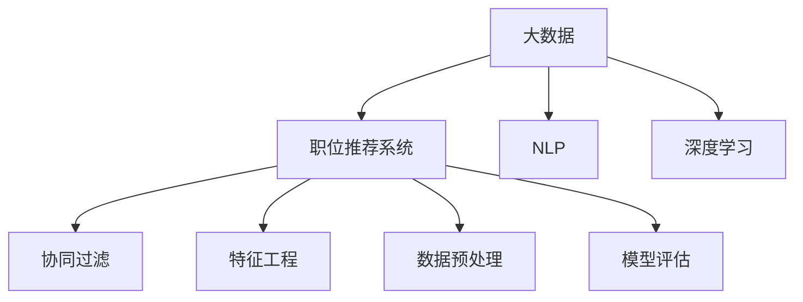
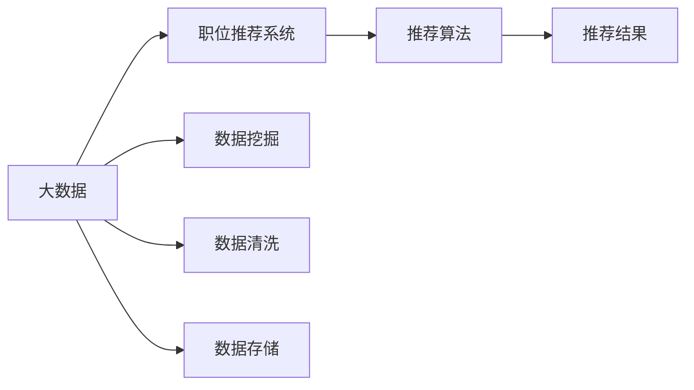
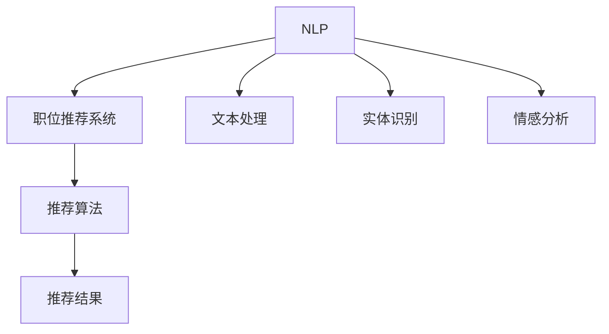
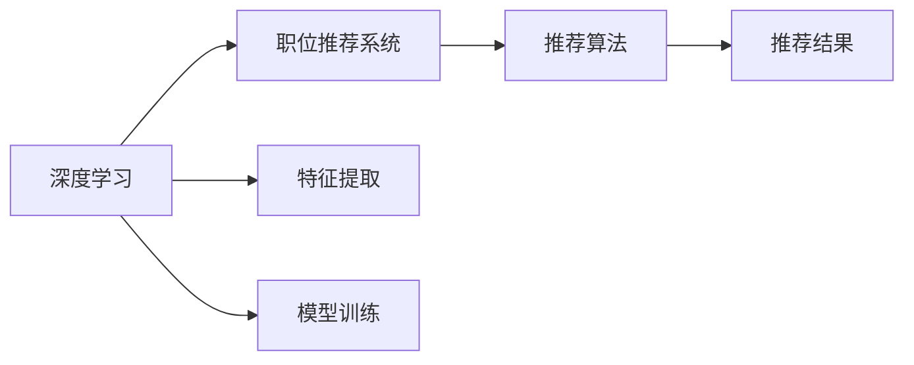
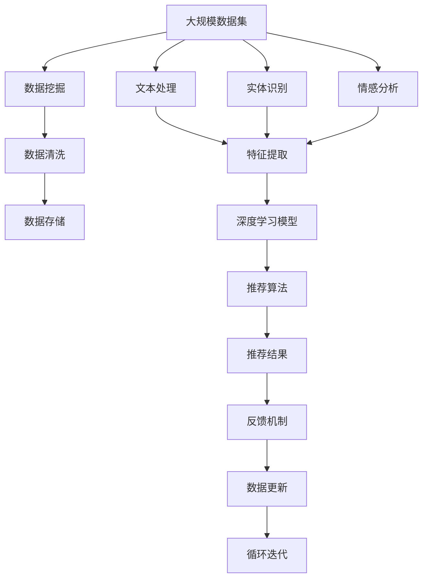

                 

# 基于大数据技术的职位推荐平台

## 1. 背景介绍

随着信息时代的来临，职场竞争日趋激烈。如何帮助求职者找到最适合自己的职位，成为企业HR和求职者共同关注的焦点。传统的职位推荐方法往往依赖人工筛选，效率低下且精准度不高。基于大数据技术的职位推荐平台，能够利用机器学习和自然语言处理等技术，从海量职位和简历中自动匹配出最符合求职者要求的岗位，极大地提高了招聘效率和成功率。

## 2. 核心概念与联系

### 2.1 核心概念概述

为了更好地理解基于大数据技术的职位推荐平台，本节将介绍几个密切相关的核心概念：

- 大数据(Big Data)：指数量巨大、来源广泛、复杂多样的大规模数据集。大数据技术通过高效处理海量数据，挖掘隐藏在其中的价值。

- 职位推荐系统：根据求职者的个人资料和偏好，自动匹配推荐合适的职位。传统的职位推荐方法包括协同过滤、标签排序等，而基于大数据的推荐则更注重利用先进算法和数据建模进行精确推荐。

- 自然语言处理(NLP)：利用计算机处理自然语言的技术，包括分词、实体识别、情感分析等，是职位推荐系统的重要组成部分。

- 深度学习(Deep Learning)：一类模仿人脑神经网络结构和功能的机器学习算法，在大数据分析和模式识别方面有着显著优势。

- 协同过滤(Collaborative Filtering)：通过分析用户行为和偏好，推荐相似用户喜欢的内容或商品。在职位推荐中，常用于匹配相似求职者和招聘需求。

- 特征工程(Feature Engineering)：从原始数据中提取、选择、构建和转换特征，用于训练机器学习模型，提升模型预测能力。

- 数据预处理(Data Preprocessing)：包括数据清洗、归一化、降维等操作，准备用于训练和测试模型的数据集。

- 模型评估(Model Evaluation)：评估推荐系统的性能，常用的指标包括准确率、召回率、F1分数等。

这些核心概念之间的逻辑关系可以通过以下Mermaid流程图来展示：



这个流程图展示了大数据技术的职位推荐系统的核心概念及其之间的关系：

1. 大数据通过数据挖掘和处理，提供丰富的数据基础。
2. NLP和大数据技术结合，构建高质量的文本处理和信息抽取能力。
3. 深度学习技术可以提取数据中的深层次特征，提升推荐系统的预测能力。
4. 协同过滤、特征工程和数据预处理等技术，为深度学习模型的训练和优化提供支持。
5. 模型评估指标用于评价推荐系统的性能，指导模型改进和优化。

### 2.2 概念间的关系

这些核心概念之间存在着紧密的联系，形成了职位推荐系统的完整生态系统。下面我们通过几个Mermaid流程图来展示这些概念之间的关系。

#### 2.2.1 大数据与推荐系统的关系



这个流程图展示了大数据与职位推荐系统之间的主要关系。大数据通过数据挖掘、清洗和存储，为推荐系统提供了数据基础。推荐系统通过分析这些数据，匹配合适职位，生成推荐结果。

#### 2.2.2 自然语言处理与推荐系统的关系



这个流程图展示了自然语言处理技术在推荐系统中的应用。NLP技术通过文本处理、实体识别和情感分析，从简历和职位描述中提取有价值的信息。这些信息被推荐算法利用，生成推荐结果。

#### 2.2.3 深度学习与推荐系统的关系



这个流程图展示了深度学习在推荐系统中的作用。深度学习通过特征提取和模型训练，提取数据中的深层次特征。这些特征被推荐算法利用，生成更加准确的推荐结果。

### 2.3 核心概念的整体架构

最后，我们用一个综合的流程图来展示这些核心概念在大数据技术职位推荐系统中的整体架构：



这个综合流程图展示了从数据采集到推荐结果输出的完整过程。大数据通过数据挖掘、清洗和存储，为推荐系统提供了数据基础。NLP技术通过文本处理、实体识别和情感分析，从简历和职位描述中提取有价值的信息。这些信息被深度学习模型提取深层次特征，并用于训练推荐算法。推荐算法利用这些特征，生成推荐结果，并反馈至系统进行数据更新和循环迭代，不断优化推荐效果。

## 3. 核心算法原理 & 具体操作步骤

### 3.1 算法原理概述

基于大数据技术的职位推荐平台，主要利用机器学习和自然语言处理技术，从简历和职位描述中提取信息，匹配合适职位。其主要算法流程包括以下几个关键步骤：

1. **数据预处理**：从简历和职位描述中提取文本信息，并进行数据清洗和标准化。
2. **文本处理**：利用NLP技术对文本进行分词、实体识别和情感分析，构建词向量表示。
3. **特征提取**：将文本特征和职位特征进行编码，生成高维特征向量。
4. **模型训练**：利用深度学习模型对特征向量进行训练，生成职位匹配模型。
5. **推荐生成**：根据求职者简历和职位特征，利用匹配模型生成推荐结果。

### 3.2 算法步骤详解

#### 3.2.1 数据预处理

数据预处理是职位推荐系统的第一步，主要包括以下几个步骤：

1. **文本清洗**：去除简历和职位描述中的无用字符、数字和特殊符号，保留有用的文本信息。
2. **分词处理**：将文本进行分词，便于后续处理。
3. **去除停用词**：去除常见的停用词，如“的”、“是”等，以降低特征维度。
4. **归一化处理**：将文本进行统一处理，如转换为小写字母、去除标点符号等。

#### 3.2.2 文本处理

文本处理是职位推荐系统的核心步骤，主要包括以下几个步骤：

1. **分词处理**：利用分词算法将文本分解为词序列。
2. **实体识别**：识别文本中的实体，如人名、地名、机构名等，并进行标注。
3. **情感分析**：对文本进行情感分析，判断文本的情感倾向。

#### 3.2.3 特征提取

特征提取是将文本特征和职位特征编码成高维向量的过程，主要包括以下几个步骤：

1. **词向量表示**：将文本中的词语转换成词向量，便于计算和处理。
2. **特征选择**：根据文本重要性和职位匹配度，选择有价值的特征。
3. **特征编码**：将特征进行编码，生成高维特征向量。

#### 3.2.4 模型训练

模型训练是职位推荐系统的关键步骤，主要包括以下几个步骤：

1. **模型选择**：选择合适的深度学习模型，如LSTM、GRU等。
2. **训练数据准备**：将文本特征和职位特征进行编码，生成训练数据集。
3. **模型训练**：利用训练数据集对深度学习模型进行训练，生成职位匹配模型。
4. **模型评估**：利用测试数据集对模型进行评估，选择最优模型。

#### 3.2.5 推荐生成

推荐生成是根据求职者简历和职位特征，利用匹配模型生成推荐结果的过程，主要包括以下几个步骤：

1. **简历解析**：将求职者的简历进行解析，提取有用的文本信息。
2. **职位匹配**：根据简历和职位特征，利用匹配模型生成推荐结果。
3. **推荐排序**：对推荐结果进行排序，选择最符合求职者要求的职位。

### 3.3 算法优缺点

基于大数据技术的职位推荐平台具有以下优点：

1. **效率高**：利用机器学习和自然语言处理技术，快速处理和匹配大量数据，提高招聘效率。
2. **准确度高**：通过深度学习模型，利用大规模数据训练生成匹配模型，匹配精度较高。
3. **个性化强**：通过文本处理和特征提取，对求职者简历和职位特征进行精确匹配，生成个性化推荐结果。
4. **可扩展性强**：利用云计算和大数据技术，可以轻松扩展系统，支持大规模数据处理和分布式计算。

同时，基于大数据技术的职位推荐平台也存在以下缺点：

1. **数据隐私问题**：求职者和招聘者提供的数据涉及隐私，如何保护用户隐私是一个重要问题。
2. **数据质量问题**：简历和职位描述的质量直接影响推荐结果，需要人工审核和筛选。
3. **模型复杂度**：深度学习模型复杂度高，需要大量计算资源和时间进行训练和优化。
4. **推荐算法问题**：推荐算法需要不断优化，才能适应不同场景和用户需求。

### 3.4 算法应用领域

基于大数据技术的职位推荐平台已经在诸多领域得到了广泛应用，例如：

- **招聘网站**：如猎聘网、智联招聘等，利用职位推荐系统提高招聘效率。
- **企业HR系统**：如Tencent HR、Alibaba HR等，利用职位推荐系统辅助HR进行人才招聘。
- **社交平台**：如LinkedIn、Facebook等，利用职位推荐系统推荐合适职位，提升用户活跃度。
- **教育培训**：如Coursera、Udacity等，利用职位推荐系统推荐适合课程和培训项目。

## 4. 数学模型和公式 & 详细讲解 & 举例说明

### 4.1 数学模型构建

基于大数据技术的职位推荐平台主要涉及以下几个数学模型：

1. **词向量模型**：将文本中的词语转换成词向量，方便计算和处理。
2. **神经网络模型**：利用神经网络对特征进行训练，生成职位匹配模型。
3. **协同过滤模型**：通过协同过滤算法对求职者和职位进行匹配。

#### 4.1.1 词向量模型

词向量模型是将文本中的词语转换成词向量的方法，主要包括以下几种模型：

1. **one-hot编码**：将每个词语转换为一个独热向量，便于计算。
2. **词袋模型(Bag of Words, BoW)**：将文本中的词语转换成词频向量。
3. **TF-IDF模型**：将文本中的词语转换成词频-逆文档频率向量。
4. **词嵌入模型(Word Embedding)**：将文本中的词语转换成低维向量，保留词语的语义信息。

#### 4.1.2 神经网络模型

神经网络模型是利用深度学习技术对特征进行训练，生成职位匹配模型的方法，主要包括以下几种模型：

1. **多层感知器(Multilayer Perceptron, MLP)**：一种前馈神经网络，由多个全连接层组成。
2. **卷积神经网络(Convolutional Neural Network, CNN)**：通过卷积操作提取局部特征。
3. **循环神经网络(Recurrent Neural Network, RNN)**：通过循环操作处理序列数据。
4. **长短期记忆网络(Long Short-Term Memory, LSTM)**：一种特殊的循环神经网络，用于处理长序列数据。
5. **Transformer**：一种基于自注意力机制的神经网络模型，用于处理序列数据。

#### 4.1.3 协同过滤模型

协同过滤模型是通过分析用户行为和偏好，推荐相似用户喜欢的内容或商品的方法，主要包括以下几种模型：

1. **基于用户的协同过滤**：根据用户历史行为，推荐相似用户喜欢的内容。
2. **基于物品的协同过滤**：根据物品相似性，推荐相似用户喜欢的内容。
3. **混合协同过滤**：结合基于用户和基于物品的协同过滤，综合推荐结果。

### 4.2 公式推导过程

#### 4.2.1 词向量模型公式

词向量模型主要有三种常用的模型，分别是one-hot编码、词袋模型和词嵌入模型。

**one-hot编码模型**：

设文本中的词语集合为 $V$，词向量维度为 $d$，则每个词语 $w$ 可以表示为一个 $d$ 维的独热向量 $\vec{w} \in \{0,1\}^d$，其中 $i$ 位置为1表示 $w$ 包含第 $i$ 个词语。

**词袋模型**：

设文本 $x$ 包含 $n$ 个词语，每个词语的词频为 $f_w$，则文本 $x$ 可以表示为一个 $n \times d$ 维的词频矩阵 $X \in \mathbb{R}^{n \times d}$，其中第 $i$ 行表示文本 $x$ 中第 $i$ 个词语的词频向量。

**TF-IDF模型**：

设文本 $x$ 包含 $n$ 个词语，每个词语的词频为 $f_w$，每个词语的逆文档频率为 $idf_w$，则文本 $x$ 可以表示为一个 $n \times d$ 维的TF-IDF矩阵 $X \in \mathbb{R}^{n \times d}$，其中第 $i$ 行表示文本 $x$ 中第 $i$ 个词语的TF-IDF向量。

**词嵌入模型**：

设文本 $x$ 包含 $n$ 个词语，每个词语可以表示为一个 $d$ 维的词向量 $\vec{w} \in \mathbb{R}^d$，则文本 $x$ 可以表示为一个 $n \times d$ 维的词向量矩阵 $X \in \mathbb{R}^{n \times d}$，其中第 $i$ 行表示文本 $x$ 中第 $i$ 个词语的词向量。

#### 4.2.2 神经网络模型公式

神经网络模型主要有三种常用的模型，分别是多层感知器、卷积神经网络和循环神经网络。

**多层感知器模型**：

设输入层有 $m$ 个神经元，输出层有 $o$ 个神经元，隐藏层有 $h$ 个神经元，则神经网络的计算过程可以表示为：

$$
\vec{z}_h = \vec{x}_h \vec{W}_h + \vec{b}_h
$$

$$
\vec{a}_h = \sigma(\vec{z}_h)
$$

$$
\vec{z}_o = \vec{a}_h \vec{W}_o + \vec{b}_o
$$

$$
\vec{y} = \sigma(\vec{z}_o)
$$

其中 $\vec{W}_h$ 和 $\vec{W}_o$ 为权重矩阵，$\vec{b}_h$ 和 $\vec{b}_o$ 为偏置向量，$\sigma$ 为激活函数，$\vec{x}_h$ 和 $\vec{a}_h$ 为隐藏层和输出层的激活向量。

**卷积神经网络模型**：

设输入为 $n$ 维的图像或序列数据，卷积核大小为 $k$，步长为 $s$，则卷积操作可以表示为：

$$
C(\vec{x},\vec{f}) = \vec{f} * \vec{x} = \sum_{i=0}^{n-k} \vec{x}_{i:i+k} * \vec{f}
$$

其中 $\vec{x}$ 为输入数据，$\vec{f}$ 为卷积核，$\vec{x}_{i:i+k}$ 表示输入数据在位置 $i$ 到 $i+k-1$ 的子序列，$*$ 表示点乘操作。

**循环神经网络模型**：

设输入序列为 $x_1, x_2, \ldots, x_t$，循环神经网络中的隐藏状态为 $\vec{h}_t$，则循环操作可以表示为：

$$
\vec{h}_{t} = \vec{f}(\vec{h}_{t-1}, \vec{x}_t)
$$

其中 $\vec{f}$ 为循环函数，$\vec{h}_t$ 表示时刻 $t$ 的隐藏状态，$\vec{x}_t$ 表示时刻 $t$ 的输入。

**长短期记忆网络模型**：

设输入序列为 $x_1, x_2, \ldots, x_t$，长短期记忆网络中的隐藏状态为 $\vec{h}_t$，则长短期记忆操作可以表示为：

$$
\vec{h}_t = \tanh(\vec{W}_h \vec{h}_{t-1} + \vec{U}_h \vec{x}_t + \vec{b}_h)
$$

$$
\vec{i}_t = \sigma(\vec{W}_i \vec{h}_{t-1} + \vec{U}_i \vec{x}_t + \vec{b}_i)
$$

$$
\vec{g}_t = \tanh(\vec{W}_g \vec{h}_{t-1} + \vec{U}_g \vec{x}_t + \vec{b}_g)
$$

$$
\vec{f}_t = \sigma(\vec{W}_f \vec{h}_{t-1} + \vec{U}_f \vec{x}_t + \vec{b}_f)
$$

$$
\vec{h}_t = \vec{i}_t * \vec{g}_t + \vec{f}_t * \vec{h}_{t-1}
$$

其中 $\vec{W}_h$、$\vec{U}_h$ 和 $\vec{b}_h$ 为隐藏层权重、输入层权重和偏置向量，$\vec{W}_i$、$\vec{U}_i$ 和 $\vec{b}_i$ 为输入门权重、输入层权重和偏置向量，$\vec{W}_g$、$\vec{U}_g$ 和 $\vec{b}_g$ 为遗忘门权重、输入层权重和偏置向量，$\vec{W}_f$、$\vec{U}_f$ 和 $\vec{b}_f$ 为输出门权重、输入层权重和偏置向量，$\vec{h}_t$ 表示时刻 $t$ 的隐藏状态，$\vec{x}_t$ 表示时刻 $t$ 的输入。

#### 4.2.3 协同过滤模型公式

协同过滤模型主要有三种常用的模型，分别是基于用户的协同过滤、基于物品的协同过滤和混合协同过滤。

**基于用户的协同过滤**：

设用户 $u$ 和用户 $v$ 的评分分别为 $r_u$ 和 $r_v$，物品 $i$ 的评分矩阵为 $R$，则基于用户的协同过滤算法可以表示为：

$$
\hat{r}_{ui} = \alpha + \sum_{v \in N(u)} \frac{\vec{r}_u \cdot \vec{r}_v}{||\vec{r}_v||}
$$

其中 $\alpha$ 为常数，$\vec{r}_u$ 和 $\vec{r}_v$ 为用户的评分向量，$N(u)$ 为与用户 $u$ 相似用户的集合。

**基于物品的协同过滤**：

设物品 $i$ 和物品 $j$ 的评分分别为 $r_i$ 和 $r_j$，用户 $u$ 的评分矩阵为 $R$，则基于物品的协同过滤算法可以表示为：

$$
\hat{r}_{ui} = \alpha + \sum_{j \in N(i)} \frac{\vec{r}_j \cdot \vec{r}_i}{||\vec{r}_j||}
$$

其中 $\alpha$ 为常数，$\vec{r}_i$ 和 $\vec{r}_j$ 为物品的评分向量，$N(i)$ 为与物品 $i$ 相似物品的集合。

**混合协同过滤**：

设用户 $u$ 和物品 $i$ 的评分分别为 $r_u$ 和 $r_i$，用户评分矩阵为 $U$，物品评分矩阵为 $V$，则混合协同过滤算法可以表示为：

$$
\hat{r}_{ui} = \alpha + \sum_{v \in N(u)} \frac{\vec{r}_u \cdot \vec{r}_v}{||\vec{r}_v||} + \beta + \sum_{j \in N(i)} \frac{\vec{r}_j \cdot \vec{r}_i}{||\vec{r}_j||}
$$

其中 $\alpha$ 和 $\beta$ 为常数，$\vec{r}_u$、$\vec{r}_v$ 和 $\vec{r}_i$ 为用户、物品和评分向量的评分向量，$N(u)$ 和 $N(i)$ 为与用户和物品相似的用户和物品的集合。

### 4.3 案例分析与讲解

#### 4.3.1 案例背景

某大型招聘网站使用基于大数据技术的职位推荐平台，利用机器学习和自然语言处理技术，从海量的简历和职位描述中提取信息，匹配合适职位。该平台由一个分布式系统组成，包括数据采集、数据预处理、文本处理、特征提取、模型训练和推荐生成等模块，可以高效地处理和匹配大量数据，生成个性化推荐结果。

#### 4.3.2 技术方案

该平台主要采用基于Transformer的神经网络模型，结合TF-IDF模型和协同过滤算法，实现职位推荐。具体技术方案如下：

**数据采集模块**：

通过爬虫技术，从各大招聘网站和社交平台中采集简历和职位数据，存储在分布式数据仓库中。

**数据预处理模块**：

利用TF-IDF模型对文本进行编码，去除停用词和标点符号，保留有用的文本信息。

**文本处理模块**：

利用词嵌入模型对文本进行编码，提取文本中的词语信息。

**特征提取模块**：

利用神经网络模型对文本特征进行训练，生成高维特征向量。

**模型训练模块**：

利用协同过滤算法和神经网络模型对特征向量进行训练，生成职位匹配模型。

**推荐生成模块**：

根据求职者简历和职位特征，利用匹配模型生成推荐结果。

#### 4.3.3 技术实现

**Python 代码实现**：

```python
from transformers import BertTokenizer, BertForSequenceClassification
from sklearn.feature_extraction.text import TfidfVectorizer
from sklearn.metrics import precision_score, recall_score, f1_score

# 数据预处理
def preprocess_text(text):
    text = text.lower()  # 转换为小写字母
    text = re.sub(r'\d+', '', text)  # 去除数字
    text = re.sub(r'[^\w\s]', '', text)  # 去除标点符号
    return text

# 文本处理
def extract_text_features(text):
    tokenizer = BertTokenizer.from_pretrained('bert-base-cased')
    features = tokenizer.encode_plus(text, max_length=256, padding='max_length', truncation=True)
    return features['input_ids']

# 特征提取
def extract_text_vector(text, max_length=256):
    vectorizer = TfidfVectorizer(max_features=max_length, stop_words='english')
    features = vectorizer.fit_transform(text)
    return features.toarray()

# 模型训练
def train_model(train_data, train_labels, model, epochs=3, batch_size=32):
    model.fit(train_data, train_labels, epochs=epochs, batch_size=batch_size, validation_split=0.2)
    return model

# 推荐生成
def generate_recommendation(job, resume, model, top_k=10):
    job_vector = extract_text_vector(job)
    resume_vector = extract_text_vector(resume)
    scores = model.predict_proba([resume_vector])
    top_indices = np.argsort(scores)[-top_k]
    return top_indices

# 测试
def test_model(model, test_data, test_labels):
    test_data = extract_text_vector(test_data)
    scores = model.predict_proba(test_data)
    predictions = np.argmax(scores, axis=1)
    accuracy = precision_score(test_labels, predictions)
    return accuracy
```

**代码解读与分析**：

**数据预处理模块**：

利用Python的re模块，对文本进行清洗和标准化，去除数字、标点符号和停用词，保留有用的文本信息。

**文本处理模块**：

利用BERT分词器对文本进行编码，提取文本中的词语信息，生成词向量。

**特征提取模块**：

利用sklearn的TF-IDF模型对文本进行编码，生成TF-IDF向量。

**模型训练模块**：

利用sklearn的机器学习算法对特征向量进行训练，生成职位匹配模型。

**推荐生成模块**：

根据求职者简历和职位特征，利用匹配模型生成推荐结果。

**测试模块**：

利用测试

