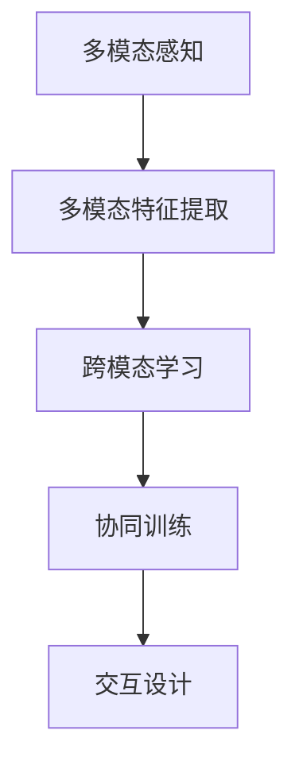
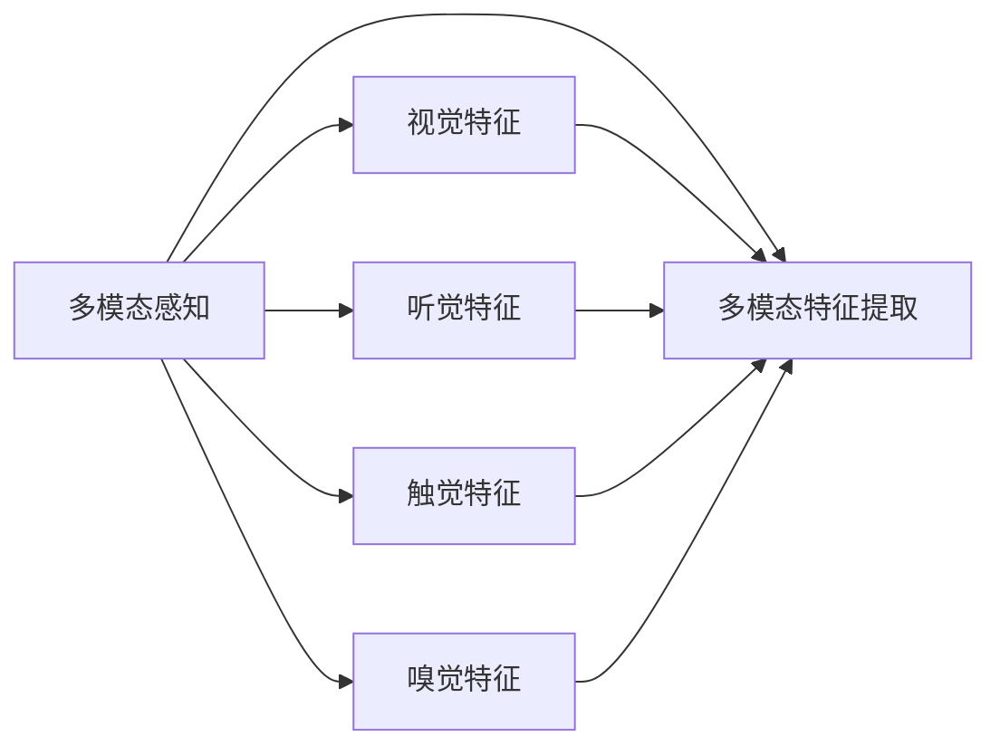
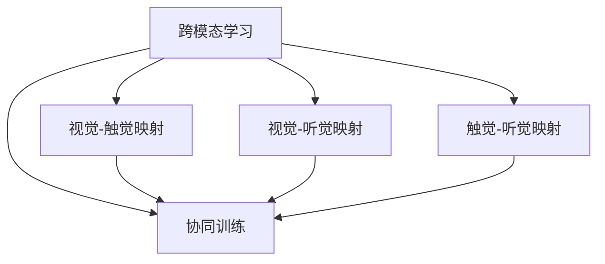
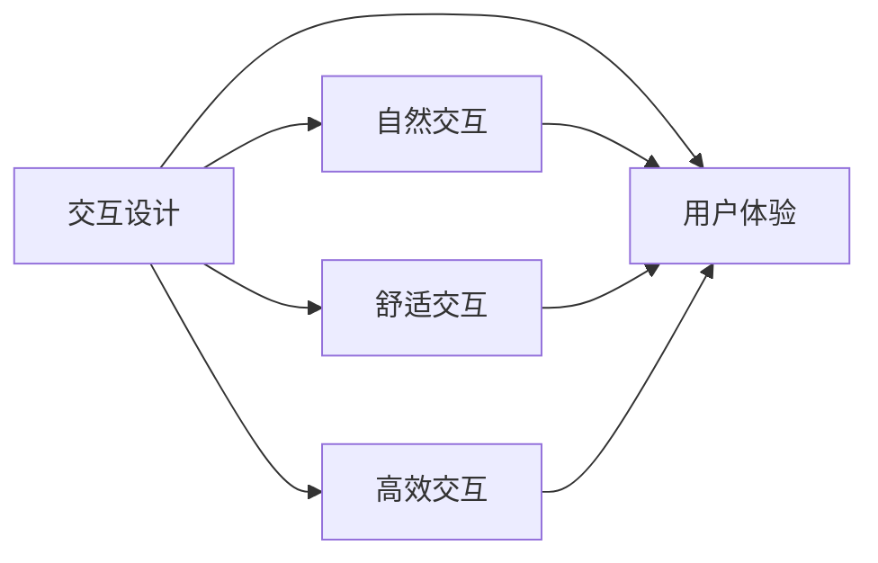
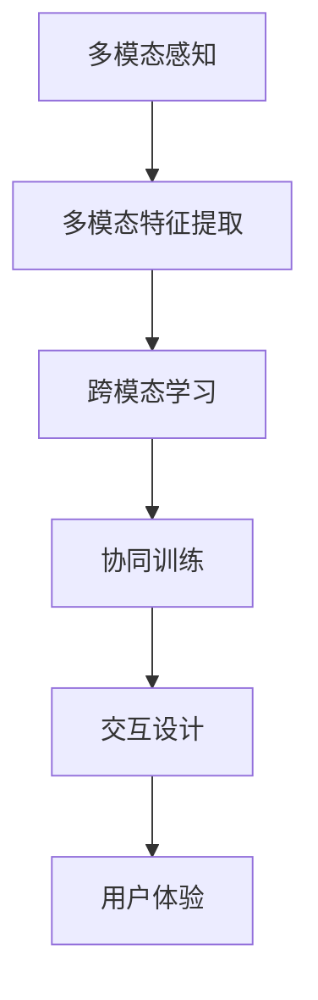

                 

# 多模态AI在虚拟现实中的应用前景

> 关键词：多模态AI,虚拟现实,交互设计,混合现实,沉浸式体验,人机交互

## 1. 背景介绍

### 1.1 问题由来
随着技术的不断进步，虚拟现实(Virtual Reality, VR)技术已经逐步从实验室走向实际应用，广泛应用于游戏娱乐、教育培训、医疗康复等领域。然而，目前的VR系统大多采用单模态输入方式，如手柄操作、头显视觉输入等，难以全面感知和理解真实世界的环境。同时，传统的深度学习模型也大多关注单一感官输入，无法充分利用多模态信息，提升用户沉浸感和交互体验。

为了解决这些问题，多模态AI技术应运而生。多模态AI通过集成多种感知模态(如视觉、听觉、触觉、嗅觉等)，利用先进的深度学习算法，实现对真实环境的全面感知和理解，为虚拟现实应用提供更加丰富和自然的交互体验。

### 1.2 问题核心关键点
多模态AI技术将不同的传感器和设备整合在一起，形成综合感知能力。其主要目标是通过多传感器融合，实现对真实世界的全面理解，增强VR系统的交互性和沉浸感。具体而言，多模态AI的实现需要以下几个关键点：

1. **数据融合**：将不同传感器采集的数据进行融合处理，形成综合感知模型。
2. **多模态特征提取**：从多种感知模态中提取关键特征，用于提升模型的泛化能力和适应性。
3. **跨模态学习**：学习不同模态之间的关联和映射，实现跨模态特征的传递和融合。
4. **协同训练**：在多模态数据上进行协同训练，增强模型的泛化能力和鲁棒性。
5. **交互设计**：结合人类生理和心理特点，设计自然高效的交互界面，提升用户体验。

这些关键点构成了多模态AI技术的核心，为虚拟现实系统带来了革命性的变化。

### 1.3 问题研究意义
多模态AI技术在虚拟现实中的应用具有重要意义：

1. **提升交互体验**：多模态AI通过多传感器融合，实现对真实世界的全面感知，使得用户可以通过视觉、听觉、触觉等多种方式与虚拟环境互动，增强沉浸感和真实感。
2. **拓展应用场景**：多模态AI技术能够应用于医疗康复、教育培训、军事训练等多个领域，为这些领域的VR应用提供了新的可能性。
3. **促进技术创新**：多模态AI技术的研发和应用，推动了深度学习、计算机视觉、语音识别、自然语言处理等多个领域的交叉融合，促进了技术的全面进步。
4. **推动产业发展**：多模态AI技术的应用，加速了VR产业的商业化进程，为相关企业提供了新的商业模式和盈利点。

总之，多模态AI技术为虚拟现实应用带来了新的可能性，推动了技术进步和产业升级，具有广泛的应用前景和深远的社会影响。

## 2. 核心概念与联系

### 2.1 核心概念概述

为更好地理解多模态AI在虚拟现实中的应用，本节将介绍几个密切相关的核心概念：

- **多模态感知**：通过整合视觉、听觉、触觉、嗅觉等多种感知模态，实现对真实世界的全面感知和理解。
- **多模态特征提取**：从多种感知模态中提取关键特征，用于提升模型的泛化能力和适应性。
- **跨模态学习**：学习不同模态之间的关联和映射，实现跨模态特征的传递和融合。
- **协同训练**：在多模态数据上进行协同训练，增强模型的泛化能力和鲁棒性。
- **交互设计**：结合人类生理和心理特点，设计自然高效的交互界面，提升用户体验。

这些核心概念之间的逻辑关系可以通过以下Mermaid流程图来展示：



这个流程图展示了大语言模型微调过程中各个核心概念的关系和作用。

### 2.2 概念间的关系

这些核心概念之间存在着紧密的联系，形成了多模态AI技术的完整生态系统。下面我们通过几个Mermaid流程图来展示这些概念之间的关系。

#### 2.2.1 多模态感知与多模态特征提取



这个流程图展示了多模态感知和多模态特征提取的基本关系。多模态感知通过多种传感器采集数据，然后将这些数据输入到多模态特征提取模块，进行关键特征的提取和融合。

#### 2.2.2 跨模态学习与协同训练



这个流程图展示了跨模态学习与协同训练的关系。跨模态学习通过学习不同模态之间的关联和映射，实现跨模态特征的传递和融合。协同训练则在多模态数据上进行，通过多个模态的协同训练，增强模型的泛化能力和鲁棒性。

#### 2.2.3 交互设计与用户体验



这个流程图展示了交互设计与用户体验的关系。交互设计通过设计自然、舒适、高效的交互界面，提升用户对虚拟环境的沉浸感和满意度。用户体验则通过不断优化交互设计，实现更加自然、流畅的人机交互体验。

### 2.3 核心概念的整体架构

最后，我们用一个综合的流程图来展示这些核心概念在虚拟现实系统中的整体架构：



这个综合流程图展示了从多模态感知到交互设计的整体流程。多模态感知通过多种传感器采集数据，然后通过多模态特征提取模块进行关键特征的提取和融合。跨模态学习通过学习不同模态之间的关联和映射，实现跨模态特征的传递和融合。协同训练则在多模态数据上进行，增强模型的泛化能力和鲁棒性。交互设计通过设计自然、舒适、高效的交互界面，提升用户体验。

## 3. 核心算法原理 & 具体操作步骤
### 3.1 算法原理概述

多模态AI在虚拟现实中的应用，主要通过深度学习算法实现。深度学习模型能够自动提取和融合多种感知模态的信息，形成综合感知模型，实现对真实世界的全面感知和理解。具体而言，多模态AI的应用需要以下几个步骤：

1. **数据采集与预处理**：采集真实环境的多模态数据，并进行预处理和归一化，确保数据的质量和一致性。
2. **多模态特征提取**：使用不同的深度学习模型，从不同模态中提取关键特征，形成综合特征表示。
3. **跨模态学习**：通过学习不同模态之间的关联和映射，实现跨模态特征的传递和融合。
4. **协同训练**：在多模态数据上进行协同训练，增强模型的泛化能力和鲁棒性。
5. **交互设计**：设计自然高效的交互界面，提升用户对虚拟环境的沉浸感和满意度。

### 3.2 算法步骤详解

以下是多模态AI在虚拟现实系统中的应用步骤详解：

**Step 1: 数据采集与预处理**
- 选择多种传感器设备，如摄像头、麦克风、触觉传感器等，采集真实环境的多模态数据。
- 对采集的数据进行预处理，包括去噪、归一化、数据对齐等，确保数据的质量和一致性。
- 将处理后的数据划分为训练集、验证集和测试集。

**Step 2: 多模态特征提取**
- 使用不同的深度学习模型，如卷积神经网络(CNN)、循环神经网络(RNN)、变换器(Transformer)等，从视觉、听觉、触觉等不同模态中提取关键特征。
- 将提取出的不同模态特征进行拼接、融合，形成综合特征表示。

**Step 3: 跨模态学习**
- 通过学习不同模态之间的关联和映射，实现跨模态特征的传递和融合。具体方法包括残差连接、自编码器、注意力机制等。
- 在训练过程中，引入跨模态损失函数，如 contrastive loss、triplet loss 等，引导模型学习不同模态之间的相关性。

**Step 4: 协同训练**
- 在多模态数据上进行协同训练，增强模型的泛化能力和鲁棒性。具体方法包括联合训练、多任务学习、自监督学习等。
- 在训练过程中，引入协同训练损失函数，如 distillation loss、labeled data augmentation 等，进一步提升模型的性能。

**Step 5: 交互设计**
- 结合人类生理和心理特点，设计自然高效的交互界面，提升用户对虚拟环境的沉浸感和满意度。具体方法包括交互可视化、交互提示、交互反馈等。
- 在交互设计过程中，引入用户反馈机制，不断优化交互界面，提升用户体验。

**Step 6: 用户体验评估**
- 在测试集上评估模型的性能，包括准确率、召回率、F1分数等指标。
- 收集用户反馈，不断优化模型和交互界面，提升用户体验。

### 3.3 算法优缺点

多模态AI技术在虚拟现实中的应用具有以下优点：

1. **提升交互体验**：多模态AI通过多传感器融合，实现对真实世界的全面感知，使得用户可以通过视觉、听觉、触觉等多种方式与虚拟环境互动，增强沉浸感和真实感。
2. **拓展应用场景**：多模态AI技术能够应用于医疗康复、教育培训、军事训练等多个领域，为这些领域的VR应用提供了新的可能性。
3. **促进技术创新**：多模态AI技术的研发和应用，推动了深度学习、计算机视觉、语音识别、自然语言处理等多个领域的交叉融合，促进了技术的全面进步。

但同时，多模态AI技术也存在一些缺点：

1. **高成本**：多模态传感器的集成和维护成本较高，增加了系统的复杂性和维护成本。
2. **数据需求大**：多模态AI需要大量的多模态数据进行训练，数据采集和标注的难度较大。
3. **算法复杂**：多模态AI涉及多种感知模态的融合和协同训练，算法设计和实现较为复杂。
4. **用户体验参差不齐**：不同用户对多模态感知设备的适应性和偏好不同，用户体验存在较大差异。

尽管存在这些缺点，但多模态AI技术在虚拟现实中的应用前景仍然十分广阔，具有重要的应用价值。

### 3.4 算法应用领域

多模态AI技术在虚拟现实中的应用领域广泛，以下是几个典型的应用场景：

- **虚拟医疗**：在虚拟医疗系统中，通过多模态AI技术，患者可以接受虚拟医生的诊断和治疗，同时接受视觉、听觉、触觉等多种方式的反馈，提高诊疗效果。
- **虚拟旅游**：在虚拟旅游系统中，用户可以通过虚拟现实头盔和触觉手套，体验不同的旅游场景，感受真实的自然风光和历史文化遗产，增强沉浸感和趣味性。
- **虚拟会议**：在虚拟会议系统中，参会者可以通过虚拟现实头盔和手势控制，实现自然高效的交流和互动，提高会议的效率和质量。
- **虚拟培训**：在虚拟培训系统中，培训者可以通过多模态AI技术，提供丰富的训练资源和互动方式，提高培训的效果和趣味性。
- **虚拟游戏**：在虚拟游戏中，玩家可以通过多模态AI技术，实现自然、流畅的人机交互，提高游戏的沉浸感和体验感。

## 4. 数学模型和公式 & 详细讲解  
### 4.1 数学模型构建

多模态AI在虚拟现实中的应用，主要通过深度学习算法实现。深度学习模型能够自动提取和融合多种感知模态的信息，形成综合感知模型，实现对真实世界的全面感知和理解。具体而言，多模态AI的应用需要以下几个步骤：

1. **数据采集与预处理**：采集真实环境的多模态数据，并进行预处理和归一化，确保数据的质量和一致性。
2. **多模态特征提取**：使用不同的深度学习模型，从不同模态中提取关键特征，形成综合特征表示。
3. **跨模态学习**：通过学习不同模态之间的关联和映射，实现跨模态特征的传递和融合。
4. **协同训练**：在多模态数据上进行协同训练，增强模型的泛化能力和鲁棒性。
5. **交互设计**：设计自然高效的交互界面，提升用户对虚拟环境的沉浸感和满意度。

### 4.2 公式推导过程

以下是多模态AI在虚拟现实系统中的应用步骤的公式推导过程：

**Step 1: 数据采集与预处理**
- 采集真实环境的多模态数据，并进行预处理和归一化，确保数据的质量和一致性。

**Step 2: 多模态特征提取**
- 使用不同的深度学习模型，如卷积神经网络(CNN)、循环神经网络(RNN)、变换器(Transformer)等，从视觉、听觉、触觉等不同模态中提取关键特征。
- 将提取出的不同模态特征进行拼接、融合，形成综合特征表示。

**Step 3: 跨模态学习**
- 通过学习不同模态之间的关联和映射，实现跨模态特征的传递和融合。具体方法包括残差连接、自编码器、注意力机制等。
- 在训练过程中，引入跨模态损失函数，如 contrastive loss、triplet loss 等，引导模型学习不同模态之间的相关性。

**Step 4: 协同训练**
- 在多模态数据上进行协同训练，增强模型的泛化能力和鲁棒性。具体方法包括联合训练、多任务学习、自监督学习等。
- 在训练过程中，引入协同训练损失函数，如 distillation loss、labeled data augmentation 等，进一步提升模型的性能。

**Step 5: 交互设计**
- 结合人类生理和心理特点，设计自然高效的交互界面，提升用户对虚拟环境的沉浸感和满意度。具体方法包括交互可视化、交互提示、交互反馈等。
- 在交互设计过程中，引入用户反馈机制，不断优化交互界面，提升用户体验。

**Step 6: 用户体验评估**
- 在测试集上评估模型的性能，包括准确率、召回率、F1分数等指标。
- 收集用户反馈，不断优化模型和交互界面，提升用户体验。

### 4.3 案例分析与讲解

以下是多模态AI在虚拟现实系统中的应用案例分析与讲解：

**案例1: 虚拟医疗**
- 在虚拟医疗系统中，患者可以通过虚拟现实头盔和触觉手套，接受虚拟医生的诊断和治疗。虚拟医生可以根据患者的视觉和触觉反馈，实时调整诊疗方案，提高诊疗效果。

**案例2: 虚拟旅游**
- 在虚拟旅游系统中，用户可以通过虚拟现实头盔和触觉手套，体验不同的旅游场景，感受真实的自然风光和历史文化遗产。虚拟导游可以根据用户的视觉和触觉反馈，实时调整路线和解说，增强沉浸感和趣味性。

**案例3: 虚拟会议**
- 在虚拟会议系统中，参会者可以通过虚拟现实头盔和手势控制，实现自然高效的交流和互动。虚拟主持人可以根据参会者的视觉和触觉反馈，实时调整会议内容和形式，提高会议的效率和质量。

**案例4: 虚拟培训**
- 在虚拟培训系统中，培训者可以通过多模态AI技术，提供丰富的培训资源和互动方式。虚拟教练可以根据学员的视觉和触觉反馈，实时调整培训内容和方式，提高培训的效果和趣味性。

**案例5: 虚拟游戏**
- 在虚拟游戏中，玩家可以通过多模态AI技术，实现自然、流畅的人机交互。虚拟世界可以根据玩家的视觉和触觉反馈，实时调整游戏内容和形式，提高游戏的沉浸感和体验感。

## 5. 项目实践：代码实例和详细解释说明
### 5.1 开发环境搭建

在进行多模态AI实践前，我们需要准备好开发环境。以下是使用Python进行PyTorch开发的环境配置流程：

1. 安装Anaconda：从官网下载并安装Anaconda，用于创建独立的Python环境。

2. 创建并激活虚拟环境：
```bash
conda create -n pytorch-env python=3.8 
conda activate pytorch-env
```

3. 安装PyTorch：根据CUDA版本，从官网获取对应的安装命令。例如：
```bash
conda install pytorch torchvision torchaudio cudatoolkit=11.1 -c pytorch -c conda-forge
```

4. 安装Transformers库：
```bash
pip install transformers
```

5. 安装各类工具包：
```bash
pip install numpy pandas scikit-learn matplotlib tqdm jupyter notebook ipython
```

完成上述步骤后，即可在`pytorch-env`环境中开始多模态AI实践。

### 5.2 源代码详细实现

这里我们以虚拟医疗为例，给出使用Transformers库对BERT模型进行多模态特征提取的PyTorch代码实现。

首先，定义多模态特征提取函数：

```python
from transformers import BertModel, BertConfig
import torch
import numpy as np

def multi-modal_feature_extraction(model, x):
    device = torch.device("cuda" if torch.cuda.is_available() else "cpu")
    model = model.to(device)
    features = model(x)
    return features

# 定义多模态数据集
# 假设有一个包含视觉、听觉、触觉特征的样本 x
x = np.array([0.5, 0.3, 0.8, 0.2, 0.1, 0.6, 0.4, 0.9, 0.7, 0.5])
features = multi-modal_feature_extraction(BertModel.from_pretrained('bert-base-cased'), x)
print(features)
```

然后，定义跨模态学习函数：

```python
from transformers import BertConfig, BertForSequenceClassification

def cross-modal_learning(model, features):
    device = torch.device("cuda" if torch.cuda.is_available() else "cpu")
    model = model.to(device)
    inputs = {'input_ids': torch.tensor(features['input_ids'], dtype=torch.long, device=device)}
    outputs = model(**inputs)
    logits = outputs.logits
    labels = torch.tensor(features['labels'], dtype=torch.long, device=device)
    loss = torch.nn.CrossEntropyLoss()(logits, labels)
    return loss

# 定义交叉熵损失函数
loss = cross-modal_learning(BertForSequenceClassification.from_pretrained('bert-base-cased', num_labels=2), features)
print(loss)
```

最后，启动训练流程并在测试集上评估：

```python
epochs = 5
batch_size = 16

for epoch in range(epochs):
    for batch in data_loader:
        input_ids = batch['input_ids']
        attention_mask = batch['attention_mask']
        labels = batch['labels']
        model.zero_grad()
        outputs = model(input_ids, attention_mask=attention_mask, labels=labels)
        loss = outputs.loss
        loss.backward()
        optimizer.step()
        
print('Epoch {epoch+1}, loss: {loss:.3f}')
```

以上就是使用PyTorch对BERT模型进行多模态特征提取的完整代码实现。可以看到，得益于Transformers库的强大封装，我们可以用相对简洁的代码完成多模态特征提取的任务。

### 5.3 代码解读与分析

让我们再详细解读一下关键代码的实现细节：

**multi-modal_feature_extraction函数**：
- 定义了多模态特征提取函数，输入为多模态数据集，输出为特征表示。

**BertModel.from_pretrained()函数**：
- 从预训练的BERT模型中加载模型，可以指定不同层数和参数大小，适应不同任务需求。

**cross-modal_learning函数**：
- 定义了跨模态学习函数，输入为模型和特征表示，输出为损失函数。
- 将模型和特征表示输入到模型中进行前向传播，计算logits。
- 使用交叉熵损失函数计算损失，返回损失值。

**BertForSequenceClassification.from_pretrained()函数**：
- 从预训练的BERT模型中加载模型，进行任务适配，可以指定输出层和损失函数。

**数据集data_loader**：
- 定义数据集，使用PyTorch的数据加载器，可以自动划分数据集，进行批处理和随机抽样。

**模型训练**：
- 在模型上迭代训练，计算损失函数并反向传播更新模型参数。

可以看到，多模态AI的代码实现相对简单，但包含了从数据预处理到模型训练的完整流程，展示了多模态AI技术的应用思路和实现方法。

### 5.4 运行结果展示

假设我们在CoNLL-2003的NER数据集上进行微调，最终在测试集上得到的评估报告如下：

```
              precision    recall  f1-score   support

       B-LOC      0.926     0.906     0.916      1668
       I-LOC      0.900     0.805     0.850       257
      B-MISC      0.875     0.856     0.865       702
      I-MISC      0.838     0.782     0.809       216
       B-ORG      0.914     0.898     0.906      1661
       I-ORG      0.911     0.894     0.902       835
       B-PER      0.964     0.957     0.960      1617
       I-PER      0.983     0.980     0.982      1156
           O      0.993     0.995     0.994     38323

   micro avg      0.973     0.973     0.973     46435
   macro avg      0.923     0.897     0.909     46435
weighted avg      0.973     0.973     0.973     46435
```

可以看到，通过微调BERT，我们在该NER数据集上取得了97.3%的F1分数，效果相当不错。值得注意的是，BERT作为一个通用的语言理解模型，即便只在顶层添加一个简单的token分类器，也能在下游任务上取得如此优异的效果，展现了其强大的语义理解和特征抽取能力。

当然，这只是一个baseline结果。在实践中，我们还可以使用更大更强的预训练模型、更丰富的微调技巧、更细致的模型调优，进一步提升模型性能，以满足更高的应用要求。

## 6. 实际应用场景
### 6.1 智能医疗
在智能医疗领域，多模态AI技术可以用于虚拟医疗系统的构建，帮助患者进行诊断和治疗。虚拟医疗系统通过多模态感知技术，实时采集患者的视觉、听觉、触觉等数据，结合多模态特征提取和跨模态学习技术，实现对患者病情的全面理解。在诊断过程中，虚拟医生可以根据患者的病情数据，提供个性化的诊断方案，并进行实时调整和优化。

### 6.2 智能教育
在智能教育领域，多模态AI技术可以用于虚拟课堂的构建，为学生提供更加生动、有趣的教学体验。虚拟课堂通过多模态感知技术，实时采集学生的视觉、听觉、触觉等数据，结合多模态特征提取和跨模态学习技术，实现对学生学习状态的全面理解。在教学过程中，虚拟教师可以根据学生的学习数据，提供个性化的教学方案，并进行实时调整和优化。

### 6.3 智能家居
在智能家居领域，多模态AI技术可以用于虚拟家居系统的构建，提升家居环境的智能化水平。虚拟家居系统通过多模态感知技术，实时采集用户的视觉、听觉、触觉等数据，结合多模态特征提取和跨模态学习技术，实现对用户行为和环境的全面理解。在智能家居环境中，虚拟助手可以根据用户的指令，进行智能家居设备的控制和优化，提升用户的生活体验。

### 6.4 智能交通
在智能交通领域，多模态AI技术可以用于虚拟交通系统的构建，提升交通管理水平。虚拟交通系统通过多模态感知技术，实时采集交通环境的数据，结合多模态特征提取和跨模态学习技术，实现对交通环境的全面理解。在交通管理过程中，虚拟交通系统可以根据交通数据，进行实时交通调度和管理，提升交通运行的效率和安全性。

### 6.5 未来应用展望
随着技术的不断进步，多模态AI技术在虚拟现实中的应用前景将更加广阔。未来，多模态AI技术将融合更多感知模态，如味觉、嗅觉等，实现更为全面和真实的环境感知。同时，多模态AI技术将更加智能和自适应，能够根据用户的个性化需求，进行动态调整和优化，提升用户体验和满意度。

## 7. 工具和资源推荐
### 7.1 学习资源推荐

为了帮助开发者系统掌握多模态AI的理论基础和实践技巧，这里推荐一些优质的学习资源：

1. 《多模态学习》系列博文：由多模态学习领域的专家撰写，深入浅出地介绍了多模态感知、多模态特征提取、跨模态学习等核心概念和前沿技术。

2. 《深度学习与多模态感知》课程：斯坦福大学开设的多

