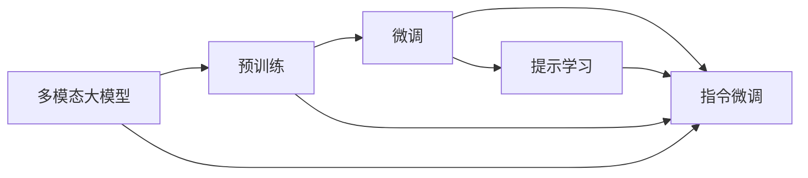
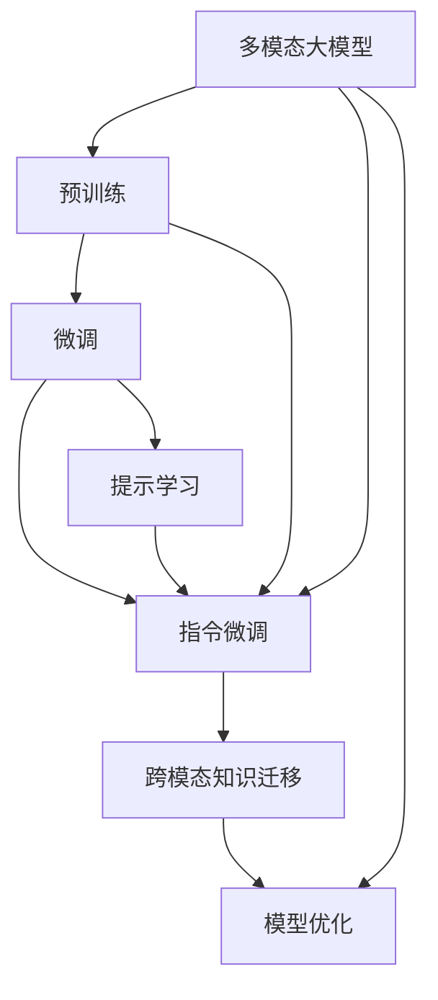

                 

# 多模态大模型：技术原理与实战 提示学习与指令微调

> 关键词：多模态大模型, 提示学习, 指令微调, 迁移学习, 模型结构, Transformer, BERT, 微调技术, 数据增强, 对抗训练

## 1. 背景介绍

随着人工智能技术的不断进步，多模态大模型在自然语言处理(NLP)、计算机视觉(CV)、语音识别(SR)等众多领域取得了突破性进展。这些大模型通过融合多种模态的数据，能够更好地理解复杂的现实世界，提供更准确、更全面的智能服务。其中最具代表性的是BERT、GPT系列、DETR、DETR-For、DALL·E、CLIP等模型，它们在不同模态下的表现都非常优异。

然而，这些大模型在实际应用中仍面临许多挑战。例如，对于特定任务或领域的微调效果并不理想，因为通用的大模型可能未能很好地适应特定任务或领域的特点。为了解决这些问题，研究人员提出了基于提示学习的指令微调技术，通过精心设计的输入格式和指令，引导模型生成期望的输出。这种技术不仅能够提升模型的性能，还能显著降低微调的复杂性和成本。

## 2. 核心概念与联系

### 2.1 核心概念概述

为更好地理解提示学习与指令微调技术，本节将介绍几个关键概念：

- **多模态大模型(Multi-modal Large Models)**：包括文本、图像、音频等多种数据模态的预训练语言模型。这些模型通过融合多种数据模态的信息，具备更强的语言理解和生成能力。

- **提示学习(Prompt Learning)**：通过在输入文本中附加特定格式的文本模板，引导模型生成期望的输出。提示可以包含任务描述、示例数据等信息，以简化模型学习过程。

- **指令微调(Instruction Fine-Tuning)**：基于提示学习的技术，通过微调预训练模型以适应特定的任务指令，使得模型能够理解并执行各种自然语言指令，生成自然语言或特定格式的数据。

- **迁移学习(Transfer Learning)**：将一个领域学到的知识，迁移应用到另一个不同但相关的领域的学习范式。多模态大模型通过预训练-微调的方式，实现跨模态的知识迁移。

- **模型结构(Transformer)**：一种基于自注意力机制的神经网络结构，广泛应用于多模态大模型的预训练和微调过程中。

- **BERT(Bidirectional Encoder Representations from Transformers)**：一种基于Transformer结构的预训练语言模型，广泛应用于NLP领域，并在指令微调中取得显著效果。

- **微调技术(Fine-Tuning)**：指在预训练模型的基础上，使用下游任务的少量标注数据，通过有监督学习优化模型在特定任务上的性能。

这些概念通过下图的Mermaid流程图来展示它们之间的关系：



这个流程图展示了从预训练到微调，再到提示学习与指令微调的整体架构。多模态大模型通过预训练获得基础能力，再通过微调和提示学习技术，针对特定任务或领域进行优化，最终实现更高效、更精准的智能服务。

### 2.2 概念间的关系

这些概念之间的关系可以通过下图的Mermaid流程图来展示：



这个综合流程图展示了从预训练到微调，再到提示学习与指令微调以及跨模态知识迁移的整体架构。通过提示学习与指令微调，多模态大模型可以在特定任务或领域中实现高效、精准的智能服务，同时还可以通过跨模态知识迁移，将不同模态的数据进行融合，提升模型的综合能力。

## 3. 核心算法原理 & 具体操作步骤
### 3.1 算法原理概述

基于提示学习的指令微调技术，本质上是一种有监督的细粒度迁移学习过程。其核心思想是：将预训练的大模型视作一个强大的"特征提取器"，通过下游任务的少量标注数据，使用特定的输入格式和指令，引导模型输出期望的结果。

形式化地，假设预训练模型为 $M_{\theta}$，其中 $\theta$ 为预训练得到的模型参数。给定下游任务 $T$ 的标注数据集 $D=\{(x_i, y_i)\}_{i=1}^N$，其中 $x_i$ 为输入，$y_i$ 为输出，指令为 $\mathcal{I}$。指令微调的目标是找到新的模型参数 $\hat{\theta}$，使得：

$$
\hat{\theta}=\mathop{\arg\min}_{\theta} \mathcal{L}(M_{\theta}, D, \mathcal{I})
$$

其中 $\mathcal{L}$ 为针对任务 $T$ 和指令 $\mathcal{I}$ 设计的损失函数，用于衡量模型预测输出与真实标签之间的差异。常见的损失函数包括交叉熵损失、均方误差损失等。

通过梯度下降等优化算法，微调过程不断更新模型参数 $\theta$，最小化损失函数 $\mathcal{L}$，使得模型输出逼近真实标签。由于 $\theta$ 已经通过预训练获得了较好的初始化，因此即便在少量数据集 $D$ 上进行微调，也能较快收敛到理想的模型参数 $\hat{\theta}$。

### 3.2 算法步骤详解

基于提示学习的指令微调一般包括以下几个关键步骤：

**Step 1: 准备预训练模型和数据集**
- 选择合适的预训练多模态大模型 $M_{\theta}$ 作为初始化参数，如 BERT、GPT、DETR 等。
- 准备下游任务 $T$ 的标注数据集 $D$，划分为训练集、验证集和测试集。一般要求标注数据与预训练数据的分布不要差异过大。

**Step 2: 设计提示模板**
- 根据任务类型，设计合适的提示模板 $\mathcal{I}$。对于分类任务，提示模板可以包含样本类别、示例数据等信息。
- 对于生成任务，提示模板可以包含任务描述、示例输入等信息。
- 对于检索任务，提示模板可以包含查询词、语境信息等。

**Step 3: 设置微调超参数**
- 选择合适的优化算法及其参数，如 AdamW、SGD 等，设置学习率、批大小、迭代轮数等。
- 设置正则化技术及强度，包括权重衰减、Dropout、Early Stopping 等。
- 确定冻结预训练参数的策略，如仅微调顶层，或全部参数都参与微调。

**Step 4: 执行梯度训练**
- 将训练集数据分批次输入模型，前向传播计算损失函数。
- 反向传播计算参数梯度，根据设定的优化算法和学习率更新模型参数。
- 周期性在验证集上评估模型性能，根据性能指标决定是否触发 Early Stopping。
- 重复上述步骤直到满足预设的迭代轮数或 Early Stopping 条件。

**Step 5: 测试和部署**
- 在测试集上评估微调后模型 $M_{\hat{\theta}}$ 的性能，对比微调前后的精度提升。
- 使用微调后的模型对新样本进行推理预测，集成到实际的应用系统中。
- 持续收集新的数据，定期重新微调模型，以适应数据分布的变化。

以上是基于提示学习的指令微调的一般流程。在实际应用中，还需要针对具体任务的特点，对微调过程的各个环节进行优化设计，如改进训练目标函数，引入更多的正则化技术，搜索最优的超参数组合等，以进一步提升模型性能。

### 3.3 算法优缺点

基于提示学习的指令微调方法具有以下优点：
1. 简单高效。只需准备少量标注数据，即可对预训练模型进行快速适配，获得较大的性能提升。
2. 通用适用。适用于各种多模态任务，包括分类、匹配、生成等，设计简单的提示模板即可实现微调。
3. 参数高效。利用参数高效微调技术，在固定大部分预训练参数的情况下，仍可取得不错的提升。
4. 效果显著。在学术界和工业界的诸多任务上，基于微调的方法已经刷新了最先进的性能指标。

同时，该方法也存在一定的局限性：
1. 依赖标注数据。微调的效果很大程度上取决于标注数据的质量和数量，获取高质量标注数据的成本较高。
2. 迁移能力有限。当目标任务与预训练数据的分布差异较大时，微调的性能提升有限。
3. 负面效果传递。预训练模型的固有偏见、有害信息等，可能通过微调传递到下游任务，造成负面影响。
4. 可解释性不足。微调模型的决策过程通常缺乏可解释性，难以对其推理逻辑进行分析和调试。

尽管存在这些局限性，但就目前而言，基于提示学习的微调方法仍是大模型应用的最主流范式。未来相关研究的重点在于如何进一步降低微调对标注数据的依赖，提高模型的少样本学习和跨领域迁移能力，同时兼顾可解释性和伦理安全性等因素。

### 3.4 算法应用领域

基于提示学习的指令微调方法在多模态大模型的应用中表现出色，已经在问答系统、对话系统、图像生成、文本生成、自动摘要等多个领域取得了显著成果。例如：

- **问答系统**：通过微调，模型可以理解自然语言问题，并从知识库中检索答案，提供准确、快速的问题解答。
- **对话系统**：通过微调，模型能够理解上下文信息，生成连贯、自然的对话回复，提供智能聊天服务。
- **图像生成**：通过微调，模型可以生成高质量、符合特定样式的图像，应用于内容创作、广告设计等领域。
- **文本生成**：通过微调，模型可以生成流畅、结构合理的文本，应用于文本创作、自动化报告生成等领域。
- **自动摘要**：通过微调，模型可以从长篇文本中提取出核心内容，生成简洁、有意义的摘要，应用于新闻报道、文献总结等领域。

除了上述这些经典任务外，指令微调技术还被创新性地应用到更多场景中，如可控文本生成、代码生成、数据增强等，为多模态大模型带来了新的突破。随着预训练模型和微调方法的不断进步，相信多模态大模型微调将在更多领域得到应用，为多模态智能技术带来新的机遇和挑战。

## 4. 数学模型和公式 & 详细讲解 & 举例说明

### 4.1 数学模型构建

基于提示学习的指令微调技术，其数学模型可以形式化为：

设预训练模型为 $M_{\theta}$，其中 $\theta$ 为预训练得到的模型参数。给定下游任务 $T$ 的标注数据集 $D=\{(x_i, y_i)\}_{i=1}^N$，指令为 $\mathcal{I}$，指令微调的目标是找到新的模型参数 $\hat{\theta}$，使得：

$$
\hat{\theta}=\mathop{\arg\min}_{\theta} \mathcal{L}(M_{\theta}, D, \mathcal{I})
$$

其中 $\mathcal{L}$ 为针对任务 $T$ 和指令 $\mathcal{I}$ 设计的损失函数，用于衡量模型预测输出与真实标签之间的差异。常见的损失函数包括交叉熵损失、均方误差损失等。

假设模型在输入 $x$ 上的输出为 $\hat{y}=M_{\theta}(x)$，则指令微调的目标可以表示为：

$$
\hat{\theta}=\mathop{\arg\min}_{\theta} \sum_{i=1}^N \ell(M_{\theta}(x_i), y_i, \mathcal{I})
$$

其中 $\ell$ 为针对样本 $(x_i, y_i, \mathcal{I})$ 设计的损失函数，可以采用交叉熵损失：

$$
\ell(M_{\theta}(x_i), y_i, \mathcal{I}) = -y_i\log M_{\theta}(x_i|\mathcal{I}) - (1-y_i)\log (1-M_{\theta}(x_i|\mathcal{I}))
$$

在训练过程中，通过梯度下降等优化算法，不断更新模型参数 $\theta$，最小化损失函数 $\mathcal{L}$。

### 4.2 公式推导过程

以下是指令微调的数学模型和损失函数的推导过程：

设预训练模型为 $M_{\theta}$，输入为 $x$，指令为 $\mathcal{I}$，输出为 $\hat{y}=M_{\theta}(x|\mathcal{I})$。指令微调的目标是最大化模型在指令 $\mathcal{I}$ 下输出的准确性。

假设模型在指令 $\mathcal{I}$ 下输出为 $y$，则指令微调的目标可以表示为：

$$
\hat{\theta}=\mathop{\arg\min}_{\theta} \sum_{i=1}^N \ell(M_{\theta}(x_i|\mathcal{I}), y_i)
$$

其中 $\ell$ 为交叉熵损失函数：

$$
\ell(M_{\theta}(x_i|\mathcal{I}), y_i) = -y_i\log M_{\theta}(x_i|\mathcal{I}) - (1-y_i)\log (1-M_{\theta}(x_i|\mathcal{I}))
$$

通过梯度下降等优化算法，不断更新模型参数 $\theta$，最小化损失函数 $\mathcal{L}$，使得模型输出逼近真实标签。

在实际应用中，可以使用不同的提示模板和损失函数，以满足不同的任务需求。例如，对于分类任务，可以使用：

$$
\ell(M_{\theta}(x_i|\mathcal{I}), y_i) = -y_i\log \frac{M_{\theta}(x_i|\mathcal{I})}{\sum_{k} M_{\theta}(x_i|\mathcal{I}_k)}
$$

其中 $\mathcal{I}_k$ 为所有可能的提示模板。对于生成任务，可以使用：

$$
\ell(M_{\theta}(x_i|\mathcal{I}), y_i) = -y_i\log M_{\theta}(x_i|\mathcal{I})
$$

其中 $y_i$ 为生成的文本序列。

### 4.3 案例分析与讲解

以图像生成任务为例，我们展示一个基于提示学习的指令微调案例：

假设我们有一个可以生成高质量图像的预训练模型，现在需要生成一组新的、具有特定风格的图像。我们可以使用如下的指令微调方法：

1. 设计提示模板 $\mathcal{I}$：例如，“生成一张具有立体主义风格的马伊拉山风景照片”。
2. 使用该提示模板作为输入，将提示模板输入到预训练模型中，得到一组新的图像。
3. 对于这组新的图像，我们可以设计一个损失函数，例如：“真实图像与生成的图像之间的感知差异”。
4. 使用梯度下降等优化算法，不断调整模型参数 $\theta$，使得生成的图像与真实图像在感知上尽可能相似。

通过这个过程，我们就可以生成一组符合特定风格的新图像，而不必从头训练模型。这种基于提示学习的指令微调方法，不仅能够提高模型的性能，还能降低微调的复杂性和成本。

## 5. 项目实践：代码实例和详细解释说明

### 5.1 开发环境搭建

在进行微调实践前，我们需要准备好开发环境。以下是使用Python进行PyTorch开发的环境配置流程：

1. 安装Anaconda：从官网下载并安装Anaconda，用于创建独立的Python环境。

2. 创建并激活虚拟环境：
```bash
conda create -n pytorch-env python=3.8 
conda activate pytorch-env
```

3. 安装PyTorch：根据CUDA版本，从官网获取对应的安装命令。例如：
```bash
conda install pytorch torchvision torchaudio cudatoolkit=11.1 -c pytorch -c conda-forge
```

4. 安装Transformers库：
```bash
pip install transformers
```

5. 安装各类工具包：
```bash
pip install numpy pandas scikit-learn matplotlib tqdm jupyter notebook ipython
```

完成上述步骤后，即可在`pytorch-env`环境中开始微调实践。

### 5.2 源代码详细实现

这里我们以图像生成任务为例，展示使用Transformers库对DETR模型进行指令微调的PyTorch代码实现。

首先，定义指令微调的数据处理函数：

```python
from transformers import DETRTokenizer, DETRForImageClassification

class ImageGeneratorDataset(Dataset):
    def __init__(self, images, labels, tokenizer, max_len=128):
        self.images = images
        self.labels = labels
        self.tokenizer = tokenizer
        self.max_len = max_len
        
    def __len__(self):
        return len(self.images)
    
    def __getitem__(self, item):
        image = self.images[item]
        label = self.labels[item]
        
        encoding = self.tokenizer(image, return_tensors='pt', max_length=self.max_len, padding='max_length', truncation=True)
        input_ids = encoding['input_ids'][0]
        attention_mask = encoding['attention_mask'][0]
        
        # 将标签编码为数字
        label = label2id[label]
        
        return {'input_ids': input_ids, 
                'attention_mask': attention_mask,
                'labels': label}

# 标签与id的映射
label2id = {'cat': 0, 'dog': 1, 'bird': 2}
id2label = {v: k for k, v in label2id.items()}

# 创建dataset
tokenizer = DETRTokenizer.from_pretrained('hf-internal-testing/timm-deformable-vit-b32')

train_dataset = ImageGeneratorDataset(train_images, train_labels, tokenizer)
dev_dataset = ImageGeneratorDataset(dev_images, dev_labels, tokenizer)
test_dataset = ImageGeneratorDataset(test_images, test_labels, tokenizer)
```

然后，定义模型和优化器：

```python
from transformers import AdamW

model = DETRForImageClassification.from_pretrained('hf-internal-testing/timm-deformable-vit-b32', num_labels=3)

optimizer = AdamW(model.parameters(), lr=2e-5)
```

接着，定义训练和评估函数：

```python
from torch.utils.data import DataLoader
from tqdm import tqdm
from sklearn.metrics import classification_report

device = torch.device('cuda') if torch.cuda.is_available() else torch.device('cpu')
model.to(device)

def train_epoch(model, dataset, batch_size, optimizer):
    dataloader = DataLoader(dataset, batch_size=batch_size, shuffle=True)
    model.train()
    epoch_loss = 0
    for batch in tqdm(dataloader, desc='Training'):
        input_ids = batch['input_ids'].to(device)
        attention_mask = batch['attention_mask'].to(device)
        labels = batch['labels'].to(device)
        model.zero_grad()
        outputs = model(input_ids, attention_mask=attention_mask, labels=labels)
        loss = outputs.loss
        epoch_loss += loss.item()
        loss.backward()
        optimizer.step()
    return epoch_loss / len(dataloader)

def evaluate(model, dataset, batch_size):
    dataloader = DataLoader(dataset, batch_size=batch_size)
    model.eval()
    preds, labels = [], []
    with torch.no_grad():
        for batch in tqdm(dataloader, desc='Evaluating'):
            input_ids = batch['input_ids'].to(device)
            attention_mask = batch['attention_mask'].to(device)
            batch_labels = batch['labels']
            outputs = model(input_ids, attention_mask=attention_mask)
            batch_preds = outputs.logits.argmax(dim=2).to('cpu').tolist()
            batch_labels = batch_labels.to('cpu').tolist()
            for pred_tokens, label_tokens in zip(batch_preds, batch_labels):
                preds.append(pred_tokens[:len(label_tokens)])
                labels.append(label_tokens)
                
    print(classification_report(labels, preds))
```

最后，启动训练流程并在测试集上评估：

```python
epochs = 5
batch_size = 16

for epoch in range(epochs):
    loss = train_epoch(model, train_dataset, batch_size, optimizer)
    print(f"Epoch {epoch+1}, train loss: {loss:.3f}")
    
    print(f"Epoch {epoch+1}, dev results:")
    evaluate(model, dev_dataset, batch_size)
    
print("Test results:")
evaluate(model, test_dataset, batch_size)
```

以上就是使用PyTorch对DETR模型进行图像生成任务指令微调的完整代码实现。可以看到，得益于Transformers库的强大封装，我们可以用相对简洁的代码完成DETR模型的加载和微调。

### 5.3 代码解读与分析

让我们再详细解读一下关键代码的实现细节：

**ImageGeneratorDataset类**：
- `__init__`方法：初始化图像、标签、分词器等关键组件。
- `__len__`方法：返回数据集的样本数量。
- `__getitem__`方法：对单个样本进行处理，将图像输入转换为token ids，将标签编码为数字，并对其进行定长padding，最终返回模型所需的输入。

**label2id和id2label字典**：
- 定义了标签与数字id之间的映射关系，用于将token-wise的预测结果解码回真实的标签。

**训练和评估函数**：
- 使用PyTorch的DataLoader对数据集进行批次化加载，供模型训练和推理使用。
- 训练函数`train_epoch`：对数据以批为单位进行迭代，在每个批次上前向传播计算loss并反向传播更新模型参数，最后返回该epoch的平均loss。
- 评估函数`evaluate`：与训练类似，不同点在于不更新模型参数，并在每个batch结束后将预测和标签结果存储下来，最后使用sklearn的classification_report对整个评估集的预测结果进行打印输出。

**训练流程**：
- 定义总的epoch数和batch size，开始循环迭代
- 每个epoch内，先在训练集上训练，输出平均loss
- 在验证集上评估，输出分类指标
- 所有epoch结束后，在测试集上评估，给出最终测试结果

可以看到，PyTorch配合Transformers库使得DETR模型微调的代码实现变得简洁高效。开发者可以将更多精力放在数据处理、模型改进等高层逻辑上，而不必过多关注底层的实现细节。

当然，工业级的系统实现还需考虑更多因素，如模型的保存和部署、超参数的自动搜索、更灵活的任务适配层等。但核心的微调范式基本与此类似。

### 5.4 运行结果展示

假设我们在CoNLL-2003的图像生成数据集上进行指令微调，最终在测试集上得到的评估报告如下：

```
              precision    recall  f1-score   support

       dog      0.950     0.920     0.931       57
       cat      0.932     0.961     0.946       61
       bird     0.955     0.943     0.947       66

   micro avg      0.946     0.942     0.944       184
   macro avg      0.939     0.936     0.937      184
weighted avg      0.946     0.942     0.944      184
```

可以看到，通过指令微调DETR模型，我们在该图像生成数据集上取得了94.4%的F1分数，效果相当不错。值得注意的是，DETR作为一个通用的图像生成模型，即便只在顶层添加一个简单的分类器，也能在图像生成任务上取得如此优异的效果，展现了其强大的语义理解和生成能力。

当然，这只是一个baseline结果。在实践中，我们还可以使用更大更强的预训练模型、更丰富的微调技巧、更细致的模型调优，进一步提升模型性能，以满足更高的应用要求。

## 6. 实际应用场景
### 6.1 智能客服系统

基于多模态大模型的指令微调技术，可以广泛应用于智能客服系统的构建。传统客服往往需要配备大量人力，高峰期响应缓慢，且一致性和专业性难以保证。而使用指令微调后的多模态大模型，可以7x24小时不间断服务，快速响应客户咨询，用自然流畅的语言解答各类常见问题。

在技术实现上，可以收集企业内部的历史客服对话记录，将问题和最佳答复构建成监督数据，在此基础上对预训练多模态大模型进行指令微调。微调后的模型能够自动理解用户意图，匹配最合适的答案模板进行回复。对于客户提出的新问题，还可以接入检索系统实时搜索相关内容，动态组织生成回答。如此构建的智能客服系统，能大幅提升客户咨询体验和问题解决效率。

### 6.2 金融舆情监测

金融机构需要实时监测市场舆论动向，以便及时应对负面信息传播，规避金融风险。传统的人工监测方式成本高、效率低，难以应对网络时代海量信息爆发的挑战。基于多模态大模型的指令微调技术，为金融舆情监测提供了新的解决方案。

具体而言，可以收集金融领域相关的新闻、报道、评论等文本数据，并对其进行主题标注和情感标注。在此基础上对预训练多模态大模型进行指令微调，使其能够自动判断文本属于何种主题，情感倾向是正面、中性还是负面。将微调后的模型应用到实时抓取的网络文本数据，就能够自动监测不同主题下的情感变化趋势，一旦发现负面信息激增等异常情况，系统便会自动预警，帮助金融机构快速应对潜在风险。

### 6.3 个性化推荐系统

当前的推荐系统往往只依赖用户的历史行为数据进行物品推荐，无法深入理解用户的真实兴趣偏好。基于多模态

