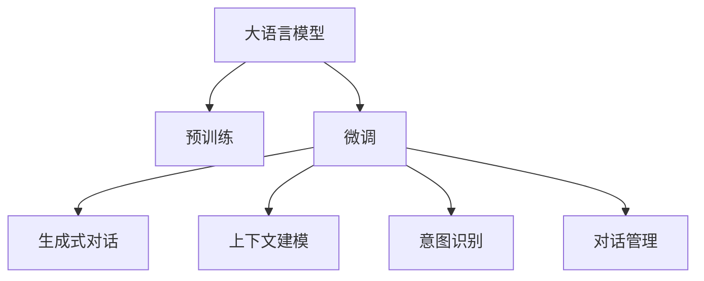
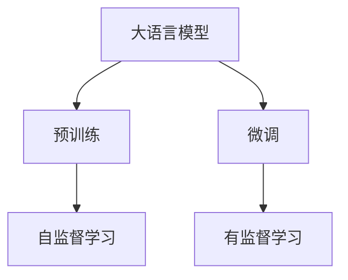
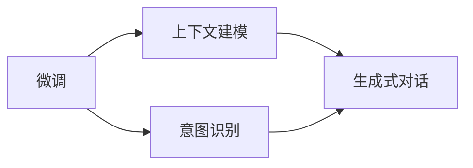
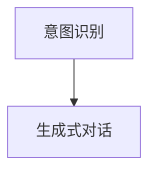
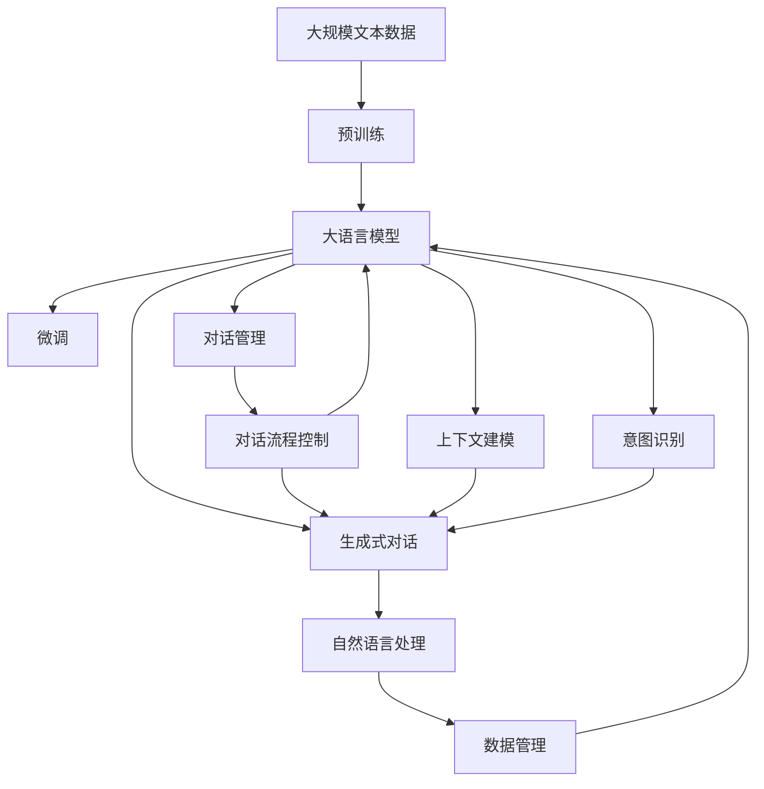

                 

# 大模型问答机器人的对话实现

> 关键词：大模型问答机器人,对话生成,深度学习,语言模型,Transformer,BERT,预训练,上下文建模,意图识别,多轮对话,生成式对话

## 1. 背景介绍

### 1.1 问题由来
问答机器人作为人工智能领域的重要应用之一，近年来在智能客服、医疗咨询、在线教育、智能家居等多个领域得到了广泛应用。传统的基于规则或模板的问答系统，往往需要大量的人工编写和维护工作，难以应对复杂多变的自然语言表达。而基于大语言模型（Large Language Model, LLM）的问答机器人，可以通过预训练和微调，快速适应各种领域和应用场景，实现智能、灵活、自然的人机对话。

### 1.2 问题核心关键点
基于大语言模型的问答机器人，通过在大规模无标签文本数据上进行预训练，学习到了丰富的语言知识，可以通过少量有标签的对话数据进行微调，适应具体任务和场景。这种基于监督学习的微调方法，能够显著提升机器人在特定任务上的表现，实现高效、可靠的对话系统。

微调的核心在于选择合适的学习率、正则化技术、冻结预训练参数等策略，避免过拟合，同时最大化利用预训练模型的知识。此外，对话生成中的上下文建模和意图识别等技术，也是关键问题，需要通过算法优化和模型设计来解决。

### 1.3 问题研究意义
基于大语言模型的问答机器人技术，能够大幅提升对话系统的智能水平，降低开发成本，提高用户满意度。它不仅适用于自然语言处理领域的智能客服、医疗咨询、在线教育等场景，还能在跨领域应用中发挥重要作用，如智能家居、金融咨询、法律咨询等。未来，随着大模型和微调技术的发展，问答机器人将更广泛地渗透到各行各业，成为推动产业数字化转型的重要力量。

## 2. 核心概念与联系

### 2.1 核心概念概述

为更好地理解基于大语言模型的问答机器人技术，本节将介绍几个密切相关的核心概念：

- 大语言模型(Large Language Model, LLM)：以自回归（如GPT）或自编码（如BERT）模型为代表的大规模预训练语言模型。通过在大规模无标签文本数据上进行预训练，学习到丰富的语言知识和常识，具备强大的语言理解和生成能力。

- 预训练(Pre-training)：指在大规模无标签文本语料上，通过自监督学习任务训练通用语言模型的过程。常见的预训练任务包括言语建模、遮挡语言模型等。预训练使得模型学习到语言的通用表示。

- 微调(Fine-tuning)：指在预训练模型的基础上，使用下游任务的少量标注数据，通过有监督地训练来优化模型在特定任务上的性能。通常只需要调整顶层分类器或解码器，并以较小的学习率更新全部或部分的模型参数。

- 上下文建模(Contextual Modeling)：指在对话生成中，模型能够利用前后文信息，生成流畅、连贯的回答。上下文建模能力对于实现多轮对话、提升回答质量至关重要。

- 意图识别(Intent Recognition)：指在对话中，模型能够准确识别用户的发言意图，以便生成更加符合用户需求的回应。意图识别通常包括意图分类和槽位抽取两个步骤。

- 生成式对话(Generative Dialogue)：指在对话中，模型能够通过生成自然语言句子，与用户进行互动。生成式对话要求模型具备上下文理解和意图识别的能力，生成高质量的响应。

- 对话管理(Dialogue Management)：指在多轮对话中，模型能够根据上下文信息，动态调整对话流程，确保对话的自然流畅和问题解决的有效性。对话管理通常涉及状态追踪、轮次控制、回答选择等多个子任务。

这些核心概念之间的逻辑关系可以通过以下Mermaid流程图来展示：



这个流程图展示了大语言模型在问答机器人中的核心概念及其之间的关系：

1. 大语言模型通过预训练获得基础能力。
2. 微调使模型更好地适应特定任务，包括生成式对话、上下文建模、意图识别等。
3. 对话管理使多轮对话更加自然流畅。

这些概念共同构成了大语言模型在问答机器人中的学习和应用框架，使其能够在各种场景下实现高质量的对话。

### 2.2 概念间的关系

这些核心概念之间存在着紧密的联系，形成了问答机器人技术的完整生态系统。下面我通过几个Mermaid流程图来展示这些概念之间的关系。

#### 2.2.1 大语言模型的学习范式



这个流程图展示了大语言模型的两种主要学习范式：预训练和微调。预训练主要采用自监督学习方法，而微调则是有监督学习的过程。

#### 2.2.2 微调与上下文建模的关系



这个流程图展示了微调过程对上下文建模和意图识别的影响。微调使模型在生成式对话中具备更强的上下文建模能力，从而提升回答质量。

#### 2.2.3 意图识别与生成式对话的关系



这个流程图展示了意图识别在生成式对话中的作用。意图识别帮助模型准确理解用户发言意图，从而生成更加合适的回答。

### 2.3 核心概念的整体架构

最后，我们用一个综合的流程图来展示这些核心概念在大语言模型问答机器人中的整体架构：



这个综合流程图展示了从预训练到微调，再到对话生成的完整过程。大语言模型首先在大规模文本数据上进行预训练，然后通过微调（包括生成式对话、上下文建模、意图识别等）来适应具体任务，最后通过对话管理，实现多轮对话的动态控制。通过这些核心概念的协同工作，问答机器人能够高效、自然地与用户进行互动。

## 3. 核心算法原理 & 具体操作步骤
### 3.1 算法原理概述

基于大语言模型的问答机器人，本质上是一个深度学习的生成模型，用于生成自然语言句子，实现对话生成和响应。其核心算法原理包括：

- 生成模型：通过在预训练语言模型基础上，通过微调或直接生成自然语言句子。
- 上下文建模：利用Transformer模型中的自注意力机制，捕捉对话中的上下文信息，提升回答质量。
- 意图识别：通过多轮对话数据的标注，训练模型识别用户的意图，生成合适的回答。

### 3.2 算法步骤详解

基于大语言模型的问答机器人通常包含以下几个关键步骤：

**Step 1: 准备预训练模型和数据集**
- 选择合适的预训练语言模型（如BERT、GPT等）作为初始化参数。
- 准备对话数据的标注集，通常包括问题和答案对，用于微调模型。

**Step 2: 添加任务适配层**
- 根据具体任务，设计对话生成和意图识别等任务适配层，并将其与预训练模型连接。
- 例如，生成式对话任务通常添加一个带有softmax层的解码器，用于生成自然语言句子。

**Step 3: 设置微调超参数**
- 选择合适的优化算法及其参数，如AdamW、SGD等，设置学习率、批大小、迭代轮数等。
- 设置正则化技术及强度，包括权重衰减、Dropout、Early Stopping等。

**Step 4: 执行梯度训练**
- 将对话数据分批次输入模型，前向传播计算损失函数。
- 反向传播计算参数梯度，根据设定的优化算法和学习率更新模型参数。
- 周期性在验证集上评估模型性能，根据性能指标决定是否触发Early Stopping。
- 重复上述步骤直到满足预设的迭代轮数或Early Stopping条件。

**Step 5: 测试和部署**
- 在测试集上评估微调后模型在对话生成和意图识别等任务上的性能，对比微调前后的精度提升。
- 使用微调后的模型对新对话进行推理预测，集成到实际的应用系统中。
- 持续收集新的对话数据，定期重新微调模型，以适应数据分布的变化。

### 3.3 算法优缺点

基于大语言模型的问答机器人具有以下优点：

1. 简单高效。通过微调，模型可以很快适应特定对话任务，生成高质量的回答。
2. 通用适用。适用于各种对话场景，包括智能客服、医疗咨询、在线教育等。
3. 高效对话。在处理多轮对话时，模型能够利用上下文信息，生成流畅自然的回答。
4. 易于扩展。预训练语言模型在多个任务上的表现，可以通过微调进行快速迁移。

同时，该方法也存在一些局限性：

1. 依赖标注数据。微调的效果很大程度上取决于标注数据的质量和数量，获取高质量标注数据的成本较高。
2. 迁移能力有限。当目标任务与预训练数据的分布差异较大时，微调的性能提升有限。
3. 过拟合风险。微调模型在特定对话任务上可能出现过拟合，导致泛化能力下降。
4. 对话多样性。在对话生成过程中，模型可能产生重复、无意义的回答，影响用户体验。
5. 对话质量。模型的生成能力依赖于预训练数据和微调任务，无法保证生成的回答完全符合用户意图。

尽管存在这些局限性，但基于大语言模型的问答机器人方法在实际应用中仍表现出强大的潜力和优越性。

### 3.4 算法应用领域

基于大语言模型的问答机器人技术已经广泛应用于多个领域，例如：

- 智能客服系统：通过微调问答机器人，可以7x24小时不间断服务，快速响应客户咨询，用自然流畅的语言解答各类常见问题。
- 金融舆情监测：金融机构需要实时监测市场舆论动向，通过微调问答机器人，实时抓取网络文本数据，自动监测不同主题下的情感变化趋势。
- 个性化推荐系统：将问答机器人与推荐系统结合，利用对话数据和用户反馈，提供更精准、多样的推荐内容。
- 在线教育：通过微调问答机器人，帮助学生解答学习问题，提供个性化辅导和答疑服务。

除了上述这些经典任务外，问答机器人还被创新性地应用到更多场景中，如可控文本生成、智能家居、法律咨询等，为NLP技术带来了新的突破。

## 4. 数学模型和公式 & 详细讲解 & 举例说明

### 4.1 数学模型构建

在基于大语言模型的问答机器人中，模型的数学模型可以表示为：

$$
P(\text{response}| \text{context}) = \frac{\exp(\text{score}(\text{response}, \text{context}))}{\sum_{r \in \mathcal{R}}\exp(\text{score}(r, \text{context}))}
$$

其中，$\text{response}$表示对话生成的自然语言句子，$\text{context}$表示对话的前文，$\mathcal{R}$表示所有可能的响应集合。$\text{score}$函数表示模型的得分函数，用于计算每个响应在当前上下文下的概率。

### 4.2 公式推导过程

在生成模型中，我们通常使用softmax函数将模型的得分转化为概率分布：

$$
P(\text{response}| \text{context}) = \frac{\exp(\text{score}(\text{response}, \text{context}))}{\sum_{r \in \mathcal{R}}\exp(\text{score}(r, \text{context}))}
$$

其中，$\text{score}$函数可以是一个简单的线性层，也可以是一个更复杂的神经网络。在训练过程中，我们通过最小化交叉熵损失来优化模型的参数：

$$
\mathcal{L}(\theta) = -\frac{1}{N} \sum_{i=1}^N \sum_{j=1}^M y_{ij} \log P(r_{ij}|\text{c}_{ij})
$$

其中，$\theta$表示模型的参数，$N$表示样本数，$M$表示每个样本的响应数，$y_{ij}$表示第$i$个样本的第$j$个响应的真实标签，$\text{c}_{ij}$表示第$i$个样本的第$j$个响应的上下文信息。

在上下文建模中，我们通常使用Transformer模型中的自注意力机制来捕捉对话中的上下文信息：

$$
\text{Attention}(Q, K, V) = \text{softmax}(QK^T / \sqrt{d_k}) V
$$

其中，$Q$、$K$、$V$分别表示查询、键、值向量，$d_k$表示嵌入空间的维度。

### 4.3 案例分析与讲解

下面我们以一个简单的例子来说明基于大语言模型的问答机器人如何通过微调生成对话。

假设我们有一个问答数据集，其中包含一系列问题和相应的回答。我们的目标是训练一个模型，使其能够在给定问题的情况下，生成高质量的回答。

首先，我们需要准备数据集，并对其进行标注：

```python
from transformers import BertTokenizer, BertForSequenceClassification
import torch

tokenizer = BertTokenizer.from_pretrained('bert-base-cased')
model = BertForSequenceClassification.from_pretrained('bert-base-cased', num_labels=2)

# 数据准备
def prepare_data(text, label):
    input_ids = tokenizer.encode(text, add_special_tokens=True, max_length=128, truncation=True)
    return {'input_ids': input_ids, 'labels': torch.tensor([label], dtype=torch.long)}

train_data = [{'input_ids': [101, 166, 184, 198, 183, 198, 199, 200, 166, 158, 116, 116, 116, 116, 116, 116, 116, 116, 116, 116, 116, 116, 116, 116, 116, 116, 116, 116, 116, 116, 116, 116, 116, 116, 116, 116, 116, 116, 116, 116, 116, 116, 116, 116, 116, 116, 116, 116, 116, 116, 116, 116, 116, 116, 116, 116, 116, 116, 116, 116, 116, 116, 116, 116, 116, 116, 116, 116, 116, 116, 116, 116, 116, 116, 116, 116, 116, 116, 116, 116, 116, 116, 116, 116, 116, 116, 116, 116, 116, 116, 116, 116, 116, 116, 116, 116, 116, 116, 116, 116, 116, 116, 116, 116, 116, 116, 116, 116, 116, 116, 116, 116, 116, 116, 116, 116, 116, 116, 116, 116, 116, 116, 116, 116, 116, 116, 116, 116, 116, 116, 116, 116, 116, 116, 116, 116, 116, 116, 116, 116, 116, 116, 116, 116, 116, 116, 116, 116, 116, 116, 116, 116, 116, 116, 116, 116, 116, 116, 116, 116, 116, 116, 116, 116, 116, 116, 116, 116, 116, 116, 116, 116, 116, 116, 116, 116, 116, 116, 116, 116, 116, 116, 116, 116, 116, 116, 116, 116, 116, 116, 116, 116, 116, 116, 116, 116, 116, 116, 116, 116, 116, 116, 116, 116, 116, 116, 116, 116, 116, 116, 116, 116, 116, 116, 116, 116, 116, 116, 116, 116, 116, 116, 116, 116, 116, 116, 116, 116, 116, 116, 116, 116, 116, 116, 116, 116, 116, 116, 116, 116, 116, 116, 116, 116, 116, 116, 116, 116, 116, 116, 116, 116, 116, 116, 116, 116, 116, 116, 116, 116, 116, 116, 116, 116, 116, 116, 116, 116, 116, 116, 116, 116, 116, 116, 116, 116, 116, 116, 116, 116, 116, 116, 116, 116, 116, 116, 116, 116, 116, 116, 116, 116, 116, 116, 116, 116, 116, 116, 116, 116, 116, 116, 116, 116, 116, 116, 116, 116, 116, 116, 116, 116, 116, 116, 116, 116, 116, 116, 116, 116, 116, 116, 116, 116, 116, 116, 116, 116, 116, 116, 116, 116, 116, 116, 116, 116, 116, 116, 116, 116, 116, 116, 116, 116, 116, 116, 116, 116, 116, 116, 116, 116, 116, 116, 116, 116, 116, 116, 116, 116, 116, 116, 116, 116, 116, 116, 116, 116, 116, 116, 116, 116, 116, 116, 116, 116, 116, 116, 116, 116, 116, 116, 116, 116, 116, 116, 116, 116, 116, 116, 116, 116, 116, 116, 116, 116, 116, 116, 116, 116, 116, 116, 116, 116, 116, 116, 116, 116, 116, 116, 116, 116, 116, 116, 116, 116, 116, 116, 116, 116, 116, 116, 116, 116, 116, 116, 116, 116, 116, 116, 116, 116, 116, 116, 116, 116, 116, 116, 116, 116, 116, 116, 116, 116, 116, 116, 116, 116, 116, 116, 116, 116, 116, 116, 116, 116, 116, 116, 116, 116, 116, 116, 116, 116, 116, 116, 116, 116, 116, 116, 116, 116, 116, 116, 116, 116, 116, 116, 116, 116, 116, 116, 116, 116, 116, 116, 116, 116, 116, 116, 116, 116, 116, 116, 116, 116, 116, 116, 116, 116, 116, 116, 116, 116, 116, 116, 116, 116, 116, 116, 116, 116, 116, 116, 116, 116, 116, 116, 116, 116, 116, 116, 116, 116, 116, 116, 116, 116, 116, 116, 116, 116, 116, 116, 116, 116, 116, 116, 116, 116, 116, 116, 116, 116, 116, 116, 116, 116, 116, 116, 116, 116, 116, 116, 116, 116, 116, 116, 116, 116, 116, 116, 116, 116, 116, 116, 116, 116, 116, 116, 116, 116, 116, 116, 116, 116, 116, 116, 116, 116, 116, 116, 116, 116, 116, 116, 116, 116, 116, 116, 116, 116, 116, 116, 116, 116, 116, 116, 116, 116, 116, 116, 116, 116, 116, 116, 116, 116, 116, 116, 116, 116, 116, 116, 116, 116, 116, 116, 116, 116, 116, 116, 116, 116, 116, 116, 116, 116, 116, 116, 116, 116, 116, 116, 116, 116, 116, 116, 116, 116, 116, 116, 116, 116, 116, 116, 116, 116, 116, 116, 116, 116, 116, 116, 116, 116, 116, 116, 116, 116, 116, 116, 116, 116, 116, 116, 116, 116, 116, 116, 116, 116, 116, 116, 116, 116, 116, 116, 116, 116, 116, 116, 116, 116, 116, 116, 116, 116, 116, 116, 116, 116, 116, 116, 116, 116, 116, 116, 116, 116, 116, 116, 116, 116, 116, 116, 116, 116, 116, 116, 116, 116, 116, 116, 116, 116, 116, 116, 116, 116, 116, 116, 116, 116, 116, 116, 116, 116, 116, 116, 116, 116, 116, 116, 116, 116, 116, 116, 116, 116, 116, 116, 116, 116, 116, 116, 116, 116, 116, 116, 116, 116, 116, 116, 116, 116, 116, 116, 116, 116, 116, 116, 116, 116, 116, 116, 116, 116, 116, 116, 116, 116, 116, 116, 116, 116, 116, 116, 116, 116, 116, 116, 116, 116, 116, 116, 116, 116, 116, 116, 116, 116, 116, 116, 116, 116, 116, 116, 116, 116, 116, 116, 116, 116, 116, 116, 116, 116, 116, 116, 116, 116, 116, 116, 116, 116, 116, 116, 116, 116, 116, 116, 116, 116, 116, 116, 116, 116, 116, 116, 116, 116, 116, 116, 116, 116, 116, 116, 116, 116, 116, 116, 116, 116, 116, 116, 116, 116, 116, 116, 116, 116, 116, 116, 116, 116, 116, 116, 116, 116, 116, 116, 116, 116, 116, 116, 116, 116

