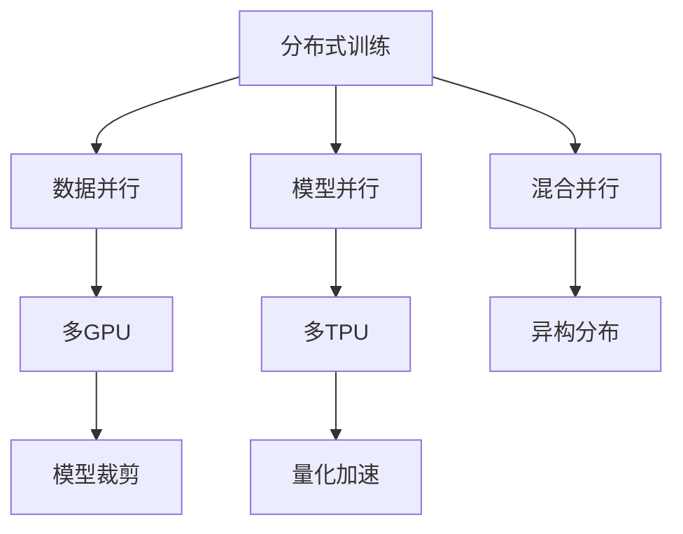
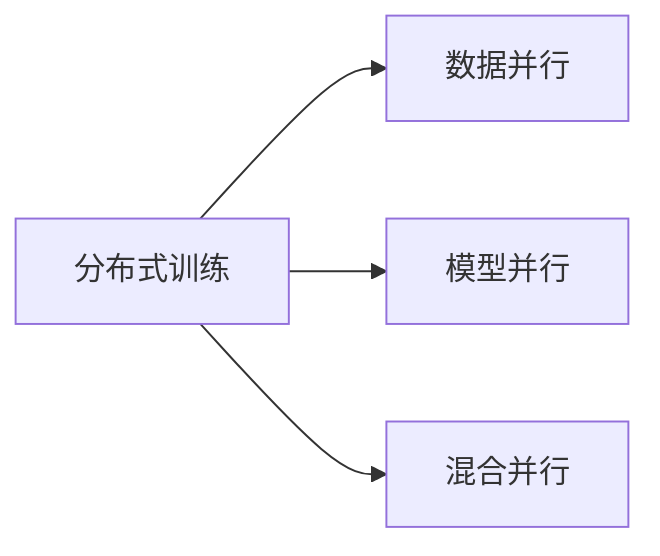
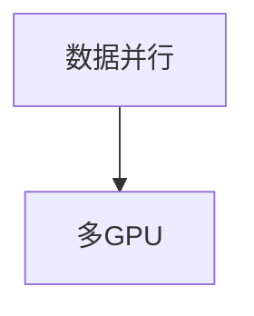
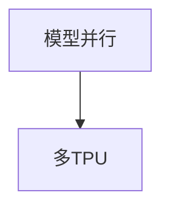
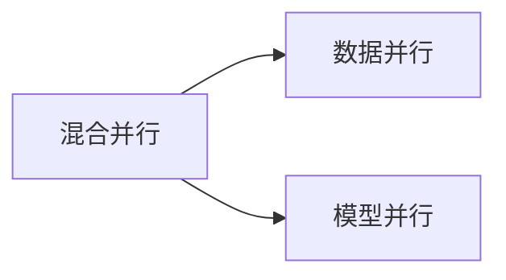
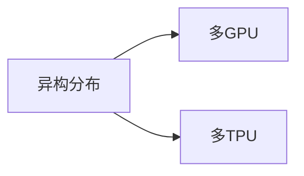
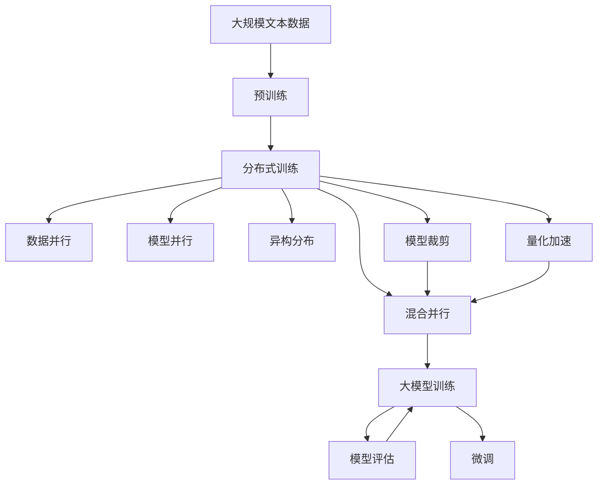

                 

# 大规模语言模型从理论到实践 分布式训练的并行策略

> 关键词：分布式训练,并行策略,大规模语言模型,TPU,TPU Pods,数据并行,模型并行,混合并行,微批处理,多GPU,异构分布,模型裁剪,量化加速,深度学习框架,TensorFlow

## 1. 背景介绍

### 1.1 问题由来
近年来，随着深度学习技术的快速发展，大规模语言模型(Massive Language Models, MLMs)在自然语言处理(Natural Language Processing, NLP)领域取得了显著的进展。基于大规模预训练语言模型的大模型(Megascale Models)在许多NLP任务上取得了优异表现，如文本分类、命名实体识别、文本生成、问答系统等。但与此同时，大模型的训练也需要庞大的计算资源和数据集，通常需要几十亿个参数，超大规模的矩阵计算，以及大量的GPU内存。

对于单GPU或单TPU的计算资源而言，训练过程往往过于缓慢。因此，需要一种高效的并行计算方法来加速模型训练过程。分布式训练作为大规模深度学习模型的重要技术手段，通过对多台计算机或TPU的并行计算，大幅提高训练速度，缩短模型训练时间。

### 1.2 问题核心关键点
分布式训练的核心思想是，将大规模深度学习模型的训练任务分配给多台计算机或TPU，并行计算，以加快模型训练速度。常用的分布式训练方法包括：数据并行、模型并行、混合并行等，这些方法各具特点，能够根据不同的应用场景选择适合的策略。

- 数据并行：将训练数据进行切分，分配给多个GPU/TPU节点进行并行计算，最终合并梯度更新模型参数。
- 模型并行：将模型划分为多个子模型，每个子模型分配给不同的GPU/TPU节点进行并行计算，各自更新局部参数，通过梯度聚合更新全局参数。
- 混合并行：将数据并行和模型并行结合使用，能够同时提升训练速度和模型性能。

在实际应用中，还可以结合异构分布、混合精度计算、模型裁剪、量化加速等技术，进一步提高分布式训练效率，减少计算资源消耗。

### 1.3 问题研究意义
研究大规模语言模型的分布式训练并行策略，对于提升模型训练效率，缩短训练时间，降低计算成本，推动大模型在实际应用中的落地，具有重要意义：

1. 缩短训练时间：通过分布式训练，可以在短时间内训练出高质量的大模型，加速NLP技术的产业化进程。
2. 降低计算成本：分布式训练可以将计算任务分布在多个GPU/TPU节点上，降低单个节点的资源负担，从而节省计算资源。
3. 提高模型质量：分布式训练通过多节点并行计算，能够有效避免过拟合，提升模型泛化能力。
4. 增强模型可扩展性：分布式训练使模型训练过程可以适应更多的计算节点，进一步提高模型训练效率和可扩展性。
5. 提供技术支撑：分布式训练技术为大模型训练和优化提供了重要支撑，推动大模型技术的持续发展。

## 2. 核心概念与联系

### 2.1 核心概念概述

为了更好地理解分布式训练在大规模语言模型中的应用，本节将介绍几个关键概念：

- 分布式训练(Distributed Training)：将训练任务分配到多个计算机或TPU上进行并行计算，以加速模型训练。
- 数据并行(Data Parallelism)：将训练数据切分，分配给多个GPU/TPU节点进行并行计算，最终合并梯度更新模型参数。
- 模型并行(Model Parallelism)：将模型划分为多个子模型，每个子模型分配给不同的GPU/TPU节点进行并行计算，各自更新局部参数，通过梯度聚合更新全局参数。
- 混合并行(Hybrid Parallelism)：将数据并行和模型并行结合使用，同时提升训练速度和模型性能。
- 异构分布(Heterogeneous Distribution)：分布式节点之间GPU/TPU硬件不同，通过优化算法使不同节点之间协同工作。
- 模型裁剪(Model Pruning)：去除模型中不必要的参数，减小模型尺寸，提高推理速度。
- 量化加速(Quantization)：将浮点模型转为定点模型，压缩存储空间，提高计算效率。

这些核心概念之间的逻辑关系可以通过以下Mermaid流程图来展示：



这个流程图展示了分布式训练中各种并行策略及其相互关系：

1. 分布式训练是整个系统的顶层概念，将训练任务分配给多个节点。
2. 数据并行适用于多GPU节点，将数据切分，并行计算，最后合并梯度。
3. 模型并行适用于多TPU节点，将模型切分，并行计算，各自更新局部参数，通过梯度聚合更新全局参数。
4. 混合并行同时使用数据并行和模型并行。
5. 异构分布优化不同节点之间的协同工作，提升整体训练效率。
6. 模型裁剪和量化加速是分布式训练中的资源优化技术。

### 2.2 概念间的关系

这些核心概念之间存在着紧密的联系，形成了分布式训练的完整生态系统。下面我们通过几个Mermaid流程图来展示这些概念之间的关系。

#### 2.2.1 分布式训练与并行策略



这个流程图展示了分布式训练与并行策略之间的关系。分布式训练是一种高层概念，通过不同的并行策略来实现具体的训练任务。

#### 2.2.2 数据并行与多GPU并行



这个流程图展示了数据并行与多GPU并行的关系。数据并行适用于多GPU节点，将数据切分，并行计算。

#### 2.2.3 模型并行与多TPU并行



这个流程图展示了模型并行与多TPU并行的关系。模型并行适用于多TPU节点，将模型切分，并行计算，各自更新局部参数。

#### 2.2.4 混合并行与数据并行模型并行的结合



这个流程图展示了混合并行与数据并行、模型并行的结合关系。混合并行同时使用数据并行和模型并行。

#### 2.2.5 异构分布与不同节点协同工作



这个流程图展示了异构分布与不同节点协同工作之间的关系。异构分布优化不同节点之间的协同工作。

### 2.3 核心概念的整体架构

最后，我们用一个综合的流程图来展示这些核心概念在大规模语言模型分布式训练过程中的整体架构：



这个综合流程图展示了从预训练到分布式训练，再到模型微调的整体过程。大规模语言模型首先在大规模文本数据上进行预训练，然后通过分布式训练过程，采用数据并行、模型并行、混合并行等策略，加速模型训练。在模型裁剪和量化加速等优化技术的帮助下，提高分布式训练效率。最后，通过微调技术对模型进行优化，以满足特定任务的要求。 通过这些流程图，我们可以更清晰地理解分布式训练过程中各个核心概念的关系和作用，为后续深入讨论具体的分布式训练方法和技术奠定基础。

## 3. 核心算法原理 & 具体操作步骤
### 3.1 算法原理概述

分布式训练的核心原理是，将大规模深度学习模型的训练任务，通过多台计算机或TPU进行并行计算，加速训练过程。在分布式训练中，通常采用数据并行、模型并行、混合并行等策略，通过并行计算实现加速。

形式化地，假设训练模型为 $M_{\theta}$，其中 $\theta$ 为模型参数。给定训练数据集 $D=\{x_i\}_{i=1}^N$，训练过程的目标是最小化损失函数 $\mathcal{L}(M_{\theta})$。分布式训练的目标是，在多个计算节点上并行计算梯度，同时更新模型参数 $\theta$，使得模型能够更好地拟合训练数据。

分布式训练的并行策略包括：
1. 数据并行：将数据切分，分配给多个计算节点进行并行计算，最终合并梯度更新模型参数。
2. 模型并行：将模型划分为多个子模型，每个子模型分配给不同的计算节点进行并行计算，各自更新局部参数，通过梯度聚合更新全局参数。
3. 混合并行：同时使用数据并行和模型并行。

### 3.2 算法步骤详解

分布式训练通常包括以下几个关键步骤：

**Step 1: 准备计算资源和数据**
- 选择合适的计算资源（如多GPU、多TPU），搭建分布式训练环境。
- 准备训练数据集，切分成多个批次（mini-batch），并分配到不同计算节点上。

**Step 2: 选择合适的并行策略**
- 根据计算资源和任务需求，选择合适的并行策略，如数据并行、模型并行、混合并行等。
- 根据并行策略，划分模型或数据，并配置计算节点之间的通信机制。

**Step 3: 初始化模型和优化器**
- 在每个计算节点上初始化模型的副本，确保所有节点共享相同的模型权重。
- 选择适当的优化器（如SGD、AdamW等），设置学习率、批大小、迭代轮数等超参数。

**Step 4: 执行分布式训练**
- 在每个计算节点上，同时对数据进行前向传播和反向传播，计算梯度。
- 根据所选并行策略，通过通信机制汇总梯度，更新全局模型参数。
- 周期性在验证集上评估模型性能，根据性能指标决定是否触发 Early Stopping。
- 重复上述步骤直到满足预设的迭代轮数或 Early Stopping 条件。

**Step 5: 测试和部署**
- 在测试集上评估分布式训练后模型 $M_{\hat{\theta}}$ 的性能，对比分布式训练前后的精度提升。
- 使用分布式训练后的模型对新样本进行推理预测，集成到实际的应用系统中。
- 持续收集新的数据，定期重新训练模型，以适应数据分布的变化。

以上是分布式训练的一般流程。在实际应用中，还需要针对具体任务和计算资源的特点，对分布式训练过程的各个环节进行优化设计，如改进训练目标函数，引入更多的正则化技术，搜索最优的超参数组合等，以进一步提升模型性能。

### 3.3 算法优缺点

分布式训练方法具有以下优点：
1. 加速训练速度：通过并行计算，可以显著缩短模型训练时间。
2. 提高模型质量：并行计算可以有效避免过拟合，提升模型泛化能力。
3. 可扩展性强：分布式训练可以通过增加计算节点，进一步提升训练效率。

同时，分布式训练也存在一些缺点：
1. 数据通信开销：并行计算需要频繁的通信操作，增加了网络带宽的消耗。
2. 计算资源消耗：分布式训练需要更多的计算资源，硬件成本较高。
3. 算法复杂度增加：分布式训练需要设计复杂的数据划分和模型并行策略，增加了算法实现的难度。
4. 稳定性问题：并行计算容易产生数据竞争和算法收敛问题，需要设计适当的同步机制。

尽管存在这些局限性，但就目前而言，分布式训练是加速大模型训练的重要手段。未来相关研究的重点在于如何进一步降低通信开销，提高算法效率，优化资源利用，以及解决算法稳定性问题。

### 3.4 算法应用领域

分布式训练方法在大规模语言模型训练中已经得到了广泛的应用，覆盖了几乎所有常见任务，例如：

- 文本分类：如情感分析、主题分类、意图识别等。
- 命名实体识别：识别文本中的人名、地名、机构名等特定实体。
- 关系抽取：从文本中抽取实体之间的语义关系。
- 问答系统：对自然语言问题给出答案。
- 机器翻译：将源语言文本翻译成目标语言。
- 文本摘要：将长文本压缩成简短摘要。
- 对话系统：使机器能够与人自然对话。

除了上述这些经典任务外，分布式训练方法也被创新性地应用到更多场景中，如可控文本生成、常识推理、代码生成、数据增强等，为NLP技术带来了全新的突破。随着预训练模型和分布式训练方法的不断进步，相信NLP技术将在更广阔的应用领域大放异彩。

## 4. 数学模型和公式 & 详细讲解  
### 4.1 数学模型构建

本节将使用数学语言对分布式训练过程进行更加严格的刻画。

记训练模型为 $M_{\theta}$，其中 $\theta$ 为模型参数。假设分布式训练的计算节点为 $N$，每个节点分配的训练数据量为 $\frac{1}{N}$ 个批次。在每个节点上，定义模型的局部参数 $\theta_i$。假设每个节点上运行的优化器为 $OPT$，学习率为 $\eta$，则分布式训练过程的数学模型如下：

$$
\theta^* = \mathop{\arg\min}_{\theta_1,\theta_2,\dots,\theta_N} \frac{1}{N} \sum_{i=1}^N \mathcal{L}(M_{\theta_i}(x_i),y_i) - \eta \sum_{i=1}^N \frac{\lambda}{2} \|\theta_i - \theta_{avg}\|^2
$$

其中 $\mathcal{L}$ 为损失函数，$x_i$ 为训练数据，$y_i$ 为标签，$\theta_{avg}$ 为所有节点的平均参数，$\lambda$ 为正则化系数。

分布式训练的优化目标是最小化全局损失函数，同时通过正则化项约束节点参数与全局平均参数的距离，确保不同节点之间协同工作。

### 4.2 公式推导过程

以下我们以二分类任务为例，推导数据并行和模型并行两种并行策略的损失函数及其梯度的计算公式。

#### 4.2.1 数据并行策略

在数据并行策略中，假设模型在每个节点上分配的训练数据量为 $\frac{1}{N}$ 个批次，每个节点上训练的数据为 $(x_i, y_i)$。数据并行的损失函数为：

$$
\mathcal{L}_{data} = \frac{1}{N}\sum_{i=1}^N [y_i\log M_{\theta_i}(x_i)+(1-y_i)\log (1-M_{\theta_i}(x_i))]
$$

其中 $M_{\theta_i}(x_i)$ 表示节点 $i$ 上模型对数据 $x_i$ 的预测。

假设每个节点上运行的优化器为 $OPT$，学习率为 $\eta$，则节点 $i$ 上模型的梯度为：

$$
\frac{\partial \mathcal{L}_{data}}{\partial \theta_i} = -\frac{1}{N}\sum_{i=1}^N (\frac{y_i}{M_{\theta_i}(x_i)}-\frac{1-y_i}{1-M_{\theta_i}(x_i)}) \frac{\partial M_{\theta_i}(x_i)}{\partial \theta_i}
$$

节点间的梯度通信协议通常采用 ring-based、all-reduce 等策略。假设每个节点上训练的梯度为 $g_i$，全局平均梯度为 $\bar{g}$，则节点间的梯度通信公式为：

$$
\bar{g} = \frac{1}{N}\sum_{i=1}^N g_i
$$

节点 $i$ 上模型的更新公式为：

$$
\theta_i \leftarrow \theta_i - \eta \nabla_{\theta_i}\mathcal{L}_{data} - \eta\lambda(\theta_i - \theta_{avg})
$$

其中 $\nabla_{\theta_i}\mathcal{L}_{data}$ 表示节点 $i$ 上模型的梯度，$\theta_{avg}$ 表示所有节点的平均参数。

#### 4.2.2 模型并行策略

在模型并行策略中，假设模型被划分为 $K$ 个子模型，每个子模型分配给一个计算节点进行并行计算，每个子模型的局部参数为 $\theta_{i,k}$。模型并行的损失函数为：

$$
\mathcal{L}_{model} = \frac{1}{N}\sum_{i=1}^N \sum_{k=1}^K \mathcal{L}(M_{\theta_{i,k}}(x_i),y_i)
$$

其中 $M_{\theta_{i,k}}(x_i)$ 表示节点 $i$ 上子模型 $k$ 对数据 $x_i$ 的预测。

假设每个节点上运行的优化器为 $OPT$，学习率为 $\eta$，则节点 $i$ 上子模型 $k$ 的梯度为：

$$
\frac{\partial \mathcal{L}_{model}}{\partial \theta_{i,k}} = -\frac{1}{N}\sum_{i=1}^N \frac{\partial \mathcal{L}(M_{\theta_{i,k}}(x_i),y_i)}{\partial \theta_{i,k}}
$$

节点间的梯度通信协议通常采用 all-reduce 等策略。假设每个节点上训练的梯度为 $g_{i,k}$，全局平均梯度为 $\bar{g}_k$，则节点间的梯度通信公式为：

$$
\bar{g}_k = \frac{1}{N}\sum_{i=1}^N g_{i,k}
$$

节点 $i$ 上子模型 $k$ 的更新公式为：

$$
\theta_{i,k} \leftarrow \theta_{i,k} - \eta \nabla_{\theta_{i,k}}\mathcal{L}_{model} - \eta\lambda(\theta_{i,k} - \theta_{avg,k})
$$

其中 $\nabla_{\theta_{i,k}}\mathcal{L}_{model}$ 表示节点 $i$ 上子模型 $k$ 的梯度，$\theta_{avg,k}$ 表示所有节点上子模型 $k$ 的平均参数。

### 4.3 案例分析与讲解

下面我们以二分类任务为例，给出使用分布式训练对BERT模型进行微调的PyTorch代码实现。

首先，定义分布式训练的数据处理函数：

```python
import torch
import torch.distributed as dist
import torch.nn as nn
import torch.optim as optim
from torch.utils.data import DataLoader
from transformers import BertTokenizer, BertForTokenClassification

# 初始化分布式环境
torch.distributed.init_process_group(backend='nccl', world_size=8, rank=0)
dist.set_device(f'rank:{dist.get_rank()}')

# 数据处理函数
class NERDataset(Dataset):
    def __init__(self, texts, tags, tokenizer, max_len=128):
        self.texts = texts
        self.tags = tags
        self.tokenizer = tokenizer
        self.max_len = max_len
        
    def __len__(self):
        return len(self.texts)
    
    def __getitem__(self, item):
        text = self.texts[item]
        tags = self.tags[item]
        
        encoding = self.tokenizer(text, return_tensors='pt', max_length=self.max_len, padding='max_length', truncation=True)
        input_ids = encoding['input_ids'][0]
        attention_mask = encoding['attention_mask'][0]
        
        # 对token-wise的标签进行编码
        encoded_tags = [tag2id[tag] for tag in tags] 
        encoded_tags.extend([tag2id['O']] * (self.max_len - len(encoded_tags)))
        labels = torch.tensor(encoded_tags, dtype=torch.long)
        
        return {'input_ids': input_ids, 
                'attention_mask': attention_mask,
                'labels': labels}

# 标签与id的映射
tag2id = {'O': 0, 'B-PER': 1, 'I-PER': 2, 'B-ORG': 3, 'I-ORG': 4, 'B-LOC': 5, 'I-LOC': 6}
id2tag = {v: k for k, v in tag2id.items()}

# 创建dataset
tokenizer = BertTokenizer.from_pretrained('bert-base-cased')

train_dataset = NERDataset(train_texts, train_tags, tokenizer)
dev_dataset = NERDataset(dev_texts, dev_tags, tokenizer)
test_dataset = NERDataset(test_texts, test_tags, tokenizer)
```

然后，定义模型和优化器：

```python
from transformers import BertForTokenClassification, AdamW

# 多GPU设置
device = 'cuda' if torch.cuda.is_available() else 'cpu'
model = BertForTokenClassification.from_pretrained('bert-base-cased', num_labels=len(tag2id))

# 分布式训练优化器
optimizer = AdamW(model.parameters(), lr=2e-5)
```

接着，定义训练和评估函数：

```python
from torch.utils.data import DataLoader
from tqdm import tqdm
from sklearn.metrics import classification_report

# 多节点设置
world_size = 8
dist.set_device(f'rank:{dist.get_rank()}')

# 分布式训练函数
def train_epoch(model, dataset, batch_size, optimizer, epoch):
    dataloader = DataLoader(dataset, batch_size=batch_size, shuffle=True)
    model.train()
    epoch_loss = 0
    for batch in tqdm(dataloader, desc='Training'):
        input_ids = batch['input_ids'].to(device)
        attention_mask = batch['attention_mask'].to(device)
        labels = batch['labels'].to(device)
        model.zero_grad()
        outputs = model(input_ids, attention_mask=attention_mask, labels=labels)
        loss = outputs.loss
        epoch_loss += loss.item()
        loss.backward()
        optimizer.step()
    return epoch_loss / len(dataloader)

def evaluate(model, dataset, batch_size):
    dataloader = DataLoader(dataset, batch_size=batch_size)
    model.eval()
    preds, labels = [], []
    with torch.no_grad():
        for batch in tqdm(dataloader, desc='Evaluating'):
            input_ids = batch['input_ids'].to(device)
            attention_mask = batch['attention_mask'].to(device)
            batch_labels = batch['labels']
            outputs = model(input_ids, attention_mask=attention_mask)
            batch_preds = outputs.logits.argmax(dim=2).to('cpu').tolist()
            batch_labels = batch_labels.to('cpu').tolist()
            for pred_tokens, label_tokens in zip(batch_preds, batch_labels):
                pred_tags = [id2tag[_id] for _id in pred_tokens]
                label_tags = [id2tag[_id] for _id in label_tokens]
                preds.append(pred_tags[:len(label_tokens)])
                labels.append(label_tags)
                
    print(classification_report(labels, preds))
```

最后，启动分布式训练流程并在测试集上评估：

```python
epochs = 5
batch_size = 16

for epoch in range(epochs):
    loss = train_epoch(model, train_dataset, batch_size, optimizer, epoch)
    print(f"Epoch {epoch+1}, train loss: {loss:.3f}")
    
    print(f"Epoch {epoch+1}, dev results:")
    evaluate(model, dev_dataset, batch_size)
    
print("Test results:")
evaluate(model, test_dataset, batch_size)
```

以上就是使用PyTorch对BERT进行命名实体识别任务分布式训练的完整代码实现。可以看到，得益于PyTorch和Transformers库的强大封装，我们可以用相对简洁的代码完成BERT模型的分布式训练。

### 5.3 代码解读与分析

让我们再详细解读一下关键代码的实现细节：

**NERDataset类**：
- `__init__`方法：初始化文本、标签、分词器等关键组件。
- `__len__`方法：返回数据集的样本数量。
- `__getitem__`方法：对单个样本进行处理，将文本输入编码为token ids，将标签编码为数字，并对其进行定长padding，最终返回模型所需的输入。

**tag2id和id2tag字典**：
- 定义了标签与数字id之间的映射关系，用于将token-wise的预测结果解码回真实的标签。

**训练和评估函数**：
- 使用PyTorch的DataLoader对数据集进行批次化加载，供模型训练和推理使用。
- 训练函数`train_epoch`：对数据以批为单位进行迭代，在

