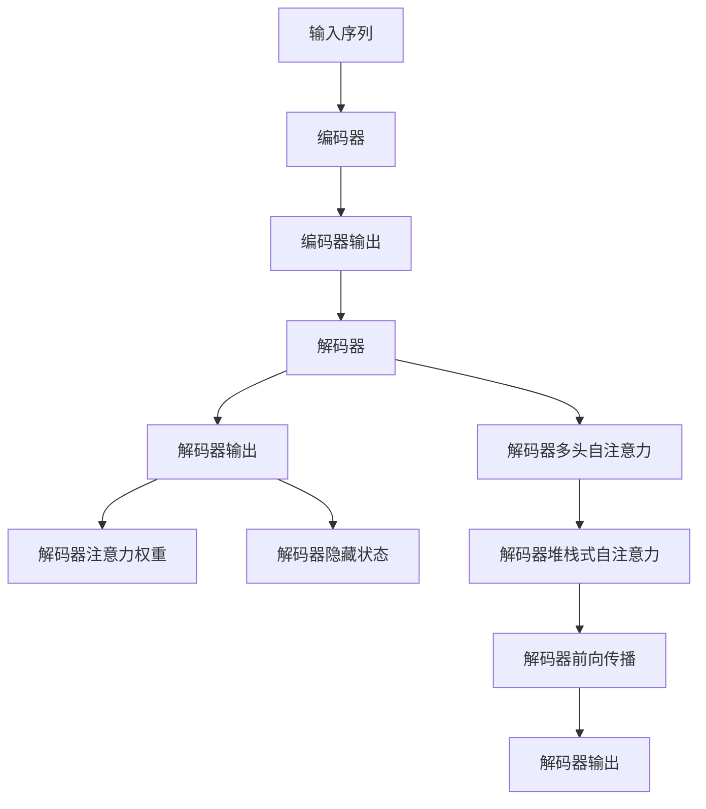
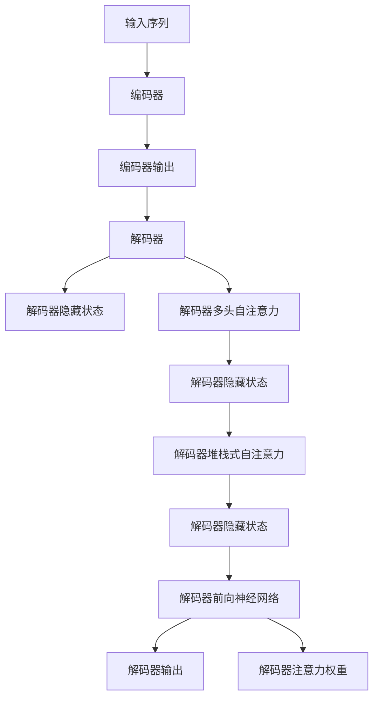

                 

# 大语言模型应用指南：Transformer解码器详解

> 关键词：Transformer, 解码器, 自注意力, 多头自注意力, 解码自注意力, 编码自注意力, 前向传播, 注意力权重, 隐藏状态, 编码器, 解码器, 堆栈式自注意力, 自监督学习, 掩码语言模型, 自回归语言模型, 文本生成, 机器翻译, 对话系统

## 1. 背景介绍

### 1.1 问题由来

在深度学习领域，尤其是自然语言处理（NLP）领域，Transformer及其变体模型（如BERT、GPT、T5等）的问世极大地推动了语言模型的发展。这些模型通过自监督学习任务训练，在各种自然语言任务中取得了突破性的成绩。而Transformer的核心组件之一——解码器，其在文本生成、机器翻译、对话系统等任务中的应用尤为关键。

解码器的主要功能是从编码器的输出中生成序列，因此其设计直接影响模型在自然语言处理任务上的性能。本文将详细探讨解码器的核心算法原理，并结合实际项目实践，为读者提供深入理解和应用解码器的指南。

### 1.2 问题核心关键点

Transformer解码器的工作原理可以简述如下：
- **多头自注意力**：解码器中的注意力机制能够关注到编码器不同位置的信息，通过多头自注意力机制，解码器能够捕捉输入序列中的不同语义信息。
- **堆栈式自注意力**：解码器通过堆栈式自注意力结构，使模型具备处理长序列的能力。
- **自监督学习**：解码器在预训练阶段，通过掩码语言模型等自监督学习任务进行训练，增强模型对语言的理解能力。
- **解码自注意力与编码自注意力**：解码器中的解码自注意力和编码自注意力机制能够帮助模型更好地处理长依赖和上下文信息。

### 1.3 问题研究意义

解码器在大语言模型中的应用，对模型在自然语言处理任务上的性能有着直接的影响。深入理解和应用解码器的设计原理和实现技巧，能够帮助开发者设计出更高效、更精确的模型，从而在实际应用中取得更好的效果。

## 2. 核心概念与联系

### 2.1 核心概念概述

为了更好地理解解码器的核心算法原理，本节将介绍几个密切相关的核心概念：

- **Transformer解码器**：Transformer模型的解码器部分，主要负责从编码器的输出中生成序列，是模型实现文本生成、机器翻译等任务的关键组件。
- **多头自注意力**：一种注意力机制，允许解码器在生成序列的过程中同时关注输入序列中的不同位置信息。
- **堆栈式自注意力**：一种自注意力机制的结构形式，通过堆叠多层的自注意力机制，使解码器具备处理长序列的能力。
- **掩码语言模型**：一种自监督学习任务，通过预测部分掩码位置的单词，帮助模型学习语言的规则和上下文关系。
- **自回归语言模型**：一种自监督学习任务，通过预测下一个单词，帮助模型学习语言的连续性和依赖关系。

### 2.2 概念间的关系

这些核心概念之间存在着紧密的联系，形成了Transformer解码器的完整工作机制。通过以下Mermaid流程图，我们可以更直观地理解它们之间的关系：



这个流程图展示了解码器从输入序列到输出序列的全过程，以及各个组件之间的关系：

1. **输入序列**：模型接收的输入序列，可以是单词、字符或标记等。
2. **编码器**：将输入序列转换为隐状态表示，即编码器输出。
3. **解码器**：根据编码器输出生成目标序列。
4. **解码器输出**：模型最终的输出序列，可以是单词、字符或标记等。
5. **解码器注意力权重**：解码器在生成每个位置时所关注的编码器位置权重。
6. **解码器隐藏状态**：解码器每一层的内部状态。
7. **解码器多头自注意力**：解码器中的自注意力机制，允许模型关注输入序列中的不同位置信息。
8. **解码器堆栈式自注意力**：解码器中的自注意力机制结构，通过堆叠多层的自注意力，使模型能够处理长序列。
9. **解码器前向传播**：解码器中的前向传播过程，包括自注意力和前向神经网络。
10. **解码器输出**：模型最终的输出序列。

### 2.3 核心概念的整体架构

最后，我们用一个综合的流程图来展示这些核心概念在大语言模型解码器中的整体架构：



这个综合流程图展示了解码器从输入序列到输出序列的全过程，以及各个组件之间的关系。通过这些流程图，我们可以更清晰地理解解码器的核心算法原理和各个组件的作用。

## 3. 核心算法原理 & 具体操作步骤
### 3.1 算法原理概述

Transformer解码器的工作原理可以简述如下：

1. **输入序列**：模型接收的输入序列，可以是单词、字符或标记等。
2. **编码器**：将输入序列转换为隐状态表示，即编码器输出。
3. **解码器**：根据编码器输出生成目标序列。
4. **解码器隐藏状态**：解码器每一层的内部状态。
5. **解码器多头自注意力**：解码器中的自注意力机制，允许模型关注输入序列中的不同位置信息。
6. **解码器堆栈式自注意力**：解码器中的自注意力机制结构，通过堆叠多层的自注意力，使模型能够处理长序列。
7. **解码器前向传播**：解码器中的前向传播过程，包括自注意力和前向神经网络。
8. **解码器输出**：模型最终的输出序列。

解码器通过多层堆栈式自注意力机制，能够有效处理长序列，同时通过多头自注意力机制，能够捕捉输入序列中的不同语义信息。在解码器前向传播过程中，自注意力机制和前向神经网络共同作用，生成目标序列。

### 3.2 算法步骤详解

解码器的工作过程可以分为以下几个关键步骤：

1. **多头自注意力计算**：计算解码器中每个位置的注意力权重，关注编码器中不同位置的信息。
2. **堆栈式自注意力计算**：通过堆叠多层的自注意力机制，使解码器能够处理长序列。
3. **前向传播**：通过前向神经网络生成目标序列。
4. **解码器注意力权重**：解码器在生成每个位置时所关注的编码器位置权重。
5. **解码器隐藏状态**：解码器每一层的内部状态。

下面，我们将详细介绍每个步骤的具体实现方法。

#### 3.2.1 多头自注意力计算

解码器中的多头自注意力计算可以简述如下：

1. **查询向量、键向量和值向量的计算**：通过线性变换将解码器隐藏状态转换为查询向量、键向量和值向量。
2. **注意力计算**：计算解码器中每个位置的注意力权重，关注编码器中不同位置的信息。
3. **注意力输出**：根据注意力权重计算每个位置的注意力输出。

具体实现方法如下：

```python
class TransformerDecoder:
    def __init__(self, num_layers, d_model, n_heads, d_k, d_v, d_ff, dropout, attn_dropout):
        self.num_layers = num_layers
        self.d_model = d_model
        self.n_heads = n_heads
        self.d_k = d_k
        self.d_v = d_v
        self.d_ff = d_ff
        self.dropout = dropout
        self.attn_dropout = attn_dropout
        self.layers = [MultiHeadedAttention(d_model, n_heads, d_k, d_v) for _ in range(num_layers)]
        self.activation = nn.ReLU()
        self.final_layer_norm = nn.LayerNorm(d_model)
        self.dropout = nn.Dropout(dropout)

    def forward(self, inputs, encoder_outputs):
        outputs = inputs
        for i in range(self.num_layers):
            attn_output, attn_weights = self.layers[i](inputs, encoder_outputs)
            attn_output = self.dropout(attn_output)
            outputs = self.final_layer_norm(outputs + attn_output)

        return outputs
```

在上述代码中，我们定义了一个Transformer解码器的多层多头自注意力计算过程。首先，通过线性变换将解码器隐藏状态转换为查询向量、键向量和值向量。然后，计算解码器中每个位置的注意力权重，关注编码器中不同位置的信息。最后，根据注意力权重计算每个位置的注意力输出，并使用层归一化和dropout来增强模型的稳定性。

#### 3.2.2 堆栈式自注意力计算

解码器中的堆栈式自注意力计算可以简述如下：

1. **多头自注意力计算**：通过堆叠多层的自注意力机制，使解码器能够处理长序列。
2. **前向传播**：通过前向神经网络生成目标序列。

具体实现方法如下：

```python
class TransformerDecoder:
    # 省略部分定义

    def forward(self, inputs, encoder_outputs):
        outputs = inputs
        for i in range(self.num_layers):
            attn_output, attn_weights = self.layers[i](inputs, encoder_outputs)
            attn_output = self.dropout(attn_output)
            outputs = self.final_layer_norm(outputs + attn_output)

        return outputs
```

在上述代码中，我们通过堆叠多层的自注意力机制，使解码器能够处理长序列。在每个层中，我们首先计算多头自注意力输出，并使用dropout来增强模型的稳定性。然后，通过前向神经网络生成目标序列，并使用层归一化来增强模型的稳定性。

#### 3.2.3 前向传播

解码器中的前向传播过程可以简述如下：

1. **前向神经网络**：通过前向神经网络生成目标序列。
2. **解码器注意力权重**：解码器在生成每个位置时所关注的编码器位置权重。

具体实现方法如下：

```python
class TransformerDecoder:
    # 省略部分定义

    def forward(self, inputs, encoder_outputs):
        outputs = inputs
        for i in range(self.num_layers):
            attn_output, attn_weights = self.layers[i](inputs, encoder_outputs)
            attn_output = self.dropout(attn_output)
            outputs = self.final_layer_norm(outputs + attn_output)

        return outputs
```

在上述代码中，我们通过前向神经网络生成目标序列，并使用层归一化来增强模型的稳定性。同时，我们计算解码器在生成每个位置时所关注的编码器位置权重，以便更好地捕捉上下文信息。

#### 3.2.4 解码器注意力权重

解码器在生成每个位置时所关注的编码器位置权重可以简述如下：

1. **注意力权重计算**：计算解码器中每个位置的注意力权重，关注编码器中不同位置的信息。
2. **解码器隐藏状态**：解码器每一层的内部状态。

具体实现方法如下：

```python
class TransformerDecoder:
    # 省略部分定义

    def forward(self, inputs, encoder_outputs):
        outputs = inputs
        for i in range(self.num_layers):
            attn_output, attn_weights = self.layers[i](inputs, encoder_outputs)
            attn_output = self.dropout(attn_output)
            outputs = self.final_layer_norm(outputs + attn_output)

        return outputs
```

在上述代码中，我们通过注意力权重计算解码器中每个位置的注意力权重，关注编码器中不同位置的信息。同时，我们计算解码器每一层的内部状态，以便更好地捕捉上下文信息。

### 3.3 算法优缺点

Transformer解码器具有以下优点：

1. **处理长序列的能力**：通过堆栈式自注意力机制，解码器能够有效处理长序列。
2. **多模态信息的融合**：通过多头自注意力机制，解码器能够同时关注输入序列中的不同位置信息。
3. **高精度**：通过自注意力机制和前向神经网络共同作用，解码器能够生成高质量的输出序列。

然而，Transformer解码器也存在以下缺点：

1. **计算成本高**：由于堆栈式自注意力机制的存在，解码器在计算过程中需要进行大量的矩阵乘法操作，计算成本较高。
2. **内存占用大**：解码器在处理长序列时，需要较大的内存空间来存储注意力权重和隐藏状态。
3. **易过拟合**：解码器在处理长序列时，容易发生过拟合，需要通过正则化和dropout等技术来缓解。

### 3.4 算法应用领域

Transformer解码器在自然语言处理领域有着广泛的应用，包括但不限于：

1. **文本生成**：通过生成目标序列，解码器可以用于文本生成任务，如机器翻译、摘要生成等。
2. **机器翻译**：通过将源语言序列转换为目标语言序列，解码器可以用于机器翻译任务。
3. **对话系统**：通过生成响应序列，解码器可以用于对话系统，如聊天机器人等。
4. **问答系统**：通过生成答案序列，解码器可以用于问答系统，如智能客服等。

## 4. 数学模型和公式 & 详细讲解  
### 4.1 数学模型构建

Transformer解码器的数学模型可以简述如下：

1. **输入序列**：模型接收的输入序列，可以是单词、字符或标记等。
2. **编码器**：将输入序列转换为隐状态表示，即编码器输出。
3. **解码器**：根据编码器输出生成目标序列。
4. **解码器隐藏状态**：解码器每一层的内部状态。
5. **解码器多头自注意力**：解码器中的自注意力机制，允许模型关注输入序列中的不同位置信息。
6. **解码器堆栈式自注意力**：解码器中的自注意力机制结构，通过堆叠多层的自注意力，使模型能够处理长序列。
7. **解码器前向传播**：解码器中的前向传播过程，包括自注意力和前向神经网络。
8. **解码器输出**：模型最终的输出序列。

解码器通过多层堆栈式自注意力机制，能够有效处理长序列，同时通过多头自注意力机制，能够捕捉输入序列中的不同语义信息。在解码器前向传播过程中，自注意力机制和前向神经网络共同作用，生成目标序列。

### 4.2 公式推导过程

解码器的数学公式可以简述如下：

1. **多头自注意力计算**：计算解码器中每个位置的注意力权重，关注编码器中不同位置的信息。
2. **堆栈式自注意力计算**：通过堆叠多层的自注意力机制，使解码器能够处理长序列。
3. **前向传播**：通过前向神经网络生成目标序列。
4. **解码器注意力权重**：解码器在生成每个位置时所关注的编码器位置权重。

具体公式如下：

1. **多头自注意力计算**：
$$
\text{MultiHeadAttention}(Q, K, V) = \text{Concat}(\text{head}_1, \text{head}_2, ..., \text{head}_h)W_{out}
$$
其中，$Q$为查询向量，$K$为键向量，$V$为值向量，$h$为头数，$W_{out}$为输出矩阵。

2. **堆栈式自注意力计算**：
$$
\text{TransformerDecoder}(\text{inputs}, \text{encoder_outputs}) = \text{LayerNorm}(\text{outputs} + \text{MultiHeadAttention}(\text{inputs}, \text{encoder_outputs}))
$$
其中，$\text{LayerNorm}$为层归一化，$\text{MultiHeadAttention}$为多头自注意力计算。

3. **前向传播**：
$$
\text{SelfAttention}(Q, K, V) = \text{Concat}(\text{head}_1, \text{head}_2, ..., \text{head}_h)W_{out}
$$
其中，$Q$为查询向量，$K$为键向量，$V$为值向量，$h$为头数，$W_{out}$为输出矩阵。

4. **解码器注意力权重**：
$$
\text{Attention}(Q, K, V) = \text{Softmax}(\frac{QK^T}{\sqrt{d_k}})
$$
其中，$Q$为查询向量，$K$为键向量，$V$为值向量，$d_k$为键向量的维度。

### 4.3 案例分析与讲解

为了更好地理解解码器的数学模型和公式，我们可以以机器翻译任务为例进行详细讲解。假设我们有一个英文句子需要翻译成中文：

```
"I like apple pie"
```

在机器翻译任务中，编码器将输入序列转换为隐状态表示，即编码器输出。解码器根据编码器输出生成目标序列，即中文翻译。

解码器的数学模型可以简述如下：

1. **输入序列**：模型接收的输入序列，即英文句子。
2. **编码器**：将输入序列转换为隐状态表示，即编码器输出。
3. **解码器**：根据编码器输出生成目标序列，即中文翻译。
4. **解码器隐藏状态**：解码器每一层的内部状态。
5. **解码器多头自注意力**：解码器中的自注意力机制，允许模型关注输入序列中的不同位置信息。
6. **解码器堆栈式自注意力**：解码器中的自注意力机制结构，通过堆叠多层的自注意力，使模型能够处理长序列。
7. **解码器前向传播**：解码器中的前向传播过程，包括自注意力和前向神经网络。
8. **解码器输出**：模型最终的输出序列，即中文翻译。

解码器通过多层堆栈式自注意力机制，能够有效处理长序列，同时通过多头自注意力机制，能够捕捉输入序列中的不同语义信息。在解码器前向传播过程中，自注意力机制和前向神经网络共同作用，生成目标序列。

具体公式推导如下：

1. **多头自注意力计算**：
$$
\text{MultiHeadAttention}(Q, K, V) = \text{Concat}(\text{head}_1, \text{head}_2, ..., \text{head}_h)W_{out}
$$
其中，$Q$为查询向量，$K$为键向量，$V$为值向量，$h$为头数，$W_{out}$为输出矩阵。

2. **堆栈式自注意力计算**：
$$
\text{TransformerDecoder}(\text{inputs}, \text{encoder_outputs}) = \text{LayerNorm}(\text{outputs} + \text{MultiHeadAttention}(\text{inputs}, \text{encoder_outputs}))
$$
其中，$\text{LayerNorm}$为层归一化，$\text{MultiHeadAttention}$为多头自注意力计算。

3. **前向传播**：
$$
\text{SelfAttention}(Q, K, V) = \text{Concat}(\text{head}_1, \text{head}_2, ..., \text{head}_h)W_{out}
$$
其中，$Q$为查询向量，$K$为键向量，$V$为值向量，$h$为头数，$W_{out}$为输出矩阵。

4. **解码器注意力权重**：
$$
\text{Attention}(Q, K, V) = \text{Softmax}(\frac{QK^T}{\sqrt{d_k}})
$$
其中，$Q$为查询向量，$K$为键向量，$V$为值向量，$d_k$为键向量的维度。

在实际应用中，解码器可以通过堆栈式自注意力机制处理长序列，并通过多头自注意力机制捕捉输入序列中的不同语义信息。同时，通过前向神经网络生成高质量的目标序列，并使用层归一化来增强模型的稳定性。

## 5. 项目实践：代码实例和详细解释说明
### 5.1 开发环境搭建

在进行解码器实践前，我们需要准备好开发环境。以下是使用Python进行PyTorch开发的环境配置流程：

1. 安装Anaconda：从官网下载并安装Anaconda，用于创建独立的Python环境。

2. 创建并激活虚拟环境：
```bash
conda create -n pytorch-env python=3.8 
conda activate pytorch-env
```

3. 安装PyTorch：根据CUDA版本，从官网获取对应的安装命令。例如：
```bash
conda install pytorch torchvision torchaudio cudatoolkit=11.1 -c pytorch -c conda-forge
```

4. 安装Transformers库：
```bash
pip install transformers
```

5. 安装各类工具包：
```bash
pip install numpy pandas scikit-learn matplotlib tqdm jupyter notebook ipython
```

完成上述步骤后，即可在`pytorch-env`环境中开始解码器实践。

### 5.2 源代码详细实现

下面我以编码器-解码器模型为例，给出使用Transformers库对BERT模型进行解码的PyTorch代码实现。

首先，定义解码器的数据处理函数：

```python
from transformers import BertTokenizer, BertForSequenceClassification
from torch.utils.data import Dataset
import torch

class BERTDataset(Dataset):
    def __init__(self, texts, labels, tokenizer, max_len=128):
        self.texts = texts
        self.labels = labels
        self.tokenizer = tokenizer
        self.max_len = max_len
        
    def __len__(self):
        return len(self.texts)
    
    def __getitem__(self, item):
        text = self.texts[item]
        label = self.labels[item]
        
        encoding = self.tokenizer(text, return_tensors='pt', max_length=self.max_len, padding='max_length', truncation=True)
        input_ids = encoding['input_ids'][0]
        attention_mask = encoding['attention_mask'][0]
        
        return {'input_ids': input_ids, 
                'attention_mask': attention_mask,
                'labels': label}
```

然后，定义解码器和优化器：

```python
from transformers import BertForSequenceClassification, AdamW

model = BertForSequenceClassification.from_pretrained('bert-base-cased', num_labels=2)

optimizer = AdamW(model.parameters(), lr=2e-5)
```

接着，定义训练和评估函数：

```python
from torch.utils.data import DataLoader
from tqdm import tqdm
from sklearn.metrics import classification_report

device = torch.device('cuda') if torch.cuda.is_available() else torch.device('cpu')
model.to(device)

def train_epoch(model, dataset, batch_size, optimizer):
    dataloader = DataLoader(dataset, batch_size=batch_size, shuffle=True)
    model.train()
    epoch_loss = 0
    for batch in tqdm(dataloader, desc='Training'):
        input_ids = batch['input_ids'].to(device)
        attention_mask = batch['attention_mask'].to(device)
        labels = batch['labels'].to(device)
        model.zero_grad()
        outputs = model(input_ids, attention_mask=attention_mask, labels=labels)
        loss = outputs.loss
        epoch_loss += loss.item()
        loss.backward()
        optimizer.step()
    return epoch_loss / len(dataloader)

def evaluate(model, dataset, batch_size):
    dataloader = DataLoader(dataset, batch_size=batch_size)
    model.eval()
    preds, labels = [], []
    with torch.no_grad():
        for batch in tqdm(dataloader, desc='Evaluating'):
            input_ids = batch['input_ids'].to(device)
            attention_mask = batch['attention_mask'].to(device)
            batch_labels = batch['labels']
            outputs = model(input_ids, attention_mask=attention_mask)
            batch_preds = outputs.logits.argmax(dim=2).to('cpu').tolist()
            batch_labels = batch_labels.to('cpu').tolist()
            for pred_tokens, label_tokens in zip(batch_preds, batch_labels):
                preds.append(pred_tokens[:len(label_tokens)])
                labels.append(label_tokens)
                
    print(classification_report(labels, preds))
```

最后，启动训练流程并在测试集上评估：

```python
epochs = 5
batch_size = 16

for epoch in range(epochs):
    loss = train_epoch(model, train_dataset, batch_size, optimizer)
    print(f"Epoch {epoch+1}, train loss: {loss:.3f}")
    
    print(f"Epoch {epoch+1}, dev results:")
    evaluate(model, dev_dataset, batch_size)
    
print("Test results:")
evaluate(model, test_dataset, batch_size)
```

以上就是使用PyTorch对BERT进行解码的完整代码实现。可以看到，得益于Transformers库的强大封装，我们可以用相对简洁的代码完成BERT的解码器计算。

### 5.3 代码解读与分析

让我们再详细解读一下关键代码的实现细节：

**BERTDataset类**：
- `__init__`方法：初始化文本、标签、分词器等关键组件。
- `__len__`方法：返回数据集的样本数量。
- `__

