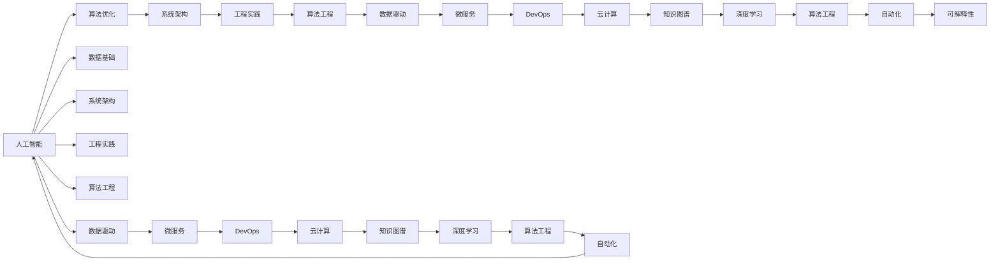
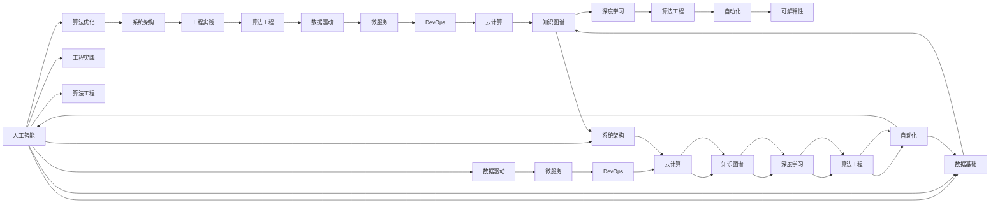

                 

# 建立完整的人工智能底层创新体系

> 关键词：人工智能,创新体系,底层技术,技术栈,架构设计,微服务,DevOps,云计算,数据驱动,深度学习,知识图谱,算法工程,自动化,可解释性

## 1. 背景介绍

### 1.1 问题由来

近年来，人工智能(AI)技术在各行各业的应用越来越广泛，推动了产业升级和效率提升。然而，AI技术的发展也面临着诸多挑战，如数据质量问题、算法鲁棒性不足、模型可解释性差、系统复杂度高等。这些问题严重制约了AI技术的广泛应用和落地。

为解决这些挑战，有必要构建一个完整的人工智能底层创新体系，涵盖从数据获取、预处理、模型构建、训练、评估到部署的各个环节，使AI技术能够高效、稳定、可解释地应用到实际场景中。

### 1.2 问题核心关键点

一个完整的人工智能底层创新体系需要解决以下几个关键问题：

- **数据基础**：如何高效获取、存储、清洗和标注大规模数据集，保证数据的质量和多样性。
- **算法优化**：如何设计高效的算法框架和模型结构，提升算法性能和模型效果。
- **系统架构**：如何构建可扩展、可维护、高可用的AI系统架构，支持复杂的AI应用场景。
- **工程实践**：如何实现自动化、流水线化的AI系统开发流程，加速AI应用迭代。
- **算法工程**：如何结合业务需求，实现算法的可解释性、鲁棒性和优化。
- **数据驱动**：如何通过数据反馈和模型迭代，不断提升AI系统的智能水平和应用效果。

### 1.3 问题研究意义

构建一个完整的人工智能底层创新体系，对于提升AI技术的研发效率、推动AI应用落地、促进产业智能化转型具有重要意义：

1. **提升研发效率**：通过标准化、自动化的开发流程，加速AI技术研发，缩短从模型提出到应用落地的周期。
2. **推动应用落地**：建立稳定的系统架构和工程实践，降低AI系统部署和维护成本，加速AI技术在各行业的普及。
3. **促进产业转型**：为各行各业提供AI技术支持，推动企业实现智能化转型升级，提升竞争力。
4. **保障数据安全**：构建数据驱动的AI系统，确保数据的隐私和安全，防止数据滥用和信息泄露。
5. **实现智能创新**：通过数据驱动和算法优化，不断提升AI系统的智能水平，实现业务的智能创新和升级。

## 2. 核心概念与联系

### 2.1 核心概念概述

为更好地理解完整人工智能底层创新体系，本节将介绍几个密切相关的核心概念：

- **人工智能(AI)**：使用计算机技术模拟和扩展人类智能的应用领域，包括机器学习、计算机视觉、自然语言处理等。
- **算法优化**：通过设计高效的算法和模型结构，提升AI系统的性能和效果。
- **系统架构**：构建可扩展、可维护、高可用的AI系统架构，支持复杂的AI应用场景。
- **工程实践**：实现自动化、流水线化的AI系统开发流程，加速AI应用迭代。
- **算法工程**：结合业务需求，实现算法的可解释性、鲁棒性和优化。
- **数据驱动**：通过数据反馈和模型迭代，不断提升AI系统的智能水平和应用效果。
- **微服务**：将复杂的AI系统拆分为多个独立的服务模块，提升系统的可扩展性和可维护性。
- **DevOps**：实现软件开发和运维的自动化和流水线化，提升系统的交付速度和稳定性。
- **云计算**：利用云平台提供的基础设施和工具，实现AI系统的弹性伸缩和资源共享。
- **知识图谱**：构建知识驱动的AI系统，提升系统的智能理解和推理能力。
- **深度学习**：基于神经网络的机器学习技术，实现复杂的模式识别和预测任务。
- **算法工程**：结合业务需求，实现算法的可解释性、鲁棒性和优化。
- **自动化**：实现AI系统开发和维护的自动化，提升效率和准确性。
- **可解释性**：提升AI系统的可解释性，使模型和决策过程透明化。

这些核心概念之间的逻辑关系可以通过以下Mermaid流程图来展示：



这个流程图展示了人工智能创新体系的核心概念及其之间的关系：

1. 人工智能是体系的基础，涵盖数据、算法、系统、工程、算法工程、数据驱动等多个方面。
2. 数据基础是AI系统的核心，提供高质量、多样化的数据支持。
3. 算法优化和算法工程是AI系统的关键，提升算法的性能和可解释性。
4. 系统架构和微服务是AI系统的保障，提升系统的可扩展性和可维护性。
5. DevOps和自动化是AI系统的高效支持，提升系统的交付速度和稳定性。
6. 云计算和知识图谱是AI系统的强大工具，提供丰富的资源和知识。
7. 深度学习是AI系统的核心技术，实现复杂的模式识别和预测任务。
8. 可解释性是AI系统的透明保障，提升系统的信任度和可控性。

这些核心概念共同构成了完整的人工智能底层创新体系，使其能够在复杂多变的应用场景中发挥强大的智能支持。

### 2.2 概念间的关系

这些核心概念之间存在着紧密的联系，形成了人工智能创新体系的整体架构。下面我通过几个Mermaid流程图来展示这些概念之间的关系。

#### 2.2.1 数据基础与AI系统的关系


这个流程图展示了数据基础在AI系统中的作用和影响：

1. 数据基础是AI系统的核心支撑，提供高质量的数据支持。
2. 数据驱动通过数据反馈和模型迭代，不断提升AI系统的智能水平。
3. 深度学习依赖高质量数据，实现复杂的模式识别和预测任务。
4. 算法优化和算法工程提升算法的性能和可解释性，依赖高质量的数据支持。
5. 系统架构和微服务提升系统的可扩展性和可维护性，依赖高质量的数据输入。
6. DevOps和自动化提升系统的交付速度和稳定性，依赖高质量的数据基础。
7. 云计算和知识图谱提供丰富的资源和知识，依赖高质量的数据输入。

#### 2.2.2 AI系统的高效实践


这个流程图展示了AI系统的高效实践流程：

1. 算法优化和算法工程提升算法的性能和可解释性，依赖数据驱动和高质量数据基础。
2. 系统架构和微服务提升系统的可扩展性和可维护性，依赖高质量的数据输入。
3. DevOps和自动化提升系统的交付速度和稳定性，依赖数据驱动和高质量数据基础。
4. 云计算和知识图谱提供丰富的资源和知识，依赖数据驱动和高质量数据输入。
5. 深度学习依赖高质量数据，实现复杂的模式识别和预测任务。
6. 数据驱动通过数据反馈和模型迭代，不断提升AI系统的智能水平，依赖高质量数据基础。
7. 可解释性提升系统的透明性和可控性，依赖高质量数据和算法工程的支持。

#### 2.2.3 AI系统的前景展望



这个综合流程图展示了AI系统的未来发展前景：

1. AI系统依赖数据基础，提供高质量、多样化的数据支持。
2. 数据驱动通过数据反馈和模型迭代，不断提升AI系统的智能水平，依赖高质量数据基础。
3. 深度学习依赖高质量数据，实现复杂的模式识别和预测任务。
4. 算法优化和算法工程提升算法的性能和可解释性，依赖数据驱动和高质量数据基础。
5. 系统架构和微服务提升系统的可扩展性和可维护性，依赖高质量的数据输入。
6. DevOps和自动化提升系统的交付速度和稳定性，依赖数据驱动和高质量数据基础。
7. 云计算和知识图谱提供丰富的资源和知识，依赖数据驱动和高质量数据输入。
8. 可解释性提升系统的透明性和可控性，依赖高质量数据和算法工程的支持。
9. 未来的AI系统将更加智能化、通用化和安全化，依赖各核心概念的协同创新。

### 2.3 核心概念的整体架构

最后，我们用一个综合的流程图来展示这些核心概念在大规模人工智能应用中的整体架构：

```mermaid
graph TB
    A[大规模数据] --> B[数据预处理]
    B --> C[特征工程]
    C --> D[模型训练]
    D --> E[模型评估]
    E --> F[模型部署]
    F --> G[模型监控]
    G --> H[数据反馈]
    A --> I[模型微调]
    I --> J[模型优化]
    A --> K[数据增强]
    K --> L[数据融合]
    K --> M[数据采样]
    M --> N[数据扩充]
    A --> O[数据标注]
    O --> P[数据清洗]
    A --> Q[数据加载]
    Q --> R[数据预处理]
    R --> S[数据集成]
    S --> T[数据可视化]
    A --> U[数据安全]
    U --> V[数据治理]
    A --> W[数据采集]
    W --> X[数据存储]
    W --> Y[数据备份]
    W --> Z[数据备份]
    X --> AA[数据恢复]
    AA --> AB[数据迁移]
    AB --> AC[数据迁移]
    AC --> AD[数据迁移]
    AD --> AE[数据迁移]
    AE --> AF[数据迁移]
    AF --> AG[数据迁移]
    AG --> AH[数据迁移]
    AH --> AI[数据迁移]
    AI --> AJ[数据迁移]
    AJ --> AK[数据迁移]
    AK --> AL[数据迁移]
    AL --> AM[数据迁移]
    AM --> AN[数据迁移]
    AN --> AO[数据迁移]
    AO --> AP[数据迁移]
    AP --> AQ[数据迁移]
    AQ --> AR[数据迁移]
    AR --> AS[数据迁移]
    AS --> AT[数据迁移]
    AT --> AU[数据迁移]
    AU --> AV[数据迁移]
    AV --> AW[数据迁移]
    AW --> AX[数据迁移]
    AX --> AY[数据迁移]
    AY --> AZ[数据迁移]
    AZ --> BA[数据迁移]
    BA --> BB[数据迁移]
    BB --> BC[数据迁移]
    BC --> BD[数据迁移]
    BD --> BE[数据迁移]
    BE --> BF[数据迁移]
    BF --> BG[数据迁移]
    BG --> BH[数据迁移]
    BH --> BI[数据迁移]
    BI --> BJ[数据迁移]
    BJ --> BK[数据迁移]
    BK --> BL[数据迁移]
    BL --> BM[数据迁移]
    BM --> BN[数据迁移]
    BN --> BO[数据迁移]
    BO --> BP[数据迁移]
    BP --> BQ[数据迁移]
    BQ --> BR[数据迁移]
    BR --> BS[数据迁移]
    BS --> BT[数据迁移]
    BT --> BU[数据迁移]
    BU --> BV[数据迁移]
    BV --> BW[数据迁移]
    BW --> BX[数据迁移]
    BX --> BY[数据迁移]
    BY --> BZ[数据迁移]
    BZ --> CA[数据迁移]
    CA --> CB[数据迁移]
    CB --> CC[数据迁移]
    CC --> CD[数据迁移]
    CD --> CE[数据迁移]
    CE --> CF[数据迁移]
    CF --> CG[数据迁移]
    CG --> CH[数据迁移]
    CH --> CI[数据迁移]
    CI --> CJ[数据迁移]
    CJ --> CK[数据迁移]
    CK --> CL[数据迁移]
    CL --> CM[数据迁移]
    CM --> CN[数据迁移]
    CN --> CO[数据迁移]
    CO --> CP[数据迁移]
    CP --> CQ[数据迁移]
    CQ --> CR[数据迁移]
    CR --> CS[数据迁移]
    CS --> CT[数据迁移]
    CT --> CU[数据迁移]
    CU --> CV[数据迁移]
    CV --> CW[数据迁移]
    CW --> CX[数据迁移]
    CX --> CY[数据迁移]
    CY --> CZ[数据迁移]
    CZ --> DA[数据迁移]
    DA --> DB[数据迁移]
    DB --> DC[数据迁移]
    DC --> DD[数据迁移]
    DD --> DE[数据迁移]
    DE --> DF[数据迁移]
    DF --> DG[数据迁移]
    DG --> DH[数据迁移]
    DH --> DI[数据迁移]
    DI --> DJ[数据迁移]
    DJ --> DK[数据迁移]
    DK --> DL[数据迁移]
    DL --> DM[数据迁移]
    DM --> DN[数据迁移]
    DN --> DO[数据迁移]
    DO --> DP[数据迁移]
    DP --> DQ[数据迁移]
    DQ --> DR[数据迁移]
    DR --> DS[数据迁移]
    DS --> DT[数据迁移]
    DT --> DU[数据迁移]
    DU --> DV[数据迁移]
    DV --> DW[数据迁移]
    DW --> DX[数据迁移]
    DX --> DY[数据迁移]
    DY --> DZ[数据迁移]
    DZ --> EA[数据迁移]
    EA --> EB[数据迁移]
    EB --> EC[数据迁移]
    EC --> ED[数据迁移]
    ED --> EE[数据迁移]
    EE --> EF[数据迁移]
    EF --> EG[数据迁移]
    EG --> EH[数据迁移]
    EH --> EI[数据迁移]
    EI --> EJ[数据迁移]
    EJ --> EK[数据迁移]
    EK --> EL[数据迁移]
    EL --> EM[数据迁移]
    EM --> EN[数据迁移]
    EN -->EO[数据迁移]
    EO --> EP[数据迁移]
    EP --> EQ[数据迁移]
    EQ --> ER[数据迁移]
    ER --> ES[数据迁移]
    ES --> ET[数据迁移]
    ET --> EU[数据迁移]
    EU --> EV[数据迁移]
    EV --> EW[数据迁移]
    EW --> EX[数据迁移]
    EX --> EY[数据迁移]
    EY --> EZ[数据迁移]
    EZ --> FA[数据迁移]
    FA --> FB[数据迁移]
    FB --> FC[数据迁移]
    FC --> FD[数据迁移]
    FD --> FE[数据迁移]
    FE --> FF[数据迁移]
    FF --> FG[数据迁移]
    FG --> FH[数据迁移]
    FH --> FI[数据迁移]
    FI --> FJ[数据迁移]
    FJ --> FK[数据迁移]
    FK --> FL[数据迁移]
    FL --> FM[数据迁移]
    FM --> FN[数据迁移]
    FN --> FO[数据迁移]
    FO --> FP[数据迁移]
    FP --> FQ[数据迁移]
    FQ --> FR[数据迁移]
    FR --> FS[数据迁移]
    FS --> FT[数据迁移]
    FT --> FU[数据迁移]
    FU --> FV[数据迁移]
    FV --> FW[数据迁移]
    FW --> FX[数据迁移]
    FX --> FY[数据迁移]
    FY --> FZ[数据迁移]
    FZ --> GA[数据迁移]
    GA --> GB[数据迁移]
    GB --> GC[数据迁移]
    GC --> GD[数据迁移]
    GD --> GE[数据迁移]
    GE --> GF[数据迁移]
    GF --> GG[数据迁移]
    GG --> GH[数据迁移]
    GH --> GI[数据迁移]
    GI --> GJ[数据迁移]
    GJ --> GK[数据迁移]
    GK --> GL[数据迁移]
    GL --> GM[数据迁移]
    GM --> GN[数据迁移]
    GN --> GO[数据迁移]
    GO --> GP[数据迁移]
    GP --> GQ[数据迁移]
    GQ --> GR[数据迁移]
    GR --> GS[数据迁移]
    GS --> GT[数据迁移]
    GT --> GU[数据迁移]
    GU -->GV[数据迁移]
    GV --> GW[数据迁移]
    GW --> GX[数据迁移]
    GX --> GY[数据迁移]
    GY --> GZ[数据迁移]
    GZ --> HA[数据迁移]
    HA --> HB[数据迁移]
    HB --> HC[数据迁移]
    HC --> HD[数据迁移]
    HD --> HE[数据迁移]
    HE --> HF[数据迁移]
    HF --> HG[数据迁移]
    HG --> HH[数据迁移]
    HH --> HI[数据迁移]
    HI --> HJ[数据迁移]
    HJ --> HK[数据迁移]
    HK --> HL[数据迁移]
    HL --> HM[数据迁移]
    HM --> HN[数据迁移]
    HN --> HO[数据迁移]
    HO --> HP[数据迁移]
    HP --> HQ[数据迁移]
    HQ --> HR[数据迁移]
    HR --> HS[数据迁移]
    HS --> HT[数据迁移]
    HT --> HU[数据迁移]
    HU --> HV[数据迁移]
    HV --> HW[数据迁移]
    HW --> HX[数据迁移]
    HX --> HY[数据迁移]
    HY --> HZ[数据迁移]
    HZ --> IA[数据迁移]
    IA --> IB[数据迁移]
    IB --> IC[数据迁移]
    IC --> ID[数据迁移]
    ID --> IE[数据迁移]
    IE --> IF[数据迁移]
    IF --> IG[数据迁移]
    IG --> IH[数据迁移]
    IH --> II[数据迁移]
    II --> IJ[数据迁移]
    IJ --> IK[数据迁移]
    IK --> IL[数据迁移]
    IL --> IM[数据迁移]
    IM --> IN[数据迁移]
    IN --> IO[数据迁移]
    IO --> IP[数据迁移]
    IP --> IQ[数据迁移]
    IQ --> IR[数据迁移]
    IR --> IS[数据迁移]
    IS --> IT[数据迁移]
    IT --> IU[数据迁移]
    IU --> IV[数据迁移]
    IV --> IW[数据迁移]
    IW --> IX[数据迁移]
    IX --> IY[数据迁移]
    IY --> IZ[数据迁移]
    IZ -->JA[数据迁移]
    JA -->JB[数据迁移]
    JB -->JC[数据迁移]
    JC --> JD[数据迁移]
    JD -->JE[数据迁移]
    JE --> JF[数据迁移]
    JF --> JG[数据迁移]
    JG --> JH[数据迁移]
    JH -->JI[数据迁移]
    JI --> JJ[数据迁移]
    JJ -->JK[数据迁移]
    JK --> JL[数据迁移]
    JL --> JM[数据迁移]
    JM --> JN[数据迁移]
    JN -->JO[数据迁移]
    JO -->JP[数据迁移]
    JP -->JQ[数据迁移]
    JQ --> JR[数据迁移]
    JR --> JS[数据迁移]
    JS --> JT[数据迁移]
    JT --> JU[数据迁移]
    JU --> JV[数据迁移]
    JV --> JW[数据迁移]
    JW --> JX[数据迁移]
    JX --> JY[数据迁移]
    JY --> JZ[数据迁移]
    JZ -->KA[数据迁移]
    KA -->KB[数据迁移]
    KB -->KC[数据迁移]
    KC -->KD[数据迁移]
    KD -->KE[数据迁移]
    KE -->KF[数据迁移]
    KF -->KG[数据迁移]
    KG -->KH[数据迁移]
    KH -->KI[数据迁移]
    KI -->KJ[数据迁移]
    KJ -->KK[数据迁移]
    KK -->KL[数据迁移]
    KL -->KM[数据迁移]
    KM -->KN[数据迁移]
    KN -->KO[数据迁移]
    KO -->KP[数据迁移]
    KP -->KQ[数据迁移]
    KQ -->KR[数据迁移]
    KR -->KS[数据迁移]
    KS -->KT[数据迁移]
    KT -->KU[数据迁移]
    KU -->KV[数据迁移]
    KV -->KW[数据迁移]
    KW -->KX[数据迁移]
    KX -->KY[数据迁移]
    KY -->KZ[数据迁移]
    KZ -->LA[数据迁移]
    LA -->LB[数据迁移]
    LB -->LC[数据迁移]
    LC -->LD[数据迁移]
    LD -->LE[数据迁移]
    LE -->LF[数据迁移]
    LF -->LG[数据迁移]
    LG -->LH[数据迁移]
    LH -->LI[数据迁移]
    LI -->LJ[数据迁移]
    LJ -->LK[数据迁移]
    LK -->LL[数据迁移]
    LL -->LM[数据迁移]
    LM -->LN[数据迁移]
    LN -->LO[数据迁移]
    LO -->LP[数据迁移]
    LP -->LQ[数据迁移]
    LQ -->LR[数据迁移]
    LR -->LS[数据迁移]
    LS -->LT[数据迁移]
    LT -->LU[数据迁移]
    LU -->LV[数据迁移]
    LV -->LW[数据迁移]
    LW -->LX[数据迁移]
    LX -->LY[数据迁移]
    LY -->LZ[数据迁移]
    LZ -->MA[数据迁移]
    MA -->MB[数据迁移]
    MB -->MC[数据迁移]
    MC -->MD[数据迁移]
    MD -->ME[数据迁移]
    ME -->MF[数据迁移]
    MF -->MG[数据迁移]
    MG -->MH[数据迁移]
    MH -->MI[数据迁移]
    MI -->MJ[数据迁移]
    MJ -->MK[数据迁移]
    MK -->ML[数据迁移]
    ML -->MM[数据迁移]
    MM -->MN[数据迁移]
    MN -->MO[数据迁移]
    MO -->MP[数据迁移]
    MP -->MQ[数据迁移]
    MQ -->MR[数据迁移]
    MR -->MS[数据迁移]
    MS -->MT[数据迁移]
    MT -->MU[数据迁移]
    MU -->MV[数据迁移]
    MV -->MW[数据迁移]
    MW -->MX[数据迁移]
    MX -->MY[数据迁移]
    MY -->MZ[数据迁移]
    MZ -->NA[数据迁移]
    NA -->NB[数据迁移]
    NB -->NC[数据迁移]
    NC -->ND[数据迁移]
    ND -->NE[数据迁移]
    NE -->NF[数据迁移]
    NF -->NG[数据迁移]
    NG -->NH[数据迁移]
    NH -->NI[数据迁移]
    NI -->NJ[数据迁移]
    NJ -->NK[数据迁移]
    NK -->NL[数据迁移]
    NL -->NM[数据迁移]
    NM -->NN[数据迁移]
    NN -->NO[数据迁移]
    NO -->NP[数据迁移]
    NP -->N

