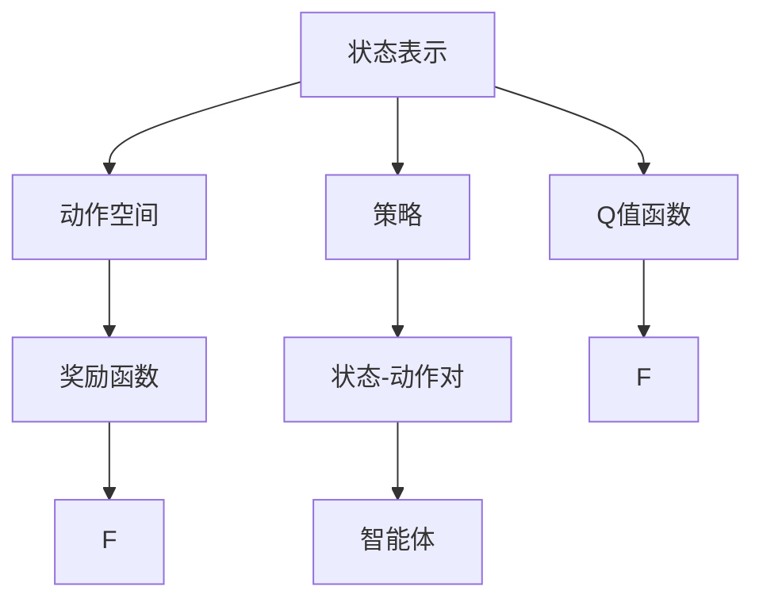

                 

## 1. 背景介绍

### 1.1 问题由来
强化学习（Reinforcement Learning, RL）是一种基于试错的学习方法，通过智能体（Agent）在与环境的交互中，不断调整其行为策略，以最大化累积奖励（Cumulative Reward）来达到最优决策。强化学习广泛应用于游戏、机器人控制、推荐系统、自动驾驶等众多领域，并在近年来取得了突破性的进展。

强化学习的基本框架是由智能体、状态空间、动作空间、奖励函数和环境构成。其中，状态-动作对（State-Action Pair）的选择是强化学习过程中的核心问题。良好的状态-动作对可以显著提高智能体的学习效率和决策质量。

### 1.2 问题核心关键点
状态-动作对的选择主要涉及以下几个关键点：
1. **状态表示（State Representation）**：如何有效编码环境的状态，使智能体能够理解和利用环境信息。
2. **动作空间（Action Space）**：智能体可以采取的所有行动，包括离散动作和连续动作。
3. **奖励函数（Reward Function）**：定义智能体在每个状态采取动作后获得的奖励，是评价动作好坏的标准。
4. **探索与利用（Exploration vs Exploitation）**：在未知环境下，智能体如何平衡探索新动作和利用已有知识以获得最大奖励。
5. **状态-动作对的选择策略**：如何选择状态-动作对，以最大化累积奖励。

### 1.3 问题研究意义
状态-动作对的选择是强化学习中的核心问题，其解决的好坏直接影响着智能体的学习效率和最终决策质量。良好的状态-动作对选择策略，不仅能够提升智能体的学习速度，还能避免陷入局部最优解，确保智能体在复杂环境中的稳定表现。因此，研究状态-动作对的选择策略，对于强化学习的优化和应用具有重要意义。

## 2. 核心概念与联系

### 2.1 核心概念概述

为了更好地理解状态-动作对的选择问题，我们首先介绍一些核心概念：

- **状态表示（State Representation）**：将环境状态编码为智能体可以理解的形式，通常使用特征向量或嵌入向量进行表示。
- **动作空间（Action Space）**：智能体在每个状态下可以选择的所有动作，如离散动作、连续动作、混合动作等。
- **奖励函数（Reward Function）**：定义智能体在每个状态下采取动作后获得的奖励，奖励函数直接影响智能体的学习过程和决策。
- **Q值函数（Q-value Function）**：预测在给定状态下采取特定动作后所能获得的期望累积奖励。
- **策略（Policy）**：智能体在每个状态下选择动作的策略，通常表示为策略函数或策略网络。

这些概念构成了强化学习中的核心框架，而状态-动作对的选择则是连接智能体与环境的桥梁。

### 2.2 概念间的关系

这些核心概念之间存在紧密的联系，如图示所示：



在这个流程图中，智能体（Agent）通过状态表示和动作空间，选择状态-动作对，并根据奖励函数和Q值函数更新策略，从而最大化累积奖励。状态-动作对的选择是这一过程的关键环节。

## 3. 核心算法原理 & 具体操作步骤
### 3.1 算法原理概述

状态-动作对的选择问题，本质上是通过策略函数（Policy Function）映射状态（State）到动作（Action）的过程。这一过程的目标是最大化累积奖励（Cumulative Reward）。

在强化学习中，状态-动作对的选择策略通常有两大类：基于值的方法（Value-Based Methods）和基于策略的方法（Policy-Based Methods）。基于值的方法通过估计Q值函数（Q-value Function）来指导状态-动作对的选择，而基于策略的方法则直接通过策略函数（Policy Function）进行选择。

### 3.2 算法步骤详解

以Q值函数为基础的状态-动作对选择过程，通常包括以下步骤：

1. **初始化**：定义状态表示、动作空间和奖励函数，初始化Q值函数。
2. **策略定义**：选择策略函数，如ε-greedy策略，用于在每个状态下选择动作。
3. **动作选择**：根据策略函数选择动作，更新状态。
4. **奖励计算**：计算当前状态下的奖励。
5. **Q值更新**：根据当前状态-动作对和奖励，更新Q值函数。
6. **循环迭代**：重复以上步骤，直至达到预设的迭代次数或满足停止条件。

### 3.3 算法优缺点

状态-动作对的选择策略具有以下优点：
- **模型简单**：基于值的方法和策略函数的选择过程相对简单，易于理解和实现。
- **灵活性高**：策略函数可以根据具体任务需求进行设计，适用于多种场景。
- **收敛速度快**：通过Q值函数的更新，可以快速收敛到最优状态-动作对。

但这些策略也存在一些缺点：
- **过拟合风险**：如果策略函数过于复杂，可能导致过拟合现象。
- **依赖于状态表示**：状态表示的选择和设计对策略函数的性能有重要影响。
- **探索-利用平衡**：如何在探索新动作和利用已有知识之间找到平衡，是策略函数设计的难点。

### 3.4 算法应用领域

状态-动作对的选择策略在强化学习中有着广泛的应用，特别是在游戏、机器人控制、自动驾驶、推荐系统等高复杂度场景中。例如：

- **游戏AI**：通过状态-动作对的选择策略，训练出具有高智能的游戏AI，提升游戏体验和胜算。
- **机器人控制**：在机器人行走、抓取等任务中，通过状态-动作对的选择策略，使机器人能够高效完成指定动作。
- **自动驾驶**：在交通环境中，通过状态-动作对的选择策略，使自动驾驶车辆能够安全、稳定地行驶。
- **推荐系统**：在用户推荐中，通过状态-动作对的选择策略，提升推荐模型的准确性和多样性。

## 4. 数学模型和公式 & 详细讲解 & 举例说明

### 4.1 数学模型构建

在强化学习中，状态-动作对的选择可以通过Q值函数（Q-value Function）来进行建模。Q值函数定义为：

$$
Q(s, a) = \mathbb{E}[\sum_{t=0}^{\infty} \gamma^t r_t | s_0 = s, a_0 = a]
$$

其中，$s$ 为状态，$a$ 为动作，$\gamma$ 为折扣因子，$r_t$ 为当前状态下的即时奖励。

### 4.2 公式推导过程

Q值函数的推导基于值迭代公式，即贝尔曼方程（Bellman Equation）：

$$
Q^*(s, a) = \max_{a'} [r(s, a') + \gamma \mathbb{E}[Q^*(s', a')] = r(s, a) + \gamma \max_{a'} Q^*(s', a')
$$

其中，$s'$ 为下一个状态，$a'$ 为在该状态下可以采取的任意动作，$r(s, a')$ 为采取动作 $a'$ 在状态 $s$ 下的即时奖励。

Q值函数的最大化可以通过策略函数实现，即：

$$
Q^{\pi}(s, a) = \mathbb{E}[\sum_{t=0}^{\infty} \gamma^t r_t | s_0 = s, a_0 = a, \pi]
$$

其中，$\pi$ 为策略函数，即在状态 $s$ 下选择动作 $a$ 的概率。

### 4.3 案例分析与讲解

假设在一个简单的机器人控制任务中，状态为机器人的位置和速度，动作为机器人的加速度，奖励为机器人在位置和速度上的误差。状态-动作对的选择策略为ε-greedy策略，参数为 $\epsilon = 0.1$。

在每个时间步，智能体根据当前状态和策略函数选择动作，更新状态和奖励，并更新Q值函数。具体计算过程如图表所示：

```mermaid
graph TB
    A[状态 s0] --> B[动作 a1]
    B --> C[状态 s1, 奖励 r1]
    C --> D[动作 a2]
    D --> E[状态 s2, 奖励 r2]
    E --> F[动作 a3]
    F --> G[状态 s3, 奖励 r3]
    G --> H[动作 a4]
    H --> I[状态 s4, 奖励 r4]
    I --> J[动作 a5]
    J --> K[状态 s5, 奖励 r5]
    K --> L[动作 a6]
    L --> M[状态 s6, 奖励 r6]
    M --> N[动作 a7]
    N --> O[状态 s7, 奖励 r7]
    O --> P[动作 a8]
    P --> Q[状态 s8, 奖励 r8]
    Q --> R[动作 a9]
    R --> S[状态 s9, 奖励 r9]
    S --> T[状态 s10, 奖励 r10]
    T --> U[动作 a10]
    U --> V[状态 s11, 奖励 r11]
    V --> W[动作 a11]
    W --> X[状态 s12, 奖励 r12]
    X --> Y[动作 a12]
    Y --> Z[状态 s13, 奖励 r13]
    Z --> A[状态 s14, 奖励 r14]
    A --> B[动作 a13]
    B --> C[状态 s15, 奖励 r15]
    C --> D[动作 a14]
    D --> E[状态 s16, 奖励 r16]
    E --> F[动作 a15]
    F --> G[状态 s17, 奖励 r17]
    G --> H[动作 a16]
    H --> I[状态 s18, 奖励 r18]
    I --> J[动作 a17]
    J --> K[状态 s19, 奖励 r19]
    K --> L[动作 a18]
    L --> M[状态 s20, 奖励 r20]
    M --> N[动作 a19]
    N --> O[状态 s21, 奖励 r21]
    O --> P[动作 a20]
    P --> Q[状态 s22, 奖励 r22]
    Q --> R[动作 a21]
    R --> S[状态 s23, 奖励 r23]
    S --> T[状态 s24, 奖励 r24]
    T --> U[动作 a22]
    U --> V[状态 s25, 奖励 r25]
    V --> W[动作 a23]
    W --> X[状态 s26, 奖励 r26]
    X --> Y[动作 a24]
    Y --> Z[状态 s27, 奖励 r27]
    Z --> A[状态 s28, 奖励 r28]
    A --> B[动作 a25]
    B --> C[状态 s29, 奖励 r29]
    C --> D[动作 a26]
    D --> E[状态 s30, 奖励 r30]
    E --> F[动作 a27]
    F --> G[状态 s31, 奖励 r31]
    G --> H[动作 a28]
    H --> I[状态 s32, 奖励 r32]
    I --> J[动作 a29]
    J --> K[状态 s33, 奖励 r33]
    K --> L[动作 a30]
    L --> M[状态 s34, 奖励 r34]
    M --> N[动作 a31]
    N --> O[状态 s35, 奖励 r35]
    O --> P[动作 a32]
    P --> Q[状态 s36, 奖励 r36]
    Q --> R[动作 a33]
    R --> S[状态 s37, 奖励 r37]
    S --> T[状态 s38, 奖励 r38]
    T --> U[动作 a34]
    U --> V[状态 s39, 奖励 r39]
    V --> W[动作 a35]
    W --> X[状态 s40, 奖励 r40]
    X --> Y[动作 a36]
    Y --> Z[状态 s41, 奖励 r41]
    Z --> A[状态 s42, 奖励 r42]
    A --> B[动作 a37]
    B --> C[状态 s43, 奖励 r43]
    C --> D[动作 a38]
    D --> E[状态 s44, 奖励 r44]
    E --> F[动作 a39]
    F --> G[状态 s45, 奖励 r45]
    G --> H[动作 a40]
    H --> I[状态 s46, 奖励 r46]
    I --> J[动作 a41]
    J --> K[状态 s47, 奖励 r47]
    K --> L[动作 a42]
    L --> M[状态 s48, 奖励 r48]
    M --> N[动作 a43]
    N --> O[状态 s49, 奖励 r49]
    O --> P[动作 a44]
    P --> Q[状态 s50, 奖励 r50]
    Q --> R[动作 a45]
    R --> S[状态 s51, 奖励 r51]
    S --> T[状态 s52, 奖励 r52]
    T --> U[动作 a46]
    U --> V[状态 s53, 奖励 r53]
    V --> W[动作 a47]
    W --> X[状态 s54, 奖励 r54]
    X --> Y[动作 a48]
    Y --> Z[状态 s55, 奖励 r55]
    Z --> A[状态 s56, 奖励 r56]
    A --> B[动作 a49]
    B --> C[状态 s57, 奖励 r57]
    C --> D[动作 a50]
    D --> E[状态 s58, 奖励 r58]
    E --> F[动作 a51]
    F --> G[状态 s59, 奖励 r59]
    G --> H[动作 a52]
    H --> I[状态 s60, 奖励 r60]
    I --> J[动作 a53]
    J --> K[状态 s61, 奖励 r61]
    K --> L[动作 a54]
    L --> M[状态 s62, 奖励 r62]
    M --> N[动作 a55]
    N --> O[状态 s63, 奖励 r63]
    O --> P[动作 a56]
    P --> Q[状态 s64, 奖励 r64]
    Q --> R[动作 a57]
    R --> S[状态 s65, 奖励 r65]
    S --> T[状态 s66, 奖励 r66]
    T --> U[动作 a58]
    U --> V[状态 s67, 奖励 r67]
    V --> W[动作 a59]
    W --> X[状态 s68, 奖励 r68]
    X --> Y[动作 a60]
    Y --> Z[状态 s69, 奖励 r69]
    Z --> A[状态 s70, 奖励 r70]
    A --> B[动作 a61]
    B --> C[状态 s71, 奖励 r71]
    C --> D[动作 a62]
    D --> E[状态 s72, 奖励 r72]
    E --> F[动作 a63]
    F --> G[状态 s73, 奖励 r73]
    G --> H[动作 a64]
    H --> I[状态 s74, 奖励 r74]
    I --> J[动作 a65]
    J --> K[状态 s75, 奖励 r75]
    K --> L[动作 a66]
    L --> M[状态 s76, 奖励 r76]
    M --> N[动作 a67]
    N --> O[状态 s77, 奖励 r77]
    O --> P[动作 a68]
    P --> Q[状态 s78, 奖励 r78]
    Q --> R[动作 a69]
    R --> S[状态 s79, 奖励 r79]
    S --> T[状态 s80, 奖励 r80]
    T --> U[动作 a70]
    U --> V[状态 s81, 奖励 r81]
    V --> W[动作 a71]
    W --> X[状态 s82, 奖励 r82]
    X --> Y[动作 a72]
    Y --> Z[状态 s83, 奖励 r83]
    Z --> A[状态 s84, 奖励 r84]
    A --> B[动作 a73]
    B --> C[状态 s85, 奖励 r85]
    C --> D[动作 a74]
    D --> E[状态 s86, 奖励 r86]
    E --> F[动作 a75]
    F --> G[状态 s87, 奖励 r87]
    G --> H[动作 a76]
    H --> I[状态 s88, 奖励 r88]
    I --> J[动作 a77]
    J --> K[状态 s89, 奖励 r89]
    K --> L[动作 a78]
    L --> M[状态 s90, 奖励 r90]
    M --> N[动作 a79]
    N --> O[状态 s91, 奖励 r91]
    O --> P[动作 a80]
    P --> Q[状态 s92, 奖励 r92]
    Q --> R[动作 a81]
    R --> S[状态 s93, 奖励 r93]
    S --> T[状态 s94, 奖励 r94]
    T --> U[动作 a82]
    U --> V[状态 s95, 奖励 r95]
    V --> W[动作 a83]
    W --> X[状态 s96, 奖励 r96]
    X --> Y[动作 a84]
    Y --> Z[状态 s97, 奖励 r97]
    Z --> A[状态 s98, 奖励 r98]
    A --> B[动作 a85]
    B --> C[状态 s99, 奖励 r99]
    C --> D[动作 a86]
    D --> E[状态 s100, 奖励 r100]
    E --> F[动作 a87]
    F --> G[状态 s101, 奖励 r101]
    G --> H[动作 a88]
    H --> I[状态 s102, 奖励 r102]
    I --> J[动作 a89]
    J --> K[状态 s103, 奖励 r103]
    K --> L[动作 a90]
    L --> M[状态 s104, 奖励 r104]
    M --> N[动作 a91]
    N --> O[状态 s105, 奖励 r105]
    O --> P[动作 a92]
    P --> Q[状态 s106, 奖励 r106]
    Q --> R[动作 a93]
    R --> S[状态 s107, 奖励 r107]
    S --> T[状态 s108, 奖励 r108]
    T --> U[动作 a94]
    U --> V[状态 s109, 奖励 r109]
    V --> W[动作 a95]
    W --> X[状态 s110, 奖励 r110]
    X --> Y[动作 a96]
    Y --> Z[状态 s111, 奖励 r111]
    Z --> A[状态 s112, 奖励 r112]
    A --> B[动作 a97]
    B --> C[状态 s113, 奖励 r113]
    C --> D[动作 a98]
    D --> E[状态 s114, 奖励 r114]
    E --> F[动作 a99]
    F --> G[状态 s115, 奖励 r115]
    G --> H[动作 a100]
    H --> I[状态 s116, 奖励 r116]
    I --> J[动作 a101]
    J --> K[状态 s117, 奖励 r117]
    K --> L[动作 a102]
    L --> M[状态 s118, 奖励 r118]
    M --> N[动作 a103]
    N --> O[状态 s119, 奖励 r119]
    O --> P[动作 a104]
    P --> Q[状态 s120, 奖励 r120]
    Q --> R[动作 a105]
    R --> S[状态 s121, 奖励 r121]
    S --> T[状态 s122, 奖励 r122]
    T --> U[动作 a106]
    U --> V[状态 s123, 奖励 r123]
    V --> W[动作 a107]
    W --> X[状态 s124, 奖励 r124]
    X --> Y[动作 a108]
    Y --> Z[状态 s125, 奖励 r125]
    Z --> A[状态 s126, 奖励 r126]
    A --> B[动作 a109]
    B --> C[状态 s127, 奖励 r127]
    C --> D[动作 a110]
    D --> E[状态 s128, 奖励 r128]
    E --> F[动作 a111]
    F --> G[状态 s129, 奖励 r129]
    G --> H[动作 a112]
    H --> I[状态 s130, 奖励 r130]
    I --> J[动作 a113]
    J --> K[状态 s131, 奖励 r131]
    K --> L[动作 a114]
    L --> M[状态 s132, 奖励 r132]
    M --> N[动作 a115]
    N --> O[状态 s133, 奖励 r133]
    O --> P[动作 a116]
    P --> Q[状态 s134, 奖励 r134]
    Q --> R[动作 a117]
    R --> S[状态 s135, 奖励 r135]
    S --> T[状态 s136, 奖励 r136]
    T --> U[动作 a118]
    U --> V[状态 s137, 奖励 r137]
    V --> W[动作 a119]
    W --> X[状态 s138, 奖励 r138]
    X --> Y[动作 a120]
    Y --> Z[状态 s139, 奖励 r139]
    Z --> A[状态 s140, 奖励 r140]
    A --> B[动作 a121]
    B --> C[状态 s141, 奖励 r141]
    C --> D[动作 a122]
    D --> E[状态 s142, 奖励 r142]
    E --> F[动作 a123]
    F --> G[状态 s143, 奖励 r143]
    G --> H[动作 a124]
    H --> I[状态 s144, 奖励 r144]
    I --> J[动作 a125]
    J --> K[状态 s145, 奖励 r145]
    K --> L[动作 a126]
    L --> M[状态 s146, 奖励 r146]
    M --> N[动作 a127]
    N --> O[状态 s147, 奖励 r147]
    O --> P[动作 a128]
    P --> Q[状态 s148, 奖励 r148]
    Q --> R[动作 a129]
    R --> S[状态 s149, 奖励 r149]
    S --> T[状态 s150, 奖励 r150]
    T --> U[动作 a130]
    U --> V[状态 s151, 奖励 r151]
    V --> W[动作 a131]
    W --> X[状态 s152, 奖励 r152]
    X --> Y[动作 a132]
    Y --> Z[状态 s153, 奖励 r153]
    Z --> A[状态 s154, 奖励 r154]
    A --> B[动作 a133]
    B --> C[状态 s155, 奖励 r155]
    C --> D[动作 a134]
    D --> E[状态 s156, 奖励 r156]
    E --> F[动作 a135]
    F --> G[状态 s157, 奖励 r157]
    G --> H[动作 a136]
    H --> I[状态 s158, 奖励 r158]
    I --> J[动作 a137]
    J --> K[状态 s159, 奖励 r159]
    K --> L[动作 a138]
    L --> M[状态 s160, 奖励 r160]
    M --> N[动作 a139]
    N --> O[状态 s161, 奖励 r161]
    O --> P[动作 a140]
    P --> Q[状态 s162, 奖励 r162]
    Q --> R[动作 a141]
    R --> S[状态 s163, 奖励 r163]
    S --> T[状态 s164, 奖励 r164]
    T --> U[动作 a142]
    U --> V[状态 s165, 奖励 r165]
    V --> W[动作 a143]
    W --> X[状态 s166, 奖励 r166]
    X --> Y[动作 a144]
    Y --> Z[状态 s167, 奖励 r167]
    Z --> A[状态 s168, 奖励 r168]
    A --> B[动作 a145]
    B --> C[状态 s169, 奖励 r169]
    C --> D[动作 a146]
    D --> E[状态 s170, 奖励 r170]
    E --> F[动作 a147]
    F --> G[状态 s171, 奖励 r171]
    G --> H[动作 a148]
    H --> I[状态 s172, 奖励 r172]
    I --> J[动作 a149]
    J --> K[状态 s173, 奖励 r173]
    K --> L[动作 a150]
    L --> M[状态 s174, 奖励 r174]
    M --> N[动作 a151]
    N --> O[状态 s175, 奖励 r175]
    O --> P[动作 a152]
    P --> Q[状态 s176, 奖励 r176]
    Q --> R[动作 a153]
    R --> S[状态 s177, 奖励 r177]
    S --> T[状态 s178, 奖励 r178]
    T --> U[动作 a154]
    U --> V[状态 s179, 奖励 r179]
    V --> W[动作 a155]
    W --> X[状态 s180, 奖励 r180]
    X --> Y[动作 a156]
    Y --> Z[状态 s181, 奖励 r181]
    Z --> A[状态 s182, 奖励 r182]
    A --> B[动作 a157]
    B --> C[状态 s183, 奖励 r183]
    C --> D[动作 a158]
    D -->

