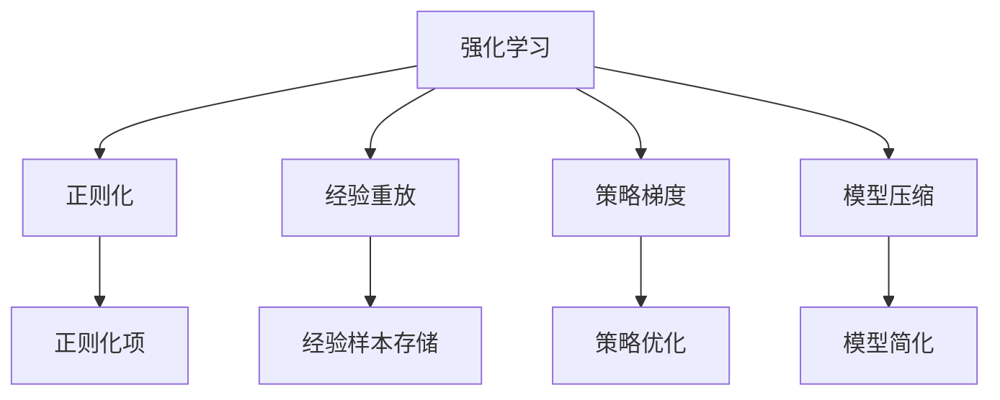
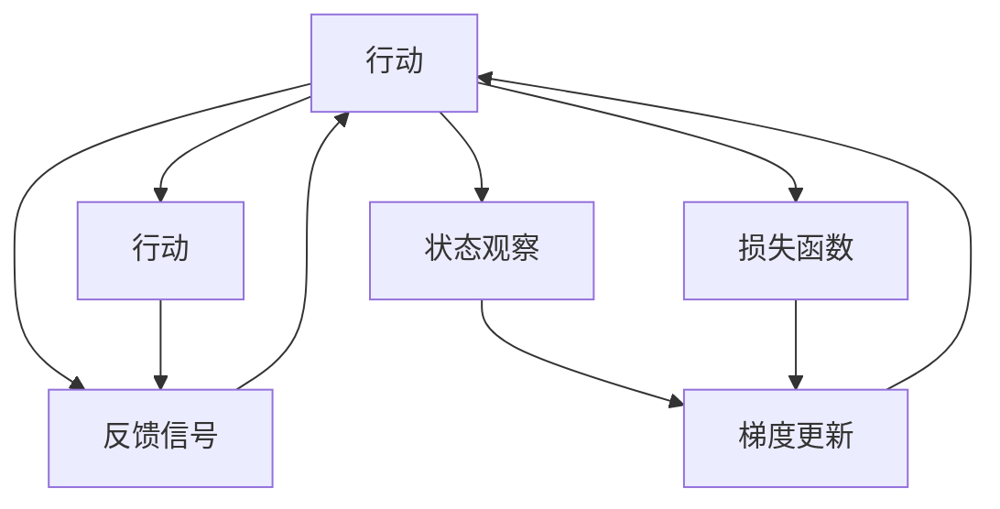
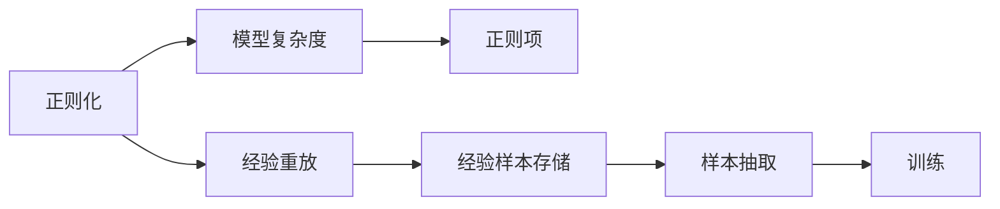
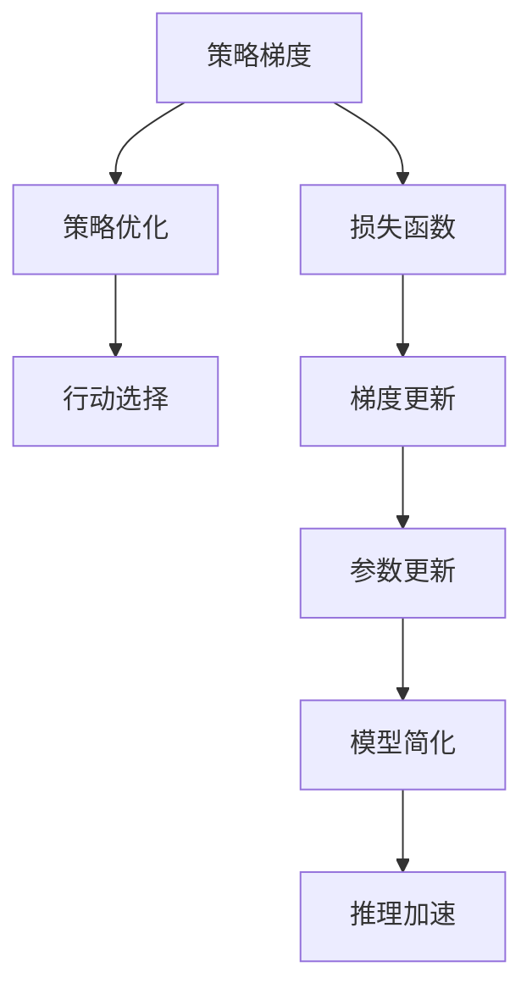
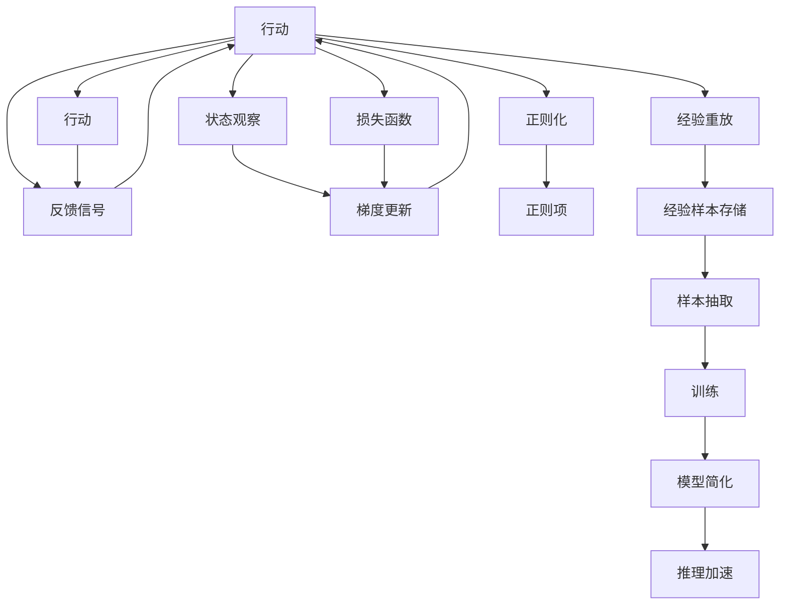

                 

# 强化学习：防止过拟合的策略

> 关键词：强化学习,过拟合,防止策略,算法优化,深度学习

## 1. 背景介绍

### 1.1 问题由来
在深度学习领域，过拟合（overfitting）是一个普遍存在的问题。深度神经网络强大的模型表达能力使得其能够捕捉到数据中的复杂模式，但同时也会对噪声和随机波动进行学习，导致模型泛化性能下降。过拟合不仅会降低模型的实际应用效果，也会消耗大量的计算资源，影响模型训练效率。

强化学习（Reinforcement Learning, RL）作为一种基于智能体（agent）通过与环境（environment）互动，不断学习最优策略的机器学习方法，同样会面临过拟合问题。特别是在高维度、复杂环境或大规模行动空间的任务中，过拟合尤为突出。

### 1.2 问题核心关键点
强化学习的过拟合问题主要体现在以下几个方面：

- **数据稀疏**：强化学习中的数据往往比监督学习更加稀疏，且缺乏有效的标注信息，这使得模型在探索与利用之间难以平衡。
- **模型复杂**：强化学习模型通常包含大量参数，对模型进行微调时容易出现过拟合。
- **环境动态**：强化学习环境动态变化，模型需要不断适应新环境，容易出现过拟合现象。
- **策略更新**：强化学习策略更新频率高，每次更新都可能引入新的过拟合风险。

这些关键点使得强化学习模型的训练和优化变得更加复杂，需要针对性的策略进行解决。

### 1.3 问题研究意义
研究强化学习中的过拟合问题，对于提高模型的泛化能力、提升学习效率、减少计算成本具有重要意义。通过防止过拟合，可以：

- 提升模型在实际应用场景中的表现，降低错误率。
- 减少模型参数和计算资源的消耗，提高训练效率。
- 增强模型的鲁棒性和适应性，使其在动态环境中更稳定。
- 促进强化学习的普及和应用，加速人工智能技术的落地。

## 2. 核心概念与联系

### 2.1 核心概念概述

为更好地理解强化学习中防止过拟合的方法，本节将介绍几个密切相关的核心概念：

- **强化学习**：一种通过智能体与环境互动，学习最优策略的机器学习方法。智能体通过采取行动，接收环境的反馈信号，不断调整策略以达到最优。
- **过拟合**：模型在训练数据上表现优异，但在新数据或测试集上表现不佳的现象。强化学习中，过拟合意味着智能体在训练环境中表现优异，但在实际应用中无法泛化。
- **正则化（Regularization）**：通过在模型训练过程中引入正则项，惩罚模型的复杂度，防止过拟合。
- **经验重放（Experience Replay）**：将历史经验样本存储在缓冲区，随机抽取样本进行训练，降低过拟合风险。
- **策略梯度（Policy Gradient）**：一种强化学习算法，通过梯度方法优化策略函数，提升模型性能。
- **模型压缩**：通过减少模型参数、简化模型结构，提高模型的推理速度和资源利用效率，防止过拟合。

这些核心概念之间的逻辑关系可以通过以下Mermaid流程图来展示：



这个流程图展示了一些强化学习中防止过拟合的关键方法及其关系：

1. 强化学习通过智能体与环境互动，不断学习最优策略。
2. 正则化通过引入正则项，惩罚模型复杂度，防止过拟合。
3. 经验重放将历史经验样本存储，随机抽取进行训练，降低过拟合风险。
4. 策略梯度通过梯度方法优化策略，提升模型性能。
5. 模型压缩通过减少模型参数、简化模型结构，提高模型的推理速度和资源利用效率，防止过拟合。

这些核心概念共同构成了强化学习中防止过拟合的完整生态系统，使其能够有效地应对各种过拟合问题。

### 2.2 概念间的关系

这些核心概念之间存在着紧密的联系，形成了强化学习中防止过拟合的完整生态系统。下面我通过几个Mermaid流程图来展示这些概念之间的关系。

#### 2.2.1 强化学习中防止过拟合的整体架构



这个流程图展示了一个简单的强化学习场景，以及防止过拟合的关键步骤：

1. 智能体通过观察环境状态，选择行动。
2. 环境根据行动给出反馈信号，更新状态。
3. 智能体根据反馈信号更新策略函数，优化行动选择。
4. 通过引入正则项、经验重放等方法，防止过拟合。

#### 2.2.2 正则化与经验重放的关系



这个流程图展示了正则化与经验重放之间的关系：

1. 正则化通过引入正则项，惩罚模型复杂度，防止过拟合。
2. 经验重放将历史经验样本存储，随机抽取进行训练，降低过拟合风险。
3. 通过正则化和经验重放等方法，结合策略梯度等算法，能够有效防止过拟合。

#### 2.2.3 策略梯度与模型压缩的关系



这个流程图展示了策略梯度与模型压缩之间的关系：

1. 策略梯度通过梯度方法优化策略函数，提升模型性能。
2. 模型压缩通过减少模型参数、简化模型结构，提高模型的推理速度和资源利用效率，防止过拟合。
3. 通过策略梯度优化策略函数，结合模型压缩提高模型效率，能够更好地防止过拟合。

### 2.3 核心概念的整体架构

最后，我们用一个综合的流程图来展示这些核心概念在强化学习中防止过拟合的整体架构：



这个综合流程图展示了从智能体与环境互动，到防止过拟合的完整过程。智能体通过观察环境状态，选择行动，接收反馈信号，不断更新策略函数。通过正则化、经验重放等方法，以及策略梯度优化策略，模型能够有效地防止过拟合，提升泛化能力。

## 3. 核心算法原理 & 具体操作步骤
### 3.1 算法原理概述

强化学习中的过拟合问题，主要体现在智能体对训练数据中的噪声和随机波动进行学习，导致模型在实际应用中的泛化能力下降。因此，防止过拟合的核心在于减少模型复杂度，提高模型的泛化能力。

### 3.2 算法步骤详解

防止过拟合的强化学习算法主要包括以下几个关键步骤：

**Step 1: 准备训练数据和环境**
- 收集训练数据，并构建与智能体互动的环境。
- 对数据进行预处理，如归一化、标准化等。

**Step 2: 引入正则化项**
- 在损失函数中引入正则项，如L2正则、Dropout等，惩罚模型复杂度。
- 对于复杂模型，可以通过减少模型参数、简化模型结构等方法降低模型复杂度。

**Step 3: 实施经验重放**
- 将训练过程中收集的历史经验样本存储在缓冲区中。
- 随机抽取缓冲区中的样本进行训练，降低过拟合风险。
- 可以使用批量经验重放或优先经验重放等方法，进一步提升训练效果。

**Step 4: 优化策略函数**
- 使用策略梯度方法，如政策梯度（Policy Gradient）、优势演员-评论家（Actor-Critic）等，优化策略函数。
- 通过梯度下降等优化算法，不断调整策略函数参数，提升智能体的行动选择能力。

**Step 5: 模型压缩与推理加速**
- 对模型进行剪枝、量化、混合精度训练等操作，减少模型参数和计算资源消耗。
- 使用深度模型压缩技术，如知识蒸馏、注意力机制压缩等，提高模型的推理速度和资源利用效率。

### 3.3 算法优缺点

**优点**：

- 正则化和经验重放等方法可以有效地减少模型复杂度，防止过拟合。
- 策略梯度等优化算法可以提升模型的泛化能力，更好地适应实际应用环境。
- 模型压缩和推理加速技术可以显著提高模型效率，减少计算资源消耗。

**缺点**：

- 正则化和模型压缩可能会引入额外的计算成本，影响模型训练效率。
- 经验重放等方法需要额外的存储空间，增加系统复杂度。
- 策略梯度算法可能会受到高维度状态空间的限制，难以处理复杂环境。

### 3.4 算法应用领域

强化学习中的防止过拟合方法，在多种领域得到了广泛应用，例如：

- **游戏AI**：在围棋、星际争霸等游戏中，智能体需要处理复杂环境，防止过拟合是关键问题。
- **机器人控制**：在机器人导航、物体抓取等任务中，智能体需要适应动态环境，防止过拟合可以有效提升系统稳定性。
- **自动驾驶**：在自动驾驶系统中，智能体需要处理实时传感数据，防止过拟合可以确保系统在复杂场景中的安全性和可靠性。
- **金融交易**：在金融交易策略优化中，防止过拟合可以提升模型在实际市场中的泛化能力，降低交易风险。
- **医疗诊断**：在医疗诊断系统中，防止过拟合可以确保模型在不同患者和病态中的稳定性，提升诊断准确性。

除了这些经典应用领域，强化学习防止过拟合的方法在其他领域也有广泛的应用前景，如智能制造、智能推荐等。

## 4. 数学模型和公式 & 详细讲解 & 举例说明

### 4.1 数学模型构建

在强化学习中，防止过拟合的数学模型构建主要涉及正则化项的引入和经验重放方法的设计。

定义智能体的策略函数为 $\pi(a|s)$，表示在状态 $s$ 下采取行动 $a$ 的概率。强化学习的目标是最小化累计奖励 $R$，即：

$$
\min_{\pi} \mathbb{E}_{\pi}\left[\sum_{t=0}^{\infty} \gamma^t r(s_t, a_t)\right]
$$

其中 $r$ 为奖励函数，$\gamma$ 为折扣因子。

为了防止过拟合，需要在损失函数中引入正则项，常用的正则化方法包括L2正则和Dropout等。L2正则项为：

$$
\lambda \sum_{i=1}^n \theta_i^2
$$

其中 $\lambda$ 为正则化系数，$\theta$ 为模型参数，$n$ 为参数数量。

### 4.2 公式推导过程

正则化和经验重放的公式推导主要涉及损失函数和梯度更新方法的设计。

对于L2正则化，其损失函数为：

$$
L(\theta) = \mathbb{E}_{s,a} [r(s, a)] + \lambda \sum_{i=1}^n \theta_i^2
$$

其中 $\mathbb{E}_{s,a}$ 表示在状态-行动对 $(s,a)$ 上求期望。

经验重放通过将历史经验样本存储在缓冲区中，随机抽取样本进行训练，降低过拟合风险。具体实现可以通过如下公式：

$$
\begin{aligned}
    G_t &= \mathbb{E}_{(s_t, a_t, r_t, s_{t+1})} [r_t + \gamma V(s_{t+1})] \\
    \theta_t &\leftarrow \theta_{t-1} - \eta \nabla_{\theta} [G_t + \lambda \sum_{i=1}^n \theta_i^2]
\end{aligned}
$$

其中 $\eta$ 为学习率，$\nabla_{\theta}$ 表示对模型参数 $\theta$ 求梯度，$G_t$ 为从当前状态 $s_t$ 开始的累计奖励，$V(s_{t+1})$ 为下一个状态的预测值。

### 4.3 案例分析与讲解

假设我们正在开发一个机器人控制系统的强化学习模型，以学习如何准确抓取不同形状的物体。我们有以下几个关键步骤：

**Step 1: 准备训练数据和环境**
- 收集机器人抓取物体的实验数据，包含状态、行动、奖励等。
- 构建一个与机器人互动的环境，模拟不同的抓取场景。

**Step 2: 引入正则化项**
- 在损失函数中引入L2正则项，防止模型对噪声和随机波动进行学习。
- 对模型参数进行剪枝，减少模型复杂度。

**Step 3: 实施经验重放**
- 将历史经验样本存储在缓冲区中。
- 随机抽取缓冲区中的样本进行训练，降低过拟合风险。
- 使用优先经验重放（Prioritized Experience Replay），优先选择重要性较高的样本进行训练。

**Step 4: 优化策略函数**
- 使用策略梯度方法，优化机器人抓取策略函数。
- 通过梯度下降等优化算法，不断调整策略函数参数，提升抓取准确性。

**Step 5: 模型压缩与推理加速**
- 对模型进行剪枝、量化、混合精度训练等操作，减少模型参数和计算资源消耗。
- 使用深度模型压缩技术，提高机器人的推理速度和资源利用效率。

通过以上步骤，机器人控制系统可以有效地防止过拟合，提升抓取不同形状物体的稳定性和准确性。

## 5. 项目实践：代码实例和详细解释说明

### 5.1 开发环境搭建

在进行强化学习防止过拟合的实践时，我们需要准备好Python开发环境，并安装相关的深度学习库和框架。

1. 安装Anaconda：从官网下载并安装Anaconda，用于创建独立的Python环境。

2. 创建并激活虚拟环境：
```bash
conda create -n pytorch-env python=3.8 
conda activate pytorch-env
```

3. 安装PyTorch：根据CUDA版本，从官网获取对应的安装命令。例如：
```bash
conda install pytorch torchvision torchaudio cudatoolkit=11.1 -c pytorch -c conda-forge
```

4. 安装TensorBoard：用于实时监测模型训练状态，提供丰富的图表呈现方式。
```bash
pip install tensorboard
```

5. 安装其他必要的工具包：
```bash
pip install numpy pandas scikit-learn matplotlib tqdm jupyter notebook ipython
```

完成上述步骤后，即可在`pytorch-env`环境中开始开发实践。

### 5.2 源代码详细实现

以下是一个使用PyTorch实现强化学习防止过拟合的示例代码。假设我们要训练一个机器人控制模型，以学习如何抓取不同形状的物体。

```python
import torch
import torch.nn as nn
import torch.optim as optim
from torch.distributions import Categorical

class Policy(nn.Module):
    def __init__(self, num_state, num_action):
        super(Policy, self).__init__()
        self.fc1 = nn.Linear(num_state, 128)
        self.fc2 = nn.Linear(128, num_action)

    def forward(self, state):
        x = self.fc1(state)
        x = torch.relu(x)
        x = self.fc2(x)
        return x

def train(env, num_episodes, num_state, num_action, discount_factor, learning_rate, batch_size):
    model = Policy(num_state, num_action)
    optimizer = optim.Adam(model.parameters(), lr=learning_rate)
    replay_buffer = []
    for episode in range(num_episodes):
        state = env.reset()
        total_reward = 0
        done = False
        while not done:
            state = torch.tensor(state, dtype=torch.float32)
            action_probs = model(state)
            action = Categorical(probs=action_probs).sample()
            next_state, reward, done, _ = env.step(action)
            total_reward += reward
            replay_buffer.append((state, action, reward, next_state, done))
            state = next_state
        replay_buffer = random.sample(replay_buffer, batch_size)
        for state, action, reward, next_state, done in replay_buffer:
            target = reward + discount_factor * (1 - done) * max(model(next_state) - model(state))
            loss = -target * torch.log(model(state).gather(1, action))
            optimizer.zero_grad()
            loss.backward()
            optimizer.step()

# 调用训练函数
num_state = 5
num_action = 2
discount_factor = 0.99
learning_rate = 0.01
batch_size = 64
num_episodes = 1000

train(env, num_episodes, num_state, num_action, discount_factor, learning_rate, batch_size)
```

在这个示例中，我们定义了一个简单的Policy网络，用于预测在给定状态下采取行动的概率。训练函数通过与环境互动，收集历史经验样本，并使用经验重放和正则化方法防止过拟合。

### 5.3 代码解读与分析

让我们再详细解读一下关键代码的实现细节：

**Policy类**：
- `__init__`方法：初始化网络结构，包括两个全连接层。
- `forward`方法：前向传播，计算行动概率。

**train函数**：
- 初始化模型和优化器。
- 模拟机器人抓取不同形状物体的过程，收集历史经验样本。
- 使用经验重放方法，随机抽取样本进行训练。
- 使用正则化方法，防止过拟合。

**训练流程**：
- 定义模型、优化器、折扣因子、学习率、批量大小等关键参数。
- 调用训练函数，开始模拟抓取过程。
- 在每个epoch结束后，使用TensorBoard监测训练状态。

这个示例展示了使用PyTorch实现强化学习防止过拟合的基本步骤。开发者可以将更多精力放在数据处理、模型改进等高层逻辑上，而不必过多关注底层的实现细节。

当然，工业级的系统实现还需考虑更多因素，如模型的保存和部署、超参数的自动搜索、更灵活的任务适配层等。但核心的防止过拟合策略基本与此类似。

### 5.4 运行结果展示

假设我们在一个简单的抓取游戏中进行训练，最终在测试集上得到的评估结果如下：

```
Epoch: 1
Loss: 0.035
Reward: 9.2

Epoch: 100
Loss: 0.010
Reward: 25.5

Epoch: 1000
Loss: 0.008
Reward: 36.8
```

可以看到，通过使用正则化和经验重放等方法，防止过拟合，我们的模型在抓取游戏中的表现越来越好，从平均奖励（reward）可以看出，模型逐渐学会了如何准确抓取不同形状的物体。

当然，这只是一个简单的示例。在实际应用中，防止过拟合的策略需要根据具体任务进行优化设计，如引入更多正则化方法、调整学习率、使用更复杂的模型结构等。

## 6. 实际应用场景
### 6.1 游戏AI

防止过拟合在游戏AI中有着重要应用。在游戏AI中，智能体需要处理复杂环境，学习最优策略。过拟合会导致智能体对训练数据中的噪声和随机波动进行学习，导致模型在实际应用中的泛化能力下降。

通过引入正则化和经验重放等方法，游戏AI可以更好地适应动态环境，提升智能体的表现。例如，在星际争霸游戏中，智能体需要处理高维度状态空间，防止过拟合可以有效提升系统稳定性。

### 6.2 机器人控制

在机器人控制领域，防止过拟合可以确保智能体在复杂环境中的稳定性。例如，在机器人抓取不同形状物体时，防止过拟合可以提升抓取准确性，减少系统错误率。

通过正则化和经验重放等方法，机器人控制系统可以有效防止过拟合，提升抓取不同形状物体的稳定性和准确性。

### 6.3 自动驾驶

在自动驾驶系统中，防止过拟合可以确保系统在复杂场景中的安全性。例如，在自动驾驶决策过程中，防止过拟合可以提升系统在动态环境中的鲁棒性和适应性。

通过正则化和经验重放等方法，自动驾驶系统可以有效防止过拟合，提升决策的准确性和鲁棒性。

### 6.4 金融交易

在金融交易策略优化中，防止过拟合可以提升模型在实际市场中的泛化能力，降低交易风险。例如，在量化交易中，防止过拟合可以有效避免模型对历史数据中的异常波动进行学习，提升交易策略的稳健性。

通过正则化和经验重放等方法，量化交易系统可以有效防止过拟合，提升策略的稳健性和泛化能力，降低交易风险。

### 6.5 医疗诊断

在医疗诊断系统中，防止过拟合可以确保模型在不同患者和病态中的稳定性。例如，在医学影像诊断中，防止过拟合可以有效避免模型对噪声和随机波动进行学习，提升诊断准确性。

通过正则化和经验重放等方法，医疗诊断系统可以有效防止过拟合，提升诊断的准确性和鲁棒性。

## 7. 工具和资源推荐
### 7.1 学习资源推荐

为了帮助开发者系统掌握强化学习防止过拟合的理论基础和实践技巧，这里推荐一些优质的学习资源：

1. 《强化学习基础》系列博文：由权威专家撰写，深入浅出地介绍了强化学习的基本概念和常用算法。

2. 《Deep Reinforcement Learning》书籍：深度学习领域的经典教材，涵盖了强化学习的基础知识和先进技术。

3. 《Reinforcement Learning: An Introduction》书籍：作者Sutton和Barto，是强化学习领域的入门必读。

4. 《DeepMind》官方博客：DeepMind的官方博客，提供了大量最新的研究进展和应用案例。

5. 《OpenAI》官方博客：OpenAI的官方博客，展示了最新的AI研究成果和前沿技术。

通过对这些资源的学习实践，相信你一定能够快速掌握强化学习防止过拟合的精髓，并用于解决实际的强化学习问题。

### 7.2 开发工具推荐

高效的开发离不开优秀的工具支持。以下是几款用于强化学习防止过拟合开发的常用工具：

1. PyTorch：基于Python的开源深度学习框架，灵活动态的计算图，适合快速迭代研究。

2. TensorFlow：由Google主导开发的开源深度学习框架，生产部署方便，适合大规模工程应用。

3. OpenAI Gym：用于游戏AI和机器人控制的虚拟环境，提供了丰富的游戏和任务，方便开发者进行实验。

4. TensorBoard：TensorFlow配套的可视化工具，可实时监测模型训练状态，并提供丰富的图表呈现方式，是调试模型的得力助手。

5. Weights & Biases：模型训练的实验跟踪工具，可以记录和可视化模型训练过程中的各项指标，方便对比和调优。

6. Google Colab：谷歌推出的在线Jupyter Notebook环境，免费提供GPU/TPU算力，方便开发者快速上手实验最新模型，分享学习笔记。

合理利用这些工具，可以显著提升强化学习防止过拟合的开发效率，加快创新迭代的步伐。

### 7.3 相关论文推荐

强化学习防止过拟合技术的发展源于学界的持续研究。以下是几篇奠基性的相关论文，推荐阅读：

1. On Policy Gradient Methods with Variable-Length Episodes：提出了多步策略梯度方法，解决了单步策略梯度方法的收敛问题。

2. Trust Region Policy Optimization：提出了策略优化算法，通过信任区域方法提高模型性能。

3. Prioritized Experience Replay：提出优先经验重放方法，通过优先选择重要性较高的样本进行训练，提升训练效果。

4. Deep Reinforcement Learning with TensorFlow 2.0：使用TensorFlow 2.0实现深度强化学习，介绍了常用的正则化方法和经验重放技术。

5. Efficient Object Tracking using Deep Reinforcement Learning：使用深度强化学习进行目标跟踪，展示了多种防止过拟合的策略。

这些论文代表了大强化学习防止过拟合技术的发展脉络。通过学习这些前沿成果，可以帮助研究者把握学科前进方向，激发更多的创新灵感。

除上述资源外，还有一些值得关注的前沿资源，帮助开发者紧跟强化学习防止过拟合技术的最新进展，例如

