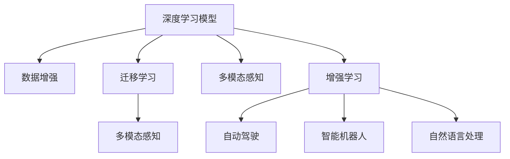
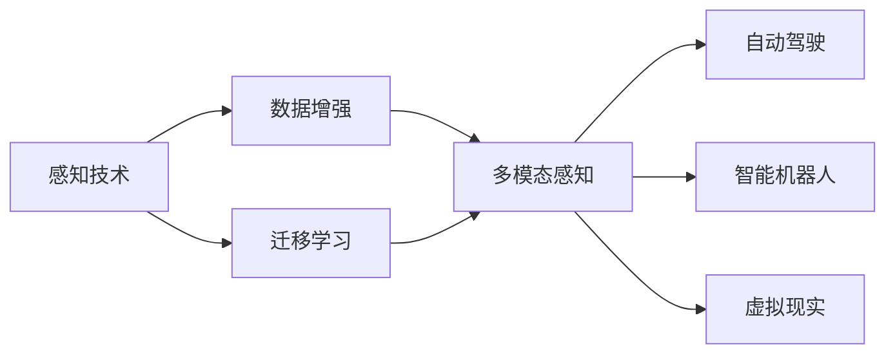
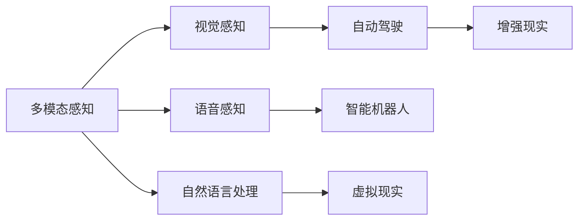
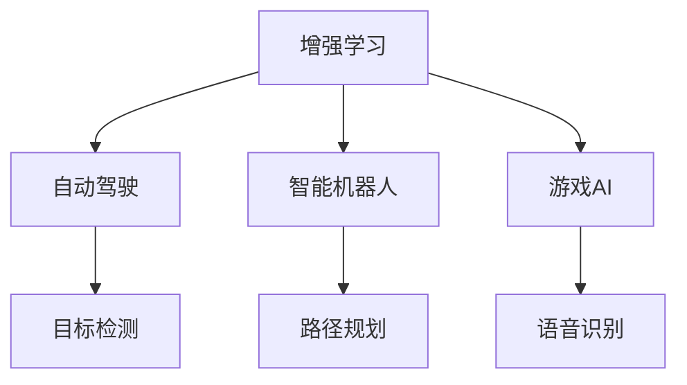
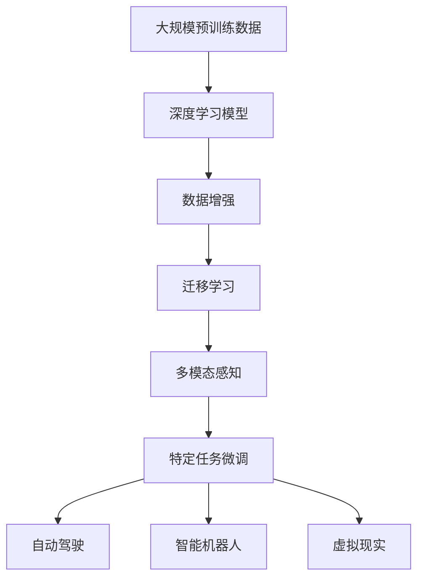

                 

# 感知 (Perception)

## 1. 背景介绍

感知（Perception）是指机器或系统对环境中物理或数字信号的识别、处理和理解。在计算机科学中，感知通常指计算机视觉（CV）、自然语言处理（NLP）、语音识别和信号处理等领域的技术，旨在使机器能够“看”、“听”和“理解”环境。这些技术在自动驾驶、智能机器人、虚拟现实（VR）、增强现实（AR）和许多其他应用中起着关键作用。

### 1.1 问题由来

近年来，随着深度学习技术的快速发展和计算能力的提升，计算机感知技术取得了显著进展。深度神经网络（DNNs）和大规模数据集被广泛应用于计算机视觉、语音识别和自然语言处理等领域。例如，卷积神经网络（CNN）、递归神经网络（RNN）和变换器（Transformer）等模型，通过在大规模数据上预训练，能够自动学习特征和模式，并在不同的感知任务上表现出色。

然而，尽管这些模型在特定任务上表现优异，但在更广泛的感知场景中，往往难以适应不同的环境和应用需求。因此，如何在大规模数据上训练通用感知模型，以及在复杂场景中进行适应性微调，成为当前计算机感知技术研究的重点。

### 1.2 问题核心关键点

感知技术的核心在于如何将原始数据（如图像、音频、文本等）转换为机器可以理解的形式，并进行高效处理和理解。目前，感知技术主要依赖于以下关键技术：

- 深度学习模型：如CNN、RNN和Transformer等，通过在大规模数据上预训练，学习到丰富的特征和模式，用于自动感知和理解环境。
- 数据增强：通过各种数据生成技术，扩充训练数据集，提升模型泛化能力和鲁棒性。
- 迁移学习：在大规模数据上预训练的模型，可以在特定任务上进行微调，以适应不同的应用需求。
- 多模态感知：融合视觉、语音、文本等多种感知模态，提升模型的理解和表达能力。

这些核心技术通过相互结合，能够构建出更加智能、灵活的感知系统。

### 1.3 问题研究意义

感知技术的进步，对于推动人工智能（AI）的广泛应用，提升人机交互的自然性和智能化水平，具有重要意义：

1. 提升自动化水平：在自动驾驶、智能制造、无人机等领域，感知技术可以自动识别和理解环境，辅助机器做出决策，提高自动化水平。
2. 增强用户体验：在智能家居、虚拟现实、增强现实等应用中，感知技术可以理解用户的意图和行为，提供更加自然、个性化的交互体验。
3. 促进行业转型：在零售、医疗、教育等行业，感知技术可以优化运营流程，提高服务效率，推动传统行业数字化转型。
4. 推动技术创新：感知技术的发展，催生了许多新的研究方向和应用场景，如计算机视觉中的目标检测、语义分割、实例分割等，为计算机感知技术的发展注入新的活力。

## 2. 核心概念与联系

### 2.1 核心概念概述

为更好地理解感知技术的核心概念，本节将介绍几个密切相关的核心概念：

- 深度学习模型：如CNN、RNN和Transformer等，通过在大规模数据上预训练，学习到丰富的特征和模式，用于自动感知和理解环境。
- 数据增强：通过各种数据生成技术，扩充训练数据集，提升模型泛化能力和鲁棒性。
- 迁移学习：在大规模数据上预训练的模型，可以在特定任务上进行微调，以适应不同的应用需求。
- 多模态感知：融合视觉、语音、文本等多种感知模态，提升模型的理解和表达能力。
- 增强学习（Reinforcement Learning）：通过与环境的交互，机器可以学习最优策略，提升感知和决策能力。

这些核心概念之间的逻辑关系可以通过以下Mermaid流程图来展示：

这个流程图展示了感知技术的核心概念及其之间的关系：

1. 深度学习模型通过数据增强学习丰富的特征和模式。
2. 迁移学习将大规模预训练的模型应用于特定任务，提升感知能力。
3. 多模态感知融合视觉、语音、文本等感知模态，提升模型的理解和表达能力。
4. 增强学习通过与环境的交互，提升感知和决策能力，特别是在自动驾驶和智能机器人等应用中。

### 2.2 概念间的关系

这些核心概念之间存在着紧密的联系，形成了感知技术的完整生态系统。下面我通过几个Mermaid流程图来展示这些概念之间的关系。

#### 2.2.1 感知技术的学习范式

这个流程图展示了感知技术的基本原理，以及它与数据增强和迁移学习的关系。感知技术通过数据增强扩充训练集，并通过迁移学习将预训练模型应用于特定任务。

#### 2.2.2 多模态感知的应用场景

这个流程图展示了多模态感知的应用场景。多模态感知融合视觉、语音、文本等多种感知模态，提升了模型的理解和表达能力，在自动驾驶、智能机器人、虚拟现实等应用中得到广泛应用。

#### 2.2.3 增强学习在感知中的应用

这个流程图展示了增强学习在感知技术中的应用。增强学习通过与环境的交互，提升了感知和决策能力，在自动驾驶、智能机器人和游戏AI等领域得到了广泛应用。

### 2.3 核心概念的整体架构

最后，我们用一个综合的流程图来展示这些核心概念在大规模预训练和特定任务微调过程中的整体架构：

这个综合流程图展示了从大规模预训练到特定任务微调，再到实际应用的整体过程。大规模预训练模型通过数据增强学习丰富的特征和模式，然后通过迁移学习将模型应用于特定任务，融合多模态感知提升模型的理解和表达能力，最终进行特定任务微调以适应实际应用需求。 通过这些流程图，我们可以更清晰地理解感知技术的核心概念及其在预训练和微调过程中的作用，为后续深入讨论具体的感知技术和方法奠定基础。

## 3. 核心算法原理 & 具体操作步骤
### 3.1 算法原理概述

感知技术的核心在于如何从原始数据中提取有意义的特征和模式，并进行高效的感知和理解。目前，基于深度学习的大规模预训练和多模态融合是感知技术的主要手段。

深度学习模型通过在大规模数据上预训练，学习到丰富的特征和模式，用于自动感知和理解环境。预训练过程通常包括以下步骤：

1. 数据预处理：对原始数据进行清洗、归一化等预处理，准备用于训练。
2. 特征提取：通过卷积层、池化层等，提取输入数据的关键特征。
3. 全连接层：将提取的特征进行高层次的表示学习，形成抽象的特征空间。
4. 损失函数计算：根据特定任务，设计合适的损失函数，如交叉熵损失、均方误差损失等。
5. 反向传播和优化：通过反向传播算法计算梯度，使用优化算法（如Adam、SGD等）更新模型参数，最小化损失函数。

多模态感知技术融合视觉、语音、文本等多种感知模态，提升模型的理解和表达能力。多模态感知通常包括以下步骤：

1. 数据融合：将不同模态的数据进行拼接、融合，形成统一的特征表示。
2. 特征提取：对融合后的特征进行提取和处理，形成多模态的特征表示。
3. 模型融合：将不同模态的特征表示进行组合，形成最终的感知结果。
4. 后处理：对感知结果进行后处理，如目标检测、语音识别等。

特定任务微调是指在预训练模型的基础上，使用下游任务的少量标注数据，通过有监督地训练来优化模型在该任务上的性能。微调过程通常包括以下步骤：

1. 任务适配层设计：根据特定任务，设计合适的输出层和损失函数。
2. 冻结预训练参数：固定预训练模型的权重，只微调顶层参数。
3. 微调参数更新：使用下游任务的少量标注数据，通过优化算法更新模型参数，最小化损失函数。
4. 模型评估：在验证集上评估微调后的模型性能，选择合适的模型参数。
5. 模型部署：将微调后的模型部署到实际应用场景中，进行实时感知和理解。

### 3.2 算法步骤详解

基于深度学习的大规模预训练和多模态融合是感知技术的主要手段。下面将详细讲解这些算法的具体步骤。

#### 3.2.1 大规模预训练

大规模预训练通常包括以下步骤：

1. 数据预处理：对原始数据进行清洗、归一化等预处理，准备用于训练。
2. 特征提取：通过卷积层、池化层等，提取输入数据的关键特征。
3. 全连接层：将提取的特征进行高层次的表示学习，形成抽象的特征空间。
4. 损失函数计算：根据特定任务，设计合适的损失函数，如交叉熵损失、均方误差损失等。
5. 反向传播和优化：通过反向传播算法计算梯度，使用优化算法（如Adam、SGD等）更新模型参数，最小化损失函数。

##### 3.2.1.1 数据预处理

数据预处理通常包括以下步骤：

1. 数据清洗：去除噪声、错误等无用数据，确保数据的质量。
2. 归一化：将数据归一化到指定的范围内，提高模型的训练效率。
3. 数据增强：通过各种数据生成技术，扩充训练数据集，提升模型泛化能力和鲁棒性。

##### 3.2.1.2 特征提取

特征提取通常包括以下步骤：

1. 卷积层：通过卷积核提取输入数据的空间特征。
2. 池化层：对卷积层输出的特征进行下采样，形成更高级别的特征。
3. 激活函数：对池化层输出的特征进行激活，引入非线性变换。

##### 3.2.1.3 全连接层

全连接层通常包括以下步骤：

1. 线性变换：将卷积层和池化层提取的特征进行线性变换，形成高层次的表示。
2. 激活函数：对线性变换后的特征进行激活，引入非线性变换。
3. 归一化：对线性变换和激活后的特征进行归一化，防止梯度消失或爆炸。

##### 3.2.1.4 损失函数计算

损失函数通常包括以下步骤：

1. 交叉熵损失：用于分类任务，衡量模型预测输出与真实标签之间的差异。
2. 均方误差损失：用于回归任务，衡量模型预测输出与真实标签之间的差异。
3. KL散度损失：用于衡量模型输出的分布与真实分布之间的差异。

##### 3.2.1.5 反向传播和优化

反向传播和优化通常包括以下步骤：

1. 前向传播：将输入数据输入模型，计算模型输出的中间表示。
2. 反向传播：根据中间表示计算梯度，将误差反向传播回每个参数。
3. 优化算法：使用优化算法（如Adam、SGD等）更新模型参数，最小化损失函数。

#### 3.2.2 多模态感知

多模态感知通常包括以下步骤：

1. 数据融合：将不同模态的数据进行拼接、融合，形成统一的特征表示。
2. 特征提取：对融合后的特征进行提取和处理，形成多模态的特征表示。
3. 模型融合：将不同模态的特征表示进行组合，形成最终的感知结果。
4. 后处理：对感知结果进行后处理，如目标检测、语音识别等。

##### 3.2.2.1 数据融合

数据融合通常包括以下步骤：

1. 时空对齐：将不同模态的数据进行对齐，确保时间同步和空间一致。
2. 数据拼接：将对齐后的数据进行拼接，形成多模态的特征表示。

##### 3.2.2.2 特征提取

特征提取通常包括以下步骤：

1. 卷积层：通过卷积核提取输入数据的空间特征。
2. 池化层：对卷积层输出的特征进行下采样，形成更高级别的特征。
3. 激活函数：对池化层输出的特征进行激活，引入非线性变换。

##### 3.2.2.3 模型融合

模型融合通常包括以下步骤：

1. 特征融合：将不同模态的特征表示进行融合，形成统一的特征表示。
2. 多模态表示学习：对融合后的特征进行表示学习，形成多模态的特征表示。
3. 后处理：对多模态表示进行后处理，如目标检测、语音识别等。

#### 3.2.3 特定任务微调

特定任务微调通常包括以下步骤：

1. 任务适配层设计：根据特定任务，设计合适的输出层和损失函数。
2. 冻结预训练参数：固定预训练模型的权重，只微调顶层参数。
3. 微调参数更新：使用下游任务的少量标注数据，通过优化算法更新模型参数，最小化损失函数。
4. 模型评估：在验证集上评估微调后的模型性能，选择合适的模型参数。
5. 模型部署：将微调后的模型部署到实际应用场景中，进行实时感知和理解。

##### 3.2.3.1 任务适配层设计

任务适配层通常包括以下步骤：

1. 输出层设计：根据特定任务，设计合适的输出层。
2. 损失函数设计：根据输出层的设计，设计合适的损失函数。
3. 优化器选择：选择适当的优化器（如Adam、SGD等）进行模型更新。

##### 3.2.3.2 冻结预训练参数

冻结预训练参数通常包括以下步骤：

1. 固定权重：固定预训练模型的权重，只微调顶层参数。
2. 初始化权重：将顶层参数的初始化值设为0。
3. 微调权重：通过优化算法更新顶层参数，最小化损失函数。

##### 3.2.3.3 微调参数更新

微调参数更新通常包括以下步骤：

1. 训练数据准备：将下游任务的少量标注数据准备好。
2. 微调过程：使用优化算法更新模型参数，最小化损失函数。
3. 验证集评估：在验证集上评估微调后的模型性能，选择最优的模型参数。

##### 3.2.3.4 模型评估

模型评估通常包括以下步骤：

1. 验证集评估：在验证集上评估微调后的模型性能，选择最优的模型参数。
2. 测试集评估：在测试集上评估微调后的模型性能，评估模型泛化能力。

##### 3.2.3.5 模型部署

模型部署通常包括以下步骤：

1. 模型保存：将微调后的模型保存为二进制文件或模型文件。
2. 模型加载：在实际应用场景中加载模型。
3. 实时感知：使用加载的模型进行实时感知和理解。

### 3.3 算法优缺点

基于深度学习的大规模预训练和多模态融合是感知技术的主要手段。下面将详细讲解这些算法的优缺点。

#### 3.3.1 大规模预训练

大规模预训练通常包括以下优点：

1. 自动学习特征：通过大规模预训练，模型可以自动学习丰富的特征和模式。
2. 泛化能力强：在大规模数据上预训练的模型，泛化能力强，能够适应不同的数据分布。
3. 训练效果好：通过预训练，模型可以更快地收敛到最优解，提高训练效率。

但大规模预训练也存在以下缺点：

1. 计算资源消耗大：大规模预训练需要大量的计算资源，如GPU/TPU等。
2. 训练时间长：大规模预训练需要较长的训练时间，数据量越大，训练时间越长。
3. 数据依赖性强：大规模预训练需要大量的数据进行训练，数据获取成本高。

#### 3.3.2 多模态感知

多模态感知通常包括以下优点：

1. 融合多种信息：多模态感知融合视觉、语音、文本等多种信息，提升模型的理解能力。
2. 适应性强：多模态感知能够适应不同的感知场景，提升感知系统的鲁棒性。
3. 应用广泛：多模态感知广泛应用于自动驾驶、智能机器人、虚拟现实等领域，推动技术发展。

但多模态感知也存在以下缺点：

1. 数据获取难度大：多模态感知需要同时获取多种信息，数据获取难度大。
2. 数据融合复杂：多模态感知需要融合不同模态的数据，数据融合复杂。
3. 算法复杂度高：多模态感知需要设计复杂的多模态感知模型，算法复杂度高。

#### 3.3.3 特定任务微调

特定任务微调通常包括以下优点：

1. 针对性强：特定任务微调针对特定任务，提升模型在该任务上的性能。
2. 模型简单：特定任务微调通常只需要微调顶层参数，模型结构简单。
3. 应用广泛：特定任务微调广泛应用于计算机视觉、自然语言处理等领域，推动技术应用。

但特定任务微调也存在以下缺点：

1. 数据依赖性强：特定任务微调需要下游任务的少量标注数据进行训练，数据获取成本高。
2. 模型过拟合：特定任务微调容易过拟合，需要设计复杂的正则化技术。
3. 训练效果受限：特定任务微调受限于下游任务的标注数据，模型性能受限。

### 3.4 算法应用领域

感知技术广泛应用于计算机视觉、自然语言处理、语音识别和信号处理等领域。下面将详细讲解感知技术在这些领域的应用。

#### 3.4.1 计算机视觉

计算机视觉是感知技术的重要应用领域，包括目标检测、图像分割、图像生成、人脸识别等。

1. 目标检测：通过深度学习模型，对图像中的目标进行定位和分类，广泛应用于自动驾驶、安防监控等领域。
2. 图像分割：通过深度学习模型，对图像中的不同区域进行分割，广泛应用于医学影像、地图绘制等领域。
3. 图像生成：通过深度学习模型，生成新的图像，广泛应用于游戏开发、广告设计等领域。
4. 人脸识别：通过深度学习模型，对人脸进行识别和验证，广泛应用于身份验证、安全监控等领域。

#### 3.4.2 自然语言处理

自然语言处理是感知技术的另一个重要应用领域，包括机器翻译、情感分析、问答系统等。

1. 机器翻译：通过深度学习模型，将一种语言翻译成另一种语言，广泛应用于国际贸易、旅游交流等领域。
2. 情感分析：通过深度学习模型，对文本中的情感进行分类，广泛应用于舆情监测、市场分析等领域。
3. 问答系统：通过深度学习模型，对自然语言问题进行理解和回答，广泛应用于智能客服、智能助手等领域。

#### 3.4.3 语音识别

语音识别是感知技术的另一个重要应用领域，包括语音识别、语音合成、语音情感分析等。

1. 语音识别：通过深度学习模型，将语音信号转换为文本，广泛应用于智能语音助手、语音翻译等领域。
2. 语音合成：通过深度学习模型，将文本转换为语音信号，广泛应用于智能语音助手、语音导航等领域。
3. 语音情感分析：通过深度学习模型，对语音中的情感进行分类，广泛应用于情感分析、舆情监测等领域。

#### 3.4.4 信号处理

信号处理是感知技术的基础应用领域，包括语音信号处理、图像信号处理等。

1. 语音信号处理：通过深度学习模型，对语音信号进行处理，广泛应用于语音识别、语音增强等领域。
2. 图像信号处理：通过深度学习模型，对图像信号进行处理，广泛应用于图像压缩、图像增强等领域。

## 4. 数学模型和公式 & 详细讲解 & 举例说明

### 4.1 数学模型构建

感知技术的核心在于如何从原始数据中提取有意义的特征和模式，并进行高效的感知和理解。下面将详细讲解感知技术的数学模型构建。

#### 4.1.1 深度学习模型的数学模型

深度学习模型的数学模型通常包括以下步骤：

1. 输入层：将原始数据映射为向量表示，准备用于训练。
2. 隐藏层：通过多层非线性变换，提取输入数据的关键特征。
3. 输出层：对隐藏层提取的特征进行线性变换，形成最终的预测结果。

##### 4.1.1.1 输入层

输入层通常包括以下步骤：

1. 数据预处理：对原始数据进行清洗、归一化等预处理，准备用于训练。
2. 特征提取：通过卷积层、池化层等，提取输入数据的关键特征。
3. 特征拼接：将不同模态的特征拼接，形成统一的特征表示。

##### 4.1.1.2 隐藏层

隐藏层通常包括以下步骤：

1. 卷积层：通过卷积核提取输入数据的空间特征。
2. 池化层：对卷积层输出的特征进行下采样，形成更高级别的特征。
3. 激活函数：对池化层输出的特征进行激活，引入非线性变换。
4. 归一化层：对卷积层和激活后的特征进行归一化，防止梯度消失或爆炸。

##### 4.1.1.3 输出层

输出层通常包括以下步骤：

1. 线性变换：将卷积层和池化层提取的特征进行线性变换，形成高层次的表示。
2. 激活函数：对线性变换后的特征进行激活，引入非线性变换。
3. 归一化层：对线性变换和激活后的特征进行归一化，防止梯度消失或爆炸。
4. 输出层设计：根据特定任务，设计合适的输出层。

#### 4.1.2 多模态感知的数学模型

多模态感知的数学模型通常包括以下步骤：

1. 输入层：将不同模态的数据映射为向量表示，准备用于训练。
2. 隐藏层：通过多层非线性变换，提取输入数据的关键特征。
3. 输出层：对隐藏层提取的特征进行线性变换，形成最终的感知结果。

##### 4.1.2.1 输入层

输入层通常包括以下步骤：

1. 数据预处理：对不同模态的数据进行清洗、归一化等预处理，准备用于训练。
2. 特征提取：通过卷积层、池化层等，提取输入数据的关键特征。
3. 特征拼接：将不同模态的特征拼接，形成统一的特征表示。

##### 4.1.2.2 隐藏层

隐藏层通常包括以下步骤：

1. 卷积层：通过卷积核提取输入数据的空间特征。
2. 池化层：对卷积层输出的特征进行下采样，形成更高级别的特征。
3. 激活函数：对池化层输出的特征进行激活，引入非线性变换。
4. 归一化层：对卷积层和激活后的特征进行归一化，防止梯度消失或爆炸。

##### 4.1.2.3 输出层

输出层通常包括以下步骤：

1. 线性变换：将卷积层和池化层提取的特征进行线性变换，形成高层次的表示。
2. 激活函数：对线性变换后的特征进行激活，引入非线性变换。
3. 归一化层：对线性变换和激活后的特征进行归一化，防止梯度消失或爆炸。
4. 输出层设计：根据特定任务，设计合适的输出层。

#### 4.1.3 特定任务微调的数学模型

特定任务微调的数学模型通常包括以下步骤：

1. 输入层：将下游任务的少量标注数据映射为向量表示，准备用于训练。
2. 隐藏层：通过多层非线性变换，提取输入数据的关键特征。
3. 输出层：对隐藏层提取的特征进行线性变换，形成最终的预测结果。

##### 4.1.3.1 输入层

输入层通常包括以下步骤：

1. 数据预处理：对下游任务的少量标注数据进行清洗、归一化等预处理，准备用于训练。
2. 特征提取：通过卷积层、池化层等，提取输入数据的关键特征。
3. 特征拼接：将不同模态的特征拼接，形成统一的特征表示。

##### 4.1.3.2 隐藏层

隐藏层通常包括以下

