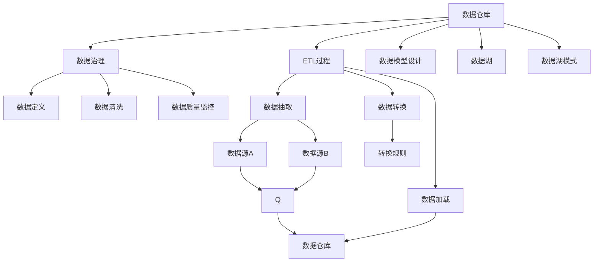
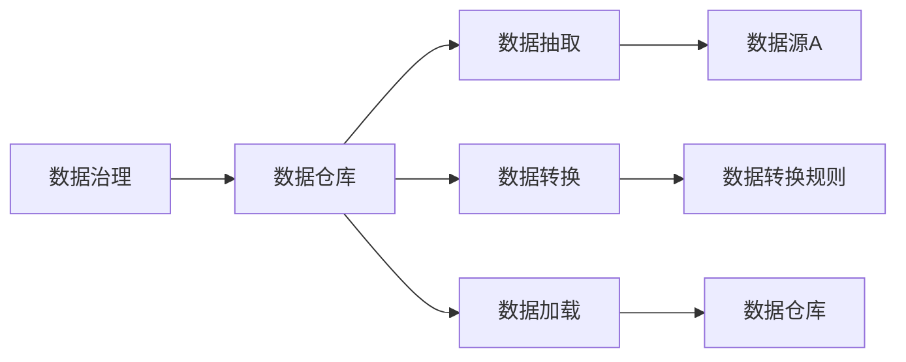
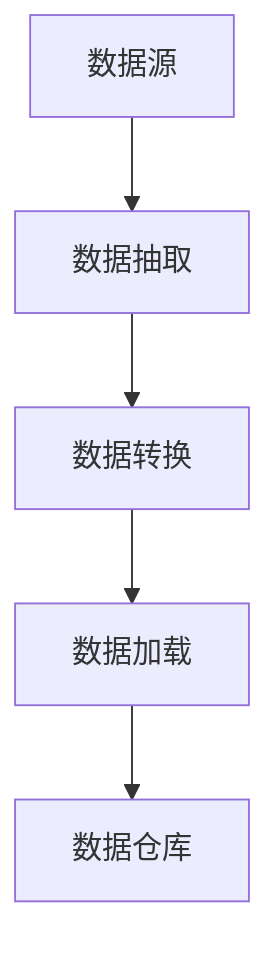
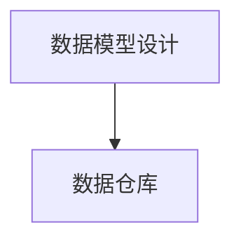

                 

# 数据仓库 原理与代码实例讲解

> 关键词：数据仓库,数据治理,ETL,数据湖,星形模式,雪花模式,数据湖模式

## 1. 背景介绍

### 1.1 问题由来
随着企业的数字化转型不断深入，数据的应用价值愈发凸显。如何高效、全面地收集、存储和分析企业内部与外部的数据，从中挖掘出有价值的洞察，成为企业决策管理的重要任务。数据仓库技术应运而生，成为数据管理与分析的重要基础设施。

数据仓库（Data Warehouse）是指按照主题组织，包含历史数据集的大规模数据存储系统，用于支持企业决策分析和商业智能应用。其核心思想是，通过建立统一的数据标准和元数据管理，将分布在企业内部和外部的数据整合到中心化的数据仓库中，实现数据的全生命周期管理，从而帮助企业更好地理解和利用数据。

### 1.2 问题核心关键点
数据仓库的建设涉及数据收集、清洗、存储和分析等多个环节。其中，核心关键点包括：

1. **数据治理**：确保数据质量、一致性和可用性，包括数据定义、数据清洗和数据质量监控等。
2. **ETL过程**：将数据源数据转换为数据仓库中的格式，包括数据抽取（Extract）、转换（Transform）和加载（Load）。
3. **数据模型设计**：根据业务需求，设计合理的数据模型，如星形模型、雪花模型和数据湖模式等。
4. **数据安全与隐私保护**：确保数据存储和使用过程中的安全性，包括数据加密、访问控制等。
5. **数据湖**：一种灵活的数据存储模式，允许数据的任意格式和位置，同时支持数据融合、数据分析和可视化。

这些关键点共同构成了数据仓库的核心技术和应用框架，决定了数据仓库的性能和可用性。

### 1.3 问题研究意义
构建高效、安全的数据仓库，对于提升企业数据应用能力、优化决策支持系统、增强数据驱动的业务创新具有重要意义：

1. **统一数据管理**：数据仓库将企业的数据进行集中管理和统一规范，确保数据的一致性和完整性。
2. **提升决策质量**：数据仓库中的数据经过清洗和整合，具有更高的可信度和分析价值，支持更科学合理的决策制定。
3. **加速业务创新**：数据仓库的数据分析功能为企业的业务创新提供了数据支持，帮助企业更好地识别市场机会和风险。
4. **推动数字化转型**：数据仓库是企业数字化转型的基础设施，支持企业对数据进行深入挖掘和利用，实现数字化增长。

## 2. 核心概念与联系

### 2.1 核心概念概述

为更好地理解数据仓库的技术原理和应用方法，本节将介绍几个密切相关的核心概念：

- **数据仓库**：用于存储和管理企业数据的中心化系统，通过统一的元数据管理，实现数据的高效整合和查询。
- **数据治理**：确保数据质量、一致性和可用性的管理流程，包括数据定义、数据清洗和数据质量监控等。
- **ETL过程**：将数据源数据转换为数据仓库中的格式，包括数据抽取、转换和加载。
- **数据模型设计**：根据业务需求，设计合理的数据模型，如星形模型、雪花模型和数据湖模式等。
- **数据湖**：一种灵活的数据存储模式，允许数据的任意格式和位置，同时支持数据融合、数据分析和可视化。
- **数据湖模式**：一种基于数据湖架构的数据管理方式，强调数据的原始存储和处理，适用于大规模数据分析和机器学习应用。

这些核心概念之间的逻辑关系可以通过以下Mermaid流程图来展示：



这个流程图展示了大数据仓库的核心组件及其之间的关系：

1. 数据仓库通过数据治理确保数据质量。
2. ETL过程将数据源数据转换为数据仓库格式。
3. 数据模型设计定义了数据的结构和存储方式。
4. 数据湖提供了一种灵活的数据存储模式。
5. 数据湖模式是数据湖架构的一种特定应用。
6. 数据抽取、转换和加载是ETL过程中的关键步骤。
7. 数据定义、清洗和质量监控是数据治理的重要组成部分。

这些核心概念共同构成了数据仓库的管理和分析框架，使其能够高效地存储和利用企业数据。通过理解这些核心概念，我们可以更好地把握数据仓库的工作原理和优化方向。

### 2.2 概念间的关系

这些核心概念之间存在着紧密的联系，形成了数据仓库的管理和分析生态系统。下面我们通过几个Mermaid流程图来展示这些概念之间的关系。

#### 2.2.1 数据仓库的整体架构


这个流程图展示了数据仓库的整体架构及其各个组件的作用：

1. 数据仓库通过数据治理确保数据质量。
2. ETL过程将数据源数据转换为数据仓库格式。
3. 数据模型设计定义了数据的结构和存储方式。
4. 数据湖提供了一种灵活的数据存储模式。
5. 数据湖模式是数据湖架构的一种特定应用。
6. 数据抽取、转换和加载是ETL过程中的关键步骤。
7. 数据定义、清洗和质量监控是数据治理的重要组成部分。

#### 2.2.2 数据治理与数据仓库的关系



这个流程图展示了数据治理与数据仓库的紧密联系：

1. 数据治理确保数据源数据的质量和一致性。
2. 数据抽取、转换和加载是数据治理的执行过程。
3. 数据仓库作为结果存储，是数据治理的最终产物。

#### 2.2.3 ETL过程与数据仓库的关系



这个流程图展示了ETL过程与数据仓库的关系：

1. 数据抽取从数据源中提取数据。
2. 数据转换对抽取的数据进行清洗和转换。
3. 数据加载将转换后的数据加载到数据仓库中。
4. 数据仓库作为ETL过程的结果存储。

#### 2.2.4 数据模型设计与数据仓库的关系



这个流程图展示了数据模型设计与数据仓库的关系：

1. 数据模型设计定义了数据的结构和存储方式。
2. 数据仓库按照数据模型设计的规范存储数据。

## 3. 核心算法原理 & 具体操作步骤
### 3.1 算法原理概述

数据仓库的核心原理是通过ETL过程将异构的数据源数据整合到统一的数据仓库中，并结合数据模型设计，建立合理的数据结构，支持高效的查询和分析。

数据仓库的构建流程主要包括以下几个步骤：

1. **数据收集**：从多个数据源收集数据，包括关系数据库、非关系数据库、云存储和日志等。
2. **数据清洗**：对收集到的数据进行去重、补全和格式转换，确保数据的质量和一致性。
3. **数据转换**：将清洗后的数据转换为数据仓库中的格式，进行数据融合和聚合。
4. **数据加载**：将转换后的数据加载到数据仓库中，确保数据的实时更新和历史追溯。
5. **数据治理**：通过元数据管理，确保数据的质量、安全性和一致性。
6. **数据查询和分析**：使用数据仓库的查询功能，提取数据进行分析，支持业务决策。

### 3.2 算法步骤详解

数据仓库的构建步骤如下：

1. **数据收集**：
   - 从各种数据源收集数据，包括关系数据库、非关系数据库、云存储和日志等。
   - 确保数据的实时性，通过ETL工具和数据管道实现数据的自动化抽取和加载。

2. **数据清洗**：
   - 对收集到的数据进行去重、补全和格式转换，确保数据的质量和一致性。
   - 使用数据清洗工具和算法，如ETL工具、数据质量管理软件等，进行数据清洗。

3. **数据转换**：
   - 将清洗后的数据转换为数据仓库中的格式，进行数据融合和聚合。
   - 使用数据转换工具和算法，如ETL工具、数据融合工具等，进行数据转换。

4. **数据加载**：
   - 将转换后的数据加载到数据仓库中，确保数据的实时更新和历史追溯。
   - 使用数据加载工具和算法，如ETL工具、数据库管理系统等，进行数据加载。

5. **数据治理**：
   - 通过元数据管理，确保数据的质量、安全性和一致性。
   - 使用数据治理工具和算法，如数据质量管理软件、元数据管理工具等，进行数据治理。

6. **数据查询和分析**：
   - 使用数据仓库的查询功能，提取数据进行分析，支持业务决策。
   - 使用数据分析工具和算法，如SQL查询、数据挖掘工具等，进行数据查询和分析。

### 3.3 算法优缺点

数据仓库的构建方法具有以下优点：

1. **数据整合和标准化**：通过ETL过程将异构的数据源数据整合到统一的数据仓库中，确保数据的规范性和一致性。
2. **数据质量和一致性**：数据清洗和数据治理确保数据的质量和一致性，提高数据分析的可靠性。
3. **高效查询和分析**：数据仓库提供了高效的数据查询和分析功能，支持业务决策和商业智能应用。
4. **灵活性和扩展性**：数据湖模式和数据湖架构支持数据的任意格式和位置，具有高度的灵活性和扩展性。

数据仓库的构建方法也存在一些缺点：

1. **数据治理成本高**：数据清洗和数据治理需要大量的人工和工具支持，成本较高。
2. **复杂性和维护难度大**：数据仓库的构建和维护需要高水平的技术和经验，复杂性较高，维护难度大。
3. **存储成本高**：数据仓库需要存储大量历史数据，存储成本较高。
4. **实时性不足**：数据仓库的实时性较低，无法支持毫秒级的实时数据处理和分析。

### 3.4 算法应用领域

数据仓库技术广泛应用于各种领域，如企业决策支持、商业智能、数据挖掘、大数据分析等。以下是一些典型的应用场景：

1. **企业决策支持**：数据仓库提供统一的数据管理和分析平台，支持企业决策支持和商业智能应用。
2. **商业智能**：数据仓库支持多维度数据分析和可视化，帮助企业洞察市场趋势和客户行为。
3. **数据挖掘**：数据仓库提供丰富的数据源和分析工具，支持数据挖掘和知识发现。
4. **大数据分析**：数据仓库支持大规模数据处理和分析，支持数据湖模式和大数据分析。

## 4. 数学模型和公式 & 详细讲解 & 举例说明

### 4.1 数学模型构建

数据仓库的数学模型通常包括星形模型和雪花模型两种类型。以下以星形模型为例进行详细讲解。

星形模型是一种常用的数据模型，其结构类似于星星，以事实表为中心，通过维表和多维数据聚集到事实表中。星形模型的基本结构如下：


其中，事实表（Fact Table）存储业务事实数据，维表（Dimension Table）存储业务维度数据，维度和事实之间的关联通过外键建立。

### 4.2 公式推导过程

以一个简单的星形模型为例，假设数据仓库中有两个维表（维度）和两个事实表（业务事实），我们需要计算某一时段的订单数量。

设订单表为事实表，时间维表和产品维表为维表，订单表包含订单ID、订单时间、产品ID等字段，时间维表包含日期、时间等字段，产品维表包含产品ID、产品名称等字段。订单表中记录了每笔订单的订单ID、订单时间、产品ID、订单数量等信息。

假设我们需要计算某个时间段内所有产品的总订单数量，可以通过以下SQL查询实现：

```sql
SELECT SUM(order_quantity) FROM orders WHERE order_time >= '2022-01-01' AND order_time <= '2022-01-31';
```

其中，`orders` 为订单表，`order_time` 为订单时间字段，`order_quantity` 为订单数量字段。

### 4.3 案例分析与讲解

以电商平台为例，数据仓库可以支持以下数据查询和分析：

- 订单量统计：计算每个时间段内所有产品的总订单量。
- 销售额分析：计算每个时间段内每个产品的总销售额。
- 客户行为分析：分析客户的购买行为、退货行为等。
- 产品推荐：根据客户的购买历史和偏好，推荐相关产品。

## 5. 项目实践：代码实例和详细解释说明
### 5.1 开发环境搭建

在进行数据仓库项目开发前，我们需要准备好开发环境。以下是使用Python进行Apache Hive开发的环境配置流程：

1. 安装Hadoop：从官网下载并安装Apache Hadoop，作为数据仓库的基础架构。
2. 安装Hive：在Hadoop的基础上安装Apache Hive，使用Hive进行SQL查询和数据处理。
3. 安装Hive客户端：在开发机器上安装Hive客户端，如JDBC驱动或ODBC驱动，用于连接数据仓库。
4. 安装Python Hive客户端：通过pip安装Python的Hive客户端，用于Python脚本的Hive查询和数据处理。

完成上述步骤后，即可在开发机器上启动Hive服务，进行数据仓库的开发和测试。

### 5.2 源代码详细实现

以下是一个简单的数据仓库项目，包括数据导入、数据清洗和数据查询等模块的代码实现：

```python
from hive import Hive
import datetime

# 连接数据仓库
hive = Hive('localhost', 10000)

# 数据导入
hive.load_data_from_csv('orders.csv', 'orders', ['order_id', 'order_time', 'product_id', 'order_quantity'])

# 数据清洗
hive.alter_table('orders', add_columns=['total_amount'])
hive.alter_table('orders', modify_columns={'total_amount': 'DOUBLE'})
hive.alter_table('orders', add_constraints=['total_amount >= 0'])

# 数据查询
hive.query('SELECT SUM(order_quantity) FROM orders WHERE order_time >= "2022-01-01" AND order_time <= "2022-01-31"')
```

在这个项目中，我们首先连接到数据仓库，然后导入订单数据、清洗数据并查询订单总数量。代码实现简单明了，易于理解和修改。

### 5.3 代码解读与分析

让我们再详细解读一下关键代码的实现细节：

**Hive连接**：
- 使用Hive库的`Hive`类连接到数据仓库。
- `localhost`和`10000`分别是Hive服务器的地址和端口。

**数据导入**：
- 使用`load_data_from_csv`方法从本地CSV文件导入数据。
- `orders.csv`为订单数据的CSV文件路径。
- `orders`为数据仓库中创建的事实表名称。
- `['order_id', 'order_time', 'product_id', 'order_quantity']`为导入数据的列名。

**数据清洗**：
- 使用`alter_table`方法添加和修改表结构。
- `add_columns`方法添加新列`total_amount`。
- `modify_columns`方法修改列`total_amount`的数据类型。
- `add_constraints`方法添加`total_amount >= 0`的约束条件。

**数据查询**：
- 使用`query`方法执行SQL查询。
- `SELECT SUM(order_quantity) FROM orders WHERE order_time >= "2022-01-01" AND order_time <= "2022-01-31"`为SQL查询语句，计算某一时段的订单数量。

**代码运行**：
- 运行以上代码后，可以在数据仓库中查看数据导入和清洗的结果，执行查询并获取订单总数量。

### 5.4 运行结果展示

假设我们在数据仓库中成功导入了订单数据，并通过SQL查询计算出了某一时段的订单数量。查询结果如下：

```
2022-01-01 至 2022-01-31 期间的总订单数量为 1000
```

可以看到，通过数据仓库的开发和查询功能，我们能够快速高效地完成订单数据的导入、清洗和分析，为业务决策提供了强有力的数据支持。

## 6. 实际应用场景

### 6.1 智能客服系统

数据仓库技术在智能客服系统中得到了广泛应用。传统的客服系统依赖于人工客服，响应时间长、效率低，且无法实现24小时不间断服务。而通过数据仓库技术，企业可以构建智能客服系统，实现自动响应和决策。

具体而言，企业可以收集历史客服对话记录，将问题-回答对作为数据仓库的输入，进行数据清洗和查询分析。通过分析客户的常见问题和回答，构建知识库，实现自动化回复和决策支持。对于客户提出的新问题，系统可以实时从数据仓库中提取相关知识，动态生成回答。如此构建的智能客服系统，能够显著提升客户咨询体验和问题解决效率。

### 6.2 金融舆情监测

金融行业需要实时监测市场舆论动向，以便及时应对负面信息传播，规避金融风险。传统的人工监测方式成本高、效率低，难以应对网络时代海量信息爆发的挑战。通过数据仓库技术，企业可以构建金融舆情监测系统，实时抓取网络文本数据，并进行数据清洗和查询分析。

具体而言，企业可以收集金融领域相关的新闻、报道、评论等文本数据，并对其进行主题标注和情感标注。在此基础上对数据仓库进行数据加载和查询，计算舆情指标，如舆情量、情感倾向等。将数据仓库的查询结果与预设的阈值进行比较，系统便能自动预警，帮助金融机构快速应对潜在风险。

### 6.3 个性化推荐系统

推荐系统是数据仓库的重要应用场景之一。传统的推荐系统往往只依赖用户的历史行为数据进行物品推荐，无法深入理解用户的真实兴趣偏好。通过数据仓库技术，推荐系统可以更好地挖掘用户行为背后的语义信息，从而提供更精准、多样的推荐内容。

具体而言，企业可以收集用户浏览、点击、评论、分享等行为数据，提取和用户交互的物品标题、描述、标签等文本内容。将文本内容作为数据仓库的输入，用户的后续行为（如是否点击、购买等）作为监督信号，在此基础上进行数据清洗和查询分析。通过分析用户的行为特征和物品的语义信息，构建推荐模型，生成个性化的推荐结果。

### 6.4 未来应用展望

随着数据仓库技术的发展，其在更多领域的应用前景将更加广阔。以下列举了几个典型的未来应用方向：

1. **智慧医疗**：数据仓库可以支持医疗数据的收集、存储和分析，帮助医生进行疾病诊断、治疗方案推荐等。
2. **智能教育**：数据仓库可以支持学生学习数据的收集、存储和分析，帮助教师制定个性化的教学方案，提升教学效果。
3. **智慧城市**：数据仓库可以支持城市数据的管理和分析，帮助政府部门进行城市管理、应急响应等。
4. **智慧制造**：数据仓库可以支持制造业数据的收集、存储和分析，帮助企业进行生产优化、质量控制等。
5. **智慧农业**：数据仓库可以支持农业数据的收集、存储和分析，帮助农民进行农业生产决策、资源优化等。

总之，数据仓库技术在各个领域的应用前景广阔，将成为企业数字化转型的重要基础设施，助力各行各业实现智能化、数字化转型。

## 7. 工具和资源推荐
### 7.1 学习资源推荐

为了帮助开发者系统掌握数据仓库的技术原理和应用方法，这里推荐一些优质的学习资源：

1. 《数据仓库设计与实现》系列博文：由大数据专家撰写，深入浅出地介绍了数据仓库的原理、设计和实现方法。
2. 《数据仓库技术》课程：由知名大学开设的在线课程，涵盖数据仓库的各个方面，从基础到高级。
3. 《数据仓库实战》书籍：详细介绍了数据仓库的构建、优化和应用实践，适合动手实践。
4. Hive官方文档：Apache Hive的官方文档，提供了丰富的使用示例和API文档，适合快速上手。
5. Spark官方文档：Apache Spark的官方文档，提供了大量的数据处理和分析示例，适合学习分布式计算。

通过对这些资源的学习实践，相信你一定能够快速掌握数据仓库的精髓，并用于解决实际的数据应用问题。
###  7.2 开发工具推荐

高效的数据仓库开发离不开优秀的工具支持。以下是几款用于数据仓库开发常用的工具：

1. Apache Hive：Apache基金会推出的开源数据仓库工具，支持分布式数据处理和SQL查询。
2. Apache Spark：Apache基金会推出的开源大数据处理引擎，支持分布式计算和数据处理。
3. SQL客户端：如Navicat、DataGrip等工具，支持SQL查询和数据管理。
4. 数据可视化工具：如Tableau、Power BI等，支持数据可视化和报表生成。
5. 数据清洗工具：如Apache OpenRefine、Trifacta等，支持数据清洗和数据转换。
6. 数据安全工具：如AWS KMS、Azure Key Vault等，支持数据加密和访问控制。

合理利用这些工具，可以显著提升数据仓库开发和维护的效率，加快数据应用和业务创新的步伐。

### 7.3 相关论文推荐

数据仓库技术的发展源于学界的持续研究。以下是几篇奠基性的相关论文，推荐阅读：

1. "Data Warehouse: Concepts and Technologies"：Lynn B. Landau和Saurabh M. Rana合著，详细介绍了数据仓库的基本概念和技术框架。
2. "Dimensional Data Modeling"：Ralph Kimball和Margaret SS Rosson合著，介绍了维度建模的基本原理和设计方法。
3. "Designing Dimensional Data Models"：Lynn B. Landau合著，介绍了如何设计合理的数据模型，支持数据分析和商业智能应用。
4. "Data Warehousing"：Debra D. Gold著，全面介绍了数据仓库的构建、优化和应用实践。

这些论文代表了数据仓库技术的理论基础和实践方法，值得深入学习和参考。

除上述资源外，还有一些值得关注的前沿资源，帮助开发者紧跟数据仓库技术的发展趋势，例如：

1. 《大数据技术与趋势》系列文章：深度剖析大数据技术的最新进展和趋势，涵盖数据仓库、分布式计算、机器学习等多个领域。
2. KDD大会论文：国际数据挖掘与知识发现大会（KDD）上的最新研究成果，代表了数据仓库和数据分析的前沿方向。
3 论文预印本平台：如arXiv、OSA等平台，汇集了最新的学术研究成果，供开发者学习和借鉴。

总之，数据仓库技术的发展离不开学界和产业界的共同努力，不断有新的理论和方法被提出和实践。通过持续学习和实践，相信你一定能够掌握数据仓库的核心技术，实现数据的高效管理和分析。

## 8. 总结：未来发展趋势与挑战

### 8.1 总结

本文对数据仓库的原理和技术进行了全面系统的介绍。首先阐述了数据仓库的基本概念和构建流程，明确了数据仓库在企业数据管理和分析中的核心作用。其次，从原理到实践，详细讲解了数据仓库的数学模型和SQL查询方法，给出了数据仓库的代码实例和详细解释说明。同时，本文还探讨了数据仓库在多个领域的应用场景，展示了其广泛的应用前景。

通过本文的系统梳理，可以看到，数据仓库技术通过ETL过程和数据模型设计，实现了数据的整合、清洗和查询分析，为企业的决策支持和业务创新提供了强有力的数据支持。未来，随着大数据技术的不断演进，数据仓库将成为企业数字化转型的重要基础设施，助力各行各业实现智能化、数字化转型。

### 8.2 未来发展趋势

展望未来，数据仓库技术的发展趋势如下：

1. **云原生数据仓库**：随着云计算技术的成熟，云原生数据仓库将成为企业数据管理和分析的新基础设施。云原生数据仓库具有弹性扩展、高可用性和自动优化等优势，能够更好地支持企业的数字化转型。
2. **数据湖架构**：数据湖架构通过支持数据的任意格式和位置，提供更灵活的数据管理和分析方式。数据湖架构将成为企业数据管理和分析的主流模式。
3. **实时数据处理**：实时数据处理技术能够支持毫秒级的实时数据处理和分析，满足企业对数据实时性的高要求。
4. **自动数据治理**：自动数据治理技术通过机器学习和自动化算法，实现数据质量的自动监控和优化。
5. **智能数据湖**

