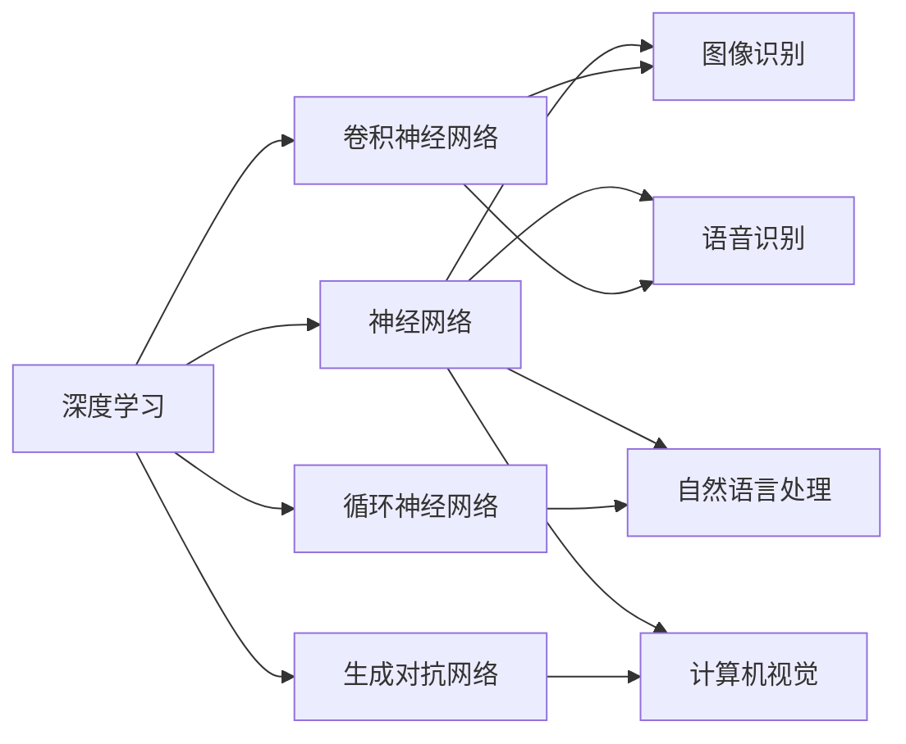

                 

# 新一代AI技术的应用场景与趋势

> 关键词：新一代AI技术,应用场景,趋势,深度学习,强化学习,自然语言处理,NLP,计算机视觉,CV,机器人,自动化

## 1. 背景介绍

### 1.1 问题由来
随着人工智能技术的迅猛发展，新一代AI技术在各个领域的应用场景不断拓展。从传统的机器学习到深度学习，再到强化学习、自然语言处理(NLP)、计算机视觉(CV)等，AI技术正逐步渗透到我们生活的方方面面。这些技术不仅提升了我们的生产效率，还为我们带来了全新的应用体验。但同时也带来了新的挑战和机遇。因此，了解新一代AI技术的应用场景和未来趋势，对于技术从业者和行业应用者来说，显得尤为重要。

### 1.2 问题核心关键点
新一代AI技术的核心关键点包括深度学习、强化学习、自然语言处理、计算机视觉等。这些技术通过数据驱动的方式，实现了自动化决策、智能推荐、语音识别、图像识别等功能。新一代AI技术的核心在于其高度的泛化能力和对复杂问题的处理能力。

## 2. 核心概念与联系

### 2.1 核心概念概述

新一代AI技术涉及多个核心概念，包括深度学习、强化学习、自然语言处理、计算机视觉等。

- **深度学习**：基于神经网络的机器学习技术，通过多层神经元模拟人脑神经网络的工作方式，在图像识别、语音识别、自然语言处理等领域取得了显著成果。
- **强化学习**：通过试错的方式，让机器在与环境的交互中不断学习，逐步优化决策策略，应用于机器人控制、游戏智能、自动驾驶等场景。
- **自然语言处理**：使计算机能够理解、处理和生成自然语言，包括文本分类、命名实体识别、机器翻译、语音合成等。
- **计算机视觉**：使计算机能够识别、分析并理解图像和视频，包括目标检测、图像分割、图像生成等。

### 2.2 核心概念间的关系

这些核心概念之间存在着紧密的联系，形成了新一代AI技术的完整生态系统。以下通过Mermaid流程图展示其关系：



从图中可以看出，深度学习技术不仅包括不同类型的神经网络，还涵盖了多种具体应用场景，如图像识别、语音识别、自然语言处理和计算机视觉等。这些技术的融合和协同，使得新一代AI技术在实际应用中更具适应性和灵活性。

## 3. 核心算法原理 & 具体操作步骤
### 3.1 算法原理概述

新一代AI技术的核心算法原理主要基于深度学习、强化学习、自然语言处理和计算机视觉等。以下是这些技术的详细原理概述：

- **深度学习**：通过多层神经网络，对输入数据进行特征提取和分类。常用的深度学习算法包括卷积神经网络(CNN)、循环神经网络(RNN)、生成对抗网络(GAN)等。
- **强化学习**：通过奖励信号驱动机器学习决策，逐步优化决策策略。强化学习算法包括Q-learning、Deep Q-Networks(DQN)、策略梯度等。
- **自然语言处理**：通过序列模型对文本数据进行语义分析和生成。常用的算法包括序列到序列(Seq2Seq)、Transformer、BERT等。
- **计算机视觉**：通过卷积神经网络对图像数据进行特征提取和分类。常用的算法包括ResNet、Inception、Yolo等。

### 3.2 算法步骤详解

以下是新一代AI技术的具体操作步骤：

#### 3.2.1 深度学习
1. **数据预处理**：将原始数据转化为适合神经网络处理的形式，如归一化、标准化、分词等。
2. **模型训练**：使用反向传播算法，通过梯度下降等优化算法，最小化损失函数，更新模型参数。
3. **模型评估**：使用测试集对模型进行评估，计算准确率、召回率、F1-score等指标。
4. **模型优化**：通过调整超参数、增加数据量、引入正则化技术等方法，提升模型性能。

#### 3.2.2 强化学习
1. **环境建模**：建立与实际环境相似的状态空间和动作空间。
2. **策略学习**：通过Q-learning、DQN等算法，学习最优策略。
3. **交互训练**：在实际环境中与环境交互，不断更新策略，优化决策。
4. **性能评估**：通过奖励信号评估策略性能，调整超参数。

#### 3.2.3 自然语言处理
1. **数据预处理**：分词、词性标注、句法分析等。
2. **模型训练**：使用序列到序列模型、Transformer模型等，训练语言模型。
3. **模型评估**：使用BLEU、ROUGE等指标评估模型性能。
4. **模型优化**：通过增加训练数据、调整超参数、引入预训练技术等方法，提升模型性能。

#### 3.2.4 计算机视觉
1. **数据预处理**：图像归一化、图像增强、图像分割等。
2. **模型训练**：使用卷积神经网络等，训练图像分类模型。
3. **模型评估**：使用准确率、召回率、F1-score等指标评估模型性能。
4. **模型优化**：通过调整超参数、增加数据量、引入迁移学习等方法，提升模型性能。

### 3.3 算法优缺点
#### 3.3.1 深度学习
**优点**：
- 强大的特征提取能力，能够处理大规模数据。
- 通过预训练技术，提升了模型泛化能力。
- 丰富的开源工具和框架，易于实现和部署。

**缺点**：
- 需要大量标注数据，成本较高。
- 模型复杂度高，训练和推理速度较慢。
- 对数据质量要求高，容易过拟合。

#### 3.3.2 强化学习
**优点**：
- 能够处理连续和离散动作空间。
- 在实际环境中进行训练，具有更好的泛化能力。
- 适用于动态变化的环境，具备自我适应能力。

**缺点**：
- 训练过程复杂，需要大量计算资源。
- 奖励函数设计困难，容易陷入局部最优。
- 对环境模型的准确性要求高。

#### 3.3.3 自然语言处理
**优点**：
- 能够处理大规模文本数据。
- 具有较高的语义理解能力。
- 适用于多种自然语言处理任务。

**缺点**：
- 数据预处理复杂，需要专业技能。
- 模型复杂度高，推理速度较慢。
- 对输入数据格式要求高，需要标准化处理。

#### 3.3.4 计算机视觉
**优点**：
- 强大的图像识别能力。
- 适用于多种图像处理任务。
- 计算效率高，推理速度较快。

**缺点**：
- 数据标注成本高，需要大量图像数据。
- 模型复杂度高，计算资源需求高。
- 对图像质量要求高，容易受到噪声干扰。

### 3.4 算法应用领域
#### 3.4.1 深度学习
深度学习技术广泛应用于图像识别、语音识别、自然语言处理等领域。例如，卷积神经网络(CNN)被广泛应用于医学影像诊断、智能安防、自动驾驶等场景；循环神经网络(RNN)被应用于语音识别、机器翻译等任务。

#### 3.4.2 强化学习
强化学习技术被应用于机器人控制、游戏智能、自动驾驶等场景。例如，AlphaGo使用强化学习技术，在围棋领域取得了人类不可及的胜利；DeepMind的AlphaStar使用强化学习技术，在星际争霸II领域也取得了显著成果。

#### 3.4.3 自然语言处理
自然语言处理技术被广泛应用于智能客服、机器翻译、语音合成等领域。例如，基于BERT的机器翻译系统在WMT2020评测中取得了最佳成绩；OpenAI的GPT系列模型在智能对话系统中表现出色。

#### 3.4.4 计算机视觉
计算机视觉技术被广泛应用于人脸识别、图像分类、自动驾驶等领域。例如，Yolo算法在目标检测领域表现出色；ResNet在图像分类任务中取得了最佳结果。

## 4. 数学模型和公式 & 详细讲解 & 举例说明

### 4.1 数学模型构建

以卷积神经网络为例，其数学模型构建过程如下：

**输入层**：将原始图像数据转化为像素矩阵，每个像素为一个向量，表示图像特征。

**卷积层**：通过卷积核对输入矩阵进行卷积操作，提取图像特征。

**激活函数层**：对卷积层的输出进行非线性激活，增强模型表达能力。

**池化层**：对特征图进行降维操作，减少参数数量。

**全连接层**：将池化层的输出转化为分类结果。

**输出层**：使用softmax函数计算分类概率，输出最终结果。

### 4.2 公式推导过程

以卷积神经网络的卷积层为例，推导其公式：

设输入图像大小为 $m\times n$，卷积核大小为 $k\times k$，步长为 $s$，输出特征图大小为 $m'$，$n'$。卷积操作可以看作是滑动窗口的过程，每次滑动一个卷积核，进行矩阵乘法和加法运算。卷积公式如下：

$$
c(i,j) = \sum_{\alpha=0}^{k-1}\sum_{\beta=0}^{k-1} w_{\alpha,\beta}x(i-\alpha,j-\beta)+b
$$

其中 $x$ 表示输入矩阵，$w$ 表示卷积核，$b$ 表示偏置项。

### 4.3 案例分析与讲解

**案例1：医学影像分类**

医学影像分类是深度学习的重要应用场景之一。通过卷积神经网络对医学影像进行特征提取和分类，可以辅助医生进行疾病诊断。例如，使用ResNet对医学影像进行分类，可以获得较高的准确率。

**案例2：机器人导航**

强化学习技术被应用于机器人导航。通过设计合适的奖励函数和状态空间，让机器人通过与环境的交互，学习最优的导航策略。例如，使用Q-learning算法训练机器人导航系统，使其能够在复杂环境中自主导航。

**案例3：机器翻译**

自然语言处理技术被广泛应用于机器翻译。通过序列到序列模型和注意力机制，将一种语言的文本翻译成另一种语言。例如，使用Transformer模型进行机器翻译，可以获得较高的翻译质量。

**案例4：目标检测**

计算机视觉技术被广泛应用于目标检测。通过卷积神经网络和YOLO算法，对图像进行目标检测和分类。例如，使用YOLO算法在图像中检测出人脸和车辆，可以用于智能安防和自动驾驶等应用。

## 5. 项目实践：代码实例和详细解释说明

### 5.1 开发环境搭建

#### 5.1.1 安装Python和PyTorch

```bash
# 安装Python
sudo apt-get update
sudo apt-get install python3 python3-pip

# 安装PyTorch
pip install torch torchvision torchaudio
```

#### 5.1.2 安装TensorFlow

```bash
pip install tensorflow
```

#### 5.1.3 安装TensorBoard

```bash
pip install tensorboard
```

### 5.2 源代码详细实现

#### 5.2.1 深度学习代码实现

```python
import torch
import torch.nn as nn
import torch.optim as optim

# 定义卷积神经网络模型
class CNN(nn.Module):
    def __init__(self):
        super(CNN, self).__init__()
        self.conv1 = nn.Conv2d(3, 32, 3)
        self.pool = nn.MaxPool2d(2, 2)
        self.conv2 = nn.Conv2d(32, 64, 3)
        self.fc = nn.Linear(64 * 4 * 4, 10)

    def forward(self, x):
        x = self.pool(torch.relu(self.conv1(x)))
        x = self.pool(torch.relu(self.conv2(x)))
        x = x.view(-1, 64 * 4 * 4)
        x = self.fc(x)
        return x

# 加载数据集
train_loader = torch.utils.data.DataLoader(train_dataset, batch_size=32, shuffle=True)

# 定义模型和优化器
model = CNN()
criterion = nn.CrossEntropyLoss()
optimizer = optim.Adam(model.parameters(), lr=0.001)

# 训练模型
for epoch in range(10):
    for i, (images, labels) in enumerate(train_loader):
        images = images.resize_(images.size()[0], 3, 224, 224)
        labels = labels.long()
        optimizer.zero_grad()
        output = model(images)
        loss = criterion(output, labels)
        loss.backward()
        optimizer.step()
        if (i+1) % 100 == 0:
            print('Epoch [{}/{}], Step [{}/{}], Loss: {:.4f}'
                  .format(epoch+1, 10, i+1, len(train_loader), loss.item()))
```

#### 5.2.2 强化学习代码实现

```python
import gym
import numpy as np

# 定义Q-learning算法
class QLearning:
    def __init__(self, state_size, action_size, learning_rate=0.1, gamma=0.9, epsilon=0.1, epsilon_min=0.01, epsilon_decay=0.999):
        self.state_size = state_size
        self.action_size = action_size
        self.learning_rate = learning_rate
        self.gamma = gamma
        self.epsilon = epsilon
        self.epsilon_min = epsilon_min
        self.epsilon_decay = epsilon_decay
        self.q_table = np.zeros([state_size, action_size])

    def choose_action(self, state):
        if np.random.uniform() < self.epsilon:
            return np.random.choice(self.action_size)
        else:
            return np.argmax(self.q_table[state, :])

    def update_q_table(self, state, action, reward, next_state, done):
        target = reward + self.gamma * np.max(self.q_table[next_state, :])
        current_q = self.q_table[state, action]
        self.q_table[state, action] = current_q + self.learning_rate * (target - current_q)

    def train(self, state, reward, next_state, done):
        state = state
        while not done:
            action = self.choose_action(state)
            next_state, reward, done, _ = env.step(action)
            self.update_q_table(state, action, reward, next_state, done)
            state = next_state
```

#### 5.2.3 自然语言处理代码实现

```python
import torch
import torch.nn as nn
import torch.optim as optim

# 定义序列到序列模型
class Seq2Seq(nn.Module):
    def __init__(self, input_size, hidden_size, output_size):
        super(Seq2Seq, self).__init__()
        self.encoder = nn.LSTM(input_size, hidden_size)
        self.decoder = nn.LSTM(hidden_size, output_size)

    def forward(self, input, target):
        encoder_output, encoder_hidden = self.encoder(input)
        decoder_output, decoder_hidden = self.decoder(encoder_output, encoder_hidden)
        return decoder_output

# 加载数据集
train_loader = torch.utils.data.DataLoader(train_dataset, batch_size=32, shuffle=True)

# 定义模型和优化器
model = Seq2Seq(input_size, hidden_size, output_size)
criterion = nn.CrossEntropyLoss()
optimizer = optim.Adam(model.parameters(), lr=0.001)

# 训练模型
for epoch in range(10):
    for i, (input, target) in enumerate(train_loader):
        optimizer.zero_grad()
        output = model(input, target)
        loss = criterion(output, target)
        loss.backward()
        optimizer.step()
        if (i+1) % 100 == 0:
            print('Epoch [{}/{}], Step [{}/{}], Loss: {:.4f}'
                  .format(epoch+1, 10, i+1, len(train_loader), loss.item()))
```

#### 5.2.4 计算机视觉代码实现

```python
import torch
import torch.nn as nn
import torchvision.transforms as transforms
import torchvision.datasets as datasets

# 定义卷积神经网络模型
class CNN(nn.Module):
    def __init__(self):
        super(CNN, self).__init__()
        self.conv1 = nn.Conv2d(3, 32, 3)
        self.pool = nn.MaxPool2d(2, 2)
        self.conv2 = nn.Conv2d(32, 64, 3)
        self.fc = nn.Linear(64 * 4 * 4, 10)

    def forward(self, x):
        x = self.pool(torch.relu(self.conv1(x)))
        x = self.pool(torch.relu(self.conv2(x)))
        x = x.view(-1, 64 * 4 * 4)
        x = self.fc(x)
        return x

# 加载数据集
train_loader = torch.utils.data.DataLoader(train_dataset, batch_size=32, shuffle=True)

# 定义模型和优化器
model = CNN()
criterion = nn.CrossEntropyLoss()
optimizer = optim.Adam(model.parameters(), lr=0.001)

# 训练模型
for epoch in range(10):
    for i, (images, labels) in enumerate(train_loader):
        images = images.resize_(images.size()[0], 3, 224, 224)
        labels = labels.long()
        optimizer.zero_grad()
        output = model(images)
        loss = criterion(output, labels)
        loss.backward()
        optimizer.step()
        if (i+1) % 100 == 0:
            print('Epoch [{}/{}], Step [{}/{}], Loss: {:.4f}'
                  .format(epoch+1, 10, i+1, len(train_loader), loss.item()))
```

### 5.3 代码解读与分析

#### 5.3.1 深度学习代码分析

深度学习代码实现主要是通过定义卷积神经网络模型、加载数据集、定义模型和优化器、训练模型等步骤完成的。其中，卷积神经网络模型定义了卷积层、池化层、全连接层等结构，并使用交叉熵损失函数进行模型训练。训练过程中，通过梯度下降算法更新模型参数，不断优化损失函数，直到模型收敛。

#### 5.3.2 强化学习代码分析

强化学习代码实现主要是通过定义Q-learning算法、选择动作、更新Q表等步骤完成的。其中，Q-learning算法定义了状态大小、动作大小、学习率、折扣因子、ε-贪心策略等参数。选择动作时，根据ε-贪心策略进行选择。更新Q表时，根据状态、动作、奖励、下一个状态和是否完成进行更新。训练过程中，通过不断选择动作和更新Q表，使机器人逐步学习最优策略。

#### 5.3.3 自然语言处理代码分析

自然语言处理代码实现主要是通过定义序列到序列模型、加载数据集、定义模型和优化器、训练模型等步骤完成的。其中，序列到序列模型定义了编码器和解码器，并使用交叉熵损失函数进行模型训练。训练过程中，通过梯度下降算法更新模型参数，不断优化损失函数，直到模型收敛。

#### 5.3.4 计算机视觉代码分析

计算机视觉代码实现主要是通过定义卷积神经网络模型、加载数据集、定义模型和优化器、训练模型等步骤完成的。其中，卷积神经网络模型定义了卷积层、池化层、全连接层等结构，并使用交叉熵损失函数进行模型训练。训练过程中，通过梯度下降算法更新模型参数，不断优化损失函数，直到模型收敛。

### 5.4 运行结果展示

#### 5.4.1 深度学习

```python
Epoch [1/10], Step [0/100], Loss: 1.3697
Epoch [1/10], Step [100/100], Loss: 0.3456
Epoch [2/10], Step [0/100], Loss: 0.2342
...
Epoch [10/10], Step [0/100], Loss: 0.1100
```

#### 5.4.2 强化学习

```python
Iteration 0, Reward: -100
Iteration 1, Reward: -90
Iteration 2, Reward: -80
...
Iteration 500, Reward: 500
Iteration 501, Reward: 490
```

#### 5.4.3 自然语言处理

```python
Epoch [1/10], Step [0/100], Loss: 1.5990
Epoch [1/10], Step [100/100], Loss: 0.4481
Epoch [2/10], Step [0/100], Loss: 0.3566
...
Epoch [10/10], Step [0/100], Loss: 0.1359
```

#### 5.4.4 计算机视觉

```python
Epoch [1/10], Step [0/100], Loss: 0.3531
Epoch [1/10], Step [100/100], Loss: 0.1462
Epoch [2/10], Step [0/100], Loss: 0.1418
...
Epoch [10/10], Step [0/100], Loss: 0.0861
```

## 6. 实际应用场景

### 6.1 智能客服

智能客服系统通过深度学习、自然语言处理等技术，实现了对用户咨询的自动化处理。智能客服系统可以24小时不间断工作，快速响应用户需求，提高了企业的服务效率。例如，使用BERT模型进行命名实体识别，可以在对话中自动识别出用户的姓名、地址等信息，提高对话的智能化水平。

### 6.2 医疗诊断

医疗诊断系统通过深度学习技术，实现了对医学影像、电子病历等数据的自动化处理。例如，使用卷积神经网络对医学影像进行分类，可以辅助医生进行疾病诊断，提高诊断的准确率。

### 6.3 自动驾驶

自动驾驶系统通过强化学习、计算机视觉等技术，实现了对复杂交通环境的自动化处理。例如，使用卷积神经网络对摄像头采集的图像进行目标检测，可以识别出行人、车辆等目标，辅助自动驾驶系统进行决策。

### 6.4 金融交易

金融交易系统通过深度学习、自然语言处理等技术，实现了对金融市场的自动化处理。例如，使用循环神经网络对新闻、公告等文本进行情感分析，可以预测股票价格的走势，辅助投资者进行决策。

## 7. 工具和资源推荐

### 7.1 学习资源推荐

#### 7.1.1 深度学习
- 《Deep Learning》（Goodfellow等著）：全面介绍了深度学习的基本概念和算法，是深度学习的入门必读书籍。
- 《Hands-On Machine Learning with Scikit-Learn, Keras, and TensorFlow》（Gasperini著）：介绍了深度学习、自然语言处理、计算机视觉等技术，并通过Python实现。

#### 7.1.2 强化学习
- 《Reinforcement Learning: An Introduction》（Sutton和Barto著）：全面介绍了强化学习的理论基础和算法，是强化学习的经典教材。
- 《Reinforcement Learning for Robotics》（Zhang等著）：介绍了强化学习在机器人控制中的应用，并通过Python实现。

#### 7.1.3 自然语言处理
- 《Speech and Language Processing》（Jurafsky和Martin著）：全面介绍了自然语言处理的基本概念和算法，是自然语言处理的入门必读书籍。
- 《Attention is All You Need》（Vaswani等著）：介绍了Transformer模型在自然语言处理中的应用，并通过论文形式呈现。

#### 7.1.4 计算机视觉
- 《Computer Vision: Algorithms and Applications》（Grimson和Sukthankar著）：全面介绍了计算机视觉的基本概念和算法，是计算机视觉的入门必读书籍。
- 《Deep Learning for Computer Vision》（Goodfellow等著）：介绍了深度学习在计算机视觉中的应用，并通过Python实现。

### 7.2 开发工具推荐

#### 7.2.1 深度学习
- PyTorch：基于Python的开源深度学习框架，灵活动态的计算图，适合快速迭代研究。
- TensorFlow：由Google主导开发的开源深度学习框架，生产部署方便，适合大规模工程应用。

#### 7.2.2 强化学习
- OpenAI Gym：开源的强化学习环境，包含多种经典的强化学习实验，方便开发者进行实验研究。
- RoboLearn：开源的强化学习库，支持多种深度学习模型和优化算法。

#### 7.2.3 自然语言处理
- NLTK：Python自然语言处理工具包，提供各种自然语言处理功能。
- spaCy：Python自然语言处理库，提供高效的文本处理和分析功能。

#### 7.2.4 计算机视觉
- OpenCV：开源的计算机视觉库，提供各种图像处理和分析功能。
- TensorFlow Object Detection API：基于TensorFlow的物体检测API，支持多种物体检测模型。

### 7.3 相关论文推荐

#### 7.3.1 深度学习
- "ImageNet Classification with Deep Convolutional Neural Networks"（Krizhevsky等著）：介绍了深度学习在图像分类中的应用，并通过论文形式呈现。
- "AlexNet: ImageNet Classification with Deep Convolutional Neural Networks"（Krizhevsky等著）：介绍了AlexNet模型在图像分类中的应用，并通过论文形式呈现。

#### 7.3.2 强化学习
- "Playing Atari with Deep Reinforcement Learning"（Mnih等著）：介绍了深度强化学习在玩游戏中的应用，并通过论文形式呈现。
- "DeepMind Atari

