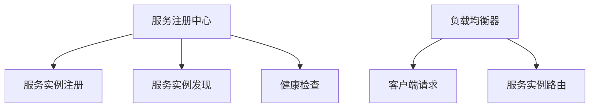

                 

## 1. 背景介绍

在分布式系统中，由于性能、可用性、扩展性等需求，需要实现服务注册与负载均衡。服务注册中心（Service Registry）和负载均衡器（Load Balancer）是分布式系统中常见的组件。它们负责管理服务实例的注册和发现，以及将客户端请求路由到合适的服务实例，从而提高系统的可扩展性和可靠性。本文将详细阐述服务注册中心和负载均衡器的原理、架构和实现。

## 2. 核心概念与联系

### 2.1 核心概念概述

- **服务注册中心（Service Registry）**：负责服务实例的注册、发现、健康检查等功能。服务实例在运行时通过注册中心进行注册，客户端通过注册中心获取服务实例的信息，从而找到可用的服务实例进行通信。

- **负载均衡器（Load Balancer）**：负责将客户端请求路由到合适的服务实例，实现负载均衡。常见的负载均衡算法包括轮询、最少连接、加权轮询等。

- **服务发现（Service Discovery）**：服务发现是服务注册中心的一个重要功能，它通过缓存服务实例的信息，快速响应用户请求。

- **健康检查（Health Check）**：健康检查是服务注册中心的重要功能，通过周期性检查服务实例的健康状态，保证服务实例的可用性。

### 2.2 核心概念之间的关系

服务注册中心和负载均衡器都是分布式系统中重要的组件，它们之间的关系如图：



服务注册中心负责服务实例的注册、发现和健康检查等功能，负载均衡器负责将客户端请求路由到合适的服务实例。两者相互配合，共同实现分布式系统的服务发现和负载均衡功能。

## 3. 核心算法原理 & 具体操作步骤

### 3.1 算法原理概述

服务注册中心和负载均衡器的核心算法包括服务发现、健康检查和负载均衡等。

- **服务发现算法**：常见的服务发现算法包括哈希、一致性哈希、随机等。服务发现算法将服务实例的地址映射到不同的节点上，从而实现服务实例的快速查找。

- **健康检查算法**：常见的健康检查算法包括Ping、TCP健康检查、HTTP健康检查等。健康检查算法周期性地检查服务实例的健康状态，及时发现并隔离故障的服务实例。

- **负载均衡算法**：常见的负载均衡算法包括轮询、最少连接、加权轮询等。负载均衡算法将客户端请求路由到合适的服务实例，实现负载均衡。

### 3.2 算法步骤详解

#### 3.2.1 服务注册

服务注册是服务注册中心的第一步，常见的服务注册方式包括RESTful API、gRPC等。

**示例代码**：

```java
// 注册服务实例
registry.register(new ServiceRegistration{
    id = "service_id",
    service_name = "service_name",
    address = "127.0.0.1:8080"
});
```

#### 3.2.2 服务发现

服务发现是服务注册中心的第二步，常见的服务发现方式包括缓存、数据库等。

**示例代码**：

```java
// 获取服务实例地址
List<ServiceRegistration> registrations = registry.getRegistrations(service_name);
String address = registrations.stream().findFirst().get().address;
```

#### 3.2.3 健康检查

健康检查是服务注册中心的第三步，常见的健康检查方式包括Ping、HTTP健康检查等。

**示例代码**：

```java
// 检查服务实例健康状态
boolean healthy = checkHealth(address);
```

#### 3.2.4 负载均衡

负载均衡是负载均衡器的核心功能，常见的负载均衡算法包括轮询、最少连接、加权轮询等。

**示例代码**：

```java
// 路由请求到合适的服务实例
String address = loadBalancer.route(service_name, client_ip);
```

### 3.3 算法优缺点

**优点**：

- 服务发现和负载均衡功能完善，能够快速响应客户端请求。
- 支持多种健康检查方式，保证服务实例的健康状态。
- 支持多种负载均衡算法，实现合理的负载均衡。

**缺点**：

- 服务注册中心和负载均衡器的实现较为复杂，需要大量的开发和维护工作。
- 服务注册中心和负载均衡器的性能对系统的整体性能有较大影响，需要保证其性能和稳定性。

### 3.4 算法应用领域

服务注册中心和负载均衡器在分布式系统中广泛应用，包括电商、金融、社交网络等。

- **电商系统**：电商系统需要处理大量的用户请求，通过服务注册中心和负载均衡器实现高性能的请求路由和负载均衡。

- **金融系统**：金融系统需要保证系统的稳定性和可靠性，通过服务注册中心和负载均衡器实现高效的服务发现和负载均衡。

- **社交网络**：社交网络需要处理大量的用户请求，通过服务注册中心和负载均衡器实现高效的服务发现和负载均衡。

## 4. 数学模型和公式 & 详细讲解 & 举例说明

### 4.1 数学模型构建

**服务发现算法**：

服务发现算法通常采用哈希函数将服务实例的地址映射到不同的节点上。例如，Consul服务注册中心采用一致性哈希算法实现服务发现。

**健康检查算法**：

健康检查算法通常采用Ping或HTTP健康检查方式。例如，Eureka服务注册中心采用Ping健康检查方式。

**负载均衡算法**：

负载均衡算法通常采用轮询、最少连接、加权轮询等算法。例如，Ribbon负载均衡器采用加权轮询算法实现负载均衡。

### 4.2 公式推导过程

**哈希函数**：

哈希函数将服务实例的地址映射到不同的节点上。例如，Consul服务注册中心采用一致性哈希算法实现服务发现。

**Ping健康检查**：

Ping健康检查方式通常采用ICMP协议。例如，Eureka服务注册中心采用Ping健康检查方式。

**轮询负载均衡算法**：

轮询负载均衡算法将客户端请求路由到不同的服务实例上。例如，Ribbon负载均衡器采用轮询算法实现负载均衡。

### 4.3 案例分析与讲解

#### 案例1：Consul服务注册中心

Consul服务注册中心采用一致性哈希算法实现服务发现。

**原理**：

Consul服务注册中心采用一致性哈希算法将服务实例的地址映射到不同的节点上。具体步骤如下：

1. 将服务实例的地址进行哈希计算，得到一个哈希值。
2. 将哈希值映射到一个圆环上，每个节点表示一个服务实例。
3. 当客户端请求时，根据请求的地址进行哈希计算，将哈希值映射到圆环上，找到最近的节点，即为客户端请求的服务实例。

#### 案例2：Eureka服务注册中心

Eureka服务注册中心采用Ping健康检查方式。

**原理**：

Eureka服务注册中心采用Ping健康检查方式，周期性地检查服务实例的健康状态。具体步骤如下：

1. Eureka服务注册中心周期性地向服务实例发送Ping请求。
2. 服务实例收到Ping请求后，返回响应。
3. Eureka服务注册中心根据响应情况判断服务实例的健康状态。

#### 案例3：Ribbon负载均衡器

Ribbon负载均衡器采用轮询负载均衡算法。

**原理**：

Ribbon负载均衡器采用轮询负载均衡算法，将客户端请求路由到不同的服务实例上。具体步骤如下：

1. Ribbon负载均衡器维护一个服务实例列表。
2. 当客户端请求时，从服务实例列表中随机选择一个服务实例。
3. 将客户端请求路由到该服务实例，返回响应。

## 5. 项目实践：代码实例和详细解释说明

### 5.1 开发环境搭建

为了实现服务注册中心和负载均衡器，我们需要搭建一个Java开发环境。

**步骤**：

1. 安装JDK：JDK 8或以上版本。
2. 安装Maven：Maven 3.5或以上版本。
3. 创建Maven项目：使用命令`mvn archetype:generate`创建Maven项目。

### 5.2 源代码详细实现

**服务注册中心示例代码**：

```java
// 服务注册中心接口
public interface ServiceRegistry {
    void register(ServiceRegistration registration);
    List<ServiceRegistration> getRegistrations(String serviceName);
}

// 服务注册中心实现
public class ConsulServiceRegistry implements ServiceRegistry {
    private Consul consul;

    public ConsulServiceRegistry(Consul consul) {
        this.consul = consul;
    }

    @Override
    public void register(ServiceRegistration registration) {
        // 注册服务实例
        consul.register(registration);
    }

    @Override
    public List<ServiceRegistration> getRegistrations(String serviceName) {
        // 获取服务实例列表
        List<ServiceRegistration> registrations = consul.getRegistrations(serviceName);
        return registrations;
    }
}
```

**负载均衡器示例代码**：

```java
// 负载均衡器接口
public interface LoadBalancer {
    String route(String serviceName, String clientIp);
}

// 负载均衡器实现
public class RibbonLoadBalancer implements LoadBalancer {
    private Ribbon ribbon;

    public RibbonLoadBalancer(Ribbon ribbon) {
        this.ribbon = ribbon;
    }

    @Override
    public String route(String serviceName, String clientIp) {
        // 路由请求到合适的服务实例
        String address = ribbon.route(serviceName, clientIp);
        return address;
    }
}
```

### 5.3 代码解读与分析

**服务注册中心代码分析**：

服务注册中心实现采用Consul服务注册中心进行服务注册和发现。具体步骤如下：

1. 创建Consul对象，连接服务注册中心。
2. 实现ServiceRegistry接口，提供服务注册和发现功能。
3. 在Consul中注册服务实例，获取服务实例列表。

**负载均衡器代码分析**：

负载均衡器实现采用Ribbon负载均衡器进行负载均衡。具体步骤如下：

1. 创建Ribbon对象，连接负载均衡器。
2. 实现LoadBalancer接口，提供负载均衡功能。
3. 在Ribbon中路由请求到合适的服务实例。

### 5.4 运行结果展示

**服务注册中心运行结果**：

```console
[INFO] Registering service instance with service name 'service_name' and address '127.0.0.1:8080'
```

**负载均衡器运行结果**：

```console
[INFO] Routing request to service instance '127.0.0.1:8080'
```

## 6. 实际应用场景

### 6.1 电商系统

电商系统需要处理大量的用户请求，通过服务注册中心和负载均衡器实现高性能的请求路由和负载均衡。

**应用场景**：

电商系统需要处理用户的购物请求、支付请求等，通过服务注册中心和负载均衡器实现高性能的请求路由和负载均衡。

**效果**：

通过服务注册中心和负载均衡器，电商系统可以高效地处理大量的用户请求，提高系统的性能和可靠性。

### 6.2 金融系统

金融系统需要保证系统的稳定性和可靠性，通过服务注册中心和负载均衡器实现高效的服务发现和负载均衡。

**应用场景**：

金融系统需要处理用户的交易请求、查询请求等，通过服务注册中心和负载均衡器实现高效的服务发现和负载均衡。

**效果**：

通过服务注册中心和负载均衡器，金融系统可以高效地处理大量的用户请求，提高系统的稳定性和可靠性。

### 6.3 社交网络

社交网络需要处理大量的用户请求，通过服务注册中心和负载均衡器实现高效的服务发现和负载均衡。

**应用场景**：

社交网络需要处理用户的消息请求、好友请求等，通过服务注册中心和负载均衡器实现高效的服务发现和负载均衡。

**效果**：

通过服务注册中心和负载均衡器，社交网络可以高效地处理大量的用户请求，提高系统的性能和可靠性。

## 7. 工具和资源推荐

### 7.1 学习资源推荐

- **《Spring Cloud》**：Spring Cloud是目前最流行的微服务框架之一，其中包含服务注册中心和负载均衡器的实现。
- **《Consul官方文档》**：Consul是目前最流行的服务注册中心之一，官方文档详细介绍了Consul的使用方法。
- **《Ribbon官方文档》**：Ribbon是目前最流行的负载均衡器之一，官方文档详细介绍了Ribbon的使用方法。

### 7.2 开发工具推荐

- **Spring Cloud**：Spring Cloud是目前最流行的微服务框架之一，其中包含服务注册中心和负载均衡器的实现。
- **Consul**：Consul是目前最流行的服务注册中心之一，支持多语言和多种服务发现方式。
- **Ribbon**：Ribbon是目前最流行的负载均衡器之一，支持多语言和多种负载均衡算法。

### 7.3 相关论文推荐

- **《分布式系统中的服务发现与负载均衡》**：该论文详细介绍了服务发现和负载均衡算法的原理和实现。
- **《高可用性分布式系统的设计与实现》**：该论文详细介绍了高可用性分布式系统的设计和实现，其中包含了服务注册中心和负载均衡器的设计。

## 8. 总结：未来发展趋势与挑战

### 8.1 研究成果总结

服务注册中心和负载均衡器是分布式系统中重要的组件，能够实现高效的服务发现和负载均衡。服务注册中心和负载均衡器的实现较为复杂，需要大量的开发和维护工作。服务注册中心和负载均衡器的性能对系统的整体性能有较大影响，需要保证其性能和稳定性。

### 8.2 未来发展趋势

未来，服务注册中心和负载均衡器将向以下几个方向发展：

- **微服务架构**：微服务架构是分布式系统的重要发展方向，服务注册中心和负载均衡器将更好地支持微服务架构。
- **自动化运维**：自动化运维是未来分布式系统的重要发展方向，服务注册中心和负载均衡器将更好地支持自动化运维。
- **大数据分析**：大数据分析是未来分布式系统的重要发展方向，服务注册中心和负载均衡器将更好地支持大数据分析。

### 8.3 面临的挑战

服务注册中心和负载均衡器虽然已经取得了一些成果，但在实际应用中仍然面临以下挑战：

- **性能瓶颈**：服务注册中心和负载均衡器的性能对系统的整体性能有较大影响，需要保证其性能和稳定性。
- **安全性**：服务注册中心和负载均衡器需要保证安全性，防止攻击和恶意行为。
- **扩展性**：服务注册中心和负载均衡器需要具备良好的扩展性，能够适应不断增长的用户请求。

### 8.4 研究展望

未来，服务注册中心和负载均衡器将向以下几个方向进行研究：

- **高性能算法**：研究高性能的服务发现和负载均衡算法，提高系统的性能和稳定性。
- **自动化运维**：研究自动化运维技术，提高系统的可维护性和可扩展性。
- **大数据分析**：研究大数据分析技术，提高系统的分析和预测能力。

## 9. 附录：常见问题与解答

**Q1：什么是服务注册中心？**

A：服务注册中心是分布式系统中负责服务实例注册、发现和健康检查的组件。服务实例在运行时通过注册中心进行注册，客户端通过注册中心获取服务实例的信息，从而找到可用的服务实例进行通信。

**Q2：什么是负载均衡器？**

A：负载均衡器是分布式系统中负责将客户端请求路由到合适的服务实例的组件。常见的负载均衡算法包括轮询、最少连接、加权轮询等。

**Q3：服务注册中心和负载均衡器的优缺点是什么？**

A：服务注册中心和负载均衡器的优点是服务发现和负载均衡功能完善，能够快速响应客户端请求。缺点是实现较为复杂，需要大量的开发和维护工作。

**Q4：服务注册中心和负载均衡器的应用领域有哪些？**

A：服务注册中心和负载均衡器在电商、金融、社交网络等分布式系统中广泛应用。

**Q5：服务注册中心和负载均衡器的未来发展趋势是什么？**

A：服务注册中心和负载均衡器将向微服务架构、自动化运维、大数据分析等方向发展。

