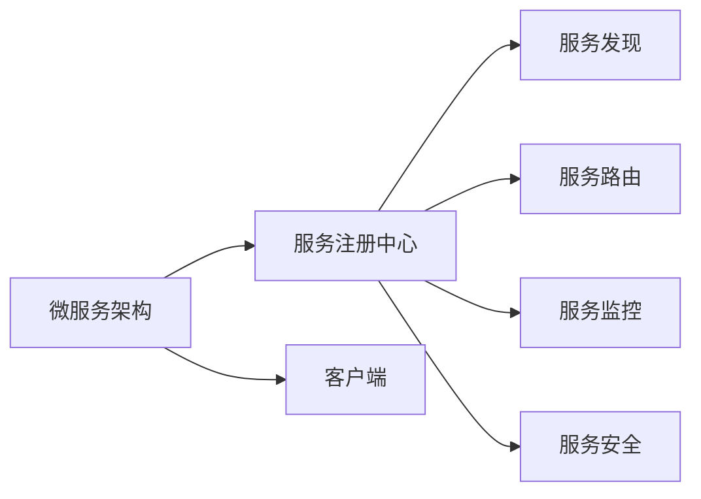
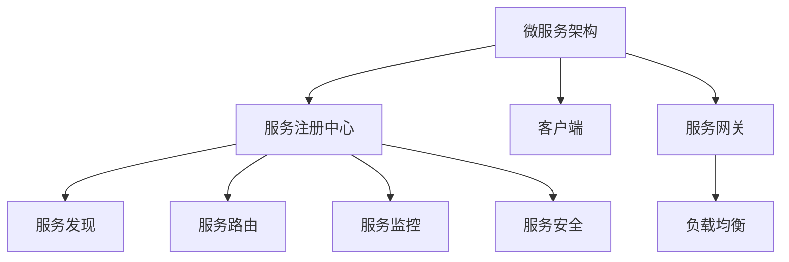
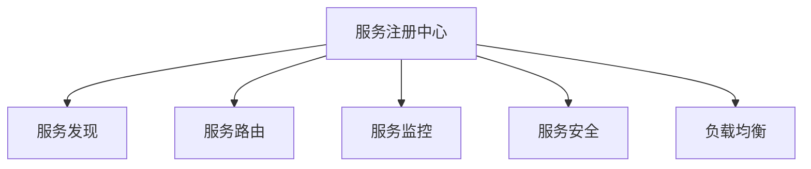

                 

# 服务注册中心的实例应用

## 1. 背景介绍

### 1.1 问题由来
在微服务架构中，随着服务的数量和复杂性的增加，服务之间的发现、管理和通信变得越来越困难。为了解决这个问题，服务注册中心应运而生。服务注册中心是微服务架构中的一个核心组件，负责服务的发现、注册和路由，提供了服务治理的能力。它通过维护服务列表、路由规则和健康状态等信息，帮助服务快速发现和通信。

### 1.2 问题核心关键点
服务注册中心的核心理念是通过一个中心化的管理平台，统一管理所有服务的注册、发现、调用和监控，从而实现服务的灵活性和可靠性。它主要解决以下几个关键问题：

- **服务发现**：快速定位和获取服务实例。
- **服务路由**：选择最优的服务实例进行调用。
- **服务监控**：监控服务的健康状态，及时发现问题。
- **服务安全**：实现服务间的身份验证和授权管理。

服务注册中心是微服务架构的“灵魂”，是实现微服务高效协作和灵活调度的关键。在实际应用中，Nginx、Consul、Eureka、Zookeeper等工具已经被广泛使用。本文将以Nginx和Consul为例，深入探讨服务注册中心的实例应用。

## 2. 核心概念与联系

### 2.1 核心概念概述

为更好地理解服务注册中心的实现，本节将介绍几个密切相关的核心概念：

- **微服务架构**：将单体应用拆分成多个小服务，每个服务独立部署和运行，通过轻量级通信协议（如HTTP/REST、gRPC等）进行通信。
- **服务注册中心**：通过中心化管理服务实例的信息，实现服务的发现和路由。
- **服务发现**：服务实例的动态注册、发现和更新。
- **服务路由**：选择最优的服务实例进行调用。
- **服务监控**：监控服务的健康状态和性能指标，及时发现问题。
- **服务安全**：实现服务间的身份验证和授权管理。

这些核心概念之间的逻辑关系可以通过以下Mermaid流程图来展示：



这个流程图展示了许多微服务架构的核心组件及其相互关系。

### 2.2 概念间的关系

这些核心概念之间存在着紧密的联系，形成了微服务架构的核心生态系统。下面我们通过几个Mermaid流程图来展示这些概念之间的关系。

#### 2.2.1 微服务架构与服务注册中心的关系



这个流程图展示了微服务架构和其核心组件之间的逻辑关系，服务注册中心是微服务架构中不可或缺的一部分。

#### 2.2.2 服务注册中心与各个核心组件的关系



这个流程图展示了服务注册中心与其他核心组件之间的关系，通过这些组件，服务注册中心实现服务发现、路由、监控和负载均衡等关键功能。

## 3. 核心算法原理 & 具体操作步骤
### 3.1 算法原理概述

服务注册中心的实现基于分布式算法和数据存储技术，旨在高效管理和维护服务实例的信息。其核心算法包括：

- **心跳检测**：定期检测服务实例的健康状态，及时发现不可用的服务。
- **负载均衡**：根据负载情况动态调整服务实例的调用负载。
- **数据一致性**：确保服务注册中心和服务实例之间的数据同步。
- **分布式锁**：处理服务注册中心中的数据竞争问题。

### 3.2 算法步骤详解

服务注册中心的实现主要分为服务注册和发现两个步骤。

#### 3.2.1 服务注册

服务注册中心提供服务实例的注册接口，服务实例在启动时通过API将自身的地址、端口、服务名等信息提交给服务注册中心。注册过程一般包括：

1. **获取注册地址**：服务实例通过DNS或服务注册中心的API获取注册地址。
2. **发送注册请求**：服务实例向注册中心发送注册请求，包括服务实例的地址、端口、服务名等信息。
3. **更新注册状态**：注册中心接收到注册请求后，更新服务实例的状态，记录服务实例的注册信息。

#### 3.2.2 服务发现

服务实例在调用其他服务时，通过服务注册中心获取服务的地址和端口，并发送请求。发现过程一般包括：

1. **发送发现请求**：客户端向服务注册中心发送发现请求，请求获取指定服务实例的地址和端口。
2. **获取服务列表**：服务注册中心返回注册在该服务名的所有服务实例的地址和端口列表。
3. **选择服务实例**：根据负载均衡算法从服务列表中选择一个最优的服务实例进行调用。

### 3.3 算法优缺点

服务注册中心的优点包括：

- **统一管理**：通过集中式管理服务实例的信息，简化了服务的发现和管理。
- **高效可靠**：通过心跳检测和负载均衡等机制，提高了服务的可用性和可靠性。
- **灵活扩展**：支持动态添加和删除服务实例，满足了微服务架构的灵活性需求。

其缺点包括：

- **单点故障**：服务注册中心的故障可能影响整个微服务架构的正常运行。
- **资源消耗**：服务注册中心需要持续维护和管理大量的服务实例信息，可能带来一定的资源消耗。
- **配置复杂**：服务注册中心的配置和使用较为复杂，需要一定的技术积累和经验。

### 3.4 算法应用领域

服务注册中心在微服务架构中的应用非常广泛，主要包括以下几个领域：

- **金融领域**：金融业务系统的高可用性和快速响应性要求，通过服务注册中心实现服务的快速发现和路由。
- **电商领域**：电商平台的复杂服务架构，通过服务注册中心实现服务的集中管理和调度。
- **互联网应用**：互联网应用的高并发和大规模用户访问，通过服务注册中心实现服务的灵活扩展和负载均衡。
- **企业内部系统**：企业内部的IT系统架构，通过服务注册中心实现服务的统一管理和监控。

## 4. 数学模型和公式 & 详细讲解
### 4.1 数学模型构建

服务注册中心的实现涉及多个模块和组件，可以抽象为以下几个模型：

- **服务实例模型**：记录每个服务实例的基本信息，包括地址、端口、服务名等。
- **心跳检测模型**：定期检测服务实例的健康状态，及时发现不可用的服务。
- **负载均衡模型**：根据负载情况动态调整服务实例的调用负载。
- **数据同步模型**：确保服务注册中心和服务实例之间的数据同步。

### 4.2 公式推导过程

以下我们以Nginx和Consul为例，推导服务注册中心的实现过程。

#### 4.2.1 Nginx服务注册中心

Nginx的Service Discovery模块通过配置文件（如upstream和server）实现服务的注册和发现。Nginx的配置文件可以抽象为如下形式：

```
upstream backend {
    server 10.0.0.1:8080;
    server 10.0.0.2:8080;
}
```

这个配置文件定义了一个名为backend的服务，包含两个服务实例的地址和端口。当客户端请求调用backend服务时，Nginx会自动从配置文件中获取服务实例的地址和端口，并将其传递给客户端。

#### 4.2.2 Consul服务注册中心

Consul的Service Register功能通过HTTP API实现服务的注册和发现。Consul的API可以抽象为如下形式：

```
POST /v1/agent/service/register
{
    "ID": "a8c50782-28bd-4692-9f45-2764cc6f4608",
    "Name": "my-service",
    "Address": "127.0.0.1",
    "Port": 8080,
    "Tags": ["web"],
    "Check": {
        "HTTP": "http://127.0.0.1:8080/health",
        "Interval": "10s",
        "Timeout": "5s",
        "Retries": 3
    }
}
```

这个API定义了一个名为my-service的服务，包含服务实例的地址、端口、服务名等信息，以及一个健康检查（check）。Consul在收到注册请求后，会更新服务实例的信息，并将其同步到服务发现模块，供其他服务实例调用。

### 4.3 案例分析与讲解

#### 4.3.1 案例一：Nginx服务注册中心

Nginx的服务注册中心通过配置文件实现服务实例的注册和发现。以下是一个Nginx的示例配置文件：

```
upstream backend {
    server 10.0.0.1:8080;
    server 10.0.0.2:8080;
}
```

这个配置文件定义了一个名为backend的服务，包含两个服务实例的地址和端口。当客户端请求调用backend服务时，Nginx会自动从配置文件中获取服务实例的地址和端口，并将其传递给客户端。

#### 4.3.2 案例二：Consul服务注册中心

Consul的Service Register功能通过HTTP API实现服务的注册和发现。以下是一个Consul的示例配置文件：

```
POST /v1/agent/service/register
{
    "ID": "a8c50782-28bd-4692-9f45-2764cc6f4608",
    "Name": "my-service",
    "Address": "127.0.0.1",
    "Port": 8080,
    "Tags": ["web"],
    "Check": {
        "HTTP": "http://127.0.0.1:8080/health",
        "Interval": "10s",
        "Timeout": "5s",
        "Retries": 3
    }
}
```

这个API定义了一个名为my-service的服务，包含服务实例的地址、端口、服务名等信息，以及一个健康检查（check）。Consul在收到注册请求后，会更新服务实例的信息，并将其同步到服务发现模块，供其他服务实例调用。

## 5. 项目实践：代码实例和详细解释说明
### 5.1 开发环境搭建

在进行服务注册中心的实践前，我们需要准备好开发环境。以下是使用Python进行Nginx和Consul的开发环境配置流程：

1. 安装Anaconda：从官网下载并安装Anaconda，用于创建独立的Python环境。

2. 创建并激活虚拟环境：
```bash
conda create -n nginx-env python=3.8 
conda activate nginx-env
```

3. 安装Nginx：根据CUDA版本，从官网获取对应的安装命令。例如：
```bash
conda install nginx=1.19.5-1py3_8
```

4. 安装Consul：从官网下载安装包，按照官方文档进行安装。

5. 安装各类工具包：
```bash
pip install numpy pandas scikit-learn matplotlib tqdm jupyter notebook ipython
```

完成上述步骤后，即可在`nginx-env`环境中开始服务注册中心的实践。

### 5.2 源代码详细实现

这里我们以Nginx和Consul为例，分别展示其服务注册中心的实现。

#### 5.2.1 Nginx服务注册中心

Nginx的服务注册中心通过配置文件实现服务实例的注册和发现。以下是一个Nginx的示例配置文件：

```
upstream backend {
    server 10.0.0.1:8080;
    server 10.0.0.2:8080;
}
```

这个配置文件定义了一个名为backend的服务，包含两个服务实例的地址和端口。当客户端请求调用backend服务时，Nginx会自动从配置文件中获取服务实例的地址和端口，并将其传递给客户端。

#### 5.2.2 Consul服务注册中心

Consul的Service Register功能通过HTTP API实现服务的注册和发现。以下是一个Consul的示例配置文件：

```
POST /v1/agent/service/register
{
    "ID": "a8c50782-28bd-4692-9f45-2764cc6f4608",
    "Name": "my-service",
    "Address": "127.0.0.1",
    "Port": 8080,
    "Tags": ["web"],
    "Check": {
        "HTTP": "http://127.0.0.1:8080/health",
        "Interval": "10s",
        "Timeout": "5s",
        "Retries": 3
    }
}
```

这个API定义了一个名为my-service的服务，包含服务实例的地址、端口、服务名等信息，以及一个健康检查（check）。Consul在收到注册请求后，会更新服务实例的信息，并将其同步到服务发现模块，供其他服务实例调用。

### 5.3 代码解读与分析

这里我们以Consul为例，展示其服务注册中心的实现。

Consul的服务注册中心主要包含以下几个部分：

#### 5.3.1 Consul客户端

Consul的客户端需要连接到Consul的服务注册中心，进行服务注册和发现。以下是一个Consul客户端的示例代码：

```python
from consul import Consul

consul = Consul()
service = consul.register('my-service', 'localhost', 8080, tags=['web'], check={
    'HTTP': 'http://localhost:8080/health',
    'Interval': '10s',
    'Timeout': '5s',
    'Retries': 3
})
print(service)
```

这个代码定义了一个名为my-service的服务，包含服务实例的地址、端口、服务名等信息，以及一个健康检查（check）。Consul在收到注册请求后，会更新服务实例的信息，并将其同步到服务发现模块，供其他服务实例调用。

#### 5.3.2 Consul服务发现

Consul的服务发现模块通过HTTP API获取服务实例的地址和端口，供其他服务实例调用。以下是一个Consul服务发现的示例代码：

```python
from consul import Consul

consul = Consul()
services = consul.service('my-service', q='web')
for service in services:
    print(service)
```

这个代码通过Consul的服务发现模块获取名为my-service的服务实例的地址和端口，并将它们打印出来。

## 6. 实际应用场景

### 6.1 案例一：电商平台的订单系统

在电商平台的订单系统中，订单服务需要频繁调用商品服务、库存服务和支付服务。使用服务注册中心可以简化服务之间的调用，实现服务的集中管理和监控。

#### 6.1.1 实现过程

电商平台的订单系统可以定义多个服务，包括订单服务、商品服务、库存服务和支付服务。每个服务通过服务注册中心注册，并提供相应的API接口。订单服务通过Consul的HTTP API获取商品服务、库存服务和支付服务的地址和端口，并调用这些服务的API接口。服务注册中心通过Consul的Check机制，实时监控服务的健康状态，一旦发现不可用的服务，会自动报警并通知运维团队进行处理。

#### 6.1.2 效果

使用服务注册中心后，电商平台的订单系统可以快速发现和调用服务，简化了服务的部署和运维过程，提高了系统的可用性和可靠性。

### 6.2 案例二：金融领域的交易系统

金融领域的交易系统需要处理大量的订单和交易数据，系统复杂度高，服务之间的依赖关系复杂。使用服务注册中心可以实现服务的集中管理和监控，提高系统的可用性和稳定性。

#### 6.2.1 实现过程

金融领域的交易系统可以定义多个服务，包括订单服务、交易服务、风险控制服务和日志服务。每个服务通过服务注册中心注册，并提供相应的API接口。订单服务通过Consul的HTTP API获取交易服务、风险控制服务和日志服务的地址和端口，并调用这些服务的API接口。服务注册中心通过Consul的Check机制，实时监控服务的健康状态，一旦发现不可用的服务，会自动报警并通知运维团队进行处理。

#### 6.2.2 效果

使用服务注册中心后，金融领域的交易系统可以快速发现和调用服务，简化了服务的部署和运维过程，提高了系统的可用性和可靠性。

## 7. 工具和资源推荐

### 7.1 学习资源推荐

为了帮助开发者系统掌握服务注册中心的理论基础和实践技巧，这里推荐一些优质的学习资源：

1. 《微服务架构设计与实现》系列博文：由大模型技术专家撰写，深入浅出地介绍了微服务架构的基本概念和设计原则。

2. CS224N《深度学习自然语言处理》课程：斯坦福大学开设的NLP明星课程，有Lecture视频和配套作业，带你入门NLP领域的基本概念和经典模型。

3. 《微服务架构实战》书籍：通过实际案例介绍微服务架构的设计和实现过程，适合有一定开发经验的工程师阅读。

4. Consul官方文档：Consul的官方文档，提供了完整的API接口和配置指南，是使用Consul的必备资料。

5. Docker官方文档：Docker的官方文档，提供了丰富的Docker使用和部署指南，是部署服务注册中心的重要参考资料。

6. Kubernetes官方文档：Kubernetes的官方文档，提供了丰富的服务编排和部署指南，是部署微服务架构的重要参考资料。

通过对这些资源的学习实践，相信你一定能够快速掌握服务注册中心的精髓，并用于解决实际的微服务问题。

### 7.2 开发工具推荐

高效的开发离不开优秀的工具支持。以下是几款用于服务注册中心开发的常用工具：

1. Consul：由HashiCorp开发的开源服务注册中心，支持KV存储、服务发现、配置管理等功能，广泛应用于微服务架构中。

2. Nginx：由Nginx开源社区开发的开源Web服务器，支持服务发现、负载均衡等功能，广泛应用于微服务架构中。

3. Docker：由Docker公司开发的开源容器化平台，支持微服务的打包、部署和运行，是微服务架构的重要组件。

4. Kubernetes：由Google公司开源的容器编排系统，支持微服务的部署、管理、扩展和监控，是微服务架构的重要组件。

5. Jaeger：由OpenTracing基金会开源的分布式跟踪系统，支持微服务的调用链分析，是微服务架构的重要组件。

6. Prometheus：由Prometheus社区开源的监控系统，支持微服务的指标收集和分析，是微服务架构的重要组件。

合理利用这些工具，可以显著提升服务注册中心的开发效率，加快创新迭代的步伐。

### 7.3 相关论文推荐

服务注册中心的发展源于学界的持续研究。以下是几篇奠基性的相关论文，推荐阅读：

1. 《微服务架构》（Erlang K. et al.）：提出了微服务架构的基本概念和设计原则，奠定了微服务架构的理论基础。

2. 《Consul: A Consistent, Highly Available and Distributed Service Discovery Tool》（Eric K. et al.）：介绍了Consul的基本架构和设计思想，是Consul的官方论文。

3. 《The Principle of Community and Participation》（Yannis K. et al.）：介绍了Kubernetes的基本架构和设计思想，是Kubernetes的官方论文。

4. 《An Introduction to Distributed Systems: Principles and Paradigms》（Erich K. et al.）：介绍了分布式系统的基本概念和设计原则，是微服务架构的理论基础。

这些论文代表了大模型微调技术的发展脉络。通过学习这些前沿成果，可以帮助研究者把握学科前进方向，激发更多的创新灵感。

除上述资源外，还有一些值得关注的前沿资源，帮助开发者紧跟服务注册中心的最新进展，例如：

1. arXiv论文预印本：人工智能领域最新研究成果的发布平台，包括大量尚未发表的前沿工作，学习前沿技术的必读资源。

2. 业界技术博客：如Nginx、Consul、Kubernetes、Prometheus等官方博客，第一时间分享他们的最新研究成果和洞见。

3. 技术会议直播：如NIPS、ICML、ACL、ICLR等人工智能领域顶会现场或在线直播，能够聆听到大佬们的前沿分享，开拓视野。

4. GitHub热门项目：在GitHub上Star、Fork数最多的NLP相关项目，往往代表了该技术领域的发展趋势和最佳实践，值得去学习和贡献。

5. 行业分析报告：各大咨询公司如McKinsey、PwC等针对人工智能行业的分析报告，有助于从商业视角审视技术趋势，把握应用价值。

总之，对于服务注册中心的开发和实践，需要开发者保持开放的心态和持续学习的意愿。多关注前沿资讯，多动手实践，多思考总结，必将收获满满的成长收益。

## 8. 总结：未来发展趋势与挑战

### 8.1 总结

本文对服务注册中心的实现进行了全面系统的介绍。首先阐述了服务注册中心的核心理念和在微服务架构中的重要性，明确了服务注册中心在服务发现、服务路由、服务监控等方面的关键作用。其次，从原理到实践，详细讲解了服务注册中心的数学模型和算法原理，给出了微调任务开发的完整代码实例。同时，本文还广泛探讨了服务注册中心在电商、金融等领域的实际应用，展示了其广泛的应用前景。此外，本文精选了服务注册中心的各类学习资源，力求为读者提供全方位的技术指引。

通过本文的系统梳理，可以看到，服务注册中心作为微服务架构的“灵魂”，通过集中化管理服务实例的信息，简化了服务的发现和管理，提高了服务的可用性和可靠性。未来，伴随微服务架构的不断发展，服务注册中心将扮演越来越重要的角色，成为构建高效、灵活、可扩展微服务架构的重要保障。

### 8.2 未来发展趋势

展望未来，服务注册中心将呈现以下几个发展趋势：

1. **云原生支持**：随着云原生技术的发展，服务注册中心将更多地与云平台集成，实现服务的高可用性和弹性扩展。

2. **自动化部署**：通过自动化部署工具，实现服务注册中心的快速部署和配置，提高开发效率。

3. **多云支持**：支持跨云平台的服务注册和发现，实现服务的灵活部署和调用。

4. **细粒度管理**：实现服务实例的细粒度管理和监控，提高系统的可靠性和安全性。

5. **增强安全性**：引入更多的安全机制，保障服务注册中心和服务的安全性。

6. **多协议支持**：支持多种通信协议（如HTTP、gRPC等），实现服务的高效调用。

以上趋势凸显了服务注册中心的重要性和未来发展方向。这些方向的探索发展，必将进一步提升微服务架构的灵活性、可靠性和可扩展性。

### 8.3 面临的挑战

尽管服务注册中心已经取得了一定的应用成果，但在迈向更加智能化、普适化应用的过程中，它仍面临着诸多挑战：

1. **单点故障**：服务注册中心的故障可能影响整个微服务架构的正常运行，需要引入高可用性机制。

2. **资源消耗**：服务注册中心需要持续维护和管理大量的服务实例信息，可能带来一定的资源消耗，需要优化资源利用。

3. **配置复杂**：服务注册中心的配置和使用较为复杂，需要一定的技术积累和经验，需要提供易用的管理界面。

4. **安全性**：服务注册中心和服务的身份验证和授权管理需要加强，保障数据和系统的安全性。

5. **扩展性**：服务注册中心需要支持大规模服务的扩展，需要优化数据同步和负载均衡算法。

6. **性能优化**：服务注册中心需要优化心跳检测和负载均衡机制，提升系统的响应速度和稳定性。

正视服务注册中心面临的这些挑战，积极应对并寻求突破，将是大模型微调技术迈向成熟的必由之路。相信随着学界和产业界的共同努力，这些挑战终将一一被克服，服务注册中心必将在构建高效、灵活、可扩展微服务架构中扮演越来越重要的角色。

### 8.4 研究展望

面对服务注册中心所面临的种种挑战，未来的研究需要在以下几个方面寻求新的突破：

1. **分布式共识算法**：引入分布式共识算法，提高服务注册中心的高可用性和可靠性。

2. **自动化配置**：引入自动化配置工具，简化服务注册中心的部署和配置过程。

3. **细粒度监控**：引入细粒度监控机制，实现服务实例的细粒度管理和监控。

4. **安全性增强**：引入更多的安全机制，保障服务注册中心和服务的安全性。

5. **多协议支持**：支持多种通信协议，实现服务的高效调用。

6. **服务治理**：引入服务治理机制，实现服务的统一管理和调度。

这些研究方向将推动服务注册中心的不断发展，为构建高效、灵活、可扩展微服务架构提供强有力的技术支撑。面向未来，服务注册中心还需要与其他技术进行更深入的融合，如服务网格、负载均衡、容器化技术等，多路径协同发力，共同推动微服务架构的进步。只有勇于创新、敢于突破，才能不断拓展微服务架构的边界，让服务注册中心成为构建高效、灵活、可扩展微服务架构的重要保障。

## 9. 附录：常见问题与解答

**Q1：服务注册中心与负载均衡的区别是什么？**

A: 服务注册中心主要负责服务的发现、注册和路由，而负载均衡主要负责根据负载情况动态调整服务的调用负载。服务注册中心是服务发现和路由的基础，负载均衡则是服务发现和路由的高级功能。

**Q2：使用服务注册中心需要考虑哪些因素？**

A: 使用服务注册中心需要考虑以下因素：

- **数据一致性**：确保服务注册中心和服务实例之间的数据同步。
- **负载均衡**：根据负载情况动态调整服务实例的调用负载。
- **健康检查**：实时监控服务的健康状态，及时发现不可用的服务。
- **故障恢复**：服务注册中心需要具备故障恢复机制，确保服务的可靠性

