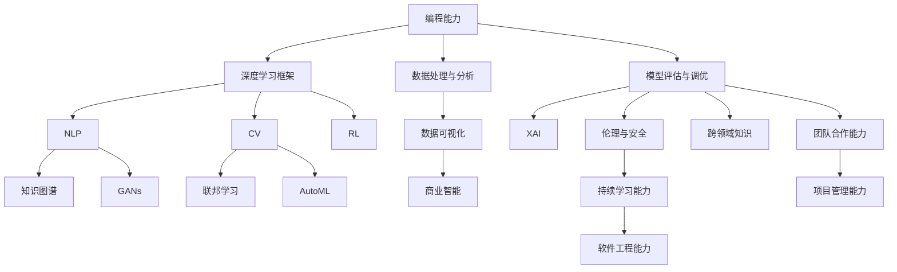

                 

## 1. 背景介绍

### 1.1 问题由来

随着人工智能技术的迅猛发展，AI领域正在快速渗透到各行各业，催生出大量新兴职业和岗位。AI工作者不仅要具备扎实的技术基础，还需要不断学习和更新技能，以应对日益复杂和快速变化的市场需求。

### 1.2 问题核心关键点

未来技能的核心在于掌握AI领域的最新技术和工具，同时培养适应各种场景的软技能。以下是AI职场中最为关键的20项技能：

1. **编程能力**：掌握多种编程语言，如Python、Java、C++等，熟悉数据结构和算法。
2. **深度学习框架**：熟练使用TensorFlow、PyTorch、Keras等深度学习框架，进行模型构建和优化。
3. **数据处理与分析**：能够进行数据清洗、预处理和特征工程，掌握常用的数据处理工具如Pandas、NumPy。
4. **模型评估与调优**：掌握模型评估指标和优化方法，如交叉验证、超参数调整、模型融合等。
5. **自然语言处理(NLP)**：精通NLP技术和应用，如文本分类、情感分析、机器翻译等。
6. **计算机视觉(CV)**：熟悉CV技术和应用，如图像识别、目标检测、图像生成等。
7. **强化学习(Reinforcement Learning, RL)**：掌握RL算法和应用，如游戏AI、机器人控制等。
8. **知识图谱**：了解知识图谱构建和应用，如实体识别、关系抽取、图神经网络等。
9. **生成对抗网络(GANs)**：掌握GANs技术及其应用，如图像生成、视频生成、数据增强等。
10. **联邦学习**：理解联邦学习原理和应用，如分布式训练、隐私保护等。
11. **自动机器学习(AutoML)**：掌握AutoML工具和应用，如模型自动搜索、超参数调优等。
12. **数据可视化**：熟悉数据可视化工具和技巧，如Matplotlib、Seaborn、Tableau等。
13. **软件工程能力**：掌握软件工程基础，如版本控制、单元测试、代码审查等。
14. **项目管理能力**：具备项目管理技能，如敏捷开发、Scrum、Kanban等。
15. **商业智能(BI)**：了解BI工具和应用，如Tableau、Power BI、QlikView等。
16. **可解释AI(XAI)**：掌握XAI技术和应用，如模型可解释性、公平性、鲁棒性等。
17. **伦理与安全**：了解AI伦理和安全性问题，如偏见检测、隐私保护、数据安全等。
18. **跨领域知识**：具备跨领域知识，如医学、金融、法律等领域的AI应用。
19. **团队合作能力**：具有良好的团队合作和沟通能力，能够在跨职能团队中协作完成项目。
20. **持续学习能力**：具备持续学习和自我提升的能力，不断跟进最新的AI技术和行业动态。

这些技能是AI工作者在职场中脱颖而出的关键，也是不断成长和进步的基础。

## 2. 核心概念与联系

### 2.1 核心概念概述

为更好地理解这些核心技能，本节将介绍几个密切相关的核心概念：

- **编程能力**：包括算法、数据结构、面向对象编程、函数式编程等，是软件工程师的基础技能。
- **深度学习框架**：提供高效的工具和库，用于构建、训练和优化深度神经网络模型。
- **数据处理与分析**：涉及数据清洗、特征提取、数据可视化等技术，是数据科学家的必备技能。
- **模型评估与调优**：通过交叉验证、超参数调整、模型融合等方法，提高模型的泛化能力和性能。
- **自然语言处理(NLP)**：研究如何让计算机理解和生成人类语言的技术，包括文本分类、机器翻译等。
- **计算机视觉(CV)**：研究如何让计算机“看”和“理解”图像、视频等视觉数据的学科。
- **强化学习(Reinforcement Learning, RL)**：通过奖励机制训练智能体，使其在特定环境中做出最优决策的学科。
- **知识图谱**：构建知识图谱，利用图神经网络进行实体识别、关系抽取等任务。
- **生成对抗网络(GANs)**：通过对抗性训练，生成高质量的图像、视频等内容。
- **联邦学习**：分布式训练模型，保护数据隐私的技术。
- **自动机器学习(AutoML)**：自动化地搜索和选择最佳模型及超参数。
- **数据可视化**：使用工具将数据转换为图形或图表，帮助理解和分析数据。
- **软件工程能力**：涵盖版本控制、单元测试、代码审查等，确保软件质量。
- **项目管理能力**：包括敏捷开发、Scrum、Kanban等方法，提升团队效率。
- **商业智能(BI)**：利用数据和可视化工具，辅助企业决策。
- **可解释AI(XAI)**：研究如何让AI模型具备可解释性、公平性和鲁棒性。
- **伦理与安全**：关注AI技术的伦理问题和安全性，确保AI系统的透明和可控。
- **跨领域知识**：了解不同领域的应用需求和技术挑战，提升跨学科能力。
- **团队合作能力**：具备沟通、协调和团队协作的技能，提升项目成功率。
- **持续学习能力**：持续学习新技术和知识，保持竞争力。

这些核心概念之间存在紧密的联系，构成了AI职场所需的关键技能体系。

### 2.2 概念间的关系

这些核心技能之间的逻辑关系可以通过以下Mermaid流程图来展示：

这个流程图展示了AI核心技能之间的关系：

1. **编程能力**是所有技能的基础，其他技能都依赖于编程能力的支持。
2. **深度学习框架**是AI模型的构建工具，与NLP、CV、RL等紧密相关。
3. **数据处理与分析**是数据驱动的AI应用的核心，为模型训练提供数据支持。
4. **模型评估与调优**是提升模型性能的关键步骤，与XAI紧密相关。
5. **NLP、CV、RL**是AI技术的三个主要分支，各自有独特的应用场景。
6. **知识图谱**和**GANs**是AI技术的两个前沿领域，具有广泛的应用前景。
7. **联邦学习**和**AutoML**是分布式和自动化学习的代表，提升AI模型的可扩展性和效率。
8. **数据可视化**和**商业智能**是数据应用的重要环节，帮助理解和决策。
9. **伦理与安全**是AI技术应用的伦理和法律问题，不可忽视。
10. **跨领域知识**和**团队合作能力**是AI技术应用跨学科和跨团队协作的基础。
11. **持续学习能力**是AI技术不断进步的动力来源。

这些核心技能共同构成了AI职场所需的能力体系，为AI工作者在职场中脱颖而出提供了坚实的基础。

## 3. 核心算法原理 & 具体操作步骤

### 3.1 算法原理概述

AI职场中的技能不仅涉及技术层面，还包括项目管理、沟通协作、持续学习等软技能。以下是AI职场中最为关键的20项技能的原理和具体操作步骤：

1. **编程能力**：
   - **原理**：编程能力是软件工程师的基本技能，包括算法、数据结构、面向对象编程、函数式编程等。
   - **具体操作步骤**：掌握Python、Java、C++等多种编程语言，熟练使用数据结构和算法，如链表、树、排序、查找等。

2. **深度学习框架**：
   - **原理**：深度学习框架提供高效的工具和库，用于构建、训练和优化深度神经网络模型。
   - **具体操作步骤**：熟悉TensorFlow、PyTorch、Keras等深度学习框架，掌握模型构建、训练和优化技术。

3. **数据处理与分析**：
   - **原理**：数据处理与分析涉及数据清洗、特征提取、数据可视化等技术。
   - **具体操作步骤**：掌握Pandas、NumPy等数据处理工具，熟悉SQL查询，进行数据清洗和预处理，使用Matplotlib、Seaborn等工具进行数据可视化。

4. **模型评估与调优**：
   - **原理**：通过交叉验证、超参数调整、模型融合等方法，提高模型的泛化能力和性能。
   - **具体操作步骤**：掌握交叉验证、超参数调整、模型融合等技术，使用scikit-learn等工具进行模型评估和调优。

5. **自然语言处理(NLP)**：
   - **原理**：研究如何让计算机理解和生成人类语言的技术。
   - **具体操作步骤**：掌握文本分类、情感分析、机器翻译等NLP技术，使用NLTK、spaCy等工具进行文本处理。

6. **计算机视觉(CV)**：
   - **原理**：研究如何让计算机“看”和“理解”图像、视频等视觉数据的学科。
   - **具体操作步骤**：掌握图像识别、目标检测、图像生成等CV技术，使用OpenCV、TensorFlow等工具进行图像处理。

7. **强化学习(Reinforcement Learning, RL)**：
   - **原理**：通过奖励机制训练智能体，使其在特定环境中做出最优决策的学科。
   - **具体操作步骤**：掌握Q-learning、Deep Q-Network、Actor-Critic等RL算法，使用Gym等环境进行智能体训练。

8. **知识图谱**：
   - **原理**：构建知识图谱，利用图神经网络进行实体识别、关系抽取等任务。
   - **具体操作步骤**：掌握知识图谱的构建和应用，使用Neo4j等图数据库进行知识存储和查询。

9. **生成对抗网络(GANs)**：
   - **原理**：通过对抗性训练，生成高质量的图像、视频等内容。
   - **具体操作步骤**：掌握GANs技术及其应用，使用TensorFlow、PyTorch等工具进行GANs模型的构建和训练。

10. **联邦学习**：
    - **原理**：分布式训练模型，保护数据隐私的技术。
    - **具体操作步骤**：了解联邦学习原理和应用，使用TensorFlow Federated等工具进行联邦学习模型的构建和训练。

11. **自动机器学习(AutoML)**：
    - **原理**：自动化地搜索和选择最佳模型及超参数。
    - **具体操作步骤**：掌握AutoML工具和应用，使用H2O.ai等工具进行AutoML模型的构建和优化。

12. **数据可视化**：
    - **原理**：使用工具将数据转换为图形或图表，帮助理解和分析数据。
    - **具体操作步骤**：掌握Matplotlib、Seaborn、Tableau等工具，进行数据可视化和交互式分析。

13. **软件工程能力**：
    - **原理**：涵盖版本控制、单元测试、代码审查等，确保软件质量。
    - **具体操作步骤**：掌握Git、SVN等版本控制工具，使用Jenkins等持续集成工具进行单元测试和代码审查。

14. **项目管理能力**：
    - **原理**：包括敏捷开发、Scrum、Kanban等方法，提升团队效率。
    - **具体操作步骤**：掌握Scrum、Kanban等项目管理方法，使用Jira、Trello等工具进行项目管理。

15. **商业智能(BI)**：
    - **原理**：利用数据和可视化工具，辅助企业决策。
    - **具体操作步骤**：掌握Tableau、Power BI、QlikView等BI工具，进行数据分析和可视化。

16. **可解释AI(XAI)**：
    - **原理**：研究如何让AI模型具备可解释性、公平性和鲁棒性。
    - **具体操作步骤**：掌握模型可解释性、公平性、鲁棒性等技术，使用LIME、SHAP等工具进行模型解释。

17. **伦理与安全**：
    - **原理**：关注AI技术的伦理问题和安全性，确保AI系统的透明和可控。
    - **具体操作步骤**：了解AI伦理和安全问题，确保AI系统符合法律和伦理规范。

18. **跨领域知识**：
    - **原理**：了解不同领域的应用需求和技术挑战，提升跨学科能力。
    - **具体操作步骤**：掌握不同领域的AI应用，如医疗、金融、法律等。

19. **团队合作能力**：
    - **原理**：具备沟通、协调和团队协作的技能，提升项目成功率。
    - **具体操作步骤**：培养良好的沟通和协调能力，在跨职能团队中协作完成项目。

20. **持续学习能力**：
    - **原理**：持续学习新技术和知识，保持竞争力。
    - **具体操作步骤**：制定学习计划，阅读最新技术论文，参加技术会议和培训课程，保持持续学习的状态。

### 3.2 算法步骤详解

以下是对每个核心技能的具体操作步骤详解：

1. **编程能力**：
   - **步骤1**：掌握多种编程语言，如Python、Java、C++等，熟悉数据结构和算法。
   - **步骤2**：通过实际项目和编码练习，不断提高编程能力。
   - **步骤3**：参与开源项目，积累实践经验。

2. **深度学习框架**：
   - **步骤1**：熟悉TensorFlow、PyTorch、Keras等深度学习框架。
   - **步骤2**：学习深度学习的基础知识和经典模型，如神经网络、卷积神经网络、循环神经网络等。
   - **步骤3**：通过实际项目，应用深度学习框架进行模型构建和优化。

3. **数据处理与分析**：
   - **步骤1**：掌握Pandas、NumPy等数据处理工具。
   - **步骤2**：进行数据清洗、特征提取等预处理工作。
   - **步骤3**：使用Matplotlib、Seaborn等工具进行数据可视化。

4. **模型评估与调优**：
   - **步骤1**：掌握交叉验证、超参数调整、模型融合等技术。
   - **步骤2**：使用scikit-learn等工具进行模型评估和调优。
   - **步骤3**：根据评估结果，调整模型参数和架构。

5. **自然语言处理(NLP)**：
   - **步骤1**：掌握文本分类、情感分析、机器翻译等NLP技术。
   - **步骤2**：使用NLTK、spaCy等工具进行文本处理。
   - **步骤3**：参与NLP相关的项目和比赛，积累实战经验。

6. **计算机视觉(CV)**：
   - **步骤1**：掌握图像识别、目标检测、图像生成等CV技术。
   - **步骤2**：使用OpenCV、TensorFlow等工具进行图像处理。
   - **步骤3**：参与CV相关的项目和比赛，积累实战经验。

7. **强化学习(Reinforcement Learning, RL)**：
   - **步骤1**：掌握Q-learning、Deep Q-Network、Actor-Critic等RL算法。
   - **步骤2**：使用Gym等环境进行智能体训练。
   - **步骤3**：参与RL相关的项目和比赛，积累实战经验。

8. **知识图谱**：
   - **步骤1**：掌握知识图谱的构建和应用。
   - **步骤2**：使用Neo4j等图数据库进行知识存储和查询。
   - **步骤3**：参与知识图谱相关的项目和研究，积累实战经验。

9. **生成对抗网络(GANs)**：
   - **步骤1**：掌握GANs技术及其应用。
   - **步骤2**：使用TensorFlow、PyTorch等工具进行GANs模型的构建和训练。
   - **步骤3**：参与GANs相关的项目和比赛，积累实战经验。

10. **联邦学习**：
    - **步骤1**：了解联邦学习原理和应用。
    - **步骤2**：使用TensorFlow Federated等工具进行联邦学习模型的构建和训练。
    - **步骤3**：参与联邦学习相关的项目和研究，积累实战经验。

11. **自动机器学习(AutoML)**：
    - **步骤1**：掌握AutoML工具和应用。
    - **步骤2**：使用H2O.ai等工具进行AutoML模型的构建和优化。
    - **步骤3**：参与AutoML相关的项目和比赛，积累实战经验。

12. **数据可视化**：
    - **步骤1**：掌握Matplotlib、Seaborn、Tableau等工具。
    - **步骤2**：进行数据可视化和交互式分析。
    - **步骤3**：参与数据可视化相关的项目和比赛，积累实战经验。

13. **软件工程能力**：
    - **步骤1**：掌握Git、SVN等版本控制工具。
    - **步骤2**：使用Jenkins等持续集成工具进行单元测试和代码审查。
    - **步骤3**：参与开源项目和内部项目，积累软件工程实践经验。

14. **项目管理能力**：
    - **步骤1**：掌握Scrum、Kanban等项目管理方法。
    - **步骤2**：使用Jira、Trello等工具进行项目管理。
    - **步骤3**：参与项目管理相关的项目，积累项目管理经验。

15. **商业智能(BI)**：
    - **步骤1**：掌握Tableau、Power BI、QlikView等BI工具。
    - **步骤2**：进行数据分析和可视化。
    - **步骤3**：参与BI相关的项目和研究，积累实战经验。

16. **可解释AI(XAI)**：
    - **步骤1**：掌握模型可解释性、公平性、鲁棒性等技术。
    - **步骤2**：使用LIME、SHAP等工具进行模型解释。
    - **步骤3**：参与XAI相关的项目和研究，积累实战经验。

17. **伦理与安全**：
    - **步骤1**：了解AI伦理和安全问题。
    - **步骤2**：确保AI系统符合法律和伦理规范。
    - **步骤3**：参与AI伦理和安全相关的项目和研究，积累实战经验。

18. **跨领域知识**：
    - **步骤1**：掌握不同领域的AI应用。
    - **步骤2**：参与跨领域项目，积累跨学科经验。
    - **步骤3**：持续学习和探索新领域，保持跨领域知识的广度和深度。

19. **团队合作能力**：
    - **步骤1**：培养良好的沟通和协调能力。
    - **步骤2**：在跨职能团队中协作完成项目。
    - **步骤3**：参与团队合作相关的项目和研究，积累团队合作经验。

20. **持续学习能力**：
    - **步骤1**：制定学习计划，阅读最新技术论文。
    - **步骤2**：参加技术会议和培训课程。
    - **步骤3**：保持持续学习的状态，不断更新知识和技能。

### 3.3 算法优缺点

每种技能都有其优点和缺点，以下是核心技能的优缺点分析：

1. **编程能力**：
   - **优点**：编程能力是AI工作者的基础技能，有助于理解和实现AI算法。
   - **缺点**：编程需要较长时间学习和积累，可能存在一定的入门难度。

2. **深度学习框架**：
   - **优点**：深度学习框架提供高效的工具和库，大大提高模型构建和优化的效率。
   - **缺点**：框架的复杂性可能导致学习和使用的门槛较高。

3. **数据处理与分析**：
   - **优点**：数据处理与分析是AI应用的核心，掌握这些技能有助于高效利用数据。
   - **缺点**：数据处理和分析需要大量的实践经验，难以一蹴而就。

4. **模型评估与调优**：
   - **优点**：通过模型评估与调优，可以显著提高模型的性能。
   - **缺点**：调优过程可能需要反复试验，效率较低。

5. **自然语言处理(NLP)**：
   - **优点**：NLP技术在语言理解和生成方面具有巨大潜力，应用广泛。
   - **缺点**：NLP模型复杂，构建和优化需要大量的数据和计算资源。

6. **计算机视觉(CV)**：
   - **优点**：CV技术在图像和视频处理方面具有优势，应用前景广阔。
   - **缺点**：CV模型需要大量的标注数据和计算资源。

7. **强化学习(Reinforcement Learning, RL)**：
   - **优点**：RL技术在智能体决策和控制方面具有独特优势。
   - **缺点**：RL模型的训练和调试相对复杂，需要大量的实验和调试。

8. **知识图谱**：
   - **优点**：知识图谱为实体识别和关系抽取提供强有力的工具。
   - **缺点**：知识图谱构建和应用需要大量的专家知识和标注数据。

9. **生成对抗网络(GANs)**：
   - **优点**：GANs技术在图像生成和增强方面具有独特优势。
   - **缺点**：GANs模型的训练过程不稳定，容易出现模式崩溃等问题。

10. **联邦学习**：
    - **优点**：联邦学习保护数据隐私，适用于分布式数据环境。
    - **缺点**：联邦学习需要高效的通信和协调机制，实现难度较高。

11. **自动机器学习(AutoML)**：
    - **优点**：AutoML自动化搜索模型和超参数，提高模型构建效率。
    - **缺点**：AutoML的自动化搜索过程可能需要大量计算资源和时间。

12. **数据可视化**：
    - **优点**：数据可视化有助于理解和分析数据，提高决策效率。
    - **缺点**：数据可视化工具较为复杂，需要一定的学习和使用成本。

13. **软件工程能力**：
    - **优点**：软件工程能力保障项目质量和进度，提升团队效率。
    - **缺点**：软件工程的学习和实践需要一定的时间和精力。

14. **项目管理能力**：
    - **优点**：项目管理能力提升团队协作和项目管理效率。
    - **缺点**：项目管理需要一定的经验和实践，可能存在一定的学习曲线。

15. **商业智能(BI)**：
    - **优点**：BI工具和应用帮助企业进行数据分析和决策。
    - **缺点**：BI工具的学习和使用需要一定的数据和技术基础。

16. **可解释AI(XAI)**：
    - **优点**：XAI技术提升AI模型的透明度和可解释性，增强用户信任。
    - **缺点**：XAI技术相对较新，研究和应用还处于初期阶段。

17. **伦理与安全**：
    - **优点**：AI伦理和安全问题确保AI系统的透明和可控，提升社会信任。
    - **缺点**：伦理和安全问题复杂，需要跨学科的合作和研究。

18. **跨领域知识**：
    - **优点**：跨领域知识帮助AI工作者理解和应用不同领域的技术。
    - **缺点**：跨领域知识的学习需要较大的时间和精力投入。

19. **团队合作能力**：
    - **优点**：团队合作能力提升项目成功率和效率。
    - **缺点**：团队合作需要良好的沟通和协调能力，可能存在一定的挑战。

20. **持续学习能力**：
    - **优点**：持续学习能力保障技术更新和进步，保持竞争力。
    - **缺点**：持续学习需要时间和精力的投入，可能存在一定的学习压力。

### 3.4 算法应用领域

这些核心技能广泛应用于各个AI领域，具体应用领域如下：

1. **编程能力**：软件工程师、系统架构师、数据科学家等岗位。
2. **深度学习框架**：AI研究员、机器学习工程师、计算机视觉工程师等岗位。
3. **数据处理与分析**：数据科学家、业务分析师、研究助理等岗位。
4. **模型评估与调优**：机器学习工程师、算法工程师、数据科学家等岗位。
5. **自然语言处理(NLP)**：NLP工程师、文本分析师、智能对话系统设计师等岗位。
6. **计算机视觉(CV)**：计算机视觉工程师、图像处理工程师、自动驾驶工程师等岗位。
7. **强化学习(Reinforcement Learning, RL)**：游戏AI开发者、机器人控制工程师、智能推荐系统设计师等岗位。
8. **知识图谱**：知识图谱工程师、信息检索工程师、数据科学家等岗位。
9. **生成对抗网络(GANs)**：图像生成工程师、图像增强工程师、多媒体技术开发者等岗位。
10. **联邦学习**：分布式AI工程师、网络安全工程师、隐私保护工程师等岗位。
11. **自动机器学习(AutoML)**：自动化机器学习工程师、数据科学家、业务分析师等岗位。
12. **数据可视化**：数据可视化工程师、商业分析师、业务智能开发者等岗位。
13. **软件工程能力**：软件开发工程师、系统架构师、软件质量保证工程师等岗位。
14. **项目管理能力**：项目经理、敏捷开发工程师、系统架构师等岗位。
15. **商业智能(BI)**：商业分析师、数据科学家、业务智能工程师等岗位。
16. **可解释AI(XAI)**：AI研究员、数据科学家、机器学习工程师等岗位。
17. **伦理与安全**：AI伦理工程师、隐私保护工程师、合规经理等岗位。
18. **跨领域知识**：跨领域工程师、AI研究员、技术顾问等岗位。
19. **团队合作能力**：项目经理、团队领导、技术协调员等岗位。

