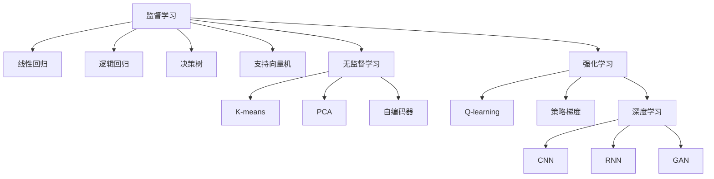
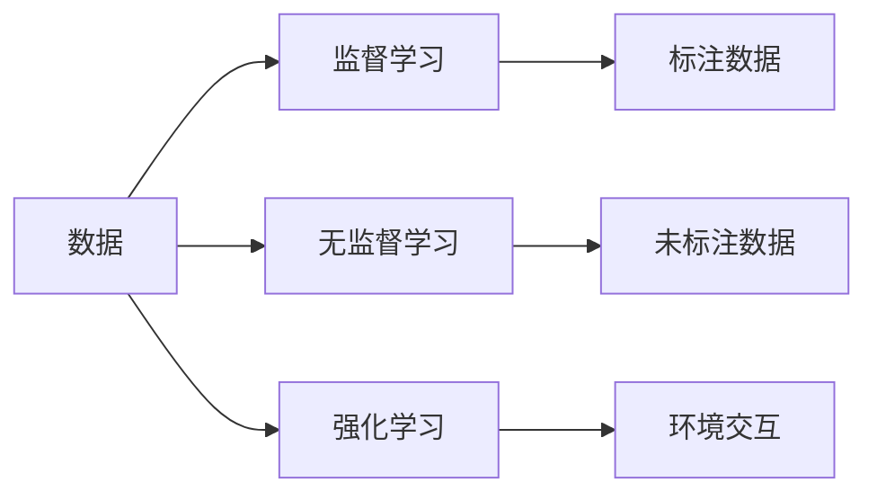
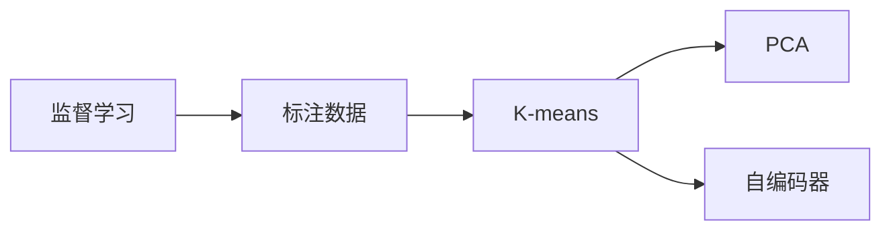
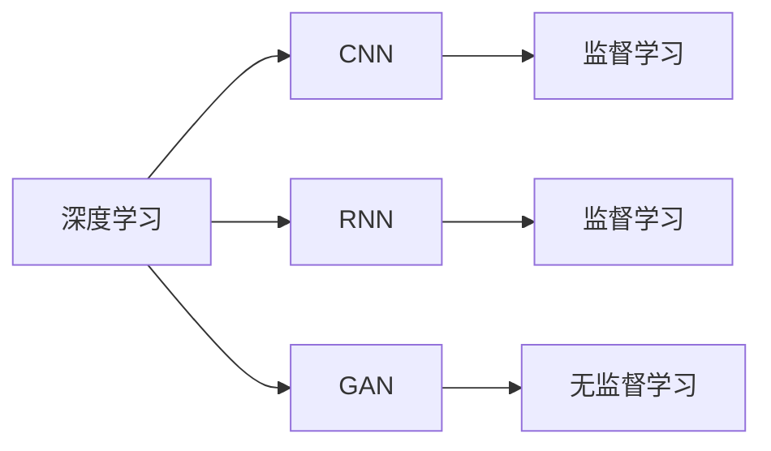
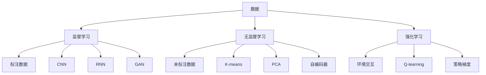

                 

# 机器学习原理与代码实例讲解

> 关键词：机器学习,监督学习,无监督学习,强化学习,算法,模型,代码实例,深度学习

## 1. 背景介绍

### 1.1 问题由来
在当今的数字化时代，机器学习(Machine Learning, ML)已经成为了推动人工智能(AI)技术进步的关键驱动力。机器学习通过让计算机从数据中学习规律，自主地进行决策和预测，从而在众多领域取得了显著成果，包括计算机视觉、自然语言处理、语音识别、推荐系统等。然而，机器学习的理论基础、算法实现、以及实际应用仍然是一个深入且复杂的研究领域，对其原理的详细理解与代码实践是从事相关工作的前提。

### 1.2 问题核心关键点
机器学习主要分为三大类：监督学习(Supervised Learning)、无监督学习(Unsupervised Learning)和强化学习(Reinforcement Learning)。

- **监督学习**：学习从已标注的训练数据集中，通过预测模型（如线性回归、逻辑回归、决策树、支持向量机等）学习输入和输出之间的映射关系，用于分类和回归问题。
- **无监督学习**：学习从未标注的数据集中，通过聚类、降维等方法发现数据的内在结构，用于探索性分析和数据预处理。
- **强化学习**：通过与环境交互，基于奖励信号进行学习，用于自主控制和决策制定。

### 1.3 问题研究意义
机器学习技术的深入理解和实际应用，不仅对计算机科学的进步具有重要意义，也是实现人机协同、智能化的关键。机器学习的应用范围广泛，从日常生活中的推荐系统、搜索引擎，到医疗、金融等高价值行业，机器学习正在不断地改变我们的生活方式和工作模式。

## 2. 核心概念与联系

### 2.1 核心概念概述

为更深入地理解机器学习的核心概念与算法实现，本节将详细介绍以下关键概念及其相互联系：

- **监督学习**：学习从已标注的数据集中，通过预测模型学习输入和输出之间的映射关系。常见的监督学习方法包括线性回归、逻辑回归、决策树、支持向量机等。
- **无监督学习**：学习从未标注的数据集中，通过聚类、降维等方法发现数据的内在结构。常见的无监督学习方法包括K-means、主成分分析(PCA)、自编码器等。
- **强化学习**：通过与环境交互，基于奖励信号进行学习，用于自主控制和决策制定。常见的强化学习算法包括Q-learning、策略梯度等。
- **深度学习**：一类基于神经网络的机器学习方法，具有强大的非线性拟合能力，适用于图像、语音、自然语言处理等复杂任务。深度学习是机器学习中的热门分支，涵盖卷积神经网络(CNN)、循环神经网络(RNN)、生成对抗网络(GAN)等。

这些核心概念之间的逻辑关系可以通过以下Mermaid流程图来展示：

这个流程图展示了机器学习的核心概念及其相互关系：

1. 监督学习通过预测模型学习输入和输出之间的映射关系。
2. 无监督学习发现数据的内在结构。
3. 强化学习通过与环境的交互进行学习。
4. 深度学习利用神经网络处理复杂任务。

这些概念共同构成了机器学习的理论框架，为实际应用提供了强有力的技术支持。

### 2.2 概念间的关系

这些核心概念之间存在着紧密的联系，形成了机器学习的完整生态系统。下面我们通过几个Mermaid流程图来展示这些概念之间的关系。

#### 2.2.1 机器学习与数据的关系

这个流程图展示了机器学习与数据的关系：

1. 监督学习需要标注数据进行训练。
2. 无监督学习使用未标注数据进行学习。
3. 强化学习与环境交互获取奖励信号。

#### 2.2.2 监督学习和无监督学习的联系

这个流程图展示了监督学习和无监督学习的联系：

1. 监督学习可以使用标注数据训练聚类算法（如K-means）。
2. 聚类算法可以进一步降维（如PCA）。
3. 自编码器同样适用于降维。

#### 2.2.3 深度学习与监督学习和无监督学习的联系

这个流程图展示了深度学习与监督学习和无监督学习的联系：

1. 深度学习包含CNN用于图像处理、RNN用于序列数据、GAN用于生成任务。
2. CNN、RNN用于监督学习任务。
3. GAN用于无监督学习中的生成模型。

### 2.3 核心概念的整体架构

最后，我们用一个综合的流程图来展示这些核心概念在机器学习中的整体架构：

这个综合流程图展示了机器学习的核心概念及其应用场景：

1. 监督学习使用标注数据训练深度学习模型。
2. 无监督学习使用未标注数据进行聚类和降维。
3. 强化学习通过与环境的交互进行决策制定。
4. 深度学习适用于复杂图像、序列和生成任务。

通过这些流程图，我们可以更清晰地理解机器学习中的核心概念及其相互关系，为后续深入讨论具体的算法实现和代码实践奠定基础。

## 3. 核心算法原理 & 具体操作步骤

### 3.1 算法原理概述

机器学习算法的核心原理在于通过训练数据学习模型参数，以适应特定的预测或分类任务。不同的机器学习算法采用不同的训练目标和损失函数，以最小化模型预测与真实标签之间的误差。以下是几种常见机器学习算法的概述：

- **线性回归**：通过最小化预测值与真实值之间的平方误差，学习线性关系。
- **逻辑回归**：通过最大化预测值与真实值的似然概率，进行二分类任务。
- **决策树**：通过构建树形结构，对数据进行递归分割，适用于分类和回归任务。
- **支持向量机**：通过最大化分类间隔，构建最优的超平面，适用于高维数据和分类任务。
- **K-means聚类**：通过最小化数据点与聚类中心的距离，进行无监督聚类。
- **主成分分析(PCA)**：通过线性变换，将数据降维至更低维度，保持最大信息量。
- **自编码器**：通过重构输入数据的低维表示，学习数据的潜在表示。
- **Q-learning**：通过最大化累计奖励，学习最优策略，用于自主控制。
- **策略梯度**：通过最大化期望奖励，学习最优策略，用于决策制定。

### 3.2 算法步骤详解

以下是几个常见机器学习算法的基本步骤：

**线性回归**：

1. **数据准备**：准备训练数据集 $(x_i, y_i)$，其中 $x_i$ 为输入特征，$y_i$ 为真实标签。
2. **模型初始化**：设定模型参数 $\theta$，如线性回归中的斜率 $m$ 和截距 $b$。
3. **损失函数定义**：定义损失函数 $L(\theta)$，如均方误差损失 $MSE$。
4. **梯度下降**：使用梯度下降算法最小化损失函数，更新模型参数 $\theta$。
5. **模型评估**：在测试集上评估模型性能，如均方误差、R²等。

**K-means聚类**：

1. **数据准备**：准备训练数据集 $\{x_i\}$，其中 $x_i$ 为数据点。
2. **模型初始化**：随机选择 $k$ 个初始聚类中心 $\mu$。
3. **距离计算**：计算数据点 $x_i$ 与每个聚类中心 $\mu$ 的距离，得到距离矩阵 $D$。
4. **分配**：将每个数据点 $x_i$ 分配到距离最近的聚类中心。
5. **更新**：重新计算每个聚类的质心 $\mu$。
6. **迭代**：重复步骤4和5，直到聚类中心不再变化或达到预设迭代次数。

**Q-learning**：

1. **环境设定**：设定环境状态 $s$，动作 $a$，奖励 $r$ 和下一个状态 $s'$。
2. **模型初始化**：设定状态值函数 $V$ 和策略函数 $\pi$。
3. **交互学习**：在每个时间步 $t$，根据当前状态 $s_t$ 和策略 $\pi$ 选择动作 $a_t$，观察下一个状态 $s_{t+1}$ 和奖励 $r_t$。
4. **更新参数**：根据状态-动作-奖励-下一个状态 tuple，更新 $V$ 和 $\pi$。
5. **终止**：重复步骤3和4，直到达到预设终止条件。

### 3.3 算法优缺点

不同的机器学习算法各有优缺点，需要根据具体任务需求进行选择。

- **线性回归**：优点是模型简单，易于理解和实现。缺点是适用于线性关系的数据，难以处理非线性问题。
- **逻辑回归**：优点是适用于二分类任务，计算速度快。缺点是对于多分类问题，需要进行多轮迭代或扩展为多分类逻辑回归。
- **决策树**：优点是易于理解，适用于复杂数据。缺点是容易过拟合，需要进行剪枝。
- **支持向量机**：优点是适用于高维数据和分类任务。缺点是计算复杂度较高，对于大规模数据集不适用。
- **K-means聚类**：优点是算法简单，计算速度快。缺点是聚类效果受初始值影响较大，可能陷入局部最优。
- **PCA**：优点是降维效果好，保留大部分信息。缺点是对于非线性数据降维效果不佳。
- **自编码器**：优点是适用于特征学习，适用于降维和数据生成。缺点是训练过程复杂，需要大量计算资源。
- **Q-learning**：优点是适用于自主控制任务。缺点是学习效率较低，需要大量迭代。
- **策略梯度**：优点是适用于决策制定任务。缺点是学习过程不稳定，需要大量样本。

### 3.4 算法应用领域

机器学习算法在多个领域得到了广泛应用，包括但不限于：

- **计算机视觉**：如图像分类、目标检测、图像生成等。
- **自然语言处理**：如文本分类、情感分析、机器翻译等。
- **语音识别**：如语音识别、语音合成、语音情感分析等。
- **推荐系统**：如商品推荐、新闻推荐、广告推荐等。
- **金融风控**：如信用评估、欺诈检测、风险控制等。
- **医疗健康**：如疾病诊断、健康监测、药物推荐等。
- **交通出行**：如交通预测、路线规划、自动驾驶等。
- **智能制造**：如故障诊断、质量控制、智能调度等。
- **智慧城市**：如交通管理、环境监测、公共安全等。

机器学习在上述领域的应用，推动了各行业的智能化和自动化进程，提高了工作效率和决策质量。

## 4. 数学模型和公式 & 详细讲解 & 举例说明

### 4.1 数学模型构建

本节将使用数学语言对几种常见机器学习算法进行详细讲解。

**线性回归**：

设训练数据集为 $(x_i, y_i)$，其中 $x_i$ 为输入特征，$y_i$ 为真实标签。目标是最小化预测值 $\hat{y}_i = wx_i + b$ 与真实值 $y_i$ 之间的均方误差 $MSE$：

$$
MSE = \frac{1}{N}\sum_{i=1}^N (y_i - \hat{y}_i)^2
$$

目标是最小化损失函数 $L(\theta)$：

$$
L(\theta) = \frac{1}{N}\sum_{i=1}^N (y_i - wx_i - b)^2
$$

其中 $\theta = (w, b)$ 为模型参数。

**逻辑回归**：

设训练数据集为 $(x_i, y_i)$，其中 $x_i$ 为输入特征，$y_i$ 为二元标签。目标是最小化损失函数 $L(\theta)$：

$$
L(\theta) = -\frac{1}{N}\sum_{i=1}^N [y_i\log(\sigma(w^Tx_i + b)) + (1-y_i)\log(1-\sigma(w^Tx_i + b))]
$$

其中 $\sigma(z) = \frac{1}{1+\exp(-z)}$ 为sigmoid函数。

**K-means聚类**：

设训练数据集为 $\{x_i\}$，其中 $x_i$ 为数据点。目标是最小化所有数据点 $x_i$ 与聚类中心 $\mu_j$ 的距离平方和 $S$：

$$
S = \sum_{i=1}^N \min_{j=1}^K (||x_i - \mu_j||^2)
$$

目标是最小化损失函数 $L(\mu)$：

$$
L(\mu) = \frac{1}{N}\sum_{i=1}^N \min_{j=1}^K ||x_i - \mu_j||^2
$$

其中 $\mu = (\mu_1, \mu_2, ..., \mu_K)$ 为聚类中心。

### 4.2 公式推导过程

下面我们对上述算法进行简要推导。

**线性回归**：

目标是最小化损失函数 $L(\theta)$：

$$
L(\theta) = \frac{1}{N}\sum_{i=1}^N (y_i - wx_i - b)^2
$$

对 $\theta$ 求导：

$$
\frac{\partial L(\theta)}{\partial w} = -\frac{2}{N}\sum_{i=1}^N (y_i - wx_i - b)x_i
$$

$$
\frac{\partial L(\theta)}{\partial b} = -\frac{2}{N}\sum_{i=1}^N (y_i - wx_i - b)
$$

令 $\frac{\partial L(\theta)}{\partial w} = 0$ 和 $\frac{\partial L(\theta)}{\partial b} = 0$，解方程组得到最优解 $\theta = (w^*, b^*)$。

**逻辑回归**：

目标是最小化损失函数 $L(\theta)$：

$$
L(\theta) = -\frac{1}{N}\sum_{i=1}^N [y_i\log(\sigma(w^Tx_i + b)) + (1-y_i)\log(1-\sigma(w^Tx_i + b))]
$$

对 $\theta$ 求导：

$$
\frac{\partial L(\theta)}{\partial w} = -\frac{1}{N}\sum_{i=1}^N (y_i - \sigma(w^Tx_i + b))x_i
$$

$$
\frac{\partial L(\theta)}{\partial b} = -\frac{1}{N}\sum_{i=1}^N (y_i - \sigma(w^Tx_i + b))
$$

令 $\frac{\partial L(\theta)}{\partial w} = 0$ 和 $\frac{\partial L(\theta)}{\partial b} = 0$，解方程组得到最优解 $\theta = (w^*, b^*)$。

**K-means聚类**：

目标是最小化损失函数 $L(\mu)$：

$$
L(\mu) = \frac{1}{N}\sum_{i=1}^N \min_{j=1}^K ||x_i - \mu_j||^2
$$

对聚类中心 $\mu$ 求导：

$$
\frac{\partial L(\mu)}{\partial \mu_j} = -\frac{2}{N}\sum_{i=1}^N (x_i - \mu_j)(x_i - \mu_j)
$$

令 $\frac{\partial L(\mu)}{\partial \mu_j} = 0$，解方程组得到最优解 $\mu = (\mu_1^*, \mu_2^*, ..., \mu_K^*)$。

### 4.3 案例分析与讲解

以下是对几个经典机器学习算法进行详细分析和讲解。

**案例一：线性回归**

假设我们有一个简单的数据集，包含身高和体重的信息，目标是预测体重：

| 身高 (cm) | 体重 (kg) |
| --------- | --------- |
| 160       | 55        |
| 170       | 60        |
| 180       | 65        |
| 190       | 75        |

我们可以使用线性回归模型来预测体重：

1. **数据准备**：将数据集转换为训练集。
2. **模型初始化**：设定模型参数 $\theta = (w, b)$。
3. **损失函数定义**：使用均方误差损失 $MSE$。
4. **梯度下降**：使用梯度下降算法最小化损失函数。
5. **模型评估**：在测试集上评估模型性能。

**案例二：逻辑回归**

假设我们有一个简单的数据集，包含性别和疾病信息，目标是判断是否患有糖尿病：

| 性别 (M/F) | 血糖水平 (mmol/L) | 糖尿病 (Yes/No) |
| -----------| -------------    | --------------- |
| M          | 6.0             | 否              |
| F          | 5.5             | 否              |
| M          | 5.5             | 是              |
| F          | 6.1             | 否              |
| M          | 5.0             | 是              |

我们可以使用逻辑回归模型来预测是否患有糖尿病：

1. **数据准备**：将数据集转换为训练集。
2. **模型初始化**：设定模型参数 $\theta = (w, b)$。
3. **损失函数定义**：使用逻辑回归损失函数。
4. **梯度下降**：使用梯度下降算法最小化损失函数。
5. **模型评估**：在测试集上评估模型性能。

**案例三：K-means聚类**

假设我们有一个简单的数据集，包含二维坐标的信息，目标是将其聚类为两个簇：

| 坐标 (x, y) |
| ----------- |
| (1.0, 1.5    |
| (1.5, 2.0    |
| (2.0, 1.5    |
| (2.5, 1.5    |
| (1.0, 2.5    |
| (1.5, 3.0    |
| (2.0, 3.0    |
| (2.5, 2.0    |
| (1.0, 3.5    |
| (1.5, 4.0    |
| (2.0, 4.0    |
| (2.5, 4.0    |
| (1.0, 5.0    |
| (1.5, 5.5    |
| (2.0, 5.5    |
| (2.5, 6.0    |
| (1.0, 6.5    |
| (1.5, 7.0    |
| (2.0, 7.0    |
| (2.5, 7.5    |
| (1.0, 8.0    |
| (1.5, 8.5    |
| (2.0, 9.0    |
| (2.5, 9.5    |
| (1.0, 10.0   |
| (1.5, 10.5   |
| (2.0, 11.0   |
| (2.5, 11.5   |
| (1.0, 12.0   |
| (1.5, 12.5   |
| (2.0, 13.0   |
| (2.5, 13.5   |
| (1.0, 14.0   |
| (1.5, 14.5   |
| (2.0, 15.0   |
| (2.5, 15.5   |
| (1.0, 16.0   |
| (1.5, 16.5   |
| (2.0, 17.0   |
| (2.5, 17.5   |
| (1.0, 18.0   |
| (1.5, 18.5   |
| (2.0, 19.0   |
| (2.5, 19.5   |
| (1.0, 20.0   |
| (1.5, 20.5   |
| (2.0, 21.0   |
| (2.5, 21.5   |
| (1.0, 22.0   |
| (1.5, 22.5   |
| (2.0, 23.0   |
| (2.5, 23.5   |
| (1.0, 24.0   |
| (1.5, 24.5   |
| (2.0, 25.0   |
| (2.5, 25.5   |
| (1.0, 26.0   |
| (1.5, 26.5   |
| (2.0, 27.0   |
| (2.5, 27.5   |
| (1.0, 28.0   |
| (1.5, 28.5   |
| (2.0, 29.0   |
| (2.5, 29.5   |
| (1.0, 30.0   |
| (1.5, 30.5   |
| (2.0, 31.0   |
| (2.5, 31.5   |
| (1.0, 32.0   |
| (1.5, 32.5   |
| (2.0, 33.0   |
| (2.5, 33.5   |
| (1.0, 34.0   |
| (1.5, 34.5   |
| (2.0, 35.0   |
| (2.5, 35.5   |
| (1.0, 36.0   |
| (1.5, 36.5   |
| (2.0, 37.0   |
| (2.5, 37.5   |
| (1.0, 38.0   |
| (1.5, 38.5   |
| (2.0, 39.0   |
| (2.5, 39.5   |
| (1.0, 40.0   |
| (1.5, 40.5   |
| (2.0, 41.0   |
| (2.5, 41.5   |
| (1.0, 42.0   |
| (1.5, 42.5   |
| (2.0, 43.0   |
| (2.5, 43.5   |
| (1.0, 44.0   |
| (1.5, 44.5   |
| (2.0, 45.0   |
| (2.5, 45.5   |
| (1.0, 46.0   |
| (1.5, 46.5   |
| (2.0, 47.0   |
| (2.5, 47.5   |
| (1.0, 48.0   |
| (1.5, 48.5   |
| (2.0, 49.0   |
| (2.5, 49.5   |
| (1.0, 50.0   |
| (1.5, 50.5   |
| (2.0, 51.0   |
| (2.5, 51.5   |
| (1.0, 52.0   |
| (1.5, 52.5   |
| (2.0, 53.0   |
| (2.5, 53.5   |
| (1.0, 54.0

