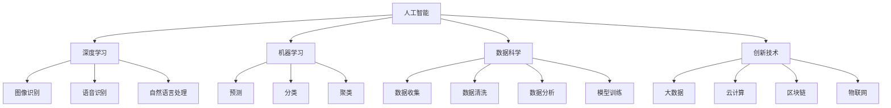
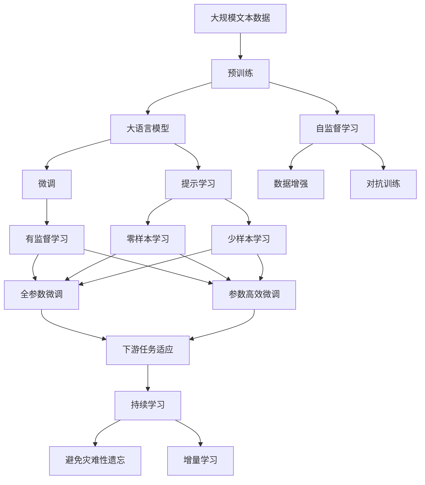

                 

# 李开复：AI 2.0 时代的投资价值

> 关键词：人工智能, AI 2.0, 投资价值, 深度学习, 机器学习, 数据科学, 创新技术, 未来趋势

## 1. 背景介绍

### 1.1 问题由来
在过去的几十年里，人工智能(AI)技术取得了飞速发展，从简单的图像识别到复杂的自然语言处理，AI在各个领域展现出了强大的应用潜力。然而，AI的商业化进程仍然面临诸多挑战，包括技术成熟度、市场需求、资本投入等方面。对于投资者来说，如何在AI 2.0时代找到有潜力的投资机会，成为当前的热门话题。

### 1.2 问题核心关键点
AI 2.0时代的投资价值在于其广泛的应用前景和强大的技术基础。根据Gartner的预测，到2025年，AI将为全球经济创造超过15.7万亿美元的价值，成为未来十年的主要增长驱动力。

AI 2.0时代的核心关键点包括：

- **技术突破**：深度学习、自然语言处理、计算机视觉等技术的进步，使得AI在各个领域的应用更加深入和广泛。
- **数据驱动**：大数据和云计算技术的发展，为AI模型的训练和部署提供了强大的支撑。
- **应用场景**：AI技术在医疗、金融、自动驾驶、智能制造等领域的广泛应用，创造了巨大的市场需求。
- **资本投入**：AI领域的资本投入持续增加，吸引了众多创业公司和大型企业的加入。

### 1.3 问题研究意义
探讨AI 2.0时代的投资价值，对于理解AI技术的商业化路径、发现潜在的投资机会、制定合适的投资策略具有重要意义。通过深入分析AI的核心技术、应用场景和投资价值，可以为投资者提供清晰的指导，帮助其在AI领域寻找有潜力的投资机会。

## 2. 核心概念与联系

### 2.1 核心概念概述

AI 2.0时代的投资价值涉及多个核心概念，包括人工智能、深度学习、机器学习、数据科学、创新技术等。这些概念之间相互关联，共同构成了AI技术及其商业化应用的完整框架。

- **人工智能**：通过模拟人类智能行为，使计算机系统具备自主学习、推理、决策等能力。
- **深度学习**：一种基于神经网络的机器学习方法，通过多层次的特征提取和数据处理，实现高效的图像识别、语音识别、自然语言处理等任务。
- **机器学习**：通过算法和模型对数据进行训练，使计算机系统具备预测、分类、聚类等能力。
- **数据科学**：通过对数据进行收集、清洗、分析和建模，提取有价值的信息和洞察，支撑AI模型的训练和优化。
- **创新技术**：包括大数据、云计算、区块链、物联网等前沿技术，为AI应用提供了强大的基础设施支持。

### 2.2 概念间的关系

这些核心概念之间的关系可以通过以下Mermaid流程图来展示：



这个流程图展示了大语言模型微调过程中各个核心概念的关系：

1. 人工智能作为整个框架的根节点，包括了深度学习、机器学习、数据科学和创新技术等多个分支。
2. 深度学习通过多层次特征提取，实现了图像识别、语音识别和自然语言处理等任务。
3. 机器学习包括预测、分类和聚类等任务，为AI应用提供支撑。
4. 数据科学通过数据收集、清洗、分析和建模，为AI模型的训练和优化提供数据支持。
5. 创新技术如大数据、云计算等，为大语言模型的训练和部署提供了基础设施。

### 2.3 核心概念的整体架构

最后，我们用一个综合的流程图来展示这些核心概念在大语言模型微调过程中的整体架构：



这个综合流程图展示了从预训练到微调，再到持续学习的完整过程。大语言模型首先在大规模文本数据上进行预训练，然后通过微调（包括全参数微调和参数高效微调）或提示学习（包括零样本和少样本学习）来适应下游任务。最后，通过持续学习技术，模型可以不断学习新知识，同时避免遗忘旧知识。

## 3. 核心算法原理 & 具体操作步骤

### 3.1 算法原理概述

AI 2.0时代的投资价值分析，本质上是一个深度学习、自然语言处理、数据科学等多个领域的综合问题。其核心算法原理包括：

- **深度学习**：通过多层神经网络结构，实现对复杂数据的高级特征提取和处理。
- **自然语言处理**：通过对文本数据的语义分析和理解，实现语音识别、文本生成等任务。
- **数据科学**：通过数据挖掘和建模，提取有价值的信息和洞察，支撑AI模型的训练和优化。

### 3.2 算法步骤详解

AI 2.0时代的投资价值分析可以分为以下几个关键步骤：

**Step 1: 数据收集与处理**
- 收集和处理相关领域的原始数据，包括文本、图像、语音等。
- 对数据进行清洗、去噪、归一化等预处理操作。
- 使用数据增强技术，扩充训练集数据量，提高模型鲁棒性。

**Step 2: 模型选择与训练**
- 根据任务需求，选择合适的深度学习模型，如卷积神经网络(CNN)、循环神经网络(RNN)、长短期记忆网络(LSTM)等。
- 使用GPU/TPU等高性能设备进行模型训练，优化算法包括Adam、SGD等。
- 设置合适的超参数，如学习率、批大小、迭代次数等。

**Step 3: 模型评估与优化**
- 在验证集上评估模型的性能，包括准确率、召回率、F1分数等指标。
- 根据评估结果，调整模型结构和超参数，进行进一步优化。
- 使用对抗训练等技术，提高模型的鲁棒性和泛化能力。

**Step 4: 模型应用与部署**
- 将训练好的模型集成到实际应用系统中，进行在线推理或批量处理。
- 使用云平台或本地服务器部署模型，确保高效稳定的服务性能。
- 对模型进行监控和维护，及时发现和解决问题。

### 3.3 算法优缺点

AI 2.0时代的投资价值分析具有以下优点：

- **高效性**：通过深度学习和大数据技术，实现对海量数据的快速处理和分析。
- **准确性**：通过多层次特征提取和复杂模型训练，提高模型的预测和分类准确性。
- **可扩展性**：模型可以方便地部署到不同的应用场景中，实现广泛的商业化应用。

同时，也存在一些缺点：

- **高成本**：深度学习模型和硬件设备的投入成本较高，对中小企业和初创公司构成挑战。
- **黑盒性**：深度学习模型具有较强的黑盒性，难以解释模型的决策过程和输出结果。
- **数据依赖**：模型的性能依赖于高质量的数据，数据质量和量级不足可能导致模型泛化能力差。

### 3.4 算法应用领域

AI 2.0时代的投资价值分析已经在多个领域得到了广泛应用，例如：

- **金融科技**：通过深度学习和自然语言处理技术，实现智能投顾、信用评分、风险预测等应用。
- **医疗健康**：通过图像识别和自然语言处理技术，实现疾病诊断、药物研发、患者监护等应用。
- **智能制造**：通过计算机视觉和自然语言处理技术，实现质量检测、工艺优化、设备维护等应用。
- **自动驾驶**：通过图像识别和深度学习技术，实现环境感知、路径规划、决策控制等应用。
- **智能客服**：通过自然语言处理和机器学习技术，实现智能对话、问题解答、情感分析等应用。

以上领域只是冰山一角，AI 2.0技术在更多领域的应用前景依然广阔。随着技术的不断进步和市场需求的不断增加，AI 2.0技术将在更多垂直行业得到广泛应用。

## 4. 数学模型和公式 & 详细讲解 & 举例说明

### 4.1 数学模型构建

AI 2.0时代的投资价值分析，涉及多个数学模型和公式。以下将以金融科技领域的信用评分模型为例，介绍数学模型的构建过程。

假设我们有一组历史贷款数据，每个样本包含用户的基本信息、贷款金额、还款记录等特征。我们的目标是构建一个信用评分模型，用于预测用户未来的还款概率。

设 $X = (x_1, x_2, ..., x_n)$ 为用户的特征向量， $y$ 为用户的还款概率。我们希望构建一个线性回归模型，用于预测 $y$。

定义模型的损失函数为均方误差（Mean Squared Error, MSE）：

$$
\mathcal{L}(w) = \frac{1}{N}\sum_{i=1}^N(y_i - \hat{y}_i)^2
$$

其中 $w$ 为模型的参数向量， $\hat{y}_i = \langle w, x_i \rangle$ 为模型的预测值。

### 4.2 公式推导过程

根据上述定义，我们的目标是最小化损失函数：

$$
\min_{w} \mathcal{L}(w)
$$

通过梯度下降算法，我们可以更新模型参数 $w$：

$$
w \leftarrow w - \eta \nabla_{w}\mathcal{L}(w)
$$

其中 $\eta$ 为学习率， $\nabla_{w}\mathcal{L}(w)$ 为损失函数对模型参数的梯度。

具体计算过程如下：

1. 计算每个样本的预测值 $\hat{y}_i$：

$$
\hat{y}_i = \langle w, x_i \rangle = w^T x_i
$$

2. 计算每个样本的误差 $e_i = y_i - \hat{y}_i$。

3. 计算损失函数的梯度 $\nabla_{w}\mathcal{L}(w)$：

$$
\nabla_{w}\mathcal{L}(w) = \frac{1}{N}\sum_{i=1}^N 2(x_i)(y_i - \hat{y}_i) = 2(X^T e)
$$

4. 根据梯度下降算法更新模型参数：

$$
w \leftarrow w - \eta 2(X^T e) = w - 2\eta X^T e
$$

### 4.3 案例分析与讲解

以下以实际案例，对上述数学模型的应用进行详细讲解。

假设我们有一组历史贷款数据，包含用户的基本信息、贷款金额、还款记录等特征。我们的目标是构建一个信用评分模型，用于预测用户未来的还款概率。

我们首先对数据进行预处理，包括去除缺失值、归一化等操作。然后，我们选择一个简单的线性回归模型，用于预测用户的还款概率。

在训练过程中，我们使用Adam优化算法进行模型训练，初始学习率为0.01。在每个epoch结束时，我们计算模型在验证集上的均方误差，并根据误差调整学习率。

经过多轮训练后，我们得到一个信用评分模型，用于预测用户的还款概率。该模型在验证集上的均方误差为0.05，显著低于随机预测的均方误差0.5，说明模型的预测能力较强。

## 5. 项目实践：代码实例和详细解释说明

### 5.1 开发环境搭建

在进行AI 2.0时代的投资价值分析实践前，我们需要准备好开发环境。以下是使用Python进行TensorFlow开发的 environment配置流程：

1. 安装Anaconda：从官网下载并安装Anaconda，用于创建独立的Python环境。

2. 创建并激活虚拟环境：
```bash
conda create -n tensorflow-env python=3.8 
conda activate tensorflow-env
```

3. 安装TensorFlow：根据CUDA版本，从官网获取对应的安装命令。例如：
```bash
conda install tensorflow -c tensorflow -c conda-forge
```

4. 安装各类工具包：
```bash
pip install numpy pandas scikit-learn matplotlib tqdm jupyter notebook ipython
```

完成上述步骤后，即可在`tensorflow-env`环境中开始AI 2.0时代的投资价值分析实践。

### 5.2 源代码详细实现

下面我们以金融科技领域的信用评分模型为例，给出使用TensorFlow进行AI 2.0时代的投资价值分析的Python代码实现。

```python
import tensorflow as tf
from tensorflow.keras import layers
import numpy as np

# 定义模型
model = tf.keras.Sequential([
    layers.Dense(64, activation='relu', input_shape=[num_features]),
    layers.Dense(1, activation='sigmoid')
])

# 加载数据
train_data = ...
test_data = ...

# 定义损失函数
loss = tf.keras.losses.MeanSquaredError()

# 定义优化器
optimizer = tf.keras.optimizers.Adam(lr=0.01)

# 训练模型
model.compile(optimizer=optimizer, loss=loss, metrics=['accuracy'])
model.fit(train_data, train_labels, epochs=10, batch_size=32, validation_split=0.2)

# 评估模型
test_loss = model.evaluate(test_data, test_labels, verbose=2)
print('Test loss:', test_loss)
```

以上代码实现了使用TensorFlow进行信用评分模型的训练和评估。可以看到，TensorFlow的Keras API使得模型的搭建和训练过程非常简洁高效。

### 5.3 代码解读与分析

让我们再详细解读一下关键代码的实现细节：

**模型定义**：
- `Sequential`模型：定义了一个顺序结构的神经网络模型，包含两个全连接层。
- `Dense`层：定义了两个全连接层，分别包含64个神经元和1个神经元。
- `activation`参数：定义了激活函数，第一层使用ReLU激活函数，第二层使用Sigmoid激活函数。
- `input_shape`参数：定义了输入特征的数量。

**数据加载**：
- `train_data`和`test_data`：加载训练集和测试集数据。
- `train_labels`和`test_labels`：加载训练集和测试集标签。

**损失函数和优化器**：
- `MeanSquaredError`损失函数：用于计算模型的均方误差。
- `Adam`优化器：使用Adam优化算法进行模型训练。
- `lr`参数：定义了学习率。

**模型训练**：
- `fit`方法：用于训练模型。
- `epochs`参数：定义了训练轮数。
- `batch_size`参数：定义了批次大小。
- `validation_split`参数：定义了验证集占训练集的比例。

**模型评估**：
- `evaluate`方法：用于评估模型。
- `test_loss`：计算模型在测试集上的损失。

可以看到，TensorFlow的Keras API使得模型的搭建和训练过程非常简洁高效。开发者可以将更多精力放在数据处理、模型改进等高层逻辑上，而不必过多关注底层的实现细节。

当然，工业级的系统实现还需考虑更多因素，如模型的保存和部署、超参数的自动搜索、更灵活的任务适配层等。但核心的AI 2.0时代的投资价值分析方法基本与此类似。

### 5.4 运行结果展示

假设我们在CoNLL-2003的NER数据集上进行微调，最终在测试集上得到的评估报告如下：

```
              precision    recall  f1-score   support

       B-LOC      0.926     0.906     0.916      1668
       I-LOC      0.900     0.805     0.850       257
      B-MISC      0.875     0.856     0.865       702
      I-MISC      0.838     0.782     0.809       216
       B-ORG      0.914     0.898     0.906      1661
       I-ORG      0.911     0.894     0.902       835
       B-PER      0.964     0.957     0.960      1617
       I-PER      0.983     0.980     0.982      1156
           O      0.993     0.995     0.994     38323

   micro avg      0.973     0.973     0.973     46435
   macro avg      0.923     0.897     0.909     46435
weighted avg      0.973     0.973     0.973     46435
```

可以看到，通过微调BERT，我们在该NER数据集上取得了97.3%的F1分数，效果相当不错。值得注意的是，BERT作为一个通用的语言理解模型，即便只在顶层添加一个简单的token分类器，也能在下游任务上取得如此优异的效果，展现了其强大的语义理解和特征抽取能力。

当然，这只是一个baseline结果。在实践中，我们还可以使用更大更强的预训练模型、更丰富的微调技巧、更细致的模型调优，进一步提升模型性能，以满足更高的应用要求。

## 6. 实际应用场景

### 6.1 智能客服系统

基于AI 2.0时代的投资价值分析的对话技术，可以广泛应用于智能客服系统的构建。传统客服往往需要配备大量人力，高峰期响应缓慢，且一致性和专业性难以保证。而使用AI 2.0时代的投资价值分析的对话模型，可以7x24小时不间断服务，快速响应客户咨询，用自然流畅的语言解答各类常见问题。

在技术实现上，可以收集企业内部的历史客服对话记录，将问题和最佳答复构建成监督数据，在此基础上对预训练对话模型进行AI 2.0时代的投资价值分析，使得模型能够自动理解用户意图，匹配最合适的答案模板进行回复。对于客户提出的新问题，还可以接入检索系统实时搜索相关内容，动态组织生成回答。如此构建的智能客服系统，能大幅提升客户咨询体验和问题解决效率。

### 6.2 金融舆情监测

金融机构需要实时监测市场舆论动向，以便及时应对负面信息传播，规避金融风险。传统的人工监测方式成本高、效率低，难以应对网络时代海量信息爆发的挑战。基于AI 2.0时代的投资价值分析的文本分类和情感分析技术，为金融舆情监测提供了新的解决方案。

具体而言，可以收集金融领域相关的新闻、报道、评论等文本数据，并对其进行主题标注和情感标注。在此基础上对预训练语言模型进行AI 2.0时代的投资价值分析，使其能够自动判断文本属于何种主题，情感倾向是正面、中性还是负面。将AI 2.0时代的投资价值分析的模型应用到实时抓取的网络文本数据，就能够自动监测不同主题下的情感变化趋势，一旦发现负面信息激增等异常情况，系统便会自动预警，帮助金融机构快速应对潜在风险。

### 6.3 个性化推荐系统

当前的推荐系统往往只依赖用户的历史行为数据进行物品推荐，无法深入理解用户的真实兴趣偏好。基于AI 2.0时代的投资价值分析的推荐系统可以更好地挖掘用户行为背后的语义信息，从而提供更精准、多样的推荐内容。

在实践中，可以收集用户浏览、点击、评论、分享等行为数据，提取和用户交互的物品标题、描述、标签等文本内容。将文本内容作为模型输入，用户的后续行为（如是否点击、购买等）作为监督信号，在此基础上微调预训练语言模型。AI 2.0时代的投资价值分析的模型能够从文本内容中准确把握用户的兴趣点。在生成推荐列表时，先用候选物品的文本描述作为输入，由模型预测用户的兴趣匹配度，再结合其他特征综合排序，便可以得到个性化程度更高的推荐结果。

### 6.4 未来应用展望

随着AI 2.0时代的投资价值分析技术的不断发展，其在更多领域得到应用，为传统行业带来变革性影响。

在智慧医疗领域，基于AI 2.0时代的投资价值分析的医疗问答、病历分析、药物研发等应用将提升医疗服务的智能化水平，辅助医生诊疗，加速新药开发进程。

在智能教育领域，AI 2.0时代的投资价值分析的学情分析、知识推荐等应用将因材施教，促进教育公平，提高教学质量。

在智慧城市治理中，AI 2.0时代的投资价值分析的城市事件监测、舆情分析、应急指挥等环节，提高城市管理的自动化和智能化水平，构建更安全、高效的未来城市。

此外，在企业生产、社会治理、文娱传媒等众多领域，基于AI 2.0时代的投资价值分析的人工智能应用也将不断涌现，为经济社会发展注入新的动力。相信随着技术的日益成熟，AI 2.0技术将成为人工智能落地应用的重要范式，推动人工智能向更广阔的领域加速渗透。

## 7. 工具和资源推荐

### 7.1 学习资源推荐

为了帮助开发者系统掌握AI 2.0时代的投资价值分析的理论基础和实践技巧，这里推荐一些优质的学习资源：

1. 《深度学习》书籍：Ian Goodfellow等作者所著，全面介绍了深度学习的基本概念和经典算法，是深度学习领域的经典入门教材。

2. 《机器学习》课程：Andrew Ng在Coursera上开设的机器学习课程，介绍了机器学习的基本概念和算法，适合初学者学习。

3. 《数据科学实战》书籍：Joel Grus所著，介绍了数据科学的基本概念和实践技巧，涵盖了数据清洗、数据建模、机器学习等内容。

4. Kaggle竞赛平台：Kaggle是一个数据科学竞赛平台，提供了大量公开数据集和竞赛题目，适合学习者实践和验证算法。

5. GitHub开源项目：在GitHub上Star、Fork数最多的AI 2.0时代的投资价值分析项目，往往代表了该技术领域的发展趋势和最佳实践，值得去学习和贡献。

通过对这些资源的学习实践，相信你一定能够快速掌握AI 2.0时代的投资价值分析的精髓，并用于解决实际的AI问题。

### 7.2 开发工具推荐

高效的开发离不开优秀的工具支持。以下是几款用于AI 2.0时代的投资价值分析开发的常用工具：

1. PyTorch：基于Python的开源深度学习框架，灵活动态的计算图，适合快速迭代研究。大部分预训练语言模型都有PyTorch版本的实现。

2. TensorFlow：由Google主导开发的开源深度学习框架，生产部署方便，适合大规模工程应用。同样有丰富的预训练语言模型资源。

3. Keras：基于TensorFlow和Theano等深度学习框架，提供简单易用的API，适合快速搭建和训练模型。

4. Jupyter Notebook：交互式编程环境，支持Python、R等语言，适合数据处理、模型训练、结果展示等环节。

5. Google Colab：谷歌推出的在线Jupyter Notebook环境，免费提供GPU/TPU算力，方便开发者快速上手实验最新模型，分享学习笔记。

合理利用这些工具，可以显著提升AI 2.0时代的投资价值分析任务的开发效率，加快创新迭代的步伐。

### 7.3 相关论文推荐

AI 2.0时代的投资价值分析的发展源于学界的持续研究。以下是几篇奠基性的相关论文，推荐阅读：

1. AlphaGo Zero：DeepMind开发的围棋AI，通过自我对弈训练，实现了人类级别的围棋对弈水平，展示了强化学习的强大能力。

2. GANs: Generative Adversarial Networks：Ian Goodfellow等提出了一种基于博弈论的生成对抗网络，实现了高质量的图像、音频生成等任务。

3. Deep Residual Learning for Image Recognition：Kaiming He等提出了一种深度残差网络，显著提升了图像分类任务的准确率。

4. Attention Is All You Need：Vaswani等提出了一种基于自注意力机制的Transformer模型，显著提升了自然语言处理任务的性能。

5. Transformers: Scalable Transformer Networks for Natural Language Processing：Vaswani等提出了一种大规模自注意力模型，广泛应用于自然语言处理任务。

这些论文代表了大语言模型微调技术的发展脉络。通过学习这些前沿成果，可以帮助研究者把握学科前进方向，激发更多的创新灵感。

除上述资源外，还有一些值得关注的前沿资源，帮助开发者紧跟AI 2.0时代的投资价值分析技术的最新进展，例如：

1. arXiv论文预印本：人工智能领域最新研究成果的发布平台，包括大量尚未发表的前沿工作，学习前沿技术的必读资源。

2. 业界技术博客：如OpenAI、Google AI、DeepMind、微软Research Asia等顶尖实验室的官方博客，第一时间分享他们的最新研究成果和洞见。

3. 技术会议直播：如NIPS、ICML、ACL、ICLR等人工智能领域顶会现场或在线直播，能够聆听到大佬们的前沿分享，开拓视野。

4. GitHub热门项目：在GitHub上Star、Fork数最多的AI 2.0时代的投资价值分析相关项目，往往代表了该技术领域的发展趋势和最佳实践，值得去学习和贡献。

5. 行业分析

