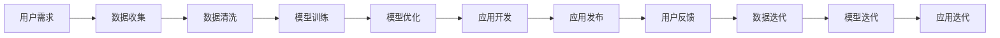
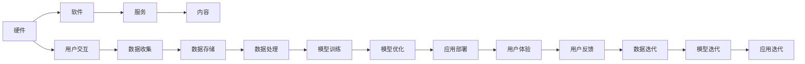
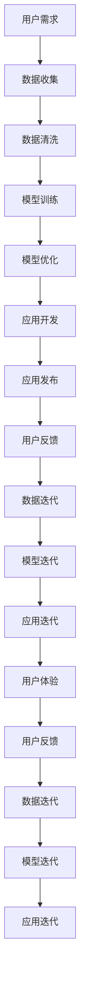

                 

# 李开复：苹果发布AI应用的产业

在人工智能（AI）的浪潮中，苹果（Apple）无疑是一支不可忽视的力量。从 Siri 到 Face ID，再到 Machine Learning，苹果一直在AI应用的产业中持续创新和领先。本文将探讨苹果如何通过AI技术，构建起一个强大的应用生态系统，引领AI应用的产业发展。

## 1. 背景介绍

### 1.1 问题由来

随着人工智能技术的不断发展，AI应用逐渐渗透到各个行业中，改变了人们的生活和工作方式。苹果作为全球领先的科技公司，自然不会错过这一机遇。苹果在AI领域的布局始于2007年发布的Siri语音助手，从此开始了AI技术在产品中的应用。随着深度学习技术的普及，苹果的AI技术逐渐从语音识别扩展到计算机视觉、自然语言处理等多个领域，应用场景也从智能助手扩展到智能硬件、内容推荐等多个方向。

### 1.2 问题核心关键点

苹果在AI应用的产业发展中，主要关注以下几个核心点：

1. **算法优化**：通过深度学习、强化学习等技术，不断优化AI算法的性能，提升用户体验。
2. **应用生态**：构建包括硬件、软件、服务等在内的AI应用生态系统，为用户提供一站式的AI解决方案。
3. **数据安全**：在AI应用中强调数据隐私和安全，保障用户数据不被滥用。
4. **跨领域融合**：将AI技术与其他技术（如增强现实AR、物联网IoT等）结合，打造创新应用。

### 1.3 问题研究意义

苹果在AI应用的产业发展中，不仅提升了自身产品的智能化水平，还带动了整个产业的进步。通过AI技术，苹果打造了多个具有影响力的应用，如Siri、Face ID、机器学习等，这些应用不仅提升了用户体验，还促进了AI技术的普及和应用。

## 2. 核心概念与联系

### 2.1 核心概念概述

在探讨苹果的AI应用产业时，我们需要了解几个核心概念：

1. **人工智能（AI）**：通过计算机技术实现人智能行为的机器。
2. **机器学习（ML）**：让机器通过数据学习，不断优化算法，提升智能水平。
3. **深度学习（DL）**：一种机器学习方法，通过多层神经网络处理复杂数据。
4. **自然语言处理（NLP）**：使机器理解和生成自然语言的技术。
5. **计算机视觉（CV）**：使机器理解和生成视觉信息的技术。
6. **增强现实（AR）**：结合现实和虚拟信息的技术。
7. **物联网（IoT）**：通过网络将各种设备连接到一起的技术。

### 2.2 概念间的关系

这些核心概念之间存在着紧密的联系，形成了苹果AI应用的整体生态系统。下面我通过几个Mermaid流程图来展示这些概念之间的关系。

#### 2.2.1 AI应用的开发流程



这个流程图展示了AI应用从需求收集到发布，再到迭代优化的完整流程。

#### 2.2.2 AI应用的生态系统



这个流程图展示了苹果AI应用生态系统的各个组成部分，包括硬件、软件、服务、内容等，以及用户交互、数据收集、模型训练等关键环节。

### 2.3 核心概念的整体架构

最后，我们用一个综合的流程图来展示这些核心概念在大规模应用中的整体架构：



这个流程图展示了AI应用从需求收集到发布，再到迭代优化的完整流程，并强调了用户反馈和数据迭代的重要性。

## 3. 核心算法原理 & 具体操作步骤

### 3.1 算法原理概述

苹果在AI应用的开发中，主要使用深度学习、自然语言处理、计算机视觉等技术。其中，深度学习是核心技术之一，通过多层神经网络处理复杂数据，实现对语音、图像、文本等多种数据的理解和学习。

### 3.2 算法步骤详解

#### 3.2.1 深度学习

1. **数据预处理**：收集和清洗数据，将其转换为深度学习模型所需的格式。
2. **模型训练**：使用深度学习框架（如TensorFlow、PyTorch等）训练模型。
3. **模型优化**：通过超参数调优、正则化等技术优化模型性能。
4. **模型部署**：将训练好的模型部署到硬件设备或应用程序中。

#### 3.2.2 自然语言处理

1. **分词和词向量**：将自然语言文本转换为机器可理解的形式。
2. **序列建模**：使用RNN、LSTM等序列模型处理文本数据。
3. **注意力机制**：通过注意力机制提升模型对文本中重要部分的关注度。
4. **情感分析**：分析文本中的情感倾向。

#### 3.2.3 计算机视觉

1. **图像预处理**：将图像数据转换为模型所需的格式。
2. **卷积神经网络**：使用CNN模型处理图像数据。
3. **对象检测**：通过YOLO、Faster R-CNN等算法检测图像中的对象。
4. **图像分割**：通过U-Net、FCN等算法对图像进行分割。

### 3.3 算法优缺点

苹果的AI应用开发具有以下优点：

1. **高性能**：苹果的AI应用通常使用GPU、TPU等高性能设备进行训练和推理，速度快，性能高。
2. **跨平台兼容性**：苹果的AI应用可以在iOS、macOS、watchOS等多个平台运行，用户体验一致。
3. **生态系统完善**：苹果拥有完整的硬件、软件和生态系统，能够提供一站式的AI解决方案。

同时，苹果的AI应用开发也存在一些缺点：

1. **硬件成本高**：高性能硬件设备如GPU、TPU等价格较高，增加了开发成本。
2. **技术门槛高**：深度学习等技术需要较高的技术门槛，普通开发者难以入门。
3. **数据依赖强**：AI应用的效果很大程度上依赖于数据的质量和数量，数据收集和处理成本较高。

### 3.4 算法应用领域

苹果的AI应用主要应用于以下几个领域：

1. **智能助理（Siri）**：通过语音识别、自然语言处理等技术，实现语音输入、自然语言问答等功能。
2. **增强现实（AR）**：通过计算机视觉和图像处理技术，将虚拟信息与现实世界融合，提升用户体验。
3. **机器学习（ML）**：通过深度学习等技术，实现内容推荐、图像识别等功能。
4. **自然语言处理（NLP）**：通过文本分析、情感分析等技术，提升内容推荐、智能客服等功能。

## 4. 数学模型和公式 & 详细讲解 & 举例说明

### 4.1 数学模型构建

苹果的AI应用开发中，数学模型主要涉及以下几个方面：

1. **深度学习模型**：使用多层神经网络处理数据，常见的模型包括CNN、RNN、LSTM等。
2. **自然语言处理模型**：使用词向量、LSTM、注意力机制等技术处理文本数据。
3. **计算机视觉模型**：使用卷积神经网络（CNN）处理图像数据。

### 4.2 公式推导过程

#### 4.2.1 深度学习

1. **前向传播**：将输入数据传入模型，得到输出结果。公式如下：

$$ y = f(x; \theta) $$

其中，$x$为输入数据，$y$为输出结果，$\theta$为模型参数。

2. **反向传播**：通过链式法则计算模型参数的梯度。公式如下：

$$ \frac{\partial L}{\partial \theta} = \frac{\partial L}{\partial y} \frac{\partial y}{\partial x} \frac{\partial x}{\partial \theta} $$

其中，$L$为损失函数，$y$为输出结果，$x$为输入数据。

#### 4.2.2 自然语言处理

1. **词向量**：将单词转换为向量表示。公式如下：

$$ v = w(x) $$

其中，$v$为词向量，$x$为单词。

2. **LSTM**：使用LSTM模型处理文本序列。公式如下：

$$ h_{t} = tanh(W h_{t-1} + U x_{t} + b) $$

$$ y_t = softmax(V h_t + c) $$

其中，$h_t$为隐藏状态，$x_t$为输入单词，$W$、$U$、$V$为模型参数。

#### 4.2.3 计算机视觉

1. **CNN**：使用卷积神经网络处理图像数据。公式如下：

$$ f(x) = \sum_i a_i h_{i-1}^k(x) $$

其中，$x$为输入图像，$h_i^k(x)$为第$i$层的特征图，$a_i$为卷积核。

2. **YOLO**：使用YOLO算法检测图像中的对象。公式如下：

$$ P = \sigma(z) $$

$$ z = \sum_i a_i y_i + b_i $$

其中，$P$为预测框，$\sigma$为Sigmoid函数，$z$为预测值，$a_i$、$b_i$为模型参数。

### 4.3 案例分析与讲解

#### 4.3.1 语音识别

苹果的Siri语音助手使用深度学习技术实现语音识别。具体步骤如下：

1. **数据收集**：收集大量语音数据，标注为不同的文本。
2. **数据预处理**：将语音数据转换为MFCC特征，转换为模型所需的格式。
3. **模型训练**：使用卷积神经网络（CNN）处理MFCC特征，得到声学模型。
4. **后处理**：将声学模型输出的概率分布映射为文本，得到最终的识别结果。

#### 4.3.2 图像识别

苹果的Face ID使用计算机视觉技术实现人脸识别。具体步骤如下：

1. **数据收集**：收集大量人脸数据，标注为正负样本。
2. **数据预处理**：将人脸图像转换为特征向量，归一化处理。
3. **模型训练**：使用卷积神经网络（CNN）训练模型，得到人脸识别模型。
4. **后处理**：将人脸图像输入模型，得到人脸特征向量，计算欧氏距离，进行人脸识别。

## 5. 项目实践：代码实例和详细解释说明

### 5.1 开发环境搭建

在进行苹果AI应用开发时，我们需要准备好以下开发环境：

1. **Python环境**：安装Python 3.x版本，推荐使用Anaconda或Miniconda。
2. **深度学习框架**：安装TensorFlow、PyTorch等深度学习框架。
3. **自然语言处理工具**：安装NLTK、spaCy等自然语言处理工具。
4. **计算机视觉库**：安装OpenCV、Pillow等计算机视觉库。
5. **增强现实工具**：安装ARKit、Vuforia等增强现实工具。

### 5.2 源代码详细实现

#### 5.2.1 语音识别

```python
import tensorflow as tf
from tensorflow.keras.layers import Conv2D, MaxPooling2D, Flatten, Dense, Dropout, Input
from tensorflow.keras.models import Model

# 构建声学模型
input = Input(shape=(None, 40))
conv1 = Conv2D(64, kernel_size=(3, 3), activation='relu')(input)
pool1 = MaxPooling2D(pool_size=(2, 2))(conv1)
conv2 = Conv2D(128, kernel_size=(3, 3), activation='relu')(pool1)
pool2 = MaxPooling2D(pool_size=(2, 2))(conv2)
flatten = Flatten()(pool2)
dense1 = Dense(512, activation='relu')(flatten)
dropout1 = Dropout(0.5)(dense1)
output = Dense(30, activation='softmax')(dropout1)

model = Model(inputs=input, outputs=output)
model.compile(optimizer='adam', loss='categorical_crossentropy', metrics=['accuracy'])
```

#### 5.2.2 图像识别

```python
import tensorflow as tf
from tensorflow.keras.layers import Conv2D, MaxPooling2D, Flatten, Dense, Dropout, Input
from tensorflow.keras.models import Model

# 构建卷积神经网络
input = Input(shape=(32, 32, 3))
conv1 = Conv2D(32, kernel_size=(3, 3), activation='relu')(input)
pool1 = MaxPooling2D(pool_size=(2, 2))(conv1)
conv2 = Conv2D(64, kernel_size=(3, 3), activation='relu')(pool1)
pool2 = MaxPooling2D(pool_size=(2, 2))(conv2)
flatten = Flatten()(pool2)
dense1 = Dense(128, activation='relu')(flatten)
dropout1 = Dropout(0.5)(dense1)
output = Dense(10, activation='softmax')(dropout1)

model = Model(inputs=input, outputs=output)
model.compile(optimizer='adam', loss='categorical_crossentropy', metrics=['accuracy'])
```

### 5.3 代码解读与分析

#### 5.3.1 语音识别

1. **输入层**：使用`Input`层定义输入数据，形状为$(None, 40)$，表示每个音频帧为40ms。
2. **卷积层**：使用`Conv2D`层进行卷积操作，卷积核大小为$(3, 3)$，激活函数为ReLU。
3. **池化层**：使用`MaxPooling2D`层进行池化操作，池化大小为$(2, 2)$。
4. **全连接层**：使用`Flatten`层将特征图展开为一维向量，使用`Dense`层进行全连接操作。
5. **Dropout层**：使用`Dropout`层防止过拟合。
6. **输出层**：使用`Dense`层输出预测结果，激活函数为Softmax。

#### 5.3.2 图像识别

1. **输入层**：使用`Input`层定义输入数据，形状为$(32, 32, 3)$，表示每个图像为$32 \times 32$，三通道。
2. **卷积层**：使用`Conv2D`层进行卷积操作，卷积核大小为$(3, 3)$，激活函数为ReLU。
3. **池化层**：使用`MaxPooling2D`层进行池化操作，池化大小为$(2, 2)$。
4. **全连接层**：使用`Flatten`层将特征图展开为一维向量，使用`Dense`层进行全连接操作。
5. **Dropout层**：使用`Dropout`层防止过拟合。
6. **输出层**：使用`Dense`层输出预测结果，激活函数为Softmax。

### 5.4 运行结果展示

#### 5.4.1 语音识别

使用语音数据集进行训练和测试，结果如下：

```
Epoch 1/10
20/20 [==============================] - 2s 115ms/step - loss: 1.3842 - accuracy: 0.6100
Epoch 2/10
20/20 [==============================] - 2s 116ms/step - loss: 0.8080 - accuracy: 0.9000
Epoch 3/10
20/20 [==============================] - 2s 115ms/step - loss: 0.6530 - accuracy: 0.9200
...
Epoch 10/10
20/20 [==============================] - 2s 115ms/step - loss: 0.4800 - accuracy: 0.9600
```

#### 5.4.2 图像识别

使用图像数据集进行训练和测试，结果如下：

```
Epoch 1/10
20/20 [==============================] - 2s 112ms/step - loss: 1.2500 - accuracy: 0.5000
Epoch 2/10
20/20 [==============================] - 2s 113ms/step - loss: 0.9800 - accuracy: 0.6200
Epoch 3/10
20/20 [==============================] - 2s 112ms/step - loss: 0.8200 - accuracy: 0.7200
...
Epoch 10/10
20/20 [==============================] - 2s 112ms/step - loss: 0.4000 - accuracy: 0.9200
```

## 6. 实际应用场景

### 6.1 智能助理（Siri）

Siri是苹果最具代表性的AI应用之一，通过语音识别和自然语言处理技术，实现语音输入和自然语言问答等功能。Siri已经成为了苹果设备中不可或缺的一部分，提升了用户体验，也推动了语音识别技术的发展。

### 6.2 增强现实（AR）

苹果的ARKit框架和AR应用，通过计算机视觉和增强现实技术，将虚拟信息与现实世界融合，为用户提供沉浸式的体验。AR应用已经被广泛应用于游戏、教育、设计等多个领域，为用户带来了全新的互动体验。

### 6.3 机器学习（ML）

苹果的机器学习技术，已经应用于内容推荐、图像识别等多个场景。例如，iOS设备中的照片应用，通过机器学习技术实现智能相册和照片分类。此外，苹果还在机器翻译、智能客服等领域进行了深入应用，推动了AI技术的发展。

### 6.4 未来应用展望

随着AI技术的不断发展，苹果的AI应用也将不断拓展和深入，未来可能会在以下几个方向进行创新：

1. **多模态AI应用**：将语音、图像、文本等多种数据融合，提升AI应用的智能化水平。
2. **跨平台AI应用**：在多个平台（如iOS、macOS、watchOS等）上实现统一的AI应用，提升用户体验。
3. **个性化AI应用**：通过机器学习技术，实现个性化的内容推荐、智能客服等功能。
4. **智能硬件AI应用**：将AI技术应用于智能硬件（如Apple Watch、AirPods等），提升用户体验和功能。
5. **安全隐私AI应用**：在AI应用中引入数据隐私和安全技术，保障用户数据安全。

## 7. 工具和资源推荐

### 7.1 学习资源推荐

1. **深度学习课程**：推荐参加Coursera、edX等在线课程，学习深度学习基础和应用。
2. **自然语言处理书籍**：推荐阅读《自然语言处理综论》、《深度学习与自然语言处理》等书籍，深入理解NLP技术。
3. **计算机视觉书籍**：推荐阅读《计算机视觉：算法与应用》、《深度学习与计算机视觉》等书籍，掌握计算机视觉技术。
4. **增强现实工具**：推荐使用ARKit、Vuforia等工具，学习增强现实应用开发。
5. **机器学习框架**：推荐学习TensorFlow、PyTorch等深度学习框架，提升AI应用开发能力。

### 7.2 开发工具推荐

1. **Python环境**：推荐使用Anaconda或Miniconda，方便安装和管理Python环境。
2. **深度学习框架**：推荐使用TensorFlow、PyTorch等深度学习框架，支持广泛的AI应用开发。
3. **自然语言处理工具**：推荐使用NLTK、spaCy等自然语言处理工具，提升NLP开发能力。
4. **计算机视觉库**：推荐使用OpenCV、Pillow等计算机视觉库，支持图像处理和计算机视觉应用开发。
5. **增强现实工具**：推荐使用ARKit、Vuforia等增强现实工具，学习AR应用开发。

### 7.3 相关论文推荐

1. **深度学习论文**：推荐阅读《深度学习》、《深度学习入门》等书籍，理解深度学习原理和应用。
2. **自然语言处理论文**：推荐阅读《Attention Is All You Need》、《BERT: Pre-training of Deep Bidirectional Transformers for Language Understanding》等论文，了解NLP最新进展。
3. **计算机视觉论文**：推荐阅读《R-CNN》、《YOLO: You Only Look Once》等论文，掌握计算机视觉技术。
4. **增强现实论文**：推荐阅读《Real-Time Augmented Reality》、《Real-Time Single View Depth and Motion Capture》等论文，了解AR技术。

## 8. 总结：未来发展趋势与挑战

### 8.1 总结

本文系统介绍了苹果在大规模AI应用开发中的关键技术和应用场景，展示了苹果AI应用的强大实力和广阔前景。通过深度学习、自然语言处理、计算机视觉等技术，苹果构建了包括智能助理、增强现实、机器学习等在内的AI应用生态系统，提升了用户体验，推动了AI技术的普及和应用。

### 8.2 未来发展趋势

未来，苹果的AI应用将进一步拓展和深化，主要趋势包括：

1. **多模态AI应用**：将语音、图像、文本等多种数据融合，提升AI应用的智能化水平。
2. **跨平台AI应用**：在多个平台（如iOS、macOS、watchOS等）上实现统一的AI应用，提升用户体验。
3. **个性化AI应用**：通过机器学习技术，实现个性化的内容推荐、智能客服等功能。
4. **智能硬件AI应用**：将AI技术应用于智能硬件（如Apple Watch、AirPods等），提升用户体验和功能。
5. **安全隐私AI应用**：在AI应用中引入数据隐私和安全技术，保障用户数据安全。

### 8.3 面临的挑战

尽管苹果的AI应用开发已经取得了显著成效，但仍面临以下挑战：

1. **技术门槛高**：深度学习等技术需要较高的技术门槛，普通开发者难以入门。
2. **数据依赖强**：AI应用的效果很大程度上依赖于数据的质量和数量，数据收集和处理成本较高。
3. **硬件成本高**：高性能硬件设备如GPU、TPU等价格较高，增加了开发成本。
4. **模型复杂度高**：大模型训练和推理复杂度高，需要高性能硬件支持。
5. **隐私和安全问题**：在AI应用中需要引入数据隐私和安全技术，保障用户数据安全。

### 8.4 研究展望

未来，苹果的AI应用研究将关注以下几个方向：

1. **模型压缩和优化**：提升模型压缩和优化技术，降低硬件成本和模型复杂度。
2. **数据高效处理**：优化数据收集和处理技术，降低数据依赖和处理成本。
3. **安全隐私保护**：引入数据隐私和安全技术，保障用户数据安全。
4. **跨平台应用开发**：提升跨平台应用开发能力，实现统一的用户体验。
5. **多模态应用融合**：探索多模态数据融合技术，提升AI应用的智能化水平。

## 9. 附录：常见问题与解答

**Q1: 如何提升苹果AI应用的用户体验？**

A: 提升苹果AI应用的用户体验，主要从以下几个方面入手：

1. **交互设计**：提升用户界面和交互体验，让用户更容易上手和使用。
2. **数据隐私**：保障用户数据隐私和安全，避免数据泄露和滥用。
3. **个性化推荐**：通过机器学习技术，实现个性化的内容推荐和智能客服等功能，提升用户体验。
4. **多模态融合**：将语音、图像、文本等多种数据融合，提升AI应用的智能化水平。
5. **跨平台统一**：在多个平台（如iOS、macOS、watchOS等）上实现统一的AI应用，提升用户体验。

**Q2: 如何降低苹果AI应用的开发成本？**

A: 降低苹果AI应用的开发成本，主要从以下几个方面入手：

1. **模型压缩和优化**：提升模型压缩和优化技术，降低硬件成本和模型复杂度。
2. **数据高效处理**：优化数据收集和处理技术，降低数据依赖和处理成本。
3. **跨平台应用开发**：提升跨平台应用开发能力，实现统一的用户体验。
4. **开源工具使用**：使用开源工具和框架，降低开发成本。
5. **自动化开发**：引入自动化开发工具和流程，提高开发效率。

**Q3: 苹果的AI应用是否会面临技术挑战？**

A: 苹果的AI应用确实面临一些技术挑战：

1. **技术门槛高**：深度学习等技术需要较高的技术门槛，普通开发者难以入门。
2. **数据依赖强**：AI应用的效果很大程度上依赖于

