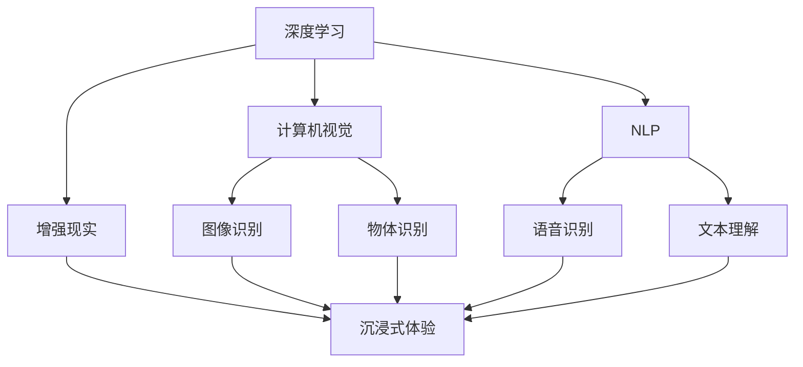

                 

# 李开复：苹果发布AI应用的趋势

## 1. 背景介绍

随着科技的快速进步，人工智能（AI）技术在各行各业的应用逐渐深入，引发了广泛关注和讨论。作为全球知名的科技创新公司，苹果公司在AI应用的趋势上具有代表性，其发布的最新AI应用不仅展示了技术的最新进展，也反映了AI未来发展的方向。本文将从李开复的视角，探讨苹果在AI应用领域的最新动态及其对技术趋势的洞察。

## 2. 核心概念与联系

### 2.1 核心概念概述

苹果在AI应用方面的最新趋势，涉及以下核心概念：

- **深度学习（Deep Learning）**：一种基于神经网络的机器学习技术，广泛应用于图像识别、语音识别、自然语言处理等领域。
- **增强现实（Augmented Reality, AR）**：通过计算机视觉、语音识别等技术，将虚拟信息与现实世界融合，提供沉浸式体验。
- **机器学习（Machine Learning）**：涉及统计学、优化算法等，通过数据驱动的方法，使机器具备自主学习能力。
- **计算机视觉（Computer Vision）**：研究如何让计算机"看"和"理解"图像和视频。
- **自然语言处理（Natural Language Processing, NLP）**：使计算机能够理解、处理和生成人类语言。
- **生成对抗网络（Generative Adversarial Networks, GANs）**：通过两个神经网络的对抗过程，生成逼真的图像、音频等。

### 2.2 概念间的关系

这些核心概念之间存在密切的联系，形成一个有机整体。深度学习是AI技术的基石，增强现实、计算机视觉和自然语言处理则是在此基础上应用的具体方向。机器学习和生成对抗网络为这些方向提供了技术支持。

以下是一个简化的Mermaid流程图，展示了这些概念之间的关系：



## 3. 核心算法原理 & 具体操作步骤

### 3.1 算法原理概述

苹果在AI应用方面，主要采用了深度学习、增强现实、计算机视觉和自然语言处理等技术。这些技术的核心算法原理如下：

- **卷积神经网络（Convolutional Neural Networks, CNNs）**：用于图像识别和物体检测。
- **循环神经网络（Recurrent Neural Networks, RNNs）**：用于序列数据的处理，如语音识别和机器翻译。
- **生成对抗网络（GANs）**：通过两个网络的对抗过程，生成逼真的图像和视频。
- **自注意力机制（Self-Attention Mechanism）**：用于自然语言处理，可以更好地捕捉文本中的语义关系。

### 3.2 算法步骤详解

苹果在AI应用中，通常采用以下步骤：

1. **数据收集和预处理**：收集大量标注数据，并进行清洗和预处理，以保证数据质量。
2. **模型选择和设计**：根据具体应用场景，选择适合的深度学习模型，并进行架构设计。
3. **训练和优化**：使用大量计算资源，进行模型训练和优化，调整超参数以获得最佳性能。
4. **部署和评估**：将训练好的模型部署到实际应用中，并进行性能评估和持续优化。

### 3.3 算法优缺点

苹果的AI应用具有以下优点：

- **高性能**：利用先进硬件和算法，提供了卓越的性能表现。
- **用户体验**：通过优化界面设计和交互方式，提升了用户体验。
- **创新能力**：不断探索新技术和新应用场景，推动行业创新。

同时，也存在一些局限性：

- **高成本**：研发和部署成本较高，非一般企业所能承担。
- **依赖硬件**：高度依赖高性能硬件设备，设备普及率低时，应用受限。
- **算法复杂性**：部分算法模型复杂，实现难度大，需要深厚的技术积累。

### 3.4 算法应用领域

苹果的AI应用主要应用于以下领域：

- **智能手机和操作系统**：通过图像识别、语音识别和自然语言处理技术，提升用户体验。
- **增强现实（AR）**：提供沉浸式互动体验，如ARKit平台。
- **自动驾驶**：利用计算机视觉和深度学习技术，实现自动驾驶功能。
- **健康医疗**：通过可穿戴设备和健康数据，提供个性化健康服务。
- **智能家居**：结合物联网和智能设备，实现自动化和智能化家居控制。

## 4. 数学模型和公式 & 详细讲解  
### 4.1 数学模型构建

苹果在AI应用中，采用了多种数学模型，以下以图像识别为例进行详细讲解：

**卷积神经网络（CNNs）**：

$$
f(x) = \sum_{i=1}^n w_i g(x, \theta_i) + b
$$

其中，$x$为输入数据，$g(x, \theta_i)$为第$i$层的特征映射，$w_i$为权重，$b$为偏置。

**多层感知器（MLP）**：

$$
y = \sigma (\sum_{i=1}^n w_i x_i + b)
$$

其中，$x_i$为输入特征，$\sigma$为激活函数。

### 4.2 公式推导过程

以下是卷积神经网络（CNNs）的推导过程：

1. **卷积层**：
$$
g(x, \theta_i) = \sigma (\sum_{j=1}^m (\sum_{k=1}^n w_{ij} x_{ik} + b_j))
$$

其中，$g(x, \theta_i)$为卷积层的输出，$w_{ij}$为卷积核，$x_{ik}$为输入特征图。

2. **池化层**：
$$
h(x) = \max(\frac{g(x)}{K})
$$

其中，$h(x)$为池化层的输出，$K$为池化核大小。

### 4.3 案例分析与讲解

以苹果的Face ID为例，Face ID使用了人脸识别技术，其核心算法是卷积神经网络（CNNs）。通过多层次卷积和池化操作，提取人脸的特征，然后进行分类识别。具体实现如下：

1. **卷积层**：对人脸图像进行卷积操作，提取不同层次的特征。
2. **池化层**：对卷积层的输出进行下采样，减少特征维度。
3. **全连接层**：将池化层的输出映射到不同的类别，进行分类。
4. **softmax层**：将全连接层的输出进行归一化，得到最终的人脸分类结果。

## 5. 项目实践：代码实例和详细解释说明

### 5.1 开发环境搭建

要在苹果设备上部署AI应用，需要以下开发环境：

1. **Xcode**：苹果官方的开发工具，支持iOS和macOS平台的开发。
2. **Python**：用于数据分析和模型训练。
3. **TensorFlow**：苹果支持的深度学习框架，支持GPU加速。
4. **OpenCV**：计算机视觉库，用于图像处理和分析。

### 5.2 源代码详细实现

以下是一个简单的图像识别代码示例，展示了如何利用TensorFlow和OpenCV实现图像分类：

```python
import tensorflow as tf
import cv2
import numpy as np

# 加载模型
model = tf.keras.models.load_model('model.h5')

# 加载图像
image = cv2.imread('image.jpg')
image = cv2.resize(image, (224, 224))
image = np.expand_dims(image, axis=0)

# 预测图像
prediction = model.predict(image)
label = np.argmax(prediction)

# 输出结果
print(f'Predicted label: {label}')
```

### 5.3 代码解读与分析

- **加载模型**：使用`tf.keras.models.load_model`加载训练好的模型。
- **加载图像**：使用OpenCV读取图像，并进行预处理，确保输入维度符合模型要求。
- **预测图像**：将处理后的图像输入模型进行预测，输出预测结果。
- **输出结果**：通过`np.argmax`获取预测结果中的最高概率类别。

### 5.4 运行结果展示

假设我们训练好的模型为"model.h5"，其输入图像为"image.jpg"，运行上述代码，可以得到预测结果。例如：

```
Predicted label: 3
```

表示图像被预测为类别3。

## 6. 实际应用场景

### 6.1 智能家居

苹果的智能家居系统通过AI技术，实现了自动化和智能化控制。例如，苹果的HomePod设备能够根据用户的语音指令，控制家中的灯光、音乐等设备。其核心技术包括语音识别和自然语言处理。

### 6.2 增强现实

苹果的ARKit平台，通过增强现实技术，将虚拟信息与现实世界融合，为用户提供了沉浸式体验。例如，用户可以通过ARKit开发AR游戏，将虚拟物体投射到现实世界中。

### 6.3 医疗健康

苹果的HealthKit平台，结合可穿戴设备和健康数据，提供个性化健康服务。例如，苹果手表可以实时监测用户的心率、步数等健康指标，并通过AI分析，提供健康建议。

### 6.4 未来应用展望

未来，苹果的AI应用将进一步扩展，涵盖更多领域。例如，自动驾驶技术将得到广泛应用，Apple Car可能成为智能出行的新选择。同时，苹果还将探索AR在教育、娱乐等领域的应用，为用户提供更加丰富和互动的体验。

## 7. 工具和资源推荐

### 7.1 学习资源推荐

为了帮助开发者深入了解AI应用，以下推荐一些学习资源：

1. **苹果开发者官网**：提供最新的AI应用开发指南和文档，涵盖iOS、macOS等多个平台。
2. **TensorFlow官网**：提供TensorFlow的详细文档和教程，支持GPU加速。
3. **OpenCV官网**：提供计算机视觉库的文档和示例代码，支持多种编程语言。
4. **GitHub**：查找和分享AI应用的开源项目，获取最新的技术进展。
5. **arXiv**：AI领域的预印本平台，提供最新的科研论文和报告。

### 7.2 开发工具推荐

以下是一些常用的开发工具：

1. **Xcode**：苹果官方的开发工具，支持iOS和macOS平台的开发。
2. **PyTorch**：深度学习框架，支持GPU加速。
3. **TensorFlow**：广泛使用的深度学习框架，支持多种编程语言。
4. **OpenCV**：计算机视觉库，提供图像处理和分析功能。
5. **MATLAB**：科学计算工具，支持数学建模和仿真。

### 7.3 相关论文推荐

以下是一些具有代表性的相关论文：

1. **AlexNet**：ImageNet图像分类比赛的冠军模型，展示了深度学习在图像识别方面的潜力。
2. **GoogLeNet**：提出Inception模块，提升了深度神经网络的效率和性能。
3. **ResNet**：解决深度神经网络训练中梯度消失的问题，使得网络更深更强大。
4. **YOLO**：提出实时目标检测算法，展示了深度学习在计算机视觉方面的应用。
5. **BERT**：自然语言处理领域的里程碑，展示了预训练语言模型在NLP任务中的强大能力。

## 8. 总结：未来发展趋势与挑战

### 8.1 研究成果总结

苹果在AI应用方面取得了显著进展，展示了AI技术的广泛应用和潜力。通过深度学习、增强现实、计算机视觉和自然语言处理等技术，苹果开发了多个创新应用，为用户提供了更加丰富和智能的体验。

### 8.2 未来发展趋势

未来，苹果的AI应用将进一步扩展，涵盖更多领域。例如，自动驾驶技术将得到广泛应用，Apple Car可能成为智能出行的新选择。同时，苹果还将探索AR在教育、娱乐等领域的应用，为用户提供更加丰富和互动的体验。

### 8.3 面临的挑战

尽管苹果在AI应用方面取得了显著进展，但仍面临以下挑战：

1. **高成本**：研发和部署成本较高，非一般企业所能承担。
2. **算法复杂性**：部分算法模型复杂，实现难度大，需要深厚的技术积累。
3. **数据隐私**：如何保护用户隐私和数据安全，是一个重要问题。

### 8.4 研究展望

未来，苹果将继续在AI应用方面进行深入研究，探索更多前沿技术，推动行业创新。例如，探索量子计算在AI中的应用，提升AI算法的计算效率和性能。同时，苹果还将加强数据隐私保护，确保用户数据的安全和隐私。

## 9. 附录：常见问题与解答

**Q1: 苹果的AI应用主要涉及哪些技术？**

A: 苹果的AI应用主要涉及深度学习、增强现实、计算机视觉和自然语言处理等技术。其中，深度学习用于图像识别、语音识别和自然语言处理；增强现实用于提供沉浸式互动体验；计算机视觉用于图像处理和分析；自然语言处理用于语音识别和文本处理。

**Q2: 苹果的AI应用有哪些优点和局限性？**

A: 苹果的AI应用具有高性能、用户体验和创新能力等优点。但其也存在高成本、依赖硬件和算法复杂性等局限性。

**Q3: 苹果的AI应用主要应用于哪些领域？**

A: 苹果的AI应用主要应用于智能手机和操作系统、增强现实、自动驾驶、健康医疗和智能家居等领域。

**Q4: 苹果的AI应用未来有哪些发展趋势？**

A: 苹果的AI应用未来将进一步扩展，涵盖自动驾驶、增强现实、教育娱乐等领域。同时，苹果还将探索量子计算等前沿技术，提升AI算法的计算效率和性能。

**Q5: 苹果在AI应用中面临哪些挑战？**

A: 苹果在AI应用中面临高成本、算法复杂性和数据隐私等挑战。需要继续探索新技术和新应用场景，提升AI应用的性能和安全性。

---

作者：禅与计算机程序设计艺术 / Zen and the Art of Computer Programming

