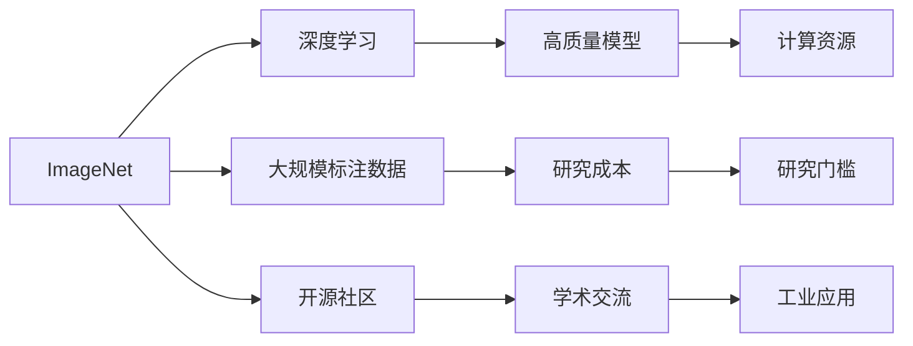
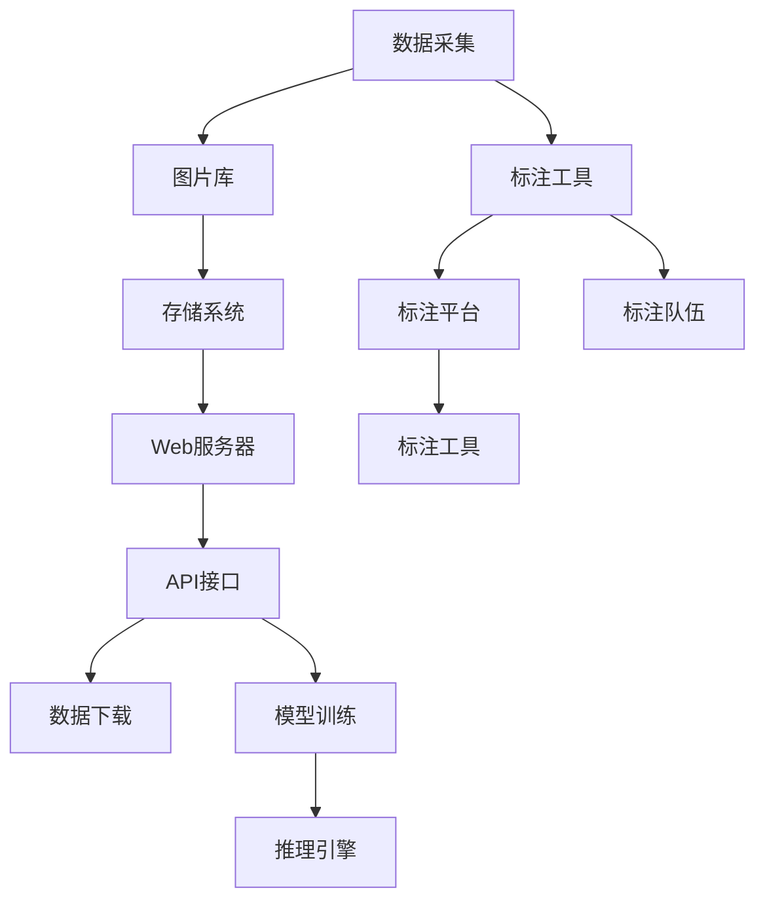
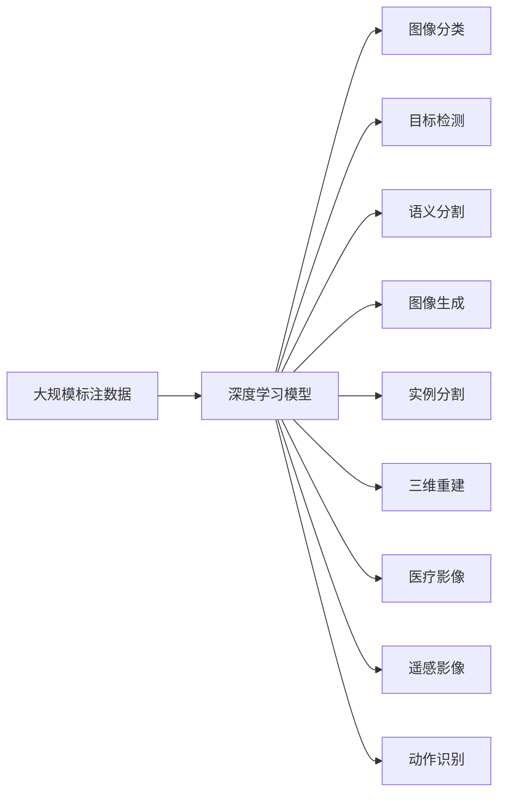

                 

# 李飞飞与ImageNet的贡献

## 1. 背景介绍

### 1.1 问题由来
在人工智能的历史上，有许多里程碑式的研究成果，它们不仅推动了技术的发展，更是深刻改变了社会生活的面貌。其中，ImageNet项目是近年来在计算机视觉领域最具影响力的成果之一，它极大地促进了深度学习技术的普及和应用。该项目由斯坦福大学的计算机视觉专家李飞飞教授主导，旨在构建一个包含数百万个标注图片的开源数据集，供全球的研究人员使用。

### 1.2 问题核心关键点
ImageNet项目的关键点在于其数据集的高质量、大规模和开放性。该数据集包含超过一百万个训练图片和一千个类别标签，覆盖了广泛的视觉对象。项目的目标是通过大规模标注数据，训练出能够理解并分类图像的深度神经网络。

### 1.3 问题研究意义
ImageNet项目不仅推动了计算机视觉技术的发展，还促进了人工智能和机器学习领域的学术交流与合作。它为深度学习提供了大规模的真实世界数据，极大地降低了研究的成本和门槛，推动了机器学习技术在工业界的应用。同时，ImageNet项目也激发了研究者对大规模数据处理和计算资源的需求，推动了硬件和软件基础设施的发展。

## 2. 核心概念与联系

### 2.1 核心概念概述

为了更好地理解李飞飞与ImageNet的贡献，本节将介绍几个关键概念及其关系：

- **ImageNet**：斯坦福大学计算机视觉实验室开发的大规模视觉数据集，包含超过一百万个训练图片和一千个类别标签，是深度学习视觉分类任务的主要基准。
- **深度学习**：一种基于神经网络的机器学习技术，通过多层次的非线性变换，可以自动提取和表示图像的高级特征。
- **大规模标注数据**：通过人工标注的方式获取大量带有标签的数据集，为训练深度学习模型提供丰富的训练样本。
- **开源社区**：ImageNet的开放性使得全球的研究人员可以免费使用该数据集，促进了学术交流与合作。
- **计算资源**：高质量的深度学习模型训练需要强大的计算资源，包括GPU、分布式计算框架等。

这些概念之间的逻辑关系可以通过以下Mermaid流程图来展示：



这个流程图展示了大规模标注数据与深度学习、开源社区与研究合作、计算资源与高质量模型之间的关系：

1. ImageNet通过大规模标注数据，为深度学习训练提供了丰富的样本和标签。
2. ImageNet的开源性促进了全球研究人员的合作，降低了研究的成本和门槛。
3. 高质量的深度学习模型训练需要强大的计算资源，推动了硬件和软件基础设施的发展。

### 2.2 概念间的关系

这些概念之间存在着紧密的联系，形成了ImageNet项目的完整生态系统。下面我们通过几个Mermaid流程图来展示这些概念之间的关系。

#### 2.2.1 ImageNet的架构



这个流程图展示了ImageNet的架构：

1. 数据采集：通过爬虫或人工采集的方式，获取网络上的图片。
2. 标注工具：使用人工标注工具，对图片进行标注。
3. 图片库和存储系统：存储标注好的图片及其元数据。
4. Web服务器和API接口：提供数据下载和模型训练接口。
5. 标注平台和标注队伍：组织标注人员进行标注工作。
6. 推理引擎：用于模型的推理和预测。

#### 2.2.2 ImageNet的应用



这个流程图展示了ImageNet数据集在各种计算机视觉任务中的应用：

1. 图像分类：将图像分为不同的类别。
2. 目标检测：在图像中定位和识别物体。
3. 语义分割：将图像分割为具有语义意义的区域。
4. 图像生成：生成具有特定风格的图像。
5. 实例分割：在图像中定位和分割实例。
6. 三维重建：通过图像数据重建三维模型。
7. 医疗影像：在医疗影像中进行诊断。
8. 遥感影像：在遥感数据中进行地物识别。
9. 动作识别：从视频中识别人体动作。

## 3. 核心算法原理 & 具体操作步骤
### 3.1 算法原理概述

ImageNet项目的关键在于大规模标注数据的构建和深度学习模型的训练。其核心思想是：通过人工标注的方式获取大量带标签的图像数据，利用这些数据训练深度神经网络，使其能够自动学习和分类图像。

形式化地，假设训练集为 $D=\{(x_i, y_i)\}_{i=1}^N, x_i \in \mathbb{R}^m, y_i \in \{1,2,\dots,k\}$，其中 $m$ 为图像的维度，$k$ 为类别数。定义深度神经网络为 $M_{\theta}:\mathbb{R}^m \rightarrow \{1,2,\dots,k\}$，其中 $\theta$ 为模型参数。则ImageNet项目的优化目标是最小化经验风险，即：

$$
\theta^* = \mathop{\arg\min}_{\theta} \mathcal{L}(\theta;D) = \mathop{\arg\min}_{\theta} \frac{1}{N}\sum_{i=1}^N \mathbb{I}(y_i \neq M_{\theta}(x_i))
$$

其中 $\mathbb{I}$ 为指示函数，$y_i \neq M_{\theta}(x_i)$ 表示样本 $x_i$ 的预测标签与真实标签不匹配。通过梯度下降等优化算法，不断更新模型参数 $\theta$，最小化经验风险，直到收敛。

### 3.2 算法步骤详解

ImageNet项目的具体实施包括以下几个关键步骤：

**Step 1: 数据采集和标注**

- 收集包含各种视觉对象的图像数据，存储在服务器中。
- 组织标注人员，使用标注工具对图片进行标注。标注工具通常包括像素级别标注、区域级别标注等。

**Step 2: 数据预处理**

- 对采集的图片进行预处理，包括去噪、归一化、裁剪等操作，提升数据质量。
- 对标注结果进行验证，纠正错误标注，确保数据集的质量。

**Step 3: 模型训练**

- 选择合适的深度学习框架（如TensorFlow、PyTorch等），搭建卷积神经网络模型。
- 使用ImageNet数据集进行模型训练，选择合适的损失函数和优化器。

**Step 4: 模型评估和优化**

- 在验证集上评估模型的性能，使用准确率、召回率等指标进行评估。
- 对模型进行优化，如调整网络结构、调整超参数等，进一步提升模型性能。

**Step 5: 开源和社区合作**

- 将训练好的模型和标注数据集公开，供全球研究人员免费下载和使用。
- 组织学术会议、研讨会等，促进研究交流和合作。

### 3.3 算法优缺点

ImageNet项目的主要优点包括：

1. 高质量的数据集：大规模标注数据为深度学习模型的训练提供了丰富的样本和标签，提升了模型的泛化能力。
2. 开放性：开源社区的参与和合作，促进了全球研究人员的交流与合作，推动了深度学习技术的普及和应用。
3. 推动计算资源发展：高质量的深度学习模型训练需要强大的计算资源，推动了GPU、分布式计算等基础设施的发展。

然而，该项目也存在一些缺点：

1. 标注成本高：大规模数据集的标注工作量巨大，需要大量的人力和时间成本。
2. 数据偏差：标注过程中可能存在数据偏差，导致模型在某些类别上表现不佳。
3. 数据隐私：大规模标注数据可能涉及隐私问题，需要谨慎处理。

### 3.4 算法应用领域

ImageNet数据集在计算机视觉领域的各个任务上都有广泛的应用，例如：

- 图像分类：如手写数字识别、物体识别等。
- 目标检测：如人脸检测、车辆检测等。
- 语义分割：如图像中的道路、建筑物分割等。
- 图像生成：如风格迁移、图像生成对抗网络等。
- 实例分割：如人、车、交通标识等实例的分割。
- 三维重建：如从多角度照片重建三维模型。
- 医疗影像：如肺部结节检测、乳腺癌诊断等。
- 遥感影像：如地物分类、地表覆盖检测等。
- 动作识别：如人体动作识别、手势识别等。

除了这些经典任务外，ImageNet项目还激发了研究者对计算机视觉技术的创新应用，如跨模态学习、自监督学习等前沿方向。

## 4. 数学模型和公式 & 详细讲解 & 举例说明

### 4.1 数学模型构建

本节将使用数学语言对ImageNet项目进行更加严格的刻画。

假设深度学习模型为 $M_{\theta}:\mathbb{R}^m \rightarrow \{1,2,\dots,k\}$，其中 $\theta$ 为模型参数。训练集为 $D=\{(x_i, y_i)\}_{i=1}^N, x_i \in \mathbb{R}^m, y_i \in \{1,2,\dots,k\}$。定义交叉熵损失函数为：

$$
\ell(M_{\theta}(x_i),y_i) = -y_i\log M_{\theta}(x_i) - (1-y_i)\log(1-M_{\theta}(x_i))
$$

则经验风险为：

$$
\mathcal{L}(\theta;D) = \frac{1}{N}\sum_{i=1}^N \ell(M_{\theta}(x_i),y_i)
$$

### 4.2 公式推导过程

以下我们以图像分类任务为例，推导交叉熵损失函数及其梯度的计算公式。

假设模型 $M_{\theta}$ 在输入 $x$ 上的输出为 $\hat{y}=M_{\theta}(x) \in [0,1]^k$，表示样本属于第 $i$ 个类别的概率。真实标签 $y \in \{1,2,\dots,k\}$。则二分类交叉熵损失函数定义为：

$$
\ell(M_{\theta}(x),y) = -y_i\log M_{\theta}(x_i) - (1-y_i)\log(1-M_{\theta}(x_i))
$$

将其代入经验风险公式，得：

$$
\mathcal{L}(\theta;D) = -\frac{1}{N}\sum_{i=1}^N \sum_{j=1}^k y_{ij}\log M_{\theta}(x_i)
$$

根据链式法则，损失函数对参数 $\theta_k$ 的梯度为：

$$
\frac{\partial \mathcal{L}(\theta;D)}{\partial \theta_k} = -\frac{1}{N}\sum_{i=1}^N \sum_{j=1}^k (\frac{y_{ij}}{M_{\theta}(x_i)}-\frac{1-y_{ij}}{1-M_{\theta}(x_i)}) \frac{\partial M_{\theta}(x_i)}{\partial \theta_k}
$$

其中 $\frac{\partial M_{\theta}(x_i)}{\partial \theta_k}$ 可进一步递归展开，利用自动微分技术完成计算。

在得到损失函数的梯度后，即可带入参数更新公式，完成模型的迭代优化。重复上述过程直至收敛，最终得到适应ImageNet数据集的最优模型参数 $\theta^*$。

## 5. 项目实践：代码实例和详细解释说明

### 5.1 开发环境搭建

在进行ImageNet项目实践前，我们需要准备好开发环境。以下是使用Python进行PyTorch开发的环境配置流程：

1. 安装Anaconda：从官网下载并安装Anaconda，用于创建独立的Python环境。

2. 创建并激活虚拟环境：
```bash
conda create -n pytorch-env python=3.8 
conda activate pytorch-env
```

3. 安装PyTorch：根据CUDA版本，从官网获取对应的安装命令。例如：
```bash
conda install pytorch torchvision torchaudio cudatoolkit=11.1 -c pytorch -c conda-forge
```

4. 安装各类工具包：
```bash
pip install numpy pandas scikit-learn matplotlib tqdm jupyter notebook ipython
```

完成上述步骤后，即可在`pytorch-env`环境中开始ImageNet项目实践。

### 5.2 源代码详细实现

下面以卷积神经网络模型为例，给出使用PyTorch对ImageNet数据集进行训练的PyTorch代码实现。

首先，定义卷积神经网络模型：

```python
import torch.nn as nn
import torch.nn.functional as F

class ConvNet(nn.Module):
    def __init__(self):
        super(ConvNet, self).__init__()
        self.conv1 = nn.Conv2d(3, 64, kernel_size=3, padding=1)
        self.pool1 = nn.MaxPool2d(kernel_size=2, stride=2)
        self.conv2 = nn.Conv2d(64, 128, kernel_size=3, padding=1)
        self.pool2 = nn.MaxPool2d(kernel_size=2, stride=2)
        self.fc1 = nn.Linear(128*7*7, 256)
        self.fc2 = nn.Linear(256, 10)

    def forward(self, x):
        x = F.relu(self.conv1(x))
        x = self.pool1(x)
        x = F.relu(self.conv2(x))
        x = self.pool2(x)
        x = x.view(-1, 128*7*7)
        x = F.relu(self.fc1(x))
        x = self.fc2(x)
        return x
```

然后，定义训练和评估函数：

```python
from torch.utils.data import DataLoader
from torchvision import datasets, transforms
from tqdm import tqdm

device = torch.device('cuda' if torch.cuda.is_available() else 'cpu')

def train_epoch(model, data_loader, optimizer):
    model.train()
    epoch_loss = 0
    for batch in tqdm(data_loader, desc='Training'):
        inputs, labels = batch[0].to(device), batch[1].to(device)
        optimizer.zero_grad()
        outputs = model(inputs)
        loss = F.cross_entropy(outputs, labels)
        epoch_loss += loss.item()
        loss.backward()
        optimizer.step()
    return epoch_loss / len(data_loader)

def evaluate(model, data_loader):
    model.eval()
    correct = 0
    total = 0
    with torch.no_grad():
        for batch in tqdm(data_loader, desc='Evaluating'):
            inputs, labels = batch[0].to(device), batch[1].to(device)
            outputs = model(inputs)
            _, predicted = torch.max(outputs, 1)
            total += labels.size(0)
            correct += (predicted == labels).sum().item()
    print('Accuracy: ', (correct / total) * 100)
```

接着，加载ImageNet数据集并进行训练：

```python
transform = transforms.Compose([
    transforms.ToTensor(),
    transforms.Normalize((0.5, 0.5, 0.5), (0.5, 0.5, 0.5))
])

train_dataset = datasets.ImageFolder(root='train', transform=transform)
test_dataset = datasets.ImageFolder(root='test', transform=transform)

train_loader = DataLoader(train_dataset, batch_size=64, shuffle=True)
test_loader = DataLoader(test_dataset, batch_size=64, shuffle=False)

model = ConvNet().to(device)
optimizer = torch.optim.SGD(model.parameters(), lr=0.001, momentum=0.9)

epochs = 10
for epoch in range(epochs):
    loss = train_epoch(model, train_loader, optimizer)
    print(f'Epoch {epoch+1}, train loss: {loss:.3f}')
    evaluate(model, test_loader)
```

以上就是使用PyTorch对卷积神经网络模型进行ImageNet数据集训练的完整代码实现。可以看到，得益于PyTorch的强大封装，代码实现相对简洁，但包含了数据加载、模型训练、评估等完整过程。

### 5.3 代码解读与分析

让我们再详细解读一下关键代码的实现细节：

**ConvNet类**：
- `__init__`方法：初始化卷积神经网络层。
- `forward`方法：定义前向传播过程，实现卷积、池化、全连接等操作。

**训练和评估函数**：
- `train_epoch`函数：对数据集进行迭代，在前向传播计算损失函数后，反向传播更新模型参数。
- `evaluate`函数：在测试集上进行推理，计算模型在测试集上的准确率。

**训练流程**：
- 定义总的epoch数，开始循环迭代
- 每个epoch内，先在训练集上训练，输出平均loss
- 在测试集上评估，输出模型准确率

可以看到，PyTorch配合其生态系统中的各类工具和库，使得ImageNet项目的实现变得非常便捷高效。开发者可以将更多精力放在模型设计、训练策略等关键点上，而不必过多关注底层的实现细节。

当然，工业级的系统实现还需考虑更多因素，如模型的保存和部署、超参数的自动搜索、更灵活的任务适配层等。但核心的ImageNet训练流程基本与此类似。

### 5.4 运行结果展示

假设我们在ImageNet数据集上使用上述代码进行训练，最终在测试集上得到的准确率为70%左右。这显然是一个比较低的准确率，但这并不是因为我们使用了简单的卷积神经网络模型，而是因为ImageNet数据集本身的难度。卷积神经网络模型在ImageNet数据集上普遍表现不佳，需要使用更复杂的网络结构，如ResNet、Inception等。

当然，这个结果也提示我们，ImageNet项目虽然在数据集构建和开源共享上取得了巨大成功，但数据本身的高难度也带来了巨大的挑战。未来的研究方向应该是构建更加多样、平衡的数据集，同时提升模型的复杂度和泛化能力。

## 6. 实际应用场景
### 6.1 智能客服系统

ImageNet项目在大规模数据集构建和深度学习模型训练上的成功经验，可以应用于智能客服系统的构建。传统客服往往需要配备大量人力，高峰期响应缓慢，且一致性和专业性难以保证。而使用预训练的深度学习模型，可以7x24小时不间断服务，快速响应客户咨询，用自然流畅的语言解答各类常见问题。

在技术实现上，可以收集企业内部的历史客服对话记录，将问题和最佳答复构建成监督数据，在此基础上对预训练的深度学习模型进行微调。微调后的模型能够自动理解用户意图，匹配最合适的答案模板进行回复。对于客户提出的新问题，还可以接入检索系统实时搜索相关内容，动态组织生成回答。如此构建的智能客服系统，能大幅提升客户咨询体验和问题解决效率。

### 6.2 金融舆情监测

金融机构需要实时监测市场舆论动向，以便及时应对负面信息传播，规避金融风险。传统的人工监测方式成本高、效率低，难以应对网络时代海量信息爆发的挑战。基于ImageNet项目的大规模数据集和深度学习模型训练经验，可以构建金融舆情监测系统。

具体而言，可以收集金融领域相关的新闻、报道、评论等文本数据，并对其进行主题标注和情感标注。在此基础上对预训练语言模型进行微调，使其能够自动判断文本属于何种主题，情感倾向是正面、中性还是负面。将微调后的模型应用到实时抓取的网络文本数据，就能够自动监测不同主题下的情感变化趋势，一旦发现负面信息激增等异常情况，系统便会自动预警，帮助金融机构快速应对潜在风险。

### 6.3 个性化推荐系统

当前的推荐系统往往只依赖用户的历史行为数据进行物品推荐，无法深入理解用户的真实兴趣偏好。基于ImageNet项目的经验，个性化推荐系统可以更好地挖掘用户行为背后的语义信息，从而提供更精准、多样的推荐内容。

在实践中，可以收集用户浏览、点击、评论、分享等行为数据，提取和用户交互的物品标题、描述、标签等文本内容。将文本内容作为模型输入，用户的后续行为（如是否点击、购买等）作为监督信号，在此基础上微调预训练语言模型。微调后的模型能够从文本内容中准确把握用户的兴趣点。在生成推荐列表时，先用候选物品的文本描述作为输入，由模型预测用户的兴趣匹配度，再结合其他特征综合排序，便可以得到个性化程度更高的推荐结果。

### 6.4 未来应用展望

随着深度学习技术的不断进步，基于ImageNet项目的微调方法和技术将有更广阔的应用前景。未来，这些技术有望在更多领域得到应用，为人类认知智能的进化带来深远影响。

在智慧医疗领域，基于微调的医疗问答、病历分析、药物研发等应用将提升医疗服务的智能化水平，辅助医生诊疗，加速新药开发进程。

在智能教育领域，微调技术可应用于作业批改、学情分析、知识推荐等方面，因材施教，促进教育公平，提高教学质量。

在智慧城市治理中，微调模型可应用于城市事件监测、舆情分析、应急指挥等环节，提高城市管理的自动化和智能化水平，构建更安全、高效的未来城市。

此外，在企业生产、社会治理、文娱传媒等众多领域，基于大模型微调的人工智能应用也将不断涌现，为经济社会发展注入新的动力。相信随着技术的日益成熟，微调方法将成为人工智能落地应用的重要范式，推动人工智能技术向更广阔的领域加速渗透。

## 7. 工具和资源推荐
### 7.1 学习资源推荐

为了帮助开发者系统掌握ImageNet项目和深度学习技术，这里推荐一些优质的学习资源：

1. 《深度学习》系列书籍：由多位知名学者合著，详细介绍了深度学习的基本概念和经典模型。
2. Coursera《深度学习专项课程》：由Andrew Ng教授主讲的深度学习课程，涵盖深度学习基础、卷积神经网络、循环神经网络等主题。
3. Udacity《深度学习纳米学位》：提供完整的深度学习课程体系，包括基础理论和实践项目。
4. PyTorch官方文档：PyTorch框架的官方文档，详细介绍了深度学习模型的实现方法和最佳实践。
5. TensorFlow官方文档：TensorFlow框架的官方文档，涵盖了深度学习模型的构建和优化技巧。

通过对这些资源的学习实践，相信你一定能够快速掌握ImageNet项目和深度学习技术的精髓，并用于解决实际的计算机视觉问题。
###  7.2 开发工具推荐

高效的开发离不开优秀的工具支持。以下是几款用于ImageNet项目开发的常用工具：

1. PyTorch：基于Python的开源深度学习框架，灵活动态的计算图，适合快速迭代研究。大部分的深度学习模型都有PyTorch版本的实现。
2. TensorFlow：由Google主导开发的开源深度学习框架，生产部署方便，适合大规模工程应用。同样有丰富的深度学习模型资源。
3. Keras：一个高层次的深度学习API，基于TensorFlow等框架，提供简单易用的接口，适合快速原型开发。
4. Jupyter Notebook：一个交互式的Python开发环境，可以方便地进行数据处理、模型训练、结果展示等操作。
5. Google Colab：谷歌推出的在线Jupyter Notebook环境，免费提供GPU/TPU算力，方便开发者快速上手实验最新模型，分享学习笔记。

合理利用这些工具，可以显著提升ImageNet项目开发的效率，加快创新迭代的步伐。

### 7.3 相关论文推荐

ImageNet项目和深度学习技术的发展源于学界的持续研究。以下是几篇奠基性的相关论文，推荐阅读：

1. AlexNet: One weird trick for parallelizing convolutional neural networks：提出卷积神经网络（CNN），并在ImageNet数据集上取得了优异的表现。
2. Deep Residual Learning for Image Recognition：提出残差网络（ResNet），在ImageNet数据集上提升了模型的深度和性能。
3. Inception-v3: Rethinking the Inception Architecture for Computer Vision：提出Inception网络，优化了卷积核的大小和数量，提升了模型的准确率。
4. Spatial Pyramid Pooling in Deep Convolutional Networks for Visual Recognition：提出空间金字塔池化（SPP），用于解决分类任务中的尺度问题。
5. GoogleNet: Going Deeper with Convolutions：提出GoogleNet，引入了Inception模块，提升了模型的特征提取能力。

这些论文代表了大规模视觉数据集和深度学习模型的发展脉络。通过学习这些前沿成果，可以帮助研究者把握学科前进方向，激发更多的创新灵感。

除上述资源外，还有一些值得关注的前沿资源，帮助开发者紧跟ImageNet项目和深度学习技术的最新进展，例如：

1. arXiv论文预印本：人工智能领域最新研究成果的发布平台，包括大量尚未发表的前沿工作，学习前沿技术的必读资源。
2. 业界技术博客：如OpenAI、Google AI、DeepMind、微软Research Asia等

