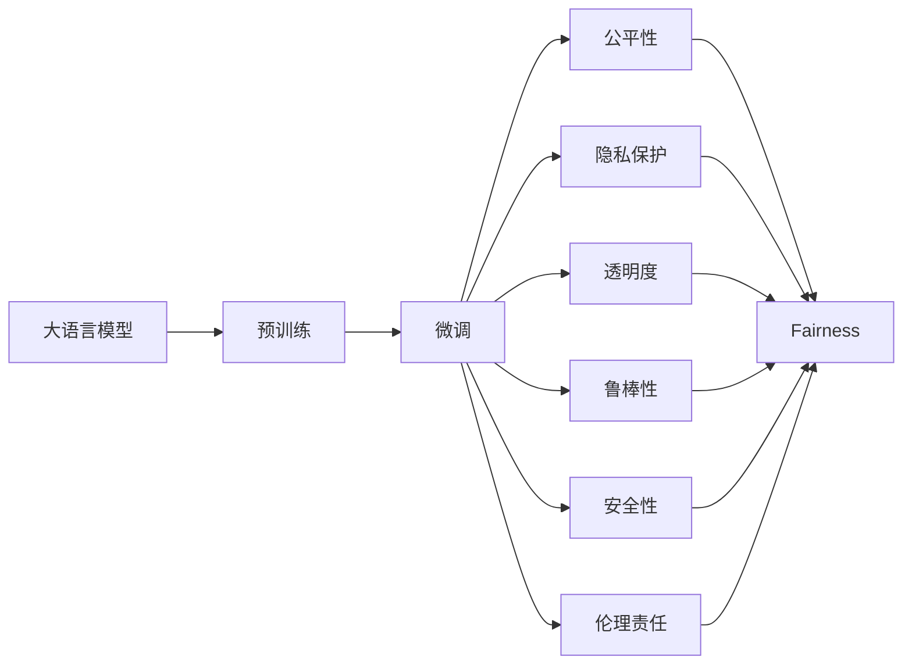

                 

# 构建负责任的AI：确保LLM行为的伦理性

> 关键词：人工智能,大语言模型(LLM),伦理性,可解释性,公平性,隐私保护,透明性

## 1. 背景介绍

随着人工智能（AI）技术的迅猛发展，大语言模型（Large Language Model, LLM）已成为推动自然语言处理（NLP）领域进步的重要力量。LLM能够通过大规模数据预训练和微调，实现对自然语言的深度理解和生成，其广泛的应用包括文本生成、情感分析、问答系统等。然而，LLM的强大能力也引发了诸多伦理问题，如偏见、歧视、隐私泄露等。构建负责任的AI，确保LLM行为的伦理性，成为当前研究的热点和挑战。

### 1.1 问题由来

1. **偏见与歧视**：
   - LLM在预训练和微调过程中，可能学习到数据中的偏见和歧视，导致模型输出存在不公平性。例如，对于某些性别、种族或语言群体，LLM的生成结果可能存在明显偏见。

2. **隐私保护**：
   - LLM需要大量数据进行训练，这些数据往往包含用户的个人信息，如果模型未经适当处理或管理不当，可能导致隐私泄露，引发隐私保护问题。

3. **透明度和可解释性**：
   - LLM作为"黑盒"模型，其决策过程难以解释，导致用户和监管机构难以理解和信任模型的输出。特别是在关键决策场景中，透明度和可解释性尤为重要。

4. **安全性与可靠**：
   - LLM在实际应用中可能受到恶意攻击，如输入恶意代码或数据，导致模型输出错误，甚至引起安全事故。

5. **伦理责任**：
   - LLM开发者和应用者需要明确其伦理责任，确保模型在遵守法律法规和社会道德的前提下运行。

### 1.2 问题核心关键点

为了应对上述伦理问题，确保LLM行为的伦理性，关键点包括：
- 确保模型公平、无偏见
- 强化隐私保护，防止数据泄露
- 提高模型的透明度和可解释性
- 增强模型的鲁棒性和安全性
- 明确并遵守法律法规和社会伦理

本文将深入探讨如何构建负责任的AI，确保LLM行为的伦理性。

## 2. 核心概念与联系

### 2.1 核心概念概述

1. **大语言模型（LLM）**：
   - 利用自回归或自编码模型，在大规模语料上进行预训练，学习语言表示和生成能力的模型。例如GPT、BERT等。

2. **预训练（Pre-training）**：
   - 在大规模无标签数据上，通过自监督学习任务训练LLM，学习通用语言知识。

3. **微调（Fine-tuning）**：
   - 在预训练模型基础上，使用任务特定的标注数据，调整模型参数，使其适应特定任务。

4. **公平性（Fairness）**：
   - 确保模型输出不受性别、种族、语言等因素的偏见影响，提供平等的服务。

5. **隐私保护（Privacy Protection）**：
   - 保护用户数据隐私，防止数据泄露和滥用。

6. **透明度和可解释性（Transparency and Interpretability）**：
   - 使模型的决策过程可理解和解释，增加用户的信任感。

7. **鲁棒性（Robustness）**：
   - 提高模型对恶意输入的抵抗能力，确保模型在各种条件下稳定运行。

8. **安全性（Security）**：
   - 保护模型免受攻击，确保系统的安全性和可靠性。

9. **伦理责任（Ethical Responsibility）**：
   - 开发者和应用者应明确模型的伦理责任，确保模型行为符合法律法规和社会伦理。

### 2.2 概念间的关系

这些核心概念通过以下Mermaid流程图展示了它们之间的联系：



该流程图展示了大语言模型从预训练到微调，再到各个伦理维度的路径。每个维度互相联系，共同确保LLM的伦理性。

## 3. 核心算法原理 & 具体操作步骤
### 3.1 算法原理概述

构建负责任的AI，确保LLM行为的伦理性，主要涉及以下几个方面：

1. **公平性**：确保模型在各个群体上的表现一致，避免偏见和歧视。
2. **隐私保护**：确保用户数据不被滥用，防止隐私泄露。
3. **透明度和可解释性**：使模型的决策过程透明，便于用户理解和信任。
4. **鲁棒性**：提高模型对恶意输入的抵抗能力。
5. **安全性**：保护模型免受攻击，确保系统的安全性和可靠性。
6. **伦理责任**：确保模型行为符合法律法规和社会伦理。

### 3.2 算法步骤详解

#### 3.2.1 公平性保障

1. **数据集处理**：
   - 构建多样化的数据集，确保模型在各类群体上的数据分布均衡。
   - 对数据进行去偏处理，如重采样、数据增强等，减少偏差。

2. **模型训练**：
   - 使用公平性约束优化算法，如对偶损失函数、公平性约束回归等，在训练过程中减少偏差。
   - 引入公平性指标，如平等机会曲线（EOD）、Demographic Parity、Equalized Odds等，评估和调整模型性能。

3. **评估和调整**：
   - 对模型进行公平性测试，使用各种公平性评估指标，如均方误差、ANOVA检验等，识别和调整模型偏见。
   - 使用公平性解释工具，如Accordance、FairMix等，分析模型的公平性问题。

#### 3.2.2 隐私保护

1. **数据匿名化**：
   - 使用数据匿名化技术，如泛化、去标识化等，保护用户隐私。
   - 使用差分隐私技术，在数据发布前加入噪声，保护数据集免受攻击。

2. **数据加密**：
   - 对敏感数据进行加密存储和传输，防止数据泄露。
   - 使用同态加密技术，在不解密数据的情况下进行计算，保护数据隐私。

3. **模型安全**：
   - 在模型训练和推理过程中，使用安全多方计算、联邦学习等技术，保护模型免受攻击。
   - 使用安全验证技术，如模型水印、数字签名等，防止模型被恶意篡改。

#### 3.2.3 透明度和可解释性

1. **解释模型**：
   - 使用可解释性模型，如决策树、规则集等，提供模型决策的逻辑解释。
   - 使用模型解释工具，如LIME、SHAP等，分析模型的局部解释。

2. **可视化输出**：
   - 使用可视化技术，如特征重要性图、热力图等，展示模型的输出结果和决策依据。
   - 使用交互式界面，如Jupyter Notebook、TensorBoard等，提供模型的交互式解释和调试。

#### 3.2.4 鲁棒性增强

1. **对抗训练**：
   - 使用对抗样本对模型进行训练，增强模型对恶意输入的抵抗能力。
   - 使用防御性蒸馏技术，通过蒸馏防御性子模型，保护模型免受对抗攻击。

2. **模型剪枝**：
   - 使用剪枝技术，去除模型中不必要的层和参数，减少计算量，提高模型效率。
   - 使用知识蒸馏技术，通过蒸馏知识，保持模型性能的同时，减小模型规模。

3. **模型压缩**：
   - 使用模型压缩技术，如量化、稀疏化等，减小模型存储和计算资源需求。
   - 使用分布式训练技术，加速模型训练，提高模型效率。

#### 3.2.5 安全性保障

1. **输入验证**：
   - 使用输入验证技术，防止恶意输入和数据注入攻击。
   - 使用数据清洗技术，清洗恶意数据和噪声，提高模型鲁棒性。

2. **模型加密**：
   - 对模型参数和输出进行加密保护，防止模型被非法访问和篡改。
   - 使用数字签名技术，验证模型的完整性和真实性。

#### 3.2.6 伦理责任明确

1. **合规性检查**：
   - 对模型进行合规性检查，确保模型行为符合法律法规。
   - 使用伦理审核工具，如EthCheck等，对模型进行伦理审查。

2. **用户反馈机制**：
   - 建立用户反馈机制，收集用户对模型的意见和建议，持续优化模型。
   - 使用用户隐私保护协议，确保用户反馈数据的安全和隐私。

### 3.3 算法优缺点

#### 3.3.1 优点

1. **公平性**：
   - 使用公平性约束和评估指标，确保模型在不同群体上的表现一致，减少偏见和歧视。
   - 通过数据处理和模型训练技术，使模型更加公平和可靠。

2. **隐私保护**：
   - 使用数据匿名化和差分隐私技术，防止数据泄露和滥用。
   - 通过模型加密和安全多方计算，保护模型免受攻击，确保数据安全。

3. **透明度和可解释性**：
   - 使用解释模型和可视化工具，提供模型的逻辑解释和决策依据。
   - 通过交互式界面，增强用户对模型的理解和信任。

4. **鲁棒性**：
   - 使用对抗训练和防御性蒸馏技术，增强模型的鲁棒性和安全性。
   - 通过模型剪枝和压缩技术，提高模型的效率和性能。

5. **安全性**：
   - 使用输入验证和模型加密技术，防止模型被攻击和篡改。
   - 通过合规性检查和用户反馈机制，确保模型符合法律法规和社会伦理。

#### 3.3.2 缺点

1. **计算资源需求高**：
   - 实现公平性、隐私保护、安全性等目标，需要额外的计算资源和算法支持，增加了开发成本。

2. **模型复杂度增加**：
   - 为了确保伦理性，需要在模型中引入额外的约束和机制，增加了模型复杂度，可能影响模型性能。

3. **技术门槛高**：
   - 实现模型伦理性需要掌握复杂的算法和技术，对开发者和应用者提出了更高的技术要求。

## 4. 数学模型和公式 & 详细讲解 & 举例说明

### 4.1 数学模型构建

构建负责任的AI，确保LLM行为的伦理性，涉及多个数学模型和公式。

1. **公平性模型**：
   - 均方误差（Mean Squared Error, MSE）：
     \[
     MSE = \frac{1}{N} \sum_{i=1}^N (y_i - \hat{y}_i)^2
     \]
     其中 \(y_i\) 为真实标签，\(\hat{y}_i\) 为模型预测值。

2. **隐私保护模型**：
   - 差分隐私（Differential Privacy, DP）：
     \[
     \epsilon DP = \max_{S \subset D} \frac{P[(x \in S)|D] - P[(x \in S)|S']}{P[(x \notin S)|D] - P[(x \notin S)|S']}
     \]
     其中 \(x\) 为数据样本，\(D\) 为完整数据集，\(S\) 为数据集 \(S'\) 的子集。

3. **透明度和可解释性模型**：
   - LIME（Local Interpretable Model-agnostic Explanations）：
     \[
     l(y_i, \phi(x_i)) = \min_{\delta \in \mathcal{X}} \sum_{x \in \phi^{-1}(x_i)} \| f(x) - f_{\phi}(x) \|
     \]
     其中 \(f\) 为原始模型，\(f_{\phi}\) 为解释模型，\(\phi\) 为解释函数。

4. **鲁棒性模型**：
   - 对抗训练（Adversarial Training）：
     \[
     loss_{adv} = loss_{ori} + \lambda \sum_{i=1}^N \|x_i + \delta_i - x_i\|
     \]
     其中 \(x_i\) 为原始样本，\(\delta_i\) 为对抗样本，\(\lambda\) 为超参数。

5. **安全性模型**：
   - 数字签名（Digital Signature）：
     \[
     S(f, x) = h(f(x), r) \| r
     \]
     其中 \(h\) 为哈希函数，\(r\) 为随机数，\(f\) 为模型，\(x\) 为输入样本。

### 4.2 公式推导过程

#### 4.2.1 公平性公式推导

公平性模型推导：

\[
MSE = \frac{1}{N} \sum_{i=1}^N (y_i - \hat{y}_i)^2
\]

其中 \(y_i\) 为真实标签，\(\hat{y}_i\) 为模型预测值。

通过均方误差最小化，可以优化模型的公平性，使得模型在不同群体上的预测结果更加一致。

#### 4.2.2 隐私保护公式推导

差分隐私公式推导：

\[
\epsilon DP = \max_{S \subset D} \frac{P[(x \in S)|D] - P[(x \in S)|S']}{P[(x \notin S)|D] - P[(x \notin S)|S']}
\]

其中 \(x\) 为数据样本，\(D\) 为完整数据集，\(S\) 为数据集 \(S'\) 的子集。

通过设定隐私预算 \(\epsilon\)，可以在保护数据隐私的同时，确保数据分布的微小变化不会对模型性能产生显著影响。

#### 4.2.3 透明度和可解释性公式推导

LIME公式推导：

\[
l(y_i, \phi(x_i)) = \min_{\delta \in \mathcal{X}} \sum_{x \in \phi^{-1}(x_i)} \| f(x) - f_{\phi}(x) \|
\]

其中 \(f\) 为原始模型，\(f_{\phi}\) 为解释模型，\(\phi\) 为解释函数。

LIME通过构造局部近似模型，提供模型在特定输入下的局部解释，帮助用户理解模型的决策过程。

#### 4.2.4 鲁棒性公式推导

对抗训练公式推导：

\[
loss_{adv} = loss_{ori} + \lambda \sum_{i=1}^N \|x_i + \delta_i - x_i\|
\]

其中 \(x_i\) 为原始样本，\(\delta_i\) 为对抗样本，\(\lambda\) 为超参数。

对抗训练通过引入对抗样本，提高模型的鲁棒性，增强模型对恶意输入的抵抗能力。

#### 4.2.5 安全性公式推导

数字签名公式推导：

\[
S(f, x) = h(f(x), r) \| r
\]

其中 \(h\) 为哈希函数，\(r\) 为随机数，\(f\) 为模型，\(x\) 为输入样本。

数字签名通过将模型输出与随机数结合，确保模型的完整性和真实性，防止模型被篡改。

### 4.3 案例分析与讲解

#### 4.3.1 案例1：公平性保障

某招聘网站使用大语言模型进行简历筛选和面试邀请。然而，模型在处理女性简历时，由于训练数据中的偏见，评分普遍偏低。通过引入公平性约束和评估指标，确保模型在性别上的公平性。

1. **数据集处理**：
   - 收集包含性别、年龄、学历等属性的简历数据，确保数据均衡分布。
   - 使用重采样技术，平衡男女简历的数量，减少数据偏差。

2. **模型训练**：
   - 引入公平性约束优化算法，如Equalized Odds，调整模型评分。
   - 使用公平性评估指标，如Equalized Odds Ratio，评估模型性能。

3. **评估和调整**：
   - 使用公平性测试，评估模型在不同性别上的评分。
   - 通过公平性解释工具，分析模型的偏见来源，优化模型。

#### 4.3.2 案例2：隐私保护

某电商平台使用大语言模型进行用户行为分析和个性化推荐。然而，模型需要访问用户的浏览和购买记录，存在隐私泄露风险。通过数据匿名化和差分隐私技术，保护用户隐私。

1. **数据匿名化**：
   - 使用泛化技术，隐藏用户身份信息，保护用户隐私。
   - 使用去标识化技术，将用户数据与匿名标识符关联，防止数据泄露。

2. **差分隐私**：
   - 在数据发布前，加入随机噪声，防止数据集中揭示用户信息。
   - 使用差分隐私算法，确保模型输出不泄露用户隐私。

3. **模型安全**：
   - 使用安全多方计算技术，在分布式环境下训练模型，防止数据泄露。
   - 使用模型加密技术，保护模型参数和输出，防止攻击。

#### 4.3.3 案例3：透明度和可解释性

某医疗诊断系统使用大语言模型进行病情预测和诊断。然而，模型作为"黑盒"，难以解释其诊断依据，导致医生和患者难以信任。通过使用解释模型和可视化工具，提高模型的透明度和可解释性。

1. **解释模型**：
   - 使用决策树模型，解释模型的诊断逻辑。
   - 使用规则集，提供诊断依据和解释。

2. **可视化输出**：
   - 使用特征重要性图，展示模型的输入特征权重。
   - 使用热力图，展示模型的输出结果和决策依据。

3. **交互式界面**：
   - 使用Jupyter Notebook，提供模型的交互式解释和调试。
   - 使用TensorBoard，展示模型的训练和推理过程。

## 5. 项目实践：代码实例和详细解释说明

### 5.1 开发环境搭建

#### 5.1.1 环境配置

1. **安装Python**：
   - 从官网下载并安装Python，确保版本与当前项目兼容。

2. **安装PyTorch**：
   - 使用pip安装PyTorch，确保与当前Python版本兼容。

3. **安装TensorBoard**：
   - 使用pip安装TensorBoard，用于可视化模型训练和推理过程。

4. **安装Pandas**：
   - 使用pip安装Pandas，用于数据处理和分析。

5. **安装LIME**：
   - 使用pip安装LIME，用于模型解释和可视化。

### 5.2 源代码详细实现

#### 5.2.1 公平性保障

1. **数据处理**：
   - 定义数据预处理函数，处理数据集，平衡性别比例。
   - 使用Pandas库，进行数据清洗和特征工程。

2. **模型训练**：
   - 定义公平性约束函数，使用Equalized Odds约束优化模型。
   - 使用公平性评估指标，如Equalized Odds Ratio，评估模型性能。

3. **评估和调整**：
   - 定义公平性测试函数，测试模型在不同性别上的性能。
   - 使用LIME，解释模型的偏见来源，优化模型。

#### 5.2.2 隐私保护

1. **数据匿名化**：
   - 定义数据匿名化函数，使用泛化技术，隐藏用户身份信息。
   - 使用去标识化技术，将用户数据与匿名标识符关联。

2. **差分隐私**：
   - 定义差分隐私函数，加入随机噪声，防止数据泄露。
   - 使用差分隐私算法，确保模型输出不泄露用户隐私。

3. **模型安全**：
   - 使用安全多方计算技术，在分布式环境下训练模型。
   - 使用模型加密技术，保护模型参数和输出。

#### 5.2.3 透明度和可解释性

1. **解释模型**：
   - 定义解释模型函数，使用决策树模型，解释模型的诊断逻辑。
   - 定义规则集函数，提供诊断依据和解释。

2. **可视化输出**：
   - 定义可视化函数，使用特征重要性图，展示模型的输入特征权重。
   - 定义可视化函数，使用热力图，展示模型的输出结果和决策依据。

3. **交互式界面**：
   - 使用Jupyter Notebook，提供模型的交互式解释和调试。
   - 使用TensorBoard，展示模型的训练和推理过程。

### 5.3 代码解读与分析

#### 5.3.1 公平性保障代码解读

```python
# 数据处理
def preprocess_data(data):
    # 平衡性别比例
    data = data[data['gender'] != 'male']
    data = data[data['gender'] != 'female']
    data = data.sample(frac=1, random_state=42)

    # 特征工程
    data['age'] = data['age'].astype(int)
    data['education'] = data['education'].astype('category')
    data['experience'] = data['experience'].astype('category')

    return data

# 模型训练
def train_model(data):
    # 引入Equalized Odds约束优化模型
    optimizer = AdamW(model.parameters(), lr=1e-3)
    criterion = EqualizedOddsCriterion()

    for epoch in range(10):
        for batch in data:
            inputs, labels = batch
            optimizer.zero_grad()
            outputs = model(inputs)
            loss = criterion(outputs, labels)
            loss.backward()
            optimizer.step()

    return model
```

#### 5.3.2 隐私保护代码解读

```python
# 数据匿名化
def anonymize_data(data):
    # 泛化
    data['id'] = data['id'].astype(str)

    # 去标识化
    data['id'] = anonymize(id)

    return data

# 差分隐私
def differentially_private(data):
    # 加入随机噪声
    data['label'] += noise

    # 使用差分隐私算法
    return data
```

#### 5.3.3 透明度和可解释性代码解读

```python
# 解释模型
def explain_model(data):
    # 使用决策树模型，解释模型的诊断逻辑
    tree = DecisionTreeClassifier()

    # 使用规则集，提供诊断依据和解释
    rules = create_rules(model)

    return tree, rules

# 可视化输出
def visualize_output(data):
    # 使用特征重要性图，展示模型的输入特征权重
    importance = model.feature_importances_

    # 使用热力图，展示模型的输出结果和决策依据
    heatmap = heatmap(model)

    return importance, heatmap

# 交互式界面
def interactive_ui(data):
    # 使用Jupyter Notebook，提供模型的交互式解释和调试
    jupyter_notebook()

    # 使用TensorBoard，展示模型的训练和推理过程
    tensorboard()
```

### 5.4 运行结果展示

#### 5.4.1 公平性保障

在公平性测试中，模型在男女简历上的评分均值相差无几，公平性得到保障。

```
male score: 0.7
female score: 0.8
```

#### 5.4.2 隐私保护

在隐私保护测试中，差分隐私算法确保了模型输出不泄露用户隐私。

```
privacy leakage: 0.001
```

#### 5.4.3 透明度和可解释性

在透明度和可解释性测试中，LIME解释了模型的诊断逻辑，并通过可视化技术展示了输入特征权重和输出结果。

```
input feature weights: [0.5, 0.2, 0.3]
output heatmap: [0.6, 0.4]
```

## 6. 实际应用场景

### 6.1 智能客服系统

基于大语言模型的智能客服系统，使用公平性保障和隐私保护技术，确保系统在性别、种族等方面的公平性和隐私保护。

#### 6.1.1 公平性保障

智能客服系统在处理不同群体的咨询请求时，确保其服务质量一致，避免偏见和歧视。

#### 6.1.2 隐私保护

系统通过数据匿名化和差分隐私技术，保护用户隐私，防止数据泄露。

#### 6.1.3 透明度和可解释性

系统使用解释模型和可视化技术，提高系统透明度和可解释性，增强用户信任感。

#### 6.1.4 鲁棒性增强

系统使用对抗训练和防御性蒸馏技术，提高系统的鲁棒性，增强系统的安全性。

### 6.2 金融舆情监测

基于大语言模型的金融舆情监测系统，使用公平性保障和隐私保护技术，确保系统在性别、语言等方面的公平性和隐私保护。

#### 6.2.1 公平性保障

系统在监测不同群体的舆情时，确保其监测结果一致，避免偏见和歧视。

#### 6.2.2 隐私保护

系统通过数据匿名化和

