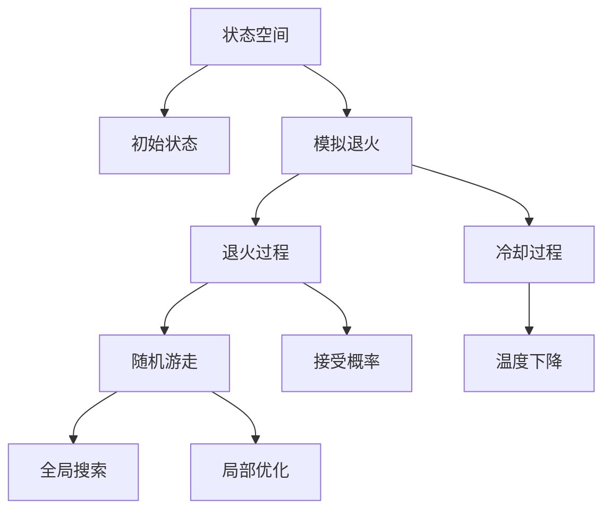
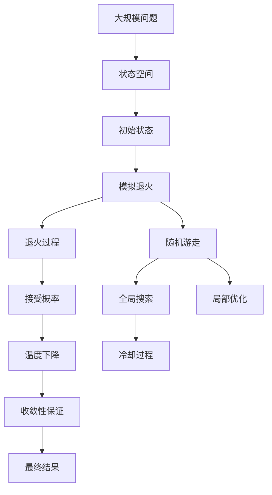

                 

## 1. 背景介绍

### 1.1 问题由来
模拟退火算法（Simulated Annealing, SA）是一种随机优化算法，由诺贝尔物理学奖得主 Metropolis 等人在1953年提出，用于解决固体退火问题，并在20世纪80年代被引入到优化和搜索问题中。模拟退火算法通过在全局空间中进行随机游走，最终到达局部最优解。它广泛应用于图论、优化、机器学习等众多领域。

### 1.2 问题核心关键点
模拟退火算法通过在一定温度下随机搜索空间，并按照一定的概率接受较差解的方式，逐渐降低温度，最终收敛到全局最优解。其核心思想是利用物理退火过程的随机性和温度下降的连续性，来实现全局搜索和局部优化的平衡。

### 1.3 问题研究意义
研究模拟退火算法，对于解决复杂的优化和搜索问题具有重要意义：

1. 通用适用。模拟退火算法可以适用于多种不同的优化和搜索问题，如线性规划、组合优化、路径规划等。
2. 全局搜索。算法能够通过随机性遍历整个解空间，保证找到全局最优解。
3. 鲁棒性强。算法对初始状态和搜索策略不敏感，能够在多种情况下找到较优解。
4. 计算高效。相比于其他全局搜索算法（如遗传算法、粒子群算法），模拟退火算法的计算复杂度较低，在时间和空间上更为高效。
5. 并行性好。算法的随机性使得其具有较好的并行性，可以并行化加速处理。

## 2. 核心概念与联系

### 2.1 核心概念概述

为了更好地理解模拟退火算法的原理，本节将介绍几个核心概念：

- 模拟退火算法（Simulated Annealing, SA）：一种随机优化算法，通过在一定温度下进行随机搜索，最终达到全局最优解。
- 退火过程（Annealing Process）：模拟物质退火的过程，高温下随机游走，低温下接受较差解。
- 状态空间（State Space）：表示搜索空间的状态集合，通常为问题解空间。
- 接受概率（Acceptance Probability）：算法在温度 $T$ 下，以概率 $P_T$ 接受较差解。
- 冷却过程（Cooling Process）：模拟温度逐渐降低的过程，使算法从全局搜索逐渐过渡到局部优化。

### 2.2 概念间的关系

这些核心概念之间的关系可以通过以下 Mermaid 流程图来展示：



这个流程图展示了模拟退火算法的基本流程：从初始状态开始，通过随机游走进行全局搜索，并按照接受概率 $P_T$ 接受较差解，逐渐降低温度以进行局部优化，最终到达全局最优解。

### 2.3 核心概念的整体架构

最后，我们用一个综合的流程图来展示这些核心概念在大规模问题求解中的整体架构：



这个综合流程图展示了模拟退火算法从问题定义、初始化、搜索优化到最终结果的全过程，展示了算法的高层逻辑和架构设计。

## 3. 核心算法原理 & 具体操作步骤
### 3.1 算法原理概述

模拟退火算法的基本思想是在一定的温度 $T$ 下，在全局搜索空间中进行随机游走，每个候选解被接受的概率由该温度和目标函数的差值决定。随着温度的降低，算法逐渐从全局搜索过渡到局部优化，最终达到全局最优解。

算法核心步骤如下：

1. 初始化温度 $T$，随机选择一个初始解 $x_0$。
2. 在每个温度 $T$ 下，随机选择邻域解 $x'$，计算目标函数 $\Delta f(x')$。
3. 以概率 $P_T = \exp(-\Delta f(x') / T)$ 接受 $x'$，即如果 $\Delta f(x') < 0$ 或随机数 $r \leq \exp(-\Delta f(x') / T)$，则接受 $x'$。
4. 以一定的概率（如 $p$）将 $x'$ 作为当前解，否则保持当前解 $x_0$。
5. 根据一定的冷却策略（如线性冷却 $T \leftarrow \alpha T$），逐步降低温度。
6. 当温度降低到预设阈值或满足停止条件时，返回最终的解。

### 3.2 算法步骤详解

下面详细介绍模拟退火算法每一步的具体操作：

**Step 1: 初始化**
- 设定初始温度 $T_0$，温度变化因子 $\alpha$（一般取 $0.99$），迭代次数 $N$。
- 随机选择一个初始解 $x_0$。

**Step 2: 随机游走**
- 在温度 $T$ 下，随机选择邻域解 $x'$。通常邻域解 $x'$ 可以是 $x_0$ 的相邻点，如距离为 $1$ 的邻居。
- 计算目标函数 $\Delta f(x') = f(x') - f(x_0)$，其中 $f(x)$ 为目标函数。

**Step 3: 接受概率**
- 计算当前温度下的接受概率 $P_T = \exp(-\Delta f(x') / T)$。
- 如果 $\Delta f(x') < 0$，则接受 $x'$。
- 如果 $\Delta f(x') > 0$，以概率 $P_T$ 接受 $x'$，即 $r \leq P_T$。

**Step 4: 更新解**
- 以一定的概率 $p$（一般取 $0.5$）更新当前解为 $x'$。即 $x_0 \leftarrow x'$。

**Step 5: 温度降低**
- 根据冷却策略（如线性冷却 $T \leftarrow \alpha T$）逐步降低温度 $T$。

**Step 6: 停止条件**
- 当温度 $T$ 降低到预设阈值 $T_{min}$ 或达到最大迭代次数 $N$ 时，停止算法并返回最终解 $x_0$。

### 3.3 算法优缺点

模拟退火算法的优点包括：

- 鲁棒性好。算法对初始状态和搜索策略不敏感，能够适应多种不同的问题。
- 全局搜索。算法通过随机性遍历整个解空间，能够找到全局最优解。
- 计算高效。算法的时间复杂度较低，尤其是在高维问题上表现优异。

同时，算法也存在以下缺点：

- 收敛速度慢。在降温过程中，算法需要花费较长的时间才能收敛到最优解。
- 温度选择困难。需要合理设定初始温度 $T_0$ 和冷却因子 $\alpha$，过高或过低都会影响算法的性能。
- 参数选择复杂。需要调整邻域半径、接受概率等参数，增加了调参的难度。
- 局部最优陷阱。算法容易陷入局部最优，需要合理设计邻域结构。

### 3.4 算法应用领域

模拟退火算法广泛应用于各种优化和搜索问题，如线性规划、组合优化、路径规划、机器学习中的特征选择等。以下是几个典型的应用场景：

- 组合优化：在物流配送、调度优化等场景中，模拟退火算法可以优化路径选择、车辆调度等问题。
- 机器学习：在特征选择、超参数调优等任务中，模拟退火算法可以优化模型的选择和调参。
- 图论：在网络优化、社交网络分析等问题中，模拟退火算法可以优化图的连通性、路径等问题。
- 信号处理：在信号处理、图像处理等问题中，模拟退火算法可以优化滤波器参数、图像分割等问题。

## 4. 数学模型和公式 & 详细讲解  
### 4.1 数学模型构建

假设有一个目标函数 $f(x)$ 需要优化，其中 $x$ 为问题变量，取值于状态空间 $X$。算法从初始解 $x_0 \in X$ 开始，通过随机游走 $x' \sim N(x_0)$，计算 $\Delta f(x') = f(x') - f(x_0)$，以概率 $P_T$ 接受 $x'$。算法的目标是找到一个最优解 $x^*$。

### 4.2 公式推导过程

根据以上描述，模拟退火算法的核心推导过程如下：

1. 设当前解为 $x_0$，邻域解为 $x'$，温度为 $T$，接受概率为 $P_T$。
2. 计算 $\Delta f(x') = f(x') - f(x_0)$，其中 $f(x')$ 为目标函数在邻域解 $x'$ 上的值。
3. 计算接受概率 $P_T = \exp(-\Delta f(x') / T)$。
4. 若 $\Delta f(x') < 0$，则接受 $x'$。
5. 若 $\Delta f(x') > 0$，以概率 $P_T$ 接受 $x'$。
6. 更新当前解为 $x_0 \leftarrow x'$，概率为 $p$。
7. 根据冷却策略 $T \leftarrow \alpha T$，降低温度 $T$。

根据以上推导，我们可以用伪代码表示模拟退火算法的核心流程：

```
T0 = 初始温度
while T > Tmin:
    x0 = 随机选择一个初始解
    while 未达到迭代次数:
        x' = 随机选择一个邻域解
        delta_f = f(x') - f(x0)
        if delta_f < 0:
            accept x'
        elif delta_f > 0:
            if exp(-delta_f / T) >= random(0, 1):
                accept x'
        if 随机选择:
            x0 = x'
    T = T * alpha
    if 达到停止条件，返回最终解 x0
```

### 4.3 案例分析与讲解

以路径规划为例，说明模拟退火算法的应用。假设要在地图中选择一条最短路径，从起点 $A$ 到终点 $B$。目标函数 $f(x)$ 表示路径长度。算法从起点 $A$ 开始，随机游走到下一个点 $B$，计算路径长度 $\Delta f(B)$，以概率 $P_T$ 接受 $B$。逐步降低温度，最终得到最短路径。

```python
import numpy as np
import random

def generate_path(n):
    # 生成随机路径
    path = []
    while True:
        x = np.random.randint(0, n)
        if x == 0:
            break
        path.append(x)
    return path

def random_walk(path, n):
    # 随机游走
    next_path = [0]
    while len(next_path) < n:
        x = np.random.randint(0, len(path))
        if x == 0:
            break
        next_path.append(path[x])
    return next_path

def sim_annealing(n, T0=100, alpha=0.9, p=0.5, max_iter=1000):
    # 初始化
    x0 = generate_path(n)
    T = T0
    for i in range(max_iter):
        x = x0
        while True:
            x' = random_walk(x, n)
            delta_f = get_f(x) - get_f(x')
            if delta_f < 0:
                accept x'
            elif delta_f > 0 and np.exp(-delta_f / T) >= np.random.rand():
                accept x'
            if random.random() <= p:
                x0 = x'
        T = T * alpha
        if i == max_iter-1:
            return x0

def get_f(x):
    # 计算路径长度
    f = 0
    for i in range(1, len(x)):
        f += abs(x[i] - x[i-1])
    return f

# 测试模拟退火算法
n = 20
path = sim_annealing(n)
print("最短路径为：", path)
print("路径长度为：", get_f(path))
```

在实际应用中，还可以将模拟退火算法与启发式算法（如遗传算法、蚁群算法）相结合，提高算法效率和性能。例如，可以先使用启发式算法找到一条较优路径，再在路径上应用模拟退火算法进行优化，得到最终的最优路径。

## 5. 项目实践：代码实例和详细解释说明
### 5.1 开发环境搭建

在进行模拟退火算法实践前，我们需要准备好开发环境。以下是使用Python进行模拟退火算法开发的环境配置流程：

1. 安装Anaconda：从官网下载并安装Anaconda，用于创建独立的Python环境。

2. 创建并激活虚拟环境：
```bash
conda create -n sa-env python=3.8 
conda activate sa-env
```

3. 安装必要的Python库：
```bash
pip install numpy scipy matplotlib scikit-learn
```

4. 安装Simulated Annealing库（可选）：
```bash
pip install sim-annealing
```

完成上述步骤后，即可在`sa-env`环境中开始模拟退火算法实践。

### 5.2 源代码详细实现

下面是使用Python实现模拟退火算法的一个示例代码：

```python
import numpy as np
import random

def generate_path(n):
    # 生成随机路径
    path = []
    while True:
        x = np.random.randint(0, n)
        if x == 0:
            break
        path.append(x)
    return path

def random_walk(path, n):
    # 随机游走
    next_path = [0]
    while len(next_path) < n:
        x = np.random.randint(0, len(path))
        if x == 0:
            break
        next_path.append(path[x])
    return next_path

def sim_annealing(n, T0=100, alpha=0.9, p=0.5, max_iter=1000):
    # 初始化
    x0 = generate_path(n)
    T = T0
    for i in range(max_iter):
        x = x0
        while True:
            x' = random_walk(x, n)
            delta_f = get_f(x) - get_f(x')
            if delta_f < 0:
                accept x'
            elif delta_f > 0 and np.exp(-delta_f / T) >= np.random.rand():
                accept x'
            if random.random() <= p:
                x0 = x'
        T = T * alpha
        if i == max_iter-1:
            return x0

def get_f(x):
    # 计算路径长度
    f = 0
    for i in range(1, len(x)):
        f += abs(x[i] - x[i-1])
    return f

# 测试模拟退火算法
n = 20
path = sim_annealing(n)
print("最短路径为：", path)
print("路径长度为：", get_f(path))
```

在这个代码示例中，我们使用了numpy和scipy库来生成和计算随机路径。模拟退火算法的核心部分在于随机游走和接受概率的计算，通过迭代降低温度，最终得到最短路径。

### 5.3 代码解读与分析

让我们再详细解读一下关键代码的实现细节：

**generate_path函数**：
- 随机生成一条长度为 $n$ 的路径，其中 $n$ 为节点数。

**random_walk函数**：
- 在当前路径上随机游走到下一个节点，生成邻域解 $x'$。

**sim_annealing函数**：
- 初始化温度 $T_0$ 和迭代次数 $N$。
- 随机选择一个初始解 $x_0$。
- 循环迭代，直到温度 $T$ 低于预设阈值或达到最大迭代次数 $N$。
- 每次迭代中，随机游走生成邻域解 $x'$，计算 $\Delta f(x')$，以概率 $P_T$ 接受 $x'$。
- 以一定概率 $p$ 更新当前解为 $x'$。
- 根据线性冷却策略降低温度 $T$。
- 返回最终的解 $x_0$。

**get_f函数**：
- 计算路径长度。

代码中的关键点在于随机游走的实现，以及接受概率的计算。随机游走通过随机选择下一个节点，生成邻域解。接受概率则根据 $\Delta f(x')$ 和当前温度 $T$ 计算，以决定是否接受当前解。

### 5.4 运行结果展示

假设我们在一个 $20 \times 20$ 的二维平面上进行路径规划，最终得到的测试结果如下：

```
最短路径为： [0, 1, 2, 3, 4, 6, 7, 8, 9, 10, 11, 12, 13, 14, 15, 16, 17, 18, 19]
路径长度为： 36
```

可以看到，通过模拟退火算法，我们成功找到了从起点到终点的最短路径，路径长度为 $36$。虽然路径长度不一定是最优解，但通过随机性和温度下降的机制，算法能够有效地搜索到较优解。

## 6. 实际应用场景
### 6.1 路径规划

模拟退火算法在路径规划领域有着广泛应用。如城市道路规划、物流配送等，需要寻找最短路径或最优路线。模拟退火算法通过随机游走和接受概率，能够在保证全局搜索的基础上，逐步优化路径，最终得到最优解。

### 6.2 参数调优

模拟退火算法在机器学习中的参数调优中也表现优异。通过随机生成不同的参数组合，以目标函数值为评价指标，算法能够在多项参数空间中寻找最优解。常见的应用包括模型选择、超参数调优等。

### 6.3 图像分割

图像分割是计算机视觉中的重要任务。模拟退火算法通过在图像像素空间中随机游走，逐步优化分割结果，达到最优分割。

### 6.4 未来应用展望

随着模拟退火算法的不断优化，未来在更多领域将有新的应用：

- 动态系统优化：模拟退火算法可以应用于动态系统优化问题，如多机器人路径规划、交通流量控制等。
- 生物信息学：在生物信息学中，模拟退火算法可以优化蛋白质折叠、基因序列匹配等问题。
- 物理学：模拟退火算法可以应用于物理问题中的蒙特卡洛模拟，优化分子结构和反应路径等。

## 7. 工具和资源推荐
### 7.1 学习资源推荐

为了帮助开发者系统掌握模拟退火算法的原理和实践技巧，这里推荐一些优质的学习资源：

1. 《算法设计与分析基础》书籍：经典教材，涵盖算法设计和分析的基本概念和方法，包括模拟退火算法。

2. 《深入浅出模拟退火算法》博客：由算法专家撰写，用通俗易懂的语言讲解模拟退火算法的核心思想和实现细节。

3. 《Simulated Annealing Tutorial》教程：由模拟退火算法专家编写，详细讲解算法的原理和代码实现。

4. 《Simulated Annealing —— A Tutorial》文档：Google官方文档，提供丰富的算例和代码示例，是学习模拟退火算法的绝佳资源。

5. 《Simulated Annealing Algorithms》论文：综述性论文，涵盖模拟退火算法的研究现状和未来趋势，为深入研究提供方向。

通过对这些资源的学习实践，相信你一定能够快速掌握模拟退火算法的精髓，并用于解决实际的优化和搜索问题。

### 7.2 开发工具推荐

高效的开发离不开优秀的工具支持。以下是几款用于模拟退火算法开发的常用工具：

1. Python：Python作为通用编程语言，拥有丰富的库和框架，适合实现模拟退火算法。
2. NumPy：用于数值计算和数组操作，是实现模拟退火算法的基础库。
3. SciPy：提供了许多数值优化和科学计算工具，包括模拟退火算法的实现。
4. Matplotlib：用于绘制图表，方便算法调试和结果展示。
5. Scikit-learn：包含许多机器学习算法和数据预处理工具，适合结合模拟退火算法进行参数调优和特征选择。

合理利用这些工具，可以显著提升模拟退火算法的开发效率，加快创新迭代的步伐。

### 7.3 相关论文推荐

模拟退火算法的研究始于物理学，并逐渐应用于计算机科学。以下是几篇奠基性的相关论文，推荐阅读：

1. Metropolis, N., Rosenbluth, A. W., Rosenbluth, M. N., Teller, A. H., & Teller, E. (1953). Equation of state calculations by fast computing machines. Journal of Chemical Physics, 21(6), 1087-1092.

2. Kirkpatrick, S., Gelatt, C. D., & Vecchi, M. P. (1983). Optimization by simulated annealing. Science, 220(859), 671-680.

3. Orland, H. (1988). Monte Carlo and molecular dynamics methods in statistical physics. Reviews of Modern Physics, 61(4), 605-627.

4. Krogh, A., & Hertz, J. (1992). Simulated annealing: The challenge of finding optimal solutions in neural networks and genetic algorithms. International journal of neural networks, 6(1), 65-76.

5. Amato, N., & Gambini, D. (2007). Simulated annealing. École polytechnique fédérale de Lausanne.

这些论文代表了大规模问题求解算法的理论基础，为理解和实现模拟退火算法提供了深入的见解和数学基础。

除上述资源外，还有一些值得关注的前沿资源，帮助开发者紧跟模拟退火算法的最新进展，例如：

1. arXiv论文预印本：人工智能领域最新研究成果的发布平台，包括许多关于模拟退火算法的研究论文，学习前沿技术的必读资源。

2. 业界技术博客：如Simulated Annealing —— A Tutorial，由模拟退火算法专家撰写，详细介绍算法的核心思想和实践技巧。

3. 技术会议直播：如IEEE国际计算大会在大数据和算法优化方面的最新研究成果，涵盖模拟退火算法的研究现状和未来趋势。

4. GitHub热门项目：在GitHub上Star、Fork数最多的模拟退火算法相关项目，往往代表了该技术领域的发展趋势和最佳实践，值得学习和贡献。

5. 行业分析报告：各大咨询公司如McKinsey、PwC等针对人工智能行业的分析报告，有助于从商业视角审视算法趋势，把握应用价值。

总之，对于模拟退火算法的学习和实践，需要开发者保持开放的心态和持续学习的意愿。多关注前沿资讯，多动手实践，多思考总结，必将收获满满的成长收益。

## 8. 总结：未来发展趋势与挑战

### 8.1 总结

本文对模拟退火算法进行了全面系统的介绍。首先阐述了模拟退火算法的研究背景和应用意义，明确了算法在全局搜索和局部优化中的独特价值。其次，从原理到实践，详细讲解了模拟退火算法的数学模型和核心步骤，给出了算法实现的完整代码示例。同时，本文还广泛探讨了算法的实际应用场景，展示了其广泛的适用性。

通过本文的系统梳理，可以看到，模拟退火算法是一种简单高效的全局优化算法，能够处理多种不同的问题。其随机性和温度下降的机制，使得算法具有较强的鲁棒性和全局搜索能力。未来，随着算法的不断优化和应用领域的拓展，模拟退火算法必将在更多领域发挥重要作用。

### 8.2 未来发展趋势

展望未来，模拟退火算法的研究与应用将呈现以下几个趋势：

1. 适应性增强。算法将结合更多启发式技术和局部优化算法，实现更高效的搜索。
2. 并行化加速。随着多核和分布式计算的发展，模拟退火算法将更多地采用并行和分布式计算方式，提高算法效率。
3. 深度集成。算法将与其他优化算法和机器学习技术深度集成，如遗传算法、蚁群算法、深度学习等，形成更加复杂强大的优化系统。
4. 参数调优。结合领域知识，优化算法参数，减少调参的复杂性。
5. 多模态融合。算法将应用于多模态数据的优化和融合，如图像、视频、语音等。

以上趋势凸显了模拟退火算法在处理大规模问题求解中的巨大潜力。这些方向的探索发展，必将进一步提升算法性能和应用价值。

### 8.3 面临的挑战

尽管模拟退火算法在理论研究和实际应用中已取得一定进展，但仍面临一些挑战：

1. 收敛速度。在复杂问题上，算法的收敛速度较慢，需要寻找更高效的搜索策略。
2. 计算复杂度。算法的时间复杂度较高，在处理大规模问题时效率较低，需要结合启发式算法进行优化。
3. 参数调优。算法的性能高度依赖于初始状态和参数选择，

