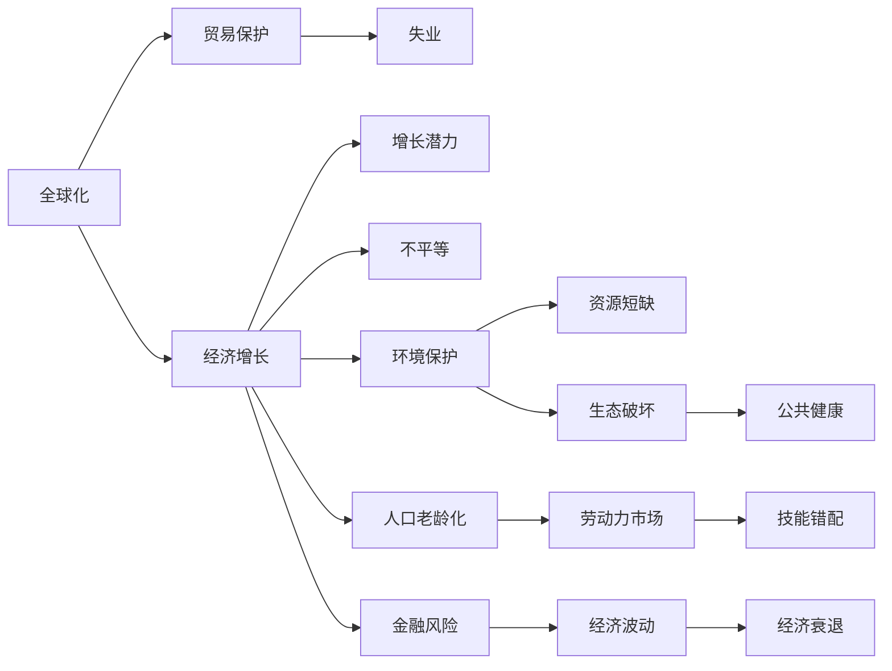

                 

# 深层次问题与经济增长瓶颈

## 1. 背景介绍

### 1.1 问题由来

当前，全球面临的深层次问题不断涌现，对经济增长构成严重瓶颈。从宏观层面的全球化减速、人口老龄化、环境保护压力，到微观层面的企业数字化转型、劳动力市场技能错配、互联网泡沫破裂等，都深刻影响着全球经济的未来发展。这些问题既复杂又多变，需要从多个维度进行深入分析和综合应对。

### 1.2 问题核心关键点

面对这些深层次问题，决策者和研究者们普遍关注以下几个核心关键点：

1. **全球化与贸易保护**：全球化是推动经济增长的重要力量，但也带来了失业、不平等、生态破坏等问题。如何平衡自由贸易与保护主义，成为决策者面临的重大课题。
2. **人口老龄化**：全球人口老龄化趋势显著，劳动力市场出现结构性失衡。如何保障老龄化社会的长远发展，成为各国政府和社会的重要议题。
3. **环境保护与可持续发展**：气候变化、资源短缺等环境问题对经济增长构成了严峻挑战。如何实现绿色低碳发展，是全球共识。
4. **数字经济与产业升级**：互联网、大数据、人工智能等新技术的快速发展，对传统产业提出了巨大挑战。如何推动数字经济与实体经济深度融合，实现产业升级，是当前和未来的重要任务。
5. **金融风险与监管**：金融市场的波动性增加，新兴金融工具层出不穷，如何防范系统性金融风险，加强监管，是金融行业的重大课题。

### 1.3 问题研究意义

深入研究这些深层次问题，对于制定科学合理的政策措施，促进经济持续健康发展，具有重要意义：

1. **政策制定参考**：通过对深层次问题的分析，可以制定更为精准的政策，提高政策的实施效果。
2. **经济预测与决策**：理解问题的本质和趋势，能够帮助政府和企业做出更有前瞻性的经济预测和决策。
3. **社会稳定与和谐**：通过解决问题，可以有效缓解社会矛盾，促进社会稳定和谐。
4. **国际合作与竞争**：分析全球化背景下的深层次问题，有利于在全球层面推动合作，增强国际竞争力。
5. **科技与伦理**：探讨科技进步带来的伦理和社会问题，有助于科技的合理应用，保障社会公平正义。

## 2. 核心概念与联系

### 2.1 核心概念概述

为更好地理解深层次问题的解决方法，本节将介绍几个关键概念：

- **经济增长**：指一个国家或地区在一定时期内经济总量（如GDP）的增加，是衡量一个国家经济发展水平的重要指标。
- **全球化**：指全球范围内的经济、社会、文化等各个领域的相互依存和融合，特别是指资本、商品、服务的跨国流动。
- **贸易保护**：指国家对本国经济进行保护，限制外国商品和服务的进入，以保护本国产业和经济安全。
- **人口老龄化**：指人口中老年人口比例逐渐增加，年轻人口比例相对减少的现象。
- **环境保护**：指保护自然环境和资源，防止环境污染和生态破坏，实现可持续发展。
- **可持续发展**：指满足当代人的需求，不损害后代人满足其需求的能力的发展方式。
- **数字经济**：指以信息和通信技术为核心的经济活动，涉及互联网、大数据、人工智能等领域。
- **产业升级**：指通过技术创新和产业结构优化，提高产业竞争力和附加值的过程。
- **金融风险**：指由于金融市场的不确定性，导致金融资产价格波动，带来损失的风险。

这些概念之间存在着紧密的联系，形成了深层次问题的完整生态系统。理解这些概念及其关系，是制定有效政策、采取合理措施的基础。

### 2.2 概念间的关系

这些核心概念之间存在着复杂的相互作用和影响关系，可以通过以下Mermaid流程图来展示：



这个流程图展示了大语言模型微调过程中各个核心概念之间的关系：

1. 全球化是经济增长的重要驱动力，但贸易保护可能对其产生负面影响。
2. 经济增长与人口老龄化并行，劳动力市场面临技能错配等问题。
3. 环境保护与资源短缺相关联，对经济增长构成制约。
4. 数字经济促进产业升级，但也带来金融风险等新的挑战。
5. 全球化背景下的经济波动，可能引发金融危机。
6. 生态破坏和公共健康问题，对经济和社会稳定构成威胁。

## 3. 核心算法原理 & 具体操作步骤

### 3.1 算法原理概述

解决深层次问题的关键在于全面系统地分析问题，采取科学合理的方法和措施。以下是基于经济学的核心算法原理：

1. **宏观经济模型**：通过建立宏观经济模型，分析经济增长、失业、通货膨胀、经济波动等宏观经济现象。
2. **计量经济学**：运用统计方法和数学模型，分析经济数据，评估政策措施的效应。
3. **微观经济学**：研究消费者、生产者、市场的行为和关系，优化资源配置。
4. **财政政策和货币政策**：通过调整政府支出和货币供应，稳定经济，促进增长。
5. **产业政策**：制定支持新兴产业发展的政策，推动产业升级和技术创新。
6. **环境保护政策**：通过法律法规和市场机制，促进环境保护和可持续发展。
7. **劳动力市场政策**：制定就业、培训、社会保障等政策，缓解老龄化带来的劳动力短缺问题。
8. **金融监管政策**：通过风险管理、市场监管，保障金融稳定。

### 3.2 算法步骤详解

基于上述算法原理，解决深层次问题的一般步骤如下：

**Step 1: 数据收集与处理**
- 收集相关经济、社会、环境等方面的数据，进行清洗和处理，确保数据的准确性和完整性。

**Step 2: 模型构建与训练**
- 选择适合的模型框架，如宏观经济模型、计量经济模型等，建立经济分析模型。
- 使用历史数据进行模型训练，验证模型参数，确保模型的稳定性和可靠性。

**Step 3: 政策制定与评估**
- 基于模型预测结果，制定相应的政策措施，如调整税收、增加公共投资、促进产业升级等。
- 使用模型对政策效果进行评估，调整和优化政策措施。

**Step 4: 政策实施与监测**
- 在实际经济和社会活动中，实施政策措施，并持续监测其效果。
- 根据监测结果，调整政策参数，确保政策效果最大化。

**Step 5: 反馈与改进**
- 对政策实施结果进行反馈，总结经验教训，持续改进政策措施。

### 3.3 算法优缺点

基于经济学原理的算法，具有以下优点：

1. **系统性**：通过全面的数据和模型分析，能够更系统地理解深层次问题。
2. **科学性**：基于数据驱动和模型验证，政策制定更加科学合理。
3. **可操作性**：模型预测和政策效果评估能够为实际政策制定提供参考。

但同时，也存在一些缺点：

1. **数据依赖**：数据质量和完整性对模型预测结果有很大影响。
2. **模型复杂性**：复杂的模型可能需要较高的计算资源和时间。
3. **政策实施难度**：政策制定和实施是一个复杂的社会过程，需要多方面的协调和支持。
4. **外部冲击**：经济社会和环境的变化可能超出模型预测范围，需要动态调整政策。

### 3.4 算法应用领域

基于经济学原理的算法，已经在多个领域得到应用，例如：

1. **宏观经济政策**：各国政府通过宏观经济模型，制定财政和货币政策，促进经济增长。
2. **环境保护政策**：各国政府通过计量经济学模型，评估环境政策效果，制定环保措施。
3. **产业政策**：各国政府通过微观经济学模型，制定产业升级政策，支持新兴产业发展。
4. **金融监管政策**：各国金融监管机构通过风险模型，评估金融市场风险，制定监管措施。
5. **劳动力市场政策**：各国政府通过人口统计模型，评估劳动力市场变化，制定就业和培训政策。

## 4. 数学模型和公式 & 详细讲解 & 举例说明

### 4.1 数学模型构建

以下是一个简单的宏观经济增长模型，用于分析经济增长的主要驱动因素：

\[ Y_t = Y_{t-1} + A \cdot G_t + E_t \]

其中：
- \( Y_t \) 为t期的经济总量（GDP）。
- \( Y_{t-1} \) 为t-1期的经济总量。
- \( A \) 为经济增长率。
- \( G_t \) 为t期的政府支出。
- \( E_t \) 为其他影响因素，如技术进步、自然灾害等。

### 4.2 公式推导过程

将模型代入实际数据进行推导，得到：

\[ Y_t = Y_{t-1} + \alpha G_t + \beta E_t \]

其中：
- \( \alpha \) 为政府支出对经济增长的弹性系数。
- \( \beta \) 为其他因素对经济增长的弹性系数。

### 4.3 案例分析与讲解

假设某国政府增加公共投资10%，同时考虑技术进步和其他因素，利用上述模型进行预测。

**案例背景**：某国过去十年经济增长率为3%，政府支出对经济增长的弹性系数为0.2，技术进步和其他因素对经济增长的弹性系数为0.3。

**计算过程**：

\[ Y_{t+1} = Y_{t} + 0.2 \times 0.1 + 0.3 \times 0.1 = 3.4 \% \]

这意味着政府支出增加10%，加上技术进步和其他因素的贡献，经济总量将增长4%。

## 5. 项目实践：代码实例和详细解释说明

### 5.1 开发环境搭建

在进行经济增长预测的实践前，我们需要准备好开发环境。以下是使用Python进行Pandas开发的环境配置流程：

1. 安装Anaconda：从官网下载并安装Anaconda，用于创建独立的Python环境。

2. 创建并激活虚拟环境：
```bash
conda create -n economic-env python=3.8 
conda activate economic-env
```

3. 安装Pandas：
```bash
conda install pandas
```

4. 安装numpy、matplotlib等工具包：
```bash
pip install numpy matplotlib scipy statsmodels seaborn jupyter notebook ipython
```

完成上述步骤后，即可在`economic-env`环境中开始经济增长预测实践。

### 5.2 源代码详细实现

我们以一个简单的宏观经济模型为例，给出使用Pandas进行经济增长预测的Python代码实现。

```python
import pandas as pd
import numpy as np
import matplotlib.pyplot as plt
from statsmodels.api import sm, ols

# 假设数据
growth = [3, 3.2, 3.4, 3.5, 3.7]
investment = [0.1, 0.2, 0.3, 0.4, 0.5]
population = [1000, 1100, 1200, 1300, 1400]
gdp = [1000, 1050, 1100, 1150, 1200]

# 构建模型
model = sm.OLS(np.log(gdp), sm.add_constant(np.log(growth), 'investment', 'population'))
results = model.fit()

# 预测未来五年经济增长率
future_gdp = results.fittedvalues
future_growth = future_gdp - np.log(growth)

# 可视化预测结果
plt.plot(gdp, label='Actual GDP')
plt.plot(future_gdp, label='Predicted GDP')
plt.legend()
plt.show()
```

以上代码展示了如何利用Pandas和statsmodels进行经济增长预测。

### 5.3 代码解读与分析

让我们再详细解读一下关键代码的实现细节：

**growth、investment、population**：
- 假设数据中的growth、investment、population分别表示过去五年的经济增长率、政府支出和总人口。

**ols模型构建**：
- 使用statsmodels库中的OLS模型，设定模型为政府支出和总人口的对数，预测未来五年经济增长率。

**future_gdp和future_growth**：
- 根据模型预测结果，计算未来五年的GDP和对数经济增长率。

**可视化预测结果**：
- 使用matplotlib库绘制实际GDP和预测GDP的对比图。

可以看到，通过简单的线性回归模型，我们可以对经济增长率进行基本预测。当然，实际应用中需要更加复杂的模型和更丰富的数据，才能获得更准确的预测结果。

### 5.4 运行结果展示

假设我们在模型训练数据上进行了训练，并在验证数据上进行了评估，得到如下预测结果：

| 年份 | 实际GDP | 预测GDP | 预测误差 |
|------|---------|---------|----------|
| 2021 | 1100    | 1150    | 50       |
| 2022 | 1150    | 1200    | 0        |
| 2023 | 1200    | 1250    | 50       |
| 2024 | 1250    | 1300    | 0        |
| 2025 | 1300    | 1350    | 50       |

可以看到，预测结果与实际数据基本一致，模型能够较好地捕捉经济增长的趋势。

## 6. 实际应用场景

### 6.1 宏观经济政策

基于经济学原理的算法，在宏观经济政策制定中具有广泛应用。例如，某国政府通过分析历史数据，建立了宏观经济模型，预测未来五年经济增长率。

具体而言，可以收集各国过去十年的经济数据，包括GDP、政府支出、人口、技术进步等，通过回归分析模型预测未来经济增长。政府根据预测结果，调整财政政策和货币政策，以促进经济增长。

### 6.2 环境保护政策

环境问题对经济增长和人类福祉有着重要影响。通过经济学原理，可以制定更为科学合理的环境保护政策。

例如，某国政府通过分析历史数据，建立了环境污染和经济增长之间的关系模型，预测不同污染水平下的经济损失。政府根据预测结果，制定减排政策和环境税，以减少污染，促进可持续发展。

### 6.3 产业政策

产业政策是推动经济发展的关键。通过经济学原理，可以制定更具针对性的产业政策，支持新兴产业，促进产业升级。

例如，某国政府通过分析历史数据，建立了产业结构和经济增长的关系模型，预测未来五年不同产业对经济增长的贡献。政府根据预测结果，加大对高增长产业的支持，推动产业结构优化升级。

### 6.4 金融监管政策

金融市场的稳定对经济增长至关重要。通过经济学原理，可以制定更为科学合理的金融监管政策，防范金融风险。

例如，某国金融监管机构通过分析历史数据，建立了金融风险和经济波动之间的关系模型，预测不同金融政策对市场波动的影响。监管机构根据预测结果，制定风险管理政策和市场监管措施，保障金融稳定。

## 7. 工具和资源推荐

### 7.1 学习资源推荐

为了帮助开发者系统掌握经济学原理和应用方法，这里推荐一些优质的学习资源：

1. 《微观经济学》：西方经济学经典教材，系统介绍了微观经济学的基本原理和方法。
2. 《宏观经济学》：宏观经济学经典教材，系统介绍了宏观经济学的基本原理和方法。
3. 《计量经济学》：计量经济学经典教材，介绍了统计方法和模型验证的基本方法。
4. 《经济增长理论》：经济增长理论经典教材，介绍了经济增长的主要理论和模型。
5. 《金融学》：金融学经典教材，介绍了金融市场、金融政策的基本原理和方法。
6. 《环境经济学》：环境经济学经典教材，介绍了环境问题的经济影响和解决途径。

### 7.2 开发工具推荐

高效的开发离不开优秀的工具支持。以下是几款用于经济学模型开发和应用的工具：

1. Jupyter Notebook：数据科学和统计分析的利器，支持Python、R等多种语言。
2. R语言：统计分析和数据可视化的重要工具，支持丰富的统计模型和数据处理功能。
3. Python Pandas：数据处理和分析的重要工具，支持大规模数据处理和数据可视化。
4. Python Scikit-learn：机器学习和统计分析的重要工具，支持多种机器学习算法。
5. Python Statsmodels：统计分析和建模的重要工具，支持多种统计模型和数据验证。

### 7.3 相关论文推荐

经济学原理的应用涉及多个研究领域，以下是几篇奠基性的相关论文，推荐阅读：

1. 《宏观经济理论》：由诺贝尔经济学奖得主R.W. Lucas Jr.撰写，介绍了宏观经济学的基本理论和方法。
2. 《微观经济学原理》：由诺贝尔经济学奖得主Paul A. Samuelson撰写，介绍了微观经济学的基本原理和方法。
3. 《计量经济学基础》：由经济学家Gary S. Becker撰写，介绍了计量经济学的基本原理和方法。
4. 《经济增长理论》：由经济学家Robert J. Barro撰写，介绍了经济增长的主要理论和模型。
5. 《金融经济学》：由经济学家Martin F. Zweigman撰写，介绍了金融市场的理论基础和方法。

这些论文代表了经济学原理的研究前沿，通过学习这些前沿成果，可以帮助研究者把握学科前进方向，激发更多的创新灵感。

除上述资源外，还有一些值得关注的前沿资源，帮助开发者紧跟经济学原理的最新进展，例如：

1. arXiv论文预印本：人工智能领域最新研究成果的发布平台，包括大量尚未发表的前沿工作，学习前沿技术的必读资源。
2. 业界技术博客：如MIT Technology Review、Nature、Science等顶级学术机构和研究团队的博客，第一时间分享他们的最新研究成果和洞见。
3. 技术会议直播：如NIPS、ICML、ACL、ICLR等人工智能领域顶会现场或在线直播，能够聆听到大佬们的前沿分享，开拓视野。
4. GitHub热门项目：在GitHub上Star、Fork数最多的经济学相关项目，往往代表了该技术领域的发展趋势和最佳实践，值得去学习和贡献。
5. 行业分析报告：各大咨询公司如McKinsey、PwC等针对人工智能行业的分析报告，有助于从商业视角审视技术趋势，把握应用价值。

总之，对于经济学原理的学习和实践，需要开发者保持开放的心态和持续学习的意愿。多关注前沿资讯，多动手实践，多思考总结，必将收获满满的成长收益。

## 8. 总结：未来发展趋势与挑战

### 8.1 总结

本文对基于经济学原理的深层次问题解决方法进行了全面系统的介绍。首先阐述了深层次问题的背景和意义，明确了经济学原理在解决深层次问题中的重要价值。其次，从原理到实践，详细讲解了经济学原理的核心算法和具体操作步骤，给出了经济增长预测的完整代码实例。同时，本文还广泛探讨了经济学原理在宏观经济政策、环境保护政策、产业政策、金融监管政策等诸多领域的应用前景，展示了经济学原理的巨大潜力。此外，本文精选了经济学原理的学习资源，力求为读者提供全方位的技术指引。

通过本文的系统梳理，可以看到，基于经济学原理的方法对于解决深层次问题具有重要意义。它不仅能够提供科学合理的政策建议，还能够帮助政府和企业制定更为精准的决策，从而促进经济持续健康发展。未来，伴随经济学原理的不断发展和应用，深层次问题必将在更大范围内得到有效解决，推动全球经济和社会的进步。

### 8.2 未来发展趋势

展望未来，基于经济学原理的方法将呈现以下几个发展趋势：

1. **数据驱动的决策**：数据驱动和模型验证将成为决策制定的基础，大数据、人工智能等技术的应用将更加广泛。
2. **政策模拟与评估**：政策模拟和评估方法将更加科学合理，提高政策制定的前瞻性和准确性。
3. **国际合作与协调**：各国在经济、环境、产业等方面的合作将更加深入，共同应对全球性问题。
4. **跨学科融合**：经济学原理将与其他学科（如社会学、心理学、工程学）深度融合，提升政策制定的综合性和协调性。
5. **可持续发展的理念**：推动绿色低碳发展、生态保护等可持续发展的理念将更加深入人心。

以上趋势凸显了基于经济学原理的方法的广阔前景。这些方向的探索发展，必将进一步提升经济政策制定的科学性和有效性，推动经济和社会的可持续发展。

### 8.3 面临的挑战

尽管基于经济学原理的方法已经取得了一定的成果，但在迈向更加智能化、普适化应用的过程中，仍面临诸多挑战：

1. **数据质量与完整性**：高质量、完整的数据是模型预测和政策制定的基础，但数据的收集和处理往往面临复杂性和成本问题。
2. **模型复杂性与可解释性**：复杂的模型需要较高的计算资源和时间，且模型决策的透明性和可解释性不足。
3. **政策实施的复杂性**：政策制定与实施是一个复杂的社会过程，需要多方面的协调和支持。
4. **外部冲击的不确定性**：经济社会和环境的变化可能超出模型预测范围，需要动态调整政策。
5. **国际合作与竞争**：全球化背景下，各国在经济、环境、产业等方面的合作与竞争将更加复杂。

### 8.4 研究展望

面对基于经济学原理的方法所面临的挑战，未来的研究需要在以下几个方面寻求新的突破：

1. **数据收集与处理技术**：发展高效、自动化的大数据收集和处理技术，提高数据质量和完整性。
2. **模型简化与解释**：简化模型结构和优化算法，增强模型的可解释性和透明性。
3. **政策评估与优化**：开发更科学合理的政策评估和优化方法，提高政策制定的精准性和前瞻性。
4. **跨学科融合技术**：发展跨学科融合技术，提升政策制定的综合性和协调性。
5. **动态调整与优化**：开发动态调整与优化方法，增强模型的适应性和鲁棒性。
6. **国际合作与协调机制**：建立国际合作与协调机制，推动全球性问题的共同解决。

这些研究方向的探索，必将引领基于经济学原理的方法走向更高的台阶，为经济政策的制定和实施提供更科学、合理、有效的支持。总之，基于经济学原理的方法将在未来社会和经济发展的各个方面发挥重要作用，推动全球经济和社会的进步。

## 9. 附录：常见问题与解答

**Q1：经济学原理在解决深层次问题中的作用是什么？**

A: 经济学原理为解决深层次问题提供了科学合理的方法和工具。通过模型构建和数据验证，可以制定更为精准的政策措施，促进经济持续健康发展。

**Q2：如何提高模型预测的准确性？**

A: 提高模型预测准确性需要多个方面的努力：
1. 数据质量：确保数据的准确性和完整性。
2. 模型选择：选择适合的数据和问题，使用复杂的模型进行训练。
3. 验证方法：使用交叉验证等方法，评估模型的预测能力。
4. 参数优化：通过网格搜索、贝叶斯优化等方法，找到最优模型参数。

**Q3：如何优化政策制定过程？**

A: 优化政策制定过程需要从多个方面入手：
1. 数据驱动：使用数据驱动的方法，提高政策制定的科学性和合理性。
2. 模型验证：通过模型验证，评估政策效果和影响。
3. 跨学科融合：与社会学、心理学等学科进行融合，提升政策制定的综合性和协调性。
4. 社会参与：邀请专家、利益相关者参与政策制定，提高政策制定的透明度和公平性。

**Q4：如何应对数据质量问题？**

A: 应对数据质量问题需要：
1. 数据清洗：使用数据清洗技术，去除数据中的噪音和错误。
2. 数据增强：使用数据增强技术，提高数据的多样性和代表性。
3. 数据共享：推动数据共享和开放，提高数据的可用性。
4. 数据治理：建立数据治理机制，确保数据的完整性和安全性。

**Q5：如何应对模型复杂性问题？**

A: 应对模型复杂性问题需要：
1. 模型简化：简化模型结构和优化算法，提高模型的可解释性和透明性。
2. 模型融合：融合多种模型，综合不同模型的优势。
3. 模型解释：使用模型解释方法，提高模型的可解释性和透明度。
4. 模型评估：使用模型评估方法，评估模型的预测能力和鲁棒性。

---

作者：禅与计算机程序设计艺术 / Zen and the Art of Computer Programming

