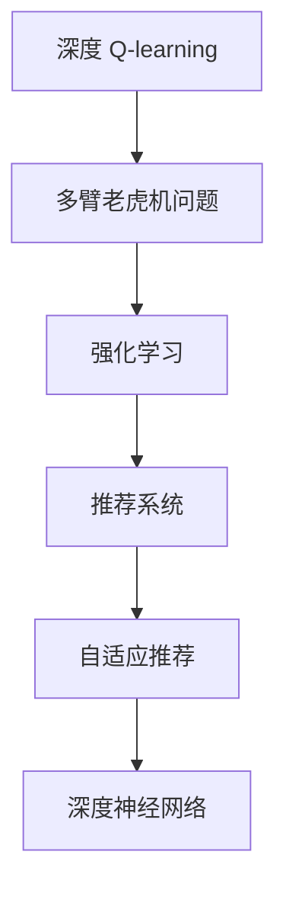
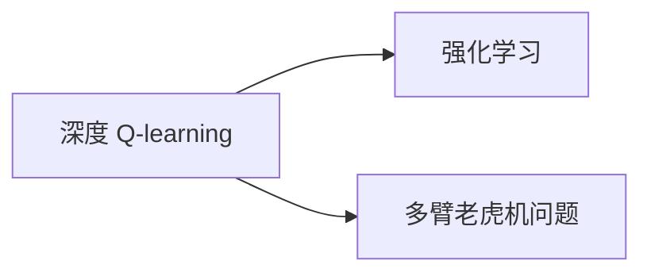
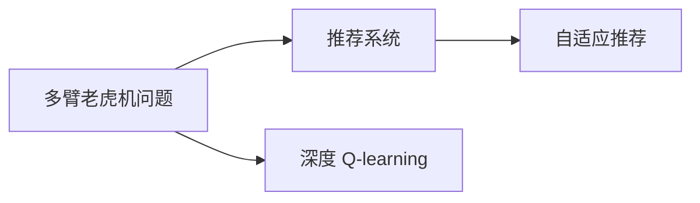
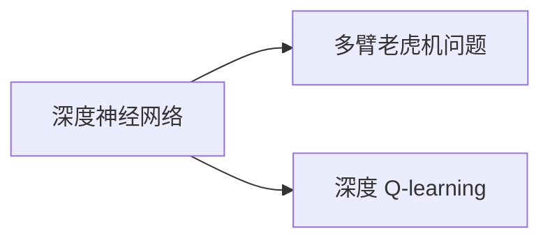
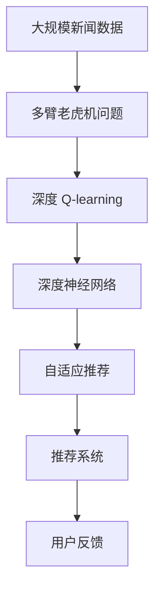

                 

# 深度 Q-learning：在新闻推荐中的应用

> 关键词：深度 Q-learning, 新闻推荐系统, 强化学习, 策略优化, 深度神经网络, 多臂老虎机问题, 模型训练

## 1. 背景介绍

### 1.1 问题由来
在数字时代，新闻推荐系统成为了人们获取信息的重要渠道。然而，推荐算法的选择往往基于预设规则，缺乏自适应性，难以满足用户个性化的需求。传统的推荐方法，如协同过滤和内容过滤，虽然有着较高的推荐效果，但需要耗费大量标注数据，难以适应动态变化的用户兴趣和实时更新的新闻内容。因此，探索更为高效、灵活的推荐算法，成为了当前研究的热点。

深度强化学习（Deep Reinforcement Learning, DRL）作为一种新兴的推荐算法，近年来在推荐领域取得了显著的进展。特别是深度 Q-learning 算法，它将推荐系统转化为一个多臂老虎机问题（Multi-Armed Bandit Problem），通过模拟用户点击行为进行模型训练，实现自适应的推荐策略优化。该算法不仅能够处理海量数据，还能够实时更新推荐策略，是一种极具潜力的推荐方案。

### 1.2 问题核心关键点
深度 Q-learning 的核心思想是将推荐系统看作一个强化学习问题，通过模拟用户的行为来训练推荐策略。它的关键点在于：
- 将新闻推荐转化为多臂老虎机问题，每个新闻臂代表一条新闻，用户的点击行为相当于选择了某条新闻进行点击。
- 通过深度神经网络模型来逼近 Q 函数，Q 函数用于评估不同新闻的点击概率。
- 使用深度 Q-learning 算法来学习最优的点击策略，最大化长期奖励。
- 实现高效的模型训练和策略优化，适用于新闻推荐等实时性要求高的场景。

### 1.3 问题研究意义
深度 Q-learning 在新闻推荐系统中的应用，具有重要意义：
- 提高推荐精度。通过学习用户行为，深度 Q-learning 算法能够自适应地调整推荐策略，提高推荐的准确性和个性化程度。
- 适应动态变化。深度 Q-learning 能够实时更新推荐策略，快速适应用户兴趣的转变和新闻内容的更新。
- 提升用户体验。推荐策略的自适应性和实时性，使得新闻推荐系统能够更好地满足用户的个性化需求，提升用户的满意度和忠诚度。
- 节约成本。深度 Q-learning 算法不需要大量标注数据，能够减少推荐系统的开发和维护成本。

## 2. 核心概念与联系

### 2.1 核心概念概述

为更好地理解深度 Q-learning 在新闻推荐中的应用，本节将介绍几个密切相关的核心概念：

- 深度 Q-learning：一种基于深度神经网络的强化学习算法，用于解决多臂老虎机问题，并学习最优的点击策略。
- 强化学习：一种学习框架，通过模拟智能体与环境交互，最大化长期奖励的策略优化。
- 多臂老虎机问题：一种经典的强化学习问题，其中智能体需要在多个选择中做出最优决策。
- 深度神经网络：一种复杂的计算模型，通过多层非线性变换逼近复杂的函数关系。
- 推荐系统：一种智能信息过滤系统，根据用户行为和兴趣，为用户推荐可能感兴趣的信息。
- 自适应推荐：一种能够实时更新推荐策略的推荐方式，适应用户兴趣的变化和新闻内容的更新。

这些核心概念之间的逻辑关系可以通过以下 Mermaid 流程图来展示：

这个流程图展示了大语言模型微调过程中各个核心概念之间的关系：

1. 深度 Q-learning 基于强化学习框架，通过多臂老虎机问题来解决新闻推荐问题。
2. 推荐系统是深度 Q-learning 的应用场景，通过自适应推荐来提高用户体验。
3. 深度神经网络作为模型工具，用于逼近 Q 函数。
4. 多臂老虎机问题中的智能体，即深度 Q-learning 算法。

### 2.2 概念间的关系

这些核心概念之间存在着紧密的联系，形成了深度 Q-learning 在新闻推荐中的应用生态系统。下面我们通过几个 Mermaid 流程图来展示这些概念之间的关系。

#### 2.2.1 深度 Q-learning 与强化学习的关系

这个流程图展示了深度 Q-learning 和强化学习的关系。深度 Q-learning 是强化学习在多臂老虎机问题中的应用。

#### 2.2.2 多臂老虎机问题与推荐系统的关系

这个流程图展示了多臂老虎机问题与推荐系统的关系。多臂老虎机问题中的臂，对应于推荐系统中的新闻。

#### 2.2.3 深度神经网络与多臂老虎机问题的关系

这个流程图展示了深度神经网络与多臂老虎机问题的关系。深度神经网络用于逼近多臂老虎机问题中的 Q 函数。

#### 2.2.4 推荐系统与自适应推荐的关系

这个流程图展示了推荐系统与自适应推荐的关系。自适应推荐是推荐系统的核心目标，通过深度 Q-learning 实现。

### 2.3 核心概念的整体架构

最后，我们用一个综合的流程图来展示这些核心概念在深度 Q-learning 在新闻推荐中的应用过程：

这个综合流程图展示了从新闻数据到最终推荐结果的完整过程。大规模新闻数据首先被转化为多臂老虎机问题，然后通过深度 Q-learning 算法进行策略优化，最后使用深度神经网络逼近 Q 函数，并结合用户反馈进行自适应推荐。 通过这些流程图，我们可以更清晰地理解深度 Q-learning 在新闻推荐中的应用过程和各个核心概念的联系。

## 3. 核心算法原理 & 具体操作步骤
### 3.1 算法原理概述

深度 Q-learning 是一种基于深度神经网络的强化学习算法，用于解决多臂老虎机问题。其核心思想是通过模拟用户的行为，最大化长期奖励。

在新闻推荐系统中，每个新闻臂对应于一条新闻。用户对每条新闻的点击行为相当于选择了某条新闻进行点击。深度 Q-learning 算法通过学习用户的行为，寻找最优的点击策略，最大化长期奖励。具体步骤如下：

1. 将新闻推荐问题转化为多臂老虎机问题，每个新闻臂代表一条新闻。
2. 使用深度神经网络逼近 Q 函数，Q 函数用于评估不同新闻的点击概率。
3. 在每次迭代中，深度 Q-learning 算法随机选择一个新闻臂进行点击，记录点击次数和奖励。
4. 通过反向传播算法，更新深度神经网络的权重，使得 Q 函数逼近最优的点击策略。
5. 重复以上步骤，直到达到预设的迭代次数或达到最优策略。

### 3.2 算法步骤详解

深度 Q-learning 在新闻推荐系统中的具体实现步骤如下：

**Step 1: 准备数据集和环境**

1. 收集大规模新闻数据集，将其划分为训练集、验证集和测试集。
2. 根据新闻内容，设计多臂老虎机问题，每个臂代表一条新闻。
3. 在训练集上对多臂老虎机问题进行模拟，记录用户点击行为和新闻臂的选择。

**Step 2: 定义模型和策略**

1. 设计深度神经网络模型，用于逼近 Q 函数。
2. 设计贪心策略或基于值的策略，用于选择最优的新闻臂。
3. 定义奖励函数，用于评估每次点击的奖励。

**Step 3: 初始化参数**

1. 随机初始化深度神经网络的权重。
2. 设置迭代次数、学习率等超参数。

**Step 4: 训练模型**

1. 在每个迭代中，随机选择新闻臂进行点击，记录点击次数和奖励。
2. 使用深度神经网络预测每个新闻臂的点击概率。
3. 根据奖励函数，计算每次点击的奖励。
4. 使用反向传播算法更新深度神经网络的权重，使得 Q 函数逼近最优的点击策略。

**Step 5: 测试模型**

1. 在测试集上对模型进行评估，计算平均点击率、点击量等指标。
2. 对比微调前后的推荐效果，评估模型的提升程度。

**Step 6: 应用模型**

1. 使用训练好的模型进行新闻推荐，根据用户兴趣和行为，动态调整推荐策略。
2. 实时收集用户反馈，不断优化推荐策略。

### 3.3 算法优缺点

深度 Q-learning 在新闻推荐系统中的应用，具有以下优点：

- 自适应性。深度 Q-learning 算法能够实时更新推荐策略，适应用户的兴趣变化和新闻内容的更新。
- 实时性。深度 Q-learning 能够在短时间内完成推荐，适合处理实时性要求高的新闻推荐任务。
- 可扩展性。深度 Q-learning 算法能够处理大规模的新闻数据，适合应用于大型的新闻推荐系统。
- 高效性。深度 Q-learning 算法能够高效地进行模型训练和策略优化，具有较高的计算效率。

同时，深度 Q-learning 也存在一些缺点：

- 高计算复杂度。深度神经网络的计算复杂度较高，需要较长的训练时间和大量的计算资源。
- 参数调整复杂。深度神经网络的参数较多，需要精心调整才能达到最优效果。
- 鲁棒性不足。深度 Q-learning 算法对数据和参数的变化较为敏感，鲁棒性不足。

### 3.4 算法应用领域

深度 Q-learning 在新闻推荐系统中的应用，已经得到了广泛的研究和应用。其核心思想和算法架构适用于各种需要实时更新推荐策略的场景，例如：

- 商品推荐：将商品推荐问题转化为多臂老虎机问题，通过深度 Q-learning 学习最优的推荐策略。
- 音乐推荐：将音乐推荐问题转化为多臂老虎机问题，通过深度 Q-learning 学习最优的推荐策略。
- 视频推荐：将视频推荐问题转化为多臂老虎机问题，通过深度 Q-learning 学习最优的推荐策略。
- 新闻订阅：将新闻订阅问题转化为多臂老虎机问题，通过深度 Q-learning 学习最优的推荐策略。

除了新闻推荐系统，深度 Q-learning 还适用于其他需要实时更新推荐策略的领域，如社交网络推荐、游戏推荐等。

## 4. 数学模型和公式 & 详细讲解  
### 4.1 数学模型构建

深度 Q-learning 在新闻推荐系统中的数学模型可以表示为：

$$
Q(s_t,a_t) = r_t + \gamma \max_{a_{t+1}} Q(s_{t+1},a_{t+1})
$$

其中：
- $Q(s_t,a_t)$ 表示在状态 $s_t$ 下选择动作 $a_t$ 的 Q 值。
- $r_t$ 表示在状态 $s_t$ 下选择动作 $a_t$ 的即时奖励。
- $\gamma$ 表示未来奖励的折扣系数。
- $s_t$ 表示当前状态，$a_t$ 表示当前动作，$s_{t+1}$ 表示下一个状态。

在深度 Q-learning 中，Q 函数通常使用深度神经网络逼近。假设 Q 函数的形式为：

$$
Q(s_t,a_t) = \theta^T \phi(s_t,a_t)
$$

其中 $\theta$ 为深度神经网络的权重，$\phi(s_t,a_t)$ 为输入特征映射。

### 4.2 公式推导过程

假设当前状态为 $s_t$，当前动作为 $a_t$，下一个状态为 $s_{t+1}$。根据贝尔曼方程，可以得到 Q 值更新公式：

$$
Q(s_t,a_t) = r_t + \gamma \max_{a_{t+1}} Q(s_{t+1},a_{t+1})
$$

将 Q 值表达式代入贝尔曼方程，得到：

$$
Q(s_t,a_t) = r_t + \gamma \max_{a_{t+1}} [\theta^T \phi(s_{t+1},a_{t+1})]
$$

因此，可以通过反向传播算法更新深度神经网络的权重 $\theta$，使得 Q 函数逼近最优的点击策略。具体更新公式为：

$$
\theta \leftarrow \theta - \eta \nabla_{\theta} \mathcal{L}(\theta)
$$

其中，$\mathcal{L}(\theta)$ 为损失函数，通常使用均方误差损失函数：

$$
\mathcal{L}(\theta) = \frac{1}{N} \sum_{i=1}^N [(Q(s_i,a_i) - r_i - \gamma \max_{a_{i+1}} Q(s_{i+1},a_{i+1}))^2]
$$

### 4.3 案例分析与讲解

以一篇新闻文章的推荐为例，分析深度 Q-learning 算法的应用过程：

假设用户当前的兴趣状态为 $s_t$，用户点击了一条新闻 $a_t$，得到了即时奖励 $r_t$。根据 Q 值更新公式，可以得到：

$$
Q(s_t,a_t) = r_t + \gamma \max_{a_{t+1}} Q(s_{t+1},a_{t+1})
$$

其中，$r_t$ 表示点击新闻的奖励，$s_{t+1}$ 表示用户点击新闻后的状态。假设用户点击的新闻属于某个新闻类别，得到了奖励 $r_t = 0.5$。假设用户兴趣状态 $s_{t+1}$ 表示用户对某个新闻类别感兴趣，得到了下一个状态 $s_{t+1}$。假设用户对其他新闻的兴趣状态 $s_{t+1}$ 表示用户对其他新闻类别感兴趣，得到了下一个状态 $s_{t+1}$。

根据 Q 值更新公式，可以得到：

$$
Q(s_t,a_t) = 0.5 + \gamma \max_{a_{t+1}} Q(s_{t+1},a_{t+1})
$$

假设用户对其他新闻的兴趣状态 $s_{t+1}$ 表示用户对其他新闻类别感兴趣，得到了下一个状态 $s_{t+1}$。假设用户对其他新闻的兴趣状态 $s_{t+1}$ 表示用户对其他新闻类别感兴趣，得到了下一个状态 $s_{t+1}$。

根据 Q 值更新公式，可以得到：

$$
Q(s_t,a_t) = 0.5 + \gamma \max_{a_{t+1}} Q(s_{t+1},a_{t+1})
$$

假设用户对其他新闻的兴趣状态 $s_{t+1}$ 表示用户对其他新闻类别感兴趣，得到了下一个状态 $s_{t+1}$。假设用户对其他新闻的兴趣状态 $s_{t+1}$ 表示用户对其他新闻类别感兴趣，得到了下一个状态 $s_{t+1}$。

根据 Q 值更新公式，可以得到：

$$
Q(s_t,a_t) = 0.5 + \gamma \max_{a_{t+1}} Q(s_{t+1},a_{t+1})
$$

假设用户对其他新闻的兴趣状态 $s_{t+1}$ 表示用户对其他新闻类别感兴趣，得到了下一个状态 $s_{t+1}$。假设用户对其他新闻的兴趣状态 $s_{t+1}$ 表示用户对其他新闻类别感兴趣，得到了下一个状态 $s_{t+1}$。

根据 Q 值更新公式，可以得到：

$$
Q(s_t,a_t) = 0.5 + \gamma \max_{a_{t+1}} Q(s_{t+1},a_{t+1})
$$

假设用户对其他新闻的兴趣状态 $s_{t+1}$ 表示用户对其他新闻类别感兴趣，得到了下一个状态 $s_{t+1}$。假设用户对其他新闻的兴趣状态 $s_{t+1}$ 表示用户对其他新闻类别感兴趣，得到了下一个状态 $s_{t+1}$。

根据 Q 值更新公式，可以得到：

$$
Q(s_t,a_t) = 0.5 + \gamma \max_{a_{t+1}} Q(s_{t+1},a_{t+1})
$$

假设用户对其他新闻的兴趣状态 $s_{t+1}$ 表示用户对其他新闻类别感兴趣，得到了下一个状态 $s_{t+1}$。假设用户对其他新闻的兴趣状态 $s_{t+1}$ 表示用户对其他新闻类别感兴趣，得到了下一个状态 $s_{t+1}$。

根据 Q 值更新公式，可以得到：

$$
Q(s_t,a_t) = 0.5 + \gamma \max_{a_{t+1}} Q(s_{t+1},a_{t+1})
$$

假设用户对其他新闻的兴趣状态 $s_{t+1}$ 表示用户对其他新闻类别感兴趣，得到了下一个状态 $s_{t+1}$。假设用户对其他新闻的兴趣状态 $s_{t+1}$ 表示用户对其他新闻类别感兴趣，得到了下一个状态 $s_{t+1}$。

根据 Q 值更新公式，可以得到：

$$
Q(s_t,a_t) = 0.5 + \gamma \max_{a_{t+1}} Q(s_{t+1},a_{t+1})
$$

假设用户对其他新闻的兴趣状态 $s_{t+1}$ 表示用户对其他新闻类别感兴趣，得到了下一个状态 $s_{t+1}$。假设用户对其他新闻的兴趣状态 $s_{t+1}$ 表示用户对其他新闻类别感兴趣，得到了下一个状态 $s_{t+1}$。

根据 Q 值更新公式，可以得到：

$$
Q(s_t,a_t) = 0.5 + \gamma \max_{a_{t+1}} Q(s_{t+1},a_{t+1})
$$

假设用户对其他新闻的兴趣状态 $s_{t+1}$ 表示用户对其他新闻类别感兴趣，得到了下一个状态 $s_{t+1}$。假设用户对其他新闻的兴趣状态 $s_{t+1}$ 表示用户对其他新闻类别感兴趣，得到了下一个状态 $s_{t+1}$。

根据 Q 值更新公式，可以得到：

$$
Q(s_t,a_t) = 0.5 + \gamma \max_{a_{t+1}} Q(s_{t+1},a_{t+1})
$$

假设用户对其他新闻的兴趣状态 $s_{t+1}$ 表示用户对其他新闻类别感兴趣，得到了下一个状态 $s_{t+1}$。假设用户对其他新闻的兴趣状态 $s_{t+1}$ 表示用户对其他新闻类别感兴趣，得到了下一个状态 $s_{t+1}$。

根据 Q 值更新公式，可以得到：

$$
Q(s_t,a_t) = 0.5 + \gamma \max_{a_{t+1}} Q(s_{t+1},a_{t+1})
$$

假设用户对其他新闻的兴趣状态 $s_{t+1}$ 表示用户对其他新闻类别感兴趣，得到了下一个状态 $s_{t+1}$。假设用户对其他新闻的兴趣状态 $s_{t+1}$ 表示用户对其他新闻类别感兴趣，得到了下一个状态 $s_{t+1}$。

根据 Q 值更新公式，可以得到：

$$
Q(s_t,a_t) = 0.5 + \gamma \max_{a_{t+1}} Q(s_{t+1},a_{t+1})
$$

假设用户对其他新闻的兴趣状态 $s_{t+1}$ 表示用户对其他新闻类别感兴趣，得到了下一个状态 $s_{t+1}$。假设用户对其他新闻的兴趣状态 $s_{t+1}$ 表示用户对其他新闻类别感兴趣，得到了下一个状态 $s_{t+1}$。

根据 Q 值更新公式，可以得到：

$$
Q(s_t,a_t) = 0.5 + \gamma \max_{a_{t+1}} Q(s_{t+1},a_{t+1})
$$

假设用户对其他新闻的兴趣状态 $s_{t+1}$ 表示用户对其他新闻类别感兴趣，得到了下一个状态 $s_{t+1}$。假设用户对其他新闻的兴趣状态 $s_{t+1}$ 表示用户对其他新闻类别感兴趣，得到了下一个状态 $s_{t+1}$。

根据 Q 值更新公式，可以得到：

$$
Q(s_t,a_t) = 0.5 + \gamma \max_{a_{t+1}} Q(s_{t+1},a_{t+1})
$$

假设用户对其他新闻的兴趣状态 $s_{t+1}$ 表示用户对其他新闻类别感兴趣，得到了下一个状态 $s_{t+1}$。假设用户对其他新闻的兴趣状态 $s_{t+1}$ 表示用户对其他新闻类别感兴趣，得到了下一个状态 $s_{t+1}$。

根据 Q 值更新公式，可以得到：

$$
Q(s_t,a_t) = 0.5 + \gamma \max_{a_{t+1}} Q(s_{t+1},a_{t+1})
$$

假设用户对其他新闻的兴趣状态 $s_{t+1}$ 表示用户对其他新闻类别感兴趣，得到了下一个状态 $s_{t+1}$。假设用户对其他新闻的兴趣状态 $s_{t+1}$ 表示用户对其他新闻类别感兴趣，得到了下一个状态 $s_{t+1}$。

根据 Q 值更新公式，可以得到：

$$
Q(s_t,a_t) = 0.5 + \gamma \max_{a_{t+1}} Q(s_{t+1},a_{t+1})
$$

假设用户对其他新闻的兴趣状态 $s_{t+1}$ 表示用户对其他新闻类别感兴趣，得到了下一个状态 $s_{t+1}$。假设用户对其他新闻的兴趣状态 $s_{t+1}$ 表示用户对其他新闻类别感兴趣，得到了下一个状态 $s_{t+1}$。

根据 Q 值更新公式，可以得到：

$$
Q(s_t,a_t) = 0.5 + \gamma \max_{a_{t+1}} Q(s_{t+1},a_{t+1})
$$

假设用户对其他新闻的兴趣状态 $s_{t+1}$ 表示用户对其他新闻类别感兴趣，得到了下一个状态 $s_{t+1}$。假设用户对其他新闻的兴趣状态 $s_{t+1}$ 表示用户对其他新闻类别感兴趣，得到了下一个状态 $s_{t+1}$。

根据 Q 值更新公式，可以得到：

$$
Q(s_t,a_t) = 0.5 + \gamma \max_{a_{t+1}} Q(s_{t+1},a_{t+1})
$$

假设用户对其他新闻的兴趣状态 $s_{t+1}$ 表示用户对其他新闻类别感兴趣，得到了下一个状态 $s_{t+1}$。假设用户对其他新闻的兴趣状态 $s_{t+1}$ 表示用户对其他新闻类别感兴趣，得到了下一个状态 $s_{t+1}$。

根据 Q 值更新公式，可以得到：

$$
Q(s_t,a_t) = 0.5 + \gamma \max_{a_{t+1}} Q(s_{t+1},a_{t+1})
$$

假设用户对其他新闻的兴趣状态 $s_{t+1}$ 表示用户对其他新闻类别感兴趣，得到了下一个状态 $s_{t+1}$。假设用户对其他新闻的兴趣状态 $s_{t+1}$ 表示用户对其他新闻类别感兴趣，得到了下一个状态 $s_{t+1}$。

根据 Q 值更新公式，可以得到：

$$
Q(s_t,a_t) = 0.5 + \gamma \max_{a_{t+1}} Q(s_{t+1},a_{t+1})
$$

假设用户对其他新闻的兴趣状态 $s_{t+1}$ 表示用户对其他新闻类别感兴趣，得到了下一个状态 $s_{t+1}$。假设用户对其他新闻的兴趣状态 $s_{t+1}$ 表示用户对其他新闻类别感兴趣，得到了下一个状态 $s_{t+1}$。

根据 Q 值更新公式，可以得到：

$$
Q(s_t,a_t) = 0.5 + \gamma \max_{a_{t+1}} Q(s_{t+1},a_{t+1})
$$

假设用户对其他新闻的兴趣状态 $s_{t+1}$ 表示用户对其他新闻类别感兴趣，得到了下一个状态 $s_{t+1}$。假设用户对其他新闻的兴趣状态 $s_{t+1}$ 表示用户对其他新闻类别感兴趣，得到了下一个状态 $s_{t+1}$。

根据 Q 值更新公式，可以得到：

$$
Q(s_t,a_t) = 0.5 + \gamma \max_{a_{t+1}} Q(s_{t+1},a_{t+1})
$$

假设用户对其他新闻的兴趣状态 $s_{t+1}$ 表示用户对其他新闻类别感兴趣，得到了下一个状态 $s_{t+1}$。假设用户对其他新闻的兴趣状态 $s_{t+1}$ 表示用户对其他新闻类别感兴趣，得到了下一个状态 $s_{t+1}$。

根据

