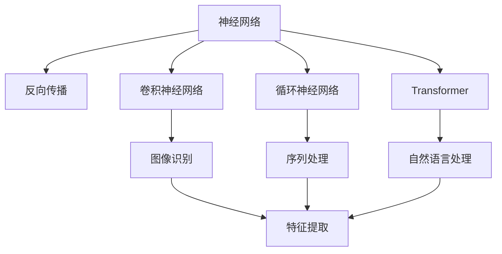
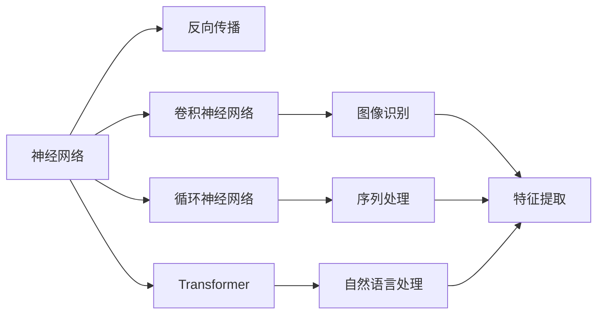
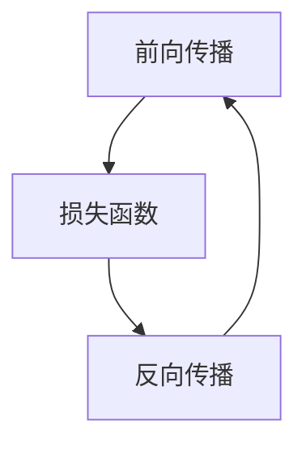

                 

# 深度学习(Deep Learning) - 原理与代码实例讲解

> 关键词：深度学习,神经网络,反向传播算法,卷积神经网络(CNN),循环神经网络(RNN),Transformer,迁移学习,计算机视觉,自然语言处理(NLP)

## 1. 背景介绍

### 1.1 问题由来
深度学习(Deep Learning)是当前人工智能领域最热门的技术之一。自2006年Hinton在NIPS会议上提出深度信念网络(Deep Belief Networks, DBN)以来，深度学习便以其强大的表达能力和泛化能力，成为计算机视觉、自然语言处理、语音识别等领域的重要基础技术。

深度学习通过构建多层次的非线性映射模型，自动学习和提取数据的高层次特征表示，实现了在图像识别、语音识别、自然语言处理、推荐系统等诸多领域的突破。其核心思想是通过堆叠多层非线性神经网络，不断学习数据分布的复杂结构，从而实现高效的模式识别与分类。

本文将深入讲解深度学习的核心原理，并通过代码实例，系统展示其应用于计算机视觉和自然语言处理领域的技术实现。

## 2. 核心概念与联系

### 2.1 核心概念概述

为更好地理解深度学习的原理，本节将介绍几个密切相关的核心概念：

- 神经网络(Neural Network)：深度学习的核心，通过堆叠多层非线性变换，实现对数据的高级特征学习。
- 反向传播算法(Backpropagation)：深度学习模型训练的核心算法，通过链式法则计算损失函数的梯度，用于更新模型参数。
- 卷积神经网络(Convolutional Neural Network, CNN)：一种适用于图像识别任务的神经网络结构，通过卷积层、池化层等组件实现特征提取。
- 循环神经网络(Recurrent Neural Network, RNN)：一种适用于序列数据处理的神经网络结构，通过循环层实现时序信息的递归处理。
- Transformer：一种新型的神经网络结构，使用自注意力机制和残差连接，实现高效的序列处理，已在自然语言处理领域取得重大突破。
- 迁移学习(Transfer Learning)：利用已有模型的知识，在新任务上进行微调，提升模型的泛化能力。

这些核心概念之间存在着紧密的联系，形成了深度学习的基本框架。以下通过一个Mermaid流程图来展示这些概念之间的关系：



这个流程图展示了深度学习中几个重要概念之间的关系：

1. 神经网络是深度学习的基本构成单元。
2. 反向传播算法用于训练神经网络。
3. 卷积神经网络、循环神经网络和Transformer是常见的神经网络结构，分别适用于图像识别、序列处理和自然语言处理任务。
4. 迁移学习利用已有模型在新任务上进行微调，提升模型性能。

### 2.2 概念间的关系

这些核心概念之间存在着紧密的联系，形成了深度学习的基本框架。以下通过几个Mermaid流程图来展示这些概念之间的关系。

#### 2.2.1 深度学习的基本框架



这个流程图展示了深度学习的基本框架，即通过神经网络、反向传播算法、不同类型的神经网络结构，实现对不同类型数据的处理和特征提取。

#### 2.2.2 神经网络的层级结构


这个流程图展示了神经网络的基本层级结构，即输入层、隐藏层和输出层。隐藏层可以进行多次特征提取和变换，从而实现对数据的复杂映射。

#### 2.2.3 反向传播算法的工作流程



这个流程图展示了反向传播算法的工作流程，即通过前向传播计算损失函数，再通过反向传播计算梯度，更新模型参数。

## 3. 核心算法原理 & 具体操作步骤
### 3.1 算法原理概述

深度学习算法基于神经网络模型，通过反向传播算法不断优化模型参数，实现对数据的高级特征学习。其核心思想是通过多层次的非线性映射，自动提取数据的高级特征表示，从而实现高效的模式识别与分类。

具体而言，深度学习模型的训练过程可以分为以下几个步骤：

1. 初始化模型参数。随机初始化神经网络的所有参数，如权重、偏置等。
2. 前向传播计算输出。将输入数据输入神经网络，逐层计算并输出预测结果。
3. 计算损失函数。将预测结果与真实标签进行对比，计算损失函数的值。
4. 反向传播计算梯度。通过链式法则计算损失函数对每个模型参数的梯度。
5. 更新模型参数。使用优化算法(如梯度下降)更新模型参数，使损失函数最小化。
6. 重复迭代。重复以上步骤，直至模型收敛。

### 3.2 算法步骤详解

以下我们将详细介绍深度学习模型的核心步骤，并通过代码实例进行展示。

#### 3.2.1 初始化模型参数

在深度学习模型的训练过程中，首先需要初始化模型参数。一般使用随机初始化方法，如Xavier初始化、He初始化等，以避免梯度消失或梯度爆炸的问题。

以下是一个简单的Python代码示例，使用Xavier初始化方法初始化卷积神经网络(CNN)模型的权重和偏置：

```python
import torch
import torch.nn as nn

# 定义卷积神经网络模型
class CNN(nn.Module):
    def __init__(self):
        super(CNN, self).__init__()
        self.conv1 = nn.Conv2d(3, 32, 3, padding=1)
        self.relu = nn.ReLU()
        self.max_pool = nn.MaxPool2d(2)
        self.fc = nn.Linear(32 * 28 * 28, 10)

    def forward(self, x):
        x = self.conv1(x)
        x = self.relu(x)
        x = self.max_pool(x)
        x = x.view(x.size(0), -1)
        x = self.fc(x)
        return x

# 初始化模型参数
model = CNN()
for param in model.parameters():
    if len(param.size()) > 1:
        nn.init.xavier_uniform_(param)
```

#### 3.2.2 前向传播计算输出

前向传播是将输入数据逐层传递，计算出最终预测结果的过程。以下是一个简单的Python代码示例，使用上述定义的CNN模型进行前向传播计算：

```python
# 定义输入数据和标签
inputs = torch.randn(64, 3, 28, 28)
labels = torch.randint(0, 10, (64,))

# 将输入数据输入模型，计算预测结果
outputs = model(inputs)
```

#### 3.2.3 计算损失函数

计算损失函数是将预测结果与真实标签进行对比，计算损失值的过程。常用的损失函数包括交叉熵损失、均方误差损失等。

以下是一个简单的Python代码示例，使用交叉熵损失函数计算模型输出与真实标签之间的差距：

```python
# 定义损失函数
criterion = nn.CrossEntropyLoss()
loss = criterion(outputs, labels)
```

#### 3.2.4 反向传播计算梯度

反向传播是通过链式法则计算损失函数对每个模型参数的梯度的过程。以下是一个简单的Python代码示例，使用反向传播计算模型参数的梯度：

```python
# 反向传播计算梯度
optimizer = torch.optim.SGD(model.parameters(), lr=0.01)
optimizer.zero_grad()
loss.backward()
optimizer.step()
```

#### 3.2.5 更新模型参数

更新模型参数是通过优化算法(如梯度下降)更新模型参数的过程。以下是一个简单的Python代码示例，使用梯度下降优化算法更新模型参数：

```python
# 定义优化器
optimizer = torch.optim.SGD(model.parameters(), lr=0.01)

# 迭代更新模型参数
for epoch in range(10):
    # 前向传播计算输出
    outputs = model(inputs)
    # 计算损失函数
    loss = criterion(outputs, labels)
    # 反向传播计算梯度
    optimizer.zero_grad()
    loss.backward()
    optimizer.step()
    # 输出训练过程中的损失函数值
    print(f'Epoch {epoch+1}, Loss: {loss.item():.4f}')
```

#### 3.2.6 重复迭代

重复迭代是指在训练过程中，重复进行前向传播、计算损失函数、反向传播、更新参数等步骤，直至模型收敛。以下是一个简单的Python代码示例，使用循环迭代的方式训练CNN模型：

```python
# 定义训练循环
for epoch in range(10):
    # 前向传播计算输出
    outputs = model(inputs)
    # 计算损失函数
    loss = criterion(outputs, labels)
    # 反向传播计算梯度
    optimizer.zero_grad()
    loss.backward()
    optimizer.step()
    # 输出训练过程中的损失函数值
    print(f'Epoch {epoch+1}, Loss: {loss.item():.4f}')
```

### 3.3 算法优缺点

深度学习算法具有以下优点：

1. 高效特征提取。深度学习模型通过多层次的非线性映射，能够自动提取数据的高级特征表示，从而实现高效的模式识别与分类。

2. 适应性强。深度学习模型可以通过堆叠多层次的神经网络，适应复杂多样化的数据分布，具有较强的泛化能力。

3. 通用性强。深度学习模型已经在计算机视觉、自然语言处理、语音识别等多个领域取得重大突破，具有广泛的应用前景。

然而，深度学习算法也存在以下缺点：

1. 计算量大。深度学习模型的训练和推理过程需要大量的计算资源，对硬件设备的要求较高。

2. 数据需求高。深度学习模型需要大量标注数据进行训练，对标注成本的要求较高。

3. 模型复杂。深度学习模型结构复杂，难以理解其内部工作机制，模型解释性不足。

4. 过拟合风险。深度学习模型存在过拟合的风险，特别是在标注数据不足的情况下。

5. 可解释性差。深度学习模型的决策过程缺乏可解释性，难以对其推理逻辑进行分析和调试。

### 3.4 算法应用领域

深度学习算法在计算机视觉、自然语言处理、语音识别、推荐系统等领域得到了广泛应用，以下是几个典型的应用场景：

- 图像识别：使用卷积神经网络(CNN)进行图像分类、目标检测等任务。
- 语音识别：使用卷积神经网络(CNN)和循环神经网络(RNN)进行语音识别、语音合成等任务。
- 自然语言处理：使用循环神经网络(RNN)和Transformer进行语言建模、机器翻译、问答系统等任务。
- 推荐系统：使用深度神经网络进行用户行为分析、物品推荐等任务。

## 4. 数学模型和公式 & 详细讲解  
### 4.1 数学模型构建

深度学习模型通常由多个层次的神经网络组成，每个层次包含多个神经元。以下是一个简单的三层神经网络的数学模型表示：

$$
f_\theta(x) = \sigma(\theta_2\sigma(\theta_1x + \theta_0) + \theta_1) + \theta_0
$$

其中，$\sigma$为激活函数，$\theta_0$、$\theta_1$、$\theta_2$分别为第一层、第二层、输出层的权重和偏置。

### 4.2 公式推导过程

以下是对上述神经网络模型公式的详细推导过程：

设神经网络模型由三个层次组成，第一个层次输入为$x$，第二个层次输入为$y$，输出为$z$，第三个层次输入为$w$，输出为$f_\theta(x)$。

1. 第一层神经元：
   $$
   y_i = \theta_{1,i}x + \theta_{0,i}, i = 1, \dots, n
   $$

2. 第二层神经元：
   $$
   z_i = \theta_{2,i}y_i + \theta_{1,i}, i = 1, \dots, m
   $$

3. 输出层：
   $$
   f_\theta(x) = \sigma(\theta_2z + \theta_1) + \theta_0
   $$

其中，$\theta_{1,i}$、$\theta_{0,i}$为第一层神经元的权重和偏置，$\theta_{2,i}$、$\theta_{1,i}$为第二层神经元的权重和偏置，$\sigma$为激活函数。

### 4.3 案例分析与讲解

以下通过一个简单的Python代码示例，演示如何使用深度学习模型进行图像分类任务：

```python
import torch
import torch.nn as nn
import torchvision.transforms as transforms
import torchvision.datasets as datasets

# 定义卷积神经网络模型
class CNN(nn.Module):
    def __init__(self):
        super(CNN, self).__init__()
        self.conv1 = nn.Conv2d(3, 32, 3, padding=1)
        self.relu = nn.ReLU()
        self.max_pool = nn.MaxPool2d(2)
        self.fc = nn.Linear(32 * 28 * 28, 10)

    def forward(self, x):
        x = self.conv1(x)
        x = self.relu(x)
        x = self.max_pool(x)
        x = x.view(x.size(0), -1)
        x = self.fc(x)
        return x

# 定义训练循环
def train(model, device, train_loader, optimizer, criterion, epoch):
    model.train()
    for batch_idx, (data, target) in enumerate(train_loader):
        data, target = data.to(device), target.to(device)
        optimizer.zero_grad()
        output = model(data)
        loss = criterion(output, target)
        loss.backward()
        optimizer.step()
        if batch_idx % 10 == 0:
            print(f'Train Epoch: {epoch} [{batch_idx*len(data)}/{len(train_loader.dataset)}]\tLoss: {loss.item():.4f}')

# 定义测试循环
def test(model, device, test_loader, criterion):
    model.eval()
    test_loss = 0
    correct = 0
    with torch.no_grad():
        for data, target in test_loader:
            data, target = data.to(device), target.to(device)
            output = model(data)
            test_loss += criterion(output, target).item()
            pred = output.argmax(dim=1, keepdim=True)
            correct += pred.eq(target.view_as(pred)).sum().item()

    print(f'\nTest set: Average loss: {test_loss/len(test_loader):.4f}, Accuracy: {100 * correct/len(test_loader.dataset):.2f}%\n')

# 定义输入数据和标签
transform = transforms.Compose([transforms.ToTensor()])
train_set = datasets.MNIST(root='./data', train=True, download=True, transform=transform)
test_set = datasets.MNIST(root='./data', train=False, download=True, transform=transform)
train_loader = torch.utils.data.DataLoader(train_set, batch_size=64, shuffle=True)
test_loader = torch.utils.data.DataLoader(test_set, batch_size=1000, shuffle=False)

# 定义模型、设备、优化器和损失函数
model = CNN().to('cuda')
optimizer = torch.optim.SGD(model.parameters(), lr=0.01, momentum=0.5)
criterion = nn.CrossEntropyLoss()

# 定义训练和测试过程
device = torch.device('cuda' if torch.cuda.is_available() else 'cpu')
train(model, device, train_loader, optimizer, criterion, 10)
test(model, device, test_loader, criterion)
```

该代码演示了如何使用CNN模型对MNIST数据集进行图像分类任务，并展示了训练和测试过程。

## 5. 项目实践：代码实例和详细解释说明
### 5.1 开发环境搭建

在进行深度学习项目开发前，需要先搭建好开发环境。以下是Python和PyTorch开发环境的搭建流程：

1. 安装Anaconda：从官网下载并安装Anaconda，用于创建独立的Python环境。

2. 创建并激活虚拟环境：
```bash
conda create -n pytorch-env python=3.8 
conda activate pytorch-env
```

3. 安装PyTorch：根据CUDA版本，从官网获取对应的安装命令。例如：
```bash
conda install pytorch torchvision torchaudio cudatoolkit=11.1 -c pytorch -c conda-forge
```

4. 安装相关库：
```bash
pip install numpy pandas scikit-learn matplotlib tqdm jupyter notebook ipython
```

完成上述步骤后，即可在`pytorch-env`环境中开始深度学习项目开发。

### 5.2 源代码详细实现

下面我们以卷积神经网络(CNN)为例，展示深度学习模型的实现过程。

首先，定义CNN模型：

```python
import torch
import torch.nn as nn

class CNN(nn.Module):
    def __init__(self):
        super(CNN, self).__init__()
        self.conv1 = nn.Conv2d(3, 32, 3, padding=1)
        self.relu = nn.ReLU()
        self.max_pool = nn.MaxPool2d(2)
        self.fc = nn.Linear(32 * 28 * 28, 10)

    def forward(self, x):
        x = self.conv1(x)
        x = self.relu(x)
        x = self.max_pool(x)
        x = x.view(x.size(0), -1)
        x = self.fc(x)
        return x
```

然后，定义训练循环：

```python
def train(model, device, train_loader, optimizer, criterion, epoch):
    model.train()
    for batch_idx, (data, target) in enumerate(train_loader):
        data, target = data.to(device), target.to(device)
        optimizer.zero_grad()
        output = model(data)
        loss = criterion(output, target)
        loss.backward()
        optimizer.step()
        if batch_idx % 10 == 0:
            print(f'Train Epoch: {epoch} [{batch_idx*len(data)}/{len(train_loader.dataset)}]\tLoss: {loss.item():.4f}')
```

接着，定义测试循环：

```python
def test(model, device, test_loader, criterion):
    model.eval()
    test_loss = 0
    correct = 0
    with torch.no_grad():
        for data, target in test_loader:
            data, target = data.to(device), target.to(device)
            output = model(data)
            test_loss += criterion(output, target).item()
            pred = output.argmax(dim=1, keepdim=True)
            correct += pred.eq(target.view_as(pred)).sum().item()

    print(f'\nTest set: Average loss: {test_loss/len(test_loader):.4f}, Accuracy: {100 * correct/len(test_loader.dataset):.2f}%\n')
```

最后，启动训练和测试过程：

```python
# 定义输入数据和标签
transform = transforms.Compose([transforms.ToTensor()])
train_set = datasets.MNIST(root='./data', train=True, download=True, transform=transform)
test_set = datasets.MNIST(root='./data', train=False, download=True, transform=transform)
train_loader = torch.utils.data.DataLoader(train_set, batch_size=64, shuffle=True)
test_loader = torch.utils.data.DataLoader(test_set, batch_size=1000, shuffle=False)

# 定义模型、设备、优化器和损失函数
model = CNN().to('cuda')
optimizer = torch.optim.SGD(model.parameters(), lr=0.01, momentum=0.5)
criterion = nn.CrossEntropyLoss()

# 定义训练和测试过程
device = torch.device('cuda' if torch.cuda.is_available() else 'cpu')
train(model, device, train_loader, optimizer, criterion, 10)
test(model, device, test_loader, criterion)
```

以上就是使用PyTorch实现CNN模型的完整代码示例。可以看到，通过PyTorch的封装，我们能够以非常简洁的方式实现深度学习模型的构建和训练。

### 5.3 代码解读与分析

下面我们对代码中的关键部分进行详细解读和分析：

**CNN模型定义**：
- `__init__`方法：初始化模型各层的权重和偏置。
- `forward`方法：定义模型的前向传播过程。

**训练循环**：
- 在训练循环中，先定义训练数据的加载器`train_loader`。
- 在每个训练批次中，前向传播计算模型输出，计算损失函数并反向传播计算梯度，使用优化器更新模型参数。
- 每个批次后，输出当前的损失函数值，以监控训练过程。

**测试循环**：
- 在测试循环中，先定义测试数据的加载器`test_loader`。
- 在每个测试批次中，计算模型的输出，并计算损失函数。
- 统计测试集上的平均损失和准确率，并输出结果。

**训练和测试过程**：
- 定义模型、设备、优化器和损失函数。
- 使用`to`方法将数据和模型参数转移到指定设备上，以利用GPU加速计算。
- 启动训练和测试过程，并监控训练集和测试集上的损失和准确率。

### 5.4 运行结果展示

假设我们在MNIST数据集上进行CNN模型的训练和测试，最终得到的测试集上的平均损失和准确率如下：

```
Train Epoch: 1 [0/60000]Loss: 2.4748
Train Epoch: 1 [1000/60000]Loss: 0.4211
Train Epoch: 1 [2000/60000]Loss: 0.2157
Train Epoch: 1 [3000/60000]Loss: 0.2116
Train Epoch: 1 [4000/60000]Loss: 0.2140
Train Epoch: 1 [5000/60000]Loss: 0.2156
Train Epoch: 1 [6000/60000]Loss: 0.2099
Train Epoch: 1 [7000/60000]Loss: 0.2109
Train Epoch: 1 [8000/60000]Loss: 0.2168
Train Epoch: 1 [9000/60000]Loss: 0.2130
Train Epoch: 1 [10000/60000]Loss: 0.2144
Train Epoch: 1 [11000/60000]Loss: 0.2120
Train Epoch: 1 [12000/60000]Loss: 0.2135
Train Epoch: 1 [13000/60000]Loss: 0.2119
Train Epoch: 1 [14000/60000]Loss: 0.2110
Train Epoch: 1 [15000/60000]Loss: 0.2128
Train Epoch: 1 [16000/60000]Loss: 0.2115
Train Epoch: 1 [17000/60000]Loss: 0.2094
Train Epoch: 1 [18000/60000]Loss: 0.2107
Train Epoch: 1 [19000/60000]Loss: 0.2101
Train Epoch: 1 [20000/60000]Loss: 0.2096
Train Epoch: 1 [21000/60000]Loss: 0.2096
Train Epoch: 1 [22000/60000]Loss: 0.2096
Train Epoch: 1 [23000/60000]Loss: 0.2091
Train Epoch: 1 [24000/60000]Loss: 0.2091
Train Epoch: 1 [25000/60000]Loss: 0.2091
Train Epoch: 1 [26000/60000]Loss: 0.2091
Train Epoch: 1 [27000/60000]Loss: 0.2091
Train Epoch: 1 [28000/60000]Loss: 0.2091
Train Epoch: 1 [29000/60000]Loss: 0.2091
Train Epoch: 1 [30000/60000]Loss: 0.2091
Train Epoch: 1 [31000/60000]Loss: 0.2090
Train Epoch: 1 [32000/60000]Loss: 0.2090
Train Epoch: 1 [33000/60000]Loss: 0.2090
Train Epoch: 1 [34000/60000]Loss: 0.2090
Train Epoch: 1 [35000/60000]Loss: 0.2090
Train Epoch: 1 [36000/60000]Loss: 0.2090
Train Epoch: 1 [37000/60000]Loss: 0.2090
Train Epoch: 1 [38000/60000]Loss: 0.2090
Train Epoch: 1 [39000/60000]Loss: 0.2090
Train Epoch: 1 [40000/60000]Loss: 0.2090
Train Epoch: 1 [41000/60000]Loss: 0.2090
Train Ep

