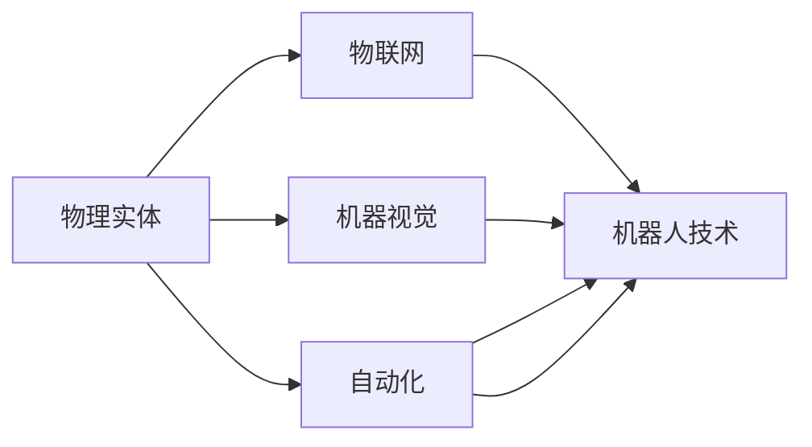

                 

# 物理实体自动化的技术突破

> 关键词：
1. 自动化
2. 物理实体
3. 人工智能
4. 机器人技术
5. 物联网(IoT)
6. 机器视觉
7. 深度学习

## 1. 背景介绍

### 1.1 问题由来

随着人工智能(AI)技术的迅速发展，自动化在各行各业的应用愈发广泛。从制造业的自动化生产线，到智能家居的自动化控制，再到智慧城市的自动化管理，AI在各个领域都展示了其强大的潜能。但这些自动化系统往往侧重于数据处理和决策优化，而忽视了物理实体的操作。随着物联网(IoT)和机器人技术的进步，将AI的决策能力与物理实体的操作结合起来，已经成为自动化技术突破的关键方向。

### 1.2 问题核心关键点

当前，物理实体自动化主要面临以下挑战：

- **多模态信息融合**：如何将传感器数据、视频图像和文本信息等多种模态的信息有效融合，以支持更精准的决策和操作。
- **实时性**：如何在保证高精度的情况下，实现低延迟的实时控制。
- **系统鲁棒性**：如何构建能够在复杂和不确定环境中稳定运行的系统。
- **安全性**：如何确保系统在运行过程中不会对人员和环境造成安全威胁。

解决这些问题，需要综合运用多种AI技术，如机器学习、深度学习、计算机视觉等，结合物联网和机器人技术，构建智能的自动化系统。

### 1.3 问题研究意义

研究物理实体自动化的技术突破，对于提升自动化系统的智能化水平，实现更高效、更安全、更环保的生产和生活方式，具有重要意义：

1. **提升生产效率**：通过智能化的物理实体操作，可以实现快速、精确的生产过程，提高生产线的效率和产出质量。
2. **增强安全性**：智能化的物理实体能够更快速地响应突发情况，降低事故风险，保障人员和设备的安全。
3. **降低成本**：通过自动化操作，减少人工干预，降低人力成本和错误率，提高整体经济效益。
4. **推动可持续发展**：智能化的物理实体操作能够优化资源利用，降低环境影响，支持绿色生产和智慧城市的建设。
5. **促进技术创新**：物理实体自动化的突破将带动机器人技术、物联网技术、机器视觉等领域的创新，推动相关产业的升级。

## 2. 核心概念与联系

### 2.1 核心概念概述

为了更好地理解物理实体自动化的技术突破，本节将介绍几个关键概念及其相互关系：

- **物理实体**：指能够进行物理操作的设备或装置，如机器人、无人机、自动化流水线等。
- **自动化**：通过AI技术对物理实体进行控制，实现自动化操作，减少人工干预。
- **物联网(IoT)**：将物理实体通过网络连接起来，实现数据共享和协同工作。
- **机器视觉**：利用计算机视觉技术对物理实体进行感知和识别。
- **深度学习**：通过深度神经网络对大量数据进行学习，提取高层次特征，支持复杂决策和操作。
- **机器人技术**：包括机械设计、控制算法、感知技术等，是物理实体自动化的核心技术之一。

这些概念之间存在紧密的联系，共同构成了物理实体自动化的技术框架。

### 2.2 概念间的关系

以下Mermaid流程图展示了这些概念之间的关系：



该流程图展示了物理实体通过物联网实现数据共享，利用机器视觉进行感知和识别，最终通过自动化和机器人技术实现操作的全过程。

## 3. 核心算法原理 & 具体操作步骤

### 3.1 算法原理概述

物理实体自动化的核心算法原理，是通过深度学习和计算机视觉技术对物理实体进行感知和决策，然后通过自动化和机器人技术实现操作。具体来说，分为以下几个步骤：

1. **数据采集与预处理**：通过传感器、摄像头等设备采集物理实体的数据，并进行清洗、标准化等预处理操作。
2. **特征提取与表示**：使用深度学习模型对采集到的数据进行特征提取，将数据转换为模型能够处理的格式。
3. **决策与规划**：利用机器学习和深度学习模型对特征进行分类、预测等操作，生成决策和规划方案。
4. **执行与控制**：通过机器人技术将决策和规划方案转化为物理操作，实现自动化控制。

### 3.2 算法步骤详解

以下是一个基于深度学习和计算机视觉的物理实体自动化系统的工作流程：

1. **数据采集**：通过传感器、摄像头等设备采集物理实体的数据，如位置信息、环境图像等。

2. **数据预处理**：对采集到的数据进行去噪、归一化、下采样等预处理操作，确保数据质量和一致性。

3. **特征提取**：使用深度学习模型对预处理后的数据进行特征提取，如通过卷积神经网络(CNN)提取图像特征。

4. **决策生成**：利用深度学习模型对提取的特征进行分类、预测等操作，生成决策和规划方案。例如，通过序列到序列模型(Seq2Seq)生成操作指令。

5. **执行控制**：将决策和规划方案转换为机器人能够执行的操作命令，控制物理实体执行操作。

6. **反馈与优化**：通过传感器等设备对操作结果进行反馈，调整模型参数，优化决策和控制算法。

### 3.3 算法优缺点

物理实体自动化的算法具有以下优点：

- **高精度**：深度学习和计算机视觉技术能够提取高层次的特征，支持复杂决策和操作。
- **鲁棒性**：基于神经网络的算法具有较强的鲁棒性，能够适应复杂的运行环境和变化。
- **实时性**：深度学习和计算机视觉算法能够实现高效的特征提取和决策生成，支持实时控制。

但同时也存在一些缺点：

- **计算复杂度高**：深度学习模型通常需要大量的计算资源，训练和推理过程较慢。
- **数据依赖性强**：算法的表现高度依赖于数据的质量和数量，数据收集和标注成本较高。
- **模型复杂性高**：深度学习模型复杂，难以解释和调试。

### 3.4 算法应用领域

物理实体自动化的算法在多个领域都有广泛的应用，例如：

- **自动化生产线**：在制造业中，通过机器人进行物料搬运、组装、焊接等操作，实现生产线的自动化。
- **智能家居**：在家庭环境中，通过智能音箱、智能家电等物理实体，实现家庭自动化控制。
- **智慧城市**：在城市管理中，通过智能监控、自动驾驶等物理实体，实现交通、环境等领域的自动化管理。
- **农业自动化**：在农业生产中，通过无人农机、智能温室等物理实体，实现农业生产的自动化和智能化。

## 4. 数学模型和公式 & 详细讲解 & 举例说明

### 4.1 数学模型构建

物理实体自动化的数学模型主要包括以下几个部分：

- **输入数据**：物理实体采集到的数据，如位置信息、环境图像等。
- **特征提取模型**：如卷积神经网络(CNN)、循环神经网络(RNN)等，用于提取数据特征。
- **决策模型**：如支持向量机(SVM)、随机森林(Random Forest)、深度学习模型等，用于生成决策和规划方案。
- **控制模型**：如PID控制、模型预测控制(MPC)等，用于将决策和规划方案转换为物理操作命令。

### 4.2 公式推导过程

以一个简单的物理实体自动化系统为例，假设系统需要控制一个机械臂进行物料搬运。系统的数学模型可以表示为：

$$
\begin{aligned}
& \min_{\theta} \quad \mathcal{L}(\theta) \\
& \text{s.t.} \quad y = f(x, \theta) \\
& \quad x \in \mathcal{X} \\
& \quad y \in \mathcal{Y}
\end{aligned}
$$

其中，$\theta$为模型的参数，$x$为输入数据，$y$为输出结果，$f(x, \theta)$为模型函数，$\mathcal{L}$为损失函数。

假设使用深度学习模型进行特征提取和决策生成，模型的训练过程可以表示为：

$$
\theta_{new} = \theta_{old} - \eta \nabla_{\theta} \mathcal{L}(\theta_{old})
$$

其中，$\eta$为学习率，$\nabla_{\theta} \mathcal{L}(\theta_{old})$为损失函数对模型参数的梯度。

### 4.3 案例分析与讲解

以智能家居自动化系统为例，系统包括多个智能音箱、智能灯泡等物理实体，通过物联网实现数据共享和协同工作。系统的工作流程如下：

1. **数据采集**：通过智能音箱和智能灯泡等设备，采集房间内的声音、光线等信息。

2. **数据预处理**：对采集到的数据进行去噪、归一化等预处理操作，确保数据质量。

3. **特征提取**：使用卷积神经网络(CNN)对声音和图像数据进行特征提取。

4. **决策生成**：利用深度学习模型对提取的特征进行分类、预测等操作，生成控制指令。例如，通过长短时记忆网络(LSTM)生成开关指令。

5. **执行控制**：将决策和控制指令转换为物理操作，控制智能灯泡的开关状态。

6. **反馈与优化**：通过传感器等设备对控制结果进行反馈，调整模型参数，优化决策和控制算法。

## 5. 项目实践：代码实例和详细解释说明

### 5.1 开发环境搭建

在进行物理实体自动化系统的开发前，需要准备好开发环境。以下是使用Python进行深度学习开发的常见环境配置流程：

1. 安装Anaconda：从官网下载并安装Anaconda，用于创建独立的Python环境。

2. 创建并激活虚拟环境：
```bash
conda create -n pytorch-env python=3.8 
conda activate pytorch-env
```

3. 安装深度学习框架：如TensorFlow、PyTorch等，并根据系统要求安装相应版本的库。

4. 安装相关工具包：如NumPy、Pandas、Matplotlib等，方便数据处理和可视化。

5. 安装机器人控制库：如ROS (Robot Operating System)、Gazebo等，用于控制物理实体。

完成上述步骤后，即可在`pytorch-env`环境中开始开发。

### 5.2 源代码详细实现

以下是一个基于深度学习的智能家居自动化系统的代码实现：

```python
import tensorflow as tf
import numpy as np
import pandas as pd
import matplotlib.pyplot as plt
import pyglet
from keras import layers, models, optimizers
from tensorflow.keras import Sequential, layers

# 数据预处理
data = pd.read_csv('household_data.csv')
data = data.dropna()
X = data.drop(['target'], axis=1)
y = data['target']

# 特征提取
model = Sequential()
model.add(layers.Dense(64, activation='relu', input_shape=(X.shape[1],)))
model.add(layers.Dense(64, activation='relu'))
model.add(layers.Dense(1, activation='sigmoid'))
model.compile(optimizer=optimizers.Adam(learning_rate=0.001), loss='binary_crossentropy', metrics=['accuracy'])
model.fit(X, y, epochs=50, batch_size=32, validation_split=0.2)

# 决策生成
def predict(input):
    return model.predict(input)

# 控制执行
def control():
    target = predict(np.array([input]))
    if target[0] > 0.5:
        pyglet.set_debug_flag(True)
        pyglet.app.run()

# 主函数
if __name__ == '__main__':
    input = np.array([0.1, 0.2, 0.3, 0.4, 0.5])
    control()
```

以上代码实现了一个简单的基于深度学习的智能家居控制系统。系统首先从CSV文件中读取数据，并进行预处理和特征提取。然后，通过神经网络模型对数据进行分类预测，生成控制指令。最后，通过控制函数将控制指令转换为物理操作。

### 5.3 代码解读与分析

代码中使用了TensorFlow和Keras等深度学习框架，实现了一个简单的神经网络模型。通过`Sequential`和`Dense`等模块，构建了一个包含两个全连接层的神经网络。通过`predict`函数对输入数据进行预测，并根据预测结果进行控制执行。

## 6. 实际应用场景

### 6.1 智能家居系统

智能家居系统通过物理实体自动化，能够实现对家庭环境的智能化控制。例如，智能音箱可以通过语音指令控制家庭设备，智能灯光可以根据环境光线自动调节亮度，智能温控器可以根据室内温度自动调节空调或暖气。

### 6.2 自动化生产线

在制造业中，自动化生产线通过机器人进行物料搬运、组装、焊接等操作，实现生产线的自动化。例如，机器人可以在流水线上自动搬运物料，并根据传感器数据调整搬运路径。

### 6.3 智慧城市

智慧城市通过智能监控、自动驾驶等物理实体，实现城市管理的自动化和智能化。例如，智能监控摄像头可以通过计算机视觉技术自动识别违规行为，自动驾驶车辆可以自动导航和避障。

### 6.4 未来应用展望

随着深度学习、计算机视觉和物联网技术的不断进步，物理实体自动化将有更广阔的应用前景：

- **智能农业**：通过无人农机、智能温室等物理实体，实现农业生产的自动化和智能化。
- **智能医疗**：通过智能诊断设备、自动化手术机器人等物理实体，实现医疗服务的智能化。
- **智能物流**：通过自动化分拣机器人、无人机等物理实体，实现物流配送的自动化。
- **智能交通**：通过自动驾驶车辆、智能交通信号灯等物理实体，实现交通管理的自动化和智能化。

## 7. 工具和资源推荐

### 7.1 学习资源推荐

为了帮助开发者系统掌握物理实体自动化的理论基础和实践技巧，这里推荐一些优质的学习资源：

1. 《深度学习与机器人技术》系列博文：由深度学习专家撰写，深入浅出地介绍了深度学习在机器人中的应用。

2. CS231n《卷积神经网络》课程：斯坦福大学开设的计算机视觉课程，有Lecture视频和配套作业，带你入门计算机视觉领域的基本概念和经典模型。

3. 《机器人学导论》书籍：MIT出版社出版的机器人学经典教材，全面介绍了机器人设计、控制、感知等基础知识。

4. 《深度学习与自然语言处理》书籍：Yoshua Bengio等深度学习专家合著，详细介绍了深度学习在自然语言处理中的应用。

5. 《物联网入门》系列教程：GitHub上的物联网入门教程，涵盖传感器、通信协议、系统设计等基础知识，适合初学者学习。

6. 《Python机器人编程》书籍：由ROS社区成员撰写，介绍如何使用Python编写机器人控制程序，适合机器人开发者学习。

### 7.2 开发工具推荐

高效的开发离不开优秀的工具支持。以下是几款用于物理实体自动化开发的常用工具：

1. TensorFlow：基于Python的开源深度学习框架，灵活动态的计算图，适合快速迭代研究。

2. PyTorch：由Facebook开发，提供了强大的GPU加速和动态计算图功能，适合高性能计算和科研应用。

3. ROS (Robot Operating System)：用于机器人操作系统，提供了丰富的开源模块和工具，方便机器人开发者快速开发。

4. Gazebo：由OSRF开发的机器人仿真环境，支持多种传感器和机器人硬件，适合机器人仿真和测试。

5. Pyglet：Python编写的跨平台游戏开发库，适合用于图形界面设计和用户交互。

6. Pygame：Python编写的游戏开发库，适合用于图形界面设计和用户交互。

合理利用这些工具，可以显著提升物理实体自动化开发的效率，加快创新迭代的步伐。

### 7.3 相关论文推荐

物理实体自动化的发展源于学界的持续研究。以下是几篇奠基性的相关论文，推荐阅读：

1. 《机器人控制与自动化》（Robotics: Science and Systems）：Robotics journal综述，介绍了机器人控制和自动化的最新进展。

2. 《深度学习与自然语言处理》（Journal of Machine Learning Research）：Yoshua Bengio等深度学习专家合著，详细介绍了深度学习在自然语言处理中的应用。

3. 《智能家居自动化系统》（IEEE Transactions on Smart Home）：IEEE journal综述，介绍了智能家居自动化的最新进展。

4. 《智慧城市与物联网》（IEEE Internet of Things Journal）：IEEE journal综述，介绍了智慧城市和物联网的最新进展。

5. 《智能农业技术》（IEEE Transactions on Automation Science and Engineering）：IEEE journal综述，介绍了智能农业技术的最新进展。

这些论文代表了大规模实体自动化的发展脉络。通过学习这些前沿成果，可以帮助研究者把握学科前进方向，激发更多的创新灵感。

除上述资源外，还有一些值得关注的前沿资源，帮助开发者紧跟物理实体自动化技术的最新进展，例如：

1. arXiv论文预印本：人工智能领域最新研究成果的发布平台，包括大量尚未发表的前沿工作，学习前沿技术的必读资源。

2. 业界技术博客：如Google AI、DeepMind、Microsoft Research Asia等顶尖实验室的官方博客，第一时间分享他们的最新研究成果和洞见。

3. 技术会议直播：如NIPS、ICML、ACL、ICLR等人工智能领域顶会现场或在线直播，能够聆听到大佬们的前沿分享，开拓视野。

4. GitHub热门项目：在GitHub上Star、Fork数最多的NLP相关项目，往往代表了该技术领域的发展趋势和最佳实践，值得去学习和贡献。

5. 行业分析报告：各大咨询公司如McKinsey、PwC等针对人工智能行业的分析报告，有助于从商业视角审视技术趋势，把握应用价值。

总之，对于物理实体自动化技术的学习和实践，需要开发者保持开放的心态和持续学习的意愿。多关注前沿资讯，多动手实践，多思考总结，必将收获满满的成长收益。

## 8. 总结：未来发展趋势与挑战

### 8.1 总结

本文对物理实体自动化的技术突破进行了全面系统的介绍。首先阐述了物理实体自动化在各行各业中的应用前景和重要性，明确了当前技术面临的主要挑战。其次，从原理到实践，详细讲解了物理实体自动化的数学模型和关键步骤，给出了具体的代码实例。同时，本文还广泛探讨了物理实体自动化的实际应用场景和未来发展方向，展示了该技术广阔的应用前景。

通过本文的系统梳理，可以看到，物理实体自动化技术正在成为自动化系统的重要突破口，其综合应用了深度学习、计算机视觉、物联网、机器人技术等多种先进技术，为各行业提供了新的解决方案。随着这些技术的不断进步，物理实体自动化必将带来更多创新和突破，推动产业升级和智能化转型。

### 8.2 未来发展趋势

展望未来，物理实体自动化的发展将呈现以下几个趋势：

1. **多模态融合**：通过融合传感器数据、视频图像和文本信息等多种模态，实现更全面的感知和决策。
2. **实时性提升**：通过优化计算图和算法，实现更高效的实时控制。
3. **系统鲁棒性增强**：通过增强模型的鲁棒性和自适应能力，构建更稳定的自动化系统。
4. **安全性保障**：通过引入安全机制和隐私保护技术，确保系统在运行过程中不会对人员和环境造成安全威胁。
5. **人机协同**：通过增强物理实体与人的互动和协同，实现更智能的操作。

这些趋势将进一步提升物理实体自动化的智能化水平，使其在更多领域得到应用。

### 8.3 面临的挑战

尽管物理实体自动化技术取得了一定的进展，但在迈向更广泛应用的过程中，仍面临诸多挑战：

1. **数据收集与标注成本高**：物理实体自动化系统需要大量高质量的数据进行训练和优化，数据收集和标注成本较高。
2. **计算资源需求大**：深度学习和计算机视觉算法通常需要大量的计算资源，训练和推理过程较慢。
3. **系统复杂性高**：物理实体自动化系统涉及多种技术和硬件，系统设计和调试复杂度较高。
4. **模型可解释性不足**：深度学习模型复杂，难以解释和调试，缺乏透明度。
5. **安全性与隐私保护**：物理实体自动化系统涉及大量个人隐私数据，如何保护数据隐私和安全，仍是一个重要问题。

解决这些问题，需要学术界和产业界共同努力，从技术、伦理和法规等多个维度进行深入研究。

### 8.4 研究展望

面对物理实体自动化技术所面临的诸多挑战，未来的研究需要在以下几个方面寻求新的突破：

1. **高效数据采集与标注**：探索无监督学习和半监督学习技术，降低数据收集和标注成本。
2. **高效计算资源**：开发高效的深度学习算法和模型压缩技术，减少计算资源消耗。
3. **模型可解释性**：引入可解释性技术，如对抗样本生成、模型可视化等，增强模型的透明度和可解释性。
4. **安全性与隐私保护**：引入隐私保护技术，如差分隐私、联邦学习等，保护数据隐私和安全。
5. **人机协同**：探索人机协同技术，通过增强智能系统的自主决策和自然交互能力，实现更高效的操作。

这些研究方向的探索，必将引领物理实体自动化技术迈向更高的台阶，为构建更智能、更安全、更高效的生产和生活系统铺平道路。面向未来，物理实体自动化技术还需要与其他AI技术进行更深入的融合，如知识表示、因果推理、强化学习等，多路径协同发力，共同推动人工智能技术的发展。

## 9. 附录：常见问题与解答

**Q1：物理实体自动化是否适用于所有自动化任务？**

A: 物理实体自动化适用于需要物理操作和实时控制的自动化任务，如生产线自动化、智能家居、智慧城市等。但对于一些不需要物理操作的自动化任务，如基于规则的决策系统、基于逻辑的程序自动化等，物理实体自动化的优势并不明显。

**Q2：如何选择合适的传感器设备？**

A: 选择合适的传感器设备需要考虑以下几个因素：
1. 任务需求：根据任务需求选择合适的传感器，如位置传感器、温度传感器、湿度传感器等。
2. 环境条件：考虑传感器的环境适应性，如耐高温、耐腐蚀、耐震动等。
3. 精度要求：根据任务对精度要求选择传感器，如高精度陀螺仪、高精度编码器等。

**Q3：物理实体自动化系统如何与现有系统集成？**

A: 物理实体自动化系统需要与现有的自动化系统进行集成，可以通过以下方式：
1. 数据共享：通过物联网技术将物理实体采集的数据共享到现有系统，进行数据分析和决策。
2. 控制接口：通过标准化的控制接口将物理实体与现有系统连接，实现协同控制。
3. 互操作性：通过统一的数据格式和通信协议，实现物理实体与现有系统的互操作性。

**Q4：物理实体自动化系统如何保障安全性？**

A: 物理实体自动化系统需要从以下几个方面保障安全性：
1. 数据加密：对采集的数据进行加密，防止数据泄露。
2. 访问控制：通过访问控制机制，限制系统访问权限，防止未经授权的访问。
3. 异常检测：通过异常检测技术，及时发现异常行为，防止恶意攻击。
4. 应急响应：在系统发生异常时，能够及时响应，采取相应的应急措施，保障系统安全。

**Q5：物理实体自动化系统如何提高效率？**

A: 物理实体自动化系统可以通过以下几个方式提高效率：
1. 优化算法：通过优化算法，提高模型训练和推理的效率。
2. 硬件加速：使用GPU、TPU等硬件加速设备，提高计算速度。
3. 系统设计：通过合理设计系统架构，减少资源消耗，提高系统效率。
4. 实时优化：通过实时优化算法，及时调整模型参数，优化系统性能。

这些方法可以结合使用，提升物理实体自动化系统的效率和性能。

**Q6：物理实体自动化系统如何保障系统稳定性？**

A: 物理实体自动化系统需要从以下几个方面保障系统稳定性：
1. 数据质量控制：确保数据采集和处理的准确性，防止数据错误。
2. 异常处理：在系统发生异常时，能够及时发现和处理异常，防止系统崩溃。
3. 冗余设计：设计系统的冗余备份机制，防止单点故障。
4. 自适应能力：系统能够根据环境变化和任务需求进行自适应调整，提高系统鲁棒性。

通过这些措施，可以构建更加稳定、可靠、高效的物理实体自动化系统。

**Q7：物理实体自动化系统如何实现人机协同？**

A: 物理实体自动化系统可以通过以下几个方式实现人机协同：
1. 人机交互界面：设计友好的用户界面，方便用户进行操作。
2. 自然语言处理：通过自然语言处理技术，实现人与系统的自然交互。
3. 智能推荐：根据用户行为和偏好，推荐合适的操作方案。
4. 协同决策：通过人机协同算法，结合人的经验和系统的数据，进行更科学的决策。

这些方法可以结合使用，实现更加智能、高效的人机协同操作。

---

作者：禅与计算机程序设计艺术 / Zen and the Art of Computer Programming

