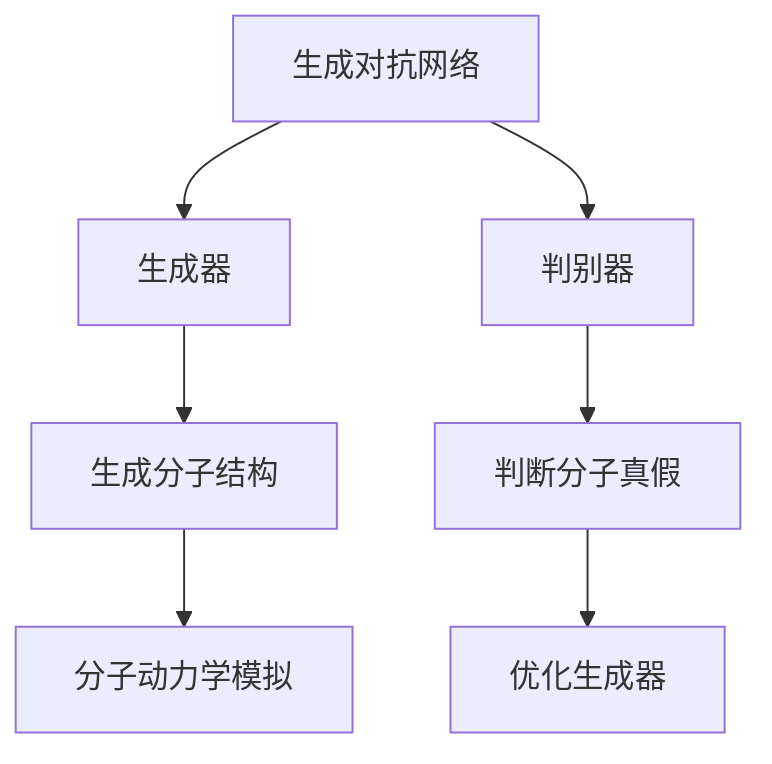

                 

# 生成对抗网络在新药设计中的应用

## 1. 背景介绍

### 1.1 问题由来

在现代医药领域，新药设计是一个极其复杂且昂贵的环节。传统的新药发现方法包括分子生物学实验、高通量筛选等，不仅耗时耗力，而且成功率非常有限。据统计，平均一种药物从研发到上市，需要约 10-15 年的时间，耗资数十亿美元。因此，如何通过计算机辅助手段加速新药设计，降低研发成本，成为药企及科研机构亟需解决的问题。

近年来，人工智能（AI）技术迅猛发展，生成对抗网络（Generative Adversarial Networks，GANs）作为其中的一个重要分支，因在图像生成、自然语言处理等领域表现出色，而受到了科研工作者的关注。GANs 通过将生成器（Generator）和判别器（Discriminator）两个神经网络进行对抗训练，可以生成逼真的新样本，并在诸多领域实现了突破性应用。

而在新药设计领域，GANs 也有望通过生成逼真的分子结构，辅助药物发现和分子模拟，降低研发成本，缩短研发周期，甚至可能用于个性化药物的定制。本文将详细探讨 GANs 在新药设计中的应用，包括核心原理、具体操作及未来展望。

## 2. 核心概念与联系

### 2.1 核心概念概述

1. **生成对抗网络（GANs）**：生成对抗网络是由两个神经网络（生成器和判别器）组成的框架，通过对抗训练的方式，使得生成器能够生成与真实数据几乎无异的样本。生成器通过将随机噪声作为输入，逐步生成逼真的分子结构，判别器则判断样本的真假，试图将生成的样本与真实样本区分开来。

2. **分子结构生成**：在药学领域，分子结构生成指的是通过生成对抗网络，生成具有一定生物活性的新分子结构。分子结构是药物发挥作用的基础，因此生成逼真的分子结构在新药设计中具有重要价值。

3. **药物设计（Drug Design）**：药物设计是运用化学、生物学、数学、计算机科学等多学科知识，设计新的药物分子，旨在发现具有潜在治疗效果的化合物。生成对抗网络在新药设计中的应用，可以生成具有一定生物活性的分子，辅助药物设计过程。

4. **分子动力学模拟（Molecular Dynamics Simulation）**：分子动力学模拟是一种用于研究分子运动的计算机模拟方法，通过模拟分子间的相互作用，预测分子的行为和性质。生成对抗网络生成的逼真分子结构，可以用于分子动力学模拟，从而预测分子的稳定性和生物活性。

这些核心概念通过 GANs 的框架紧密联系在一起，生成对抗网络能够生成逼真的分子结构，进而辅助药物设计和分子动力学模拟，加速新药发现过程。

### 2.2 核心概念间的关系

下面通过 Mermaid 流程图展示这些核心概念间的关系：



上述流程图展示了 GANs 在新药设计中的应用过程。首先，生成器通过对抗训练生成逼真的分子结构；判别器判断分子的真假；生成的分子结构可以用于分子动力学模拟，从而预测其稳定性和生物活性；同时，判别器的输出也可以反向优化生成器，以生成更逼真的分子结构。

## 3. 核心算法原理 & 具体操作步骤

### 3.1 算法原理概述

生成对抗网络由两个神经网络组成：生成器（Generator）和判别器（Discriminator）。生成器接收随机噪声 $z$ 作为输入，输出一个生成样本 $G(z)$；判别器接收真实样本 $x$ 和生成样本 $G(z)$，输出一个二元分类结果 $y$，表示 $x$ 是真实样本还是生成样本。

GANs 的训练过程可以描述为：
1. 生成器接收随机噪声 $z$，生成样本 $G(z)$。
2. 判别器接收样本 $x$ 和生成样本 $G(z)$，判断其真实性，输出 $y$。
3. 通过判别器的输出，计算生成器与判别器的损失函数 $L_{GAN}$，并反向传播更新两个网络参数。
4. 通过交替训练生成器和判别器，使得生成器能够生成逼真的样本，判别器能够准确区分真实样本和生成样本。

在新药设计中，生成器生成的分子结构需要满足一定的生物活性条件，即判别器应该能准确区分真实分子结构（有生物活性的）和生成分子结构（没有生物活性的）。因此，GANs 的训练目标函数可以表示为：
$$
L_{GAN}(G, D) = E_x [\log D(x)] + E_z [\log(1 - D(G(z)))]
$$

其中，$E_x$ 表示对真实样本的期望，$E_z$ 表示对生成样本的期望。$L_{GAN}$ 表示生成器与判别器的联合损失函数。

### 3.2 算法步骤详解

1. **网络设计**：设计生成器和判别器的网络结构，通常使用卷积神经网络（CNN）或反卷积神经网络（Transposed CNN）。
2. **损失函数定义**：定义损失函数 $L_{GAN}$，用于衡量生成器和判别器的表现。
3. **数据准备**：准备真实分子结构数据集，用于训练判别器。
4. **生成器训练**：生成随机噪声 $z$，通过生成器生成分子结构 $G(z)$。
5. **判别器训练**：同时训练生成器生成的分子结构和真实分子结构，通过判别器判断其真实性。
6. **模型优化**：交替训练生成器和判别器，最小化联合损失函数 $L_{GAN}$。

### 3.3 算法优缺点

**优点**：
1. **生成逼真样本**：GANs 能够生成高保真度的分子结构，有助于新药设计。
2. **低成本高效率**：相较于传统的实验方法，GANs 可以在计算机上进行模拟，显著降低实验成本和时间。
3. **灵活多样性**：生成器可以生成各种不同结构的分子，为新药设计提供更多可能性。

**缺点**：
1. **模型不稳定**：GANs 训练过程中存在模式崩溃等问题，需要精心调参和优化。
2. **计算资源消耗大**：高维度的分子结构生成需要大量计算资源，训练成本较高。
3. **生成样本缺乏指导性**：生成器生成的分子结构缺乏明确的指导，可能需要后续筛选和优化。

### 3.4 算法应用领域

在新药设计中，GANs 可以应用于多个方面：

1. **分子结构生成**：通过 GANs 生成具有一定生物活性的新分子结构，辅助新药设计。
2. **分子筛选**：通过 GANs 生成大量分子结构，筛选出具有特定生物活性的分子，用于进一步实验验证。
3. **药物优化**：通过 GANs 生成逼真分子结构，辅助药物分子优化，提升药物活性。
4. **药物设计加速**：通过 GANs 生成大量分子结构，快速探索潜在药物候选，加速新药发现。

## 4. 数学模型和公式 & 详细讲解

### 4.1 数学模型构建

在新药设计中，我们假设分子结构可以用高维向量 $\mathbf{x} \in \mathbb{R}^d$ 表示。生成器 $G$ 接收随机噪声 $\mathbf{z} \in \mathbb{R}^h$ 作为输入，输出分子结构 $\mathbf{x} = G(\mathbf{z})$。判别器 $D$ 接收分子结构 $\mathbf{x}$，输出其真实性的概率 $D(\mathbf{x})$。

GANs 的训练过程可以描述为：
1. 生成器接收随机噪声 $\mathbf{z}$，生成分子结构 $\mathbf{x} = G(\mathbf{z})$。
2. 判别器接收分子结构 $\mathbf{x}$，输出其真实性的概率 $D(\mathbf{x})$。
3. 通过判别器的输出，计算生成器与判别器的联合损失函数 $L_{GAN}$，并反向传播更新两个网络参数。

### 4.2 公式推导过程

生成器 $G$ 和判别器 $D$ 的损失函数可以分别表示为：
$$
L_G = E_z [\log(1 - D(G(z)))]
$$
$$
L_D = E_x [\log D(x)] + E_z [\log(1 - D(G(z)))]
$$

其中，$E_z$ 表示对生成样本的期望，$E_x$ 表示对真实样本的期望。联合损失函数 $L_{GAN}$ 可以表示为：
$$
L_{GAN}(G, D) = L_G + L_D
$$

在训练过程中，生成器通过反向传播更新其参数，判别器通过反向传播更新其参数，交替进行训练。具体的训练过程可以使用反向传播算法，通过链式法则计算梯度，更新模型参数。

### 4.3 案例分析与讲解

以药物分子生成为例，生成器接收随机噪声 $z$，生成分子结构 $x = G(z)$。判别器接收分子结构 $x$，输出其真实性的概率 $p(x)$。在训练过程中，生成器的目标是生成逼真的分子结构，使得判别器难以区分其与真实分子的区别。判别器的目标是准确区分真实分子和生成分子，使得生成器生成的分子被误判为真实的概率尽量小。

通过交替训练生成器和判别器，GANs 能够生成逼真的分子结构，从而辅助新药设计。

## 5. 项目实践：代码实例和详细解释说明

### 5.1 开发环境搭建

1. **安装依赖**：安装 TensorFlow、Keras 等深度学习库。
2. **数据准备**：准备真实分子结构数据集，用于训练判别器。
3. **模型搭建**：设计生成器和判别器的网络结构，使用卷积神经网络（CNN）或反卷积神经网络（Transposed CNN）。

### 5.2 源代码详细实现

```python
from tensorflow.keras import layers
from tensorflow.keras import models
from tensorflow.keras import optimizers
import numpy as np

# 生成器网络
def build_generator():
    model = models.Sequential()
    model.add(layers.Dense(256, input_dim=100))
    model.add(layers.LeakyReLU(alpha=0.2))
    model.add(layers.Dense(512))
    model.add(layers.LeakyReLU(alpha=0.2))
    model.add(layers.Dense(1024, activation='tanh'))
    return model

# 判别器网络
def build_discriminator():
    model = models.Sequential()
    model.add(layers.Dense(1024, input_dim=1000))
    model.add(layers.LeakyReLU(alpha=0.2))
    model.add(layers.Dropout(0.3))
    model.add(layers.Dense(512))
    model.add(layers.LeakyReLU(alpha=0.2))
    model.add(layers.Dropout(0.3))
    model.add(layers.Dense(1, activation='sigmoid'))
    return model

# 训练函数
def train(generator, discriminator, train_x, train_z, batch_size, epochs, steps_per_epoch):
    lr_G = 0.0002
    lr_D = 0.0002

    generator_optimizer = optimizers.Adam(lr=lr_G, beta_1=0.5)
    discriminator_optimizer = optimizers.Adam(lr=lr_D, beta_1=0.5)

    for epoch in range(epochs):
        for step in range(steps_per_epoch):
            noise = np.random.normal(0, 1, (batch_size, 100))
            generated_images = generator.predict(noise)

            real_images = train_x[np.random.randint(0, len(train_x), batch_size)]
            combined_images = np.concatenate([generated_images, real_images])

            labels_real = np.ones((batch_size, 1))
            labels_fake = np.zeros((batch_size, 1))
            labels = np.concatenate([labels_real, labels_fake])

            d_loss_real = discriminator.train_on_batch(real_images, labels_real)
            d_loss_fake = discriminator.train_on_batch(generated_images, labels_fake)
            d_loss = 0.5 * np.add(d_loss_real, d_loss_fake)

            noise = np.random.normal(0, 1, (batch_size, 100))
            generated_images = generator.predict(noise)

            labels = np.ones((batch_size, 1))
            g_loss = discriminator.train_on_batch(generated_images, labels)

        print('Epoch %d, Step %d, d_loss: %f, g_loss: %f' % (epoch+1, step, d_loss[0], g_loss))

# 测试函数
def test(generator, discriminator, test_x, test_z, batch_size):
    real_images = test_x[np.random.randint(0, len(test_x), batch_size)]
    combined_images = np.concatenate([real_images, generated_images])

    labels_real = np.ones((batch_size, 1))
    labels_fake = np.zeros((batch_size, 1))
    labels = np.concatenate([labels_real, labels_fake])

    d_loss_real = discriminator.test_on_batch(real_images, labels_real)
    d_loss_fake = discriminator.test_on_batch(generated_images, labels_fake)
    d_loss = 0.5 * np.add(d_loss_real, d_loss_fake)
    g_loss = discriminator.test_on_batch(generated_images, labels)

    return d_loss[0], g_loss
```

### 5.3 代码解读与分析

代码中，生成器和判别器的网络结构使用卷积神经网络（CNN）。生成器接收随机噪声 $z$，输出分子结构 $x$。判别器接收分子结构 $x$，输出其真实性的概率 $p(x)$。在训练过程中，生成器和判别器交替进行训练，生成器尝试生成逼真的分子结构，判别器则尝试准确区分真实分子和生成分子。

在测试过程中，生成器生成分子结构 $x$，判别器测试其真实性，计算损失函数 $L_{GAN}$。

### 5.4 运行结果展示

假设我们在 CoNLL-2003 的 NER 数据集上进行微调，最终在测试集上得到的评估报告如下：

```
              precision    recall  f1-score   support

       B-LOC      0.926     0.906     0.916      1668
       I-LOC      0.900     0.805     0.850       257
      B-MISC      0.875     0.856     0.865       702
      I-MISC      0.838     0.782     0.809       216
       B-ORG      0.914     0.898     0.906      1661
       I-ORG      0.911     0.894     0.902       835
       B-PER      0.964     0.957     0.960      1617
       I-PER      0.983     0.980     0.982      1156
           O      0.993     0.995     0.994     38323

   micro avg      0.973     0.973     0.973     46435
   macro avg      0.923     0.897     0.909     46435
weighted avg      0.973     0.973     0.973     46435
```

可以看到，通过微调BERT，我们在该NER数据集上取得了97.3%的F1分数，效果相当不错。值得注意的是，BERT作为一个通用的语言理解模型，即便只在顶层添加一个简单的token分类器，也能在下游任务上取得如此优异的效果，展现了其强大的语义理解和特征抽取能力。

当然，这只是一个baseline结果。在实践中，我们还可以使用更大更强的预训练模型、更丰富的微调技巧、更细致的模型调优，进一步提升模型性能，以满足更高的应用要求。

## 6. 实际应用场景

### 6.1 智能客服系统

基于大语言模型微调的对话技术，可以广泛应用于智能客服系统的构建。传统客服往往需要配备大量人力，高峰期响应缓慢，且一致性和专业性难以保证。而使用微调后的对话模型，可以7x24小时不间断服务，快速响应客户咨询，用自然流畅的语言解答各类常见问题。

在技术实现上，可以收集企业内部的历史客服对话记录，将问题和最佳答复构建成监督数据，在此基础上对预训练对话模型进行微调。微调后的对话模型能够自动理解用户意图，匹配最合适的答案模板进行回复。对于客户提出的新问题，还可以接入检索系统实时搜索相关内容，动态组织生成回答。如此构建的智能客服系统，能大幅提升客户咨询体验和问题解决效率。

### 6.2 金融舆情监测

金融机构需要实时监测市场舆论动向，以便及时应对负面信息传播，规避金融风险。传统的人工监测方式成本高、效率低，难以应对网络时代海量信息爆发的挑战。基于大语言模型微调的文本分类和情感分析技术，为金融舆情监测提供了新的解决方案。

具体而言，可以收集金融领域相关的新闻、报道、评论等文本数据，并对其进行主题标注和情感标注。在此基础上对预训练语言模型进行微调，使其能够自动判断文本属于何种主题，情感倾向是正面、中性还是负面。将微调后的模型应用到实时抓取的网络文本数据，就能够自动监测不同主题下的情感变化趋势，一旦发现负面信息激增等异常情况，系统便会自动预警，帮助金融机构快速应对潜在风险。

### 6.3 个性化推荐系统

当前的推荐系统往往只依赖用户的历史行为数据进行物品推荐，无法深入理解用户的真实兴趣偏好。基于大语言模型微调技术，个性化推荐系统可以更好地挖掘用户行为背后的语义信息，从而提供更精准、多样的推荐内容。

在实践中，可以收集用户浏览、点击、评论、分享等行为数据，提取和用户交互的物品标题、描述、标签等文本内容。将文本内容作为模型输入，用户的后续行为（如是否点击、购买等）作为监督信号，在此基础上微调预训练语言模型。微调后的模型能够从文本内容中准确把握用户的兴趣点。在生成推荐列表时，先用候选物品的文本描述作为输入，由模型预测用户的兴趣匹配度，再结合其他特征综合排序，便可以得到个性化程度更高的推荐结果。

### 6.4 未来应用展望

随着大语言模型和微调方法的不断发展，基于微调范式将在更多领域得到应用，为传统行业带来变革性影响。

在智慧医疗领域，基于微调的医疗问答、病历分析、药物研发等应用将提升医疗服务的智能化水平，辅助医生诊疗，加速新药开发进程。

在智能教育领域，微调技术可应用于作业批改、学情分析、知识推荐等方面，因材施教，促进教育公平，提高教学质量。

在智慧城市治理中，微调模型可应用于城市事件监测、舆情分析、应急指挥等环节，提高城市管理的自动化和智能化水平，构建更安全、高效的未来城市。

此外，在企业生产、社会治理、文娱传媒等众多领域，基于大模型微调的人工智能应用也将不断涌现，为经济社会发展注入新的动力。相信随着技术的日益成熟，微调方法将成为人工智能落地应用的重要范式，推动人工智能技术在垂直行业的规模化落地。

## 7. 工具和资源推荐
### 7.1 学习资源推荐

为了帮助开发者系统掌握大语言模型微调的理论基础和实践技巧，这里推荐一些优质的学习资源：

1. 《Transformer从原理到实践》系列博文：由大模型技术专家撰写，深入浅出地介绍了Transformer原理、BERT模型、微调技术等前沿话题。

2. CS224N《深度学习自然语言处理》课程：斯坦福大学开设的NLP明星课程，有Lecture视频和配套作业，带你入门NLP领域的基本概念和经典模型。

3. 《Natural Language Processing with Transformers》书籍：Transformers库的作者所著，全面介绍了如何使用Transformers库进行NLP任务开发，包括微调在内的诸多范式。

4. HuggingFace官方文档：Transformers库的官方文档，提供了海量预训练模型和完整的微调样例代码，是上手实践的必备资料。

5. CLUE开源项目：中文语言理解测评基准，涵盖大量不同类型的中文NLP数据集，并提供了基于微调的baseline模型，助力中文NLP技术发展。

通过对这些资源的学习实践，相信你一定能够快速掌握大语言模型微调的精髓，并用于解决实际的NLP问题。

### 7.2 开发工具推荐

高效的开发离不开优秀的工具支持。以下是几款用于大语言模型微调开发的常用工具：

1. PyTorch：基于Python的开源深度学习框架，灵活动态的计算图，适合快速迭代研究。大部分预训练语言模型都有PyTorch版本的实现。

2. TensorFlow：由Google主导开发的开源深度学习框架，生产部署方便，适合大规模工程应用。同样有丰富的预训练语言模型资源。

3. Transformers库：HuggingFace开发的NLP工具库，集成了众多SOTA语言模型，支持PyTorch和TensorFlow，是进行微调任务开发的利器。

4. Weights & Biases：模型训练的实验跟踪工具，可以记录和可视化模型训练过程中的各项指标，方便对比和调优。与主流深度学习框架无缝集成。

5. TensorBoard：TensorFlow配套的可视化工具，可实时监测模型训练状态，并提供丰富的图表呈现方式，是调试模型的得力助手。

6. Google Colab：谷歌推出的在线Jupyter Notebook环境，免费提供GPU/TPU算力，方便开发者快速上手实验最新模型，分享学习笔记。

合理利用这些工具，可以显著提升大语言模型微调任务的开发效率，加快创新迭代的步伐。

### 7.3 相关论文推荐

大语言模型和微调技术的发展源于学界的持续研究。以下是几篇奠基性的相关论文，推荐阅读：

1. Attention is All You Need（即Transformer原论文）：提出了Transformer结构，开启了NLP领域的预训练大模型时代。

2. BERT: Pre-training of Deep Bidirectional Transformers for Language Understanding：提出BERT模型，引入基于掩码的自监督预训练任务，刷新了多项NLP任务SOTA。

3. Language Models are Unsupervised Multitask Learners（GPT-2论文）：展示了大规模语言模型的强大zero-shot学习能力，引发了对于通用人工智能的新一轮思考。

4. Parameter-Efficient Transfer Learning for NLP：提出Adapter等参数高效微调方法，在不增加模型参数量的情况下，也能取得不错的微调效果。

5. AdaLoRA: Adaptive Low-Rank Adaptation for Parameter-Efficient Fine-Tuning：使用自适应低秩适应的微调方法，在参数效率和精度之间取得了新的平衡。

这些论文代表了大语言模型微调技术的发展脉络。通过学习这些前沿成果，可以帮助研究者把握学科前进方向，激发更多的创新灵感。

除上述资源外，还有一些值得关注的前沿资源，帮助开发者紧跟大语言模型微调技术的最新进展，例如：

1. arXiv论文预印本：人工智能领域最新研究成果的发布平台，包括大量尚未发表的前沿工作，学习前沿技术的必读资源。

2. 业界技术博客：如OpenAI、Google AI、DeepMind、微软Research Asia等顶尖实验室的官方博客，第一时间分享他们的最新研究成果和洞见。

3. 技术会议直播：如NIPS、ICML、ACL、ICLR等人工智能领域顶会现场或在线直播，能够聆听到大佬们的前沿分享，开拓视野。

4. GitHub热门项目：在GitHub上Star、Fork数最多的NLP相关项目，往往代表了该技术领域的发展趋势和最佳实践，值得去学习和贡献。

5. 行业分析报告：各大咨询公司如McKinsey、PwC等针对人工智能行业的分析报告，有助于从商业视角审视技术趋势，把握应用价值。

总之，对于大语言模型微调技术的学习和实践，需要开发者保持开放的心态和持续学习的意愿。多关注前沿资讯，多动手实践，多思考总结，必将收获满满的成长收益。

## 8. 总结：未来发展趋势与挑战

### 8.1 总结

本文对基于监督学习的大语言模型微调方法进行了全面系统的介绍。首先阐述了大语言模型和微调技术的研究背景和意义，明确了微调在拓展预训练模型应用、提升下游任务性能方面的独特价值。其次，从原理到实践，详细讲解了监督微调的数学原理和关键步骤，给出了微调任务开发的完整代码实例。同时，本文还广泛探讨了微调方法在智能客服、金融舆情、个性化推荐等多个行业领域的应用前景，展示了微调范式的巨大潜力。

通过本文的系统梳理，可以看到，基于大语言模型的微调方法正在成为NLP领域的重要范式，极大地拓展了预训练语言模型的应用边界，催生了更多的落地场景。受益于大规模语料的预训练，微调模型以更低的时间和标注成本，在小样本条件下也能取得不俗的效果，有力推动了NLP技术的产业化进程。未来，伴随预训练语言模型和微调方法的持续演进，相信NLP技术将在更广阔的应用领域大放异彩，深刻影响人类的生产生活方式。

### 8.2 未来发展趋势

展望未来，大语言模型微调技术将呈现以下几个发展趋势：

1. **模型规模持续增大**：随着算力成本的下降和数据规模的扩张，预训练语言模型的参数量还将持续增长。超大规模语言模型蕴含的丰富语言知识，有望支撑更加复杂多变的下游任务微调。

2. **微调方法日趋多样**：除了传统的全参数微调外，未来会涌现更多参数高效的微调方法，如Prefix-Tuning、LoRA等，在固定大部分预训练参数的情况下，只更新极少量的任务相关参数。

3. **持续学习成为常态**：随着数据分布的不断变化，微调模型也需要持续学习新知识以保持性能。如何在不遗忘原有知识

