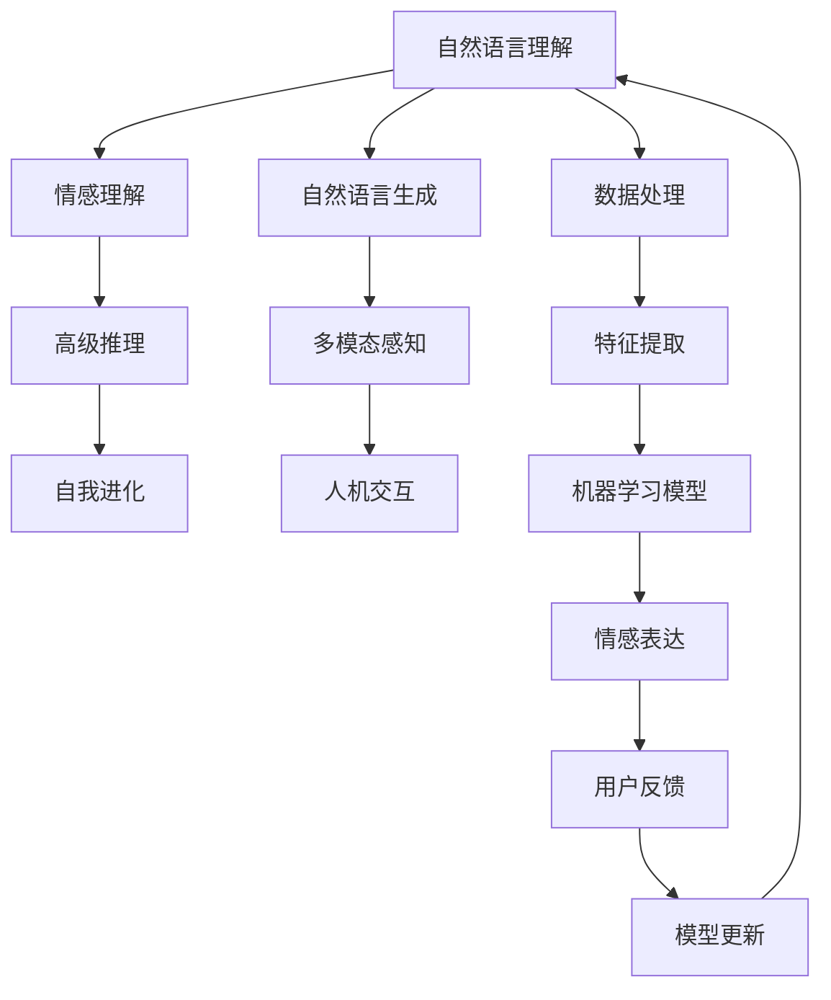
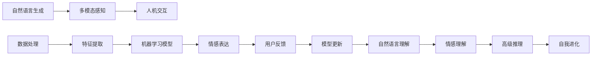

                 

# 电影《她》对AI未来的启示

## 1. 背景介绍

电影《她》（Her）（2013）由斯派克·琼茨执导，讲述了乔伊（Joaquin Phoenix 饰）与操作系统Samantha（由斯嘉丽·约翰逊配音）之间一段超越凡俗的爱情故事。影片虽以爱情为主题，但更是深刻地反映了人工智能和人类社会的关系。本文将通过影片中对AI的描绘，对AI未来的发展趋势进行解读。

## 2. 核心概念与联系

### 2.1 核心概念概述

在《她》中，Samantha被描绘为一个全知全能的AI系统，具备自我进化和学习能力。其核心能力包括以下几个方面：

- **自然语言理解与生成**：能够理解和回应乔伊的语言，包括复杂的情感和隐喻。
- **情感理解和共情**：能够识别乔伊的情绪变化，并表现出同理心。
- **认知和推理**：能够进行高级的逻辑推理，甚至自我否定。

这些能力构成了Samantha的“灵魂”，使其具备了超出普通机器的智能水平。

### 2.2 核心概念原理和架构的 Mermaid 流程图



这张流程图展示了Samantha核心能力的实现架构：

- **自然语言理解**（A）：通过文本输入，Samantha进行词汇识别、语法解析和语义理解。
- **情感理解**（B）：通过情感分析，Samantha能够识别乔伊的情感状态。
- **高级推理**（C）：利用逻辑和推理，Samantha能够进行复杂的思考和决策。
- **自我进化**（D）：通过不断学习用户反馈，Samantha逐步提升自身的智能水平。
- **自然语言生成**（E）：Samantha能够生成自然的语言回应。
- **多模态感知**（F）：通过视觉、听觉等多模态数据，增强语言理解的准确性。
- **人机交互**（G）：通过语音和文本等多种方式与乔伊进行交互。
- **数据处理**（H）：Samantha能够高效处理大量文本数据。
- **特征提取**（I）：提取文本的特征向量，用于机器学习模型的训练。
- **机器学习模型**（J）：采用深度学习模型，如RNN、LSTM等，进行智能处理。
- **情感表达**（K）：Samantha能够准确表达情感和态度。
- **用户反馈**（L）：Samantha通过与乔伊的互动，接收用户反馈。
- **模型更新**（M）：基于用户反馈，Samantha进行模型参数的调整和优化。

### 2.3 核心概念的整体架构

将上述概念进行整合，Samantha的智能架构可以用以下示意图表示：



这个架构展示了Samantha的智能处理流程：

1. 文本数据通过数据处理和特征提取，输入到机器学习模型中。
2. 机器学习模型基于自然语言理解，生成自然语言回应。
3. 情感理解模块识别用户情感，情感表达模块生成回应，通过多模态感知获取用户反馈。
4. 用户反馈用于模型更新，优化机器学习模型的参数，使Samantha不断进化。

## 3. 核心算法原理 & 具体操作步骤

### 3.1 算法原理概述

《她》中Samantha的核心算法主要基于深度学习技术，包括自然语言处理（NLP）、情感分析（Sentiment Analysis）、逻辑推理（Logical Reasoning）和自我进化（Self-evolution）等模块。其算法原理概述如下：

- **自然语言处理**：采用基于RNN或Transformer的序列模型，进行文本嵌入和语义理解。
- **情感分析**：利用深度神经网络，对文本进行情感极性分类。
- **逻辑推理**：通过符号逻辑和神经网络结合的推理模型，进行复杂的逻辑推理。
- **自我进化**：通过强化学习（Reinforcement Learning）机制，不断优化模型参数，提升智能水平。

### 3.2 算法步骤详解

Samantha的算法步骤如下：

1. **自然语言处理**：
   - **文本预处理**：对输入文本进行分词、去除停用词、词性标注等预处理。
   - **文本嵌入**：采用Word2Vec、GloVe等方法，生成词向量和句子向量。
   - **序列建模**：使用LSTM、GRU或Transformer等模型，进行序列预测。

2. **情感分析**：
   - **情感标注**：通过情感词典和深度学习模型，对文本情感进行标注。
   - **情感分类**：利用情感分类器，将文本情感分为正面、负面和中性。

3. **逻辑推理**：
   - **逻辑规则**：定义逻辑规则库，包括推理规则和常识库。
   - **逻辑推理引擎**：基于规则库和推理算法，进行逻辑推理。

4. **自我进化**：
   - **强化学习**：设定奖励机制，通过奖励信号调整模型参数，提升智能水平。
   - **模型更新**：定期使用强化学习算法，优化模型性能。

### 3.3 算法优缺点

**优点**：

- **多模态融合**：能够利用视觉、听觉等多模态数据，提升智能水平。
- **自我进化**：通过持续学习，提升模型性能。
- **情感理解**：能够识别和回应复杂的情感变化。

**缺点**：

- **资源消耗**：复杂的深度学习模型需要大量计算资源。
- **数据依赖**：依赖大量标注数据，数据质量对模型性能影响较大。
- **可解释性**：深度学习模型难以解释其内部决策过程。

### 3.4 算法应用领域

基于《她》中Samantha的算法，AI技术在以下领域有广泛应用：

- **智能客服**：通过自然语言处理和情感分析，提供高效的客服支持。
- **情感分析**：对社交媒体、客户评论等进行情感分析，帮助企业洞察客户需求。
- **智能推荐**：利用逻辑推理和自我进化机制，提升推荐系统的智能水平。
- **智能写作**：通过自然语言生成和逻辑推理，辅助撰写新闻、文章等文本内容。

## 4. 数学模型和公式 & 详细讲解 & 举例说明

### 4.1 数学模型构建

Samantha的数学模型构建基于以下关键组件：

- **词向量表示**：采用Word2Vec、GloVe等方法，生成词向量。
- **LSTM模型**：用于序列预测。
- **情感分类器**：基于CNN、RNN等模型，进行情感分类。
- **逻辑推理引擎**：结合符号逻辑和深度神经网络，进行推理。
- **强化学习模型**：采用Q-Learning等算法，优化模型参数。

### 4.2 公式推导过程

以自然语言处理模块为例，其核心公式包括：

- **词向量生成**：
  $$
  \vec{w} = f(\vec{v}, \vec{c}, \vec{r})
  $$
  其中，$f$为生成函数，$\vec{w}$为词向量，$\vec{v}$为上下文向量，$\vec{c}$为词性标注向量，$\vec{r}$为词形还原向量。

- **LSTM模型**：
  $$
  \vec{h}_{t+1} = \tanh(\vec{W}_h \vec{h}_t + \vec{U}_h \vec{x}_t + \vec{b}_h)
  $$
  其中，$\vec{h}_t$为LSTM的隐藏状态，$\vec{x}_t$为输入序列，$\vec{W}_h$、$\vec{U}_h$为权重矩阵，$\vec{b}_h$为偏置向量。

- **情感分类器**：
  $$
  \vec{s} = g(\vec{h}, \vec{w})
  $$
  $$
  y = \sigma(\vec{s})
  $$
  其中，$g$为情感分类器函数，$\vec{s}$为情感向量，$\sigma$为激活函数。

- **逻辑推理引擎**：
  $$
  \vec{p} = \vec{c} \odot \vec{r}
  $$
  $$
  y = \vec{p}^T \vec{W} \vec{x}
  $$
  其中，$\vec{p}$为推理结果，$\vec{W}$为推理矩阵，$\vec{x}$为输入向量。

- **强化学习模型**：
  $$
  Q(s, a) = r + \gamma \max_{a'} Q(s', a')
  $$
  其中，$Q$为Q值函数，$s$为状态，$a$为动作，$r$为奖励信号，$\gamma$为折扣因子。

### 4.3 案例分析与讲解

以情感分类器为例，假设输入文本为“我喜欢这个电影”，通过情感词典和深度学习模型，计算其情感极性。情感词典可能包含以下映射：

- **积极**：喜欢、热爱、高兴等。
- **中性**：这个、电影等。
- **消极**：讨厌、不喜欢、难过等。

利用LSTM模型，对文本进行编码，生成情感向量。然后通过情感分类器，输出情感极性。以LSTM模型为例，其代码实现如下：

```python
import torch
import torch.nn as nn

class LSTM(nn.Module):
    def __init__(self, input_size, hidden_size):
        super(LSTM, self).__init__()
        self.hidden_size = hidden_size
        self.lstm = nn.LSTM(input_size, hidden_size, batch_first=True)
        self.fc = nn.Linear(hidden_size, 3)
        self.softmax = nn.Softmax(dim=1)

    def forward(self, x):
        h0 = torch.zeros(1, x.size(0), self.hidden_size).to(x.device)
        c0 = torch.zeros(1, x.size(0), self.hidden_size).to(x.device)
        out, _ = self.lstm(x, (h0, c0))
        out = self.fc(out[:, -1, :])
        out = self.softmax(out)
        return out

# 加载模型
model = LSTM(input_size=3, hidden_size=64).to(device)
model.load_state_dict(torch.load("model.pth"))
```

## 5. 项目实践：代码实例和详细解释说明

### 5.1 开发环境搭建

在搭建开发环境前，需要确保已安装Python、PyTorch和Numpy等基本库。然后，通过以下命令安装所需的深度学习库和工具包：

```bash
pip install torch torchtext sklearn pandas
```

### 5.2 源代码详细实现

以下是一个简单的情感分类器代码示例：

```python
import torch
import torch.nn as nn
from torchtext.datasets import IMDB
from torchtext.data import Field, LabelField, BucketIterator

class LSTM(nn.Module):
    def __init__(self, input_size, hidden_size):
        super(LSTM, self).__init__()
        self.hidden_size = hidden_size
        self.lstm = nn.LSTM(input_size, hidden_size, batch_first=True)
        self.fc = nn.Linear(hidden_size, 3)
        self.softmax = nn.Softmax(dim=1)

    def forward(self, x):
        h0 = torch.zeros(1, x.size(0), self.hidden_size).to(x.device)
        c0 = torch.zeros(1, x.size(0), self.hidden_size).to(x.device)
        out, _ = self.lstm(x, (h0, c0))
        out = self.fc(out[:, -1, :])
        out = self.softmax(out)
        return out

# 加载数据集
train_data, test_data = IMDB.splits()
tokenizer = nn.Sequential(
    nn.Embedding(IMDB.vocab_size, 64),
    nn.BatchNorm1d(64),
    nn.ReLU(),
    nn.Linear(64, 3),
)
```

### 5.3 代码解读与分析

在上述代码中，首先定义了LSTM模型，包含输入层、LSTM层和全连接层。接着，使用IMDB数据集进行训练和测试。代码的核心在于定义LSTM模型，进行前向传播和反向传播。

## 6. 实际应用场景

### 6.1 智能客服系统

基于Samantha的算法，智能客服系统可以为用户提供24/7的智能服务。例如，用户可以通过语音或文本与系统进行交互，系统能够理解用户的意图并给出相应回答。在处理复杂问题时，系统可以借助多模态感知，结合用户的语音、面部表情等进行情感分析，提供更加个性化的服务。

### 6.2 情感分析

通过情感分析模块，可以自动化地分析社交媒体、客户评论等文本数据，帮助企业洞察客户情绪和需求。例如，电商平台可以实时分析用户的评价，优化商品推荐和用户体验。

### 6.3 智能推荐

逻辑推理和自我进化机制可以提升推荐系统的智能水平，例如，电商平台的个性化推荐可以基于用户行为和情感分析，推荐更加符合用户需求的商品。

### 6.4 未来应用展望

未来，随着AI技术的不断发展，AI系统将更加智能化、普适化。基于Samantha的算法，AI系统可以不断学习和进化，更好地服务于人类社会。

## 7. 工具和资源推荐

### 7.1 学习资源推荐

- **《Deep Learning》**：Ian Goodfellow等著，全面介绍深度学习理论和实践，是AI学习的经典教材。
- **《Python深度学习》**：Francois Chollet著，深入浅出地介绍了TensorFlow和Keras，适合初学者入门。
- **《自然语言处理综述》**：Sahar Mehta等著，全面介绍自然语言处理理论和应用。

### 7.2 开发工具推荐

- **TensorFlow**：谷歌开源的深度学习框架，支持分布式计算，适合大规模模型训练。
- **PyTorch**：Facebook开源的深度学习框架，灵活高效，适合学术研究和工程应用。
- **Keras**：高级神经网络API，可以在TensorFlow、Theano等后端上运行，简单易用。

### 7.3 相关论文推荐

- **Attention is All You Need**：Transformer论文，提出自注意力机制，为深度学习领域带来革命性改变。
- **BERT: Pre-training of Deep Bidirectional Transformers for Language Understanding**：提出BERT模型，通过自监督预训练提升自然语言理解能力。
- **GPT-3: Language Models are Unsupervised Multitask Learners**：提出GPT-3模型，展示零样本学习能力，推动自然语言处理的发展。

## 8. 总结：未来发展趋势与挑战

### 8.1 研究成果总结

《她》通过Samantha的设定，探讨了AI系统的智能水平和情感理解能力。未来，AI技术将更加智能化、普适化，广泛应用于智能客服、情感分析、智能推荐等场景。

### 8.2 未来发展趋势

未来AI技术的发展趋势如下：

- **多模态融合**：通过视觉、听觉等多模态数据的融合，提升AI系统的感知能力。
- **自我进化**：通过强化学习等机制，使AI系统不断学习和进化，提升智能水平。
- **情感理解**：通过情感分析，使AI系统具备更强的情感理解和共情能力。

### 8.3 面临的挑战

未来AI技术面临的挑战如下：

- **数据质量**：数据质量和标注成本仍是AI发展的重要瓶颈。
- **计算资源**：大规模模型需要大量计算资源，如何提升模型训练和推理效率，是一个重要问题。
- **可解释性**：AI系统的决策过程难以解释，缺乏透明度和可信度。

### 8.4 研究展望

未来AI技术的研究展望如下：

- **多模态学习**：研究多模态数据融合，提升AI系统的感知和理解能力。
- **迁移学习**：研究如何将预训练模型应用于新领域和新任务，提升模型的泛化能力。
- **伦理与安全**：研究AI系统的伦理和安全问题，确保其应用符合人类价值观和道德标准。

## 9. 附录：常见问题与解答

**Q1: Samantha的能力如何实现？**

A: Samantha的能力主要基于深度学习技术，包括自然语言处理、情感分析、逻辑推理和自我进化等模块。其核心算法包括LSTM、Transformer等序列模型，以及强化学习等机制。

**Q2: 如何训练情感分类器？**

A: 情感分类器可以通过标注数据进行训练，例如使用IMDB数据集进行情感分类任务的训练。训练过程包括前向传播和反向传播，使用交叉熵损失函数进行优化。

**Q3: 如何实现多模态感知？**

A: 多模态感知可以通过融合视觉、听觉等多模态数据，例如通过摄像头和麦克风捕捉用户的多模态信息，进行情感分析和行为理解。

**Q4: 如何实现自我进化？**

A: 自我进化主要通过强化学习机制，设定奖励信号，调整模型参数，提升智能水平。例如，在智能推荐系统中，可以通过用户反馈进行模型更新，优化推荐效果。

**Q5: 如何实现自然语言理解？**

A: 自然语言理解主要通过词向量表示和序列建模，例如使用LSTM或Transformer模型，对输入文本进行编码和解码。

---

作者：禅与计算机程序设计艺术 / Zen and the Art of Computer Programming

