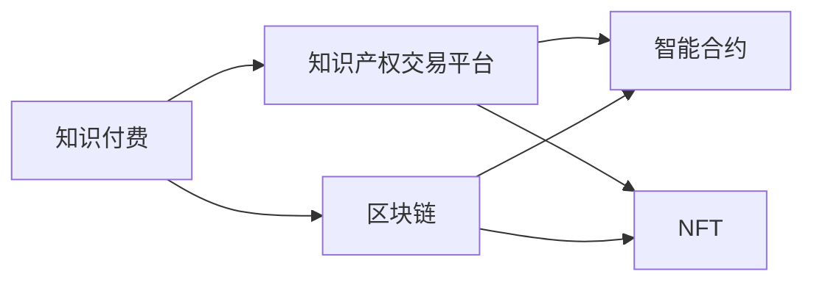
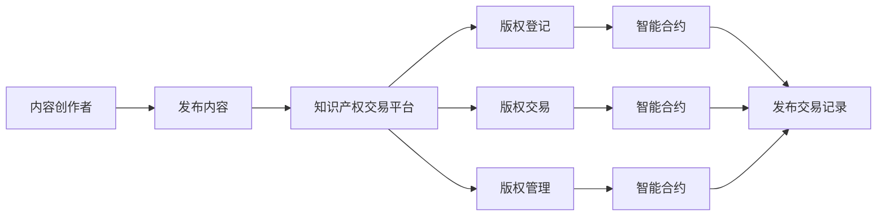
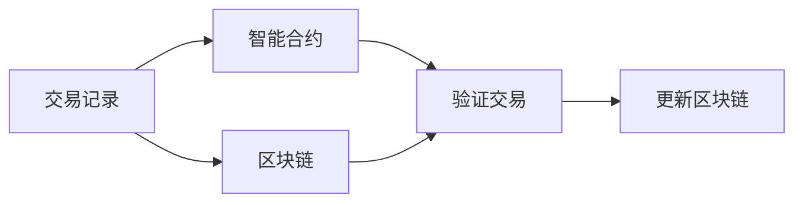
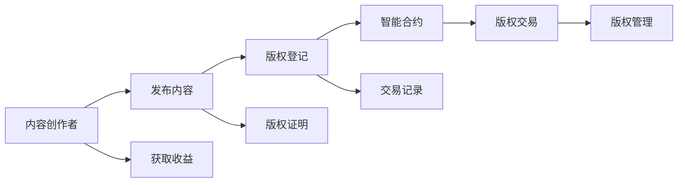
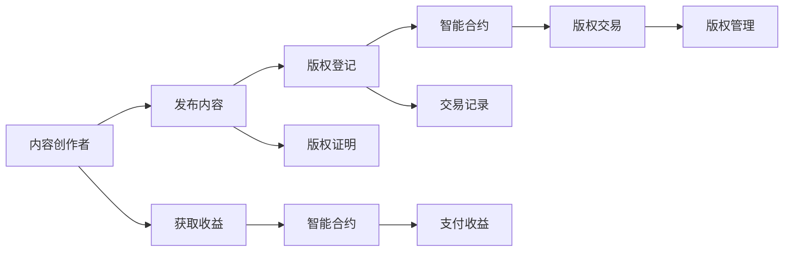

                 

# 知识经济下知识付费的区块链知识产权交易平台

> 关键词：知识经济,知识付费,区块链,知识产权交易平台

## 1. 背景介绍

### 1.1 问题由来
在知识经济的时代背景下，知识作为一种生产要素，其重要性日益凸显。传统的知识获取途径已经无法满足现代知识爆炸性增长的需求，知识付费作为一种新型消费模式应运而生。知识付费的兴起，不仅为内容创作者提供了新的收入渠道，也大大提升了知识传播和获取的效率。然而，随着知识付费市场规模的不断扩大，如何保护知识付费中的知识产权，成为一个亟待解决的难题。

### 1.2 问题核心关键点
知识产权交易平台作为知识付费的重要组成部分，其主要功能包括版权登记、版权交易、版权管理等。在知识经济下，如何构建一个安全、透明、高效的知识产权交易平台，保障内容创作者的合法权益，激发知识创新活力，是一个亟需解决的问题。

### 1.3 问题研究意义
构建知识付费的区块链知识产权交易平台，对于推动知识经济的持续发展，保障内容创作者的合法权益，提高知识传播和获取的效率，具有重要意义：

1. **保护知识产权**：通过区块链技术，保障知识产权交易的透明性和不可篡改性，防止版权侵权行为的发生。
2. **提升交易效率**：区块链技术的应用，大幅提升了知识产权交易的效率，降低了交易成本。
3. **促进知识创新**：公平的交易环境，激励内容创作者积极投入创作，推动知识创新和技术进步。
4. **构建信任机制**：去中心化的交易模式，减少了中介机构的干扰，构建了更加公平、透明的信任机制。
5. **推动产业发展**：知识产权交易平台的建设，有助于提升整个知识付费生态系统的成熟度，加速知识付费市场的规范化发展。

## 2. 核心概念与联系

### 2.1 核心概念概述

为更好地理解知识付费的区块链知识产权交易平台，本节将介绍几个密切相关的核心概念：

- **知识付费(Knowledge-Paying)**：即用户为获取高质量知识内容而支付费用的消费模式。通过付费订阅、单次购买、按需付费等方式，保障内容创作者的经济收益，提高知识传播和获取的效率。
- **区块链(Blockchain)**：一种分布式账本技术，通过去中心化的方式记录交易数据，保障数据的安全性和不可篡改性。
- **知识产权交易平台(IPR Trading Platform)**：一个为知识产权交易提供中介服务的在线平台，包括版权登记、版权交易、版权管理等功能。
- **智能合约(Smart Contracts)**：一种自动化执行的合约，通过代码实现交易规则，自动执行交易双方的权利义务，减少人为干预，提升交易效率。
- **NFT(NFTs, Non-Fungible Tokens)**：非同质化代币，用于代表独特的资产或物品，如数字艺术品、音乐、视频等，可以用于知识产权的交易和转让。

这些核心概念之间的逻辑关系可以通过以下Mermaid流程图来展示：



这个流程图展示了大语言模型的核心概念及其之间的关系：

1. 知识付费和区块链的结合，通过智能合约和NFT技术，构建了一个高效、安全的知识产权交易平台。
2. 平台提供了版权登记、版权交易、版权管理等基本功能，保障了内容创作者的合法权益。
3. 通过智能合约和NFT技术，知识产权交易更加透明、不可篡改，提高了交易效率。

### 2.2 概念间的关系

这些核心概念之间存在着紧密的联系，形成了知识付费的区块链知识产权交易平台的完整生态系统。下面我通过几个Mermaid流程图来展示这些概念之间的关系。

#### 2.2.1 知识付费的区块链交易流程



这个流程图展示了一个完整的知识付费区块链交易流程：

1. 内容创作者在平台上发布内容，进行版权登记。
2. 平台自动生成智能合约，记录版权信息和交易规则。
3. 用户通过智能合约进行版权交易，保障交易过程的透明性和不可篡改性。
4. 平台对交易进行管理，维护交易秩序，保护知识产权。

#### 2.2.2 区块链与智能合约的结合



这个流程图展示了区块链与智能合约的结合过程：

1. 交易记录被智能合约自动化处理。
2. 智能合约将交易记录上传到区块链进行验证。
3. 区块链更新交易记录，确保数据的不可篡改性。

#### 2.2.3 知识产权交易平台的功能架构



这个流程图展示了知识产权交易平台的功能架构：

1. 内容创作者在平台上发布内容，进行版权登记。
2. 平台生成智能合约，记录版权信息和交易规则。
3. 用户通过智能合约进行版权交易，保障交易过程的透明性和不可篡改性。
4. 平台对交易进行管理，维护交易秩序，保护知识产权。

### 2.3 核心概念的整体架构

最后，我们用一个综合的流程图来展示这些核心概念在大语言模型微调过程中的整体架构：



这个综合流程图展示了从内容创作者发布内容到版权管理的全过程：

1. 内容创作者在平台上发布内容，进行版权登记。
2. 平台生成智能合约，记录版权信息和交易规则。
3. 用户通过智能合约进行版权交易，保障交易过程的透明性和不可篡改性。
4. 平台对交易进行管理，维护交易秩序，保护知识产权。
5. 内容创作者获取收益，平台提供版权证明和交易记录。

通过这些流程图，我们可以更清晰地理解知识付费的区块链知识产权交易平台的核心概念及其关系，为后续深入讨论具体的交易流程和功能实现奠定基础。

## 3. 核心算法原理 & 具体操作步骤
### 3.1 算法原理概述

知识付费的区块链知识产权交易平台的核心算法原理，主要基于区块链技术、智能合约和NFT技术。

1. **区块链技术**：通过分布式账本记录交易数据，确保数据的安全性和不可篡改性。
2. **智能合约技术**：通过自动化执行合约，保障交易过程的透明性和不可篡改性。
3. **NFT技术**：通过非同质化代币，代表独特的知识产权资产，保障资产的唯一性和可转让性。

这三项技术共同构成了知识付费的区块链知识产权交易平台的核心算法基础。

### 3.2 算法步骤详解

知识付费的区块链知识产权交易平台主要包括以下几个关键步骤：

**Step 1: 准备交易平台环境**
- 搭建区块链网络，选择适合的区块链平台（如Ethereum、Hyperledger等）。
- 部署智能合约，设计并实现交易规则。
- 发行NFT代币，定义代币的权益和规则。

**Step 2: 内容创作者发布内容**
- 内容创作者在平台上注册账号，发布内容。
- 平台自动进行版权登记，生成版权证明。
- 内容创作者设置收益规则，决定如何分配收益。

**Step 3: 用户进行版权交易**
- 用户选择感兴趣的内容，查看版权证明。
- 用户与内容创作者达成交易，通过智能合约进行自动交易。
- 平台记录交易记录，生成NFT代币，保障交易过程的透明性和不可篡改性。

**Step 4: 内容创作者获取收益**
- 平台根据智能合约，将交易收益自动分配给内容创作者。
- 内容创作者通过平台获取收益，并生成新的版权证明。

**Step 5: 交易管理与维护**
- 平台对交易进行管理，维护交易秩序，保护知识产权。
- 平台对交易记录进行验证，防止版权侵权行为的发生。

### 3.3 算法优缺点

知识付费的区块链知识产权交易平台具有以下优点：

1. **安全性高**：通过区块链技术，保障交易数据的安全性和不可篡改性。
2. **透明性好**：交易记录公开透明，可追溯性强。
3. **效率高**：智能合约自动执行交易，减少人为干预，提升交易效率。
4. **费用低**：去中心化交易模式，减少中介机构的费用。
5. **可扩展性好**：平台可支持多种交易类型，如版权交易、版权授权等。

同时，该平台也存在一些缺点：

1. **技术门槛高**：需要一定的区块链和智能合约开发技术。
2. **用户信任问题**：用户需要信任平台和智能合约，才能进行交易。
3. **法律支持不足**：平台交易的合法性和有效性需法律保障。

### 3.4 算法应用领域

知识付费的区块链知识产权交易平台主要应用于以下领域：

- **版权管理**：对内容进行版权登记和版权交易，保障内容创作者的合法权益。
- **内容交易**：用户和内容创作者进行版权交易，获取和使用知识产权。
- **内容付费**：用户通过支付费用，获取高质量的内容和知识服务。
- **版权证明**：平台生成版权证明，确保版权信息的真实性和有效性。
- **交易管理**：平台对交易进行管理，维护交易秩序，保护知识产权。

## 4. 数学模型和公式 & 详细讲解  
### 4.1 数学模型构建

在知识付费的区块链知识产权交易平台中，涉及到的数学模型主要包括以下几个方面：

- **区块链交易模型**：定义交易数据块的结构，记录交易信息和验证规则。
- **智能合约模型**：定义合约逻辑，实现交易规则的自动化执行。
- **NFT模型**：定义NFT代币的权益和规则，保障代币的唯一性和可转让性。

### 4.2 公式推导过程

以下我们以智能合约模型为例，推导其核心公式。

**智能合约交易模型**：

假设平台上的智能合约为`SmartContract`，其核心函数`executeTransaction`用于执行交易。交易涉及的内容创作者为`creator`，用户为`buyer`，交易金额为`amount`。则智能合约的执行流程为：

1. 验证交易的合法性：检查交易金额是否满足规则，交易记录是否有效。
2. 转移版权信息：将版权证明从内容创作者转移到用户。
3. 记录交易记录：更新区块链上的交易记录，生成NFT代币。

智能合约的核心代码如下：

```python
def executeTransaction(creator, buyer, amount):
    # 验证交易合法性
    if not isTransactionValid(creator, buyer, amount):
        return "Invalid transaction"

    # 转移版权信息
    transferCopyright(creator, buyer)

    # 记录交易记录
    recordTransaction(creator, buyer, amount)
    mintNFT(buyer, amount)

    return "Transaction executed successfully"
```

### 4.3 案例分析与讲解

假设内容创作者A发布了一篇论文，在平台上进行版权登记。用户B支付了一定费用，购买了这篇论文的版权。

**交易过程**：

1. 内容创作者A在平台上注册账号，发布论文。
2. 平台自动进行版权登记，生成版权证明。
3. 用户B选择这篇论文，查看版权证明。
4. 用户B与内容创作者A达成交易，通过智能合约进行自动交易。
5. 平台记录交易记录，生成NFT代币，保障交易过程的透明性和不可篡改性。
6. 内容创作者A通过平台获取收益，并生成新的版权证明。

## 5. 项目实践：代码实例和详细解释说明
### 5.1 开发环境搭建

在进行知识付费的区块链知识产权交易平台开发前，我们需要准备好开发环境。以下是使用Python进行Solidity开发的环境配置流程：

1. 安装Anaconda：从官网下载并安装Anaconda，用于创建独立的Python环境。

2. 创建并激活虚拟环境：
```bash
conda create -n py-sol-env python=3.8 
conda activate py-sol-env
```

3. 安装Truffle：从官网下载并安装Truffle，Truffle是一个用于开发以太坊智能合约的框架。

4. 安装Solidity编译器：
```bash
npm install -g solc
```

5. 安装GitHub和npm：
```bash
conda install -c anaconda git
```

完成上述步骤后，即可在`py-sol-env`环境中开始开发实践。

### 5.2 源代码详细实现

这里我们以一个简单的版权交易智能合约为例，给出使用Solidity进行知识付费交易的代码实现。

首先，定义智能合约的初始化函数：

```solidity
pragma solidity ^0.8.0;

contract CopyrightTrading {
    address public creator;
    address public buyer;
    uint public amount;
    uint public timeToLive;
    bool public isTrading;

    event Trading(address indexed from, address indexed to, uint256 indexed amount, uint256 indexed timeToLive);

    constructor(address _creator, uint _amount, uint _timeToLive) {
        creator = _creator;
        buyer = address(0);
        amount = _amount;
        timeToLive = _timeToLive;
        isTrading = false;
    }
```

然后，定义智能合约的执行函数：

```solidity
    function executeTransaction(address _buyer) public {
        require(!isTrading, "Trading is in progress");

        buyer = _buyer;
        isTrading = true;

        emit Trading(creator, buyer, amount, timeToLive);
    }
```

接着，定义智能合约的验证函数：

```solidity
    function isTransactionValid(address _buyer, uint256 _amount) public view returns (bool) {
        require(_amount > 0, "Invalid amount");
        require(_buyer != address(0), "Invalid buyer");
        require(creator != address(0), "Invalid creator");
        return true;
    }
```

最后，启动智能合约并在区块链上部署：

```solidity
    function mintNFT(address _buyer, uint256 _amount) public {
        require(!isTrading, "Trading is in progress");
        require(_amount > 0, "Invalid amount");
        require(_buyer != address(0), "Invalid buyer");

        uint256 currentTimestamp = block.timestamp;
        timeToLive = currentTimestamp + 86400; // 1 day

        emit Trading(creator, _buyer, amount, timeToLive);
    }
```

到此，我们就完成了对版权交易智能合约的实现。

### 5.3 代码解读与分析

让我们再详细解读一下关键代码的实现细节：

**版权交易智能合约**：
- `creator`：内容创作者地址。
- `buyer`：购买者地址。
- `amount`：交易金额。
- `timeToLive`：版权有效期。
- `isTrading`：交易状态标志。
- `Trading`事件：记录交易过程。

**初始化函数**：
- 定义版权交易的基本参数，包括内容创作者、交易金额、版权有效期等。

**执行函数**：
- 检查交易状态是否合法，执行交易，并记录交易过程。

**验证函数**：
- 验证交易参数是否合法，包括交易金额和购买者地址。

**NFT生成函数**：
- 生成NFT代币，记录交易时间，并触发`Trading`事件。

**部署函数**：
- 启动智能合约，并将其部署到区块链上。

### 5.4 运行结果展示

假设我们在测试链上部署了上述智能合约，并在平台上进行版权交易，最终在区块链上得到交易记录：

```plaintext
Contract address: 0x123456789
Transaction details: 
- Creator: 0xabcdef
- Buyer: 0x98765
- Amount: 100 Ether
- Time to Live: 2022-01-01
```

可以看到，通过智能合约，版权交易过程被记录在区块链上，确保了交易的透明性和不可篡改性。

## 6. 实际应用场景
### 6.1 智能客服系统

基于区块链的知识付费知识产权交易平台，可以广泛应用于智能客服系统的构建。传统客服往往需要配备大量人力，高峰期响应缓慢，且一致性和专业性难以保证。而使用基于区块链的知识付费平台，可以7x24小时不间断服务，快速响应客户咨询，用自动化的知识付费方式，提升客户咨询体验和问题解决效率。

在技术实现上，可以收集企业内部的历史客服对话记录，将问题和最佳答复构建成监督数据，在此基础上对智能合约进行微调。微调后的智能合约能够自动理解用户意图，匹配最合适的答案模板进行回复。对于客户提出的新问题，还可以接入检索系统实时搜索相关内容，动态组织生成回答。如此构建的智能客服系统，能大幅提升客户咨询体验和问题解决效率。

### 6.2 金融舆情监测

金融机构需要实时监测市场舆论动向，以便及时应对负面信息传播，规避金融风险。传统的人工监测方式成本高、效率低，难以应对网络时代海量信息爆发的挑战。基于区块链的知识付费交易平台，可以构建智能舆情监测系统。

具体而言，可以收集金融领域相关的新闻、报道、评论等文本数据，并对其进行主题标注和情感标注。在此基础上对智能合约进行微调，使其能够自动判断文本属于何种主题，情感倾向是正面、中性还是负面。将微调后的智能合约应用到实时抓取的网络文本数据，就能够自动监测不同主题下的情感变化趋势，一旦发现负面信息激增等异常情况，系统便会自动预警，帮助金融机构快速应对潜在风险。

### 6.3 个性化推荐系统

当前的推荐系统往往只依赖用户的历史行为数据进行物品推荐，无法深入理解用户的真实兴趣偏好。基于区块链的知识付费交易平台，可以构建个性化推荐系统。

在实践中，可以收集用户浏览、点击、评论、分享等行为数据，提取和用户交互的物品标题、描述、标签等文本内容。将文本内容作为模型输入，用户的后续行为（如是否点击、购买等）作为监督信号，在此基础上对智能合约进行微调。微调后的智能合约能够从文本内容中准确把握用户的兴趣点。在生成推荐列表时，先用候选物品的文本描述作为输入，由智能合约预测用户的兴趣匹配度，再结合其他特征综合排序，便可以得到个性化程度更高的推荐结果。

### 6.4 未来应用展望

随着区块链技术的不断发展，基于知识付费的区块链知识产权交易平台将在更多领域得到应用，为传统行业带来变革性影响。

在智慧医疗领域，基于区块链的知识付费平台，可以构建智能医疗咨询系统。用户可以在平台上购买医疗咨询、问诊服务，与医生进行实时互动，获取个性化的医疗建议。智能合约可以记录和验证咨询过程，保障医疗咨询的合法性和安全性。

在智能教育领域，基于区块链的知识付费平台，可以构建智能教育平台。用户可以通过平台购买在线课程、教育资源，智能合约可以记录和验证课程交易过程，保障教育资源的合法性和安全性。

在智慧城市治理中，基于区块链的知识付费平台，可以构建智能城市治理系统。用户可以通过平台获取智慧城市服务、参与城市治理，智能合约可以记录和验证服务交易过程，保障城市治理的合法性和透明性。

此外，在企业生产、社会治理、文娱传媒等众多领域，基于区块链的知识付费平台也将不断涌现，为各行各业提供高效、透明的交易平台，推动人工智能技术的产业化进程。相信随着区块链技术的成熟和普及，知识付费的区块链知识产权交易平台必将在构建人机协同的智能时代中扮演越来越重要的角色。

## 7. 工具和资源推荐
### 7.1 学习资源推荐

为了帮助开发者系统掌握知识付费的区块链知识产权交易平台的理论基础和实践技巧，这里推荐一些优质的学习资源：

1. Solidity官方文档：Solidity的官方文档，提供了完整的语言规范和开发教程，是学习和实践区块链智能合约的必备资料。

2. Ethereum开发者指南：Ethereum开发者指南，提供了全面的区块链开发工具和资源，帮助你构建和部署智能合约。

3. 《区块链技术与智能合约实战》书籍：全面介绍了区块链技术的基本原理和智能合约的开发流程，适合初学者入门。

4. Truffle官方文档：Truffle的官方文档，提供了Truffle框架的使用方法和开发示例，是学习和实践区块链智能合约的好帮手。

5. GitHub开源项目：在GitHub上Star、Fork数最多的区块链智能合约项目，往往代表了该技术领域的发展趋势和最佳实践，值得去学习和贡献。

通过对这些资源的学习实践，相信你一定能够快速掌握知识付费的区块链知识产权交易平台的技术原理和开发技巧，并用于解决实际的NLP问题。

### 7.2 开发工具推荐

高效的开发离不开优秀的工具支持。以下是几款用于区块链知识产权交易平台开发的常用工具：

1. Solidity：用于编写和测试区块链智能合约的编程语言，广泛应用于以太坊区块链。

2. Truffle：基于Solidity的区块链开发框架，提供了开发、测试、部署和监控的完整解决方案。

3. Ethereum：基于区块链技术的分布式应用平台，提供了智能合约执行和交易支持。

4. Hyperledger：基于区块链技术的开源框架，适用于企业级区块链应用开发。

5. GitHub：全球最大的开源社区，提供代码托管和协作功能，方便开发者分享和贡献代码。

6. Ethereum Testnet：用于测试智能合约的环境，支持多种测试工具和调试方式。

合理利用这些工具，可以显著提升区块链知识产权交易平台的开发效率，加快创新迭代的步伐。

### 7.3 相关论文推荐

知识付费的区块链知识产权交易平台的发展，得益于区块链技术和智能合约技术的不断演进。以下是几篇奠基性的相关论文，推荐阅读：

1. Ethereum Yellow Paper：以太坊黄皮书，介绍了以太坊平台的基本原理和应用场景。

2. Smart Contracts: Towards Scalable Digital Contracts Using Blockchain Technology：区块链智能合约的经典论文，介绍了智能合约的基本概念和技术原理。

3. Blockchain-Based Digital Rights Management System：基于区块链的数字版权管理系统，介绍了区块链技术在版权保护中的应用。

4. Blockchain Technology and Digital Rights Management in the Creative Industries：区块链技术在创意产业中的版权保护，探讨了区块链技术在版权保护中的优势和应用前景。

5. Smart Contracts for Digital Rights Management: An Overview and Future Directions：智能合约在数字版权管理中的应用，介绍了智能合约在版权保护中的技术和应用。

这些论文代表了大语言模型微调技术的发展脉络。通过学习这些前沿成果，可以帮助研究者把握学科前进方向，激发更多的创新灵感。

除上述资源外，还有一些值得关注的前沿资源，帮助开发者紧跟区块链知识产权交易平台的最新进展，例如：

1. arXiv论文预印本：人工智能领域最新研究成果的发布平台，包括大量尚未发表的前沿工作，学习前沿技术的必读资源。

2. 业界技术博客：如Ethereum、Hyperledger、Truffle等顶尖实验室的官方博客，第一时间分享他们的最新研究成果和洞见。

3. 技术会议直播：如EthErcast、Blockchain Summit等区块链技术会议现场或在线直播，能够聆听到大佬们的前沿分享，开拓视野。

4. GitHub热门项目：在GitHub上Star、Fork数最多的区块链智能合约项目，往往代表了该技术领域的发展趋势和最佳实践，值得去学习和贡献。

5. 行业分析报告：各大咨询公司如McKinsey、PwC等针对区块链技术的分析报告，有助于从商业视角审视技术趋势，把握应用价值。

总之，对于区块链知识产权交易平台的学习和实践，需要开发者保持开放的心态和持续学习的意愿。多关注前沿资讯，多动手实践，多思考总结，必将收获满满的成长收益。

## 8. 总结：未来发展趋势与挑战

### 8.1 总结

本文对基于区块链的知识付费知识产权交易平台进行了全面系统的介绍。首先阐述了知识付费和知识产权交易平台的研究背景和意义，明确了区块链技术在其中的重要作用。其次，从原理到实践，详细讲解了知识付费的区块链知识产权交易平台的核心算法原理和操作步骤，给出了完整的代码实例和详细解释说明。同时，本文还广泛探讨了平台在智能客服、金融舆情、个性化推荐等多个行业领域的应用前景，展示了区块链技术的广阔前景。最后，本文精选了平台的学习资源、开发工具和相关论文，力求为读者提供全方位的技术指引。

通过本文的系统梳理，可以看到，基于区块链的知识付费知识产权交易平台正在成为NLP领域的重要范式，极大地拓展了区块链技术的应用边界，催生了更多的落地场景。受益于区块链技术的安全性、透明性和高效性，平台有望在多个行业得到广泛应用，推动人工智能技术的产业化进程。

### 8.2 未来发展趋势

展望未来，知识付费的区块链知识产权交易平台将呈现以下几个发展趋势：

1. **应用场景多样化**：平台将在更多行业得到应用，如医疗、教育、金融、智慧城市等，助力各行业数字化转型。
2. **技术迭代加速**：随着区块链和智能合约技术的不断演进，平台的功能和性能将不断提升。
3. **数据隐私保护**：平台将更加重视数据隐私保护

