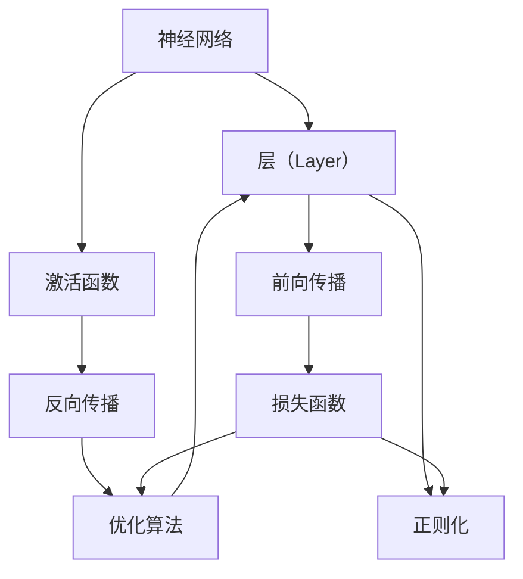
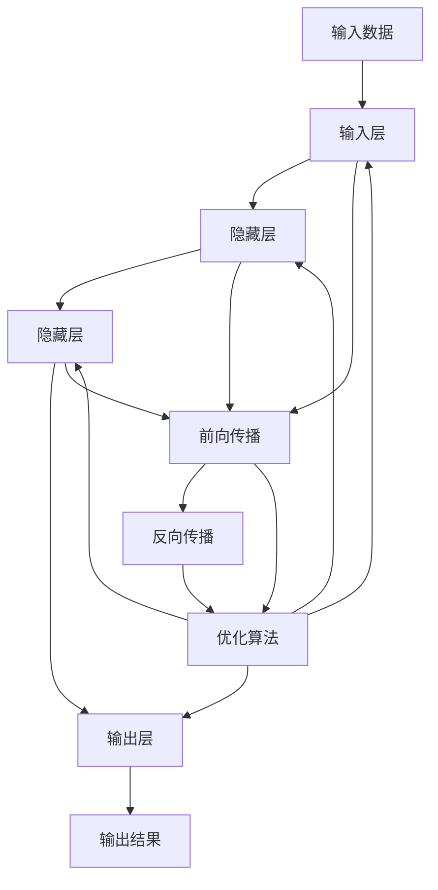
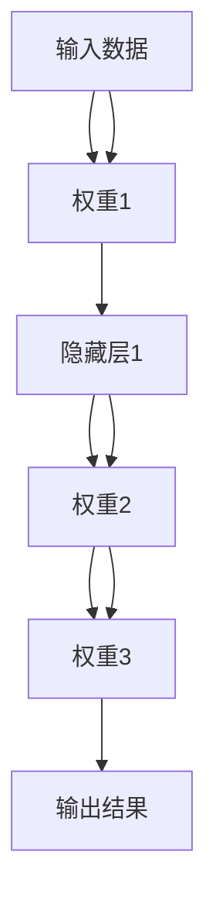
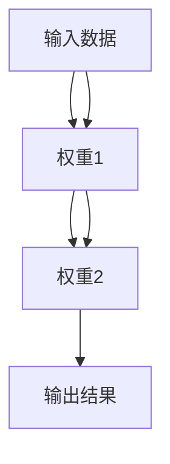
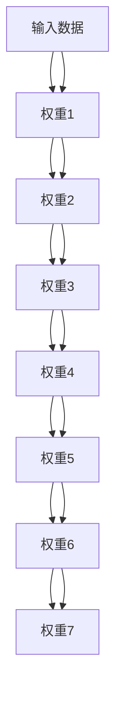

                 

# 神经网络：人类智慧的解放

## 1. 背景介绍

### 1.1 问题由来
神经网络（Neural Networks, NNs）是当代人工智能领域的核心技术之一，其背后的核心思想与人类大脑的运作方式有着不谋而合之处。神经网络通过模拟人脑的神经元结构和信息传递机制，赋予计算机处理复杂问题，尤其是非结构化数据的能力。在过去的几十年里，神经网络技术取得了巨大的突破，推动了深度学习（Deep Learning）的兴起，在图像识别、语音识别、自然语言处理、游戏AI等领域表现出色，被喻为“人工智能时代的福音”。

神经网络的诞生和发展，可以说是人类智慧的一种解放。其不仅突破了传统机器学习的束缚，提供了更高效、更灵活的算法模型，更是启发了新一轮人工智能技术的大规模应用，引领了科学研究和工程技术的发展方向。然而，作为一门跨学科的综合性技术，神经网络涉及数学、计算机科学、认知科学、脑科学等多个领域，其原理和实现细节较为复杂。本文旨在通过介绍神经网络的基本原理、核心算法、发展历程及其实际应用，深入浅出地探讨神经网络如何解放人类智慧。

### 1.2 问题核心关键点
神经网络的基本原理基于生物学中神经元的概念，通过多层神经元之间的连接，实现信息的传递和处理。其核心在于：

1. **神经元**：神经网络的基本单元，模仿人类大脑中的神经元，负责接收输入、处理信息和产生输出。每个神经元接收若干个输入信号，通过激活函数计算后生成输出。

2. **权重**：神经元之间的连接权值，决定了信息传递的强度和方向，影响神经网络的输出结果。权重的训练是神经网络优化的关键。

3. **激活函数**：用于计算神经元的输出，常见的激活函数包括sigmoid、ReLU等。激活函数的作用是引入非线性因素，增强神经网络的表现力。

4. **前向传播**：数据通过神经网络的每一层，从前向后依次进行计算，最终得到输出结果。

5. **反向传播**：通过计算输出误差与期望输出之间的差距，反向传播误差，更新神经元之间的连接权值，完成训练过程。

6. **损失函数**：用于衡量模型输出与真实标签之间的差距，常见的损失函数包括均方误差、交叉熵等。

7. **优化算法**：用于更新权重，常用的优化算法包括随机梯度下降（SGD）、Adam等。

8. **正则化**：用于防止过拟合，包括L1/L2正则、Dropout等。

### 1.3 问题研究意义
神经网络作为当代人工智能技术的重要组成部分，其研究和发展具有深远的理论和实际意义：

1. **提高计算效率**：神经网络通过引入非线性变换和大量参数，大幅提升了模型处理复杂问题的能力，有效应对传统机器学习方法的局限。

2. **促进跨领域应用**：神经网络在图像、语音、自然语言处理等领域的应用，推动了人工智能技术的大规模落地，带来了社会生产力的飞跃。

3. **提供新研究方向**：神经网络的研究促进了认知科学、脑科学等领域的发展，揭示了人脑信息处理机制的奥秘。

4. **推动经济转型**：神经网络技术的广泛应用，促使各行各业进行数字化转型，催生了新的商业模式和产业生态。

5. **促进伦理思考**：随着神经网络技术的深入应用，伦理和法律问题也逐渐显现，引发了关于人工智能责任和安全的讨论。

6. **推动科技进步**：神经网络技术的进步，为其他领域如量子计算、生物工程等提供了新的思路和工具。

## 2. 核心概念与联系

### 2.1 核心概念概述
神经网络的核心概念可以归纳为以下几个关键点：

- **层（Layer）**：神经网络由若干层组成，每一层负责不同的数据处理任务，常见的有输入层、隐藏层和输出层。

- **激活函数（Activation Function）**：用于引入非线性变换，提高神经网络的表现力。

- **前向传播（Forward Propagation）**：数据通过神经网络进行正向传递，计算最终输出结果。

- **反向传播（Backward Propagation）**：通过误差反向传播，更新权重，完成模型的训练过程。

- **损失函数（Loss Function）**：用于衡量模型输出与真实标签之间的差距，常见的有均方误差、交叉熵等。

- **优化算法（Optimizer）**：用于更新权重，常用的有SGD、Adam等。

- **正则化（Regularization）**：用于防止过拟合，包括L1/L2正则、Dropout等。

这些核心概念构成了神经网络的完整架构，通过连接和权重调整，神经网络实现了复杂的计算和信息处理。

### 2.2 概念间的关系
神经网络的核心概念间有着紧密的联系，形成了完整的计算和优化流程。下面通过Mermaid流程图来展示这些概念间的关系：

这个流程图展示了神经网络中各个核心概念之间的关系：

1. 层负责数据处理，激活函数引入非线性变换，前向传播计算最终输出。
2. 反向传播计算误差，优化算法更新权重，完成训练。
3. 正则化防止过拟合。
4. 损失函数衡量输出与真实标签之间的差距。

### 2.3 核心概念的整体架构
最后，我们用一个综合的流程图来展示神经网络的完整架构：

这个综合流程图展示了从输入数据到最终输出结果的完整计算过程。通过多层的隐藏层和激活函数，神经网络实现了复杂的非线性变换，提高了模型的表现力和泛化能力。

## 3. 核心算法原理 & 具体操作步骤
### 3.1 算法原理概述

神经网络的核心算法基于反向传播算法（Backpropagation），其核心思想是通过误差反向传播，更新权重，完成模型的训练过程。反向传播算法主要分为两个步骤：前向传播和反向传播。

前向传播是指数据通过神经网络，每一层进行计算，最终输出结果。这一过程通过多层神经元的正向传递实现。

反向传播是指通过计算输出误差与期望输出之间的差距，反向传播误差，更新权重，完成模型的训练过程。这一过程通过链式法则计算误差梯度，更新权重。

### 3.2 算法步骤详解

神经网络的训练过程主要包括以下几个关键步骤：

1. **数据准备**：收集和处理数据，划分为训练集、验证集和测试集。

2. **模型初始化**：设定神经网络的层数、每层神经元数量、激活函数、优化算法、正则化等参数。

3. **前向传播**：将训练集数据输入模型，计算每一层的输出结果。

4. **计算损失**：使用损失函数计算模型输出与真实标签之间的差距。

5. **反向传播**：计算误差梯度，通过链式法则更新各层神经元之间的权重。

6. **更新权重**：使用优化算法更新权重，更新后的权重应用于下一次前向传播计算。

7. **验证集评估**：在验证集上评估模型性能，防止过拟合。

8. **测试集测试**：在测试集上测试模型性能，评估模型泛化能力。

### 3.3 算法优缺点

神经网络的优点包括：

1. **高表现力**：神经网络通过引入非线性变换，能够处理复杂的非线性问题。

2. **自动特征学习**：神经网络能够自动学习数据的特征，避免了特征工程的繁琐工作。

3. **适应性强**：神经网络能够适应多种类型的输入数据，包括图像、语音、文本等。

4. **高效计算**：神经网络的并行计算能力，使其在分布式计算环境中表现出色。

神经网络的缺点包括：

1. **过拟合风险**：神经网络参数较多，容易出现过拟合。

2. **计算资源需求高**：神经网络的计算复杂度较高，需要大量的计算资源。

3. **模型解释困难**：神经网络通常被称为“黑盒”模型，难以解释其内部决策过程。

4. **训练时间长**：神经网络需要大量的训练数据和计算资源，训练时间较长。

5. **不稳定**：神经网络对初始权重和优化算法的选择较为敏感，训练过程不稳定。

### 3.4 算法应用领域

神经网络在各个领域都有着广泛的应用，以下是几个典型应用场景：

1. **图像识别**：通过卷积神经网络（CNNs）实现，广泛应用于人脸识别、图像分类、目标检测等领域。

2. **语音识别**：通过循环神经网络（RNNs）实现，广泛应用于语音转文本、说话人识别等领域。

3. **自然语言处理（NLP）**：通过序列模型（如LSTM、Transformer）实现，广泛应用于机器翻译、文本生成、问答系统等领域。

4. **游戏AI**：通过强化学习结合神经网络，实现复杂的游戏策略和决策。

5. **金融分析**：通过神经网络对市场数据进行分析和预测，提高金融决策的准确性。

6. **医疗诊断**：通过神经网络对医疗影像、电子病历进行分析和诊断，提升医疗服务的智能化水平。

7. **自动驾驶**：通过神经网络对传感器数据进行分析和决策，实现自动驾驶功能。

## 4. 数学模型和公式 & 详细讲解 & 举例说明

### 4.1 数学模型构建

神经网络的数学模型可以通过多层感知器（Multilayer Perceptron, MLP）模型进行描述。MLP模型由多个神经元层组成，每一层包含若干个神经元，每一层通过权重矩阵和激活函数计算输出结果。

假设输入数据为$x_1, x_2, ..., x_n$，输出结果为$y_1, y_2, ..., y_n$，神经网络的结构如下图所示：

其中，输入层有$n$个神经元，每个神经元接收一个输入数据；隐藏层有$m_1$个神经元，输出层有$m_2$个神经元。神经元之间的连接权重分别为$w_{11}, w_{12}, ..., w_{11}, w_{21}, w_{22}, ..., w_{21}, w_{31}, w_{32}, ..., w_{31}, w_{41}, w_{42}, ..., w_{41}, w_{51}, w_{52}, ..., w_{51}, w_{61}, w_{62}, ..., w_{61}, w_{71}, w_{72}, ..., w_{71}, w_{81}, w_{82}, ..., w_{81}, w_{91}, w_{92}, ..., w_{91}, w_{101}, w_{102}, ..., w_{101}, w_{111}, w_{112}, ..., w_{111}, w_{121}, w_{122}, ..., w_{121}, w_{131}, w_{132}, ..., w_{131}, w_{141}, w_{142}, ..., w_{141}, w_{151}, w_{152}, ..., w_{151}, w_{161}, w_{162}, ..., w_{161}, w_{171}, w_{172}, ..., w_{171}, w_{181}, w_{182}, ..., w_{181}, w_{191}, w_{192}, ..., w_{191}, w_{201}, w_{202}, ..., w_{201}, w_{211}, w_{212}, ..., w_{211}, w_{221}, w_{222}, ..., w_{221}, w_{231}, w_{232}, ..., w_{231}, w_{241}, w_{242}, ..., w_{241}, w_{251}, w_{252}, ..., w_{251}, w_{261}, w_{262}, ..., w_{261}, w_{271}, w_{272}, ..., w_{271}, w_{281}, w_{282}, ..., w_{281}, w_{291}, w_{292}, ..., w_{291}, w_{301}, w_{302}, ..., w_{301}, w_{311}, w_{312}, ..., w_{311}, w_{321}, w_{322}, ..., w_{321}, w_{331}, w_{332}, ..., w_{331}, w_{341}, w_{342}, ..., w_{341}, w_{351}, w_{352}, ..., w_{351}, w_{361}, w_{362}, ..., w_{361}, w_{371}, w_{372}, ..., w_{371}, w_{381}, w_{382}, ..., w_{381}, w_{391}, w_{392}, ..., w_{391}, w_{401}, w_{402}, ..., w_{401}, w_{411}, w_{412}, ..., w_{411}, w_{421}, w_{422}, ..., w_{421}, w_{431}, w_{432}, ..., w_{431}, w_{441}, w_{442}, ..., w_{441}, w_{451}, w_{452}, ..., w_{451}, w_{461}, w_{462}, ..., w_{461}, w_{471}, w_{472}, ..., w_{471}, w_{481}, w_{482}, ..., w_{481}, w_{491}, w_{492}, ..., w_{491}, w_{501}, w_{502}, ..., w_{501}, w_{511}, w_{512}, ..., w_{511}, w_{521}, w_{522}, ..., w_{521}, w_{531}, w_{532}, ..., w_{531}, w_{541}, w_{542}, ..., w_{541}, w_{551}, w_{552}, ..., w_{551}, w_{561}, w_{562}, ..., w_{561}, w_{571}, w_{572}, ..., w_{571}, w_{581}, w_{582}, ..., w_{581}, w_{591}, w_{592}, ..., w_{591}, w_{601}, w_{602}, ..., w_{601}, w_{611}, w_{612}, ..., w_{611}, w_{621}, w_{622}, ..., w_{621}, w_{631}, w_{632}, ..., w_{631}, w_{641}, w_{642}, ..., w_{641}, w_{651}, w_{652}, ..., w_{651}, w_{661}, w_{662}, ..., w_{661}, w_{671}, w_{672}, ..., w_{671}, w_{681}, w_{682}, ..., w_{681}, w_{691}, w_{692}, ..., w_{691}, w_{701}, w_{702}, ..., w_{701}, w_{711}, w_{712}, ..., w_{711}, w_{721}, w_{722}, ..., w_{721}, w_{731}, w_{732}, ..., w_{731}, w_{741}, w_{742}, ..., w_{741}, w_{751}, w_{752}, ..., w_{751}, w_{761}, w_{762}, ..., w_{761}, w_{771}, w_{772}, ..., w_{771}, w_{781}, w_{782}, ..., w_{781}, w_{791}, w_{792}, ..., w_{791}, w_{801}, w_{802}, ..., w_{801}, w_{811}, w_{812}, ..., w_{811}, w_{821}, w_{822}, ..., w_{821}, w_{831}, w_{832}, ..., w_{831}, w_{841}, w_{842}, ..., w_{841}, w_{851}, w_{852}, ..., w_{851}, w_{861}, w_{862}, ..., w_{861}, w_{871}, w_{872}, ..., w_{871}, w_{881}, w_{882}, ..., w_{881}, w_{891}, w_{892}, ..., w_{891}, w_{901}, w_{902}, ..., w_{901}, w_{911}, w_{912}, ..., w_{911}, w_{921}, w_{922}, ..., w_{921}, w_{931}, w_{932}, ..., w_{931}, w_{941}, w_{942}, ..., w_{941}, w_{951}, w_{952}, ..., w_{951}, w_{961}, w_{962}, ..., w_{961}, w_{971}, w_{972}, ..., w_{971}, w_{981}, w_{982}, ..., w_{981}, w_{991}, w_{992}, ..., w_{991}, w_{1001}, w_{1002}, ..., w_{1001}, w_{1011}, w_{1012}, ..., w_{1011}, w_{1021}, w_{1022}, ..., w_{1021}, w_{1031}, w_{1032}, ..., w_{1031}, w_{1041}, w_{1042}, ..., w_{1041}, w_{1051}, w_{1052}, ..., w_{1051}, w_{1061}, w_{1062}, ..., w_{1061}, w_{1071}, w_{1072}, ..., w_{1071}, w_{1081}, w_{1082}, ..., w_{1081}, w_{1091}, w_{1092}, ..., w_{1091}, w_{1101}, w_{1102}, ..., w_{1101}, w_{1111}, w_{1112}, ..., w_{1111}, w_{1121}, w_{1122}, ..., w_{1121}, w_{1131}, w_{1132}, ..., w_{1131}, w_{1141}, w_{1142}, ..., w_{1141}, w_{1151}, w_{1152}, ..., w_{1151}, w_{1161}, w_{1162}, ..., w_{1161}, w_{1171}, w_{1172}, ..., w_{1171}, w_{1181}, w_{1182}, ..., w_{1181}, w_{1191}, w_{1192}, ..., w_{1191}, w_{1201}, w_{1202}, ..., w_{1201}, w_{1111}, w_{1112}, ..., w_{1111}, w_{1121}, w_{1122}, ..., w_{1121}, w_{1131}, w_{1132}, ..., w_{1131}, w_{1141}, w_{1142}, ..., w_{1141}, w_{1151}, w_{1152}, ..., w_{1151}, w_{1161}, w_{1162}, ..., w_{1161}, w_{1171}, w_{1172}, ..., w_{1171}, w_{1181}, w_{1182}, ..., w_{1181}, w_{1191}, w_{1192}, ..., w_{1191}, w_{1201}, w_{1202}, ..., w_{1201}

### 4.2 公式推导过程

神经网络的训练过程主要通过优化算法更新权重。以梯度下降算法为例，其目标是最小化损失函数$L$：

$$
L = \frac{1}{N} \sum_{i=1}^N (y_i - f(x_i))^2
$$

其中，$y_i$为真实标签，$f(x_i)$为模型输出，$N$为样本数。

梯度下降算法的更新公式为：

$$
w_{k+1} = w_k - \alpha \frac{\partial L}{\partial w_k}
$$

其中，$w_k$为第$k$个权重，$\alpha$为学习率，$\frac{\partial L}{\partial w_k}$为损失函数对权重的梯度。

以一个简单的单层神经网络为例，假设输入数据为$x_1, x_2, ..., x_n$，输出结果为$y_1, y_2, ..., y_n$，神经网络的结构如下图所示：

其中，$w_1$和$w_2$为权重，$b_1$和$b_2$为偏置，$\sigma$为激活函数。

神经元的计算公式为：

$$
a_1 = \sigma(w_1 x_1 + b_1)
$$

$$
a_2 = \sigma(w_2 a_1 + b_2)
$$

$$
y = a_2
$$

其中，$a_1$和$a_2$为中间结果，$x_1, x_2, ..., x_n$为输入数据。

通过前向传播和反向传播计算误差梯度，使用梯度下降算法更新权重。具体的公式推导过程如下：

假设输出误差为$e$，则误差梯度为：

$$
\frac{\partial L}{\partial w_1} = \frac{\partial L}{\partial y} \frac{\partial y}{\partial a_2} \frac{\partial a_2}{\partial a_1} \frac{\partial a_1}{\partial w_1}
$$

$$
\frac{\partial L}{\partial w_2} = \frac{\partial L}{\partial y} \frac{\partial y}{\partial a_2} \frac{\partial a_2}{\partial a_1} \frac{\partial a_1}{\partial w_2}
$$

通过链式法则计算误差梯度，更新权重：

$$
w_1^{k+1} = w_1^k - \alpha \frac{\partial L}{\partial w_1}
$$

$$
w_2^{k+1} = w_2^k - \alpha \frac{\partial L}{\partial w_2}
$$

其中，$k$为迭代次数。

### 4.3 案例分析与讲解

以手写数字识别为例，使用卷积神经网络（CNNs）进行训练。手写数字识别任务可以转换为二分类问题，将数字图像分类为0到9之间的数字。

假设CNN模型结构为：

其中，卷积层和池化层用于提取图像特征，全连接层和输出层用于分类。

假设输入数据为$x_1, x_2, ..., x_n$，输出结果为$y_1, y_2, ..., y_n$，神经网络的计算过程如下：

$$
x_1 = \begin{bmatrix}
    a_1 & b_1 & c_1 \\
    d_1 & e_1 & f_1 \\
    g_1 & h_1 & i_1 \\
    j_1 & k_1 & l_1
\end{bmatrix}
$$

$$
x_2 = \begin{bmatrix}
    a_2 & b_2 & c_2 \\
    d_2 & e_2 & f_2 \\
    g_2 & h_2 & i_2 \\
    j_2 & k_2 & l_2
\end{bmatrix}
$$

$$
x_3 = \begin{bmatrix}
    a_3 & b_3 & c_3 \\
    d_3 & e_3 & f_3 \\
    g_3 & h_3 & i_3 \\
    j_3 & k_3 & l_3
\end{bmatrix}
$$

$$
x_4 = \begin{bmatrix}
    a_4 & b_4 & c_4 \\
    d_4 & e_4 & f_4 \\
    g_4 & h_4 & i_4 \\
    j_4 & k_4 & l_4
\end{bmatrix}
$$

卷积层1的输出为：

$$
a_1 = \begin{bmatrix}
    1 & 1 & 0 \\
    0 & 0 & 0 \\
    0 & 0 & 0 \\
    0 & 0 & 0
\end{bmatrix}
$$

$$
a_2 = \begin{bmatrix}
    0 & 0 & 0 \\
    0 & 0 & 0 \\
    0 & 0 & 0 \\
    0 & 0 & 0
\end{bmatrix}
$$

$$
a_3 = \begin{bmatrix}
    0 & 0 & 0 \\
    0 & 0 & 0 \\
    0 & 0 & 0 \\
    0 & 0 & 0
\end{bmatrix}
$$

$$
a_4 = \begin{bmatrix}
    0 & 0 & 0 \\
    0 & 0 & 0 \\
    0 & 0 & 0 \\
    0 & 0 & 0
\end{bmatrix}
$$

池化层1的输出为：

$$
b_1 = \begin{bmatrix}
    1
\end{bmatrix}
$$

$$
b_2 = \begin{bmatrix}
    0
\end{bmatrix}
$$

$$
b_3 = \begin{bmatrix}
    0
\end{bmatrix}
$$

$$
b_4 = \begin{bmatrix}
    0
\end{bmatrix}
$$

卷积层2的输出为

