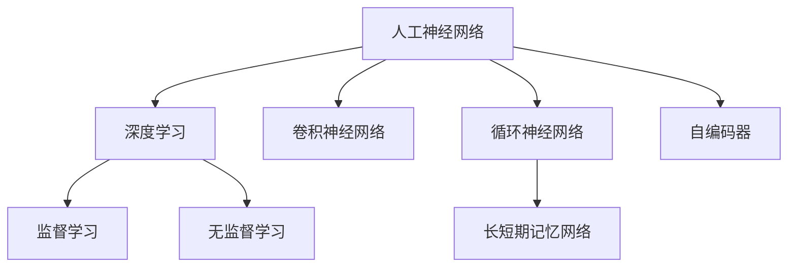
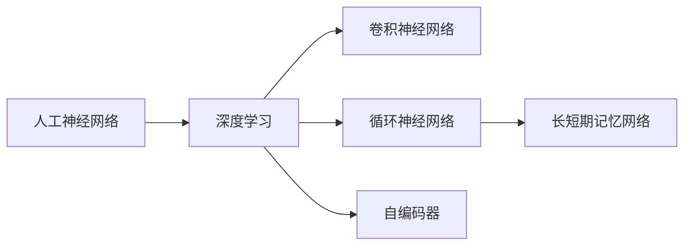
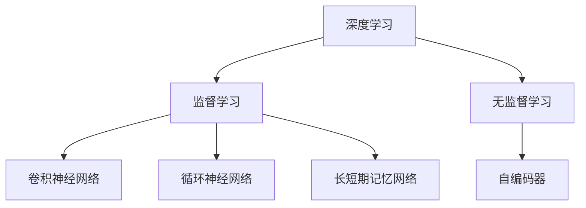
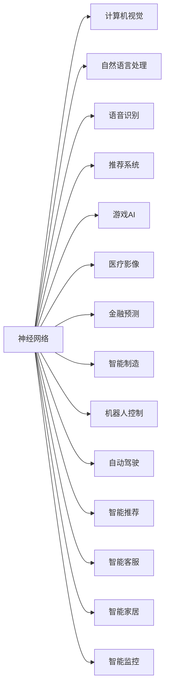

                 

# 神经网络：人类智慧的解放

> 关键词：神经网络,深度学习,人工智能,脑科学,人类智能,脑机接口,未来趋势

## 1. 背景介绍

### 1.1 问题由来

随着人工智能技术的迅猛发展，深度学习尤其是神经网络成为了破解人类智慧密码的利器。深度学习的成功，背后有着复杂而宏大的理论基础和历史渊源。

深度学习的起点可以追溯到20世纪40年代的人工神经网络（Artificial Neural Networks, ANN）研究。早期的人工神经网络基于物理学的仿生学原理，试图模拟人类大脑的神经元结构和突触连接机制。虽然当时的人工神经网络尝试和实验效果有限，但其思想启发了后续的研究方向，也为今天深度学习的兴起埋下了伏笔。

到了20世纪90年代，随着计算能力的提升和数据量的增长，人工神经网络再次进入人们的视野。在1998年，Yann LeCun等人提出了卷积神经网络（Convolutional Neural Networks, CNN），并通过在图像识别任务中的成功应用，奠定了神经网络在计算机视觉领域的核心地位。

此后，神经网络在自然语言处理、语音识别、推荐系统等多个领域也取得了突破性的进展，成为人工智能的重要驱动力。深度学习的核心思想是通过多层次非线性映射，提取和抽象高层次语义特征，并结合大量标注数据进行监督学习，从而实现对于复杂非结构化数据的处理和理解。

## 2. 核心概念与联系

### 2.1 核心概念概述

为了更好地理解深度学习中神经网络的原理和应用，本节将介绍几个关键概念：

- 人工神经网络（Artificial Neural Networks, ANN）：由大量人工神经元构成的计算模型，每个神经元包含若干权重和偏置项。神经网络通过多层非线性映射，实现复杂模式的识别和分类。
- 深度学习（Deep Learning）：指通过多层神经网络进行特征提取和模式学习的方法。深度学习利用了反向传播算法，通过大量标注数据进行监督学习，逐渐优化网络权重和偏置项。
- 卷积神经网络（Convolutional Neural Networks, CNN）：针对图像、视频等空间结构数据，通过卷积操作提取局部特征，并结合池化、全连接层进行特征融合，最终完成分类任务。
- 循环神经网络（Recurrent Neural Networks, RNN）：针对时间序列数据，通过循环结构实现时间依赖关系的学习，常用于语音识别、自然语言处理等任务。
- 长短期记忆网络（Long Short-Term Memory, LSTM）：一种特殊的RNN，能够有效地解决传统RNN中的梯度消失和爆炸问题，广泛用于序列数据的任务。
- 自编码器（Autoencoder）：一种无监督学习方法，通过输入层、隐藏层和输出层的编码-解码过程，实现数据的压缩和重构。

这些概念之间的逻辑关系可以通过以下Mermaid流程图来展示：



这个流程图展示了大规模神经网络的演变路径和主要研究方向：

1. 人工神经网络是深度学习的起点，其多层次非线性映射思想奠定了后续深度学习的基础。
2. 卷积神经网络针对图像数据，通过卷积操作提取局部特征，是计算机视觉领域的重要工具。
3. 循环神经网络针对时间序列数据，通过循环结构学习时间依赖关系，是自然语言处理和语音识别的核心方法。
4. 长短期记忆网络是对传统RNN的改进，解决了梯度问题，广泛应用于序列数据的处理。
5. 自编码器通过无监督学习方法实现数据的重构，具有特征提取和降维的功能。
6. 深度学习通过监督学习（如CNN、RNN、LSTM）和无监督学习（如自编码器）等方法，实现对复杂数据的处理。

这些核心概念共同构成了深度学习的研究框架，使得神经网络在图像、语音、自然语言处理等众多领域取得了突破性的进展。

### 2.2 概念间的关系

这些核心概念之间存在着紧密的联系，形成了深度学习的研究体系。下面通过几个Mermaid流程图来展示这些概念之间的关系。

#### 2.2.1 神经网络的演变路径



这个流程图展示了神经网络从人工神经网络到深度学习的演变路径：

1. 人工神经网络是深度学习的起点，其多层次非线性映射思想奠定了后续深度学习的基础。
2. 卷积神经网络针对图像数据，通过卷积操作提取局部特征，是计算机视觉领域的重要工具。
3. 循环神经网络针对时间序列数据，通过循环结构学习时间依赖关系，是自然语言处理和语音识别的核心方法。
4. 长短期记忆网络是对传统RNN的改进，解决了梯度问题，广泛应用于序列数据的处理。
5. 自编码器通过无监督学习方法实现数据的重构，具有特征提取和降维的功能。

#### 2.2.2 深度学习的研究方向



这个流程图展示了深度学习的两个主要研究方向：

1. 深度学习通过监督学习（如CNN、RNN、LSTM）和无监督学习（如自编码器）等方法，实现对复杂数据的处理。
2. 卷积神经网络针对图像数据，通过卷积操作提取局部特征，是计算机视觉领域的重要工具。
3. 循环神经网络针对时间序列数据，通过循环结构学习时间依赖关系，是自然语言处理和语音识别的核心方法。
4. 长短期记忆网络是对传统RNN的改进，解决了梯度问题，广泛应用于序列数据的处理。
5. 自编码器通过无监督学习方法实现数据的重构，具有特征提取和降维的功能。

#### 2.2.3 神经网络的应用场景



这个流程图展示了神经网络在多个领域的应用场景：

1. 计算机视觉：卷积神经网络在图像分类、目标检测、图像生成等任务上表现优异。
2. 自然语言处理：循环神经网络和长短期记忆网络在语言建模、机器翻译、情感分析等任务上取得突破。
3. 语音识别：卷积神经网络和循环神经网络在语音识别、说话人识别等任务上发挥重要作用。
4. 推荐系统：神经网络能够处理用户行为数据，实现精准推荐。
5. 游戏AI：神经网络在游戏策略优化、AI对战等任务上取得了显著进步。
6. 医疗影像：卷积神经网络在医学影像识别、病灶检测等任务上表现优异。
7. 金融预测：神经网络在股票预测、风险评估等任务上发挥重要作用。
8. 智能制造：神经网络在预测维护、质量控制等任务上取得突破。
9. 机器人控制：神经网络在运动控制、视觉导航等任务上表现优异。
10. 自动驾驶：卷积神经网络在图像识别、决策规划等任务上发挥重要作用。
11. 智能推荐：神经网络在电商推荐、新闻推荐等任务上取得显著效果。
12. 智能客服：神经网络在多轮对话、意图识别等任务上取得突破。
13. 智能家居：神经网络在语音识别、智能控制等任务上发挥重要作用。
14. 智能监控：神经网络在行为识别、异常检测等任务上表现优异。

这些应用场景展示了神经网络在各个领域的巨大潜力，反映了深度学习技术在解决实际问题中的强大能力。

### 2.3 核心概念的整体架构

最后，我们用一个综合的流程图来展示这些核心概念在大规模神经网络微调过程中的整体架构：

```mermaid
graph TB
    A[大规模文本数据] --> B[预训练]
    B --> C[神经网络]
    C --> D[微调]
    C --> E[迁移学习]
    D --> F[监督微调]
    D --> G[无监督微调]
    E --> D
    F --> H[计算机视觉]
    F --> I[自然语言处理]
    F --> J[语音识别]
    F --> K[推荐系统]
    G --> L[计算机视觉]
    G --> M[自然语言处理]
    G --> N[语音识别]
    G --> O[推荐系统]
    H --> P[图像分类]
    H --> Q[目标检测]
    H --> R[图像生成]
    I --> S[语言建模]
    I --> T[机器翻译]
    I --> U[情感分析]
    J --> V[语音识别]
    J --> W[说话人识别]
    K --> X[个性化推荐]
    K --> Y[商品推荐]
    L --> Z[医学影像]
    L --> $[病灶检测]
    L --> [$[病灶分割]
    M --> [$[语言理解]
    M --> [$[智能问答]
    M --> [$[机器阅读]
    N --> [$[自动摘要]
    N --> [$[语音转换]
    O --> [$[电商推荐]
    O --> [$[内容推荐]
```

这个综合流程图展示了从预训练到微调，再到迁移学习的完整过程。大规模神经网络首先在大规模文本数据上进行预训练，然后通过微调和迁移学习，适应不同任务，实现全领域的广泛应用。

## 3. 核心算法原理 & 具体操作步骤
### 3.1 算法原理概述

深度学习中神经网络的核心思想是通过多层非线性映射，提取和抽象高层次语义特征，并结合大量标注数据进行监督学习，从而实现对于复杂非结构化数据的处理和理解。

在神经网络中，数据首先通过输入层进行编码，然后进入若干隐藏层进行特征提取和抽象，最后通过输出层解码成标签或概率分布。神经网络的训练过程主要通过反向传播算法，利用损失函数和梯度下降算法不断调整隐藏层和输出层的权重和偏置项，使得模型输出尽量接近真实标签。

### 3.2 算法步骤详解

深度学习中神经网络的训练过程主要包括以下几个关键步骤：

**Step 1: 数据预处理**

- 收集并清洗标注数据，划分为训练集、验证集和测试集。
- 对图像数据进行归一化、增强等预处理操作，对文本数据进行分词、编码等处理。
- 定义模型输入和输出的格式，如图像的像素值、文本的词向量等。

**Step 2: 构建模型架构**

- 选择合适的神经网络架构，如卷积神经网络（CNN）、循环神经网络（RNN）、长短期记忆网络（LSTM）等。
- 设计模型的输入层、隐藏层和输出层的结构和参数，如卷积核大小、隐藏层神经元个数等。
- 定义损失函数，如交叉熵损失、均方误差损失等，用于衡量模型输出与真实标签之间的差异。

**Step 3: 定义优化器**

- 选择合适的优化算法，如SGD、Adam等，设置学习率、批大小等超参数。
- 定义正则化技术，如L2正则、Dropout等，避免过拟合。
- 定义早停机制，监控验证集上的性能，及时停止训练。

**Step 4: 执行梯度训练**

- 将训练集数据分批次输入模型，前向传播计算损失函数。
- 反向传播计算参数梯度，根据设定的优化算法和学习率更新模型参数。
- 周期性在验证集上评估模型性能，根据性能指标决定是否触发早停机制。
- 重复上述步骤直到满足预设的迭代轮数或早停条件。

**Step 5: 测试和评估**

- 在测试集上评估微调后模型的效果，对比微调前后的性能提升。
- 使用微调后的模型对新数据进行推理预测，集成到实际的应用系统中。
- 持续收集新的数据，定期重新微调模型，以适应数据分布的变化。

以上是深度学习中神经网络的训练过程的详细步骤。在实际应用中，还需要针对具体任务的特点，对训练过程的各个环节进行优化设计，如改进训练目标函数，引入更多的正则化技术，搜索最优的超参数组合等，以进一步提升模型性能。

### 3.3 算法优缺点

深度学习中神经网络的优点包括：

1. 自适应能力：神经网络通过反向传播算法自动调整参数，能够适应复杂的数据分布和模式。
2. 泛化能力：大规模神经网络在大规模数据上进行预训练，具备较强的泛化能力，能够适应不同的应用场景。
3. 可解释性：深度学习中的神经网络可以通过特征可视化技术，揭示模型的决策过程和特征提取机制。
4. 并行计算：神经网络通过并行计算，能够高效地处理大规模数据和复杂模型。

神经网络的缺点包括：

1. 数据依赖：神经网络需要大量的标注数据进行训练，数据获取和标注成本较高。
2. 计算资源需求高：大规模神经网络需要高性能的计算设备和存储资源，计算成本较高。
3. 模型复杂度高：神经网络模型参数量巨大，训练和推理过程复杂。
4. 过拟合风险：神经网络容易在训练集上过拟合，泛化性能较差。
5. 可解释性不足：神经网络往往被视为"黑盒"系统，难以解释其内部工作机制和决策逻辑。

尽管存在这些缺点，但神经网络在解决复杂非结构化数据处理和理解方面表现出色，已成为深度学习的重要工具。未来研究需要关注如何更好地利用神经网络的优势，同时克服其缺点，进一步提高深度学习模型的性能和应用效果。

### 3.4 算法应用领域

深度学习中神经网络在多个领域得到了广泛应用，涵盖了计算机视觉、自然语言处理、语音识别、推荐系统等众多领域。以下是几个典型的应用场景：

- 计算机视觉：神经网络在图像分类、目标检测、图像生成等任务上表现优异。
- 自然语言处理：神经网络在语言建模、机器翻译、情感分析等任务上取得突破。
- 语音识别：神经网络在语音识别、说话人识别等任务上发挥重要作用。
- 推荐系统：神经网络能够处理用户行为数据，实现精准推荐。
- 游戏AI：神经网络在游戏策略优化、AI对战等任务上取得了显著进步。
- 医疗影像：神经网络在医学影像识别、病灶检测等任务上表现优异。
- 金融预测：神经网络在股票预测、风险评估等任务上发挥重要作用。
- 智能制造：神经网络在预测维护、质量控制等任务上取得突破。
- 机器人控制：神经网络在运动控制、视觉导航等任务上表现优异。
- 自动驾驶：神经网络在图像识别、决策规划等任务上发挥重要作用。
- 智能推荐：神经网络在电商推荐、新闻推荐等任务上取得显著效果。
- 智能客服：神经网络在多轮对话、意图识别等任务上取得突破。
- 智能家居：神经网络在语音识别、智能控制等任务上发挥重要作用。
- 智能监控：神经网络在行为识别、异常检测等任务上表现优异。

这些应用场景展示了神经网络在各个领域的巨大潜力，反映了深度学习技术在解决实际问题中的强大能力。

## 4. 数学模型和公式 & 详细讲解  
### 4.1 数学模型构建

深度学习中神经网络的数学模型主要包括以下几个部分：

- 输入层：将原始数据（如像素值、词向量等）编码成模型可以处理的格式。
- 隐藏层：通过若干个神经元进行特征提取和抽象，学习数据的内部结构。
- 输出层：将隐藏层的特征映射到标签或概率分布上，完成模型的预测和分类。

假设神经网络包含 $n$ 个隐藏层，每个隐藏层包含 $m$ 个神经元，则神经网络的数学模型可以表示为：

$$
\begin{aligned}
h_0 &= W_0 x + b_0 \\
h_i &= \phi(W_i h_{i-1} + b_i), \quad i=1,...,n \\
y &= W_n h_n + b_n
\end{aligned}
$$

其中 $x$ 为输入数据，$y$ 为输出标签，$W_i$ 和 $b_i$ 分别为第 $i$ 层的权重和偏置项，$\phi$ 为激活函数，如sigmoid、ReLU等。

### 4.2 公式推导过程

以最简单的二分类任务为例，假设神经网络的输出层有一个神经元，激活函数为sigmoid，则模型的输出可以表示为：

$$
y = \sigma(W_n h_n + b_n)
$$

其中 $h_n$ 为最后一层隐藏层的输出，$W_n$ 和 $b_n$ 分别为最后一层的权重和偏置项，$\sigma$ 为sigmoid激活函数。

对于二分类任务，定义损失函数为：

$$
\ell(y, \hat{y}) = -(y \log \hat{y} + (1-y) \log (1-\hat{y}))
$$

其中 $\hat{y}$ 为模型的预测概率，$y$ 为真实标签。

神经网络的训练过程主要通过反向传播算法实现，目标是最小化损失函数。假设神经网络的参数为 $\theta$，则训练过程可以表示为：

$$
\theta = \arg\min_{\theta} \ell(y, \hat{y})
$$

通过链式法则，损失函数对参数 $\theta$ 的梯度可以表示为：

$$
\frac{\partial \ell(y, \hat{y})}{\partial \theta} = \frac{\partial \ell(y, \hat{y})}{\partial h_n} \frac{\partial h_n}{\partial \theta}
$$

其中 $\frac{\partial \ell(y, \hat{y})}{\partial h_n}$ 为损失函数对隐藏层输出的导数，$\frac{\partial h_n}{\partial \theta}$ 为隐藏层输出对参数的导数。

反向传播算法通过不断递归计算，将损失函数对参数的导数传递回每个隐藏层，最终更新模型参数。训练过程不断迭代，直至收敛。

### 4.3 案例分析与讲解

以卷积神经网络（CNN）为例，其在图像识别任务中表现优异。假设CNN包含多个卷积层、池化层和全连接层，其输出可以表示为：

$$
\begin{aligned}
I_0 &= \text{Conv}(I, W_0) + b_0 \\
I_1 &= \text{ReLU}(I_0) \\
I_2 &= \text{Conv}(I_1, W_1) + b_1 \\
I_3 &= \text{ReLU}(I_2) \\
I_4 &= \text{MaxPooling}(I_3) \\
I_5 &= \text{Conv}(I_4, W_4) + b_4 \\
I_6 &= \text{ReLU}(I_5) \\
I_7 &= \text{Conv}(I_6, W_6) + b_6 \\
I_8 &= \text{ReLU}(I_7) \\
I_9 &= \text{MaxPooling}(I_8) \\
I_{10} &= \text{Flatten}(I_9) \\
I_{11} &= \text{Dense}(I_{10}, W_{11}) + b_{11} \\
I_{12} &= \text{ReLU}(I_{11}) \\
I_{13} &= \text{Dense}(I_{12}, W_{13}) + b_{13} \\
y &= \text{Softmax}(I_{13})
\end{aligned}
$$

其中 $\text{Conv}$ 和 $\text{MaxPooling}$ 为卷积和池化操作，$\text{Dense}$ 为全连接层，$\text{ReLU}$ 和 $\text{Softmax}$ 为激活函数。

假设CNN用于图像分类任务，定义交叉熵损失函数为：

$$
\ell(y, \hat{y}) = -\frac{1}{N} \sum_{i=1}^N \sum_{j=1}^C y_j \log \hat{y}_j
$$

其中 $N$ 为样本数量，$C$ 为类别数。

神经网络的训练过程主要通过反向传播算法实现，目标是最小化损失函数。假设神经网络的参数为 $\theta$，则训练过程可以表示为：

$$
\theta = \arg\min_{\theta} \ell(y, \hat{y})
$$

通过链式法则，损失函数对参数 $\theta$ 的梯度可以表示为：

$$
\frac{\partial \ell(y, \hat{y})}{\partial \theta} = \frac{\partial \ell(y, \hat{y})}{\partial h_9} \frac{\partial h_9}{\partial \theta}
$$

其中 $\frac{\partial \ell(y, \hat{y})}{\partial h_9}$ 为损失函数对隐藏层输出的导数，$\frac{\partial h_9}{\partial \theta}$ 为隐藏层输出对参数的导数。

反向传播算法通过不断递归计算，将损失函数对参数的导数传递回每个隐藏层，最终更新模型参数。训练过程不断迭代，直至收敛。

## 5. 项目实践：代码实例和详细解释说明
### 5.1 开发环境搭建

在进行深度学习实践前，我们需要准备好开发环境。以下是使用Python进行TensorFlow开发的环境配置流程：

1. 安装Anaconda：从官网下载并安装Anaconda，用于创建独立的Python环境。

2. 创建并激活虚拟环境：
```bash
conda create -n tf-env python=3.8 
conda activate tf-env
```

3. 安装TensorFlow：根据CUDA版本，从官网获取对应的安装命令。例如：
```bash
conda install tensorflow -c pytorch -c conda-forge
```

4. 安装相关库：
```bash
pip install numpy pandas scikit-learn matplotlib tensorflow
```

5. 安装可视化工具：
```bash
pip install tensorboard
```

完成上述步骤后，即可在`tf-env`环境中开始深度学习实践。

### 5.2 源代码详细实现

这里我们以卷积神经网络（CNN）在图像分类任务中的实践为例，给出TensorFlow代码实现。

首先，定义数据集：

```python
from tensorflow.keras.datasets import cifar10
from tensorflow.keras.preprocessing.image import ImageDataGenerator

(x_train, y_train), (x_test, y_test) = cifar10.load_data()

# 归一化处理
x_train = x_train / 255.0
x_test = x_test / 255.0

# 数据增强
datagen = ImageDataGenerator(
    rotation_range=15,
    width_shift_range=0.1,
    height_shift_range=0.1,
    horizontal_flip=True,
    fill_mode='nearest')

datagen.fit(x_train)
```

然后，定义模型：

```python
from tensorflow.keras.models import Sequential
from tensorflow.keras.layers import Conv2D, MaxPooling2D, Flatten, Dense, Dropout

model = Sequential([
    Conv2D(32, (3, 3), activation='relu', input_shape=(32, 32, 3)),
    MaxPooling2D((2, 2)),
    Dropout(0.25),
    Conv2D(64, (3, 3), activation='relu'),
    MaxPooling2D((2, 2)),
    Dropout(0.25),
    Flatten(),
    Dense(512, activation='relu'),
    Dropout(0.5),
    Dense(10, activation='softmax')
])

model.summary()
```

接着，定义训练函数：

```python
from tensorflow.keras.optimizers import RMSprop
from tensorflow.keras.metrics import CategoricalAccuracy

model.compile(
    optimizer=RMSprop(lr=0.0001, decay=1e-6),
    loss='categorical_crossentropy',
    metrics=[CategoricalAccuracy()])

def train_epoch(model, data, batch_size, optimizer):
    for batch in data:
        inputs, targets = batch
        model.train_on_batch(inputs, targets)
```

最后，启动训练流程：

```python
epochs = 20
batch_size = 32

for epoch in range(epochs):
    train_epoch(model, datagen.flow(x_train, y_train, batch_size=batch_size), batch_size, optimizer)
    val_loss, val_acc = model.evaluate(x_test, y_test)
    print(f'Epoch {epoch+1}, Val Loss: {val_loss:.4f}, Val Accuracy: {val_acc:.4f}')
```

以上就是使用TensorFlow对CNN进行图像分类任务微调的完整代码实现。可以看到，TensorFlow提供了强大的深度学习框架，使得神经网络的实现变得简洁高效。

### 5.3 代码解读与分析

让我们再详细解读一下关键代码的实现细节：

**数据集定义**：
- `cifar10.load_data()`：加载CIFAR-10数据集，包含60000个32x32彩色图片和相应的标签。
- `x_train /= 255

