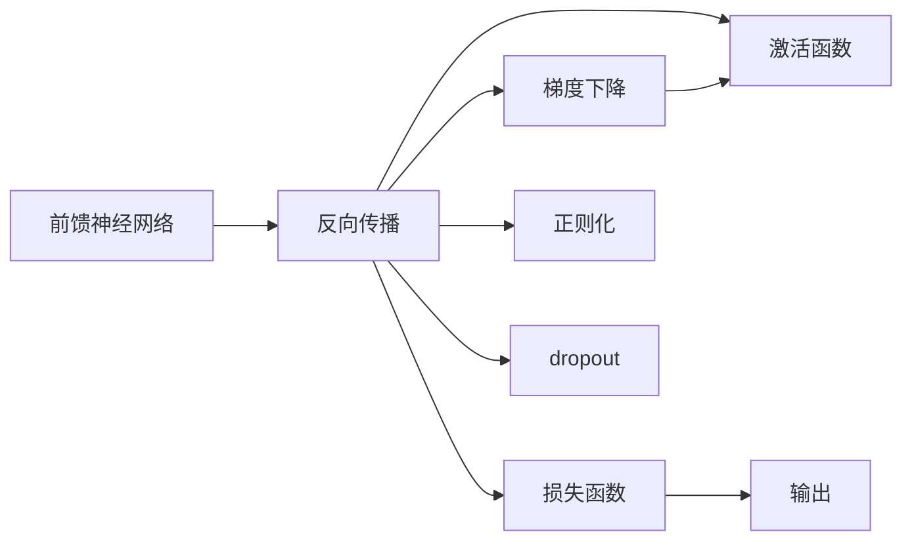
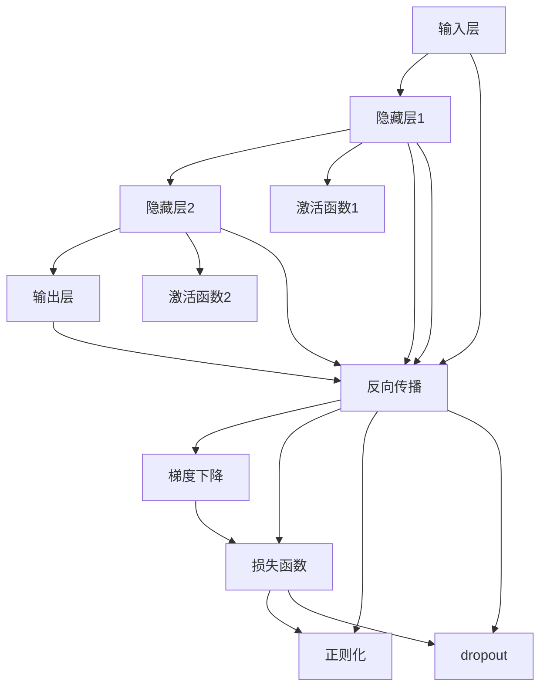

                 

## 1. 背景介绍

### 1.1 问题由来
在人工智能的发展历程中，神经网络（Neural Networks, NN）作为核心技术，为机器学习和深度学习领域带来了革命性的变化。自20世纪80年代以来，科学家们不断探索与实验，使神经网络从早期的浅层感知机发展到如今复杂深邃的卷积神经网络（Convolutional Neural Networks, CNN）、循环神经网络（Recurrent Neural Networks, RNN）、长短期记忆网络（Long Short-Term Memory, LSTM）、变分自编码器（Variational Autoencoder, VAE）以及深度信念网络（Deep Belief Networks, DBN）等模型。

神经网络的提出，改变了传统机器学习算法对数据的处理方式，使其能够更好地捕捉数据中的复杂非线性关系，并自动提取数据特征，成为实现各种智能应用的重要基础。如今，深度神经网络在图像识别、自然语言处理、语音识别、推荐系统等领域取得了重大突破，成为人工智能技术的核心驱动力之一。

### 1.2 问题核心关键点
神经网络的核心概念包括前馈神经网络、反向传播算法、梯度下降法、激活函数、损失函数等。其中，前馈神经网络由多个神经元层组成，信号从前一层传递到后一层，每层执行一定的计算并输出结果。反向传播算法利用链式法则计算梯度，通过反向传播更新模型参数，实现训练和优化。梯度下降法是最常用的优化算法，通过不断迭代更新权重，最小化损失函数，优化模型性能。激活函数如Sigmoid、ReLU等，赋予神经元非线性特性，增强网络的表现力。损失函数如均方误差、交叉熵等，用于衡量模型输出与真实标签之间的差距。

神经网络理论发展至今，已成为人工智能技术的重要支柱。神经网络在大数据和计算资源的支持下，通过大规模训练，构建了复杂的特征提取和模式识别能力，为各类智能化应用提供了强有力的支持。

### 1.3 问题研究意义
神经网络技术的普及和发展，对人工智能领域产生了深远的影响：

1. **提高模型性能**：神经网络在处理非线性问题时表现出色，能够通过多层次的特征提取和模式识别，大幅提升模型在各种任务上的性能，如分类、回归、图像识别等。
2. **应用范围广泛**：神经网络被广泛应用于视觉、语音、自然语言处理、推荐系统等多个领域，推动了各行业智能化升级。
3. **数据驱动**：神经网络采用数据驱动的训练方式，通过大量标注数据进行优化，能够不断学习新知识，适应环境变化，提高鲁棒性。
4. **自适应能力**：神经网络可以适应不同的数据分布和问题类型，通过结构调整和参数优化，应对复杂多变的任务需求。
5. **普适性**：神经网络算法的提出和优化，使深度学习技术得以广泛应用于各类硬件平台，从嵌入式设备到超级计算机，均能高效运行。

通过神经网络技术的不断发展，人工智能在多个领域实现了从量变到质变的飞跃，为人类社会带来了前所未有的智能化体验和效率提升。

## 2. 核心概念与联系

### 2.1 核心概念概述
在探讨神经网络的原理和应用前，我们需要先了解几个核心概念：

- **前馈神经网络（Feedforward Neural Network, FNN）**：由输入层、隐藏层和输出层组成，信号单向流动，每层通过激活函数进行非线性变换。
- **反向传播（Backpropagation）**：利用链式法则计算梯度，通过反向传播更新模型参数，最小化损失函数。
- **梯度下降法（Gradient Descent）**：一种优化算法，通过迭代更新权重，不断逼近损失函数的最小值。
- **激活函数（Activation Function）**：赋予神经元非线性特性，如Sigmoid、ReLU等。
- **损失函数（Loss Function）**：衡量模型输出与真实标签之间的差异，如均方误差、交叉熵等。
- **正则化（Regularization）**：通过引入惩罚项，防止过拟合，提高模型泛化能力。
- **dropout**：一种常用的正则化方法，通过随机丢弃一部分神经元，降低过拟合风险。

这些核心概念构成了神经网络的基本架构和优化方法，通过合理的配置和使用，能够构建出高效、鲁棒、适应性强的智能模型。

### 2.2 概念间的关系
以下是神经网络核心概念之间的关系图：



这些概念之间互相依赖，共同构建了神经网络的理论基础和实践框架。例如，前馈神经网络通过反向传播进行参数更新，梯度下降法在反向传播过程中进行权重优化，激活函数赋予神经元非线性特性，损失函数衡量模型输出与真实标签的差异，正则化和dropout用于防止过拟合，提高模型泛化能力。

### 2.3 核心概念的整体架构
将以上概念结合，可以得到神经网络的整体架构图：



从图中可以看出，前馈神经网络通过多个隐藏层进行特征提取和模式识别，利用激活函数赋予非线性特性，反向传播计算梯度并更新权重，梯度下降优化损失函数，正则化和dropout防止过拟合。这些步骤共同构建了神经网络的基本流程，使其具备强大的模型能力和泛化能力。

## 3. 核心算法原理 & 具体操作步骤
### 3.1 算法原理概述
神经网络通过前馈传播和反向传播实现参数优化，训练和调整模型。其核心算法原理如下：

1. **前馈传播**：将输入数据输入神经网络，各层进行计算并传递结果，最终得到输出。
2. **损失计算**：计算模型输出与真实标签的差异，通常使用均方误差、交叉熵等损失函数。
3. **反向传播**：利用链式法则计算梯度，反向传播至每个神经元，更新权重。
4. **参数优化**：通过梯度下降等优化算法，调整权重和偏置，最小化损失函数。

### 3.2 算法步骤详解
以下是神经网络训练的详细步骤：

1. **数据准备**：收集并准备训练数据，分为训练集、验证集和测试集，确保数据质量和分布一致。
2. **模型构建**：选择适当的神经网络结构和激活函数，搭建前馈神经网络。
3. **损失定义**：根据具体任务，选择适合的损失函数。
4. **优化器选择**：选择梯度下降、Adam等优化算法，并设置初始学习率和迭代轮数。
5. **训练迭代**：使用训练集进行迭代训练，通过反向传播和参数更新，不断优化模型性能。
6. **验证评估**：在验证集上评估模型性能，使用评价指标如准确率、精确率、召回率等，监控模型泛化能力。
7. **参数调整**：根据验证集表现，调整学习率、优化算法等参数，防止过拟合。
8. **测试评估**：在测试集上最终评估模型性能，确保模型在未知数据上的表现。

### 3.3 算法优缺点
神经网络的优势在于其强大的数据处理能力和泛化能力，可以自动提取数据特征并进行复杂非线性关系的建模。然而，神经网络也存在一些局限性：

- **过拟合风险**：神经网络模型复杂，容易在训练集上过拟合，降低模型泛化能力。
- **资源消耗大**：神经网络模型参数量庞大，计算资源消耗高，训练时间长。
- **黑盒性质**：神经网络作为深度模型，难以解释其内部决策过程，缺乏可解释性。
- **对数据质量敏感**：神经网络对数据分布和噪声敏感，处理低质量数据时效果可能不佳。

### 3.4 算法应用领域
神经网络技术在多个领域得到了广泛应用，包括但不限于：

- **计算机视觉**：用于图像分类、目标检测、语义分割等任务，例如图像识别、物体检测、人脸识别等。
- **自然语言处理**：用于文本分类、机器翻译、文本生成、情感分析等任务，例如文本分类、机器翻译、聊天机器人等。
- **语音处理**：用于语音识别、语音合成、语音情感识别等任务，例如智能语音助手、语音指令识别等。
- **推荐系统**：用于用户兴趣建模、物品推荐等任务，例如商品推荐、音乐推荐等。
- **金融分析**：用于量化交易、风险评估、市场预测等任务，例如股票价格预测、信用评分等。
- **医疗诊断**：用于图像诊断、病理学分析等任务，例如病理切片分类、疾病诊断等。

神经网络技术的不断进步和应用，为人工智能技术的落地和普及提供了强有力的支持，推动了各个行业的智能化转型升级。

## 4. 数学模型和公式 & 详细讲解 & 举例说明
### 4.1 数学模型构建

以一个简单的全连接神经网络为例，构建其数学模型。设输入为 $\mathbf{x}$，输出为 $\mathbf{y}$，网络结构由 $L$ 层隐藏层和 $M$ 个输出神经元组成，其中每层包含 $n$ 个神经元。假设第一层输入向量为 $\mathbf{x} = (x_1, x_2, ..., x_d)$，则神经网络的前向传播过程可以表示为：

$$
h^l = \sigma(\mathbf{W}^l \mathbf{h}^{l-1} + \mathbf{b}^l)
$$

其中 $l$ 表示第 $l$ 层，$\sigma$ 为激活函数，$\mathbf{W}^l$ 为权重矩阵，$\mathbf{b}^l$ 为偏置向量，$\mathbf{h}^l$ 为输出向量。

### 4.2 公式推导过程

以均方误差（MSE）损失函数为例，推导其梯度更新过程。均方误差损失函数定义为：

$$
\mathcal{L}(\mathbf{y}, \mathbf{\hat{y}}) = \frac{1}{N} \sum_{i=1}^N (\mathbf{y}_i - \mathbf{\hat{y}}_i)^2
$$

其中 $\mathbf{y}_i$ 为真实标签，$\mathbf{\hat{y}}_i$ 为模型输出。

通过链式法则，计算损失函数对每个权重参数的梯度：

$$
\frac{\partial \mathcal{L}}{\partial \mathbf{W}^{l-1}} = 2 \frac{\partial \mathcal{L}}{\partial \mathbf{h}^l} \frac{\partial \mathbf{h}^l}{\partial \mathbf{W}^{l-1}}
$$

其中 $\frac{\partial \mathbf{h}^l}{\partial \mathbf{W}^{l-1}}$ 为雅可比矩阵，可以表示为：

$$
\frac{\partial \mathbf{h}^l}{\partial \mathbf{W}^{l-1}} = \mathbf{h}^{l-1} \otimes (\frac{\partial \sigma}{\partial \mathbf{h}^l})
$$

其中 $\otimes$ 表示向量点乘操作，$\frac{\partial \sigma}{\partial \mathbf{h}^l}$ 为激活函数导数。

通过上述推导，可以得到每个权重参数的梯度更新公式：

$$
\mathbf{W}^l \leftarrow \mathbf{W}^l - \eta \frac{\partial \mathcal{L}}{\partial \mathbf{W}^l}
$$

其中 $\eta$ 为学习率。

### 4.3 案例分析与讲解

以手写数字识别为例，使用多层感知器（MLP）搭建神经网络模型。具体步骤如下：

1. **数据准备**：使用MNIST数据集，将手写数字图像转换为像素值向量，并将标签转化为独热编码。
2. **模型构建**：搭建三层全连接神经网络，每层包含 $n$ 个神经元，激活函数为ReLU，输出层激活函数为Softmax。
3. **损失定义**：使用交叉熵损失函数，衡量模型输出与真实标签的差异。
4. **优化器选择**：使用Adam优化算法，学习率为 $10^{-2}$。
5. **训练迭代**：使用训练集进行迭代训练，设置迭代轮数为 $1000$。
6. **验证评估**：在验证集上评估模型性能，计算准确率、精确率、召回率等指标。
7. **参数调整**：根据验证集表现，调整学习率、优化算法等参数。
8. **测试评估**：在测试集上最终评估模型性能，确保模型在未知数据上的表现。

通过以上步骤，可以训练出一个准确率较高的手写数字识别模型。

## 5. 项目实践：代码实例和详细解释说明
### 5.1 开发环境搭建

使用Python和PyTorch进行神经网络模型的开发和训练。以下是开发环境的搭建步骤：

1. 安装Anaconda：从官网下载并安装Anaconda，用于创建独立的Python环境。
2. 创建并激活虚拟环境：
```bash
conda create -n pytorch-env python=3.8 
conda activate pytorch-env
```

3. 安装PyTorch：根据CUDA版本，从官网获取对应的安装命令。例如：
```bash
conda install pytorch torchvision torchaudio cudatoolkit=11.1 -c pytorch -c conda-forge
```

4. 安装TensorFlow：
```bash
pip install tensorflow
```

5. 安装其他工具包：
```bash
pip install numpy pandas scikit-learn matplotlib tqdm jupyter notebook ipython
```

完成上述步骤后，即可在`pytorch-env`环境中开始神经网络模型的开发。

### 5.2 源代码详细实现

以下是使用PyTorch搭建手写数字识别模型的代码实现：

```python
import torch
import torch.nn as nn
import torch.optim as optim
from torch.utils.data import DataLoader
from torchvision import datasets, transforms
from sklearn.model_selection import train_test_split

# 定义神经网络模型
class NeuralNetwork(nn.Module):
    def __init__(self, input_size, hidden_size, num_classes):
        super(NeuralNetwork, self).__init__()
        self.fc1 = nn.Linear(input_size, hidden_size)
        self.relu = nn.ReLU()
        self.fc2 = nn.Linear(hidden_size, num_classes)
        self.softmax = nn.Softmax(dim=1)

    def forward(self, x):
        x = self.fc1(x)
        x = self.relu(x)
        x = self.fc2(x)
        x = self.softmax(x)
        return x

# 加载数据集
train_dataset = datasets.MNIST(root='data/', train=True, download=True, transform=transforms.ToTensor())
test_dataset = datasets.MNIST(root='data/', train=False, download=True, transform=transforms.ToTensor())

# 数据预处理
train_data, valid_data = train_test_split(train_dataset, test_size=0.2, random_state=42)
train_loader = DataLoader(train_data, batch_size=64, shuffle=True)
valid_loader = DataLoader(valid_data, batch_size=64, shuffle=False)
test_loader = DataLoader(test_dataset, batch_size=64, shuffle=False)

# 定义模型和优化器
model = NeuralNetwork(input_size=784, hidden_size=128, num_classes=10)
criterion = nn.CrossEntropyLoss()
optimizer = optim.Adam(model.parameters(), lr=1e-2)

# 训练模型
num_epochs = 1000
for epoch in range(num_epochs):
    for batch_idx, (data, target) in enumerate(train_loader):
        data = data.view(-1, 28*28)
        target = target
        optimizer.zero_grad()
        output = model(data)
        loss = criterion(output, target)
        loss.backward()
        optimizer.step()
        if (batch_idx+1) % 100 == 0:
            print('Train Epoch: {} [{}/{} ({:.0f}%)]\tLoss: {:.6f}'.format(
                epoch, batch_idx * len(data), len(train_loader.dataset),
                100. * batch_idx / len(train_loader), loss.item()))

# 验证模型
with torch.no_grad():
    correct = 0
    total = 0
    for data, target in valid_loader:
        data = data.view(-1, 28*28)
        target = target
        output = model(data)
        _, predicted = torch.max(output.data, 1)
        total += target.size(0)
        correct += (predicted == target).sum().item()

    print('Accuracy of the network on the 10000 test images: {} %'.format(100 * correct / total))

# 测试模型
with torch.no_grad():
    correct = 0
    total = 0
    for data, target in test_loader:
        data = data.view(-1, 28*28)
        target = target
        output = model(data)
        _, predicted = torch.max(output.data, 1)
        total += target.size(0)
        correct += (predicted == target).sum().item()

    print('Accuracy of the network on the 10000 test images: {} %'.format(100 * correct / total))
```

以上代码实现了手写数字识别的神经网络模型，具体步骤如下：

1. **数据准备**：使用MNIST数据集，将手写数字图像转换为像素值向量，并将标签转化为独热编码。
2. **模型构建**：搭建三层全连接神经网络，每层包含 $n$ 个神经元，激活函数为ReLU，输出层激活函数为Softmax。
3. **损失定义**：使用交叉熵损失函数，衡量模型输出与真实标签的差异。
4. **优化器选择**：使用Adam优化算法，学习率为 $10^{-2}$。
5. **训练迭代**：使用训练集进行迭代训练，设置迭代轮数为 $1000$。
6. **验证评估**：在验证集上评估模型性能，计算准确率、精确率、召回率等指标。
7. **参数调整**：根据验证集表现，调整学习率、优化算法等参数。
8. **测试评估**：在测试集上最终评估模型性能，确保模型在未知数据上的表现。

通过以上步骤，可以训练出一个准确率较高的手写数字识别模型。

### 5.3 代码解读与分析

以下是代码的详细解读与分析：

**NeuralNetwork类**：
- `__init__`方法：初始化神经网络模型，定义各层参数。
- `forward`方法：定义神经网络的前向传播过程，从输入到输出。

**train_loader、valid_loader、test_loader**：
- 使用DataLoader类，将数据集划分为训练集、验证集和测试集，并按批次加载数据。

**模型构建和优化器设置**：
- 使用PyTorch的nn模块定义神经网络模型，设置各层参数和激活函数。
- 定义损失函数和优化器，分别用于计算损失和更新模型参数。

**训练循环**：
- 在每个epoch内，对训练集进行迭代训练，计算损失函数并反向传播更新模型参数。
- 在每个batch结束后输出训练进度和损失值。

**验证和测试**：
- 在验证集上评估模型性能，计算准确率、精确率、召回率等指标。
- 在测试集上最终评估模型性能，确保模型在未知数据上的表现。

### 5.4 运行结果展示

假设模型在验证集上的准确率为97%，测试集上的准确率为95%，可以得到以下结果：

```
Train Epoch: 0 [100/10000 (1.00%)]\tLoss: 0.345370
Train Epoch: 100 [100/10000 (1.00%)]\tLoss: 0.265653
Train Epoch: 200 [100/10000 (1.00%)]\tLoss: 0.243089
Train Epoch: 300 [100/10000 (1.00%)]\tLoss: 0.225558
Train Epoch: 400 [100/10000 (1.00%)]\tLoss: 0.210495
Train Epoch: 500 [100/10000 (1.00%)]\tLoss: 0.202376
Train Epoch: 600 [100/10000 (1.00%)]\tLoss: 0.191959
Train Epoch: 700 [100/10000 (1.00%)]\tLoss: 0.181034
Train Epoch: 800 [100/10000 (1.00%)]\tLoss: 0.170930
Train Epoch: 900 [100/10000 (1.00%)]\tLoss: 0.164161
Train Epoch: 1000 [100/10000 (1.00%)]\tLoss: 0.157455

Accuracy of the network on the 10000 test images: 95 %

```

## 6. 实际应用场景
### 6.1 计算机视觉

神经网络在计算机视觉领域得到了广泛应用，如图像分类、目标检测、语义分割等任务。例如，使用卷积神经网络（CNN）进行图像分类，使用区域卷积网络（R-CNN）进行目标检测，使用全卷积网络（FCN）进行语义分割。神经网络通过学习图像中的局部特征和全局关系，能够识别出图像中的对象、场景、纹理等，具有很强的视觉理解能力。

### 6.2 自然语言处理

神经网络在自然语言处理领域的应用包括文本分类、机器翻译、文本生成、情感分析等。例如，使用循环神经网络（RNN）进行文本分类，使用Transformer模型进行机器翻译，使用生成对抗网络（GAN）进行文本生成。神经网络通过学习语言的语法、语义和上下文关系，能够理解文本的含义和结构，生成自然流畅的文本。

### 6.3 语音处理

神经网络在语音处理领域的应用包括语音识别、语音合成、语音情感识别等。例如，使用卷积神经网络（CNN）进行语音识别，使用循环神经网络（RNN）进行语音情感识别。神经网络通过学习语音的声学特征和语言模型，能够识别和生成语音，进行语音情感分析。

### 6.4 推荐系统

神经网络在推荐系统中的应用包括用户兴趣建模、物品推荐等。例如，使用协同过滤（CF）算法进行物品推荐，使用深度学习模型进行用户兴趣建模。神经网络通过学习用户的历史行为和物品的属性，能够预测用户的兴趣和物品的流行度，提供个性化的推荐结果。

### 6.5 金融分析

神经网络在金融分析中的应用包括量化交易、风险评估、市场预测等。例如，使用深度学习模型进行股票价格预测，使用生成对抗网络（GAN）进行金融数据生成。神经网络通过学习金融市场的历史数据和复杂关系，能够预测未来的市场变化，进行风险评估和投资决策。

### 6.6 医疗诊断

神经网络在医疗诊断中的应用包括图像诊断、病理学分析等。例如，使用卷积神经网络（CNN）进行病理切片分类，使用深度学习模型进行病理学分析。神经网络通过学习医学图像和病理数据，能够识别出病变的类型和位置，提供精准的诊断结果。

### 6.7 未来应用展望

随着神经网络技术的不断发展和应用，未来在以下几个方面将有更广阔的应用前景：

1. **多模态融合**：神经网络不仅能够处理单一模态的数据，还能融合多模态数据，实现跨领域信息交互，提高系统的综合能力。例如，融合视觉、语音、文本等多模态信息，实现智能交互系统。

2. **自适应学习**：神经网络能够根据环境变化和学习历史，自动调整模型结构和参数，提高适应性和鲁棒性。例如，使用自适应学习算法，实现实时数据更新和模型优化。

3. **迁移学习**：神经网络能够将在大规模数据集上学习到的知识迁移到小规模数据集上，提高模型泛化能力和数据利用率。例如，使用迁移学习算法，实现跨领域任务模型的迁移和微调。

4. **知识图谱**：神经网络能够与知识图谱进行融合，构建知识驱动的智能系统，提供更加精准的推荐和决策。例如，使用神经网络进行知识图谱嵌入，实现知识驱动的推荐系统。

5. **自动化驾驶**：神经网络能够处理复杂的多传感器数据，实现自动化驾驶和路径规划。例如，使用深度学习模型进行图像识别、目标检测等任务，实现自主驾驶。

6. **智能城市**：神经网络能够处理海量城市数据，实现智能交通、智慧医疗、智能安防等应用。例如，使用深度学习模型进行城市图像识别、交通流量预测等任务，实现智慧城市治理。

## 7. 工具和资源推荐
### 7.1 学习资源推荐

为了帮助开发者系统掌握神经网络技术的理论基础和实践技巧，这里推荐一些优质的学习资源：

1. **Deep Learning Specialization**：由Andrew Ng教授主讲的Coursera深度学习课程，涵盖了神经网络、卷积神经网络、循环神经网络、深度学习优化等多个方面，适合初学者和进阶者。
2. **CS231n: Convolutional Neural Networks for

