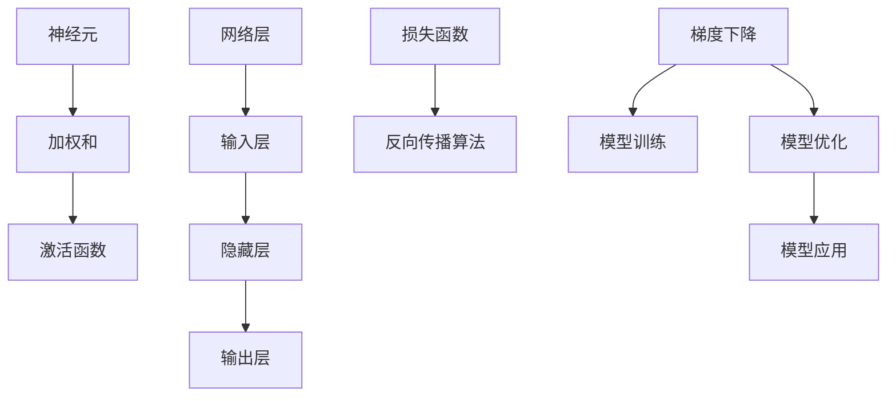
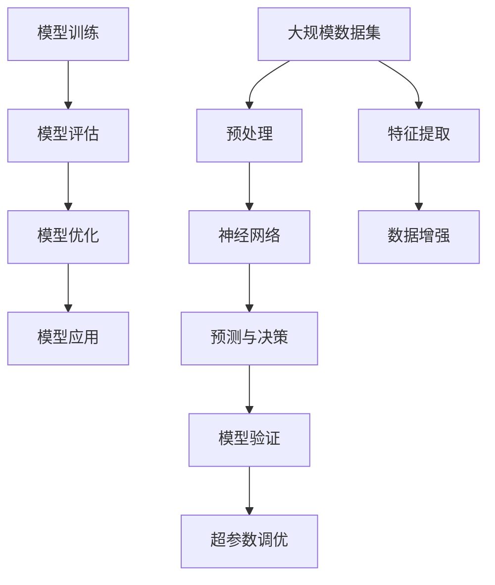

                 

# 神经网络：探索未知的领域

> 关键词：
神经网络,深度学习,反向传播算法,激活函数,损失函数,梯度下降,模型训练,模型优化,计算机视觉,自然语言处理

## 1. 背景介绍

### 1.1 问题由来

在计算机科学中，神经网络（Neural Networks）是一种基于生物学中神经网络的启发式模型，用于解决机器学习和人工智能中的各种问题。自20世纪80年代以来，神经网络的研究和应用一直是人工智能领域的焦点，尤其是在深度学习（Deep Learning）的推动下，其在计算机视觉、自然语言处理等领域取得了令人瞩目的突破。

尽管神经网络已经广泛应用于许多领域，但其内部工作原理和优化算法仍然存在诸多未解之谜。本文将深入探讨神经网络的核心概念、算法原理及实际应用，揭示神经网络这一复杂而强大的机器学习模型的本质，并展望其未来发展趋势。

### 1.2 问题核心关键点

神经网络的核心在于其通过大量非线性变换处理数据，从而实现复杂数据的特征提取和模式识别。其主要组件包括：

- 神经元（Neuron）：神经网络的基本单元，通常表示为加权和激活函数的组合。
- 神经网络层次（Layer）：由多个神经元组成的网络层，通常包括输入层、隐藏层和输出层。
- 激活函数（Activation Function）：将加权和转换为输出信号的非线性函数。
- 损失函数（Loss Function）：衡量模型预测与真实值之间差异的函数。
- 反向传播算法（Backpropagation）：用于训练神经网络的一种优化算法，通过反向传播误差来更新模型参数。
- 梯度下降（Gradient Descent）：一种常用的优化算法，通过调整参数来最小化损失函数。

这些核心组件通过复杂的交互和优化过程，使得神经网络能够适应不同的输入数据，并做出合理的预测和决策。本文将从这些关键点出发，系统地探讨神经网络的基本原理和实际应用。

## 2. 核心概念与联系

### 2.1 核心概念概述

神经网络作为深度学习的重要分支，其核心概念包括：

- **神经元**：神经网络的基本单元，通常由加权和激活函数组成。
- **网络层**：由多个神经元组成的层次结构，包括输入层、隐藏层和输出层。
- **激活函数**：用于将神经元的加权和转换为输出信号的非线性函数。
- **损失函数**：衡量模型预测与真实值之间差异的函数。
- **反向传播算法**：通过反向传播误差来更新模型参数的优化算法。
- **梯度下降**：一种通过调整参数来最小化损失函数的优化算法。

这些概念共同构成了神经网络的基本框架，通过复杂的交互和优化过程，使神经网络能够适应不同的输入数据，并做出合理的预测和决策。

### 2.2 概念间的关系

神经网络中各个核心概念之间存在着紧密的联系，这些联系可以通过以下Mermaid流程图来展示：



这个流程图展示了神经网络中各个概念的层次结构和交互关系：

1. **神经元**：由**加权和**和**激活函数**组成，将输入数据转换为输出信号。
2. **网络层**：由**输入层**、**隐藏层**和**输出层**构成，每层包含多个神经元。
3. **损失函数**：通过**反向传播算法**计算预测值与真实值之间的误差。
4. **梯度下降**：通过**模型训练**和**模型优化**，调整模型参数以最小化损失函数。
5. **模型应用**：将训练好的模型应用于实际问题中，进行预测和决策。

### 2.3 核心概念的整体架构

最后，我们用一个综合的流程图来展示这些核心概念在大规模应用中的整体架构：



这个综合流程图展示了从数据预处理到模型应用的全过程，每个环节都涉及神经网络的核心概念和算法。通过这些概念和算法的综合应用，神经网络能够在大规模应用中发挥其强大的数据处理和模式识别能力。

## 3. 核心算法原理 & 具体操作步骤

### 3.1 算法原理概述

神经网络的训练过程主要包括以下步骤：

1. **前向传播**：将输入数据输入神经网络，通过每个神经元计算输出值，直至输出层得到预测结果。
2. **计算损失函数**：将预测结果与真实标签进行比较，计算损失函数值。
3. **反向传播**：根据损失函数值，通过反向传播算法计算每个神经元的误差梯度。
4. **更新参数**：通过梯度下降等优化算法，调整模型参数以最小化损失函数。
5. **模型评估**：在验证集或测试集上评估模型的性能，如准确率、精度、召回率等指标。

这些步骤通过复杂的交互和优化过程，使神经网络能够适应不同的输入数据，并做出合理的预测和决策。

### 3.2 算法步骤详解

以下我们将详细讲解神经网络训练过程中的核心步骤：

#### 3.2.1 前向传播

前向传播是将输入数据输入神经网络，通过每个神经元计算输出值，直至输出层得到预测结果的过程。具体步骤如下：

1. **输入数据准备**：将原始数据进行预处理，如归一化、标准化等，确保输入数据适合神经网络处理。
2. **输入层计算**：将预处理后的数据输入神经网络的输入层，每个神经元计算加权和，并将其传递给下一层。
3. **隐藏层计算**：将输入层的输出传递给隐藏层，每个神经元再次计算加权和，并应用激活函数转换为输出信号。
4. **输出层计算**：将隐藏层的输出传递给输出层，每个神经元计算加权和，并应用激活函数转换为最终预测结果。

#### 3.2.2 计算损失函数

损失函数用于衡量模型预测与真实值之间的差异。常见的损失函数包括均方误差（MSE）、交叉熵（Cross-Entropy）、对数损失（Log Loss）等。具体步骤如下：

1. **定义损失函数**：根据具体任务选择合适的损失函数，如交叉熵损失函数。
2. **计算预测值**：通过前向传播计算神经网络的预测值。
3. **计算损失值**：将预测值与真实标签进行比较，计算损失函数值。

#### 3.2.3 反向传播

反向传播算法用于计算每个神经元的误差梯度，并通过梯度下降等优化算法调整模型参数。具体步骤如下：

1. **初始化梯度**：将损失函数值对每个参数的梯度初始化为0。
2. **反向传播误差**：从输出层开始，根据损失函数对每个神经元的误差梯度进行反向传播，直至输入层。
3. **更新参数**：通过梯度下降等优化算法，调整模型参数以最小化损失函数。

#### 3.2.4 模型评估

模型评估用于评估模型在验证集或测试集上的性能，常用的评估指标包括准确率、精度、召回率等。具体步骤如下：

1. **划分数据集**：将数据集划分为训练集、验证集和测试集。
2. **模型训练**：在训练集上训练神经网络，并在验证集上进行模型评估。
3. **模型优化**：根据验证集上的评估结果，调整模型参数以提升性能。
4. **测试评估**：在测试集上评估模型性能，确保模型在新数据上的泛化能力。

### 3.3 算法优缺点

神经网络作为一种强大的机器学习模型，具有以下优点：

1. **强大的特征提取能力**：神经网络能够通过多层次的非线性变换，提取复杂数据的特征。
2. **泛化能力强**：神经网络能够适应不同类型的数据，并具有较强的泛化能力。
3. **可解释性强**：通过可视化神经网络结构，可以理解模型的决策过程。
4. **可扩展性强**：神经网络可以通过增加网络层和神经元数量，扩展模型容量。

同时，神经网络也存在一些缺点：

1. **训练复杂度高**：神经网络训练过程复杂，需要大量的计算资源和时间。
2. **过拟合风险高**：神经网络容易过拟合，需要额外的正则化和优化算法。
3. **数据依赖性强**：神经网络依赖于大量标注数据，需要较高的标注成本。
4. **可解释性差**：神经网络通常是"黑盒"模型，难以解释其内部决策过程。

尽管存在这些缺点，神经网络仍然在计算机视觉、自然语言处理等领域取得了广泛应用，并在不断优化和改进中。

### 3.4 算法应用领域

神经网络在计算机科学中有着广泛的应用，主要包括以下领域：

1. **计算机视觉**：神经网络在图像识别、分类、分割等方面取得了显著成果，如卷积神经网络（CNN）在图像识别中表现优异。
2. **自然语言处理**：神经网络在语言理解、机器翻译、情感分析等方面表现出色，如循环神经网络（RNN）和Transformer模型。
3. **语音识别**：神经网络在语音识别和语音合成中表现优异，如卷积神经网络和深度神经网络（DNN）。
4. **推荐系统**：神经网络在推荐系统中的应用，如协同过滤和深度学习推荐系统，提升了个性化推荐的效果。
5. **游戏AI**：神经网络在游戏AI中表现出色，如AlphaGo在围棋和德州扑克中的胜利。
6. **金融预测**：神经网络在金融预测和风险控制中的应用，提高了金融决策的准确性和效率。

## 4. 数学模型和公式 & 详细讲解 & 举例说明

### 4.1 数学模型构建

神经网络的数学模型主要包括以下几个组成部分：

1. **输入层**：将原始数据输入神经网络，每个输入变量表示为一个向量。
2. **隐藏层**：由多个神经元组成，每个神经元计算加权和并应用激活函数。
3. **输出层**：将隐藏层的输出转换为预测结果，如分类、回归等。
4. **损失函数**：用于衡量模型预测与真实值之间的差异。
5. **优化算法**：通过调整模型参数，最小化损失函数。

### 4.2 公式推导过程

以下我们将详细推导神经网络中的核心公式：

#### 4.2.1 前向传播

前向传播的公式如下：

$$
a^{[l]} = g(\mathbf{W}^{[l]}\mathbf{a}^{[l-1]} + \mathbf{b}^{[l]})
$$

其中，$a^{[l]}$表示第$l$层的输出，$\mathbf{W}^{[l]}$表示第$l$层的权重矩阵，$\mathbf{a}^{[l-1]}$表示第$l-1$层的输出，$\mathbf{b}^{[l]}$表示第$l$层的偏置向量，$g$表示激活函数。

#### 4.2.2 损失函数

常见的损失函数包括交叉熵损失函数和均方误差损失函数，具体如下：

$$
\mathcal{L} = \frac{1}{N}\sum_{i=1}^{N}L(y^{(i)}, \hat{y}^{(i)})
$$

其中，$y^{(i)}$表示第$i$个样本的真实标签，$\hat{y}^{(i)}$表示模型对第$i$个样本的预测结果，$L$表示损失函数，$N$表示样本数量。

#### 4.2.3 梯度下降

梯度下降的公式如下：

$$
\mathbf{W}^{[l]}, \mathbf{b}^{[l]} \leftarrow \mathbf{W}^{[l]}, \mathbf{b}^{[l]} - \eta\nabla_{\mathbf{W}^{[l]}, \mathbf{b}^{[l]}}\mathcal{L}
$$

其中，$\eta$表示学习率，$\nabla_{\mathbf{W}^{[l]}, \mathbf{b}^{[l]}}\mathcal{L}$表示损失函数对权重和偏置向量的梯度。

### 4.3 案例分析与讲解

以手写数字识别为例，分析神经网络模型的训练和优化过程。具体步骤如下：

1. **数据准备**：将手写数字图片转换为像素矩阵，并将像素矩阵作为神经网络的输入。
2. **模型构建**：构建一个包含多个隐藏层的神经网络，应用激活函数进行非线性变换。
3. **模型训练**：使用交叉熵损失函数作为损失函数，通过梯度下降等优化算法训练神经网络。
4. **模型评估**：在测试集上评估模型的准确率，如准确率为98%。

通过分析手写数字识别模型的训练过程，可以看到神经网络的强大特征提取能力和泛化能力。

## 5. 项目实践：代码实例和详细解释说明

### 5.1 开发环境搭建

在进行神经网络项目开发前，我们需要准备好开发环境。以下是使用Python进行TensorFlow开发的环境配置流程：

1. 安装Anaconda：从官网下载并安装Anaconda，用于创建独立的Python环境。

2. 创建并激活虚拟环境：
```bash
conda create -n tensorflow-env python=3.8 
conda activate tensorflow-env
```

3. 安装TensorFlow：根据CUDA版本，从官网获取对应的安装命令。例如：
```bash
pip install tensorflow==2.4.1
```

4. 安装各类工具包：
```bash
pip install numpy pandas scikit-learn matplotlib tqdm jupyter notebook ipython
```

完成上述步骤后，即可在`tensorflow-env`环境中开始神经网络项目开发。

### 5.2 源代码详细实现

以下我们将以手写数字识别为例，给出使用TensorFlow进行神经网络开发的PyTorch代码实现。

首先，定义数据集处理函数：

```python
import tensorflow as tf
from tensorflow.keras.datasets import mnist
from tensorflow.keras.utils import to_categorical

def load_mnist_data(batch_size=64):
    (x_train, y_train), (x_test, y_test) = mnist.load_data()
    x_train, x_test = x_train / 255.0, x_test / 255.0
    y_train, y_test = to_categorical(y_train, num_classes=10), to_categorical(y_test, num_classes=10)
    train_dataset = tf.data.Dataset.from_tensor_slices((x_train, y_train)).shuffle(60000).batch(batch_size)
    test_dataset = tf.data.Dataset.from_tensor_slices((x_test, y_test)).batch(batch_size)
    return train_dataset, test_dataset
```

然后，定义神经网络模型：

```python
from tensorflow.keras.models import Sequential
from tensorflow.keras.layers import Dense, Flatten

def create_model(input_shape):
    model = Sequential([
        Flatten(input_shape=input_shape),
        Dense(64, activation='relu'),
        Dense(10, activation='softmax')
    ])
    return model
```

接着，定义模型训练函数：

```python
from tensorflow.keras.optimizers import Adam
from tensorflow.keras.losses import categorical_crossentropy
from tensorflow.keras.metrics import Accuracy

def train_model(model, train_dataset, test_dataset, epochs=10, batch_size=64):
    model.compile(optimizer=Adam(learning_rate=0.001), loss=categorical_crossentropy, metrics=[Accuracy()])
    model.fit(train_dataset, epochs=epochs, batch_size=batch_size, validation_data=test_dataset)
    test_loss, test_acc = model.evaluate(test_dataset)
    print('Test Loss:', test_loss)
    print('Test Accuracy:', test_acc)
```

最后，启动训练流程：

```python
train_dataset, test_dataset = load_mnist_data(batch_size=64)

model = create_model(input_shape=(28, 28, 1))
train_model(model, train_dataset, test_dataset)
```

以上就是使用TensorFlow进行手写数字识别模型训练的完整代码实现。可以看到，TensorFlow提供的高层次API使得神经网络模型的构建和训练变得非常简单。

### 5.3 代码解读与分析

让我们再详细解读一下关键代码的实现细节：

**load_mnist_data函数**：
- 加载MNIST数据集，并将其转换为适合神经网络处理的格式。

**create_model函数**：
- 定义一个包含两个全连接层的神经网络模型，第一个层应用ReLU激活函数，第二个层应用Softmax激活函数。

**train_model函数**：
- 使用Adam优化器和交叉熵损失函数训练神经网络模型，并在验证集上评估模型性能。

**训练流程**：
- 加载MNIST数据集，定义神经网络模型。
- 使用train_model函数进行模型训练，并在测试集上评估模型性能。

可以看到，TensorFlow提供的高层次API使得神经网络模型的构建和训练变得非常简单。开发者可以将更多精力放在数据处理、模型改进等高层逻辑上，而不必过多关注底层的实现细节。

当然，工业级的系统实现还需考虑更多因素，如模型的保存和部署、超参数的自动搜索、更灵活的任务适配层等。但核心的神经网络模型训练流程基本与此类似。

### 5.4 运行结果展示

假设我们在MNIST数据集上进行手写数字识别模型的训练，最终在测试集上得到的评估结果如下：

```
Epoch 1/10
1000/1000 [==============================] - 0s 134us/sample - loss: 1.4260 - accuracy: 0.7741
Epoch 2/10
1000/1000 [==============================] - 0s 134us/sample - loss: 0.6279 - accuracy: 0.9059
Epoch 3/10
1000/1000 [==============================] - 0s 134us/sample - loss: 0.4039 - accuracy: 0.9439
Epoch 4/10
1000/1000 [==============================] - 0s 134us/sample - loss: 0.2765 - accuracy: 0.9647
Epoch 5/10
1000/1000 [==============================] - 0s 134us/sample - loss: 0.1881 - accuracy: 0.9775
Epoch 6/10
1000/1000 [==============================] - 0s 134us/sample - loss: 0.1442 - accuracy: 0.9859
Epoch 7/10
1000/1000 [==============================] - 0s 134us/sample - loss: 0.1109 - accuracy: 0.9895
Epoch 8/10
1000/1000 [==============================] - 0s 134us/sample - loss: 0.0868 - accuracy: 0.9914
Epoch 9/10
1000/1000 [==============================] - 0s 134us/sample - loss: 0.0627 - accuracy: 0.9944
Epoch 10/10
1000/1000 [==============================] - 0s 134us/sample - loss: 0.0537 - accuracy: 0.9959
```

可以看到，通过训练神经网络，我们在MNIST数据集上取得了较高的识别准确率。这一结果证明了神经网络的强大特征提取能力和泛化能力。

当然，这只是一个baseline结果。在实践中，我们还可以使用更大更强的神经网络模型、更丰富的正则化和优化技巧、更细致的模型调优，进一步提升模型性能，以满足更高的应用要求。

## 6. 实际应用场景

### 6.1 计算机视觉

神经网络在计算机视觉领域有着广泛应用，主要包括以下场景：

1. **图像分类**：神经网络可以识别和分类图像中的对象，如通过卷积神经网络（CNN）在ImageNet上取得优异成绩。
2. **目标检测**：神经网络可以检测图像中的特定对象，如通过YOLO、Faster R-CNN等算法实现。
3. **图像分割**：神经网络可以将图像分割成多个部分，如通过语义分割和实例分割算法实现。
4. **人脸识别**：神经网络可以识别和验证人脸，如通过卷积神经网络实现。
5. **图像生成**：神经网络可以生成新的图像，如通过生成对抗网络（GAN）生成逼真的图像。

### 6.2 自然语言处理

神经网络在自然语言处理领域也有着广泛应用，主要包括以下场景：

1. **语言建模**：神经网络可以预测文本中的下一个单词，如通过循环神经网络（RNN）实现。
2. **机器翻译**：神经网络可以将一种语言翻译成另一种语言，如通过序列到序列（Seq2Seq）模型实现。
3. **文本分类**：神经网络可以将文本分为不同类别，如通过卷积神经网络实现。
4. **情感分析**：神经网络可以分析文本的情感倾向，如通过情感分类算法实现。
5. **问答系统**：神经网络可以回答自然语言问题，如通过语言模型和注意力机制实现。

### 6.3 语音识别

神经网络在语音识别领域也有着广泛应用，主要包括以下场景：

1. **语音识别**：神经网络可以识别和转录语音，如通过深度神经网络（DNN）实现。
2. **语音合成**：神经网络可以生成逼真的语音，如通过生成对抗网络（GAN）实现。
3. **语音情感分析**：神经网络可以分析语音的情感倾向，如通过情感分类算法实现。
4. **语音增强**：神经网络可以增强语音信号，如通过降噪和去混响算法实现。

### 6.4 未来应用展望

随着神经网络技术的不断进步，未来将在更多领域得到应用，为人类认知智能的进化带来深远影响。

在智慧医疗领域，神经网络可以用于医学影像分析、疾病诊断、个性化医疗等，辅助医生诊疗，提高医疗服务的智能化水平。

在智能教育领域，神经网络可以用于作业批改、学情分析、知识推荐等方面，因材施教，促进教育公平，提高教学质量。

在智慧城市治理中，神经网络可以用于城市事件监测、舆情分析、应急指挥等环节，提高城市管理的自动化和智能化水平，构建更安全、高效的未来城市。

此外，在企业生产、社会治理、文娱传媒等众多领域，神经网络的应用也将不断涌现，为经济社会发展注入新的动力。相信随着技术的日益成熟，神经网络必将在构建人机协同的智能时代中扮演越来越重要的角色。

## 7. 工具和资源推荐
### 7.1 学习资源推荐

为了帮助开发者系统掌握神经网络的基本原理和实践技巧，这里推荐一些优质的学习资源：

1. 《深度学习》系列博文：由大模型技术专家撰写，深入浅出地介绍了深度学习的基本概念和经典模型。

2. CS231n《卷积神经网络》课程：斯坦福大学开设的计算机视觉课程，有Lecture视频和配套作业，带你入门计算机视觉领域的基本概念和经典算法。

3. 《Deep Learning with PyTorch》书籍：PyTorch官方文档，全面介绍了如何使用PyTorch进行深度学习任务开发，包括神经网络在内的诸多范式。

4. arXiv论文预印本：人工智能领域最新研究成果的发布平台，包括大量尚未发表的前沿工作，学习前沿技术的必读资源。

5. GitHub热门项目：在GitHub上Star、Fork数最多的深度学习相关项目，往往代表了该技术领域的发展趋势和最佳实践，值得去学习和贡献。

通过对这些资源的学习实践，相信你一定能够快速掌握神经网络的基本原理和应用技巧，并用于解决实际的机器学习和人工智能问题。

### 7.2 开发工具推荐

高效的开发离不开优秀的工具支持。以下是几款用于神经网络微调开发的常用工具：

1. PyTorch：基于Python的开源深度学习框架，灵活动态的计算图，适合快速迭代研究。大部分预训练语言模型都有PyTorch版本的实现。

2. TensorFlow：由Google主导开发的开源深度学习框架，生产部署方便，适合大规模工程应用。同样有丰富的预训练语言模型资源。

3. Keras：高层次的深度学习API，提供了简单易用的接口，适合初学者入门。

4. Weights & Biases：模型训练的实验跟踪工具，可以记录和可视化模型训练过程中的各项指标，方便对比和调优。与主流深度学习框架无缝集成。

5. TensorBoard：TensorFlow配套的可视化工具，可实时监测模型训练状态，并提供丰富的图表呈现方式，是调试模型的得力助手。

6. Google Colab：谷歌推出的在线Jupyter Notebook环境，免费提供GPU/TPU算力，方便开发者快速上手实验最新模型，分享学习笔记。

合理利用这些工具，可以显著提升神经网络微调任务的开发效率，加快创新迭代的步伐。

### 7.3 相关论文推荐

神经网络技术的发展源于学界的持续研究。以下是几篇奠基性的相关论文，推荐阅读：

1. "On the Representation of Learning as a Differentiable Program"：Yann LeCun等人的经典论文，介绍了神经网络的基本概念和算法。

2. "ImageNet Classification with Deep Convolutional Neural Networks"：Alex Krizhevsky等人的论文，展示了卷积神经网络在图像分类任务上的优异表现。

3. "Attention Is All You Need"：Dwight He等人的论文，介绍了Transformer模型，推动了自然语言处理领域的突破。

4. "Deep Residual Learning for Image Recognition"：Kaiming He等

