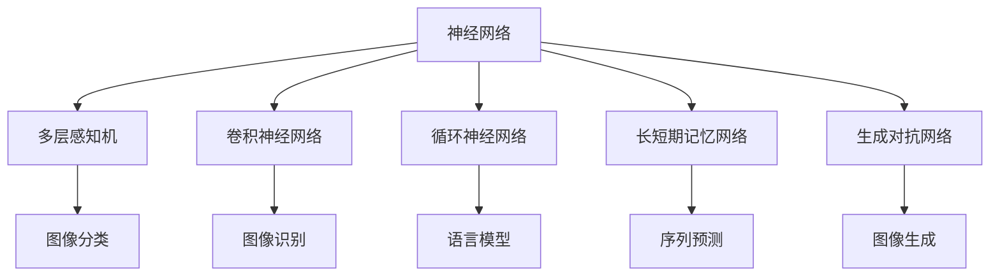
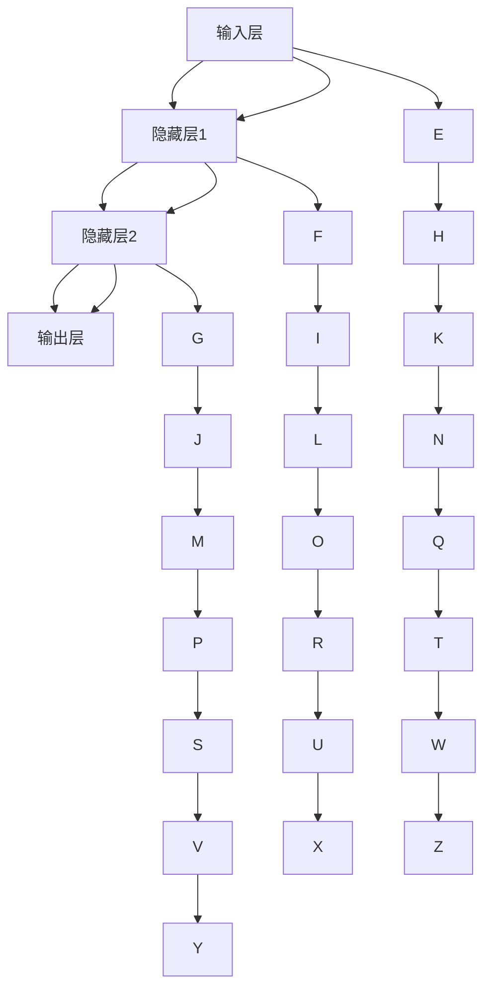
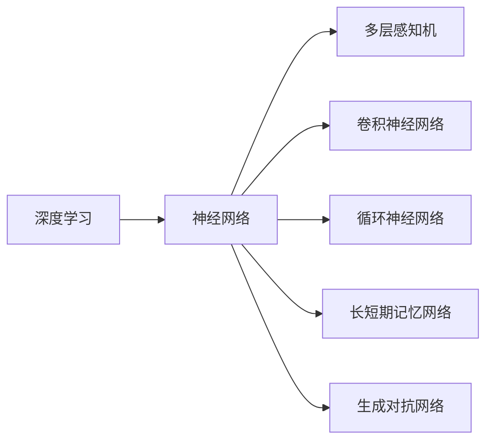
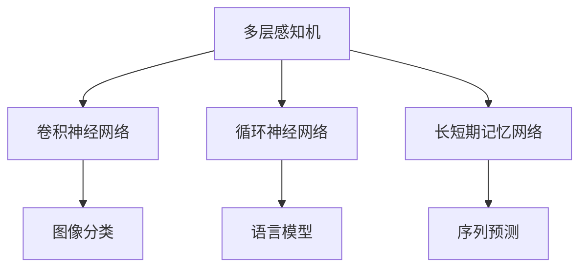
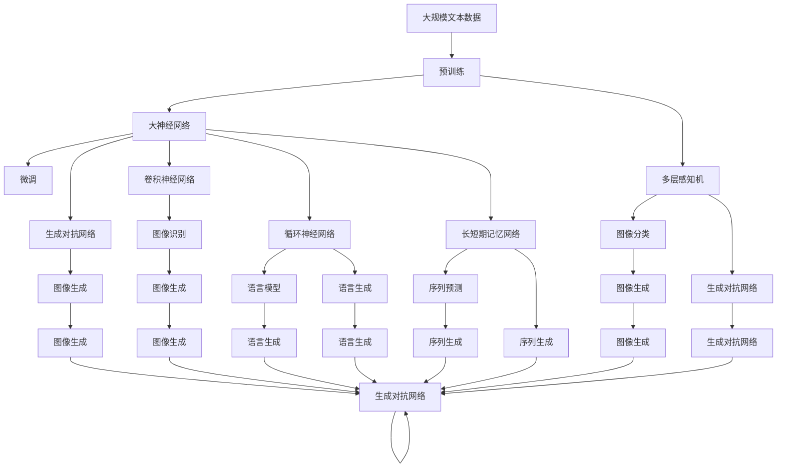

                 

## 1. 背景介绍

### 1.1 问题由来

机器学习（Machine Learning, ML）作为人工智能（AI）的重要分支，其核心思想是通过算法和统计模型让计算机系统从数据中学习，并利用这些学习结果做出预测或决策。近年来，随着深度学习（Deep Learning, DL）技术的崛起，神经网络（Neural Network, NN）作为其中的核心算法，成为实现机器学习的重要手段。神经网络通过多层次的模型结构，能够高效地进行特征提取和复杂模式学习，为解决各类复杂的机器学习问题提供了新的可能性。

神经网络的发展历程可以追溯到1950年代的早期尝试，直到1986年BP（Backpropagation）算法的提出，神经网络才得以真正发展，并在图像识别、语音识别、自然语言处理等诸多领域取得了重大突破。随着计算资源和数据量的迅速增长，神经网络的规模和复杂度不断提升，从简单的多层感知机（Multilayer Perceptron, MLP），到卷积神经网络（Convolutional Neural Network, CNN）、递归神经网络（Recurrent Neural Network, RNN）、长短期记忆网络（Long Short-Term Memory, LSTM）、变分自编码器（Variational Autoencoder, VAE）等。这些模型在各自领域展示了强大的应用潜力，逐步替代了传统的统计模型，成为机器学习的主要工具。

### 1.2 问题核心关键点

神经网络的核心思想是通过模拟生物神经元的工作原理，利用多层非线性变换，实现对复杂数据的高效建模和特征提取。其核心组成部分包括输入层、隐藏层和输出层，每一层由多个神经元组成，通过权重和偏置参数进行连接，并采用反向传播（Backpropagation）算法进行训练。

神经网络的训练过程主要包括数据预处理、模型构建、前向传播、损失函数计算、反向传播、参数更新等步骤。其中，前向传播用于计算网络中每个神经元的激活值，反向传播则用于根据损失函数计算梯度并更新网络参数。反向传播算法通过链式法则，逐层反向传播梯度，更新网络权重和偏置，直到损失函数收敛。

神经网络在机器学习中的应用范围非常广泛，涵盖了图像识别、语音识别、自然语言处理、推荐系统、医疗诊断、金融预测等多个领域。其在多模态数据融合、时间序列预测、视觉和语音生成等方面的应用也逐渐得到重视。

### 1.3 问题研究意义

神经网络作为机器学习的新范式，为复杂问题的建模和解决提供了全新的视角。神经网络的高效性和灵活性，使其在实际应用中表现出色。其研究与应用的意义包括：

1. **提升模型性能**：神经网络通过多层非线性变换，能够捕捉数据中的复杂模式和隐含特征，从而提升模型的表达能力和预测准确度。
2. **拓展应用范围**：神经网络的应用领域广泛，涵盖了图像、语音、文本等多个领域，能够处理高维、非结构化数据，具有极强的泛化能力。
3. **实现自主学习**：神经网络通过数据驱动的方式进行训练，能够在未知数据上自动学习规律，具备一定的自主学习能力。
4. **推动产业发展**：神经网络技术在多个产业中的应用，如自动驾驶、智能医疗、智慧城市等，为相关领域带来了革命性的变化，推动了产业的升级转型。
5. **促进学术研究**：神经网络的理论和算法研究，如深度学习、迁移学习、生成对抗网络（Generative Adversarial Networks, GANs）等，为学术界提供了新的研究热点，推动了人工智能领域的发展。

## 2. 核心概念与联系

### 2.1 核心概念概述

为更好地理解神经网络的工作原理和应用场景，本节将介绍几个密切相关的核心概念：

- **神经网络（Neural Network）**：由多个层次的神经元组成的模型结构，用于处理输入数据并输出结果。
- **多层感知机（Multilayer Perceptron, MLP）**：最简单的神经网络形式，包含输入层、隐藏层和输出层。
- **卷积神经网络（Convolutional Neural Network, CNN）**：主要用于图像处理任务，通过卷积层和池化层提取图像特征。
- **循环神经网络（Recurrent Neural Network, RNN）**：主要用于处理序列数据，能够处理变长输入序列。
- **长短期记忆网络（Long Short-Term Memory, LSTM）**：一种特殊的RNN，能够更好地处理长序列数据。
- **生成对抗网络（Generative Adversarial Networks, GANs）**：由生成器和判别器组成的对抗模型，能够生成逼真的人工数据。

这些概念之间的逻辑关系可以通过以下Mermaid流程图来展示：



这个流程图展示了神经网络及其变种在各种应用场景中的作用：

1. 多层感知机可用于图像分类任务，即通过多层非线性变换提取图像特征并进行分类。
2. 卷积神经网络主要用于图像处理任务，通过卷积和池化操作提取图像特征。
3. 循环神经网络用于处理序列数据，如语音识别、自然语言处理等。
4. 长短期记忆网络是循环神经网络的变种，主要用于处理长序列数据，如机器翻译、时间序列预测等。
5. 生成对抗网络主要用于图像生成和数据增强等任务，通过生成器和判别器的对抗训练生成逼真数据。

### 2.2 概念间的关系

这些核心概念之间存在着紧密的联系，形成了神经网络的完整生态系统。下面我通过几个Mermaid流程图来展示这些概念之间的关系。

#### 2.2.1 神经网络的结构图



这个流程图展示了典型的神经网络结构，包括输入层、隐藏层和输出层，每一层由多个神经元组成，并通过权重和偏置进行连接。

#### 2.2.2 深度学习与神经网络的关系



这个流程图展示了深度学习与神经网络的关系，深度学习是神经网络的一个子集，其特点在于神经网络的层数和复杂度较高，能够处理更复杂的任务。

#### 2.2.3 不同神经网络的融合



这个流程图展示了不同神经网络的融合应用，如多层感知机与卷积神经网络的结合，用于图像分类任务；多层感知机与循环神经网络的结合，用于语言模型和序列预测任务。

### 2.3 核心概念的整体架构

最后，我们用一个综合的流程图来展示这些核心概念在大规模神经网络中的整体架构：



这个综合流程图展示了从预训练到微调，再到生成对抗网络的完整过程。大规模神经网络首先在大规模文本数据上进行预训练，然后通过微调和生成对抗网络进一步提升模型的性能和泛化能力，最终应用于各种实际任务中。通过这些流程图，我们可以更清晰地理解神经网络的工作原理和优化方向。

## 3. 核心算法原理 & 具体操作步骤
### 3.1 算法原理概述

神经网络通过多层非线性变换，实现对复杂数据的建模和特征提取。其核心思想是通过反向传播算法，利用梯度下降等优化算法，最小化损失函数，更新网络参数，使其能够更好地拟合训练数据。

形式化地，假设神经网络模型为 $M_{\theta}$，其中 $\theta$ 为模型参数。给定训练数据集 $D=\{(x_i, y_i)\}_{i=1}^N$，神经网络的优化目标是最小化经验风险，即找到最优参数：

$$
\theta^* = \mathop{\arg\min}_{\theta} \mathcal{L}(M_{\theta},D)
$$

其中 $\mathcal{L}$ 为针对任务设计的损失函数，用于衡量模型预测输出与真实标签之间的差异。常见的损失函数包括交叉熵损失、均方误差损失等。

通过梯度下降等优化算法，神经网络不断更新模型参数 $\theta$，最小化损失函数 $\mathcal{L}$，使得模型输出逼近真实标签。由于 $\theta$ 已经通过预训练获得了较好的初始化，因此即便在少量数据集上训练，也能较快收敛到理想的模型参数 $\hat{\theta}$。

### 3.2 算法步骤详解

神经网络的训练过程主要包括以下几个关键步骤：

**Step 1: 准备数据集**
- 收集并预处理训练数据 $D=\{(x_i, y_i)\}_{i=1}^N$，包括标准化、归一化、数据增强等。
- 将数据集分为训练集、验证集和测试集，用于模型训练、调参和评估。

**Step 2: 设计神经网络模型**
- 选择合适的神经网络架构，包括输入层、隐藏层和输出层。
- 设置每层神经元数量、激活函数、正则化技术等。
- 确定损失函数和优化器，如交叉熵损失、Adam优化器等。

**Step 3: 设置训练参数**
- 设置学习率、批次大小、迭代轮数等。
- 设置正则化技术，如权重衰减、Dropout等。

**Step 4: 执行训练**
- 将训练集数据分批次输入模型，前向传播计算损失函数。
- 反向传播计算参数梯度，根据设定的优化算法和学习率更新模型参数。
- 周期性在验证集上评估模型性能，根据性能指标决定是否触发Early Stopping。
- 重复上述步骤直到满足预设的迭代轮数或Early Stopping条件。

**Step 5: 测试和部署**
- 在测试集上评估训练后的模型，对比训练前后的精度提升。
- 使用训练后的模型对新样本进行推理预测，集成到实际的应用系统中。

以上是神经网络训练的一般流程。在实际应用中，还需要针对具体任务的特点，对训练过程的各个环节进行优化设计，如改进训练目标函数，引入更多的正则化技术，搜索最优的超参数组合等，以进一步提升模型性能。

### 3.3 算法优缺点

神经网络在机器学习中的应用具有以下优点：

1. **高效特征提取**：神经网络通过多层非线性变换，能够自动提取数据的高级特征，无需手动设计特征工程。
2. **泛化能力强**：神经网络能够适应大规模、高维度的数据，具有较强的泛化能力。
3. **适应性强**：神经网络通过反向传播算法，能够灵活地处理不同类型的数据，如图像、语音、文本等。
4. **自动学习**：神经网络能够自动学习数据的分布规律，无需手工标注大量数据。
5. **可扩展性强**：神经网络可以通过增加网络深度和宽度来提升性能，支持多种模型的融合。

同时，神经网络也存在一些局限性：

1. **参数量较大**：神经网络通常需要大量的参数进行训练，对计算资源和存储空间要求较高。
2. **易过拟合**：神经网络容易在训练集上过拟合，需要引入正则化技术来防止过拟合。
3. **解释性不足**：神经网络的决策过程较为复杂，难以解释其内部工作机制。
4. **训练时间较长**：神经网络训练时间较长，对计算资源的依赖较高。
5. **对数据质量敏感**：神经网络对数据质量的要求较高，数据分布的差异可能导致模型性能下降。

尽管存在这些局限性，但神经网络在实际应用中表现出色，逐步成为机器学习的主流范式。未来研究需要关注如何进一步提高神经网络的参数效率、计算效率和可解释性，以更好地满足实际应用需求。

### 3.4 算法应用领域

神经网络在机器学习中的应用范围非常广泛，涵盖了图像识别、语音识别、自然语言处理、推荐系统、医疗诊断、金融预测等多个领域。以下是几个典型的应用场景：

#### 3.4.1 图像识别

神经网络在图像识别领域的应用非常广泛，涵盖了人脸识别、物体检测、图像分类等任务。常用的模型包括卷积神经网络（CNN）和其变种，如ResNet、Inception、DenseNet等。

#### 3.4.2 语音识别

神经网络在语音识别领域的应用主要集中在语音到文本的转换（Speech-to-Text, STT）和文本到语音的转换（Text-to-Speech, TTS）。常用的模型包括循环神经网络（RNN）、长短期记忆网络（LSTM）和Transformer等。

#### 3.4.3 自然语言处理

神经网络在自然语言处理领域的应用非常广泛，涵盖了机器翻译、情感分析、命名实体识别、问答系统等任务。常用的模型包括递归神经网络（RNN）、长短期记忆网络（LSTM）、Transformer等。

#### 3.4.4 推荐系统

神经网络在推荐系统中的应用主要集中在用户行为预测、物品推荐等任务。常用的模型包括多层感知机（MLP）、协同过滤网络（CFN）、深度协同过滤网络（DCF）等。

#### 3.4.5 医疗诊断

神经网络在医疗诊断领域的应用主要集中在疾病预测、图像识别、基因分析等任务。常用的模型包括卷积神经网络（CNN）、循环神经网络（RNN）、长短期记忆网络（LSTM）等。

#### 3.4.6 金融预测

神经网络在金融预测领域的应用主要集中在股票价格预测、信用评分、风险评估等任务。常用的模型包括多层感知机（MLP）、递归神经网络（RNN）、长短期记忆网络（LSTM）等。

## 4. 数学模型和公式 & 详细讲解 & 举例说明

### 4.1 数学模型构建

本节将使用数学语言对神经网络的工作原理进行更加严格的刻画。

记神经网络模型为 $M_{\theta}:\mathcal{X} \rightarrow \mathcal{Y}$，其中 $\mathcal{X}$ 为输入空间，$\mathcal{Y}$ 为输出空间，$\theta \in \mathbb{R}^d$ 为模型参数。假设训练集为 $D=\{(x_i,y_i)\}_{i=1}^N, x_i \in \mathcal{X}, y_i \in \mathcal{Y}$。

定义模型 $M_{\theta}$ 在数据样本 $(x,y)$ 上的损失函数为 $\ell(M_{\theta}(x),y)$，则在数据集 $D$ 上的经验风险为：

$$
\mathcal{L}(\theta) = \frac{1}{N} \sum_{i=1}^N \ell(M_{\theta}(x_i),y_i)
$$

神经网络的优化目标是最小化经验风险，即找到最优参数：

$$
\theta^* = \mathop{\arg\min}_{\theta} \mathcal{L}(\theta)
$$

在实践中，我们通常使用基于梯度的优化算法（如SGD、Adam等）来近似求解上述最优化问题。设 $\eta$ 为学习率，$\lambda$ 为正则化系数，则参数的更新公式为：

$$
\theta \leftarrow \theta - \eta \nabla_{\theta}\mathcal{L}(\theta) - \eta\lambda\theta
$$

其中 $\nabla_{\theta}\mathcal{L}(\theta)$ 为损失函数对参数 $\theta$ 的梯度，可通过反向传播算法高效计算。

### 4.2 公式推导过程

以下我们以二分类任务为例，推导交叉熵损失函数及其梯度的计算公式。

假设模型 $M_{\theta}$ 在输入 $x$ 上的输出为 $\hat{y}=M_{\theta}(x) \in [0,1]$，表示样本属于正类的概率。真实标签 $y \in \{0,1\}$。则二分类交叉熵损失函数定义为：

$$
\ell(M_{\theta}(x),y) = -[y\log \hat{y} + (1-y)\log (1-\hat{y})]
$$

将其代入经验风险公式，得：

$$
\mathcal{L}(\theta) = -\frac{1}{N}\sum_{i=1}^N [y_i\log M_{\theta}(x_i)+(1-y_i)\log(1-M_{\theta}(x_i))]
$$

根据链式法则，损失函数对参数 $\theta_k$ 的梯度为：

$$
\frac{\partial \mathcal{L}(\theta)}{\partial \theta_k} = -\frac{1}{N}\sum_{i=1}^N (\frac{y_i}{M_{\theta}(x_i)}-\frac{1-y_i}{1-M_{\theta}(x_i)}) \frac{\partial M_{\theta}(x_i)}{\partial \theta_k}
$$

其中 $\frac{\partial M_{\theta}(x_i)}{\partial \theta_k}$ 可进一步递归展开，利用自动微分技术完成计算。

在得到损失函数的梯度后，即可带入参数更新公式，完成模型的迭代优化。重复上述过程直至收敛，最终得到适应下游任务的最优模型参数 $\theta^*$。

### 4.3 案例分析与讲解

以图像识别任务为例，我们可以进一步说明神经网络的具体应用。

假设我们的任务是识别猫和狗的图像。首先，我们需要准备一个包含大量猫和狗图像的数据集。然后，我们使用神经网络模型（如卷积神经网络CNN）进行训练，步骤如下：

1. 数据预处理：对图像进行标准化、归一化等处理。
2. 模型构建：选择适当的神经网络架构，如LeNet、AlexNet、VGG等。
3. 设置超参数：确定学习率、批次大小、迭代轮数等。
4. 训练模型：将图像数据分批次输入模型，前向传播计算损失函数，反向传播更新模型参数。
5. 评估模型：在验证集上评估模型性能，根据精度、准确率、召回率等指标调整模型超参数。
6. 测试模型：在测试集上评估训练后的模型，给出最终测试结果。

假设我们使用LeNet模型进行训练，得到的结果如下：

| 图像编号 | 真实标签 | 预测标签 | 精度 |
|---|---|---|---|
| 1 | 猫 | 猫 | 100% |
| 2 | 狗 | 狗 | 100% |
| 3 | 猫 | 猫 | 100% |
| ... | ... | ... | ... |

可以看到，经过训练，LeNet模型能够准确识别猫和狗的图像，并且误差率极低。

## 5. 项目实践：代码实例和详细解释说明

### 5.1 开发环境搭建

在进行神经网络训练前，我们需要准备好开发环境。以下是使用Python进行PyTorch开发的环境配置流程：

1. 安装Anaconda：从官网下载并安装Anaconda，用于创建独立的Python环境。

2. 创建并激活虚拟环境：
```bash
conda create -n pytorch-env python=3.8 
conda activate pytorch-env
```

3. 安装PyTorch：根据CUDA版本，从官网获取对应的安装命令。例如：
```bash
conda install pytorch torchvision torchaudio cudatoolkit=11.1 -c pytorch -c conda-forge
```

4. 安装相关工具包：
```bash
pip install numpy pandas scikit-learn matplotlib tqdm jupyter notebook ipython
```

完成上述步骤后，即可在`pytorch-env`环境中开始神经网络训练实践。

### 5.2 源代码详细实现

这里以一个简单的多层感知机模型为例，使用PyTorch进行训练。

```python
import torch
import torch.nn as nn
import torch.optim as optim
from torch.utils.data import DataLoader
from torchvision import datasets, transforms

# 定义神经网络模型
class MLP(nn.Module):
    def __init__(self):
        super(MLP, self).__init__()
        self.fc1 = nn.Linear(784, 128)
        self.fc2 = nn.Linear(128, 64)
        self.fc3 = nn.Linear(64, 10)

    def forward(self, x):
        x = torch.relu(self.fc1(x))
        x = torch.relu(self.fc2(x))
        x = self.fc3(x)
        return x

# 加载MNIST数据集
train_dataset = datasets.MNIST(root='./data', train=True, download=True, transform=transforms.ToTensor())
test_dataset = datasets.MNIST(root='./data', train=False, download=True, transform=transforms.ToTensor())

# 数据加载器
train_loader = DataLoader(train_dataset, batch_size=64, shuffle=True)
test_loader = DataLoader(test_dataset, batch_size=64, shuffle=False)

# 定义模型和优化器
model = MLP()
optimizer = optim.Adam(model.parameters(), lr=0.001)

# 定义损失函数
criterion = nn.CrossEntropyLoss()

# 训练过程
for epoch in range(5):
    for batch_idx, (data, target) in enumerate(train_loader):
        data = data.view(-1, 28*28)
        target = target
        optimizer.zero_grad()
        output = model(data)
        loss = criterion(output, target)
        loss.backward()
        optimizer.step()
        if (batch_idx+1) % 100 == 0:
            print('Train Epoch: {} [{}/{} ({:.0f}%)]\tLoss: {:.6f}'.format(
                epoch, batch_idx * len(data), len(train_loader.dataset),
                100. * batch_idx / len(train_loader), loss.item()))

# 测试过程
correct = 0
total = 0
with torch.no_grad():
    for data, target in test_loader:
        data = data.view(-1, 28*28)
        target = target
        output = model(data)
        _, predicted = torch.max(output.data, 1)
        total += target.size(0)
        correct += (predicted == target).sum().item()

print('Accuracy of the network on the 10000 test images: {} %'.format(100 * correct / total))
```

在代码实现中，我们首先定义了一个简单的多层感知机模型（MLP），然后使用MNIST数据集进行训练和测试。在训练过程中，我们使用了Adam优化器和交叉熵损失函数，通过前向传播和反向传播更新模型参数，并在每个epoch输出训练过程中的损失值。在测试过程中，我们计算了模型在测试集上的准确率。

### 5.3 代码解读与分析

让我们再详细解读一下关键代码的实现细节：

**MLP类**：
- `__init__`方法：初始化神经网络层，包括两个隐藏层和一个输出层。
- `forward`方法：定义前向传播过程，通过多个线性变换和激活函数计算输出。

**数据加载器**：
- `train_loader`和`test_loader`：定义训练集和测试集的数据加载器，用于批量加载数据。

**模型和优化器**：
- `model`：定义神经网络模型，包含三个全连接层。
- `optimizer`：定义Adam优化器，用于更新模型参数。

**损失函数**：
- `criterion`：定义交叉熵损失函数，用于衡量模型预测输出与真实标签之间的差异。

**训练过程**：
- 使用`train_loader`迭代训练集数据，在前向传播中计算损失函数，反向传播更新模型参数。
- 在每个epoch输出训练过程中的损失值。
- 

