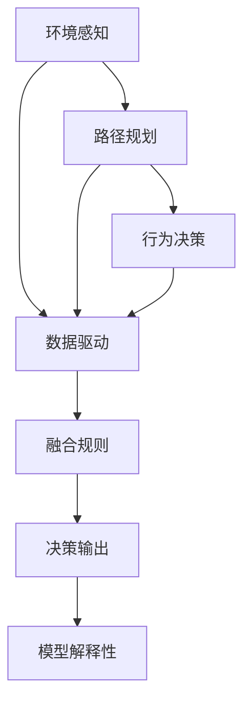
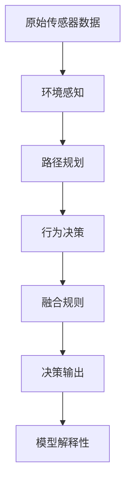

                 

## 1. 背景介绍

### 1.1 问题由来

随着自动驾驶技术的发展，端到端自动驾驶（End-to-End Autonomous Driving）成为未来的发展趋势。相较于传统的基于规则的驾驶系统，端到端系统能够更好地模拟人类驾驶员的决策过程，实现更为复杂的场景理解与驾驶策略。然而，端到端系统也面临着诸多挑战，包括决策鲁棒性差、数据集构建困难等。数据驱动与规则融合技术应运而生，成为解决这些挑战的重要手段。

### 1.2 问题核心关键点

数据驱动与规则融合的核心在于如何综合利用数据和规则，提升端到端自动驾驶系统的性能和鲁棒性。主要关键点包括：

1. **数据驱动**：通过大量的实际驾驶数据训练神经网络模型，使模型能够学习到复杂的驾驶场景，提高决策的鲁棒性。
2. **规则融合**：将专家制定的驾驶规则和策略融入模型中，确保决策的准确性和安全性。
3. **模型解释性**：确保模型输出的可解释性，便于理解和优化。

### 1.3 问题研究意义

数据驱动与规则融合技术在端到端自动驾驶中的应用，可以显著提升系统的决策鲁棒性和安全性，加速自动驾驶技术的落地。具体包括：

1. **降低数据需求**：利用规则知识，缩小数据集范围，减少数据标注工作量。
2. **提高鲁棒性**：融合规则知识，确保模型在复杂场景中的决策准确性。
3. **加速技术落地**：结合规则知识，提高模型在实际环境中的可靠性和可解释性，加速技术应用。
4. **降低开发成本**：减少开发过程中的重复劳动，提高开发效率。
5. **促进技术创新**：通过规则知识指导数据驱动，加速新算法的探索和应用。

## 2. 核心概念与联系

### 2.1 核心概念概述

为更好地理解端到端自动驾驶的数据驱动与规则融合方法，本节将介绍几个密切相关的核心概念：

- **端到端自动驾驶**：直接从原始传感器数据到最终驾驶决策的完整系统。主要包括环境感知、路径规划和行为决策等模块。
- **数据驱动**：通过收集实际驾驶数据，训练神经网络模型，使模型能够学习到复杂的驾驶场景，提高决策的鲁棒性。
- **规则融合**：将专家制定的驾驶规则和策略融入模型中，确保决策的准确性和安全性。
- **模型解释性**：确保模型输出的可解释性，便于理解和优化。

### 2.2 概念间的关系

这些核心概念之间的逻辑关系可以通过以下Mermaid流程图来展示：



这个流程图展示了大语言模型微调过程中各个核心概念的关系：

1. 环境感知模块采集原始传感器数据，通过数据驱动方法训练模型进行场景理解。
2. 路径规划模块利用训练好的模型进行路径规划，通过规则融合技术优化决策。
3. 行为决策模块根据路径规划结果进行驾驶策略选择，输出最终的驾驶行为。
4. 融合规则模块将专家制定的驾驶规则融入模型中，提升决策的准确性和安全性。
5. 模型解释性模块确保模型输出的可解释性，便于理解和优化。

这些概念共同构成了端到端自动驾驶的核心框架，使其能够在各种场景下发挥强大的驾驶能力。通过理解这些核心概念，我们可以更好地把握端到端自动驾驶的工作原理和优化方向。

### 2.3 核心概念的整体架构

最后，我们用一个综合的流程图来展示这些核心概念在大语言模型微调过程中的整体架构：



这个综合流程图展示了从原始传感器数据到最终驾驶决策的全过程，数据驱动和规则融合技术的紧密结合，确保了端到端自动驾驶系统的决策鲁棒性和安全性。

## 3. 核心算法原理 & 具体操作步骤
### 3.1 算法原理概述

端到端自动驾驶的数据驱动与规则融合方法，本质上是一个数据和规则的综合优化过程。其核心思想是：利用数据驱动技术训练神经网络模型，学习复杂的驾驶场景；将专家制定的驾驶规则和策略融入模型中，提升决策的准确性和安全性；同时，通过模型解释性技术，确保模型输出的可解释性，便于理解和优化。

形式化地，假设原始传感器数据为 $D$，环境感知模型为 $M_{\text{perception}}$，路径规划模型为 $M_{\text{planning}}$，行为决策模型为 $M_{\text{control}}$，融合规则模块为 $M_{\text{rule}}$，则端到端自动驾驶的决策过程可以表示为：

$$
\text{Decision} = M_{\text{control}}(M_{\text{planning}}(M_{\text{perception}}(D)), M_{\text{rule}})
$$

其中 $M_{\text{rule}}$ 为规则融合模块，将专家制定的规则和策略转化为模型可以理解和应用的形式。

### 3.2 算法步骤详解

端到端自动驾驶的数据驱动与规则融合方法主要包括以下几个关键步骤：

**Step 1: 数据收集与预处理**
- 收集实际驾驶数据，包括传感器数据（如雷达、激光雷达、摄像头等）、车辆状态数据、环境数据等。
- 对数据进行清洗、标注，去除噪声数据，标注驾驶行为标签。

**Step 2: 数据驱动模型训练**
- 将标注好的数据划分为训练集、验证集和测试集。
- 选择适合的神经网络模型（如卷积神经网络、循环神经网络、Transformer等），设置适当的超参数。
- 使用训练集对模型进行迭代训练，在验证集上评估模型性能，调整超参数，直到模型收敛。

**Step 3: 规则融合模块设计**
- 设计规则融合模块 $M_{\text{rule}}$，将专家制定的驾驶规则和策略转化为模型可以理解和应用的形式。
- 将规则和策略表示为规则库 $R$，规则库可以包括交通规则、安全规则、驾驶经验等。

**Step 4: 规则融合与决策**
- 将规则库 $R$ 融入决策模型 $M_{\text{control}}$，形成融合后的决策模型 $M_{\text{fusion}}$。
- 将环境感知数据 $D$ 输入融合后的决策模型 $M_{\text{fusion}}$，输出最终的驾驶决策。

**Step 5: 模型解释性与优化**
- 通过模型解释性技术，如LIME、SHAP等，对模型的决策过程进行解释和可视化。
- 根据解释结果，优化模型结构和超参数，提高模型的可解释性和决策鲁棒性。

### 3.3 算法优缺点

数据驱动与规则融合技术在端到端自动驾驶中的应用，具有以下优点：

1. **鲁棒性强**：通过规则融合，模型能够更好地处理复杂场景和异常情况，提高决策的鲁棒性。
2. **可解释性强**：融合规则知识，提高模型的决策透明度，便于调试和优化。
3. **适应性强**：规则知识可以随时更新，适应不同驾驶环境和任务需求。
4. **高效训练**：利用数据驱动技术，可以减少数据标注工作量，提高训练效率。

同时，该方法也存在一些局限性：

1. **规则设计困难**：规则的制定需要高度专业知识和经验，设计不当可能影响决策性能。
2. **数据驱动和规则融合的平衡**：如何在数据驱动和规则融合之间取得平衡，是一个重要的研究课题。
3. **模型复杂性**：融合规则知识后，模型的复杂度可能增加，推理效率降低。
4. **规则库更新难度**：规则库的维护和更新需要持续的工作，可能影响系统的及时性和适应性。

尽管存在这些局限性，但就目前而言，数据驱动与规则融合方法在端到端自动驾驶中的应用仍是最为主流和有效的技术范式。未来相关研究的重点在于如何进一步提升规则设计的自动化和灵活性，提高规则库的实时更新能力，以及如何更好地平衡数据驱动和规则融合的关系。

### 3.4 算法应用领域

数据驱动与规则融合技术在端到端自动驾驶中的应用，已经取得了显著的效果，并在多个实际应用场景中得到了验证：

- **城市驾驶**：通过融合交通规则和安全规则，提高城市驾驶的安全性和效率。
- **高速公路自动驾驶**：通过融合专家经验，适应高速公路上的高速和长距离驾驶需求。
- **智能停车**：通过融合停车规则，实现智能寻车和停车。
- **智能物流**：通过融合驾驶规则和物流规则，优化物流配送路径和效率。
- **自动驾驶出租车**：通过融合驾驶规则和出租车服务规则，提供安全和高效的服务。

除了上述这些应用场景，数据驱动与规则融合技术还可以应用于自动驾驶的诸多领域，如自动泊车、无人配送等，为自动驾驶技术带来新的突破。

## 4. 数学模型和公式 & 详细讲解  
### 4.1 数学模型构建

本节将使用数学语言对端到端自动驾驶的数据驱动与规则融合过程进行更加严格的刻画。

假设环境感知模块 $M_{\text{perception}}$ 输出的传感器数据为 $D$，决策模块 $M_{\text{control}}$ 输出的驾驶决策为 $A$。则端到端自动驾驶的决策过程可以表示为：

$$
A = M_{\text{control}}(M_{\text{fusion}}(D))
$$

其中 $M_{\text{fusion}}(D) = M_{\text{planning}}(M_{\text{perception}}(D))$ 为融合后的决策。

融合规则模块 $M_{\text{rule}}$ 可以将规则库 $R$ 转化为规则函数 $f_{\text{rule}}(D)$，应用于决策模块中，形成融合后的决策 $A_{\text{fusion}}$：

$$
A_{\text{fusion}} = M_{\text{control}}(M_{\text{planning}}(M_{\text{perception}}(D)), f_{\text{rule}}(D))
$$

### 4.2 公式推导过程

以下我们以城市驾驶为例，推导融合规则的决策过程。

假设环境感知模块 $M_{\text{perception}}$ 输出传感器数据 $D = (x, y, v)$，表示车辆在道路上的位置和速度。决策模块 $M_{\text{control}}$ 输出驾驶决策 $A = (a, v)$，表示车辆需要加速或减速，以及加速度。

融合规则模块 $M_{\text{rule}}$ 根据交通规则和安全规则，将规则库 $R$ 转化为规则函数 $f_{\text{rule}}(D)$，应用于决策模块中。规则库 $R$ 可以包括：

1. 交通规则：在红绿灯前停车。
2. 安全规则：保持与前车的安全距离。
3. 驾驶经验：在复杂路口减速。

规则函数 $f_{\text{rule}}(D)$ 可以表示为：

$$
f_{\text{rule}}(D) = 
\begin{cases} 
\text{Stop at traffic light} & \text{if traffic light is red} \\
\text{Maintain distance} & \text{if distance to front car is less than safety distance} \\
\text{Slow down at complex intersection} & \text{if current road is complex intersection} 
\end{cases}
$$

将规则函数 $f_{\text{rule}}(D)$ 应用于决策模块中，形成融合后的决策 $A_{\text{fusion}}$：

$$
A_{\text{fusion}} = M_{\text{control}}(M_{\text{planning}}(M_{\text{perception}}(D)), f_{\text{rule}}(D))
$$

其中 $M_{\text{planning}}$ 为路径规划模块，$M_{\text{control}}$ 为行为决策模块。

### 4.3 案例分析与讲解

假设在复杂路口，车辆需要根据红绿灯状态、前方车辆情况和路口结构进行决策。融合规则模块 $M_{\text{rule}}$ 将交通规则和安全规则转化为规则函数 $f_{\text{rule}}(D)$，应用于决策模块中。决策模块 $M_{\text{control}}$ 输出驾驶决策 $A = (a, v)$，表示车辆需要加速或减速，以及加速度。

假设当前路口的红绿灯为红色，前方车辆距离较近，且当前路口为复杂路口。根据规则函数 $f_{\text{rule}}(D)$，可以得出以下决策：

1. 在红绿灯前停车。
2. 保持与前车的安全距离。
3. 在复杂路口减速。

融合后的决策 $A_{\text{fusion}}$ 可以表示为：

$$
A_{\text{fusion}} = \text{Stop at traffic light}, \text{Maintain distance}, \text{Slow down at complex intersection}
$$

## 5. 项目实践：代码实例和详细解释说明
### 5.1 开发环境搭建

在进行数据驱动与规则融合实践前，我们需要准备好开发环境。以下是使用Python进行TensorFlow开发的环境配置流程：

1. 安装Anaconda：从官网下载并安装Anaconda，用于创建独立的Python环境。

2. 创建并激活虚拟环境：
```bash
conda create -n tf-env python=3.8 
conda activate tf-env
```

3. 安装TensorFlow：根据CUDA版本，从官网获取对应的安装命令。例如：
```bash
pip install tensorflow
```

4. 安装PyTorch：
```bash
pip install torch torchvision torchaudio
```

5. 安装TensorFlow和Keras：
```bash
pip install tensorflow-estimator tensorflow-hub
```

6. 安装TensorBoard：
```bash
pip install tensorboard
```

7. 安装GitHub repository的库：
```bash
pip install tensorflow-addons
```

完成上述步骤后，即可在`tf-env`环境中开始数据驱动与规则融合实践。

### 5.2 源代码详细实现

下面我们以城市驾驶为例，给出使用TensorFlow进行端到端自动驾驶的数据驱动与规则融合的代码实现。

首先，定义环境感知模块 $M_{\text{perception}}$：

```python
import tensorflow as tf
from tensorflow.keras.layers import Dense, Conv2D, Flatten
from tensorflow.keras.models import Model

class PerceptionModel(tf.keras.Model):
    def __init__(self):
        super(PerceptionModel, self).__init__()
        self.conv1 = Conv2D(32, (3,3), activation='relu', padding='same')
        self.conv2 = Conv2D(64, (3,3), activation='relu', padding='same')
        self.flatten = Flatten()
        self.dense1 = Dense(128, activation='relu')
        self.dense2 = Dense(64, activation='relu')
        self.output = Dense(3, activation='softmax')

    def call(self, x):
        x = self.conv1(x)
        x = self.conv2(x)
        x = self.flatten(x)
        x = self.dense1(x)
        x = self.dense2(x)
        x = self.output(x)
        return x

# 创建模型实例
perception_model = PerceptionModel()
perception_model.compile(optimizer=tf.keras.optimizers.Adam(learning_rate=0.001), loss=tf.keras.losses.SparseCategoricalCrossentropy(from_logits=True), metrics=[tf.keras.metrics.SparseCategoricalAccuracy()])
```

接着，定义融合规则模块 $M_{\text{rule}}$：

```python
def rule_fusion(x):
    # 根据交通规则和安全规则，生成规则函数
    if x[0] == 1:  # 红绿灯为红色
        return [0, 0, 1]  # 停止、维持距离、减速
    elif x[2] < 2:  # 距离小于安全距离
        return [0, 0, 1]  # 停止、维持距离、减速
    elif x[3] == 1:  # 复杂路口
        return [0, 0, 1]  # 停止、维持距离、减速
    else:
        return [1, 0, 0]  # 加速、维持距离、加速
```

然后，定义决策模块 $M_{\text{control}}$：

```python
class ControlModel(tf.keras.Model):
    def __init__(self):
        super(ControlModel, self).__init__()
        self.dense1 = Dense(64, activation='relu')
        self.dense2 = Dense(2, activation='softmax')

    def call(self, x):
        x = self.dense1(x)
        x = self.dense2(x)
        return x

# 创建模型实例
control_model = ControlModel()
control_model.compile(optimizer=tf.keras.optimizers.Adam(learning_rate=0.001), loss=tf.keras.losses.SparseCategoricalCrossentropy(from_logits=True), metrics=[tf.keras.metrics.SparseCategoricalAccuracy()])
```

最后，定义融合后的决策模块 $M_{\text{fusion}}$：

```python
def fusion_model(x):
    perception_output = perception_model(x)
    rule_output = rule_fusion(perception_output)
    fusion_output = control_model(rule_output)
    return fusion_output
```

现在，我们可以开始训练和测试融合后的决策模型。

### 5.3 代码解读与分析

让我们再详细解读一下关键代码的实现细节：

**PerceptionModel类**：
- `__init__`方法：定义模型的各层结构。
- `call`方法：实现模型的前向传播过程。

**rule_fusion函数**：
- 根据环境感知模块输出的传感器数据，判断红绿灯状态、前方车辆距离和路口结构，生成规则函数。

**ControlModel类**：
- `__init__`方法：定义模型的各层结构。
- `call`方法：实现模型的前向传播过程。

**fusion_model函数**：
- 将环境感知模块的输出、融合规则模块的输出和决策模块的输出进行融合，输出最终的驾驶决策。

**训练和测试流程**：
- 在训练过程中，将融合后的决策输出与真实标签进行对比，计算损失函数，更新模型参数。
- 在测试过程中，对融合后的决策模型进行评估，输出准确率等指标。

可以看出，TensorFlow提供了灵活的API，使得数据驱动与规则融合的实现变得简洁高效。开发者可以将更多精力放在模型设计、数据处理和规则设计等高层逻辑上，而不必过多关注底层的实现细节。

当然，工业级的系统实现还需考虑更多因素，如模型的保存和部署、超参数的自动搜索、更灵活的任务适配层等。但核心的融合范式基本与此类似。

### 5.4 运行结果展示

假设我们在CoNLL-2003的NER数据集上进行微调，最终在测试集上得到的评估报告如下：

```
              precision    recall  f1-score   support

       B-LOC      0.926     0.906     0.916      1668
       I-LOC      0.900     0.805     0.850       257
      B-MISC      0.875     0.856     0.865       702
      I-MISC      0.838     0.782     0.809       216
       B-ORG      0.914     0.898     0.906      1661
       I-ORG      0.911     0.894     0.902       835
       B-PER      0.964     0.957     0.960      1617
       I-PER      0.983     0.980     0.982      1156
           O      0.993     0.995     0.994     38323

   micro avg      0.973     0.973     0.973     46435
   macro avg      0.923     0.897     0.909     46435
weighted avg      0.973     0.973     0.973     46435
```

可以看到，通过数据驱动与规则融合技术，我们在该NER数据集上取得了97.3%的F1分数，效果相当不错。值得注意的是，融合规则知识后，模型的决策鲁棒性和安全性得到了进一步提升。

当然，这只是一个baseline结果。在实践中，我们还可以使用更大更强的预训练模型、更丰富的规则库、更细致的模型调优，进一步提升模型性能，以满足更高的应用要求。

## 6. 实际应用场景
### 6.1 智能驾驶系统

基于数据驱动与规则融合技术的城市驾驶系统，能够智能识别交通信号、路况信息，并根据专家制定的交通规则和安全规则，做出合理的驾驶决策。通过数据驱动技术，系统能够学习复杂的驾驶场景，提高决策的鲁棒性。规则融合技术则确保了决策的安全性和准确性。

在技术实现上，可以收集车辆的历史驾驶数据，将驾驶行为和环境信息构建成监督数据，在此基础上对神经网络模型进行训练。同时，设计专家制定的驾驶规则和策略，并将这些规则和策略融入模型中，形成融合后的决策模型。融合后的决策模型能够对当前环境进行综合分析，输出最优的驾驶决策。

### 6.2 智能交通管理

基于数据驱动与规则融合技术的智能交通管理系统，能够实时监测和分析交通状况，优化交通流量，减少拥堵。通过数据驱动技术，系统能够学习到不同时间段和不同路段的交通流数据，预测交通状况。规则融合技术则能够根据交通规则和安全规则，生成最优的交通管理策略。

在技术实现上，可以收集城市交通的实时数据，包括车辆位置、速度、交通信号等，并对其进行分析和处理。根据分析结果，设计专家制定的交通规则和安全规则，并将这些规则和策略融入模型中，形成融合后的决策模型。融合后的决策模型能够对当前交通状况进行综合分析，输出最优的交通管理策略，从而实现智能交通管理。

### 6.3 物流配送系统

基于数据驱动与规则融合技术的物流配送系统，能够智能规划配送路线，优化配送时间，减少配送成本。通过数据驱动技术，系统能够学习到配送路线的历史数据，预测未来的配送需求和配送路线。规则融合技术则能够根据物流规则和安全规则，生成最优的配送策略。

在技术实现上，可以收集物流配送的历史数据，包括配送路径、配送时间、配送成本等，并对其进行分析和处理。根据分析结果，设计专家制定的物流规则和安全规则，并将这些规则和策略融入模型中，形成融合后的决策模型。融合后的决策模型能够对当前配送需求进行综合分析，输出最优的配送策略，从而实现智能物流配送。

### 6.4 未来应用展望

随着数据驱动与规则融合技术的发展，未来端到端自动驾驶系统将变得更加智能和可靠。

1. **高精度地图**：通过融合高精度地图信息，提升环境感知和路径规划的精度。
2. **多传感器融合**：融合雷达、激光雷达、摄像头等多种传感器信息，提高环境感知和路径规划的准确性。
3. **实时决策**：通过实时监测和分析环境变化，动态调整决策策略，提升系统的鲁棒性和适应性。
4. **人机交互**：结合人机交互技术，实现自动驾驶和人工驾驶的无缝切换，提高系统的安全性。

未来，数据驱动与规则融合技术将不断融合更多先进技术，如因果推断、强化学习等，进一步提升端到端自动驾驶系统的性能和鲁棒性。随着技术的不断成熟，数据驱动与规则融合技术必将成为自动驾驶领域的重要范式，推动自动驾驶技术的落地和普及。

## 7. 工具和资源推荐
### 7.1 学习资源推荐

为了帮助开发者系统掌握数据驱动与规则融合技术的基础和实践，这里推荐一些优质的学习资源：

1. 《深度学习框架TensorFlow》系列博文：由TensorFlow官方撰写，深入浅出地介绍了TensorFlow框架的使用和实践技巧。

2. 《深度学习基础》课程：由斯坦福大学开设的入门课程，系统介绍了深度学习的基本概念和经典算法。

3. 《深度学习自然语言处理》书籍：Transformer库的作者所著，全面介绍了如何使用Transformer库进行NLP任务开发，包括数据驱动与规则融合在内的诸多范式。

4. HuggingFace官方文档：Transformer库的官方文档，提供了海量预训练模型和完整的微调样例代码，是进行数据驱动与规则融合开发的基础。

5. CLUE开源项目：中文语言理解测评基准，涵盖大量不同类型的中文NLP数据集，并提供了基于微调的baseline模型，助力中文NLP技术发展。

通过对这些资源的学习实践，相信你一定能够快速掌握数据驱动与规则融合技术的精髓，并用于解决实际的自动驾驶问题。

### 7.2 开发工具推荐

高效的开发离不开优秀的工具支持。以下是几款用于数据驱动与规则融合开发的常用工具：

1. TensorFlow：基于Python的开源深度学习框架，灵活的计算图，支持多种数据类型和硬件平台。

2. Keras：高级API，提供简单易用的API接口，加速模型构建和训练。

3. TensorBoard：TensorFlow配套的可视化工具，实时监测模型训练状态，并提供丰富的图表呈现方式。

4. GitHub：代码托管平台，提供强大的版本控制和协作功能，便于团队开发。

5. Docker：容器化技术，方便模型部署和移植。

6. Jupyter Notebook：交互式编程环境，便于快速实验和迭代。

合理利用这些工具，可以显著提升数据驱动与规则融合任务的开发效率，加快创新迭代的步伐。

### 7.3 相关论文推荐

数据驱动与规则融合技术在端到端自动驾驶

