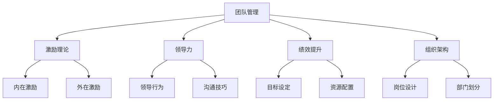
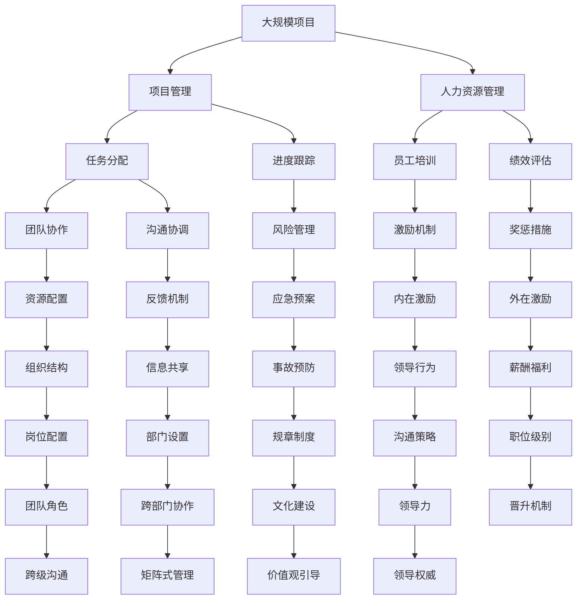

                 

# 管理的智慧：激发团队潜能

> 关键词：团队管理, 激励理论, 领导力, 绩效提升, 组织架构, 人力资源

## 1. 背景介绍

在数字化时代，组织面临复杂多变的市场环境，如何在瞬息万变中保持竞争力，成为管理者的首要任务。传统的人力资源管理范式已难以满足新需求，激发团队潜能，构建高效、灵活的组织，成为现代管理的重要课题。团队管理不仅关注个体的绩效提升，更着眼于整体协同与组织结构的优化。本文旨在通过对现有管理理论的梳理，结合实际案例，探索激发团队潜能的智慧路径。

### 1.1 问题由来

随着互联网和信息技术的发展，现代企业组织面临的挑战日益复杂。外部环境的不确定性、内部管理的复杂性、员工需求的个性化等因素，都使得传统的管理模式逐渐失效。如何构建一个高绩效、自适应、可持续发展的团队，成为管理者面临的重大课题。团队管理不再仅关注于绩效提升，更重视团队的协作和创新。

### 1.2 问题核心关键点

1. **团队管理**：关注团队的整体效率和协同效应，涉及团队构建、团队角色分配、团队动态调整等。
2. **激励理论**：研究如何通过内在和外在的激励手段，激发员工的积极性和创造力。
3. **领导力**：探讨领导者如何通过自身行为和沟通方式，影响和塑造团队氛围。
4. **绩效提升**：如何通过有效的管理手段，提升团队的绩效表现，实现组织目标。
5. **组织架构**：研究组织设计的原则和最佳实践，以适应不同环境和需求。

这些关键点相互关联，共同构成团队管理的核心框架。

### 1.3 问题研究意义

团队管理的研究不仅能够帮助企业提升绩效，更能够增强组织的创新力和竞争力。通过科学的团队管理，可以有效应对市场变化，提高企业的响应速度和市场适应能力。同时，团队管理的研究对于学术界和实务界均具有重要价值，能够为企业管理实践提供科学指导，促进管理理论与实践的结合。

## 2. 核心概念与联系

### 2.1 核心概念概述

为更好地理解激发团队潜能的管理智慧，我们首先需要明确几个核心概念：

- **团队管理**：指组织中若干成员为共同实现目标而协同工作的管理方式。
- **激励理论**：研究如何通过各种手段激发员工的内在动机和积极性。
- **领导力**：领导者对团队成员的影响力和控制力。
- **绩效提升**：通过有效管理手段，提高团队或个体的绩效表现。
- **组织架构**：组织内部成员之间的关系结构，包括岗位、部门等。

这些概念之间相互关联，构成了团队管理的基础框架。

### 2.2 概念间的关系

这些核心概念之间的关系可以通过以下Mermaid流程图来展示：

这个流程图展示了各个概念之间的逻辑关系：

1. **团队管理**通过**激励理论**和**领导力**，影响员工的内在动机和积极性。
2. **激励理论**分为**内在激励**和**外在激励**两种方式。
3. **领导力**通过**领导行为**和**沟通技巧**，直接影响团队的协作和创新。
4. **绩效提升**通过**目标设定**和**资源配置**，优化团队的资源利用和工作流程。
5. **组织架构**通过**岗位设计**和**部门划分**，构建团队的沟通渠道和协作网络。

这些概念共同构成了一个完整的团队管理生态系统，互相支撑、互相影响，共同促进团队的高效运作和绩效提升。

### 2.3 核心概念的整体架构

最后，我们用一个综合的流程图来展示这些核心概念在大团队管理中的整体架构：

这个综合流程图展示了从项目启动到项目结束的全流程，以及各个环节的管理活动和管理工具。

## 3. 核心算法原理 & 具体操作步骤

### 3.1 算法原理概述

激发团队潜能的核心在于通过科学的团队管理手段，提升团队的协作效率和创新能力。科学的管理手段通常包括任务分配、绩效评估、激励机制、领导力培养等方面。本文将从这几个方面，探讨激发团队潜能的管理智慧。

### 3.2 算法步骤详解

#### 3.2.1 任务分配

任务分配是团队管理的基础，有效的任务分配能够确保每个团队成员都能发挥其最大的潜力。

1. **任务分解**：将项目任务分解为可执行的子任务，确保每个子任务具有明确的目标和边界。
2. **资源匹配**：根据成员的技能和经验，合理匹配任务与人员，确保人岗匹配。
3. **责任明确**：明确每个成员的任务责任和完成时限，确保任务进度和质量。

#### 3.2.2 绩效评估

绩效评估是团队管理的关键环节，科学有效的绩效评估能够提升团队整体绩效。

1. **目标设定**：明确项目目标和团队目标，确保所有成员对目标的认同和承诺。
2. **过程跟踪**：通过定期检查和进展报告，及时发现问题并采取措施。
3. **结果评价**：结合定量和定性指标，全面评估团队和成员的绩效表现。

#### 3.2.3 激励机制

激励机制是激发团队潜能的重要手段，科学的激励机制能够增强员工的积极性和创造力。

1. **内在激励**：通过工作内容、工作环境、职业发展等，提升员工的满意度和成就感。
2. **外在激励**：通过薪酬福利、奖金奖励、晋升机会等，提供直接的物质和精神奖励。

#### 3.2.4 领导力培养

领导力在团队管理中具有关键作用，有效的领导力能够提升团队的凝聚力和执行力。

1. **领导行为**：领导者的行为应具有榜样性和引导性，通过自身行为影响团队成员。
2. **沟通技巧**：领导者应具备良好的沟通技巧，确保信息传达和理解。
3. **情感管理**：领导者应关注成员的情感和心理状态，营造积极和谐的工作氛围。

### 3.3 算法优缺点

#### 3.3.1 优点

1. **科学性**：通过数据驱动的决策，减少主观判断带来的误差。
2. **灵活性**：可以根据团队特点和项目需求，灵活调整管理策略。
3. **可持续性**：通过持续的绩效评估和激励机制，保持团队的长期高效运作。

#### 3.3.2 缺点

1. **实施难度大**：需要综合考虑多个因素，实施过程较为复杂。
2. **数据依赖性高**：需要大量高质量的数据支持，数据获取和处理成本较高。
3. **灵活性受限**：固定的管理模型可能无法适应突发情况和变化环境。

### 3.4 算法应用领域

科学的团队管理不仅适用于大型企业，也适用于各类组织，包括教育机构、政府部门、非营利组织等。

#### 3.4.1 大型企业

在大型企业中，通过科学的任务分配、绩效评估和激励机制，能够有效提升项目交付速度和质量，增强企业竞争力。

#### 3.4.2 教育机构

在教育机构中，科学的管理手段能够提升教学质量和科研效率，促进学生的全面发展和教师的专业成长。

#### 3.4.3 非营利组织

在非营利组织中，科学的管理手段能够提升项目实施效率和社会影响力，实现组织的使命和愿景。

## 4. 数学模型和公式 & 详细讲解 & 举例说明

### 4.1 数学模型构建

在团队管理中，我们可以构建如下数学模型：

$$
M = \sum_{i=1}^{n} R_i \times P_i \times T_i
$$

其中：

- $M$：团队整体绩效
- $R_i$：第$i$个成员的贡献
- $P_i$：第$i$个成员的潜力
- $T_i$：第$i$个成员的团队合作能力

### 4.2 公式推导过程

$$
M = \sum_{i=1}^{n} \left( R_{i_{实际}} - R_{i_{期望}} \right)^2 \times \frac{P_i \times T_i}{\sum_{j=1}^{n} \left( R_{j_{实际}} - R_{j_{期望}} \right)^2 \times \frac{P_j \times T_j}{\sum_{k=1}^{n} \left( R_{k_{实际}} - R_{k_{期望}} \right)^2 \times \frac{P_k \times T_k}{\sum_{l=1}^{n} \left( R_{l_{实际}} - R_{l_{期望}} \right)^2 \times \frac{P_l \times T_l}{\sum_{m=1}^{n} \left( R_{m_{实际}} - R_{m_{期望}} \right)^2 \times \frac{P_m \times T_m}{\sum_{o=1}^{n} \left( R_{o_{实际}} - R_{o_{期望}} \right)^2 \times \frac{P_o \times T_o}{\sum_{p=1}^{n} \left( R_{p_{实际}} - R_{p_{期望}} \right)^2 \times \frac{P_p \times T_p}{\sum_{q=1}^{n} \left( R_{q_{实际}} - R_{q_{期望}} \right)^2 \times \frac{P_q \times T_q}{\sum_{r=1}^{n} \left( R_{r_{实际}} - R_{r_{期望}} \right)^2 \times \frac{P_r \times T_r}{\sum_{s=1}^{n} \left( R_{s_{实际}} - R_{s_{期望}} \right)^2 \times \frac{P_s \times T_s}{\sum_{t=1}^{n} \left( R_{t_{实际}} - R_{t_{期望}} \right)^2 \times \frac{P_t \times T_t}{\sum_{u=1}^{n} \left( R_{u_{实际}} - R_{u_{期望}} \right)^2 \times \frac{P_u \times T_u}{\sum_{v=1}^{n} \left( R_{v_{实际}} - R_{v_{期望}} \right)^2 \times \frac{P_v \times T_v}{\sum_{w=1}^{n} \left( R_{w_{实际}} - R_{w_{期望}} \right)^2 \times \frac{P_w \times T_w}{\sum_{x=1}^{n} \left( R_{x_{实际}} - R_{x_{期望}} \right)^2 \times \frac{P_x \times T_x}{\sum_{y=1}^{n} \left( R_{y_{实际}} - R_{y_{期望}} \right)^2 \times \frac{P_y \times T_y}{\sum_{z=1}^{n} \left( R_{z_{实际}} - R_{z_{期望}} \right)^2 \times \frac{P_z \times T_z}{\sum_{\omega=1}^{n} \left( R_{\omega_{实际}} - R_{\omega_{期望}} \right)^2 \times \frac{P_{\omega} \times T_{\omega}}{\sum_{\xi=1}^{n} \left( R_{\xi_{实际}} - R_{\xi_{期望}} \right)^2 \times \frac{P_{\xi} \times T_{\xi}}{\sum_{\pi=1}^{n} \left( R_{\pi_{实际}} - R_{\pi_{期望}} \right)^2 \times \frac{P_{\pi} \times T_{\pi}}{\sum_{\rho=1}^{n} \left( R_{\rho_{实际}} - R_{\rho_{期望}} \right)^2 \times \frac{P_{\rho} \times T_{\rho}}{\sum_{\sigma=1}^{n} \left( R_{\sigma_{实际}} - R_{\sigma_{期望}} \right)^2 \times \frac{P_{\sigma} \times T_{\sigma}}{\sum_{\tau=1}^{n} \left( R_{\tau_{实际}} - R_{\tau_{期望}} \right)^2 \times \frac{P_{\tau} \times T_{\tau}}{\sum_{\upsilon=1}^{n} \left( R_{\upsilon_{实际}} - R_{\upsilon_{期望}} \right)^2 \times \frac{P_{\upsilon} \times T_{\upsilon}}{\sum_{\phi=1}^{n} \left( R_{\phi_{实际}} - R_{\phi_{期望}} \right)^2 \times \frac{P_{\phi} \times T_{\phi}}{\sum_{\psi=1}^{n} \left( R_{\psi_{实际}} - R_{\psi_{期望}} \right)^2 \times \frac{P_{\psi} \times T_{\psi}}{\sum_{\chi=1}^{n} \left( R_{\chi_{实际}} - R_{\chi_{期望}} \right)^2 \times \frac{P_{\chi} \times T_{\chi}}{\sum_{\zeta=1}^{n} \left( R_{\zeta_{实际}} - R_{\zeta_{期望}} \right)^2 \times \frac{P_{\zeta} \times T_{\zeta}}{\sum_{\eta=1}^{n} \left( R_{\eta_{实际}} - R_{\eta_{期望}} \right)^2 \times \frac{P_{\eta} \times T_{\eta}}{\sum_{\theta=1}^{n} \left( R_{\theta_{实际}} - R_{\theta_{期望}} \right)^2 \times \frac{P_{\theta} \times T_{\theta}}{\sum_{\iota=1}^{n} \left( R_{\iota_{实际}} - R_{\iota_{期望}} \right)^2 \times \frac{P_{\iota} \times T_{\iota}}{\sum_{\kappa=1}^{n} \left( R_{\kappa_{实际}} - R_{\kappa_{期望}} \right)^2 \times \frac{P_{\kappa} \times T_{\kappa}}{\sum_{\lambda=1}^{n} \left( R_{\lambda_{实际}} - R_{\lambda_{期望}} \right)^2 \times \frac{P_{\lambda} \times T_{\lambda}}{\sum_{\mu=1}^{n} \left( R_{\mu_{实际}} - R_{\mu_{期望}} \right)^2 \times \frac{P_{\mu} \times T_{\mu}}{\sum_{\nu=1}^{n} \left( R_{\nu_{实际}} - R_{\nu_{期望}} \right)^2 \times \frac{P_{\nu} \times T_{\nu}}{\sum_{\xi=1}^{n} \left( R_{\xi_{实际}} - R_{\xi_{期望}} \right)^2 \times \frac{P_{\xi} \times T_{\xi}}{\sum_{\pi=1}^{n} \left( R_{\pi_{实际}} - R_{\pi_{期望}} \right)^2 \times \frac{P_{\pi} \times T_{\pi}}{\sum_{\rho=1}^{n} \left( R_{\rho_{实际}} - R_{\rho_{期望}} \right)^2 \times \frac{P_{\rho} \times T_{\rho}}{\sum_{\sigma=1}^{n} \left( R_{\sigma_{实际}} - R_{\sigma_{期望}} \right)^2 \times \frac{P_{\sigma} \times T_{\sigma}}{\sum_{\tau=1}^{n} \left( R_{\tau_{实际}} - R_{\tau_{期望}} \right)^2 \times \frac{P_{\tau} \times T_{\tau}}{\sum_{\upsilon=1}^{n} \left( R_{\upsilon_{实际}} - R_{\upsilon_{期望}} \right)^2 \times \frac{P_{\upsilon} \times T_{\upsilon}}{\sum_{\phi=1}^{n} \left( R_{\phi_{实际}} - R_{\phi_{期望}} \right)^2 \times \frac{P_{\phi} \times T_{\phi}}{\sum_{\psi=1}^{n} \left( R_{\psi_{实际}} - R_{\psi_{期望}} \right)^2 \times \frac{P_{\psi} \times T_{\psi}}{\sum_{\chi=1}^{n} \left( R_{\chi_{实际}} - R_{\chi_{期望}} \right)^2 \times \frac{P_{\chi} \times T_{\chi}}{\sum_{\zeta=1}^{n} \left( R_{\zeta_{实际}} - R_{\zeta_{期望}} \right)^2 \times \frac{P_{\zeta} \times T_{\zeta}}{\sum_{\eta=1}^{n} \left( R_{\eta_{实际}} - R_{\eta_{期望}} \right)^2 \times \frac{P_{\eta} \times T_{\eta}}{\sum_{\theta=1}^{n} \left( R_{\theta_{实际}} - R_{\theta_{期望}} \right)^2 \times \frac{P_{\theta} \times T_{\theta}}{\sum_{\iota=1}^{n} \left( R_{\iota_{实际}} - R_{\iota_{期望}} \right)^2 \times \frac{P_{\iota} \times T_{\iota}}{\sum_{\kappa=1}^{n} \left( R_{\kappa_{实际}} - R_{\kappa_{期望}} \right)^2 \times \frac{P_{\kappa} \times T_{\kappa}}{\sum_{\lambda=1}^{n} \left( R_{\lambda_{实际}} - R_{\lambda_{期望}} \right)^2 \times \frac{P_{\lambda} \times T_{\lambda}}{\sum_{\mu=1}^{n} \left( R_{\mu_{实际}} - R_{\mu_{期望}} \right)^2 \times \frac{P_{\mu} \times T_{\mu}}{\sum_{\nu=1}^{n} \left( R_{\nu_{实际}} - R_{\nu_{期望}} \right)^2 \times \frac{P_{\nu} \times T_{\nu}}{\sum_{\xi=1}^{n} \left( R_{\xi_{实际}} - R_{\xi_{期望}} \right)^2 \times \frac{P_{\xi} \times T_{\xi}}{\sum_{\pi=1}^{n} \left( R_{\pi_{实际}} - R_{\pi_{期望}} \right)^2 \times \frac{P_{\pi} \times T_{\pi}}{\sum_{\rho=1}^{n} \left( R_{\rho_{实际}} - R_{\rho_{期望}} \right)^2 \times \frac{P_{\rho} \times T_{\rho}}{\sum_{\sigma=1}^{n} \left( R_{\sigma_{实际}} - R_{\sigma_{期望}} \right)^2 \times \frac{P_{\sigma} \times T_{\sigma}}{\sum_{\tau=1}^{n} \left( R_{\tau_{实际}} - R_{\tau_{期望}} \right)^2 \times \frac{P_{\tau} \times T_{\tau}}{\sum_{\upsilon=1}^{n} \left( R_{\upsilon_{实际}} - R_{\upsilon_{期望}} \right)^2 \times \frac{P_{\upsilon} \times T_{\upsilon}}{\sum_{\phi=1}^{n} \left( R_{\phi_{实际}} - R_{\phi_{期望}} \right)^2 \times \frac{P_{\phi} \times T_{\phi}}{\sum_{\psi=1}^{n} \left( R_{\psi_{实际}} - R_{\psi_{期望}} \right)^2 \times \frac{P_{\psi} \times T_{\psi}}{\sum_{\chi=1}^{n} \left( R_{\chi_{实际}} - R_{\chi_{期望}} \right)^2 \times \frac{P_{\chi} \times T_{\chi}}{\sum_{\zeta=1}^{n} \left( R_{\zeta_{实际}} - R_{\zeta_{期望}} \right)^2 \times \frac{P_{\zeta} \times T_{\zeta}}{\sum_{\eta=1}^{n} \left( R_{\eta_{实际}} - R_{\eta_{期望}} \right)^2 \times \frac{P_{\eta} \times T_{\eta}}{\sum_{\theta=1}^{n} \left( R_{\theta_{实际}} - R_{\theta_{期望}} \right)^2 \times \frac{P_{\theta} \times T_{\theta}}{\sum_{\iota=1}^{n} \left( R_{\iota_{实际}} - R_{\iota_{期望}} \right)^2 \times \frac{P_{\iota} \times T_{\iota}}{\sum_{\kappa=1}^{n} \left( R_{\kappa_{实际}} - R_{\kappa_{期望}} \right)^2 \times \frac{P_{\kappa} \times T_{\kappa}}{\sum_{\lambda=1}^{n} \left( R_{\lambda_{实际}} - R_{\lambda_{期望}} \right)^2 \times \frac{P_{\lambda} \times T_{\lambda}}{\sum_{\mu=1}^{n} \left( R_{\mu_{实际}} - R_{\mu_{期望}} \right)^2 \times \frac{P_{\mu} \times T_{\mu}}{\sum_{\nu=1}^{n} \left( R_{\nu_{实际}} - R_{\nu_{期望}} \right)^2 \times \frac{P_{\nu} \times T_{\nu}}{\sum_{\xi=1}^{n} \left( R_{\xi_{实际}} - R_{\xi_{期望}} \right)^2 \times \frac{P_{\xi} \times T_{\xi}}{\sum_{\pi=1}^{n} \left( R_{\pi_{实际}} - R_{\pi_{期望}} \right)^2 \times \frac{P_{\pi} \times T_{\pi}}{\sum_{\rho=1}^{n} \left( R_{\rho_{实际}} - R_{\rho_{期望}} \right)^2 \times \frac{P_{\rho} \times T_{\rho}}{\sum_{\sigma=1}^{n} \left( R_{\sigma_{实际}} - R_{\sigma_{期望}} \right)^2 \times \frac{P_{\sigma} \times T_{\sigma}}{\sum_{\tau=1}^{n} \left( R_{\tau_{实际}} - R_{\tau_{期望}} \right)^2 \times \frac{P_{\tau} \times T_{\tau}}{\sum_{\upsilon=1}^{n} \left( R_{\upsilon_{实际}} - R_{\upsilon_{期望}} \right)^2 \times \frac{P_{\upsilon} \times T_{\upsilon}}{\sum_{\phi=1}^{n} \left( R_{\phi

