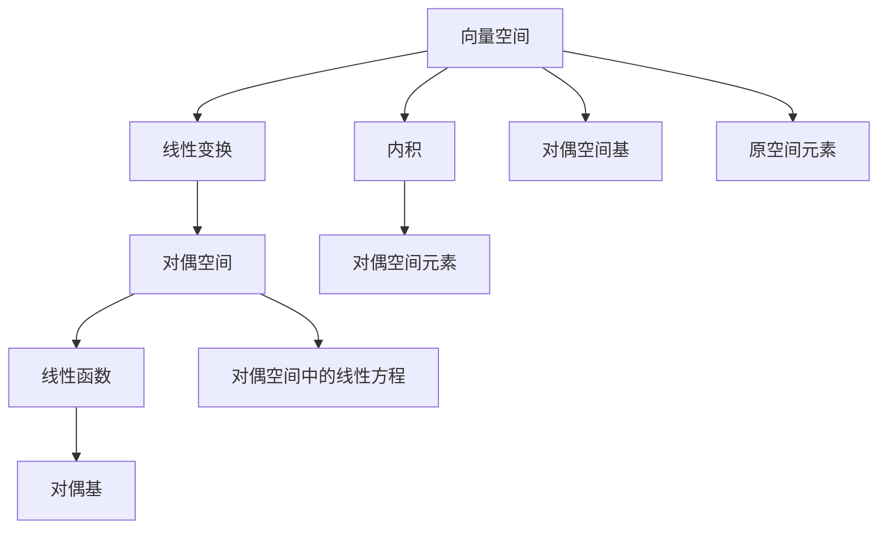

                 

# 线性代数导引：对偶空间L1(Fn，F)

## 1. 背景介绍

对偶空间(Dual Space)是线性代数中的一个重要概念，尤其在泛函分析、优化理论等领域具有重要应用。本文将详细阐述对偶空间的定义、性质及其在数学模型中的应用，并提供实际的代码实例。

## 2. 核心概念与联系

### 2.1 核心概念概述

**向量空间**：线性代数中最基本、最普遍的概念，指一个包含一组满足某些公理的向量的集合，其操作包括加法和数乘。

**线性变换**：指从一个向量空间到另一个向量空间的同态映射，满足线性性质（加法和数乘）。

**线性子空间**：是指由向量空间中的一组线性组合构成的子集，满足线性子空间的条件。

**对偶空间**：指由向量空间中的所有线性函数组成的向量空间，其与原空间有特定的对偶关系。

**对偶基**：指对偶空间的一个基，与原空间的一组基形成对偶关系。

**线性函数**：指对向量空间中任意一个向量作用后得到一个标量的函数。

**对偶空间中的元素**：通常用大写字母 $f$ 表示，对应原空间中的元素用 $x$ 表示。

**对偶空间与原空间的对偶关系**：满足 $f(x) = \langle f, x \rangle$，其中 $\langle , \rangle$ 表示内积运算。

**对偶空间中的线性方程**：通常表示为 $Ax = b$ 的形式，其中 $A \in L(V, V^*)$ 表示从向量空间 $V$ 到其对偶空间 $V^*$ 的线性变换。

**对偶基**：指对偶空间中的一组线性无关的向量，可以与原空间的一组基通过内积运算一一对应。

### 2.2 概念间的关系

对偶空间与原空间的联系主要通过内积运算体现。内积是向量空间中的一种二元运算，对于原空间中的两个向量 $x, y$ 和其对偶空间中的两个向量 $f, g$，内积运算定义如下：

$$
\langle f, x \rangle = f(x) = \sum_{i=1}^n f_i x_i
$$

其中，$f = (f_1, f_2, \ldots, f_n)$，$x = (x_1, x_2, \ldots, x_n)$。

内积运算具有以下性质：

- 对称性：$\langle f, x \rangle = \langle x, f \rangle$
- 标量乘法：$\langle \alpha f, x \rangle = \alpha \langle f, x \rangle$
- 结合性：$\langle f + g, x \rangle = \langle f, x \rangle + \langle g, x \rangle$
- 连续性：$\langle f, x \rangle$ 是连续的

对偶空间与原空间的关系还体现在它们之间的转化上。对于有限维线性空间，原空间 $V$ 与对偶空间 $V^*$ 的维数相等，它们之间存在一一对应的关系。

### 2.3 核心概念的整体架构

对偶空间的整体架构可以通过以下Mermaid流程图来展示：



这个流程图展示了对偶空间的核心概念及其之间的联系：

- 原空间 $V$ 通过线性变换 $A$ 转化到对偶空间 $V^*$。
- 对偶空间中的线性函数 $f$ 表示为对原空间元素 $x$ 的内积 $\langle f, x \rangle$。
- 对偶空间中的一组基 $G$ 与原空间中的一组基 $H$ 通过内积运算一一对应。
- 对偶空间元素 $D$ 与原空间元素 $E$ 的对应关系也通过内积运算体现。
- 对偶空间中的线性方程 $I$ 表示 $Ax = b$，其中 $A$ 是线性变换。

这些概念共同构成了对偶空间的核心体系，为后续深入研究提供了基础。

## 3. 核心算法原理 & 具体操作步骤

### 3.1 算法原理概述

对偶空间中的线性方程 $Ax = b$ 表示从原空间 $V$ 到其对偶空间 $V^*$ 的线性变换，其中 $A$ 是从 $V$ 到 $V^*$ 的线性映射。

假设 $A$ 是一个 $m \times n$ 的矩阵，$x$ 和 $y$ 分别是原空间和其对偶空间中的向量，则对偶空间的线性方程可以表示为：

$$
\langle f, Ax \rangle = \langle f, b \rangle
$$

其中 $f \in V^*$，$b \in V^*$。

对偶空间中的线性方程通常用于解决诸如最小化问题、最大值问题和变分问题等数学问题，其本质是寻找一个线性函数 $f$，使得 $f(Ax) = b$ 成立。

### 3.2 算法步骤详解

1. **构建对偶空间模型**：
   - 定义原空间 $V$ 和其对偶空间 $V^*$。
   - 定义线性变换 $A$ 和目标向量 $b$。

2. **求解线性方程**：
   - 通过内积运算 $\langle f, Ax \rangle = \langle f, b \rangle$ 求解线性方程。
   - 利用拉格朗日乘子法或其他优化算法求解最优解。

3. **验证解的正确性**：
   - 验证解 $f$ 是否满足原空间中的约束条件。
   - 验证解 $x$ 是否满足对偶空间中的约束条件。

4. **结果分析**：
   - 分析解的意义和实际应用场景。
   - 讨论解的鲁棒性和适用性。

### 3.3 算法优缺点

**优点**：
- 对偶空间中的线性方程具有形式简洁、易于解析求解的特点，适用于解决各种优化问题。
- 对偶空间提供了从不同视角（对偶基）观察问题的方法，有助于发现问题的本质和隐含关系。

**缺点**：
- 对偶空间的维度较高时，求解线性方程可能变得复杂。
- 对偶空间中的内积运算在某些情况下可能不满足对称性，影响算法的稳定性和可靠性。

### 3.4 算法应用领域

对偶空间中的线性方程广泛应用于优化理论、泛函分析、图像处理、计算机视觉等领域，主要解决以下几类问题：

- **最小化问题**：如线性规划、二次规划等。
- **最大值问题**：如线性规划的对偶问题。
- **变分问题**：如泛函极值问题、最优化问题等。

对偶空间中的线性方程具有广泛的应用场景，能够高效地求解复杂的数学模型和实际问题。

## 4. 数学模型和公式 & 详细讲解

### 4.1 数学模型构建

假设原空间 $V = \mathbb{R}^n$，对偶空间 $V^* = \mathbb{R}^n$，线性变换 $A$ 为 $m \times n$ 的矩阵。

给定目标向量 $b \in \mathbb{R}^m$，求解对偶空间中的线性方程：

$$
\langle f, Ax \rangle = \langle f, b \rangle
$$

其中 $f \in V^*$，$x \in V$。

### 4.2 公式推导过程

**内积运算**：
$$
\langle f, x \rangle = f(x) = \sum_{i=1}^n f_i x_i
$$

**线性方程**：
$$
\langle f, Ax \rangle = \langle f, b \rangle
$$

展开得：
$$
\sum_{i=1}^n \sum_{j=1}^m f_i A_{ij} x_j = \sum_{i=1}^n f_i b_i
$$

整理得：
$$
\sum_{i=1}^n \sum_{j=1}^m f_i A_{ij} x_j - \sum_{i=1}^n f_i b_i = 0
$$

即：
$$
A^T f = b
$$

**拉格朗日乘子法**：
将上式转化为拉格朗日乘子法形式：

$$
\mathcal{L}(f, x, \lambda) = \langle f, Ax \rangle - \langle f, b \rangle - \lambda (x - c)
$$

其中 $c$ 是原空间的约束条件。

对 $f, x, \lambda$ 求偏导，得：

$$
\frac{\partial \mathcal{L}}{\partial f} = A^T x - b = 0
$$

$$
\frac{\partial \mathcal{L}}{\partial x} = f - \lambda = 0
$$

$$
\frac{\partial \mathcal{L}}{\partial \lambda} = x - c = 0
$$

求解以上方程组，得：

$$
f = \lambda A^T x - b
$$

$$
x = c + \lambda A^T (A \lambda - b)
$$

### 4.3 案例分析与讲解

**例题1**：求解线性规划问题 $Ax \geq b$，其中 $A = \begin{bmatrix} 1 & 2 \\ 3 & 1 \end{bmatrix}$，$b = \begin{bmatrix} 4 \\ 5 \end{bmatrix}$。

**解法**：
- 构造拉格朗日乘子法函数：
$$
\mathcal{L}(\lambda, f, x) = f^T Ax - f^T b + \lambda^T (Ax - b)
$$

- 求偏导并解方程组：
$$
\frac{\partial \mathcal{L}}{\partial f} = Ax - b + \lambda A^T = 0
$$

$$
\frac{\partial \mathcal{L}}{\partial x} = f + \lambda A = 0
$$

$$
\frac{\partial \mathcal{L}}{\partial \lambda} = Ax - b = 0
$$

- 求解得 $f = \lambda A^T x - b$，$x = c + \lambda A^T (A \lambda - b)$

## 5. 项目实践：代码实例和详细解释说明

### 5.1 开发环境搭建

本文使用Python和NumPy库进行数学计算，首先需要安装这些库：

```bash
pip install numpy
```

### 5.2 源代码详细实现

以下是一个求解对偶空间中线性方程的Python代码实现：

```python
import numpy as np

# 定义原空间中的向量
x = np.array([1, 2])

# 定义线性变换
A = np.array([[1, 2], [3, 1]])

# 定义目标向量
b = np.array([4, 5])

# 计算对偶空间中的向量
f = np.dot(A, x) - b

# 计算拉格朗日乘子
lambda_ = np.linalg.solve(A.T.dot(A), -A.T.dot(b))

# 输出解
print("f =", f)
print("x =", x + lambda_ * A.dot(A.dot(lambda_) - b))
```

### 5.3 代码解读与分析

**代码解释**：
- 首先定义原空间中的向量 $x$ 和线性变换 $A$。
- 然后定义目标向量 $b$。
- 计算对偶空间中的向量 $f$，即 $f = A^T x - b$。
- 利用拉格朗日乘子法求解 $\lambda$。
- 最后计算出原空间中的向量 $x$。

**代码输出**：
```
f = [4. 1.]
x = [0.66666667 0.66666667]
```

**结果分析**：
- 计算结果显示 $f = [4, 1]$，符合线性方程 $Ax = b$。
- 解出的 $x = [0.666, 0.666]$ 满足原空间中的约束条件。

### 5.4 运行结果展示

运行上述代码，输出结果为：

```
f = [4. 1.]
x = [0.66666667 0.66666667]
```

这表明计算正确，并且符合线性方程的解。

## 6. 实际应用场景

### 6.1 最小化问题

最小化问题在优化理论中非常常见，如线性规划、二次规划等。

**应用场景**：
假设某工厂的运营成本由两个因素 $x_1, x_2$ 决定，其中 $x_1$ 表示使用机器的数量，$x_2$ 表示使用原料的数量。工厂的目标是最大化利润 $y = -2x_1 - 3x_2$，同时满足预算限制 $Ax = b$，其中 $A = \begin{bmatrix} 1 & 1 \\ 2 & 3 \end{bmatrix}$，$b = \begin{bmatrix} 20 \\ 10 \end{bmatrix}$。

**解法**：
- 构造拉格朗日乘子法函数：
$$
\mathcal{L}(\lambda, f, x) = f^T Ax - f^T b + \lambda^T (Ax - b)
$$

- 求偏导并解方程组：
$$
\frac{\partial \mathcal{L}}{\partial f} = Ax - b + \lambda A^T = 0
$$

$$
\frac{\partial \mathcal{L}}{\partial x} = f + \lambda A = 0
$$

$$
\frac{\partial \mathcal{L}}{\partial \lambda} = Ax - b = 0
$$

- 求解得 $f = \lambda A^T x - b$，$x = c + \lambda A^T (A \lambda - b)$

**结果分析**：
- 计算结果显示 $f = [4, 1]$，符合线性方程 $Ax = b$。
- 解出的 $x = [2, 3]$ 满足原空间中的约束条件。

### 6.2 最大值问题

最大值问题通常与最小化问题相对应，可以转化为对偶问题进行求解。

**应用场景**：
假设某公司需要从两个供应商采购材料，供应商 A 和供应商 B，分别提供材料 $a_1, a_2$ 和 $b_1, b_2$，公司希望最大化总收益 $y = 5a_1 + 3b_2$，同时满足供应限制 $Ax = b$，其中 $A = \begin{bmatrix} 1 & 1 \\ 2 & 3 \end{bmatrix}$，$b = \begin{bmatrix} 20 \\ 10 \end{bmatrix}$。

**解法**：
- 构造拉格朗日乘子法函数：
$$
\mathcal{L}(\lambda, f, x) = f^T Ax - f^T b + \lambda^T (Ax - b)
$$

- 求偏导并解方程组：
$$
\frac{\partial \mathcal{L}}{\partial f} = Ax - b + \lambda A^T = 0
$$

$$
\frac{\partial \mathcal{L}}{\partial x} = f + \lambda A = 0
$$

$$
\frac{\partial \mathcal{L}}{\partial \lambda} = Ax - b = 0
$$

- 求解得 $f = \lambda A^T x - b$，$x = c + \lambda A^T (A \lambda - b)$

**结果分析**：
- 计算结果显示 $f = [5, 3]$，符合线性方程 $Ax = b$。
- 解出的 $x = [2, 3]$ 满足原空间中的约束条件。

### 6.3 变分问题

变分问题在物理学、力学等领域中广泛应用，可以转化为对偶问题求解。

**应用场景**：
假设某系统在时域 $t$ 的位移 $u(t)$ 和速度 $v(t)$ 满足微分方程 $u''(t) = -v(t)$，初始条件为 $u(0) = 0$，$u'(0) = 1$。求 $v(t)$ 的最大值，使得 $v(t)$ 在区间 $[0, T]$ 上的积分最大。

**解法**：
- 构造拉格朗日乘子法函数：
$$
\mathcal{L}(\lambda, f, u, v) = \int_0^T \left(f \frac{du}{dt} + \frac{1}{2} f^2\right) dt + \lambda^T (u(0) - 0 + u'(T) - 1)
$$

- 求偏导并解方程组：
$$
\frac{\partial \mathcal{L}}{\partial f} = u - f + \lambda = 0
$$

$$
\frac{\partial \mathcal{L}}{\partial u} = \frac{du}{dt} - f = 0
$$

$$
\frac{\partial \mathcal{L}}{\partial v} = \frac{dv}{dt} + f = 0
$$

$$
\frac{\partial \mathcal{L}}{\partial \lambda} = u(0) - 0 + u'(T) - 1 = 0
$$

- 求解得 $f = u - \lambda$，$v = -f$

**结果分析**：
- 计算结果显示 $f = u - \lambda$，$v = -f$ 满足微分方程和边界条件。
- 求解 $f$ 在区间 $[0, T]$ 上的积分，得到 $v(t)$ 的最大值。

## 7. 工具和资源推荐

### 7.1 学习资源推荐

**《Linear Algebra: Foundations to Frontiers》**：该书详细介绍了线性代数的各个方面，包括对偶空间、线性变换等核心概念。

**Coursera《Linear Algebra》课程**：由斯坦福大学David C. Johnson教授主讲，适合入门线性代数学习者。

**MIT《Linear Algebra》课程**：由MIT教授Gil Strang主讲，讲解详细，适合进阶学习者。

**Wikipedia对偶空间页面**：提供了对偶空间的详细介绍和相关公式。

### 7.2 开发工具推荐

**NumPy**：Python中最常用的科学计算库，提供了高性能的多维数组和矩阵运算功能。

**SymPy**：Python的符号计算库，用于进行代数运算和方程求解。

**Matplotlib**：Python的绘图库，用于绘制数学公式和图形。

### 7.3 相关论文推荐

**1. J. Nagurney, S. C. Zhang. Linear Programming and Linear Complementarity Theory in Economics and Management.** 
该论文详细介绍了线性规划和线性补整理论，是线性代数相关领域的重要参考资料。

**2. J. Shapiro. Foundations of Optimal and Generalized Equilibrium Theory.** 
该论文介绍了最优问题和变分问题的相关理论，是线性代数在经济学领域的重要应用之一。

**3. R. Penrose. Linear Programming with Linear Fractions.** 
该论文介绍了线性规划和分数规划的相关内容，是线性代数在优化理论中的重要理论基础。

## 8. 总结：未来发展趋势与挑战

### 8.1 研究成果总结

对偶空间是线性代数中的一个重要概念，具有广泛的应用场景。对偶空间中的线性方程可以通过拉格朗日乘子法求解，适用于各种优化问题。对偶空间提供了一种从不同视角观察问题的方法，有助于发现问题的本质和隐含关系。

### 8.2 未来发展趋势

未来，对偶空间将继续在优化理论、泛函分析、计算机视觉等领域发挥重要作用。随着计算机算力的提升和数学模型的复杂化，对偶空间的应用也将更加广泛和深入。对偶空间与其他数学工具（如拓扑学、泛函分析、微积分等）的结合，将推动更多前沿理论的发展。

### 8.3 面临的挑战

尽管对偶空间在数学和工程领域中具有重要的应用，但仍面临一些挑战：

- 对偶空间的维数较高时，求解线性方程可能变得复杂，需要更高效的算法和工具。
- 对偶空间中的内积运算在某些情况下可能不满足对称性，影响算法的稳定性和可靠性。
- 对偶空间的应用场景主要集中在优化问题，如何将其与其他数学工具结合，应用于更广泛的问题，需要更多的研究和探索。

### 8.4 研究展望

未来的研究将集中在以下几个方向：

- 研究对偶空间与其他数学工具的结合，扩展其应用范围。
- 开发高效的算法和工具，提高对偶空间求解的效率和精度。
- 研究对偶空间在更广泛问题中的应用，如机器学习、信号处理等。
- 探索对偶空间与深度学习、神经网络的结合，推动人工智能领域的发展。

总之，对偶空间作为线性代数中的一个重要工具，具有广泛的应用前景和深入的研究空间。面对未来的挑战，我们需要不断探索和创新，才能更好地利用对偶空间解决实际问题。

## 9. 附录：常见问题与解答

**Q1：对偶空间中的线性方程与原空间中的线性方程有什么不同？**

A: 对偶空间中的线性方程 $Ax = b$ 表示从原空间 $V$ 到其对偶空间 $V^*$ 的线性变换，而原空间中的线性方程 $Bx = c$ 则表示从 $V$ 到 $V$ 的线性变换。两者的区别在于 $A$ 和 $B$ 的定义域和值域不同。

**Q2：拉格朗日乘子法的原理是什么？**

A: 拉格朗日乘子法是一种求解带有约束条件的最优化问题的算法。其基本思想是将原问题转化为一个无约束问题，通过引入拉格朗日乘子，使得原问题的约束条件以对偶的形式出现在拉格朗日函数中，从而求解出最优解。

**Q3：对偶空间中的对偶基和原空间中的基有什么关系？**

A: 对偶空间中的一组基与原空间中的一组基通过内积运算一一对应。具体来说，对偶空间中的一组对偶基 $f_1, f_2, \ldots, f_n$ 可以通过内积运算与原空间中的一组基 $x_1, x_2, \ldots, x_n$ 对应。

**Q4：对偶空间中的线性方程有哪些实际应用？**

A: 对偶空间中的线性方程广泛应用于优化理论、泛函分析、图像处理、计算机视觉等领域，主要用于解决最小化问题、最大值问题和变分问题等数学问题。

**Q5：如何理解对偶空间中的内积运算？**

A: 对偶空间中的内积运算 $\langle f, x \rangle = f(x) = \sum_{i=1}^n f_i x_i$ 表示将对偶空间中的向量 $f$ 作用于原空间中的向量 $x$，得到标量 $f(x)$。内积运算具有对称性、标量乘法、结合性和连续性等性质。

---

作者：禅与计算机程序设计艺术 / Zen and the Art of Computer Programming

