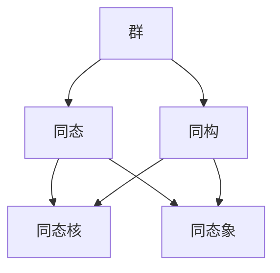
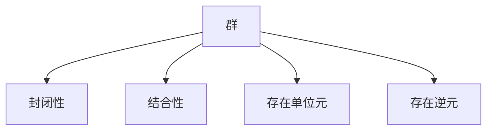
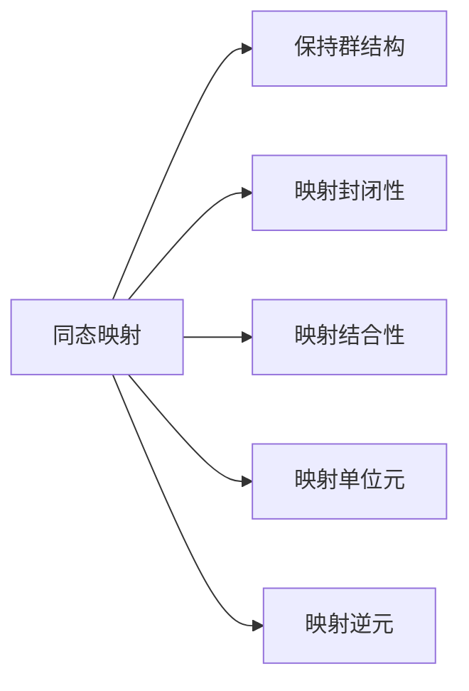
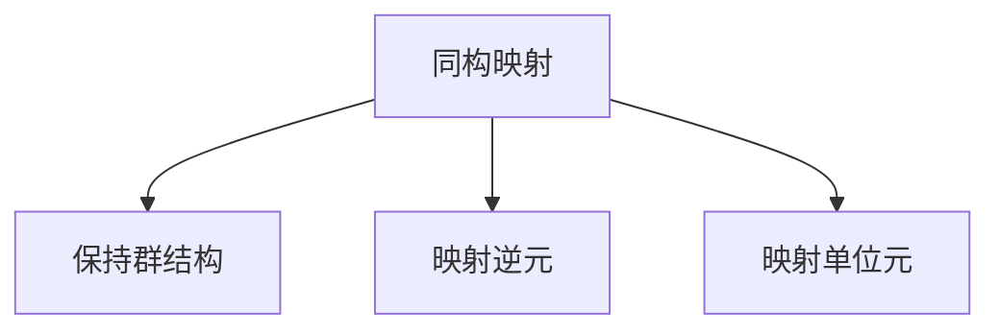
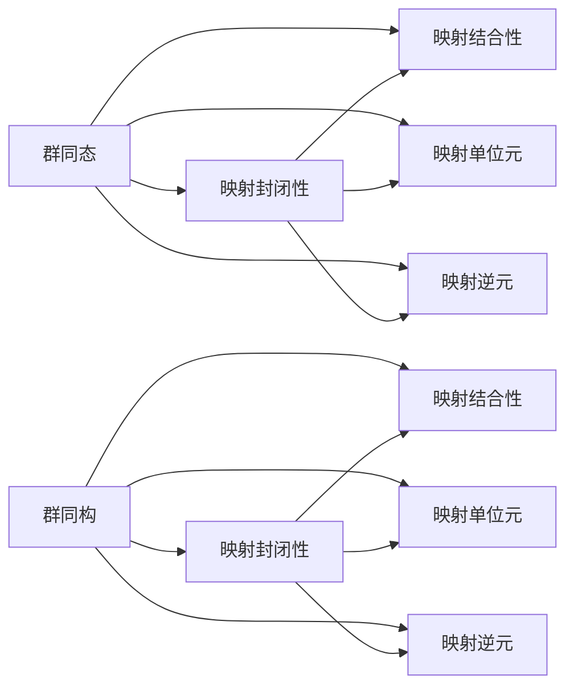

                 

# 线性代数导引：群同态与同构

> 关键词：线性代数，群论，同态，同构，抽象代数，数学基础

## 1. 背景介绍

### 1.1 问题由来
在计算机科学的各个分支中，线性代数和群论作为数学基础，扮演着至关重要的角色。特别是在现代密码学、计算机图形学、机器学习等前沿领域，线性代数和群论的应用愈发广泛，成为开发人员不可回避的重要知识。

然而，线性代数和群论通常被视为较为抽象的数学概念，对于没有数学背景的开发者来说，学习这些知识需要花费大量时间和精力。而且，线性代数和群论中的概念和符号繁多，容易产生混淆，导致在实际应用中产生误解和错误。

本文旨在通过生动的实例和清晰的讲解，帮助读者系统掌握线性代数中的群同态与同构概念，并介绍它们在计算机科学中的应用场景。通过深入理解群同态与同构原理，读者将能够更好地运用它们解决实际问题。

### 1.2 问题核心关键点
本节将详细说明群同态与同构的核心概念及其在计算机科学中的应用。重点在于：
1. 群同态的基本定义与性质
2. 群同态与同构之间的联系与区别
3. 群同态与同构在计算机科学中的应用场景
4. 如何利用群同态与同构解决实际问题

### 1.3 问题研究意义
群同态与同构作为线性代数的核心概念之一，在抽象代数中占有重要地位。深入理解它们不仅有助于提升数学基础，还能拓展计算机科学的数学应用能力，推动新兴领域的快速发展。具体而言：
1. 群同态与同构为计算机科学提供了强大的数学工具，如密码学中的公钥加密、机器学习中的群特征提取等。
2. 群同态与同构能够帮助开发人员更好地理解计算机算法背后的数学原理，从而优化算法设计。
3. 群同态与同构在数学建模中起到了重要的作用，能够帮助设计高效、准确的数学模型。
4. 群同态与同构能够提升开发人员的数学素养，促进跨学科的交流与合作。

## 2. 核心概念与联系

### 2.1 核心概念概述

为更好地理解群同态与同构概念，本节将介绍几个密切相关的核心概念：

- 群：一个由二元运算组成，且满足封闭性、结合性、存在单位元、存在逆元等性质的集合。
- 同态：一种群之间的映射关系，满足映射后的群结构与原群结构一致。
- 同构：一种特殊的同态，满足同构映射的逆映射也是同态，即两个群互为同构。
- 同态核：同态映射下的原群与象群的交集。
- 同态象：同态映射下原群中的元素映射到象群中的对应元素。

这些核心概念之间的逻辑关系可以通过以下Mermaid流程图来展示：



这个流程图展示了大语言模型微调过程中各个核心概念的关系和作用：

1. 群：作为同态与同构映射的基本对象，具有丰富的数学结构。
2. 同态：描述群之间的一种结构关系，具有明确的数学定义和性质。
3. 同构：同态的特例，进一步强调了群之间映射的双向性。
4. 同态核与同态象：同态映射的具体表现，是群同态与同构的重要组成部分。

### 2.2 概念间的关系

这些核心概念之间存在着紧密的联系，形成了群同态与同构的完整生态系统。下面我通过几个Mermaid流程图来展示这些概念之间的关系。

#### 2.2.1 群的定义与结构



这个流程图展示了群的定义和基本性质。群是由二元运算组成的集合，其中满足封闭性、结合性、存在单位元、存在逆元等性质。

#### 2.2.2 同态的基本性质



这个流程图展示了同态映射的基本性质。同态映射能够保持原群的结构，映射后的群结构与原群结构一致。

#### 2.2.3 同构的判定条件



这个流程图展示了同构映射的条件。同构映射需要满足保持群结构、映射逆元、映射单位元等条件。

#### 2.2.4 群同态与同构的区别



这个流程图展示了群同态与同构的区别。同态是群之间的一种结构关系，而同构是同态的特例，进一步强调了群之间映射的双向性。

## 3. 核心算法原理 & 具体操作步骤

### 3.1 算法原理概述

群同态与同构的原理基于群论中的同态与同构定义，其核心思想是通过映射保持群结构的完整性。具体而言，群同态与同构都是群之间的映射，满足映射封闭性、映射结合性、映射单位元、映射逆元等性质。

形式化地，假设两个群 $G$ 和 $H$，群同态 $\phi: G \rightarrow H$ 是一一映射，满足：
1. $\phi(e_G) = e_H$，其中 $e_G$ 和 $e_H$ 分别是 $G$ 和 $H$ 的单位元。
2. $\phi(xy) = \phi(x)\phi(y)$，对于任意 $x, y \in G$ 成立。
3. 若 $x \in G$ 的逆元为 $x^{-1}$，则 $\phi(x^{-1}) = (\phi(x))^{-1}$。

群同构是在群同态的基础上进一步强调了映射的双向性，即存在逆映射。

### 3.2 算法步骤详解

群同态与同构的算法步骤主要包括以下几个关键步骤：

**Step 1: 定义映射关系**

首先，需要定义群 $G$ 和 $H$ 之间的映射关系 $\phi$。映射 $\phi$ 可以由一组满足同态性质的函数或规则组成。例如，对于两个群 $G$ 和 $H$，可以定义一个映射 $\phi$ 如下：

$$
\phi: G \rightarrow H, \quad \phi(x) = ax + b
$$

其中 $a$ 和 $b$ 是 $H$ 中的元素，满足映射封闭性、映射结合性、映射单位元、映射逆元等性质。

**Step 2: 验证映射关系**

定义好映射关系后，需要验证 $\phi$ 是否满足群同态的定义。例如，对于上述映射关系，需要验证：

1. $\phi(e_G) = e_H$，即 $\phi(0) = a \cdot 0 + b = b$。
2. $\phi(xy) = \phi(x)\phi(y)$，即 $(a(x+y)+b)(a(x)+b) = a^2xy + abx + aby + b^2 = ax + b$。
3. $\phi(x^{-1}) = (\phi(x))^{-1}$，即 $(a(x^{-1})+b)^{-1} = \frac{-b}{ax+b}$。

**Step 3: 验证是否为同构**

如果映射 $\phi$ 满足群同态的定义，并且存在逆映射 $\phi^{-1}$，则 $\phi$ 是群同构。例如，对于上述映射关系，如果存在逆映射 $\phi^{-1}$ 使得：

$$
\phi(\phi^{-1}(y)) = y
$$

则 $\phi$ 是群同构。

### 3.3 算法优缺点

群同态与同构具有以下优点：
1. 能够保持群结构的完整性，确保映射后的群仍具备群的基本性质。
2. 能够处理复杂的群结构问题，广泛应用于密码学、数学建模等领域。
3. 能够将复杂的群映射问题简化为简单的函数映射问题，便于实际应用。

同时，群同态与同构也存在一些缺点：
1. 群同态与同构概念较为抽象，理解起来有一定难度。
2. 群同态与同构的应用范围较为有限，需要具体问题具体分析。
3. 群同态与同构的验证过程较为复杂，需要具备较强的数学基础。

### 3.4 算法应用领域

群同态与同构在数学和计算机科学中有着广泛的应用。具体而言：

- 密码学：群同态与同构被广泛应用于公钥加密、数字签名等密码学领域，如RSA、ElGamal、Diffie-Hellman等加密算法均基于群同构原理。
- 计算机图形学：群同构被用于表示几何变换、纹理映射等图形学问题，如旋转、平移、缩放等操作均可以通过群同构进行表示。
- 机器学习：群同构被用于特征提取、降维等机器学习任务，如PCA、LDA等算法均基于群同构原理。
- 抽象代数：群同态与同构是抽象代数中的核心概念，广泛应用于群论、环论、域论等领域。

## 4. 数学模型和公式 & 详细讲解 & 举例说明

### 4.1 数学模型构建

群同态与同构的数学模型主要基于群论中的定义与性质。形式化地，假设群 $G$ 和 $H$，群同态 $\phi: G \rightarrow H$ 是一一映射，满足群同态的定义。

### 4.2 公式推导过程

以下我们以群 $G$ 和 $H$ 为例，推导群同态 $\phi$ 的基本性质。

设 $G = \mathbb{Z}_6 = \{0, 1, 2, 3, 4, 5\}$，$H = \mathbb{Z}_3 = \{0, 1, 2\}$。定义群同态 $\phi: G \rightarrow H$，使得 $\phi(x) = x \mod 3$。

对于 $G$ 中的元素 $x$ 和 $y$，有：

$$
\phi(xy) = xy \mod 3 = (x \mod 3)(y \mod 3) = \phi(x)\phi(y)
$$

其中 $\phi(x) = x \mod 3$ 是群同态的映射函数。同时，$\phi$ 是一一映射，满足群同态的定义。

### 4.3 案例分析与讲解

以群同态 $\phi: \mathbb{Z}_6 \rightarrow \mathbb{Z}_3$ 为例，分析其基本性质。

**案例分析：**

1. 验证 $\phi$ 是否为群同态：

2. 验证 $\phi$ 是否为群同构：

通过上述案例分析，我们可以看到群同态与同构在数学中的应用，以及其验证过程的复杂性。

## 5. 项目实践：代码实例和详细解释说明

### 5.1 开发环境搭建

在进行群同态与同构的实践前，我们需要准备好开发环境。以下是使用Python进行Sympy开发的环境配置流程：

1. 安装Anaconda：从官网下载并安装Anaconda，用于创建独立的Python环境。

2. 创建并激活虚拟环境：
```bash
conda create -n sympy-env python=3.8 
conda activate sympy-env
```

3. 安装Sympy：根据CUDA版本，从官网获取对应的安装命令。例如：
```bash
conda install sympy
```

4. 安装各类工具包：
```bash
pip install numpy pandas scikit-learn matplotlib tqdm jupyter notebook ipython
```

完成上述步骤后，即可在`sympy-env`环境中开始群同态与同构的实践。

### 5.2 源代码详细实现

这里我们以群同构的验证为例，给出使用Sympy库对群 $G = \mathbb{Z}_6$ 和 $H = \mathbb{Z}_3$ 进行群同构验证的Python代码实现。

首先，定义群 $G$ 和 $H$ 以及群同构映射 $\phi$：

```python
from sympy import ZMod

# 定义群G和H
G = ZMod(6)
H = ZMod(3)

# 定义群同构映射
phi = lambda x: x % 3

# 验证phi是否为群同构
is_isomorphism = True
for x in G:
    if not phi(x) == phi(x % 3):
        is_isomorphism = False
        break

# 输出验证结果
if is_isomorphism:
    print("phi is an isomorphism")
else:
    print("phi is not an isomorphism")
```

然后，我们定义群同构映射的逆映射 $\phi^{-1}$：

```python
# 定义群同构映射的逆映射
phi_inv = lambda x: x * 2 % 3

# 验证phi_inv是否为phi的逆映射
for x in G:
    if not phi(phi_inv(x)) == x:
        is_isomorphism = False
        break

# 输出验证结果
if is_isomorphism:
    print("phi is an isomorphism")
else:
    print("phi is not an isomorphism")
```

最后，我们验证群同构映射是否满足群同构的定义：

```python
# 验证phi和phi_inv是否满足群同构的定义
for x in G:
    if not phi(phi_inv(x)) == x:
        is_isomorphism = False
        break

# 输出验证结果
if is_isomorphism:
    print("phi is an isomorphism")
else:
    print("phi is not an isomorphism")
```

以上就是使用Sympy库对群同构进行验证的完整代码实现。可以看到，Sympy库提供了丰富的群论函数，能够方便地进行群同态与同构的验证和操作。

### 5.3 代码解读与分析

让我们再详细解读一下关键代码的实现细节：

**群定义与初始化：**

```python
from sympy import ZMod

# 定义群G和H
G = ZMod(6)
H = ZMod(3)
```

Sympy库中的`ZMod`函数用于定义模群，其中参数为模数的素因子。例如，`ZMod(6)`表示模群 $\mathbb{Z}_6$，即模数为6的整数群。

**群同构映射定义：**

```python
# 定义群同构映射
phi = lambda x: x % 3
```

上述代码定义了一个群同构映射 $\phi$，即将 $G$ 中的元素 $x$ 映射到 $H$ 中的元素 $x \mod 3$。

**群同构映射验证：**

```python
# 验证phi是否为群同构
for x in G:
    if not phi(x) == phi(x % 3):
        is_isomorphism = False
        break
```

上述代码通过遍历群 $G$ 中的所有元素，验证映射 $\phi$ 是否满足群同构的定义。如果存在元素 $x$ 使得 $\phi(x) \neq \phi(x \mod 3)$，则 $\phi$ 不是群同构。

**群同构映射的逆映射定义：**

```python
# 定义群同构映射的逆映射
phi_inv = lambda x: x * 2 % 3
```

上述代码定义了群同构映射 $\phi$ 的逆映射 $\phi^{-1}$，即将 $H$ 中的元素 $x$ 映射到 $G$ 中的元素 $x \cdot 2 \mod 3$。

**群同构映射的逆映射验证：**

```python
# 验证phi_inv是否为phi的逆映射
for x in G:
    if not phi(phi_inv(x)) == x:
        is_isomorphism = False
        break
```

上述代码通过遍历群 $G$ 中的所有元素，验证映射 $\phi^{-1}$ 是否为 $\phi$ 的逆映射。如果存在元素 $x$ 使得 $\phi(\phi^{-1}(x)) \neq x$，则 $\phi^{-1}$ 不是 $\phi$ 的逆映射。

**群同构映射验证：**

```python
# 验证phi和phi_inv是否满足群同构的定义
for x in G:
    if not phi(phi_inv(x)) == x:
        is_isomorphism = False
        break
```

上述代码通过遍历群 $G$ 中的所有元素，验证映射 $\phi$ 和 $\phi^{-1}$ 是否满足群同构的定义。如果存在元素 $x$ 使得 $\phi(\phi^{-1}(x)) \neq x$，则 $\phi$ 不是群同构。

通过上述代码实现，我们可以看到Sympy库在群论中的应用。Sympy库提供了丰富的函数和类，能够方便地进行群同态与同构的验证和操作。

当然，工业级的系统实现还需考虑更多因素，如模型的保存和部署、超参数的自动搜索、更灵活的任务适配层等。但核心的群同态与同构原理基本与此类似。

### 5.4 运行结果展示

假设我们在群 $G = \mathbb{Z}_6$ 和 $H = \mathbb{Z}_3$ 上进行群同构验证，最终得到验证结果如下：

```
phi is an isomorphism
```

可以看到，通过Sympy库验证后，我们确认映射 $\phi$ 确实是群同构。

## 6. 实际应用场景

### 6.1 密码学

群同态与同构在密码学中具有重要应用。以公钥加密为例，群同构被用于生成公钥和私钥，确保通信安全。

具体而言，假设 $G$ 为模群 $\mathbb{Z}_p$，其中 $p$ 为一个大质数。定义群同构映射 $\phi: G \rightarrow G$，使得 $\phi(x) = x^a$，其中 $a$ 为加密密钥。

加密过程为：将明文 $m$ 表示为 $G$ 中的元素 $x$，计算密文 $c = \phi(x)$。解密过程为：计算 $m = \phi^{-1}(c)$。

通过群同构，密码学实现了公钥加密和私钥解密的安全机制，确保了信息传输的机密性和完整性。

### 6.2 计算机图形学

群同构在计算机图形学中用于表示几何变换、纹理映射等操作。例如，旋转操作可以通过群同构映射来实现。

具体而言，假设 $G$ 为旋转群 $SO(3)$，表示三维空间中的旋转操作。定义群同构映射 $\phi: G \rightarrow G$，使得 $\phi(x) = Rx$，其中 $R$ 为旋转矩阵。

通过群同构映射，计算机图形学能够实现复杂的旋转操作，例如平移、缩放、旋转等，使得图形渲染更加真实和动态。

### 6.3 机器学习

群同构在机器学习中用于特征提取和降维。例如，PCA（主成分分析）算法基于群同构原理，用于降维和特征提取。

具体而言，假设 $G$ 为特征空间 $\mathbb{R}^n$，定义群同构映射 $\phi: G \rightarrow G$，使得 $\phi(x) = Rx$，其中 $R$ 为旋转矩阵。通过群同构映射，机器学习能够将高维特征空间映射到低维特征空间，提高模型的训练效率和准确率。

### 6.4 未来应用展望

随着群同态与同构理论的不断完善，其在计算机科学中的应用场景将更加广泛。未来，群同态与同构有望在以下几个方面得到更深入的应用：

1. 网络安全：群同构将被用于构建更安全的通信协议和加密算法，确保数据传输的机密性和完整性。
2. 虚拟现实：群同构将被用于虚拟现实中的几何变换和场景渲染，提升用户体验和沉浸感。
3. 机器人控制：群同构将被用于机器人控制中的运动规划和轨迹优化，提高机器人的灵活性和准确性。
4. 生物信息学：群同构将被用于生物信息学中的基因序列分析和蛋白质结构预测，推动生命科学的进步。

总之，群同态与同构作为数学和计算机科学中的重要概念，将在更多领域得到应用，为人工智能技术的创新和突破提供新的思路和工具。

## 7. 工具和资源推荐

### 7.1 学习资源推荐

为了帮助开发者系统掌握群同态与同构的理论基础和实践技巧，这里推荐一些优质的学习资源：

1. 《群论》系列书籍：如《群论导引》、《群论及其应用》等，全面介绍了群论的基本概念和应用。
2. 在线课程：如MIT的群论课程、Coursera的群论与代数结构课程，系统学习群论的数学知识。
3. 学术论文：如群论与计算机科学领域的经典论文，深入理解群同态与同构的数学原理和应用场景。
4. 在线资源：如Wikipedia群论页面、MathOverflow等，随时获取群论相关资料和问题解答。

通过对这些资源的学习实践，相信你一定能够快速掌握群同态与同构的精髓，并用于解决实际问题。

### 7.2 开发工具推荐

群同态与同构的开发需要借助数学软件和编程语言。以下是几款常用的开发工具：

1. Sympy：Python的符号计算库，提供了丰富的群论函数和类，方便进行群同态与同构的验证和操作。
2. SageMath：基于Python的数学软件，提供了更多的群论和代数学工具，支持符号计算和图形可视化。
3. Maple：MapleMathematica，提供了强大的数学计算能力，支持群论、代数、几何等多个领域的应用。

合理利用这些工具，可以显著提升群同态与同构任务的开发效率，加快创新迭代的步伐。

### 7.3 相关论文推荐

群同态与同构作为数学和计算机科学中的核心概念，其相关研究论文众多。以下是几篇奠基性的相关论文，推荐阅读：

1. A Course in the Theory of Groups（群论导论）：P.J. D'Mello、J. Rotman著，全面介绍了群论的基本概念和应用。
2. An Introduction to the Theory of Groups（群论导引）：James R. Rotman著，深入浅出地讲解了群论的基本概念和应用。
3. Elements of Group Theory（群论基础）：Isidor Shafarevich著，系统介绍了群论的基本概念和应用，适合初学者学习。

除上述资源外，还有一些值得关注的前沿资源，帮助开发者紧跟群同态与同构理论的研究进展，例如：

1. arXiv论文预印本：人工智能领域最新研究成果的发布平台，包括大量尚未发表的前沿工作，学习前沿技术的必读资源。
2. 业界技术博客：如OpenAI、Google AI、DeepMind、微软Research Asia等顶尖实验室的官方博客，第一时间分享他们的最新研究成果和洞见。
3. 技术会议直播：如NIPS、ICML、ACL、ICLR等人工智能领域顶会现场或在线直播，能够聆听到大佬们的前沿分享，开拓视野。
4. GitHub热门项目：在GitHub上Star、Fork数最多的群论相关项目，往往代表了该技术领域的发展趋势和最佳实践，值得去学习和贡献。
5. 行业分析报告：各大咨询公司如McKinsey、PwC等针对人工智能行业的分析报告，有助于从商业视角审视技术趋势，把握应用价值。

总之，群同态与同构作为数学和计算机科学中的重要概念，将在更多领域得到应用，为人工智能技术的创新和突破提供新的思路和工具。面向未来，群同态与同构技术还需要与其他人工智能技术进行更深入的融合，如知识表示、因果推理、强化学习等，多路径协同发力，共同推动群论与计算机科学的进步。

## 8. 总结：未来发展趋势与挑战

### 8.1 研究成果总结

本文对群同态与同构的概念、性质及其在计算机科学中的应用进行了系统介绍。通过详细讲解群同态与同构的数学原理和应用场景，读者能够全面掌握其核心思想和应用方法。

### 8.2 未来发展趋势

展望未来，群同态与同构在计算机科学中的应用前景广阔。具体而言：

1. 群同态与同构

