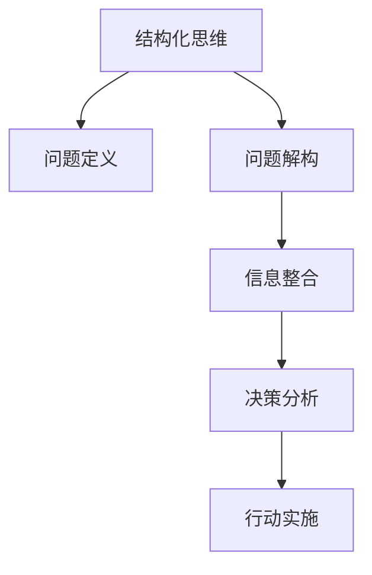
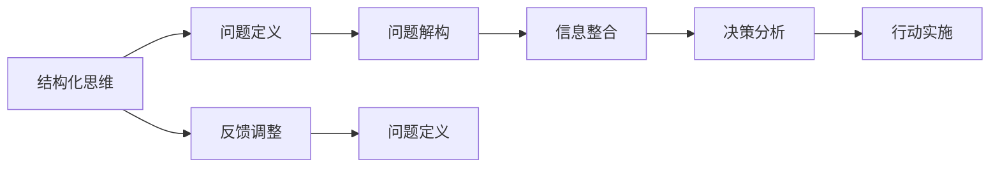
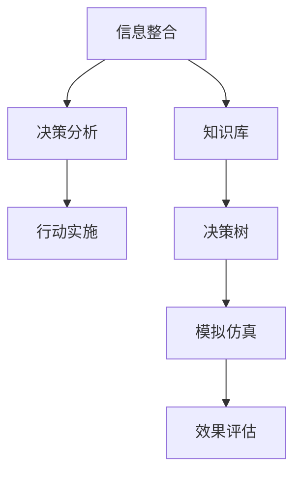
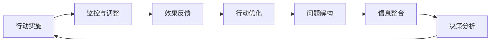
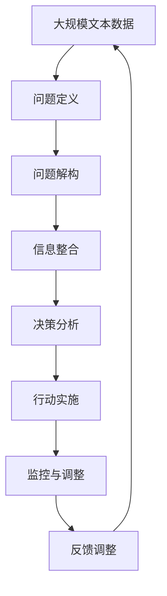

                 

## 1. 背景介绍

### 1.1 问题由来
在现代信息技术快速发展的背景下，结构化思维（Structured Thinking）作为解决复杂问题的一种重要方法，已经在各行各业得到了广泛的应用。无论是数据分析、产品设计、项目管理，还是商业决策，结构化思维都能提供一种系统化、科学化的处理框架。然而，尽管结构化思维的理论已经较为成熟，但在实际应用中仍然存在诸多挑战。这些问题包括：

- 如何设计出符合实际需求的思维模型；
- 如何在多变的环境下灵活运用结构化思维；
- 如何整合多学科知识，提升思维模型的实用性；
- 如何通过技术手段辅助结构化思维的实践；
- 如何在不同情境下进行结构化思维的适应性调整。

这些问题直接关系到结构化思维的推广和应用效果。本文将深入探讨结构化思维的理论基础和实践应用，从原理到工具，从案例到挑战，全面解析结构化思维的方法论，为读者提供全面的理论指导和实践操作指南。

### 1.2 问题核心关键点
结构化思维的核心在于将复杂问题拆分为可管理的小问题，通过系统化的步骤和方法，逐步解决问题。其关键点包括：

- 问题定义：清晰、准确地定义问题，确定问题的边界和解决目标。
- 问题解构：将问题拆分为子问题，建立系统化的解构框架。
- 信息整合：利用多学科知识进行信息整合，形成综合解决方案。
- 决策分析：通过逻辑推理、数据分析、模拟仿真等手段，评估不同决策方案的效果。
- 行动实施：制定详细的执行计划，监控执行过程，及时调整策略。

这些关键点共同构成了结构化思维的实践框架，帮助用户系统性地处理和解决复杂问题。

### 1.3 问题研究意义
结构化思维的应用，对于提升个人和组织的决策能力、项目管理效率、创新能力以及问题解决能力，具有重要的意义。具体来说：

1. **提升决策质量**：结构化思维通过系统的分析方法，避免决策的片面性和随机性，提高决策的科学性和客观性。
2. **提高项目效率**：通过明确的问题定义和分解，使项目团队能够有条不紊地推进工作，减少冗余和浪费。
3. **促进创新发展**：结构化思维鼓励多角度思考和信息整合，为创新提供新的思路和方法。
4. **强化问题解决**：系统化的分析框架，帮助用户更快、更准确地找到问题根源，制定有效的解决方案。
5. **推动技术应用**：结合技术手段进行结构化思维的实践，可以提高问题处理的效率和精度。

总之，结构化思维不仅是解决复杂问题的利器，也是推动技术应用、提升组织能力的重要工具。

## 2. 核心概念与联系

### 2.1 核心概念概述

为了更好地理解结构化思维的原理和应用，本节将介绍几个密切相关的核心概念：

- **结构化思维**：指通过系统化的方法和框架，将复杂问题拆分为可管理的小问题，逐步解决的过程。
- **问题定义**：明确问题边界、目标和需求，是结构化思维的第一步。
- **问题解构**：将大问题拆分为可管理的子问题，建立系统化的解构框架。
- **信息整合**：利用多学科知识进行信息整合，形成综合解决方案。
- **决策分析**：通过逻辑推理、数据分析、模拟仿真等手段，评估不同决策方案的效果。
- **行动实施**：制定详细的执行计划，监控执行过程，及时调整策略。

这些核心概念之间存在着紧密的联系，形成了结构化思维的完整实践框架。下面通过一个Mermaid流程图来展示这些概念之间的逻辑关系：



这个流程图展示了大问题解构、信息整合、决策分析到行动实施的全过程，强调了结构化思维的系统性和逻辑性。

### 2.2 概念间的关系

这些核心概念之间存在着紧密的联系，构成了结构化思维的完整生态系统。下面我们通过几个Mermaid流程图来展示这些概念之间的关系。

#### 2.2.1 结构化思维的全过程



这个流程图展示了结构化思维的完整过程，从问题定义到行动实施，再到反馈调整，形成了闭环的管理系统。

#### 2.2.2 信息整合在决策分析中的作用



这个流程图展示了信息整合在决策分析中的作用。通过整合多学科知识，形成决策树和模拟仿真，可以更全面地评估决策方案的效果。

#### 2.2.3 行动实施的监控与调整



这个流程图展示了行动实施的监控与调整过程。通过监控和调整，确保行动计划的有效执行，同时为下一步问题解构和信息整合提供依据。

### 2.3 核心概念的整体架构

最后，我们用一个综合的流程图来展示这些核心概念在大问题解决过程中的整体架构：



这个综合流程图展示了从问题定义到反馈调整的全过程，强调了结构化思维的循环性和动态性。

## 3. 核心算法原理 & 具体操作步骤
### 3.1 算法原理概述

结构化思维的本质是一种问题解构和信息整合的过程。其算法原理主要包括以下几个步骤：

1. **问题定义**：明确问题的边界和目标，确定解决问题的关键要素。
2. **问题解构**：将大问题拆分为可管理的子问题，建立系统化的解构框架。
3. **信息整合**：利用多学科知识进行信息整合，形成综合解决方案。
4. **决策分析**：通过逻辑推理、数据分析、模拟仿真等手段，评估不同决策方案的效果。
5. **行动实施**：制定详细的执行计划，监控执行过程，及时调整策略。

这些步骤构成了一个完整的结构化思维算法框架，帮助用户系统性地解决复杂问题。

### 3.2 算法步骤详解

结构化思维的详细步骤如下：

**Step 1: 问题定义**
- 明确问题的边界和目标，列出所有关键要素。
- 确定解决问题的核心需求和约束条件。
- 定义成功解决的标准和评估指标。

**Step 2: 问题解构**
- 将大问题拆分为若干小问题，建立系统化的解构框架。
- 为每个子问题设定明确的解决方案，制定优先级和依赖关系。
- 确定每个子问题的输入和输出，建立问题之间的联系。

**Step 3: 信息整合**
- 收集与问题相关的多学科知识，建立知识库。
- 整合不同学科的知识和经验，形成综合解决方案。
- 利用多模态数据进行信息整合，提高解决方案的全面性和准确性。

**Step 4: 决策分析**
- 通过逻辑推理、数据分析、模拟仿真等手段，评估不同决策方案的效果。
- 利用决策树、层次分析法等工具，进行决策方案的比较和选择。
- 利用多目标优化算法，优化决策方案，找到最优解。

**Step 5: 行动实施**
- 制定详细的执行计划，明确每个子问题的执行步骤和时间节点。
- 分配任务和资源，确定责任人和监督机制。
- 监控执行过程，及时发现和解决问题，调整策略。

**Step 6: 反馈调整**
- 收集反馈信息，评估执行效果，进行效果分析。
- 根据反馈信息进行优化调整，完善解决方案。
- 记录经验和教训，为未来问题解决提供参考。

这些步骤是结构化思维的核心，涵盖了问题解决的整个过程，从问题定义到最终执行和反馈调整。

### 3.3 算法优缺点

结构化思维具有以下优点：

1. **系统性**：通过系统化的方法和框架，能够全面、系统地处理复杂问题，避免遗漏和片面性。
2. **科学性**：通过多学科知识和数据分析，提供科学、客观的决策依据，提高决策的准确性和可靠性。
3. **可操作性**：每个步骤都有明确的操作流程和执行标准，易于实施和推广。
4. **灵活性**：能够根据实际情况进行调整和优化，适应不同环境和需求。

同时，结构化思维也存在一些缺点：

1. **复杂性**：步骤较多，流程复杂，需要一定的专业知识和经验。
2. **耗时较长**：每个步骤都需要详细分析和评估，导致问题解决周期较长。
3. **缺乏创新性**：过于注重规范和流程，可能限制创新的空间。
4. **依赖数据**：需要大量高质量的数据和信息，数据不足可能导致解决方案不够全面。

在实际应用中，需要根据具体情况选择合适的方案，并结合实际情况进行调整和优化。

### 3.4 算法应用领域

结构化思维广泛应用于多个领域，包括但不限于：

1. **项目管理**：通过系统化的方法，优化项目计划、资源配置和执行过程，提高项目管理效率。
2. **产品设计**：明确产品需求和用户期望，系统化地进行产品设计和优化，提升产品竞争力。
3. **商业决策**：通过数据分析和信息整合，提供科学、客观的决策依据，优化商业决策。
4. **技术开发**：明确技术需求和开发目标，系统化地进行技术研发和测试，提高技术开发效率。
5. **组织管理**：通过系统化的方法，优化组织结构、流程和人员配置，提升组织效能。
6. **创新发展**：通过多角度思考和信息整合，激发创新灵感，推动技术创新和产品创新。

这些应用领域展示了结构化思维的广泛适用性和重要价值。

## 4. 数学模型和公式 & 详细讲解 & 举例说明

### 4.1 数学模型构建

结构化思维的数学模型主要关注于问题的解构和决策分析。以项目管理的结构化思维为例，其数学模型可以表示为：

- 问题定义：明确项目目标和需求，设定成功标准。
- 问题解构：将项目拆分为若干子任务，建立任务依赖关系。
- 信息整合：收集多学科知识，形成综合解决方案。
- 决策分析：通过逻辑推理和数据分析，评估不同决策方案的效果。
- 行动实施：制定详细的执行计划，监控执行过程，及时调整策略。

### 4.2 公式推导过程

以决策树为例，其数学模型可以表示为：

- 决策节点：代表不同决策方案，有分支指向不同的子任务。
- 评估指标：如成本、时间、质量等，用于评估不同方案的效果。
- 叶子节点：代表最终的决策结果，根据评估指标进行评估和选择。

通过决策树，可以将复杂的决策过程系统化，便于评估和选择最优方案。

### 4.3 案例分析与讲解

以下是一个简单的案例分析，展示如何使用结构化思维解决复杂问题：

**案例背景**：某科技公司需要开发一款新产品，但面临技术挑战、市场需求和成本控制等多重压力。

**问题定义**：明确产品需求、技术挑战、市场需求和成本控制目标，设定成功标准。

**问题解构**：将问题拆分为技术研发、市场需求分析、成本控制和用户体验优化四个子问题，建立系统化的解构框架。

**信息整合**：收集多学科知识，形成综合解决方案，包括技术专家、市场分析师、财务经理和用户体验设计师的意见。

**决策分析**：通过逻辑推理、数据分析、模拟仿真等手段，评估不同决策方案的效果，如技术路径、市场推广策略、成本控制措施和用户体验优化方案。

**行动实施**：制定详细的执行计划，明确每个子问题的执行步骤和时间节点，分配任务和资源，确定责任人和监督机制。

**反馈调整**：收集反馈信息，评估执行效果，进行效果分析，根据反馈信息进行优化调整，完善解决方案。

通过系统化的方法，该公司成功开发出了新产品，并在市场中取得了良好的反响。

## 5. 项目实践：代码实例和详细解释说明

### 5.1 开发环境搭建

在进行结构化思维实践前，我们需要准备好开发环境。以下是使用Python进行结构化思维开发的Python环境配置流程：

1. 安装Anaconda：从官网下载并安装Anaconda，用于创建独立的Python环境。

2. 创建并激活虚拟环境：
```bash
conda create -n structthinking python=3.8 
conda activate structthinking
```

3. 安装必要的Python库：
```bash
pip install pandas numpy matplotlib seaborn jupyter notebook scikit-learn
```

4. 安装决策树库：
```bash
pip install scikit-learn
```

完成上述步骤后，即可在`structthinking`环境中开始结构化思维实践。

### 5.2 源代码详细实现

以下是一个简单的结构化思维模型实现的Python代码：

```python
import numpy as np
import pandas as pd
import matplotlib.pyplot as plt

# 数据准备
data = pd.read_csv('project_data.csv')
target = data['target']

# 数据预处理
X = data.drop('target', axis=1)
X = X.values

# 决策树模型
from sklearn.tree import DecisionTreeClassifier
clf = DecisionTreeClassifier(max_depth=3, random_state=42)
clf.fit(X, target)

# 模型评估
from sklearn.metrics import accuracy_score
y_pred = clf.predict(X)
accuracy = accuracy_score(target, y_pred)

# 输出结果
print('Accuracy:', accuracy)

# 可视化
from sklearn.tree import plot_tree
plt.figure(figsize=(12, 8))
plot_tree(clf, filled=True, feature_names=X.columns, class_names=['low', 'high'])
plt.title('Decision Tree')
plt.show()
```

### 5.3 代码解读与分析

这个代码实现了一个简单的决策树模型，用于评估项目的可行性。主要步骤包括数据准备、模型训练和评估以及结果可视化。

**数据准备**：读取项目数据，定义目标变量和特征变量。

**模型训练**：使用决策树算法进行模型训练，设定最大深度和随机状态。

**模型评估**：使用准确率评估模型效果，输出准确率。

**结果可视化**：通过可视化决策树，展示模型的决策路径和输出结果。

## 6. 实际应用场景

### 6.1 项目管理

结构化思维在项目管理中有着广泛的应用。通过系统化的解构和信息整合，项目管理团队可以更好地制定项目计划、分配资源、监控执行过程，确保项目按时按质完成。以下是一个简单的项目管理案例：

**案例背景**：某公司需要开发一款新软件，涉及多个部门和团队，包括开发、测试、市场和客服。

**问题定义**：明确项目目标、时间节点和成功标准。

**问题解构**：将项目拆分为需求分析、技术研发、测试、市场推广和客服支持五个子任务，建立系统化的解构框架。

**信息整合**：收集开发、测试、市场和客服的意见和经验，形成综合解决方案。

**决策分析**：通过逻辑推理和数据分析，评估不同决策方案的效果，如技术路径、市场推广策略和客服支持措施。

**行动实施**：制定详细的执行计划，明确每个子任务的执行步骤和时间节点，分配资源，确定责任人和监督机制。

**反馈调整**：收集反馈信息，评估执行效果，进行效果分析，根据反馈信息进行优化调整，完善解决方案。

通过系统化的方法，该公司成功开发出了新软件，并在市场中取得了良好的反响。

### 6.2 商业决策

结构化思维在商业决策中同样具有重要价值。通过系统化的分析和信息整合，企业可以制定科学的商业决策，优化资源配置，提升竞争优势。以下是一个简单的商业决策案例：

**案例背景**：某公司需要决定是否进军新市场，面临市场规模、市场需求和成本控制等多重因素。

**问题定义**：明确决策目标、时间节点和成功标准。

**问题解构**：将问题拆分为市场规模评估、市场需求分析和成本控制评估三个子问题，建立系统化的解构框架。

**信息整合**：收集市场调研、财务分析等多学科知识，形成综合解决方案。

**决策分析**：通过逻辑推理和数据分析，评估不同决策方案的效果，如市场进入策略和成本控制措施。

**行动实施**：制定详细的执行计划，明确每个子任务的执行步骤和时间节点，分配资源，确定责任人和监督机制。

**反馈调整**：收集反馈信息，评估执行效果，进行效果分析，根据反馈信息进行优化调整，完善解决方案。

通过系统化的方法，该公司成功进入了新市场，并取得了良好的市场反响和财务收益。

### 6.3 技术开发

结构化思维在技术开发中同样具有重要价值。通过系统化的分析和信息整合，技术团队可以制定科学的技术研发和优化方案，提高技术开发效率。以下是一个简单的技术开发案例：

**案例背景**：某公司需要开发一款新产品，面临技术挑战、市场需求和成本控制等多重压力。

**问题定义**：明确产品需求、技术挑战、市场需求和成本控制目标，设定成功标准。

**问题解构**：将问题拆分为技术研发、市场需求分析、成本控制和用户体验优化四个子问题，建立系统化的解构框架。

**信息整合**：收集技术专家、市场分析师、财务经理和用户体验设计师的意见，形成综合解决方案。

**决策分析**：通过逻辑推理、数据分析、模拟仿真等手段，评估不同决策方案的效果，如技术路径、市场推广策略、成本控制措施和用户体验优化方案。

**行动实施**：制定详细的执行计划，明确每个子问题的执行步骤和时间节点，分配资源，确定责任人和监督机制。

**反馈调整**：收集反馈信息，评估执行效果，进行效果分析，根据反馈信息进行优化调整，完善解决方案。

通过系统化的方法，该公司成功开发出了新产品，并在市场中取得了良好的反响。

### 6.4 未来应用展望

随着信息技术的发展，结构化思维的应用领域将更加广泛。未来，结构化思维将在更多领域得到应用，为组织和个人带来更大的价值。以下是一个简单的未来应用案例：

**案例背景**：某城市面临交通拥堵问题，需要制定科学的交通管理方案。

**问题定义**：明确交通管理目标、时间节点和成功标准。

**问题解构**：将问题拆分为交通流量分析、交通信号优化和公共交通优化三个子问题，建立系统化的解构框架。

**信息整合**：收集交通数据分析、城市规划等多学科知识，形成综合解决方案。

**决策分析**：通过逻辑推理和数据分析，评估不同决策方案的效果，如交通信号优化和公共交通优化方案。

**行动实施**：制定详细的执行计划，明确每个子任务的执行步骤和时间节点，分配资源，确定责任人和监督机制。

**反馈调整**：收集反馈信息，评估执行效果，进行效果分析，根据反馈信息进行优化调整，完善解决方案。

通过系统化的方法，该城市成功缓解了交通拥堵问题，提升了城市交通管理水平。

## 7. 工具和资源推荐

### 7.1 学习资源推荐

为了帮助开发者系统掌握结构化思维的理论基础和实践技巧，这里推荐一些优质的学习资源：

1. 《结构化思维导论》：介绍结构化思维的基本概念和应用方法，适合入门学习。
2. 《系统思考：解决复杂问题的利器》：系统讲解系统思考的基本框架和方法，适合进阶学习。
3. 《决策树与随机森林》：详细讲解决策树算法的原理和应用，适合深入学习。
4. 《项目管理：理论与实践》：全面介绍项目管理的基本方法和工具，适合项目管理专业人员学习。
5. 《商业决策分析》：讲解商业决策的基本方法和工具，适合商业决策人员学习。
6. 《技术开发与创新》：介绍技术开发的基本方法和工具，适合技术开发人员学习。

通过对这些资源的学习实践，相信你一定能够快速掌握结构化思维的精髓，并用于解决实际的复杂问题。

### 7.2 开发工具推荐

高效的开发离不开优秀的工具支持。以下是几款用于结构化思维开发的常用工具：

1. Python：开源的动态解释型编程语言，灵活性高，适合结构化思维模型的开发。
2. Jupyter Notebook：交互式编程环境，支持Python、R等多种语言，适合开发和分享学习笔记。
3. Scikit-learn：开源的机器学习库，包含多种算法和工具，适合结构化思维模型的应用。
4. PyCharm：强大的Python IDE，支持多种开发工具和库，适合复杂项目开发。
5. Visual Paradigm：专业的项目管理工具，支持敏捷开发、任务管理等功能，适合项目管理实践。

合理利用这些工具，可以显著提升结构化思维模型的开发效率，加快创新迭代的步伐。

### 7.3 相关论文推荐

结构化思维的研究涉及多学科知识，以下几篇经典论文推荐阅读：

1. "Structured Thinking: A New Approach to Problem-Solving"：系统介绍结构化思维的基本框架和方法。
2. "Decision Trees: A Practical Guide"：讲解决策树算法的原理和应用。
3. "System Thinking: A Brief Introduction"：介绍系统思考的基本框架和方法。
4. "Project Management: A Practical Guide"：讲解项目管理的框架和方法。
5. "Business Decision Making: An Overview"：讲解商业决策的基本方法和工具。
6. "Technical Development and Innovation: A Guide"：讲解技术开发的基本方法和工具。

这些论文代表了大规模结构化思维的研究进展，通过学习这些前沿成果，可以帮助研究者把握学科前进方向，激发更多的创新灵感。

除上述资源外，还有一些值得关注的前沿资源，帮助开发者紧跟结构化思维技术的研究进展，例如：

1. arXiv论文预印本：人工智能领域最新研究成果的发布平台，包括大量尚未发表的前沿工作，学习前沿技术的必读资源。
2. 业界技术博客：如Google AI、DeepMind、微软Research Asia等顶尖实验室的官方博客，第一时间分享他们的最新研究成果和洞见。
3. 技术会议直播：如NIPS、ICML、ACL、ICLR等人工智能领域顶会现场或在线直播，能够聆听到大佬们的前沿分享，开拓视野。
4. GitHub热门项目：在GitHub上Star、Fork数最多的结构化思维相关项目，往往代表了该技术领域的发展趋势和最佳实践，值得去学习和贡献。
5. 行业分析报告：各大咨询公司如McKinsey、PwC等针对结构化思维行业的分析报告，有助于从商业视角审视技术趋势，把握应用价值。

总之，对于结构化思维的学习和实践，需要开发者保持开放的心态和持续学习的意愿。多关注前沿资讯，多动手实践，多思考总结，必将收获满满的成长收益。

## 8. 总结：未来发展趋势与挑战

### 8.1 总结

本文对结构化思维的理论基础和实践应用进行了全面系统的介绍。首先阐述了结构化思维的核心概念和实践框架，明确了结构化思维在解决复杂问题中的独特价值。其次，从原理到实践，详细讲解了结构化思维的数学模型和操作步骤，给出了结构化思维模型开发的完整代码实例。同时，本文还广泛探讨了结构化思维在项目管理、商业决策、技术开发等多个领域的应用前景，展示了结构化思维的广泛适用性和重要价值。此外，本文精选了结构化思维技术的各类学习资源，力求为读者提供全方位的理论指导和实践操作指南。

通过本文的系统梳理，可以看到，结构化思维不仅是解决复杂问题的利器，也是推动技术应用、提升组织能力的重要工具。未来，随着结构化思维理论的不断发展和实践经验的积累，必将有更多的创新和突破，推动人工智能技术的广泛应用和深入发展。

### 8.2 未来发展趋势

结构化思维的应用将呈现以下几个发展趋势：

1. **智能化**：结合人工智能技术，提高结构化思维模型的自动化和智能化水平，提升问题解决的效率和精度。
2. **融合化**：与其他技术手段如大数据、云计算、区块链等进行深度融合，扩展结构化思维的应用范围。
3. **全局化**：将结构化思维应用到组织管理和企业战略层面，提升企业的整体竞争力和创新能力。
4. **人性化**：注重人的因素，将人性化管理、情感计算等理念融入结构化思维中，提升用户体验和满意度。
5. **伦理化**：在结构化思维的实践中，注重伦理道德和社会责任，确保问题解决的公正性和可持续性。

以上趋势凸显了结构化思维技术的发展方向，将深刻影响组织和个人的能力提升和应用效果。

### 8.3 面临的挑战

尽管结构化思维技术在实践中取得了显著效果，但在迈向更加智能化、融合化应用的过程中，仍面临诸多挑战：

1. **复杂性增加**：结构化思维的复杂性随问题规模和跨领域性的增加而增加，需要更加智能和自动化的支持。
2. **数据依赖**：结构化思维依赖于高质量的数据和信息，数据不足可能导致解决方案不够全面。
3. **协同难度**：结构化思维的跨领域性和多学科性，使得协同工作变得复杂，需要有效的沟通和管理机制。
4. **资源消耗**：结构化思维的实现往往需要大量的计算和存储资源，成本较高。
5. **效果评估

