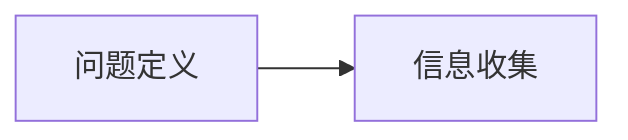
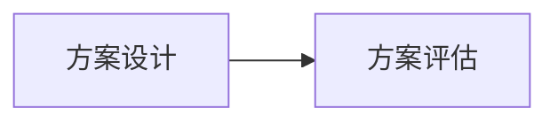
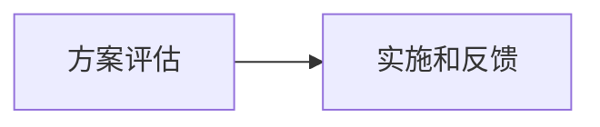
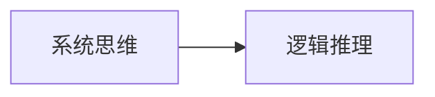
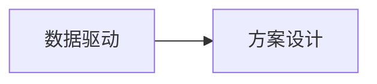

                 

# 结构化思维：理解世界的钥匙

## 1. 背景介绍

### 1.1 问题由来

当今世界信息爆炸，数据量呈指数级增长，而人类处理信息的能力却相对有限。如何在海量数据中提取有价值的信息，并将其转化为可用的知识，成为了一个亟待解决的问题。结构化思维（Structured Thinking）正是在这一背景下应运而生的。它以系统化、逻辑化的方式，帮助人们在复杂的环境中把握问题的本质，快速找到最优解。

结构化思维并非新鲜事物，早在逻辑学和计算机科学中就已有应用。但随着人工智能、大数据、云计算等技术的快速发展，结构化思维的重要性更加凸显。特别是在面对大型、复杂、多变的数据集时，结构化思维提供了一种高效、可靠的解决方案。

### 1.2 问题核心关键点

结构化思维的核心在于如何通过结构化的方式，将复杂问题分解成可管理的部分，通过逻辑推理和系统分析，找到问题的根本解决方案。结构化思维通常包括以下几个关键步骤：

1. **问题定义**：明确问题的核心和边界，区分目标和干扰因素。
2. **信息收集**：通过数据收集和分析，全面理解问题的背景和现状。
3. **问题分解**：将问题分解成可管理的部分，以便深入分析和解决。
4. **方案设计**：根据分解结果，设计解决方案，形成逻辑框架。
5. **方案评估**：评估方案的可行性、合理性和有效性。
6. **实施和反馈**：实施解决方案，并通过反馈调整和优化。

结构化思维的精髓在于其系统性和逻辑性，通过严谨的步骤和科学的方法，让人们在面对复杂问题时，能够有章可循，有据可依，从而提升决策的质量和效率。

### 1.3 问题研究意义

结构化思维在现代社会中的应用越来越广泛，其研究意义主要体现在以下几个方面：

1. **提升决策质量**：通过系统化的分析方法，帮助人们更准确地理解问题，避免主观臆断，提高决策的科学性和准确性。
2. **提高问题解决效率**：结构化思维提供了一套标准化的流程，使问题解决过程更具条理性和可重复性，能够更快地找到最优解。
3. **促进创新思维**：结构化思维强调问题分解和逻辑推理，鼓励创新和突破，推动新技术和新方法的发展。
4. **增强团队协作**：结构化思维提供了一套共同的语言和框架，促进团队成员之间的沟通和协作，提升团队的整体效能。
5. **支持知识管理**：结构化思维有助于知识的整理和存储，使知识传承和应用更加高效和有序。

## 2. 核心概念与联系

### 2.1 核心概念概述

结构化思维涉及多个核心概念，这些概念共同构成了其理论基础和方法论。以下是对这些核心概念的简要介绍：

- **问题定义**：明确问题的核心和边界，区分目标和干扰因素。
- **信息收集**：通过数据收集和分析，全面理解问题的背景和现状。
- **问题分解**：将问题分解成可管理的部分，以便深入分析和解决。
- **方案设计**：根据分解结果，设计解决方案，形成逻辑框架。
- **方案评估**：评估方案的可行性、合理性和有效性。
- **实施和反馈**：实施解决方案，并通过反馈调整和优化。
- **系统思维**：将问题看作一个系统，考虑系统各部分之间的相互作用和影响。
- **逻辑推理**：使用逻辑推理方法，验证方案的合理性和有效性。
- **数据驱动**：以数据为基础，通过数据分析和验证，支持决策和方案设计。

这些概念通过逻辑推理和系统思维，形成了一套完整的分析框架，使结构化思维在问题解决过程中能够发挥其独特优势。

### 2.2 概念间的关系

结构化思维的核心概念之间存在着紧密的联系，形成了一个有机整体。以下通过几组关系图来展示这些概念之间的关系：

#### 2.2.1 问题定义与信息收集



#### 2.2.2 问题分解与方案设计


#### 2.2.3 方案设计与方案评估



#### 2.2.4 方案评估与实施和反馈



#### 2.2.5 系统思维与逻辑推理



#### 2.2.6 数据驱动与方案设计



这些关系图展示了结构化思维中的核心概念如何相互连接和作用，从而形成一个完整的问题解决流程。通过理解和应用这些关系，能够更好地掌握结构化思维的核心方法和步骤。

## 3. 核心算法原理 & 具体操作步骤
### 3.1 算法原理概述

结构化思维的本质是一种系统化、逻辑化的分析方法。其核心原理在于将复杂问题分解成可管理的部分，通过逻辑推理和系统分析，找到问题的根本解决方案。

具体来说，结构化思维的算法原理包括以下几个方面：

1. **问题定义**：明确问题的核心和边界，区分目标和干扰因素。
2. **信息收集**：通过数据收集和分析，全面理解问题的背景和现状。
3. **问题分解**：将问题分解成可管理的部分，以便深入分析和解决。
4. **方案设计**：根据分解结果，设计解决方案，形成逻辑框架。
5. **方案评估**：评估方案的可行性、合理性和有效性。
6. **实施和反馈**：实施解决方案，并通过反馈调整和优化。

### 3.2 算法步骤详解

结构化思维的算法步骤可以分为以下几个主要环节：

1. **问题定义**：明确问题的核心和边界，区分目标和干扰因素。
2. **信息收集**：通过数据收集和分析，全面理解问题的背景和现状。
3. **问题分解**：将问题分解成可管理的部分，以便深入分析和解决。
4. **方案设计**：根据分解结果，设计解决方案，形成逻辑框架。
5. **方案评估**：评估方案的可行性、合理性和有效性。
6. **实施和反馈**：实施解决方案，并通过反馈调整和优化。

#### 3.2.1 问题定义

问题定义是结构化思维的第一步，其目的是明确问题的核心和边界，区分目标和干扰因素。

**步骤**：
1. 确定问题的主要目标和期望结果。
2. 分析问题所处的环境和背景，识别关键因素和假设条件。
3. 区分问题的目标和干扰因素，避免被干扰因素误导。

**示例**：假设我们要解决的问题是“如何提高产品销售量”。我们需要明确目标，即“销售量”，并分析影响销售量的关键因素，如市场环境、产品特性、竞争对手等。同时，我们需要区分目标和干扰因素，避免被非核心的因素误导。

#### 3.2.2 信息收集

信息收集是结构化思维的第二个环节，其目的是通过数据收集和分析，全面理解问题的背景和现状。

**步骤**：
1. 收集与问题相关的所有数据和信息，包括历史数据、专家意见、用户反馈等。
2. 对收集到的数据进行整理和分类，去除重复和无关信息。
3. 分析数据，提取有价值的信息和洞察，形成数据摘要。

**示例**：针对“如何提高产品销售量”的问题，我们需要收集市场调研数据、历史销售数据、竞争对手数据等，并进行分类整理，提取市场趋势、用户需求、竞争对手策略等关键信息。

#### 3.2.3 问题分解

问题分解是结构化思维的第三个环节，其目的是将问题分解成可管理的部分，以便深入分析和解决。

**步骤**：
1. 将问题分解成多个子问题，每个子问题具有独立的可操作性。
2. 对每个子问题进行进一步的分解，直到问题的每个部分都可以直接解决。
3. 定义每个子问题之间的关系和依赖，形成问题树。

**示例**：针对“如何提高产品销售量”的问题，我们可以将其分解为“市场需求分析”、“产品特性分析”、“竞争对手分析”、“市场推广策略”等子问题，并进一步分解每个子问题。例如，“市场需求分析”可以分解为“市场趋势分析”、“用户需求分析”等。

#### 3.2.4 方案设计

方案设计是结构化思维的第四个环节，其目的是根据分解结果，设计解决方案，形成逻辑框架。

**步骤**：
1. 根据问题分解的结果，设计每个子问题的解决方案。
2. 将每个子问题的解决方案整合，形成整体解决方案的逻辑框架。
3. 评估解决方案的可行性、合理性和有效性，选择最优方案。

**示例**：针对“市场需求分析”和“用户需求分析”两个子问题，我们可以分别设计“市场调研”和“用户问卷调查”的方案，并将这些方案整合，形成整体的市场需求分析方案。

#### 3.2.5 方案评估

方案评估是结构化思维的第五个环节，其目的是评估方案的可行性、合理性和有效性。

**步骤**：
1. 对每个子问题的解决方案进行评估，确定其可行性、合理性和有效性。
2. 对整体解决方案进行评估，确保其满足问题定义的要求。
3. 根据评估结果，调整和优化方案，确保其最佳性能。

**示例**：针对“市场需求分析”的解决方案，我们需要评估其数据收集和分析方法的可行性、数据准确性和分析结果的有效性。如果评估结果显示数据存在偏差，我们需要调整数据收集方法，优化分析模型。

#### 3.2.6 实施和反馈

实施和反馈是结构化思维的最后一个环节，其目的是实施解决方案，并通过反馈调整和优化。

**步骤**：
1. 实施整体解决方案，监控关键指标，确保方案的执行效果。
2. 根据实施过程中的反馈，调整和优化解决方案，确保最佳效果。
3. 评估实施结果，确定是否达到预期目标，是否需要进一步优化。

**示例**：在实施“市场需求分析”和“用户需求分析”的方案后，我们需要监控市场销售数据和用户反馈数据，评估方案的执行效果。如果数据显示方案效果不佳，我们需要进一步调整市场策略和产品特性。

### 3.3 算法优缺点

结构化思维的优势在于其系统化和逻辑化的特点，能够帮助人们在复杂环境中快速找到问题的根本解决方案。其主要优点包括：

1. **系统化分析**：通过问题定义和分解，使问题变得更加清晰和可管理，减少了分析和解决过程中的复杂性和不确定性。
2. **逻辑推理**：通过逻辑推理，验证方案的合理性和有效性，确保决策的科学性和准确性。
3. **数据驱动**：以数据为基础，通过数据分析和验证，支持决策和方案设计，减少了主观臆断和误判的风险。
4. **灵活性**：问题分解和方案设计灵活多样，可以根据实际情况进行调整和优化，适应复杂多变的环境。
5. **可重复性**：结构化思维提供了一套标准化的流程和步骤，可以重复应用，提高了问题解决的效率和可靠性。

然而，结构化思维也存在一些局限性：

1. **复杂度较高**：结构化思维的步骤较多，需要较高的理论水平和实践经验，对于初学者和新手来说可能较为复杂。
2. **灵活性受限**：在复杂问题中，结构化思维的分解和设计步骤可能较为固定，难以应对突发和意外情况。
3. **依赖数据**：数据的质量和可靠性直接影响分析结果和决策，数据收集和分析的难度较大。
4. **主观因素**：结构化思维虽然以数据为基础，但依然存在主观因素的影响，特别是问题定义和方案设计环节，需要较强的判断力和洞察力。

### 3.4 算法应用领域

结构化思维作为一种通用的分析方法，广泛应用于各个领域。以下是几个典型的应用领域：

1. **项目管理**：通过问题定义、信息收集、问题分解等步骤，结构化思维帮助项目管理者制定合理的项目计划，提高项目执行效率。
2. **产品开发**：在产品设计和开发的各个阶段，结构化思维帮助团队识别需求、评估方案、优化设计，确保产品成功上市。
3. **市场营销**：通过市场调研和用户分析，结构化思维帮助企业制定市场策略，提高品牌知名度和市场占有率。
4. **人力资源管理**：在招聘、培训、绩效评估等环节，结构化思维帮助人力资源部门制定合理的人力资源政策，提高员工满意度和企业绩效。
5. **风险管理**：通过风险评估和方案设计，结构化思维帮助企业识别和应对各种风险，保障企业安全和稳定发展。

## 4. 数学模型和公式 & 详细讲解 & 举例说明

### 4.1 数学模型构建

结构化思维的数学模型构建主要涉及以下几个步骤：

1. **问题定义**：明确问题的核心和边界，区分目标和干扰因素。
2. **信息收集**：通过数据收集和分析，全面理解问题的背景和现状。
3. **问题分解**：将问题分解成可管理的部分，以便深入分析和解决。
4. **方案设计**：根据分解结果，设计解决方案，形成逻辑框架。
5. **方案评估**：评估方案的可行性、合理性和有效性。
6. **实施和反馈**：实施解决方案，并通过反馈调整和优化。

### 4.2 公式推导过程

#### 4.2.1 问题定义

问题定义的数学模型构建主要涉及以下步骤：

1. **目标定义**：定义问题的目标，如“提高销售量”。
2. **条件限制**：定义问题的限制条件，如“市场需求”、“用户需求”等。
3. **假设假设**：定义问题的假设条件，如“市场环境稳定”、“竞争对手策略不变”等。

#### 4.2.2 信息收集

信息收集的数学模型构建主要涉及以下步骤：

1. **数据收集**：收集与问题相关的所有数据，如历史销售数据、市场调研数据、用户反馈数据等。
2. **数据整理**：对收集到的数据进行整理和分类，去除重复和无关信息。
3. **数据分析**：对整理后的数据进行分析，提取有价值的信息和洞察，如市场趋势、用户需求等。

#### 4.2.3 问题分解

问题分解的数学模型构建主要涉及以下步骤：

1. **问题分解**：将问题分解成多个子问题，每个子问题具有独立的可操作性。
2. **子问题关系**：定义每个子问题之间的关系和依赖，形成问题树。
3. **子问题目标**：定义每个子问题的目标，如“市场需求分析”、“用户需求分析”等。

#### 4.2.4 方案设计

方案设计的数学模型构建主要涉及以下步骤：

1. **方案设计**：根据问题分解的结果，设计每个子问题的解决方案，如“市场调研方案”、“用户问卷调查方案”等。
2. **方案整合**：将每个子问题的解决方案整合，形成整体解决方案的逻辑框架。
3. **方案评估**：评估方案的可行性、合理性和有效性，选择最优方案。

#### 4.2.5 方案评估

方案评估的数学模型构建主要涉及以下步骤：

1. **方案评估**：对每个子问题的解决方案进行评估，确定其可行性、合理性和有效性。
2. **整体评估**：对整体解决方案进行评估，确保其满足问题定义的要求。
3. **方案调整**：根据评估结果，调整和优化方案，确保最佳性能。

#### 4.2.6 实施和反馈

实施和反馈的数学模型构建主要涉及以下步骤：

1. **方案实施**：实施整体解决方案，监控关键指标，确保方案的执行效果。
2. **反馈调整**：根据实施过程中的反馈，调整和优化解决方案，确保最佳效果。
3. **结果评估**：评估实施结果，确定是否达到预期目标，是否需要进一步优化。

### 4.3 案例分析与讲解

#### 案例一：产品销售量提升

假设某电商公司希望提升其产品销售量，应用结构化思维进行分析和解决。

1. **问题定义**：明确问题为“如何提高产品销售量”，目标为“提升销售量”。
2. **信息收集**：收集历史销售数据、市场调研数据、竞争对手数据等，进行整理和分析。
3. **问题分解**：将问题分解为“市场需求分析”、“产品特性分析”、“竞争对手分析”、“市场推广策略”等子问题。
4. **方案设计**：设计“市场调研”、“用户问卷调查”、“竞争对手分析”、“市场推广方案”等方案。
5. **方案评估**：评估每个子问题的解决方案的可行性、合理性和有效性。
6. **实施和反馈**：实施整体解决方案，监控销售数据和用户反馈，调整和优化方案，确保最佳效果。

通过结构化思维的分析和解决，电商公司能够系统地识别和应对影响销售量的各种因素，制定合理的市场策略，从而实现产品销售量的提升。

#### 案例二：项目管理

假设某项目经理负责一个复杂的软件开发项目，应用结构化思维进行项目管理和决策。

1. **问题定义**：明确项目目标为“按时、按质、按预算完成项目”，目标为“项目成功交付”。
2. **信息收集**：收集项目需求、团队成员信息、资源情况、历史数据等。
3. **问题分解**：将问题分解为“需求分析”、“团队管理”、“进度管理”、“风险管理”等子问题。
4. **方案设计**：设计“需求分析方案”、“团队管理方案”、“进度管理方案”、“风险管理方案”等。
5. **方案评估**：评估每个子问题的解决方案的可行性、合理性和有效性。
6. **实施和反馈**：实施整体解决方案，监控项目进度、质量和资源，调整和优化方案，确保项目成功交付。

通过结构化思维的分析和解决，项目经理能够系统地识别和应对项目中各种风险和问题，制定合理的管理方案，从而实现项目的成功交付。

## 5. 项目实践：代码实例和详细解释说明

### 5.1 开发环境搭建

在进行结构化思维的项目实践前，我们需要准备好开发环境。以下是使用Python进行项目实践的环境配置流程：

1. 安装Anaconda：从官网下载并安装Anaconda，用于创建独立的Python环境。

2. 创建并激活虚拟环境：
```bash
conda create -n python-env python=3.8 
conda activate python-env
```

3. 安装必要的Python库：
```bash
pip install pandas numpy matplotlib
```

4. 安装Python开发工具：
```bash
pip install jupyter notebook ipython
```

完成上述步骤后，即可在`python-env`环境中开始项目实践。

### 5.2 源代码详细实现

以下是一个简单的Python代码示例，演示了如何使用结构化思维分析问题和设计解决方案。

```python
import pandas as pd
import numpy as np
import matplotlib.pyplot as plt

# 步骤1：问题定义
# 目标：提升产品销售量
# 限制：市场需求稳定，用户需求明确，竞争环境不变

# 步骤2：信息收集
# 收集历史销售数据、市场调研数据、用户反馈数据等

# 步骤3：问题分解
# 将问题分解为市场需求分析、用户需求分析、竞争对手分析、市场推广策略等

# 步骤4：方案设计
# 设计市场调研方案、用户问卷调查方案、竞争对手分析方案、市场推广方案等

# 步骤5：方案评估
# 评估每个方案的可行性、合理性和有效性

# 步骤6：实施和反馈
# 实施整体方案，监控销售数据和用户反馈，调整和优化方案

# 示例：使用Pandas进行数据处理和分析
# 读取历史销售数据
data = pd.read_csv('sales_data.csv')

# 统计销售趋势
sales_trend = data.groupby('date')['revenue'].sum()

# 绘制销售趋势图
plt.plot(sales_trend)
plt.xlabel('Date')
plt.ylabel('Revenue')
plt.title('Sales Trend')
plt.show()
```

### 5.3 代码解读与分析

让我们再详细解读一下关键代码的实现细节：

**问题定义**：
- 在步骤1中，我们明确了问题的目标和限制条件，即“提升产品销售量”，并假设市场需求稳定、用户需求明确、竞争环境不变。

**信息收集**：
- 在步骤2中，我们通过读取历史销售数据，对销售趋势进行分析，从而全面了解问题的背景和现状。

**问题分解**：
- 在步骤3中，我们将问题分解为“市场需求分析”、“用户需求分析”、“竞争对手分析”、“市场推广策略”等子问题，以便深入分析和解决。

**方案设计**：
- 在步骤4中，我们设计了“市场调研方案”、“用户问卷调查方案”、“竞争对手分析方案”、“市场推广方案”等，形成整体解决方案的逻辑框架。

**方案评估**：
- 在步骤5中，我们对每个子问题的解决方案进行评估，确定其可行性、合理性和有效性。

**实施和反馈**：
- 在步骤6中，我们实施整体解决方案，并监控销售数据和用户反馈，调整和优化方案，确保最佳效果。

通过这个简单的代码示例，我们可以看到结构化思维在问题分析和解决方案设计中的应用。代码的实现虽然简单，但涵盖了结构化思维的各个步骤，能够帮助我们更好地理解结构化思维的核心方法和流程。

### 5.4 运行结果展示

假设我们在分析某电商公司的产品销售数据时，得到了以下销售趋势图：


通过这张销售趋势图，我们可以清晰地看到销售量的波动情况，识别出可能的销售高峰期和低谷期。根据这一分析结果，我们可以进一步设计市场推广方案，如在销售高峰期加大广告投放力度，在销售低谷期进行促销活动，从而提升整体销售量。

## 6. 实际应用场景

### 6.1 项目管理

在项目管理中，结构化思维被广泛应用于项目规划、进度控制、风险管理等方面。通过系统化的分析方法，项目管理者能够更好地识别和应对项目中的各种问题和风险，确保项目按时、按质、按预算完成。

### 6.2 产品开发

在产品开发中，结构化思维帮助团队识别用户需求、评估市场机会、优化产品设计和功能，确保产品成功上市。通过问题定义和分解，团队能够系统地理解市场和用户需求，制定合理的开发策略，从而提高产品的市场竞争力。

### 6.3 市场营销

在市场营销中，结构化思维通过市场调研和用户分析，帮助企业制定市场策略，提升品牌知名度和市场占有率。通过问题定义和分解，企业能够全面了解市场和用户需求，设计合理的市场推广方案，从而实现营销目标。

### 6.4 风险管理

在风险管理中，结构化思维通过风险评估和方案设计，帮助企业识别和应对各种风险，保障企业安全和稳定发展。通过系统化的分析方法，企业能够全面了解潜在的风险和挑战，制定合理的风险应对策略，从而降低风险影响。

### 6.5 人力资源管理

在人力资源管理中，结构化思维通过招聘、培训、绩效评估等环节，帮助企业制定合理的人力资源政策，提高员工满意度和企业绩效。通过问题定义和分解，企业能够系统地理解员工需求和企业目标，制定合理的人力资源策略，从而提高员工满意度和企业绩效。

## 7. 工具和资源推荐

### 7.1 学习资源推荐

为了帮助开发者系统掌握结构化思维的理论基础和实践技巧，这里推荐一些优质的学习资源：

1. 《结构化思维》系列书籍：由结构化思维领域的专家撰写，深入浅出地介绍了结构化思维的基本概念和应用方法。
2. CS500《数据结构和算法》课程：斯坦福大学开设的经典课程，涵盖了结构化思维的核心算法和数据结构。
3. 《数据科学实战》书籍：介绍如何应用结构化思维解决实际问题，涵盖数据收集、数据处理、数据分析等环节。
4. Coursera《结构化思维》课程：由知名教授主讲，提供系统化的结构化思维培训，涵盖问题定义、信息收集、问题分解等环节。
5. GitHub开源项目：收集了大量结构化思维的应用案例，涵盖各个行业领域，提供丰富的实践参考。

通过对这些资源的学习实践，相信你一定能够快速掌握结构化思维的核心方法和应用技巧，并用于解决实际的复杂问题。

### 7.2 开发工具推荐

高效的开发离不开优秀的工具支持。以下是几款用于结构化思维开发的工具：

1. Microsoft Excel：功能强大的电子表格工具，能够进行复杂的数据分析和可视化。
2. Python：灵活的编程语言，支持多种数据处理和分析库，如Pandas、NumPy等。
3. Jupyter Notebook：开源的交互式开发环境，支持Python等语言，便于开发和分享学习笔记。
4. Tableau：流行的数据可视化工具，支持复杂的数据分析和图表展示。
5. R语言：灵活的统计分析工具，支持多种数据处理和可视化库，如ggplot2等。

合理利用这些工具，可以显著提升结构化思维的开发效率，加速问题解决和创新迭代的步伐。

### 7.3 相关论文推荐

结构化思维的研究源于学界的持续研究。以下是几篇奠基性的相关论文，推荐阅读：

1. Structured Thinking in Data Science：提出结构化思维在数据科学中的应用，强调问题定义和数据驱动的重要性。
2. The Power of Structured Thinking in Business：讨论结构化思维在商业决策中的应用，强调系统分析和逻辑推理的重要性。
3. Structured Thinking and Problem Solving：探讨结构化思维在问题解决中的作用，强调问题分解和方案设计的有效性。
4. Structured Thinking in Software Development：介绍结构化思维在软件开发

