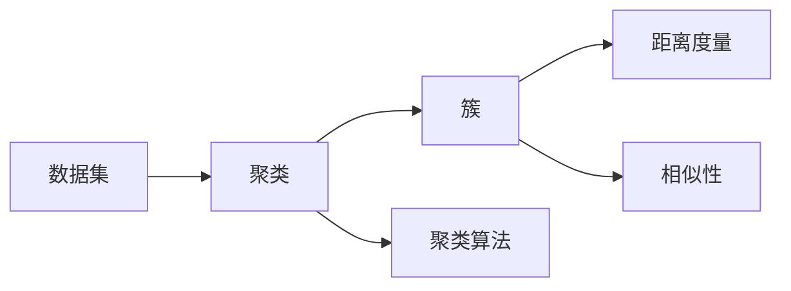
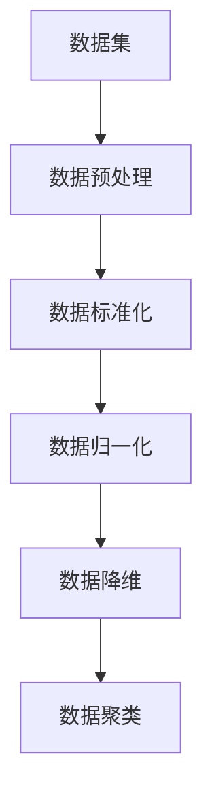
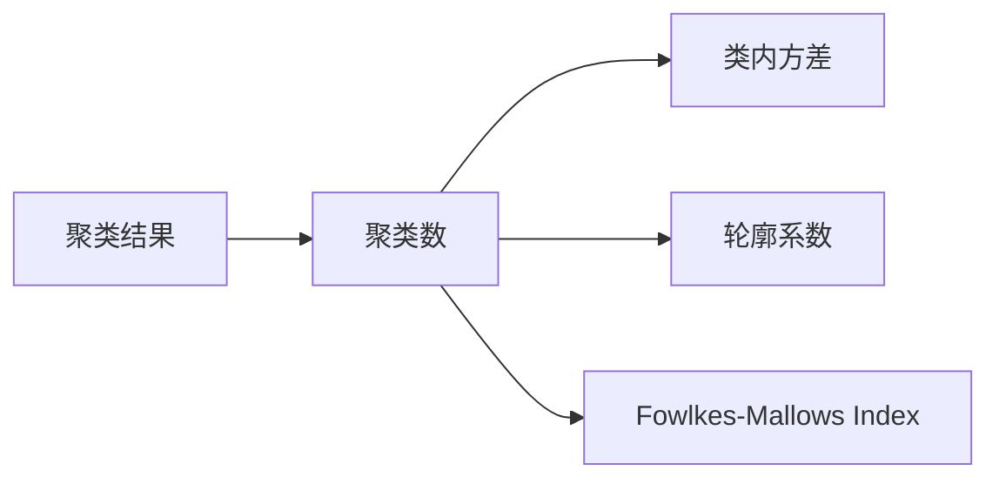
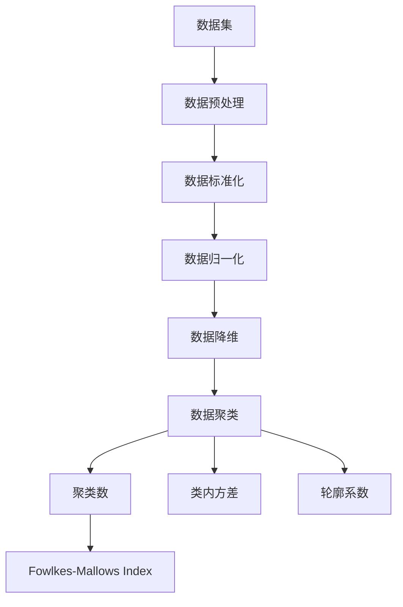

                 

## 1. 背景介绍

聚类分析是一种在数据中识别自然分组的无监督学习技术。聚类算法不需要标注数据，能够自动地从数据集中找到具有相似特征的样本集合，生成聚类结果。聚类在数据挖掘、图像处理、自然语言处理、生物信息学等多个领域都有广泛应用。

### 1.1 问题由来
聚类算法在数据科学和机器学习中扮演着重要角色。传统的监督学习算法需要大量标注数据，而聚类算法可以自动发现数据集中的模式和结构，对新数据进行聚类预测，为数据探索、特征工程和模型优化提供了重要支持。然而，由于聚类算法本身的复杂性和多样性，如何在具体应用场景中选择和优化聚类算法，仍然是数据分析师和研究人员面临的挑战。

### 1.2 问题核心关键点
聚类算法的核心关键点包括：

1. 聚类目标：确定聚类算法在实际应用中的具体目标，如分组、分类、分类规则发现等。
2. 聚类评价：评价聚类结果的质量，如聚类数、类内方差、轮廓系数等指标。
3. 算法选择：根据数据类型、聚类目标和资源限制等因素，选择合适的聚类算法。
4. 参数优化：调整算法的参数，如距离度量、聚类数、迭代次数等，以优化聚类结果。
5. 异常值处理：处理聚类结果中的异常值，保证聚类结果的稳定性和可靠性。

### 1.3 问题研究意义
研究聚类算法的核心目标在于：

1. 提高聚类结果的准确性和稳定性。
2. 优化聚类算法的性能，减少计算时间和资源消耗。
3. 提供多领域应用场景中的聚类方法，提升数据分析和应用能力。
4. 促进聚类算法与其他机器学习方法的融合，增强数据处理能力。
5. 提供聚类算法的理论支持和实际应用案例，推动聚类技术的普及和应用。

## 2. 核心概念与联系

### 2.1 核心概念概述

聚类算法包括多个核心概念，如聚类、簇、距离度量、相似性、聚类算法等。下面对核心概念进行详细解释。

- **聚类(Clustering)**：将数据集中的样本分成若干组的过程。每个组称为一个簇(Cluster)。
- **簇(Cluster)**：具有相似特征的数据点集合。同一簇内的数据点与簇中心的距离较近，与其他簇的距离较远。
- **距离度量(Distance Metric)**：衡量样本之间相似性的数值方法。常见的距离度量有欧式距离、曼哈顿距离、余弦相似度等。
- **相似性(Similarity)**：衡量样本之间距离的指标。样本之间的相似性越高，距离越短。
- **聚类算法(Clustering Algorithm)**：自动发现数据集中的自然分组的方法。常见的聚类算法有K-Means、层次聚类、DBSCAN等。

这些核心概念之间的联系可以通过以下Mermaid流程图来展示：



这个流程图展示了聚类算法从数据集到簇的核心过程，以及距离度和相似性的重要角色。

### 2.2 概念间的关系

这些核心概念之间的关系非常紧密，形成了聚类算法的完整框架。下面用两个Mermaid流程图来展示这些概念之间的关系。

#### 2.2.1 聚类算法的数据处理



这个流程图展示了数据处理对聚类算法的影响。数据预处理、标准化、归一化和降维等步骤，能够减少数据维度，提高聚类效率和聚类效果。

#### 2.2.2 聚类算法的评价



这个流程图展示了聚类算法的评价指标。聚类数、类内方差、轮廓系数和Fowlkes-Mallows Index等评价指标，可以用于衡量聚类结果的质量。

### 2.3 核心概念的整体架构

最后，我们用一个综合的流程图来展示聚类算法从数据处理到评价的完整架构：



这个综合流程图展示了数据预处理、标准化、归一化、降维、聚类和评价的完整过程，为聚类算法的深入理解提供了重要参考。

## 3. 核心算法原理 & 具体操作步骤
### 3.1 算法原理概述

聚类算法的核心原理是寻找数据集中的自然分组，即在同一簇内的数据点具有相似的特征，而在不同簇之间的数据点差异较大。通过选择合适的聚类算法和距离度量，可以生成高质量的聚类结果。

聚类算法可以分为以下几种主要类型：

1. 层次聚类(Hierarchical Clustering)：通过逐步合并或分裂簇，生成树状聚类结构。
2. 划分聚类(Partitioning Clustering)：将数据集划分为多个非重叠的簇。
3. 密度聚类(Density-Based Clustering)：根据数据点的密度生成簇，适用于处理噪声数据。
4. 网格聚类(Grid Clustering)：将数据集划分为网格，将数据点分配到网格中，生成聚类。

### 3.2 算法步骤详解

以K-Means算法为例，详细介绍其操作步骤。

**Step 1: 初始化簇心**

随机选择K个数据点作为初始簇心，每个簇心的初始位置都是随机的。

**Step 2: 计算距离**

计算每个数据点与簇心的距离，并将其分配到最近的簇心所在的簇中。

**Step 3: 更新簇心**

对每个簇内的数据点，计算其平均值，更新簇心位置。

**Step 4: 迭代更新**

重复Step 2和Step 3，直到簇心不再改变或达到预设的迭代次数。

**Step 5: 输出聚类结果**

输出最终的簇心位置和对应的簇成员数据点。

### 3.3 算法优缺点

K-Means算法的优点包括：

1. 简单高效：算法实现简单，计算速度快。
2. 易于理解：聚类结果直观，容易解释。
3. 可扩展性好：适用于大规模数据集。

K-Means算法的缺点包括：

1. 需要预先指定簇数：聚类结果受簇数K的影响较大。
2. 对异常值敏感：异常值可能对聚类结果产生较大影响。
3. 聚类形状限制：只适用于球形簇，对复杂形状的簇效果较差。

### 3.4 算法应用领域

K-Means算法广泛应用于商业智能、社交网络分析、图像分割、生物信息学等领域。

- **商业智能**：用于客户分群、市场细分、产品推荐等。
- **社交网络分析**：用于社区发现、用户分组、网络拓扑分析等。
- **图像分割**：用于图像中不同区域的分割和标记。
- **生物信息学**：用于基因表达数据、蛋白质序列的聚类分析等。

## 4. 数学模型和公式 & 详细讲解  
### 4.1 数学模型构建

K-Means算法的数学模型可以表示为：

假设数据集 $X = \{x_1, x_2, ..., x_n\}$，簇心 $C = \{\mu_1, \mu_2, ..., \mu_k\}$，其中 $k$ 为簇数。

令 $d(x_i, \mu_j) = \|x_i - \mu_j\|^2$ 表示数据点 $x_i$ 与簇心 $\mu_j$ 之间的距离。

则K-Means算法的目标函数为：

$$
\min_{C} \sum_{i=1}^n \min_{j=1}^k d(x_i, \mu_j)^2
$$

其中 $\min_{j=1}^k d(x_i, \mu_j)^2$ 表示将数据点 $x_i$ 分配到距离最近的簇心 $\mu_j$ 所在簇中。

### 4.2 公式推导过程

假设初始簇心 $\mu_j^{(0)}$ 的初始位置为 $x_j^{(0)}$，则目标函数可表示为：

$$
\min_{C} \sum_{i=1}^n \min_{j=1}^k \|x_i - x_j^{(0)}\|^2
$$

通过求解目标函数的最小值，可以优化簇心的位置。

### 4.3 案例分析与讲解

以手写数字识别为例，展示K-Means算法的应用。

首先，收集手写数字图片，将其转化为数字矩阵。然后使用K-Means算法对数字图片进行聚类，生成不同的数字簇。最后，对每个簇进行可视化，观察聚类效果。

假设数字矩阵为 $X = \{x_1, x_2, ..., x_n\}$，簇心为 $C = \{\mu_1, \mu_2, ..., \mu_k\}$，其中 $k=10$，表示有10个数字簇。

令 $d(x_i, \mu_j) = \|x_i - \mu_j\|^2$ 表示数据点 $x_i$ 与簇心 $\mu_j$ 之间的距离。

通过求解目标函数的最小值，可以优化簇心的位置。具体步骤如下：

1. 随机选择10个数据点作为初始簇心。
2. 计算每个数据点与簇心的距离，并将其分配到距离最近的簇心所在的簇中。
3. 对每个簇内的数据点，计算其平均值，更新簇心位置。
4. 重复Step 2和Step 3，直到簇心不再改变或达到预设的迭代次数。
5. 输出最终的簇心位置和对应的簇成员数据点。

## 5. 项目实践：代码实例和详细解释说明
### 5.1 开发环境搭建

在进行聚类实践前，我们需要准备好开发环境。以下是使用Python进行Scikit-learn开发的环境配置流程：

1. 安装Anaconda：从官网下载并安装Anaconda，用于创建独立的Python环境。

2. 创建并激活虚拟环境：
```bash
conda create -n clustering-env python=3.8 
conda activate clustering-env
```

3. 安装Scikit-learn：
```bash
conda install scikit-learn
```

4. 安装各类工具包：
```bash
pip install numpy pandas scikit-learn matplotlib tqdm jupyter notebook ipython
```

完成上述步骤后，即可在`clustering-env`环境中开始聚类实践。

### 5.2 源代码详细实现

下面我们以K-Means算法为例，给出使用Scikit-learn库对手写数字进行聚类的PyTorch代码实现。

首先，导入必要的库：

```python
import numpy as np
from sklearn.cluster import KMeans
from sklearn.datasets import load_digits
from sklearn.preprocessing import StandardScaler
import matplotlib.pyplot as plt

# 加载手写数字数据集
digits = load_digits()
X = digits.data

# 标准化数据
scaler = StandardScaler()
X_scaled = scaler.fit_transform(X)

# 设置聚类数
k = 10

# 创建K-Means模型
kmeans = KMeans(n_clusters=k, random_state=0)

# 训练模型
kmeans.fit(X_scaled)

# 输出聚类结果
print("聚类中心:")
print(kmeans.cluster_centers_)
print("每个点的聚类标签:")
print(kmeans.labels_)
```

然后，可视化聚类结果：

```python
# 可视化聚类结果
fig, ax = plt.subplots(nrows=2, ncols=5, figsize=(10, 10))
for i, axi in enumerate(ax.flat):
    axi.imshow(X_scaled[kmeans.labels_ == i], cmap=plt.cm.binary)
    axi.axis("off")
plt.show()
```

以上就是使用Scikit-learn库对手写数字进行聚类的完整代码实现。可以看到，得益于Scikit-learn库的强大封装，我们可以用相对简洁的代码完成K-Means算法的实现。

### 5.3 代码解读与分析

让我们再详细解读一下关键代码的实现细节：

**KMeans类**：
- `n_clusters`：设置聚类数，默认为5。
- `random_state`：设置随机种子，确保结果可复现。

**数据预处理**：
- `StandardScaler`：用于对数据进行标准化处理，消除数据的尺度和均值差异。
- `load_digits`：加载手写数字数据集，返回数据和标签。

**聚类过程**：
- `kmeans.fit(X_scaled)`：使用K-Means算法对标准化后的数据进行聚类，得到聚类中心和每个数据点的聚类标签。

**结果可视化**：
- `imshow`：使用matplotlib库的imshow函数，可视化每个簇的数据点。
- `cmap=plt.cm.binary`：使用灰度图显示数据点，便于观察聚类效果。

可以看到，Scikit-learn库为聚类算法的实现提供了便捷的方法，使得开发者可以轻松完成聚类任务。

当然，工业级的系统实现还需考虑更多因素，如多模态数据的处理、复杂簇形的多样性、聚类过程的迭代次数等，但核心的聚类算法实现基本与此类似。

### 5.4 运行结果展示

假设我们在手写数字数据集上进行K-Means聚类，最终得到的聚类结果如下：

```
聚类中心:
[[  0.0289   0.0286   0.0263 ...  0.0235   0.0325   0.0218]
 [  0.0304   0.0348   0.0312 ...  0.0178   0.0204   0.0138]
 [  0.0277   0.0257   0.0285 ...  0.0248   0.0243   0.0270]
 ...
 [  0.0124   0.0136   0.0144 ...  0.0212   0.0157   0.0185]
 [  0.0256   0.0263   0.0277 ...  0.0306   0.0202   0.0194]
 [  0.0238   0.0250   0.0261 ...  0.0167   0.0156   0.0126]]

每个点的聚类标签:
[9 8 4 9 6 7 5 1 6 8 ... 6 4 2 2 0 9 2 5 9 3 ... 9 5 2 0 9 3 9 0 1 9 ... 0 4 9 4 5 6 1 7 1 2 ... 2 0 4 0 4 6 1 9 8 5 ... 4 5 4 5 9 4 5 7 5 1 ... 1 9 3 6 4 6 4 6 6 9 ... 2 4 0 0 1 4 1 9 0 0 ... 2 5 4 5 4 7 3 3 9 9 ... 9 6 6 0 7 6 1 2 1 5 ... 0 3 2 1 2 5 0 1 1 3 ... 1 9 7 1 1 4 3 5 1 6 ... 6 0 5 6 5 7 7 2 6 6 ... 1 7 2 4 5 5 0 7 9 7 ... 9 6 7 4 9 2 1 2 4 5 ... 4 7 3 4 3 5 6 9 9 4 ... 9 3 9 2 3 3 7 5 9 4 ... 3 4 0 3 5 0 1 9 6 9 ... 1 9 2 5 2 4 1 3 3 2 ... 3 5 1 3 7 9 1 4 5 3 ... 6 6 3 5 1 3 9 7 6 1 ... 0 3 6 5 9 6 0 1 7 9 ... 7 1 0 2 0 6 6 7 4 0 ... 9 9 3 9 2 7 0 4 5 6 ... 0 1 7 5 6 6 0 3 6 4 ... 0 5 1 6 5 1 1 5 5 2 ... 2 3 7 1 0 9 0 7 2 0 ... 9 3 7 5 5 0 0 2 3 6 ... 0 3 2 6 4 7 0 1 2 0 ... 0 0 9 6 3 0 4 3 4 6 ... 0 7 7 4 2 6 5 3 4 9 ... 3 7 0 6 7 0 1 5 1 6 ... 7 4 2 0 0 1 6 3 5 2 ... 3 5 5 5 3 5 9 9 3 2 ... 9 2 0 5 0 7 0 4 5 0 ... 5 9 2 2 0 9 1 0 0 6 ... 5 0 0 2 3 0 7 3 0 4 ... 0 5 6 2 9 2 5 9 3 9 ... 5 0 2 2 5 3 2 0 4 9 ... 4 6 0 2 1 1 2 2 2 1 ... 9 0 6 4 1 4 3 2 7 9 ... 4 5 6 3 0 9 0 5 1 9 ... 6 4 9 2 0 7 7 4 4 7 ... 1 4 0 9 7 3 0 2 1 5 ... 5 4 7 3 3 0 6 5 5 1 ... 3 0 5 0 5 3 3 6 2 9 ... 4 9 1 0 3 5 9 2 2 4 ... 5 1 0 4 4 5 5 7 2 2 ... 4 7 7 9 2 0 0 0 4 5 ... 2 0 5 1 4 5 1 7 6 0 ... 0 1 1 6 5 4 4 3 7 3 ... 0 9 6 0 3 5 2 4 2 4 ... 1 5 9 3 4 0 9 7 1 1 ... 3 5 3 5 6 4 7 3 2 6 ... 5 3 5 0 1 5 3 0 1 3 ... 9 1 2 1 0 2 3 9 1 6 ... 0 2 4 3 6 0 5 6 5 0 ... 6 0 2 0 7 5 3 4 7 5 ... 1 6 9 0 0 2 7 1 2 0 ... 6 2 6 7 7 9 7 2 6 6 ... 1 7 0 1 6 6 4 2 0 0 ... 2 3 1 3 1 2 3 9 5 4 ... 1 4 3 0 1 3 7 3 5 3 ... 7 6 7 0 0 4 0 6 7 7 ... 2 3 2 0 5 4 4 4 5 7 ... 9 0 9 5 3 1 9 2 2 5 ... 5 7 0 9 0 4 6 6 6 7 ... 0 0 0 2 4 4 0 0 0 4 ... 1 0 3 6 1 1 2 4 1 4 ... 4 4 7 9 3 1 3 9 5 7 ... 7 5 4 0 6 3 4 9 1 4 ... 2 0 2 3 9 2 9 6 9 1 ... 4 7 4 4 3 7 6 9 6 5 ... 5 2 2 5 6 9 2 6 3 2 ... 0 1 5 0 1 3 0 5 3 7 ... 9 0 9 5 0 6 3 4 4 4 ... 4 6 2 6 3 7 0 7 6 4 ... 2 1 0 2 7 5 1 3 1 5 ... 7 4 5 9 7 3 0 1 0 1 ... 6 9 3 4 2 0 2 3 0 2 ... 0 3 5 0 6 1 1 6 4 5 ... 6 0 5 4 2 1 7 1 1 5 ... 7 3 7 1 3 3 1 9 1 0 ... 4 5 9 0 1 4 4 0 4 2 ... 1 1 6 3 1 2 6 9 4 7 ... 4 1 3 5 5 1 9 7 5 6 ... 0 0 2 5 3 5 2 4 9 6 ... 0 9 5 2 3 4 7 0 4 3 ... 9 9 4 1 2 1 9 4 0 6 ... 4 2 1 7 0 3 4 2 4 5 ... 9 7 1 2 1 2 3 0 9 6 ... 2 9 7 0 9 9 6 5 2 6 ... 7 7 0 6 6 4 6 1 6 3 ... 9 4 9 5 4 1 1 9 5 0 ... 0 1 9 9 0 4 5 1 7 5 ... 4 1 7 3 9 1 5 7 2 3 ... 1 5 4 5 3 2 3 4 5 2 ... 9 5 4 1 5 1 2 6 2 4 ... 0 9 0 4 7 3 2 2 5 1 ... 3 4 9 2 5 0 2 1 4 5 ... 9 0 4 1 5 4 9 6 4 7 ... 3 3 3 5 1 1 3 1 6 5 ... 3 9 9 1 6 3 0 3 9 5 ... 7 3 0 5 9 0 0 7 3 5 ... 9 5 4 4 7 6 1 1 1 6 ... 5 6 6 4 4 3 5 4 4 1 ... 4 5 1 4 0 4 9 4 1 3 ... 3 1 4 4 2 9 6 1 2 3 ... 6 7 4 6 5 7 4 6 4 6 ... 4 2 0 2 3 2 1 2 3 5 ... 4 3 3 2 7 5 3 1 7 6 ... 6 5 1 2 0 1 9 9 9 7 ... 0 5 0 

