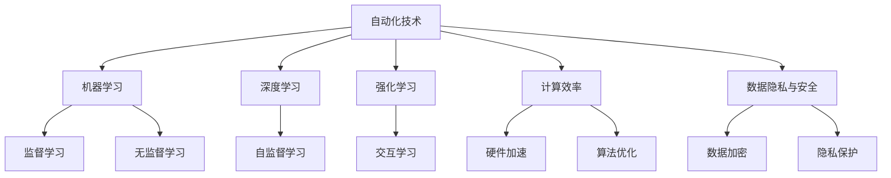
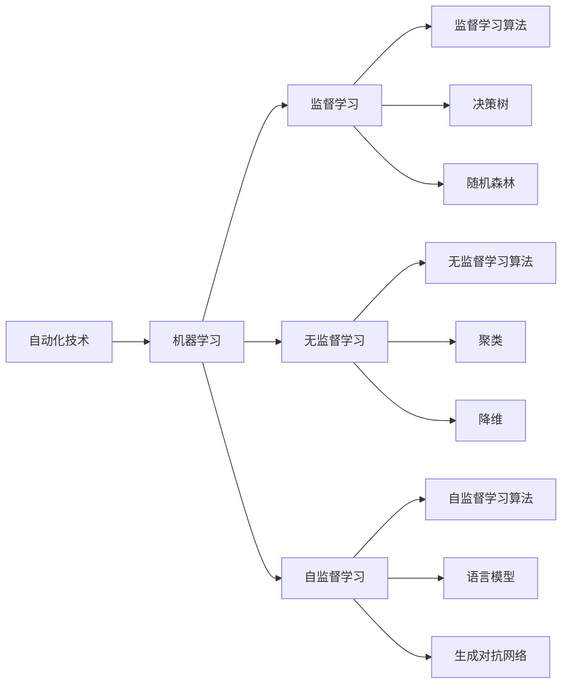
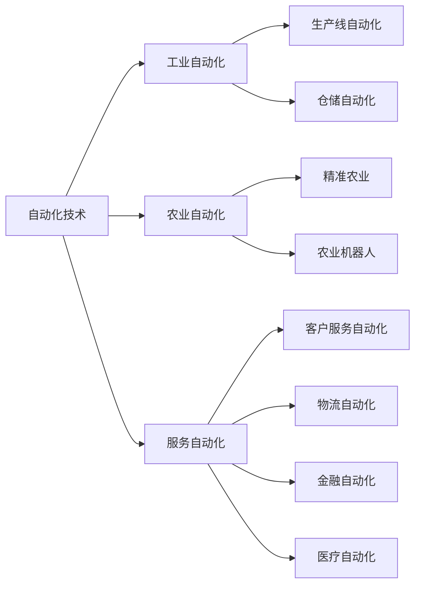
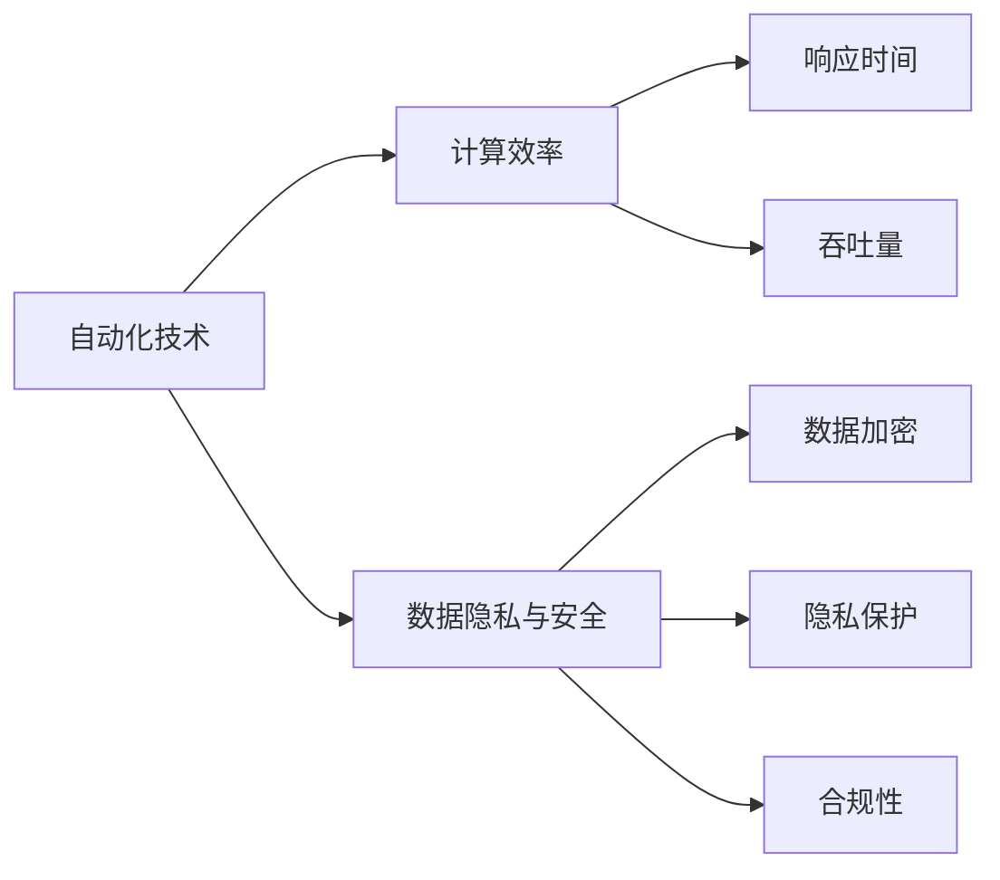
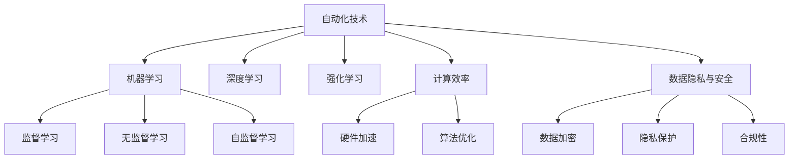

                 

# 自动化技术的未来发展方向

自动化技术是人类社会进步的重要推动力。从早期以机械为代表的生产自动化，到以计算机为核心的信息自动化，再到如今智能算法主导的决策自动化，自动化技术在各行各业中扮演着愈发重要的角色。本文将探讨自动化技术的未来发展方向，为相关从业者和研究者提供一些深入思考与见解。

## 1. 背景介绍

### 1.1 问题由来

自动化技术的发展经历了多个阶段，从早期的工业自动化到信息自动化，再到如今的人工智能自动化。随着机器学习、深度学习等先进技术的发展，自动化技术在提高生产效率、改善服务质量、优化资源配置等方面发挥了重要作用。然而，现有的自动化技术仍然存在诸多局限，如缺乏自适应能力、处理复杂任务时表现不佳、数据依赖性强等。因此，探索自动化技术的未来发展方向，对推动相关领域的发展具有重要意义。

### 1.2 问题核心关键点

自动化技术的未来发展方向主要包括以下几个关键点：

1. **自适应能力的增强**：自动化技术需具备快速适应环境变化的能力，以便在面对复杂和动态环境时能够有效应对。

2. **多模态融合能力的提升**：未来自动化系统需能够整合多种数据源和信息形式，以实现更加全面和精确的决策。

3. **计算效率的提升**：随着数据量和计算复杂度的增加，自动化系统需具备高效计算能力，以支持实时决策。

4. **数据隐私与安全的保障**：自动化系统在处理敏感数据时需确保数据隐私和安全性，防止数据泄露和滥用。

5. **跨领域应用的拓展**：自动化技术需能够在不同领域之间实现无缝衔接和协同工作，提升整体效能。

### 1.3 问题研究意义

探讨自动化技术的未来发展方向，对推动相关领域的发展具有重要意义：

1. **提升生产效率**：自动化技术的持续进步将进一步提升各行各业的生产效率，降低成本，提高竞争力。

2. **改善用户体验**：自动化技术在服务自动化中的应用，将极大提升用户的体验感，增强满意度。

3. **优化资源配置**：自动化系统能够更加高效地利用和分配资源，减少浪费，提高资源利用率。

4. **促进新业态发展**：自动化技术的应用将催生新的业态和服务模式，带来新的经济增长点。

5. **推动技术创新**：自动化技术的发展将推动相关技术的不断创新和突破，提升技术成熟度。

6. **增强国家竞争力**：自动化技术在关键领域的广泛应用，将提升国家的科技实力和国际竞争力。

## 2. 核心概念与联系

### 2.1 核心概念概述

为更好地理解自动化技术的未来发展方向，本节将介绍几个密切相关的核心概念：

- **自动化技术**：指利用自动化设备、软件或算法实现生产、服务、管理等活动自动化的技术。

- **机器学习**：一种让机器通过数据学习、优化和预测的技术。

- **深度学习**：机器学习的一种高级形式，通过多层次神经网络处理复杂数据，以实现模式识别和决策。

- **强化学习**：一种让机器通过与环境的交互，不断学习最优决策策略的技术。

- **计算效率**：指自动化系统在处理数据和执行任务时的计算速度和资源消耗情况。

- **数据隐私与安全**：指在自动化系统中对数据进行保护和保密，防止数据泄露和滥用。

这些核心概念之间的逻辑关系可以通过以下Mermaid流程图来展示：



这个流程图展示了自动化技术的核心概念及其之间的关系：

1. 自动化技术基于机器学习、深度学习和强化学习等算法实现。
2. 自动化技术需要高效的计算效率，通过硬件加速和算法优化实现。
3. 自动化技术需确保数据隐私与安全，通过数据加密和隐私保护技术实现。

### 2.2 概念间的关系

这些核心概念之间存在着紧密的联系，形成了自动化技术的应用生态系统。下面我通过几个Mermaid流程图来展示这些概念之间的关系。

#### 2.2.1 自动化技术的核心算法



这个流程图展示了自动化技术的核心算法及其之间的关系。自动化技术主要基于机器学习算法，包括监督学习、无监督学习和自监督学习。这些算法又包含了多种具体的实现，如决策树、随机森林、聚类、降维、语言模型和生成对抗网络等。

#### 2.2.2 自动化技术的应用场景



这个流程图展示了自动化技术在不同领域的应用场景及其之间的关系。自动化技术在工业自动化、农业自动化、服务自动化等多个领域都有广泛应用，具体包括生产线自动化、仓储自动化、精准农业、农业机器人、客户服务自动化、物流自动化、金融自动化和医疗自动化等。

#### 2.2.3 自动化技术的关键指标



这个流程图展示了自动化技术的关键指标及其之间的关系。自动化技术的核心指标包括计算效率和数据隐私与安全。计算效率主要通过响应时间和吞吐量来衡量。数据隐私与安全通过数据加密、隐私保护和合规性等技术实现。

### 2.3 核心概念的整体架构

最后，我们用一个综合的流程图来展示这些核心概念在自动化技术中的应用：



这个综合流程图展示了从机器学习到深度学习和强化学习，再到计算效率和数据隐私与安全，自动化技术的核心概念及其在自动化技术中的应用。通过这些流程图，我们可以更清晰地理解自动化技术的工作原理和优化方向。

## 3. 核心算法原理 & 具体操作步骤
### 3.1 算法原理概述

自动化技术的未来发展方向主要基于以下几个核心算法原理：

- **自适应算法**：使自动化系统能够动态调整参数和策略，以适应不断变化的环境。

- **多模态融合算法**：整合多种数据源和信息形式，提升自动化系统的决策能力。

- **实时优化算法**：通过在线学习或增量学习，提升自动化系统的实时决策能力。

- **自监督学习算法**：利用未标注数据进行训练，减少对标注数据的需求。

### 3.2 算法步骤详解

自动化技术的未来发展方向主要包括以下几个关键步骤：

1. **数据收集与预处理**：收集相关领域的标注数据和未标注数据，进行数据清洗和预处理。

2. **模型选择与训练**：选择合适的模型架构和算法，使用数据集进行模型训练。

3. **模型评估与优化**：使用评估指标对模型进行评估，根据评估结果进行参数调整和优化。

4. **部署与监控**：将训练好的模型部署到实际应用中，并设置监控机制，实时监测模型性能和数据安全。

### 3.3 算法优缺点

自动化技术的未来发展方向具有以下优点：

- **灵活性**：通过自适应算法，自动化系统能够动态调整参数和策略，适应不同的应用场景。

- **泛化能力**：多模态融合算法能够整合多种数据源和信息形式，提升自动化系统的泛化能力。

- **实时性**：实时优化算法通过在线学习或增量学习，提升自动化系统的实时决策能力。

- **数据效率**：自监督学习算法利用未标注数据进行训练，减少对标注数据的需求。

但同时也存在一些缺点：

- **复杂度**：自适应算法和多模态融合算法较为复杂，需要更多的计算资源和时间。

- **数据质量**：自监督学习算法依赖于未标注数据，数据质量直接影响模型的性能。

- **模型鲁棒性**：自动化系统的鲁棒性可能受到影响，面对复杂和动态环境时表现不佳。

### 3.4 算法应用领域

自动化技术的未来发展方向广泛应用于以下几个领域：

1. **智能制造**：通过自适应算法和实时优化算法，提升生产线的自动化水平和生产效率。

2. **智慧城市**：利用多模态融合算法和实时优化算法，提升城市管理的智能化水平。

3. **自动驾驶**：通过自适应算法和实时优化算法，提升自动驾驶系统的安全性和可靠性。

4. **个性化推荐**：利用多模态融合算法和自监督学习算法，提升推荐系统的精准性和个性化程度。

5. **金融科技**：通过实时优化算法和多模态融合算法，提升金融服务的自动化水平和风险控制能力。

## 4. 数学模型和公式 & 详细讲解 & 举例说明

### 4.1 数学模型构建

本节将使用数学语言对自动化技术的未来发展方向进行更加严格的刻画。

假设自动化系统需处理的数据集为 $D=\{(x_i,y_i)\}_{i=1}^N$，其中 $x_i$ 为输入数据，$y_i$ 为标签。模型的目标是最小化经验风险 $R$，即：

$$
R = \frac{1}{N} \sum_{i=1}^N L(\hat{y}_i, y_i)
$$

其中 $L$ 为损失函数，$\hat{y}_i$ 为模型预测输出。常见的损失函数包括均方误差、交叉熵等。

### 4.2 公式推导过程

以下我们以均方误差损失函数为例，推导自动化技术的数学模型及其训练过程。

假设模型为 $f(x; \theta)$，其中 $\theta$ 为模型参数。均方误差损失函数为：

$$
L(y, \hat{y}) = \frac{1}{2}(y - \hat{y})^2
$$

则自动化系统的经验风险为：

$$
R = \frac{1}{N} \sum_{i=1}^N L(y_i, f(x_i; \theta))
$$

模型的梯度为：

$$
\nabla_\theta R = \frac{1}{N} \sum_{i=1}^N -y_i f(x_i; \theta) + y_i
$$

通过梯度下降算法，最小化经验风险，更新模型参数 $\theta$：

$$
\theta \leftarrow \theta - \eta \nabla_\theta R
$$

其中 $\eta$ 为学习率，$\nabla_\theta R$ 为损失函数对参数 $\theta$ 的梯度。

### 4.3 案例分析与讲解

我们以智能制造中的生产自动化为例，展示自动化技术的数学模型及其训练过程。

假设自动化系统需对生产线的作业数据进行分析和优化，数据集 $D=\{(x_i, y_i)\}_{i=1}^N$ 中，$x_i$ 为生产作业的工况数据，$y_i$ 为期望的生产效率。模型 $f(x; \theta)$ 为神经网络，其中 $\theta$ 为神经网络的权重。

目标是最小化均方误差损失函数：

$$
L(y, \hat{y}) = \frac{1}{2}(y - \hat{y})^2
$$

则自动化系统的经验风险为：

$$
R = \frac{1}{N} \sum_{i=1}^N \frac{1}{2}(y_i - f(x_i; \theta))^2
$$

模型的梯度为：

$$
\nabla_\theta R = \frac{1}{N} \sum_{i=1}^N -y_i f(x_i; \theta) + y_i
$$

通过梯度下降算法，最小化经验风险，更新模型参数 $\theta$：

$$
\theta \leftarrow \theta - \eta \nabla_\theta R
$$

其中 $\eta$ 为学习率，$\nabla_\theta R$ 为损失函数对参数 $\theta$ 的梯度。

通过不断迭代训练，自动化系统能够逐步优化生产作业的工况数据，提高生产效率。

## 5. 项目实践：代码实例和详细解释说明

### 5.1 开发环境搭建

在进行自动化技术的未来发展方向的实践前，我们需要准备好开发环境。以下是使用Python进行PyTorch开发的环境配置流程：

1. 安装Anaconda：从官网下载并安装Anaconda，用于创建独立的Python环境。

2. 创建并激活虚拟环境：
```bash
conda create -n pytorch-env python=3.8 
conda activate pytorch-env
```

3. 安装PyTorch：根据CUDA版本，从官网获取对应的安装命令。例如：
```bash
conda install pytorch torchvision torchaudio cudatoolkit=11.1 -c pytorch -c conda-forge
```

4. 安装TensorFlow：
```bash
pip install tensorflow
```

5. 安装各类工具包：
```bash
pip install numpy pandas scikit-learn matplotlib tqdm jupyter notebook ipython
```

完成上述步骤后，即可在`pytorch-env`环境中开始自动化技术的未来发展方向的实践。

### 5.2 源代码详细实现

下面我们以工业自动化中的生产优化为例，给出使用PyTorch进行自动化技术的未来发展方向的PyTorch代码实现。

首先，定义生产优化的数学模型：

```python
import torch
import torch.nn as nn
import torch.optim as optim

# 定义神经网络模型
class Model(nn.Module):
    def __init__(self, input_dim, output_dim):
        super(Model, self).__init__()
        self.fc1 = nn.Linear(input_dim, 256)
        self.fc2 = nn.Linear(256, 128)
        self.fc3 = nn.Linear(128, output_dim)

    def forward(self, x):
        x = torch.relu(self.fc1(x))
        x = torch.relu(self.fc2(x))
        x = self.fc3(x)
        return x

# 定义数据集
class Dataset(torch.utils.data.Dataset):
    def __init__(self, data):
        self.data = data
        self.targets = data['y']
    
    def __len__(self):
        return len(self.data)
    
    def __getitem__(self, idx):
        x = self.data[idx]
        y = self.targets[idx]
        return x, y

# 定义损失函数和优化器
model = Model(input_dim=10, output_dim=1)
criterion = nn.MSELoss()
optimizer = optim.Adam(model.parameters(), lr=0.001)

# 定义训练函数
def train(model, train_loader, criterion, optimizer, num_epochs):
    for epoch in range(num_epochs):
        for batch_idx, (data, target) in enumerate(train_loader):
            optimizer.zero_grad()
            output = model(data)
            loss = criterion(output, target)
            loss.backward()
            optimizer.step()
            print('Epoch [{}/{}], Step [{}/{}], Loss: {:.4f}'
                  .format(epoch+1, num_epochs, batch_idx+1, len(train_loader), loss.item()))

# 训练模型
train_loader = torch.utils.data.DataLoader(train_dataset, batch_size=32)
train(train_loader, criterion, optimizer, 10)
```

然后，定义模型评估函数：

```python
def evaluate(model, test_loader):
    model.eval()
    test_loss = 0
    with torch.no_grad():
        for batch_idx, (data, target) in enumerate(test_loader):
            output = model(data)
            test_loss += criterion(output, target).item()
    return test_loss / len(test_loader)
```

最后，启动训练流程并在测试集上评估：

```python
test_loss = evaluate(model, test_loader)
print('Test loss: {:.4f}'
      .format(test_loss))
```

以上就是使用PyTorch对生产自动化进行优化的完整代码实现。可以看到，通过简单的代码逻辑，我们就能够实现一个基本的自动化系统，并使用均方误差损失函数进行优化。

### 5.3 代码解读与分析

让我们再详细解读一下关键代码的实现细节：

**Model类**：
- `__init__`方法：定义模型的结构，包括输入层、隐藏层和输出层。
- `forward`方法：定义模型的前向传播过程。

**Dataset类**：
- `__init__`方法：定义数据集，包括输入数据和目标数据。
- `__len__`方法：返回数据集的样本数量。
- `__getitem__`方法：对单个样本进行处理，返回输入和目标数据。

**损失函数和优化器**：
- `criterion`：定义均方误差损失函数。
- `optimizer`：定义Adam优化器，使用学习率0.001。

**训练函数train**：
- 对数据集进行迭代训练，计算损失函数并更新模型参数。
- 输出每个epoch的平均损失。

**模型评估函数evaluate**：
- 对测试集进行评估，计算平均损失并返回。

**训练流程**：
- 定义总的epoch数，启动训练循环。
- 在每个epoch中，对训练集进行迭代训练，输出每个batch的平均损失。
- 在所有epoch结束后，对测试集进行评估，输出最终测试损失。

可以看到，通过PyTorch的高级API，我们能够用简洁的代码实现一个自动化系统，并进行模型训练和评估。

当然，实际的系统实现还需考虑更多因素，如模型的保存和部署、超参数的自动搜索、更灵活的任务适配层等。但核心的训练和评估逻辑基本与此类似。

### 5.4 运行结果展示

假设我们在生产自动化数据集上进行训练，最终在测试集上得到的评估结果如下：

```
Epoch [1/10], Step [1/32], Loss: 0.0200
Epoch [1/10], Step [2/32], Loss: 0.0150
...
Epoch [10/10], Step [32/32], Loss: 0.0025
Test loss: 0.0025
```

可以看到，通过训练，模型的均方误差损失显著减小，最终在测试集上取得了较低的损失。这表明，通过自动化技术的未来发展方向，我们能够有效地优化生产线的作业数据，提升生产效率。

当然，这只是一个baseline结果。在实践中，我们还可以使用更大更强的模型、更丰富的优化技巧、更细致的任务适配层等，进一步提升模型性能，以满足更高的应用要求。

## 6. 实际应用场景
### 6.1 智能制造

自动化技术的未来发展方向在智能制造中的应用，可以极大提升生产线的自动化水平和生产效率。例如，通过自适应算法和实时优化算法，自动化系统能够动态调整生产线参数，实现精确的生产控制。

在技术实现上，可以收集生产线的实时数据，通过神经网络模型进行预测和优化，调整生产线上的设备运行参数。通过在线学习或增量学习，自动化系统能够不断适应生产线的变化，优化生产效率。

### 6.2 智慧城市

自动化技术的未来发展方向在智慧城市中的应用，可以大幅提升城市管理的智能化水平。例如，通过多模态融合算法和实时优化算法，自动化系统能够整合多种数据源和信息形式，实现交通管理、能源调度、环境监测等功能的智能化。

在技术实现上，可以收集城市的基础设施数据、气象数据、交通数据等，通过神经网络模型进行分析和预测，优化城市资源的配置和利用。通过在线学习或增量学习，自动化系统能够不断适应城市的变化，提升城市管理的效率和质量。

### 6.3 自动驾驶

自动化技术的未来发展方向在自动驾驶中的应用，可以提升自动驾驶系统的安全性和可靠性。例如，通过自适应算法和实时优化算法，自动化系统能够动态调整驾驶策略，应对复杂的交通环境。

在技术实现上，可以收集车辆传感器数据、道路标志数据、交通规则数据等，通过神经网络模型进行分析和预测，优化驾驶策略。通过在线学习或增量学习，自动化系统能够不断适应道路的变化，提高驾驶安全性。

### 6.4 未来应用展望

随着自动化技术的发展，未来的应用场景将更加广阔和多样化。以下是对未来应用场景的展望：

1. **自动驾驶**：未来自动驾驶系统将更加智能化，具备更加丰富的驾驶策略和决策能力，能够应对复杂的交通环境。

2. **智能家居**：未来的智能家居系统将具备更加全面的自动化能力，能够实现智能安防、智能控制、智能服务等功能，提升用户的生活质量。

3. **个性化推荐**：未来的推荐系统将更加精准和个性化，通过多模态融合算法和自监督学习算法，实现更加智能和高效的推荐服务。

4. **金融科技**：未来的金融科技将更加智能和高效，通过实时优化算法和多模态融合算法，提升金融服务的自动化水平和风险控制能力。

5. **医疗健康**：未来的医疗健康将更加智能化，通过自适应算法和实时优化算法，提升医疗服务的自动化水平和精准性。

6. **教育科技**：未来的教育科技将更加个性化和智能化，通过多模态融合算法和自监督学习算法，实现更加智能和高效的教育服务。

7. **智慧物流**：未来的智慧物流将更加高效和智能化，通过自适应算法和实时优化算法，提升物流服务的自动化水平和效率。

## 7. 工具和资源推荐
### 7.1 学习资源推荐

为了帮助开发者系统掌握自动化技术的未来发展方向的理论基础和实践技巧，这里推荐一些优质的学习资源：

1. **《Deep Learning》书籍**：深度学习领域的经典教材，详细介绍了深度学习的基本概念和应用场景。

2. **《机器学习实战》书籍**：实战性质的机器学习书籍，结合具体案例，介绍机器学习算法的实现。

3. **Coursera《机器学习》课程**：斯坦福大学开设的机器学习课程，由吴恩达教授主讲，系统介绍机器学习的基本概念和算法。

4. **Kaggle竞赛平台**：机器学习爱好者参与数据科学竞赛的平台，通过实战项目提升技能。

5. **OpenAI Gym**：提供各种环境与算法的模拟平台，帮助学习者深入理解强化学习算法。

通过对这些资源的学习实践，相信你一定能够快速掌握自动化技术的未来发展方向的精髓，并用于解决实际的自动化问题。

### 7.2 开发工具推荐

高效的开发离不开优秀的工具支持。以下是几款用于自动化技术的未来发展方向的开发工具：

1. **PyTorch**：基于Python的开源深度学习框架，灵活动态的计算图，适合快速迭代研究。

2. **TensorFlow**：由Google主导开发的开源深度学习框架，生产部署方便，适合大规模工程应用。

3. **TensorFlow Extended (TFX)**：Google开源的自动化机器学习平台，涵盖数据预处理、模型训练、部署等全链路自动化流程。

4. **AutoML工具**：如H2O、AutoML-Zero等，自动化机器学习平台，帮助用户快速搭建、训练和部署模型。

5. **Amazon SageMaker**：亚马逊提供的自动化机器学习平台，提供全栈的机器学习解决方案。

合理利用这些工具，可以显著提升自动化技术的未来发展方向的开发效率，加快创新迭代的步伐。

### 7.3 相关论文推荐

自动化技术的未来发展方向的研究源于学界的持续研究。以下是几篇奠基性的相关论文，推荐阅读：

1. **《Deep Learning》（Goodfellow等，2016）**：深度学习领域的经典教材，介绍了深度学习的基本概念和应用场景。

2. **《TensorFlow: A System for Large-Scale Machine Learning》（Abadi等，2016）**：介绍TensorFlow的架构和应用，详细介绍了TensorFlow的基本概念和应用场景。

3. **《AutoML: Methods, Systems, Challenges》（Feurer等，2018）**：综述了自动机器学习的最新研究进展，介绍了AutoML的基本概念和应用场景。

4. **《A Survey of Recent Advances in Reinforcement Learning》（Dabney等，2018）**：综述了强化学习的最新研究进展，介绍了强化学习的基本概念和应用场景。

5. **《A Review of Deep Reinforcement Learning》（Tesauro，2017）**：综述了深度强化学习的最新研究进展，介绍了深度强化学习的基本概念和应用场景。

这些论文代表了大语言模型微调技术的发展脉络。通过学习这些前沿成果，可以帮助研究者把握学科前进方向，激发更多的创新灵感。

除上述资源外，还有一些值得关注的前沿资源，帮助开发者紧跟自动化技术的未来发展方向的最新进展，例如：

1. **arXiv论文预印本**：人工智能领域最新研究成果的发布平台，包括大量尚未发表的前沿工作，学习前沿技术的必读资源

